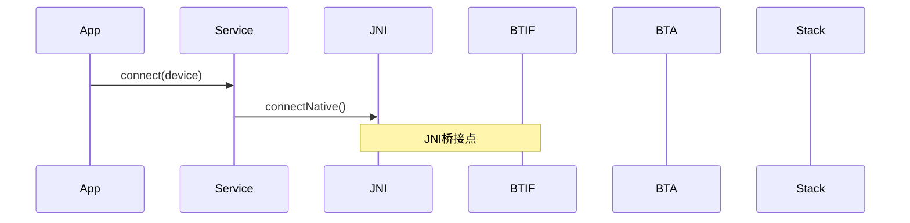
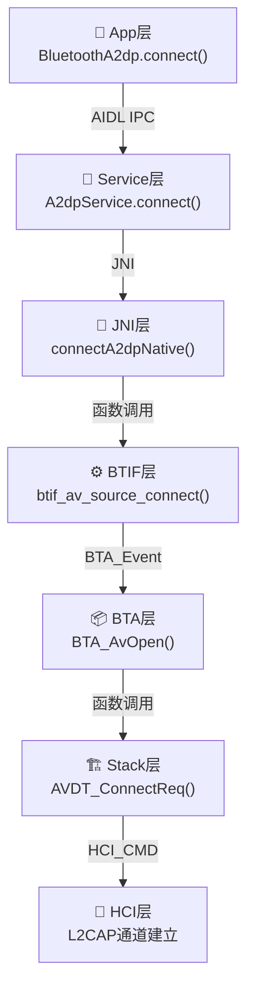
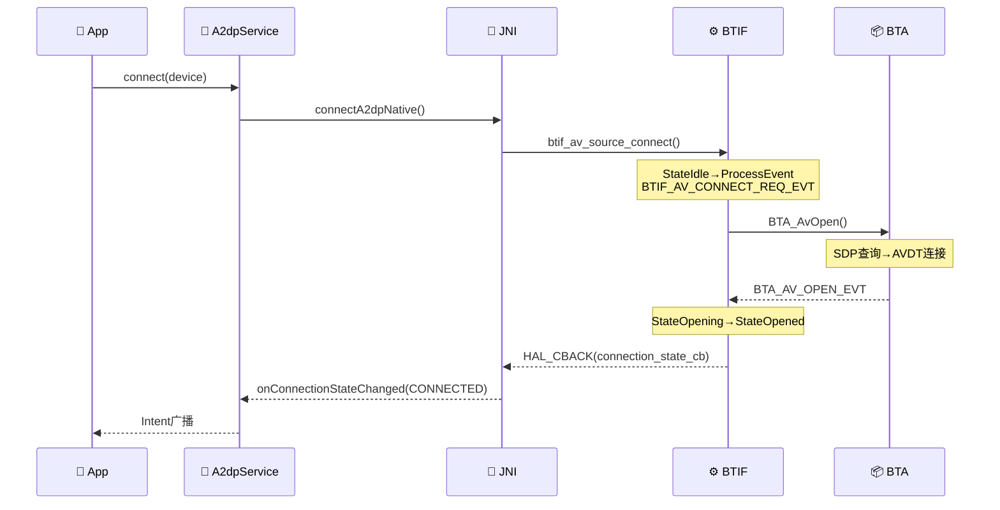
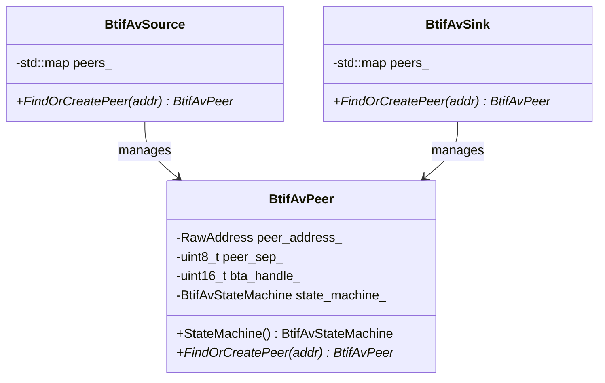
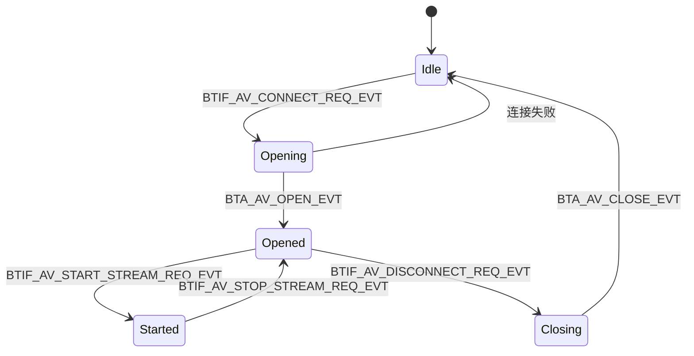

# V2 学习笔记优化标准模板

> 版本：2.0 | 制定日期：2026-05-16
> 目标：让一个C++仅入门基础的Android开发工程师，能对照源码快速上手蓝牙Framework开发

---

## 一、V1 问题诊断

| # | 问题 | 根因 | V2对策 |
|---|------|------|--------|
| 1 | **代码关联弱** | 只列文件路径和函数签名，没有逐行解读 | 每个关键流程必须包含**完整代码片段+逐行注释**，标注源文件行号 |
| 2 | **图表粗糙** | 用ASCII字符画，不专业且无法渲染 | 全部改用**Mermaid**语法（流程图/时序图/类图/状态图） |
| 3 | **C++门槛高** | 假设读者懂模板/智能指针/RAII等 | 遇到C++高级特性必须插入**💡C++知识卡片**，从Java视角类比 |
| 4 | **缺乏实操性** | 只有理论没有动手指导 | 每篇增加**🔍代码导航**和**🛠️动手练习**章节 |
| 5 | **跨层调用链不清晰** | 只写"→BTA→Stack"没有具体函数 | 必须写出**完整函数调用链**，包含文件名:行号 |
| 6 | **缺少Java↔C++映射** | Android开发者不熟悉C++层 | 增加**Java↔C++对照表**，明确JNI桥接点 |
| 7 | **问题定位指导不足** | 只列常见问题没有排查步骤 | 增加**🐛问题排查SOP**，从日志→代码→根因的完整路径 |
| 8 | **缺少数据结构图解** | 结构体只列字段没有内存布局 | 关键结构体用**Mermaid类图**展示，标注字段含义和字节偏移 |

---

## 二、V2 笔记标准结构

每篇笔记必须严格遵循以下结构（章节可按需增减，但核心章节不可省略）：

```markdown
# Txx_标题

> 学习日期：YYYY-MM-DD | 优先级：P0-P3 | 预计学习时间：X小时
> 前置知识：Txx, Txx（必须先学完的笔记）
> 涉及源码目录：system/xxx/, system/yyy/

---

## 📋 本章导读
<!-- 30秒了解本章学什么、为什么学、学完能做什么 -->
- 学什么：一句话概括
- 为什么学：车载场景中的必要性
- 学完能做：能定位/修改/扩展的具体能力

---

## 🗺️ 架构全景图 (Mermaid)
<!-- 必须用Mermaid绘制，至少包含以下之一：
  - 分层架构图 (graph TD)
  - 模块关系图 (graph LR)
  - 类继承图 (classDiagram)
-->

---

## 🔍 代码导航
<!-- 告诉读者打开哪些文件、跳到哪些行、看什么 -->
| 步骤 | 操作 | 文件 | 行号 | 看什么 |
|------|------|------|------|--------|
| 1 | 打开文件 | system/btif/src/btif_av.cc | L3461 | connect_int函数入口 |

---

## 📖 核心流程详解

### X.1 流程名称

<!-- Mermaid时序图 (sequenceDiagram) -->


<!-- 代码逐行解读 -->
**源码追踪**：

```cpp
// 📂 system/btif/src/btif_av.cc:3461
static void connect_int(RawAddress* peer_address, int uuid) {
    // [1] 根据UUID判断Source/Sink角色
    // 💡C++: RawAddress是蓝牙MAC地址的封装类，类似Java的BluetoothDevice
    if (uuid == UUID_SERVCLASS_AUDIO_SOURCE) {
        // [2] 车机作为Sink，连接手机的Source
        // 💡C++: FindOrCreatePeer() 使用了工厂模式，如果peer不存在则new创建
        BtifAvPeer* peer = btif_av_sink.FindOrCreatePeer(*peer_address);
        // [3] 向状态机发送连接请求事件
        // 💡C++: ProcessEvent类似Java StateMachine的sendMessage()
        peer->StateMachine().ProcessEvent(BTIF_AV_CONNECT_REQ_EVT, nullptr);
    }
}
```

---

## 💡 C++知识卡片
<!-- 遇到C++高级特性时插入，从Java开发者视角解释 -->

### 卡片：智能指针 std::unique_ptr / std::shared_ptr
```cpp
// Java等价: 对象引用，GC自动回收
// C++: 没有GC，必须手动管理内存，智能指针是"自动化的手动管理"

std::unique_ptr<Device> device = std::make_unique<Device>(addr);
// unique_ptr = 独占所有权，类似Java的强引用但只能有一个持有者
// 离开作用域自动delete，不需要手动free

std::shared_ptr<Device> device = std::make_shared<Device>(addr);
// shared_ptr = 共享所有权，内部有引用计数，类似Java的引用计数
// 最后一个shared_ptr销毁时自动delete对象
```

---

## 🗂️ Java ↔ C++ 对照表
<!-- 明确JNI桥接点，帮助Android开发者理解跨层调用 -->

| Java层 | JNI桥接 | C++层 |
|--------|---------|-------|
| A2dpService.connect() | com_android_bluetooth_a2dp.cpp: connectA2dpNative() | btif_av.cc: btif_av_source_connect() |
| onConnectionStateChanged() | btif_av.cc: HAL_CBACK(callbacks, connection_state_cb) | A2dpStateMachine: CONNECTED |

---

## 🐛 问题排查SOP
<!-- 从日志→代码→根因的完整排查路径 -->

### 问题：A2DP连接失败
```
步骤1: 查日志
  adb logcat -s bt_btif bt_bta | grep "AV"

步骤2: 定位代码
  搜索日志关键字 → 找到对应的LOG(ERROR)行 → 向上追踪调用链

步骤3: 常见根因
  ① SDP查询超时 → 手机端未注册A2DP SDP记录
  ② 编解码器协商失败 → 检查codec_config优先级
  ③ ACL连接被拒 → 检查ConnectionPolicy
```

---

## 🛠️ 动手练习
<!-- 3个难度级别的实操任务 -->

### 🟢 入门：阅读代码
打开 `system/btif/src/btif_av.cc`，找到 `connect_int` 函数，画出它的调用关系图。

### 🟡 进阶：修改代码
修改 `codec_priority` 让车机优先协商AAC而非SBC。

### 🔴 实战：定位问题
模拟一个A2DP连接超时场景，使用HCI Snoop Log分析断点位置。

---

## 📚 关键源码索引
<!-- 按调用顺序排列，标注行号范围 -->

| 序号 | 文件 | 行号 | 函数/类 | 作用 |
|------|------|------|---------|------|
| 1 | system/btif/src/btif_av.cc | L3461-3491 | connect_int() | 连接入口 |
```

---

## 三、Mermaid图表规范

### 3.1 分层架构图 — 用 `graph TD`



### 3.2 时序图 — 用 `sequenceDiagram`



### 3.3 类图 — 用 `classDiagram`



### 3.4 状态图 — 用 `stateDiagram-v2`



---

## 四、💡C++知识卡片规范

### 4.1 何时插入

遇到以下C++特性时**必须**插入知识卡片：

| C++特性 | Java等价物 | 卡片重点 |
|---------|-----------|---------|
| `std::unique_ptr<T>` | 强引用(GC管理) | 所有权语义、move语义 |
| `std::shared_ptr<T>` | 引用计数 | use_count()、线程安全 |
| `std::weak_ptr<T>` | WeakReference | 打破循环引用 |
| `template<typename T>` | Java泛型<T> | 编译期展开、SFINAE |
| `virtual` 函数 | interface/abstract | 虚表、动态分派 |
| `std::function` | Lambda/Functional Interface | 可调用对象包装 |
| `std::mutex` / `std::lock_guard` | synchronized | RAII锁、死锁避免 |
| `enum class` | Java enum | 强类型枚举 |
| `std::optional<T>` | @Nullable T | 空值语义 |
| `std::variant<A,B>` | Object(受限) | 类型安全联合体 |
| RAII模式 | try-with-resources | 构造获取/析构释放 |
| `static_assert` | 编译期检查 | 模板约束 |
| `#define` 宏 | 无直接等价 | 预处理器、常见陷阱 |
| `extern "C"` | JNI native声明 | C/C++链接规范 |
| `dlsym` | 反射 | 动态加载符号 |

### 4.2 卡片格式

```markdown
### 💡 C++知识卡片：模板 (template)

> 🔄 Java类比：Java泛型 `List<String>` ≈ C++模板 `std::vector<std::string>`
> 但C++模板是**编译期展开**，每个实例化类型生成独立代码

```cpp
// Java: List<String> list = new ArrayList<>();  // 类型擦除，运行时Object
// C++:  std::vector<std::string> vec;            // 编译期生成vector<string>专属代码

template<typename T>          // T是类型参数，类似Java的<T>
class ConfigCacheHelper {
  std::optional<T> Get(const std::string& section, const std::string& key) {
    // 💡 SFINAE: 编译器根据T的类型选择不同的Get实现
    // 这就是为什么同一个函数能同时处理int/string/bool
  }
};

// 使用：
ConfigCacheHelper<int> helper_int;     // 生成int版本
ConfigCacheHelper<std::string> helper_str; // 生成string版本
```

⚠️ 注意：C++模板的错误信息非常长，因为编译器会展开所有实例化代码
```

---

## 五、代码关联强度标准

### 5.1 必须包含的代码关联元素

| 元素 | 格式 | 示例 |
|------|------|------|
| **文件路径** | `system/xxx/yyy.cc` | `system/btif/src/btif_av.cc` |
| **行号** | `:L1234` 或 `:L1234-1256` | `btif_av.cc:L3461` |
| **函数签名** | 完整签名含返回值和参数 | `static void connect_int(RawAddress* peer_address, int uuid)` |
| **代码片段** | 5-20行关键代码+逐行注释 | 见上方模板 |
| **调用链** | `A() → B() → C()` 含文件名 | `btif_av_source_connect() [btif_av.cc:L3545] → connect_int() [btif_av.cc:L3461]` |
| **数据流** | 标注数据在层间传递时的格式变化 | `Java BluetoothDevice → JNI jstring → C++ RawAddress` |

### 5.2 代码片段注释规范

```cpp
// 📂 system/btif/src/btif_av.cc:3461-3491
static void connect_int(RawAddress* peer_address, int uuid) {
    // [1] 🔍 判断角色：UUID_SERVCLASS_AUDIO_SOURCE=车机是Sink
    //     💡C++: 枚举值用全大写+下划线，类似Java的static final int
    if (uuid == UUID_SERVCLASS_AUDIO_SOURCE) {
        // [2] 🏭 工厂方法：找到或创建Peer对象
        //     💡C++: FindOrCreatePeer返回指针，类似Java的getInstance()
        //     ⚠️ 注意：返回的是原始指针，所有权由BtifAvSink管理
        BtifAvPeer* peer = btif_av_sink.FindOrCreatePeer(*peer_address);
        // [3] 📨 发送事件到状态机
        //     💡C++: ProcessEvent类似Java的StateMachine.sendMessage()
        //     第一个参数是事件枚举，第二个是数据(这里为null)
        peer->StateMachine().ProcessEvent(BTIF_AV_CONNECT_REQ_EVT, nullptr);
    }
}
```

注释标记说明：
- `[N]` — 执行步骤编号
- `🔍` — 判断/分支逻辑
- `🏭` — 创建/工厂操作
- `📨` — 消息/事件发送
- `💡C++:` — C++知识点（Java类比）
- `⚠️` — 常见陷阱/注意事项
- `📂` — 文件路径标注

---

## 六、质量检查清单

每篇笔记完成前，必须通过以下检查：

| # | 检查项 | 标准 |
|---|--------|------|
| 1 | Mermaid图 | 至少3个（架构图+时序图+状态图/类图） |
| 2 | 代码片段 | 至少5个带逐行注释的真实代码片段 |
| 3 | C++知识卡片 | 遇到高级C++特性必须插入（每篇至少2个） |
| 4 | Java↔C++对照表 | 每篇必须有，明确JNI桥接点 |
| 5 | 行号标注 | 所有关键函数标注 `文件:行号` |
| 6 | 问题排查SOP | 至少1个，从日志到根因的完整路径 |
| 7 | 动手练习 | 3个难度级别（🟢🟡🔴） |
| 8 | 代码导航表 | 告诉读者打开什么文件、看什么 |
| 9 | 前置知识 | 标注必须先学完的笔记编号 |
| 10 | 车载场景 | 每篇必须关联车载开发实际场景 |

---

## 七、V2优化执行优先级

按以下顺序重写，每篇达标后继续下一篇：

| 批次 | 笔记 | 理由 |
|------|------|------|
| **第1批** | T01, T02, T03 | P0基础，后续所有笔记的前置知识 |
| **第2批** | T08, T09, T10 | P1 A2DP，车载最常用Profile |
| **第3批** | T13, T14, T15 | P2 HFP，车载第二常用 |
| **第4批** | T04, T05, T06, T07 | P0剩余，配对/连接/回调/状态机 |
| **第5批** | T11, T12, T16 | P1 AVRCP + HFP问题定位 |
| **第6批** | T17-T19 | P3 手机互联 |
| **第7批** | T23-T25 | P5 调试 |
| **第8批** | T20-T22 | P4 IoT |
| **第9批** | T26-T29 | P6 车载 |
| **第10批** | T30-T36 | P7+P8 GD/其他Profile |
