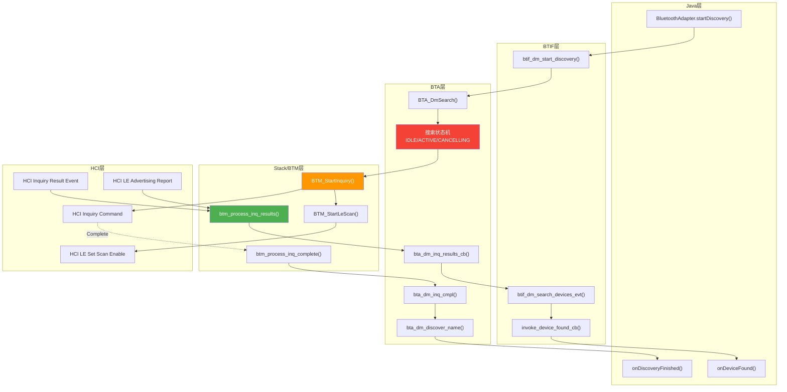
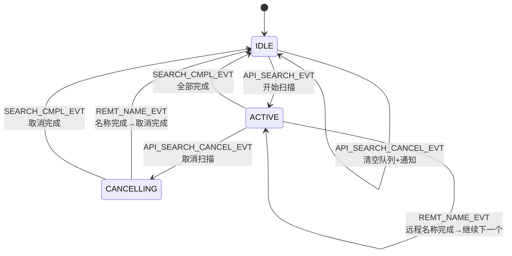
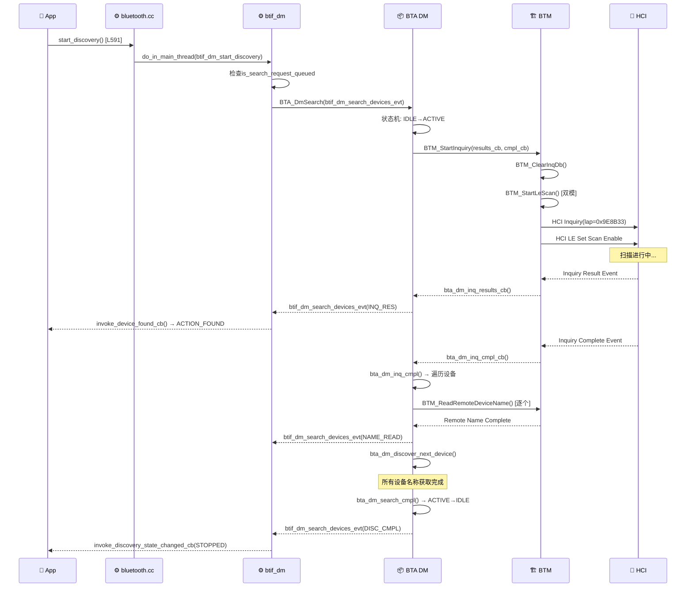
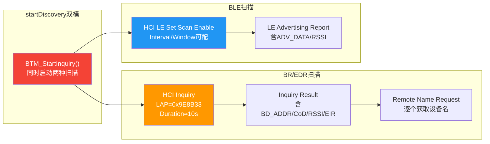

# T03_设备扫描流程详解

> 学习日期：2026-05-16 | 优先级：P0 | 预计学习时间：3小时
> 前置知识：T01（蓝牙整体架构理解）、T02（蓝牙开关流程）
> 涉及源码目录：system/btif/src/, system/bta/dm/, system/stack/btm/

---

## 📋 本章导读

- **学什么**：BR/EDR扫描(Inquiry)和BLE扫描(LE Scan)的完整源码级流程、扫描状态机、结果上报链路、双模扫描机制
- **为什么学**：设备扫描是蓝牙连接的前提，车载场景中扫描不到设备或扫描卡住是最常见的问题
- **学完能做**：
  - 根据日志追踪扫描流程，定位扫描失败/卡住的原因
  - 理解BR/EDR和BLE扫描的差异，选择正确的调试路径
  - 优化扫描参数以减少对音频连接的影响

---

## 🗺️ 架构全景图

### 扫描流程分层架构



### 扫描状态机



---

## 🔍 代码导航

| 步骤 | 操作 | 文件 | 行号 | 看什么 |
|------|------|------|------|--------|
| 1 | 打开文件 | system/btif/src/bluetooth.cc | L591-598 | start_discovery()入口 |
| 2 | 打开文件 | system/btif/src/btif_dm.cc | L2726-2744 | btif_dm_start_discovery() |
| 3 | 打开文件 | system/btif/src/btif_dm.cc | L1346-1609 | btif_dm_search_devices_evt()核心回调 |
| 4 | 打开文件 | system/bta/dm/bta_dm_device_search.cc | L99-119 | bta_dm_search_start() |
| 5 | 打开文件 | system/bta/dm/bta_dm_device_search.cc | L174-223 | bta_dm_inq_results_cb() |
| 6 | 打开文件 | system/bta/dm/bta_dm_device_search.cc | L315-338 | bta_dm_inq_cmpl() |
| 7 | 打开文件 | system/bta/dm/bta_dm_device_search.cc | L782-855 | bta_dm_search_sm_execute()状态机 |
| 8 | 打开文件 | system/bta/dm/bta_dm_device_search.cc | L482-540 | bta_dm_discover_name() |
| 9 | 打开文件 | system/stack/btm/btm_inq.cc | L642-749 | BTM_StartInquiry() |
| 10 | 打开文件 | system/stack/btm/btm_inq.cc | L1146-1600 | btm_process_inq_results_*() |
| 11 | 打开文件 | system/stack/btm/btm_inq.cc | L1616-1679 | btm_process_inq_complete() |

---

## 📖 核心流程详解

### 3.1 扫描启动时序图



### 3.2 start_discovery()入口

```cpp
// 📂 system/btif/src/bluetooth.cc:591-598
static int start_discovery(void) {
    if (!interface_ready()) {
        return BT_STATUS_NOT_READY;
    }
    // [1] 📨 投递到BTIF主线程
    do_in_main_thread(base::BindOnce(btif_dm_start_discovery));
    return BT_STATUS_SUCCESS;
}
```

### 3.3 btif_dm_start_discovery()

```cpp
// 📂 system/btif/src/btif_dm.cc:2726-2744
void btif_dm_start_discovery(void) {
    log::verbose("start device discover/inquiry");

    // [1] 🔍 防重复——如果已有排队的搜索请求则跳过
    //     💡C++: bta_dm_is_search_request_queued()检查全局搜索控制块
    if (bta_dm_is_search_request_queued()) {
        log::info("skipping start discovery because a request is queued");
        return;
    }

    // [2] 标记Inquiry尚未开始
    btif_dm_inquiry_in_progress = false;

    // [3] 📨 启动BTA层搜索——传入结果回调函数
    //     💡C++: btif_dm_search_devices_evt是函数指针，作为回调注册
    //     类似Java的 listener -> BTA_DmSearch(listener)
    BTA_DmSearch(btif_dm_search_devices_evt);
    power_telemetry::GetInstance().LogScanStarted();
}
```

### 3.4 BTA搜索状态机：bta_dm_search_sm_execute()

```cpp
// 📂 system/bta/dm/bta_dm_device_search.cc:782-855
static void bta_dm_search_sm_execute(tBTA_DM_DEV_SEARCH_EVT event,
                                     std::unique_ptr<tBTA_DM_SEARCH_MSG> msg) {
    log::info("state:{}, event:{}", bta_dm_state_text(bta_dm_search_get_state()),
              bta_dm_event_text(event));

    switch (bta_dm_search_get_state()) {
        case BTA_DM_SEARCH_IDLE:
            switch (event) {
                case BTA_DM_API_SEARCH_EVT:
                    // [1] IDLE + 开始扫描 → ACTIVE
                    bta_dm_search_set_state(BTA_DM_SEARCH_ACTIVE);
                    bta_dm_search_start(std::get<tBTA_DM_API_SEARCH>(*msg));
                    break;
                case BTA_DM_API_SEARCH_CANCEL_EVT:
                    // [2] IDLE + 取消 → 清空队列+通知
                    bta_dm_search_clear_queue();
                    bta_dm_search_cancel_notify();
                    break;
            }
            break;

        case BTA_DM_SEARCH_ACTIVE:
            switch (event) {
                case BTA_DM_REMT_NAME_EVT:
                    // [3] ACTIVE + 远程名称完成 → 处理名称+继续下一个
                    bta_dm_remote_name_cmpl(std::get<tBTA_DM_REMOTE_NAME>(*msg));
                    break;
                case BTA_DM_SEARCH_CMPL_EVT:
                    // [4] ACTIVE + 搜索完成 → IDLE
                    bta_dm_search_cmpl();
                    break;
                case BTA_DM_API_SEARCH_CANCEL_EVT:
                    // [5] ACTIVE + 取消 → CANCELLING
                    bta_dm_search_clear_queue();
                    bta_dm_search_set_state(BTA_DM_SEARCH_CANCELLING);
                    bta_dm_search_cancel();
                    break;
            }
            break;

        case BTA_DM_SEARCH_CANCELLING:
            // [6] CANCELLING状态下，任何完成事件都回到IDLE
            switch (event) {
                case BTA_DM_REMT_NAME_EVT:
                case BTA_DM_SEARCH_CMPL_EVT:
                    bta_dm_search_set_state(BTA_DM_SEARCH_IDLE);
                    bta_dm_search_cancel_notify();
                    bta_dm_execute_queued_search_request();
                    break;
            }
            break;
    }
}
```

### 3.5 bta_dm_search_start()：启动Inquiry

```cpp
// 📂 system/bta/dm/bta_dm_device_search.cc:99-119
static void bta_dm_search_start(tBTA_DM_API_SEARCH& search) {
    // [1] 清除历史Inquiry数据库
    if (get_btm_client_interface().db.BTM_ClearInqDb(nullptr) != tBTM_STATUS::BTM_SUCCESS) {
        log::warn("Unable to clear inquiry database for device discovery");
    }

    // [2] 保存回调函数指针
    bta_dm_search_cb.p_device_search_cback = search.p_cback;

    // [3] 📨 启动BTM层Inquiry——同时启动BR/EDR和BLE扫描
    //     💡C++: bta_dm_inq_results_cb和bta_dm_inq_cmpl_cb是静态函数
    //     作为函数指针传入，类似Java的Callback接口
    const tBTM_STATUS btm_status = BTM_StartInquiry(bta_dm_inq_results_cb, bta_dm_inq_cmpl_cb);
    switch (btm_status) {
        case tBTM_STATUS::BTM_CMD_STARTED:
            // [4] HCI命令已发送，等待Controller响应
            break;
        default:
            // [5] ⚠️ 启动失败——直接调用完成回调
            log::warn("Unable to start device discovery search btm_status:{}", ...);
            bta_dm_inq_cmpl();
            break;
    }
}
```

### 3.6 扫描结果上行：bta_dm_inq_results_cb()

```cpp
// 📂 system/bta/dm/bta_dm_device_search.cc:174-223
static void bta_dm_inq_results_cb(tBTM_INQ_RESULTS* p_inq, const uint8_t* p_eir, uint16_t eir_len) {
    tBTA_DM_SEARCH result;

    // [1] 从BTM结果构造BTA结果
    result.inq_res.bd_addr = p_inq->remote_bd_addr;       // 蓝牙地址
    result.inq_res.original_bda = p_inq->original_bda;     // 原始地址(RPA解析后)
    result.inq_res.dev_class = p_inq->dev_class;           // 设备类(CoD)
    result.inq_res.rssi = p_inq->rssi;                     // 信号强度
    result.inq_res.ble_addr_type = p_inq->ble_addr_type;   // BLE地址类型
    result.inq_res.inq_result_type = p_inq->inq_result_type; // BR/EDR还是BLE
    result.inq_res.device_type = p_inq->device_type;       // 设备类型(BREDR/BLE/DUMO)
    result.inq_res.p_eir = const_cast<uint8_t*>(p_eir);    // EIR数据
    result.inq_res.eir_len = eir_len;                       // EIR长度

    // [2] 🔍 检查设备是否已在数据库中
    p_inq_info = get_btm_client_interface().db.BTM_InqDbRead(p_inq->remote_bd_addr);

    // [3] 📨 回调上层——btif_dm_search_devices_evt
    if (bta_dm_search_cb.p_device_search_cback) {
        bta_dm_search_cb.p_device_search_cback(BTA_DM_INQ_RES_EVT, &result);
    }

    // [4] 如果上层已知道设备名称，标记数据库
    if (p_inq_info && result.inq_res.remt_name_not_required) {
        p_inq_info->appl_knows_rem_name = true;
    }
}
```

### 3.7 btif_dm_search_devices_evt()：核心结果分发

```cpp
// 📂 system/btif/src/btif_dm.cc:1346-1609 (简化)
static void btif_dm_search_devices_evt(tBTA_DM_SEARCH_EVT event, tBTA_DM_SEARCH* p_search_data) {
    switch (event) {
        case BTA_DM_INQ_RES_EVT: {
            // [1] 🔍 设备发现——解析EIR构造属性数组
            //     💡C++: p_search_data是联合体(union)，不同事件用不同字段
            //     类似Java的 sealed class + when表达式
            bt_property_t properties[6];
            int num_properties = 0;

            // [2] 解析EIR获取设备名
            //     💡C++: BTM_EIR_COMPLETE_LOCAL_NAME_TYPE = 0x09
            //     EIR是TLV格式：Type(1B)+Length(1B)+Value
            bdname_t bdname;
            bool has_name = check_eir_remote_name(p_search_data->inq_res.p_eir,
                                                   p_search_data->inq_res.eir_len, bdname);

            // [3] 构造属性数组
            // BDADDR属性
            properties[num_properties++] = {BT_PROPERTY_BDADDR, ...};
            // BDNAME属性（从EIR或缓存获取）
            properties[num_properties++] = {BT_PROPERTY_BDNAME, ...};
            // COD设备类属性
            properties[num_properties++] = {BT_PROPERTY_CLASS_OF_DEVICE, ...};
            // RSSI信号强度
            properties[num_properties++] = {BT_PROPERTY_REMOTE_RSSI, ...};
            // 设备类型(BREDR/BLE/DUMO)
            properties[num_properties++] = {BT_PROPERTY_TYPE_OF_DEVICE, ...};

            // [4] 📨 通知Java层发现设备
            //     invoke_device_found_cb → HAL_CBACK → JNI → Java
            invoke_device_found_cb(num_properties, properties);
            break;
        }

        case BTA_DM_DISC_CMPL_EVT: {
            // [5] 扫描完成——通知Java层
            invoke_discovery_state_changed_cb(BT_DISCOVERY_STOPPED);
            break;
        }

        case BTA_DM_NAME_READ_EVT: {
            // [6] 远程名称读取完成——更新设备名属性
            //     💡C++: name_res包含bd_addr和bd_name
            bt_property_t properties[1];
            properties[0] = {BT_PROPERTY_BDNAME, ...};
            invoke_device_found_cb(1, properties);
            break;
        }

        case BTA_DM_SEARCH_CANCEL_CMPL_EVT: {
            // [7] 取消扫描完成
            invoke_discovery_state_changed_cb(BT_DISCOVERY_STOPPED);
            break;
        }
    }
}
```

### 3.8 Inquiry完成与远程名称发现

```cpp
// 📂 system/bta/dm/bta_dm_device_search.cc:315-338
static void bta_dm_inq_cmpl() {
    if (bta_dm_search_get_state() == BTA_DM_SEARCH_CANCELLING) {
        bta_dm_search_set_state(BTA_DM_SEARCH_IDLE);
        bta_dm_execute_queued_search_request();
        return;
    }

    // [1] 获取Inquiry数据库中的第一个设备
    bta_dm_search_cb.p_btm_inq_info = get_btm_client_interface().db.BTM_InqDbFirst();
    if (bta_dm_search_cb.p_btm_inq_info != NULL) {
        // [2] 🔑 逐个获取设备名称——Inquiry只返回地址和CoD
        //     设备名需要单独的Remote Name Request
        bta_dm_search_cb.name_discover_done = false;
        bta_dm_search_cb.peer_name[0] = 0;
        bta_dm_discover_name(bta_dm_search_cb.p_btm_inq_info->results.remote_bd_addr);
    } else {
        // [3] 没有发现设备——直接完成
        bta_dm_search_cmpl();
    }
}
```

### 3.9 bta_dm_discover_name()：设备名称发现策略

```cpp
// 📂 system/bta/dm/bta_dm_device_search.cc:482-540 (简化)
static void bta_dm_discover_name(const RawAddress& remote_bd_addr) {
    // [1] 🔍 LE设备跳过RNR——名称从ADV_DATA中获取
    //     💡C++: BT_DEVICE_TYPE_BLE表示纯BLE设备
    //     LE设备不支持传统Remote Name Request
    if ((bta_dm_search_cb.p_btm_inq_info) &&
        (bta_dm_search_cb.p_btm_inq_info->results.inq_result_type == BT_DEVICE_TYPE_BLE) &&
        (bta_dm_search_get_state() == BTA_DM_SEARCH_ACTIVE)) {
        bta_dm_search_cb.name_discover_done = true;
        // LE设备直接标记完成，不发起RNR
    }

    // [2] 🔍 已知设备名——从EIR或缓存获取到了
    if (bta_dm_search_cb.p_btm_inq_info &&
        bta_dm_search_cb.p_btm_inq_info->appl_knows_rem_name) {
        bta_dm_search_cb.name_discover_done = true;
    }

    // [3] 🔍 Interop黑名单——某些设备不支持RNR
    //     💡C++: interop_match_addr检查设备兼容性数据库
    //     类似Java的 Build.DEVICE黑名单
    if (interop_match_addr(INTEROP_DISABLE_NAME_REQUEST, &remote_bd_addr)) {
        bta_dm_search_cb.name_discover_done = true;
    }

    // [4] 📨 需要发起RNR——发送HCI Remote Name Request
    if (!bta_dm_search_cb.name_discover_done) {
        tBTM_STATUS btm_status = get_stack_rnr_interface().BTM_ReadRemoteDeviceName(
                remote_bd_addr, NULL, BT_TRANSPORT_BR_EDR);
        if (btm_status != tBTM_STATUS::BTM_CMD_STARTED) {
            // RNR启动失败——标记完成，继续下一个
            bta_dm_search_cb.name_discover_done = true;
        }
    }

    // [5] 名称发现完成——继续下一个设备
    if (bta_dm_search_cb.name_discover_done) {
        bta_dm_discover_next_device();
    }
}
```

### 3.10 BR/EDR vs BLE 扫描对比



| 维度 | BR/EDR Inquiry | BLE Scan |
|------|---------------|---------|
| HCI命令 | Inquiry(lap, duration, 0) | LE Set Scan Params + Enable |
| 扫描时长 | Controller端定时器，默认~10s | 软件端alarm定时器 |
| 结果事件 | INQUIRY_RESULT / EXTENDED_INQUIRY_RESULT | LE Advertising Report |
| 结果内容 | BD_ADDR + CoD + RSSI + EIR | BD_ADDR + RSSI + ADV_DATA |
| 设备名获取 | Inquiry完成后逐个RNR | 从ADV_DATA直接解析 |
| 扫描模式 | 仅General/Limited Inquiry | Low Latency/Balanced/Low Power |
| 对音频影响 | 占用芯片时间槽，可能卡顿 | 影响较小 |

---

## 💡 C++知识卡片

### 💡 C++知识卡片：联合体 (union/variant)

> 🔄 Java类比：Java的 sealed class + when表达式，或Object + instanceof检查
> C++中tBTA_DM_SEARCH是联合体，同一时刻只使用一个字段

```cpp
// Java: 使用sealed class
// sealed class SearchResult permits InqRes, NameRes, DiscCmpl {}
// record InqRes(...) implements SearchResult {}
// when (result) { is InqRes -> ...; is NameRes -> ...; }

// C++: 使用std::variant (现代C++) 或 union (传统C)
// 蓝牙栈使用std::variant
typedef struct {
    tBTA_DM_INQ_RES inq_res;      // 设备发现结果
    tBTA_DM_NAME_RES name_res;    // 名称读取结果
} tBTA_DM_SEARCH;

// 使用时根据event类型决定访问哪个字段
switch (event) {
    case BTA_DM_INQ_RES_EVT:
        // 访问 p_search_data->inq_res
        break;
    case BTA_DM_NAME_READ_EVT:
        // 访问 p_search_data->name_res
        break;
}

// 💡 现代C++推荐用std::variant + std::visit，类型更安全
// 蓝牙栈新代码已开始使用std::variant
// std::holds_alternative<T>(msg) 检查类型
// std::get<T>(msg) 获取值
```

### 💡 C++知识卡片：函数指针作为回调 (Function Pointer Callback)

> 🔄 Java类比：Java的函数式接口/lambda
> C++中函数指针是最基础的回调机制，蓝牙栈大量使用

```cpp
// Java:
// interface SearchCallback { void onResult(Device device); }
// search.start(callback);  // 传入接口实现

// C++:
typedef void (tBTA_DM_SEARCH_CBACK)(tBTA_DM_SEARCH_EVT event, tBTA_DM_SEARCH* p_data);

// 注册回调
BTA_DmSearch(btif_dm_search_devices_evt);
// btif_dm_search_devices_evt是一个静态函数，签名匹配tBTA_DM_SEARCH_CBACK

// 调用回调
bta_dm_search_cb.p_device_search_cback(BTA_DM_INQ_RES_EVT, &result);
// 等价于Java的 callback.onResult(INQ_RES, result);

// 💡 新代码使用base::Callback/base::BindOnce替代原始函数指针
// 更安全，支持绑定参数，类似Java的lambda捕获
```

### 💡 C++知识卡片：EIR数据解析 (TLV格式)

> 🔄 Java类比：类似Android的Bundle或Parcelable序列化
> EIR(Extended Inquiry Response)使用TLV(Type-Length-Value)格式

```cpp
// EIR数据格式：
// [Length][Type][Value][Length][Type][Value]...
// Length = 后续Type+Value的总长度
// Type = 数据类型标识

// 常见EIR Type：
// 0x09 = Complete Local Name（完整设备名）
// 0x02 = Incomplete List of 16-bit Service UUIDs
// 0x03 = Complete List of 16-bit Service UUIDs
// 0xFF = Manufacturer Specific Data

// 解析设备名：
bool check_eir_remote_name(const uint8_t* p_eir, uint16_t eir_len, bdname_t& bdname) {
    // 遍历EIR数据，查找Type=0x09的条目
    while (eir_len > 0) {
        uint8_t length = *p_eir++;
        uint8_t type = *p_eir++;
        if (type == BTM_EIR_COMPLETE_LOCAL_NAME_TYPE) {  // 0x09
            memcpy(bdname, p_eir, length - 1);
            return true;
        }
        p_eir += length - 1;
        eir_len -= length + 1;
    }
    return false;
}

// 💡 类似Java的Parcel.readInt()/readString()，但C++需要手动管理指针偏移
// ⚠️ 陷阱：如果Length字段错误，会导致越界读取
```

---

## 🗂️ Java ↔ C++ 对照表

| Java层 | JNI桥接 | C++层 | 数据流方向 |
|--------|---------|-------|-----------|
| BluetoothAdapter.startDiscovery() | AdapterService.startDiscovery() | bluetooth.cc:start_discovery() [L591] | ↓ Java→C++ |
| BluetoothAdapter.cancelDiscovery() | AdapterService.cancelDiscovery() | bluetooth.cc:cancel_discovery() [L600] | ↓ Java→C++ |
| BluetoothAdapter.isDiscovering() | AdapterService.isDiscovering() | bluetooth.cc:get_adapter_properties() | ↓ Java→C++ |
| ACTION_FOUND广播 | device_found_cb | invoke_device_found_cb() → HAL_CBACK | ↑ C++→Java |
| ACTION_DISCOVERY_FINISHED | discovery_state_changed_cb(STOPPED) | invoke_discovery_state_changed_cb() | ↑ C++→Java |
| ACTION_DISCOVERY_STARTED | discovery_state_changed_cb(STARTED) | BTIF_dm_report_inquiry_status_change() | ↑ C++→Java |
| BluetoothDevice.getName() | getRemoteDeviceProperty() | btif_dm_search_devices_evt(NAME_READ) | ↑ C++→Java |

---

## 🐛 问题排查SOP

### 问题：扫描不到任何设备

```
步骤1: 查日志
  adb logcat -s bt_btif bt_bta_dm btm_btm | grep -E "discovery|inquiry|search"

步骤2: 检查前提条件
  ① 蓝牙是否ON → 检查BT_STATE
  ② 是否已在扫描 → bta_dm_is_search_request_queued()返回true
  ③ interface_ready()是否返回true

步骤3: 逐层排查
  ① BTM_StartInquiry返回非BTM_CMD_STARTED → bta_dm_device_search.cc:L106
     → 检查BTM状态，可能Inquiry已在进行
  ② HCI Inquiry命令未发出 → btm_inq.cc:L725
     → 检查HCI通道是否正常
  ③ Inquiry完成但无结果 → Controller端无设备响应
     → 检查蓝牙芯片天线/射频
  ④ BLE扫描无结果 → 检查LE Scan参数是否正确

步骤4: 深入排查
  adb logcat -s bt_hci | grep -E "Inquiry|LE.Scan"
  检查HCI Snoop Log中是否有Inquiry命令和响应
```

### 问题：扫描到设备但名称为空

```
步骤1: 查日志
  adb logcat -s bt_btif bt_bta_dm | grep -E "remote_name|REMT_NAME"

步骤2: 常见根因
  ① EIR中无设备名 → 依赖RNR，检查BTM_ReadRemoteDeviceName是否成功
  ② RNR超时 → 设备不响应Remote Name Request
  ③ Interop黑名单 → interop_match_addr(INTEROP_DISABLE_NAME_REQUEST)返回true
  ④ LE设备 → 名称在ADV_DATA中，检查ADV_DATA解析

步骤3: 定位代码
  ① 搜索 "Remote name completed" → bta_dm_device_search.cc:L341
  ② 搜索 "Unable to start RNR" → bta_dm_device_search.cc:L530
  ③ 检查 bta_dm_discover_name() 的三个跳过条件
```

### 问题：扫描影响音频播放

```
步骤1: 确认影响
  ① Inquiry占用芯片时间槽 → BR/EDR扫描期间ACL吞吐量下降
  ② 音频数据包被Inquiry打断 → A2DP卡顿

步骤2: 解决方案
  ① 缩短扫描时长 → 修改Inquiry duration参数
  ② 使用BLE扫描替代 → LE Scan对ACL影响更小
  ③ 音频播放时禁止扫描 → 在A2dpService中添加扫描限制
  ④ 使用Sniff Mode降低扫描频率 → bta_dm_init_pm()
```

---

## 🛠️ 动手练习

### 🟢 入门：阅读代码

1. 打开 `system/bta/dm/bta_dm_device_search.cc`，找到 `bta_dm_search_sm_execute`（L782），画出完整的状态转换表（3个状态 × 5个事件）。

2. 打开 `system/btif/src/btif_dm.cc`，找到 `btif_dm_search_devices_evt`（L1346），列出所有处理的事件类型和对应的Java层回调。

3. 打开 `system/bta/dm/bta_dm_device_search.cc`，找到 `bta_dm_discover_name`（L482），列出跳过RNR的三个条件。

### 🟡 进阶：修改代码

1. 在 `bta_dm_inq_results_cb` 中添加日志，打印每个扫描结果的设备类型（BR/EDR/BLE/DUMO），统计双模扫描中两种设备的比例。

2. 修改 `BTM_StartInquiry` 的扫描时长参数，观察对扫描速度和音频播放的影响。

3. 在 `btif_dm_search_devices_evt` 的 `BTA_DM_INQ_RES_EVT` 分支中，添加RSSI过滤逻辑，只上报信号强度大于-70dBm的设备。

### 🔴 实战：定位问题

1. 模拟场景：startDiscovery调用后日志显示 "state:ACTIVE, event:API_SEARCH" 但没有 "Inquiry results callback"。请分析可能的原因（提示：检查HCI通道和Controller状态）。

2. 模拟场景：扫描到10个设备但只有3个有名称，其余7个名称为空。日志显示 "Remote name completed" 但status非HCI_SUCCESS。请分析RNR失败的原因和解决方案。

---

## 📚 关键源码索引

| 序号 | 文件 | 行号 | 函数/类 | 作用 |
|------|------|------|---------|------|
| 1 | system/btif/src/bluetooth.cc | L591-598 | start_discovery() | 扫描HAL入口 |
| 2 | system/btif/src/bluetooth.cc | L600-607 | cancel_discovery() | 取消扫描HAL入口 |
| 3 | system/btif/src/btif_dm.cc | L2726-2744 | btif_dm_start_discovery() | BTIF层启动扫描 |
| 4 | system/btif/src/btif_dm.cc | L2753-2758 | btif_dm_cancel_discovery() | BTIF层取消扫描 |
| 5 | system/btif/src/btif_dm.cc | L1346-1609 | btif_dm_search_devices_evt() | 核心结果分发回调 |
| 6 | system/bta/dm/bta_dm_device_search.cc | L99-119 | bta_dm_search_start() | BTA层启动Inquiry |
| 7 | system/bta/dm/bta_dm_device_search.cc | L131-148 | bta_dm_search_cancel() | BTA层取消扫描 |
| 8 | system/bta/dm/bta_dm_device_search.cc | L174-223 | bta_dm_inq_results_cb() | BTM→BTA结果回调 |
| 9 | system/bta/dm/bta_dm_device_search.cc | L315-338 | bta_dm_inq_cmpl() | Inquiry完成处理 |
| 10 | system/bta/dm/bta_dm_device_search.cc | L340-376 | bta_dm_remote_name_cmpl() | 远程名称完成处理 |
| 11 | system/bta/dm/bta_dm_device_search.cc | L482-540 | bta_dm_discover_name() | 设备名称发现策略 |
| 12 | system/bta/dm/bta_dm_device_search.cc | L782-855 | bta_dm_search_sm_execute() | 搜索状态机核心 |
| 13 | system/bta/dm/bta_dm_device_search.cc | L872-875 | bta_dm_disc_start_device_discovery() | 扫描API入口 |
| 14 | system/stack/btm/btm_inq.cc | L642-749 | BTM_StartInquiry() | BTM层启动Inquiry |
| 15 | system/stack/btm/btm_inq.cc | L1146-1600 | btm_process_inq_results_*() | 处理Inquiry结果 |
| 16 | system/stack/btm/btm_inq.cc | L1616-1679 | btm_process_inq_complete() | Inquiry完成处理 |
