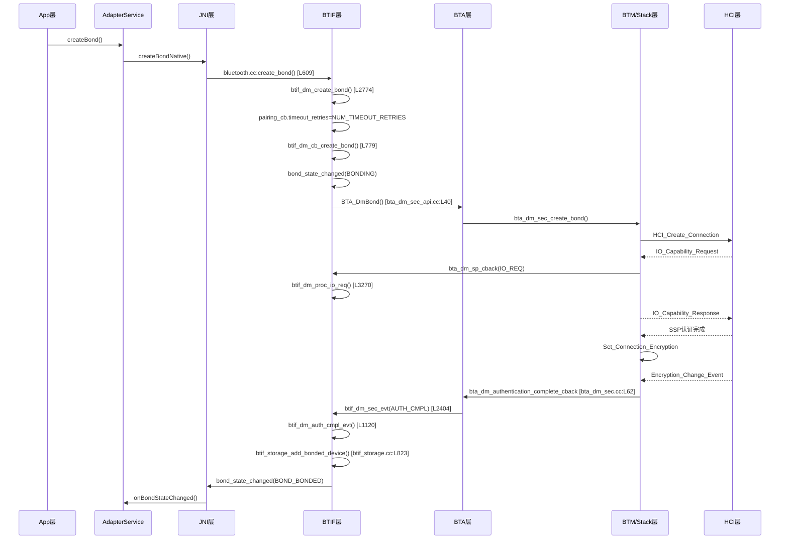
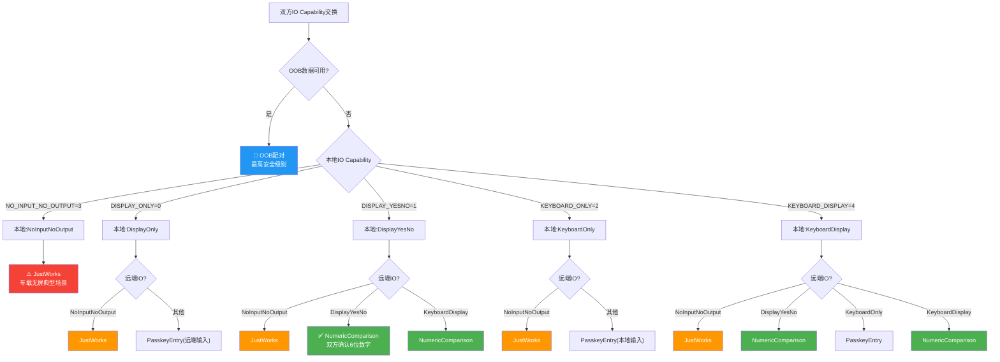
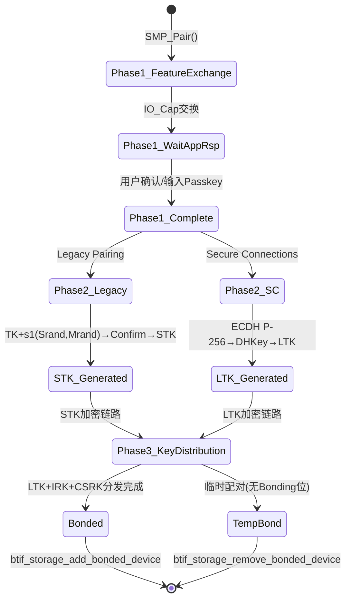
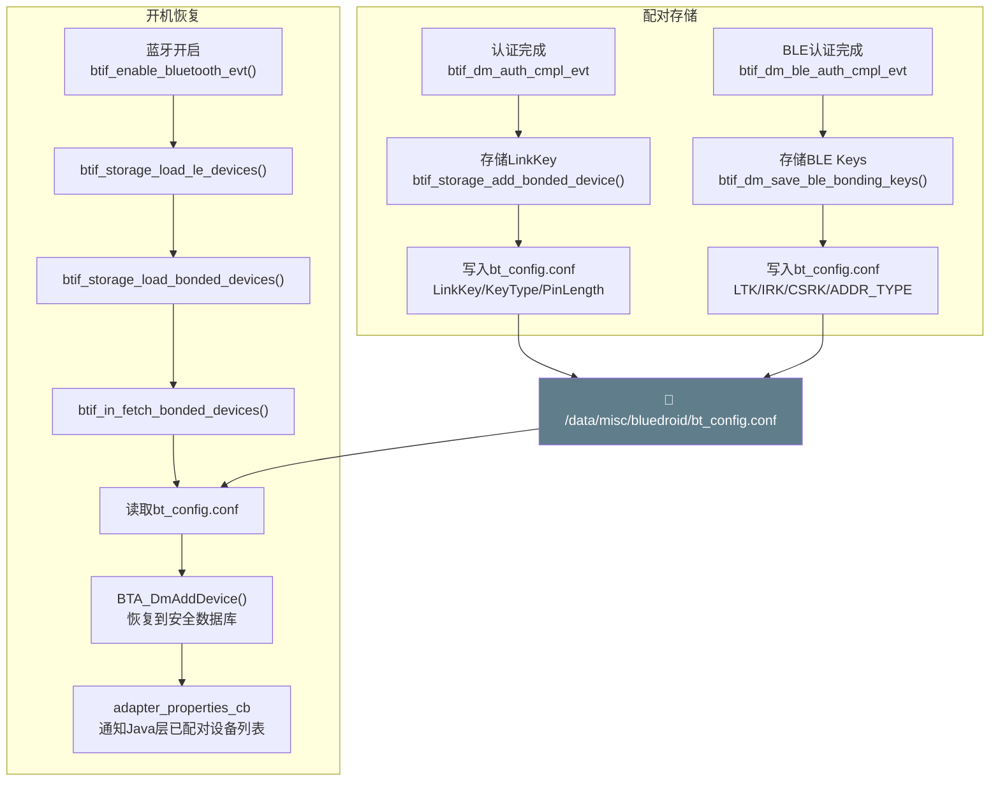
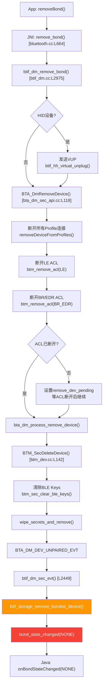

# T04_配对流程详解

> 学习日期：2026-05-16 | 优先级：P0 | 预计学习时间：3小时
> 前置知识：T01架构理解、T02开关流程、T03扫描流程
> 涉及源码目录：system/btif/src/, system/bta/dm/, system/stack/smp/, system/stack/btm/, system/btif/src/btif_storage.cc

---

## 📋 本章导读

- **学什么**：SSP四种配对模式决策机制、createBond完整调用链、LE SMP三阶段配对、配对存储与恢复、removeBond流程、车载特殊配对场景
- **为什么学**：车载蓝牙40%的问题与配对相关——配对失败、兼容性问题、无屏JustWorks安全风险、BLE OOB配对异常，不理解配对流程就无法定位
- **学完能做**：
  - 根据IO Capability快速判断配对会走哪种SSP模式
  - 从日志追踪createBond→BOND_BONDED完整链路，定位配对卡在哪个环节
  - 理解LE Legacy与Secure Connections的区别，排查SMP配对失败
  - 分析车载无屏/CarPlay/HiCar等特殊配对场景的问题

---

## 🗺️ 架构全景图

### 1. SSP配对流程时序图



### 2. IO Capability矩阵决策图



### 3. LE SMP三阶段状态图



### 4. 配对存储恢复流程图



### 5. removeBond完整流程图



---

## 🔍 代码导航

| 步骤 | 操作 | 文件 | 行号 | 看什么 |
|------|------|------|------|--------|
| 1 | 打开文件 | system/btif/src/bluetooth.cc | L609-618 | create_bond()：配对入口，检查pairing_is_busy |
| 2 | 打开文件 | system/btif/src/btif_dm.cc | L2774-2784 | btif_dm_create_bond()：设置重试次数，调用cb_create_bond |
| 3 | 打开文件 | system/btif/src/btif_dm.cc | L779-828 | btif_dm_cb_create_bond()：发BONDING状态，调BTA_DmBond |
| 4 | 打开文件 | system/bta/dm/bta_dm_sec_api.cc | L40-47 | BTA_DmBond()：投递配对事件到BTA |
| 5 | 打开文件 | system/bta/dm/bta_dm_sec.cc | L55-67 | bta_security回调表：8个安全回调注册 |
| 6 | 打开文件 | system/bta/dm/bta_dm_sec.cc | L397-500 | bta_dm_sp_cback()：SSP IO_Cap请求/响应处理 |
| 7 | 打开文件 | system/btif/src/btif_dm.cc | L1120-1230 | btif_dm_auth_cmpl_evt()：认证完成，存储LinkKey |
| 8 | 打开文件 | system/btif/src/btif_storage.cc | L823-847 | btif_storage_add_bonded_device()：写入bt_config.conf |
| 9 | 打开文件 | system/btif/src/btif_dm.cc | L3729-3770 | btif_dm_ble_auth_cmpl_evt()：BLE认证完成处理 |
| 10 | 打开文件 | system/btif/src/btif_dm.cc | L2975-3008 | btif_dm_remove_bond()：移除配对入口 |
| 11 | 打开文件 | system/bta/dm/bta_dm_act.cc | L469-540 | bta_dm_remove_device()：断开ACL+删除安全记录 |
| 12 | 打开文件 | system/stack/btm/btm_dev.cc | L142-180 | BTM_SecDeleteDevice()：清除密钥和设备记录 |
| 13 | 打开文件 | system/btif/src/btif_storage.cc | L977-1100 | btif_storage_load_bonded_devices()：开机恢复配对 |
| 14 | 打开文件 | system/stack/smp/smp_keys.cc | L143-168 | smp_generate_stk()：STK生成(Legacy/SC分支) |
| 15 | 打开文件 | system/stack/smp/smp_utils.cc | L1228-1260 | smp_select_association_model()：选择配对关联模型 |

---

## 📖 核心流程详解

### 1.1 createBond入口：bluetooth.cc

```cpp
// 📂 system/btif/src/bluetooth.cc:609-618
static int create_bond(const RawAddress* bd_addr, int transport) {
    // [1] 🔍 前置检查：协议栈必须就绪
    //     💡C++: interface_ready()检查全局初始化标志，类似Java的isInitialized()
    if (!interface_ready()) {
        return BT_STATUS_NOT_READY;
    }
    // [2] 🔍 检查配对是否忙碌——防止并发配对
    //     💡C++: pairing_cb是全局static变量，类似Java的synchronized锁保护
    //     但C++这里没有加锁，依赖BTIF主线程串行执行保证线程安全
    if (btif_dm_pairing_is_busy()) {
        return BT_STATUS_BUSY;
    }
    // [3] 📨 投递到BTIF主线程，携带参数
    //     💡C++: base::BindOnce() 类似Java的 () -> btifDmCreateBond(addr, transport)
    //     *bd_addr是解引用，把指针转为值拷贝传递，防止悬空指针
    do_in_main_thread(base::BindOnce(btif_dm_create_bond, *bd_addr, to_bt_transport(transport)));
    return BT_STATUS_SUCCESS;
}
```

### 1.2 btif_dm_create_bond：配对核心逻辑

```cpp
// 📂 system/btif/src/btif_dm.cc:2774-2784
void btif_dm_create_bond(const RawAddress bd_addr, tBT_TRANSPORT transport) {
    // [1] 打印日志，记录配对目标地址和传输类型
    log::verbose("bd_addr={}, transport={}", bd_addr, transport);
    // [2] 记录配对历史——用于调试统计
    BTM_LogHistory(kBtmLogTag, bd_addr, "Create bond",
                   std::format("transport:{}", bt_transport_text(transport)));
    // [3] 添加配对事件统计
    btif_stats_add_bond_event(bd_addr, BTIF_DM_FUNC_CREATE_BOND, pairing_cb.state);
    // [4] 🔑 设置超时重试次数
    //     💡C++: NUM_TIMEOUT_RETRIES是编译期常量，类似Java的static final int
    pairing_cb.timeout_retries = NUM_TIMEOUT_RETRIES;
    // [5] 📨 调用实际配对函数
    btif_dm_cb_create_bond(bd_addr, transport);
}
```

### 1.3 btif_dm_cb_create_bond：发起BTA配对

```cpp
// 📂 system/btif/src/btif_dm.cc:779-828
static void btif_dm_cb_create_bond(const RawAddress bd_addr, tBT_TRANSPORT transport) {
    // [1] 📨 先通知状态变为BONDING——让UI显示"配对中"
    bond_state_changed(BT_STATUS_SUCCESS, bd_addr, BT_BOND_STATE_BONDING);

    // [2] LE Audio设备自动选择LE传输
    if (transport == BT_TRANSPORT_AUTO && is_device_le_audio_capable(bd_addr) &&
        !btif_check_cod_phone(bd_addr)) {
        log::debug("LE Audio capable, forcing LE transport for Bonding");
        transport = BT_TRANSPORT_LE;
    }

    // [3] 读取设备类型和地址类型
    int device_type = 0;
    tBLE_ADDR_TYPE addr_type = BLE_ADDR_PUBLIC;
    std::string addrstr = bd_addr.ToString();
    // [4] LE传输时设置设备类型和地址类型
    if (transport == BT_TRANSPORT_LE) {
        if (!btif_config_get_int(addrstr, BTIF_STORAGE_KEY_DEV_TYPE, &device_type)) {
            btif_config_set_int(addrstr, BTIF_STORAGE_KEY_DEV_TYPE, BT_DEVICE_TYPE_BLE);
        }
        // 💡C++: btif_storage_get_remote_addr_type读取持久化地址类型
        // 类似Java的SharedPreferences.getInt()
        if (btif_storage_get_remote_addr_type(&bd_addr, &addr_type) != BT_STATUS_SUCCESS) {
            uint8_t tmp_dev_type;
            tBLE_ADDR_TYPE tmp_addr_type = BLE_ADDR_PUBLIC;
            get_btm_client_interface().peer.BTM_ReadDevInfo(bd_addr, &tmp_dev_type, &tmp_addr_type);
            addr_type = tmp_addr_type;
            btif_storage_set_remote_addr_type(&bd_addr, addr_type);
        }
    }
    // [5] LE/Dual设备先添加到BLE设备列表
    if (((device_type & BT_DEVICE_TYPE_BLE) == BT_DEVICE_TYPE_BLE) ||
        (transport == BT_TRANSPORT_LE)) {
        BTA_DmAddBleDevice(bd_addr, addr_type, static_cast<tBT_DEVICE_TYPE>(device_type));
    }
    // [6] 🔑 标记本地发起的配对——影响IO_Cap处理策略
    pairing_cb.is_local_initiated = true;
    // [7] 📨 调用BTA层发起配对
    BTA_DmBond(bd_addr, addr_type, transport, device_type);
}
```

### 1.4 bta_security回调表注册

```cpp
// 📂 system/bta/dm/bta_dm_sec.cc:55-67
// 🔑 这是整个安全回调链的注册表，BTM层通过这些函数指针回调BTA层
// 💡C++: 结构体初始化用.designated initializer语法(C99)
// 类似Java的 Builder模式：new CallbackBuilder().setPinCb(xxx).setLinkKeyCb(yyy).build()
const tBTM_APPL_INFO bta_security = {
    .p_pin_callback = &bta_dm_pin_cback,               // [1] PIN码请求回调
    .p_link_key_callback = &bta_dm_new_link_key_cback,  // [2] 新LinkKey回调
    .p_auth_complete_callback = &bta_dm_authentication_complete_cback, // [3] 🔑 认证完成回调
    .p_bond_cancel_cmpl_callback = &bta_dm_bond_cancel_complete_cback, // [4] 取消配对完成回调
    .p_sp_callback = &bta_dm_sp_cback,                  // [5] 🔑 SSP简单配对回调(IO_Cap/确认)
    .p_le_callback = &bta_dm_ble_smp_cback,             // [6] 🔑 LE SMP回调
    .p_le_key_callback = &bta_dm_ble_id_key_cback,      // [7] LE密钥回调
    .p_sirk_verification_callback = &bta_dm_sirk_verification_cback, // [8] CSIP Sirk验证回调
};
```

```cpp
// 📂 system/bta/dm/bta_dm_sec.cc:101
// 注册回调到BTM层——蓝牙开启时调用
void btm_dm_sec_init() {
    // 💡C++: 传递结构体指针，BTM层保存后通过函数指针回调
    // 类似Java的 listener.registerCallback(callback)
    get_btm_client_interface().security.BTM_SecRegister(&bta_security);
}
```

```cpp
// 📂 system/stack/include/security_client_callbacks.h:76-87
// tBTM_APPL_INFO结构体定义——8个函数指针槽位
struct tBTM_APPL_INFO {
    tBTM_PIN_CALLBACK* p_pin_callback{nullptr};           // PIN码回调
    tBTM_LINK_KEY_CALLBACK* p_link_key_callback{nullptr}; // LinkKey回调
    tBTM_AUTH_COMPLETE_CALLBACK* p_auth_complete_callback{nullptr}; // 认证完成回调
    tBTM_BOND_CANCEL_CMPL_CALLBACK* p_bond_cancel_cmpl_callback{nullptr}; // 取消配对回调
    tBTM_SP_CALLBACK* p_sp_callback{nullptr};             // SSP回调
    tBTM_LE_CALLBACK* p_le_callback{nullptr};             // LE SMP回调
    tBTM_LE_KEY_CALLBACK* p_le_key_callback{nullptr};     // LE密钥回调
    tBTM_SIRK_VERIFICATION_CALLBACK* p_sirk_verification_callback{nullptr}; // Sirk验证回调
};
```

### 1.5 btif_dm_auth_cmpl_evt：认证完成处理

```cpp
// 📂 system/btif/src/btif_dm.cc:1120-1230
static void btif_dm_auth_cmpl_evt(tBTA_DM_AUTH_CMPL* p_auth_cmpl) {
    bt_status_t status = BT_STATUS_FAIL;
    bt_bond_state_t state = BT_BOND_STATE_NONE;
    RawAddress bd_addr = p_auth_cmpl->bd_addr;

    // [1] 保存失败原因和CTKD标志
    pairing_cb.fail_reason = p_auth_cmpl->fail_reason;
    pairing_cb.is_ctkd = (pairing_cb.is_ctkd || p_auth_cmpl->is_ctkd);

    if (p_auth_cmpl->success) {
        // [2] 认证成功——检查LinkKey类型
        if (p_auth_cmpl->key_present) {
            // [3] 🔑 验证LinkKey类型是否合法
            //     💡C++: HCI_LKEY_TYPE_AUTH_COMB等是HCI规范定义的枚举
            //     类似Java的 if (keyType == KeyType.AUTHENTICATED_COMBINATION)
            if ((p_auth_cmpl->key_type < HCI_LKEY_TYPE_DEBUG_COMB) ||
                (p_auth_cmpl->key_type == HCI_LKEY_TYPE_AUTH_COMB) ||
                (p_auth_cmpl->key_type == HCI_LKEY_TYPE_CHANGED_COMB) ||
                (p_auth_cmpl->key_type == HCI_LKEY_TYPE_AUTH_COMB_P_256) ||
                pairing_cb.bond_type == BOND_TYPE_PERSISTENT) {
                // [4] 📨 存储LinkKey到NVRAM
                btif_storage_add_bonded_device(&bd_addr, p_auth_cmpl->key,
                                               p_auth_cmpl->key_type, 0);
            }
        }
        // [5] 更新远端设备属性
        btif_update_remote_properties(p_auth_cmpl->bd_addr, p_auth_cmpl->bd_name,
                                      kDevClassEmpty, dev_type);
        // [6] 🔑 配对成功
        status = BT_STATUS_SUCCESS;
        state = BT_BOND_STATE_BONDED;
    } else {
        // [7] 认证失败
        status = BT_STATUS_AUTH_FAILURE;
        state = BT_BOND_STATE_NONE;
    }
    // [8] 📨 通知Java层配对状态变化
    bond_state_changed(status, bd_addr, state);
}
```

### 1.6 btif_storage_add_bonded_device：持久化存储

```cpp
// 📂 system/btif/src/btif_storage.cc:823-847
bt_status_t btif_storage_add_bonded_device(RawAddress* remote_bd_addr, LinkKey link_key,
                                           uint8_t key_type, uint8_t pin_length) {
    std::string bdstr = remote_bd_addr->ToString();
    // [1] 存储LinkKey类型
    //     💡C++: btif_config_set_int 类似Java的SharedPreferences.edit().putInt().commit()
    bool ret = btif_config_set_int(bdstr, BTIF_STORAGE_KEY_LINK_KEY_TYPE, static_cast<int>(key_type));
    // [2] 存储PIN长度
    ret &= btif_config_set_int(bdstr, BTIF_STORAGE_KEY_PIN_LENGTH, static_cast<int>(pin_length));
    // [3] 🔑 存储LinkKey二进制数据
    //     💡C++: btif_config_set_bin存储二进制数据，类似Java的Base64编码后存String
    ret &= btif_config_set_bin(bdstr, BTIF_STORAGE_KEY_LINK_KEY, link_key.data(), link_key.size());
    // [4] 存储成功则设置模式标记
    if (ret) {
        btif_storage_set_mode(remote_bd_addr);
    }
    return ret ? BT_STATUS_SUCCESS : BT_STATUS_FAIL;
}
```

### 1.7 btif_dm_remove_bond：移除配对

```cpp
// 📂 system/btif/src/bluetooth.cc:664-677
static int remove_bond(const RawAddress* bd_addr) {
    // [1] 受限模式检查——车载多用户场景
    if (is_restricted_mode() && !btif_storage_is_restricted_device(bd_addr)) {
        log::info("{} cannot be removed in restricted mode", *bd_addr);
        return BT_STATUS_SUCCESS;
    }
    if (!interface_ready()) {
        return BT_STATUS_NOT_READY;
    }
    // [2] 📨 投递到BTIF主线程执行移除
    do_in_main_thread(base::BindOnce(btif_dm_remove_bond, *bd_addr));
    return BT_STATUS_SUCCESS;
}
```

```cpp
// 📂 system/btif/src/btif_dm.cc:2975-3008
void btif_dm_remove_bond(const RawAddress bd_addr) {
    log::verbose("bd_addr={}", bd_addr);
    btif_stats_add_bond_event(bd_addr, BTIF_DM_FUNC_REMOVE_BOND, pairing_cb.state);

    // [1] 🔑 HID设备特殊处理——发送Virtual Unplug
    //     💡C++: #if条件编译，类似Java的BuildConfig.DEBUG判断
    //     但C++的条件编译在编译期决定，不存在的代码不会编译
#if (BTA_HH_INCLUDED == TRUE)
    tAclLinkSpec link_spec;
    link_spec.addrt.bda = bd_addr;
    link_spec.transport = BT_TRANSPORT_AUTO;
    link_spec.addrt.type = BLE_ADDR_PUBLIC;

    if (GetInterfaceToProfiles()->profileSpecific_HACK->btif_hh_virtual_unplug(link_spec) !=
        BT_STATUS_SUCCESS)
#endif
    {
        // [2] 非HID设备直接调用BTA移除
        log::debug("Removing HH device");
        BTA_DmRemoveDevice(bd_addr);
    }
}
```

### 1.8 IO Capability处理：btif_dm_proc_io_req

```cpp
// 📂 system/btif/src/btif_dm.cc:3270-3312
void btif_dm_proc_io_req(tBTM_AUTH_REQ* p_auth_req, bool is_orig) {
    uint8_t yes_no_bit = BTA_AUTH_SP_YES & *p_auth_req;
    // [1] 本地发起配对：设置专用绑定+MITM位
    if (pairing_cb.is_local_initiated) {
        *p_auth_req = BTA_AUTH_DD_BOND | BTA_AUTH_SP_YES;
    }
    // [2] 远端发起配对：复制远端的认证需求
    else if (!is_orig) {
        *p_auth_req = (pairing_cb.auth_req & BTA_AUTH_BONDS);
        // [3] 如果远端有DisplayYesNo能力，强制MITM
        if ((yes_no_bit) || (pairing_cb.io_cap & BTM_IO_CAP_IO)) {
            *p_auth_req |= BTA_AUTH_SP_YES;
        }
    }
    // [4] 已存储设备的通用绑定
    else if (yes_no_bit) {
        *p_auth_req = BTA_AUTH_GEN_BOND | yes_no_bit;
    }
}
```

---

## 💡 C++知识卡片

### 💡 C++知识卡片：函数指针回调表 vs Java接口

> 🔄 Java类比：Java用接口(Interface)定义回调契约，C++用函数指针结构体

```cpp
// C++方式：函数指针结构体——tBTM_APPL_INFO
struct tBTM_APPL_INFO {
    tBTM_PIN_CALLBACK* p_pin_callback{nullptr};       // 函数指针1
    tBTM_AUTH_COMPLETE_CALLBACK* p_auth_complete_callback{nullptr}; // 函数指针2
    tBTM_SP_CALLBACK* p_sp_callback{nullptr};         // 函数指针3
    // ... 共8个函数指针
};
// 注册：BTM_SecRegister(&bta_security)
// 调用：btm_sec_cb.api.p_auth_complete_callback(bd_addr, dev_class, bd_name, result)

// Java等价方式：接口定义回调
public interface BluetoothSecurityCallback {
    void onPinRequest(String bdAddr, int devClass, String bdName, boolean min16Digit);
    void onAuthComplete(String bdAddr, int devClass, String bdName, int result);
    void onSpEvent(int event, SpEventData data);
}
// 注册：securityManager.registerCallback(callback)
// 调用：callback.onAuthComplete(bdAddr, devClass, bdName, result)

// ⚠️ 关键区别：
// 1. Java接口有类型安全，编译器检查方法签名
// 2. C++函数指针可以独立替换，Java接口必须实现所有方法
// 3. Java有GC管理生命周期，C++必须确保函数指针在回调时仍有效
// 4. C++ designated initializer可以只初始化部分字段(nullptr默认值)
```

### 💡 C++知识卡片：位域bit-field与BRSF

> 🔄 Java类比：Java没有bit-field，用位运算常量+注释模拟

```cpp
// C++位域：精确控制内存布局，蓝牙协议大量使用
// IO Capability枚举值直接对应HCI协议字段
enum : uint8_t {
    BTM_IO_CAP_OUT    = 0,  // DisplayOnly      → 二进制 000
    BTM_IO_CAP_IO     = 1,  // DisplayYesNo     → 二进制 001
    BTM_IO_CAP_IN     = 2,  // KeyboardOnly     → 二进制 010
    BTM_IO_CAP_NONE   = 3,  // NoInputNoOutput  → 二进制 011
    BTM_IO_CAP_KBDISP = 4,  // KeyboardDisplay  → 二进制 100
};

// SMP认证需求位掩码——每个bit代表一个能力
enum : uint8_t {
    SMP_AUTH_BOND         = (1u << 0),  // bit0: Bonding标志
    SMP_AUTH_UNUSED       = (1u << 1),  // bit1: 保留
    SMP_AUTH_YN_BIT       = (1u << 2),  // bit2: MITM标志
    SMP_SC_SUPPORT_BIT    = (1u << 3),  // bit3: Secure Connections支持
    SMP_KP_SUPPORT_BIT    = (1u << 4),  // bit4: Keypress通知支持
    SMP_H7_SUPPORT_BIT    = (1u << 5),  // bit5: H7函数支持
};
// 💡C++: enum : uint8_t 指定底层类型为1字节
// Java等价：@IntDef + 位运算常量，但没有编译器强制位宽

// 车载默认配置：bte_appl_cfg
tBTE_APPL_CFG bte_appl_cfg = {
    BTA_LE_AUTH_REQ_SC_MITM_BOND,  // auth_req: SC+MITM+Bonding
    BTM_IO_CAP_KBDISP,             // io_cap: KeyboardDisplay
    BTM_BLE_INITIATOR_KEY_SIZE,    // init_key: 15个key位
    BTM_BLE_RESPONDER_KEY_SIZE,    // resp_key: 15个key位
    BTM_BLE_MAX_KEY_SIZE,          // max_key_size: 16字节
};
```

### 💡 C++知识卡片：枚举enum class vs C枚举

> 🔄 Java类比：Java的enum是类，C++的enum class是强类型枚举

```cpp
// C风格枚举——蓝牙协议栈大量使用，值可隐式转为整数
enum : uint8_t {
    BTM_IO_CAP_OUT    = 0,
    BTM_IO_CAP_IO     = 1,
    BTM_IO_CAP_IN     = 2,
    BTM_IO_CAP_NONE   = 3,
    BTM_IO_CAP_KBDISP = 4,
};
typedef uint8_t tBTM_IO_CAP;  // 💡C++: typedef创建别名，值可隐式转uint8_t
// ⚠️ 风险：可以写 tBTM_IO_CAP cap = 99; 编译器不会报错

// C++11强类型枚举——更安全，不会隐式转整数
enum class tBTM_STATUS : uint8_t {
    BTM_SUCCESS = 0,
    BTM_NOT_AUTHORIZED = 5,
    BTM_CMD_STARTED = 9,
};
// 使用：tBTM_STATUS::BTM_SUCCESS，必须显式转换
// 💡C++: enum class防止命名冲突和隐式转换
// Java的enum天然是强类型的，类似C++的enum class

// 蓝牙协议栈的混合风格：
// - 旧代码(如BTM层)：C枚举 + typedef
// - 新代码(如GD层)：enum class
// - 协议字段：C枚举(需要与HCI/SMP规范值一一对应)
```

---

## 🗂️ Java ↔ C++ 对照表

| Java层 | JNI桥接 | C++层 | 数据流方向 |
|--------|---------|-------|-----------|
| BluetoothDevice.createBond() | AdapterService.createBondNative() | bluetooth.cc:create_bond() [L609] | ↓ Java→C++ |
| BluetoothDevice.createBondLe() | AdapterService.createBondLeNative() | bluetooth.cc:create_bond_le() [L620] | ↓ Java→C++ |
| BluetoothDevice.removeBond() | AdapterService.removeBondNative() | bluetooth.cc:remove_bond() [L664] | ↓ Java→C++ |
| BluetoothDevice.cancelPairing() | AdapterService.cancelBondNative() | bluetooth.cc:cancel_bond() | ↓ Java→C++ |
| BluetoothDevice.setPairingConfirmation() | sspReplyNative() | bluetooth.cc:ssp_reply() | ↓ Java→C++ |
| BluetoothDevice.setPin() | pinReplyNative() | bluetooth.cc:pin_reply() | ↓ Java→C++ |
| onBondStateChanged() | bond_state_changed_cb | HAL_CBACK(bond_state_changed_cb) | ↑ C++→Java |
| onSspRequest() | ssp_request_cb | HAL_CBACK(ssp_request_cb) | ↑ C++→Java |
| onPinRequest() | pin_request_cb | HAL_CBACK(pin_request_cb) | ↑ C++→Java |
| onDeviceUnpaired() | device_unpaired_cb | btif_dm_sec_evt(DEV_UNPAIRED) [L2449] | ↑ C++→Java |

---

## 🐛 问题排查SOP

### 问题1：配对失败——点击配对后一直转圈或立即失败

```
步骤1: 查日志
  adb logcat -s bt_bta_dm_sec bt_btif_dm bt_stack bt_btm | grep -E "bond|pair|auth|key|ssp"

步骤2: 定位代码
  ① 搜索 "Create bond" → btif_dm.cc:L2774 确认配对是否发起
  ② 搜索 "auth_cmpl" → btif_dm.cc:L1120 检查认证是否完成
  ③ 搜索 "bond_state_changed" → 查看状态转换链
  ④ 搜索 "IO_CAP" → bta_dm_sec.cc:L397 检查IO Capability协商

步骤3: 常见根因
  ① pairing_is_busy()返回true → 上次配对未完成，检查pairing_cb.state
  ② IO Capability协商后走JustWorks但远端拒绝 → 检查bte_appl_cfg.ble_io_cap
  ③ HCI_Create_Connection超时 → 检查远端设备是否可连接
  ④ SSP认证失败 → 检查LinkKey类型和OOB数据
  ⑤ SMP配对失败 → 搜索 "SMP_PAIR_FAIL" 查看SMP错误码

步骤4: 深入排查
  ① 抓HCI snoop log: adb shell dumpsys bluetooth_manager dumplog
  ② 检查 /data/misc/bluedroid/bt_config.conf 中是否有残留配对信息
  ③ 车载无屏场景：确认IO_CAP=NONE(3)，配对走JustWorks
  ④ 兼容性问题：检查 interop_database.conf 是否需要添加设备
```

### 问题2：已配对设备重启后丢失

```
步骤1: 查日志
  adb logcat -s bt_btif_storage bt_btif_dm | grep -E "load_bonded|fetch|config"

步骤2: 定位代码
  ① 搜索 "load_bonded_devices" → btif_storage.cc:L977 确认是否调用
  ② 搜索 "btif_in_fetch_bonded_devices" → btif_storage.cc:L471 检查读取结果
  ③ 检查 /data/misc/bluedroid/bt_config.conf 配对信息是否完整

步骤3: 常见根因
  ① bt_config.conf文件损坏 → 检查文件权限和内容格式
  ② LinkKey未正确存储 → btif_storage_add_bonded_device返回失败
  ③ BLE Keys丢失 → btif_dm_save_ble_bonding_keys未调用
  ④ 临时配对被清除 → BOND_TYPE_TEMPORARY的设备不持久化
  ⑤ 加密文件系统未挂载 → 车载early boot阶段bt_config.conf不可访问

步骤4: 深入排查
  ① adb shell cat /data/misc/bluedroid/bt_config.conf 查看配对信息
  ② 搜索 "remove_devices_with_sample_ltk" → btif_storage.cc 检查是否误删
  ③ 车载多用户场景：检查User Handle隔离是否正确
```

---

## 🛠️ 动手练习

### 🟢 入门：阅读代码

1. 打开 `system/stack/include/btm_sec_api_types.h`，找到 `tBTM_IO_CAP` 枚举定义（L200），画出5种IO Capability的组合矩阵，标注每种组合对应的SSP配对模式。

2. 打开 `system/bta/dm/bta_dm_sec.cc`，找到 `bta_security` 结构体（L55），追踪每个回调函数的实现，理解BTM→BTA→BTIF的回调链路。

3. 打开 `system/btif/co/bta_dm_co.cc`，找到 `bte_appl_cfg` 默认配置（L25），理解车载设备的默认IO Capability和认证需求。

### 🟡 进阶：修改代码

1. 在 `btif_dm_cb_create_bond()` 中添加日志，打印 `pairing_cb` 的完整状态，包括 `is_local_initiated`、`io_cap`、`auth_req`，帮助排查配对参数问题。

2. 修改 `bte_appl_cfg.ble_io_cap` 从 `BTM_IO_CAP_KBDISP` 改为 `BTM_IO_CAP_NONE`，观察LE配对模式从NumericComparison变为JustWorks的过程（需要重新编译协议栈）。

3. 在 `btif_dm_auth_cmpl_evt()` 中，当 `p_auth_cmpl->success` 为false时，添加详细日志打印 `fail_reason` 和 `key_type`，帮助定位认证失败原因。

### 🔴 实战：定位问题

1. 模拟场景：车载无屏设备与手机配对，日志显示 `IO_CAP=NONE`，配对走JustWorks但用户无法确认。请分析安全风险，并给出解决方案（提示：考虑BLE OOB或Auto-Pair）。

2. 模拟场景：CarPlay设备通过BLE OOB配对，日志显示 `BTM_LE_OOB_REQ_EVT` 但随后 `SMP_PAIR_FAIL`。请追踪 `btif_dm_ble_oob_req_evt()` → `bta_dm_ble_smp_cback()` 的调用链，分析OOB数据传递是否正确。

3. 模拟场景：已配对设备重启后自动重连失败，日志显示 `KeyMissing` 事件。请追踪 `BTA_DM_KEY_MISSING_EVT` 的处理流程，分析是LinkKey丢失还是IRK解析失败。

---

## 📚 关键源码索引

| 序号 | 文件 | 行号 | 函数/类 | 作用 |
|------|------|------|---------|------|
| 1 | system/btif/src/bluetooth.cc | L609-618 | create_bond() | BR/EDR配对入口 |
| 2 | system/btif/src/bluetooth.cc | L620-630 | create_bond_le() | LE配对入口 |
| 3 | system/btif/src/bluetooth.cc | L631-645 | create_bond_out_of_band() | OOB配对入口 |
| 4 | system/btif/src/bluetooth.cc | L664-677 | remove_bond() | 移除配对入口 |
| 5 | system/btif/src/btif_dm.cc | L159-182 | btif_dm_pairing_cb_t | 配对控制块结构体 |
| 6 | system/btif/src/btif_dm.cc | L779-828 | btif_dm_cb_create_bond() | 配对核心实现 |
| 7 | system/btif/src/btif_dm.cc | L829-856 | btif_dm_cb_create_bond_le() | LE配对核心实现 |
| 8 | system/btif/src/btif_dm.cc | L1120-1230 | btif_dm_auth_cmpl_evt() | BR/EDR认证完成处理 |
| 9 | system/btif/src/btif_dm.cc | L2404-2594 | btif_dm_sec_evt() | 安全事件总分发 |
| 10 | system/btif/src/btif_dm.cc | L2759 | btif_dm_pairing_is_busy() | 配对忙碌检查 |
| 11 | system/btif/src/btif_dm.cc | L2774-2784 | btif_dm_create_bond() | 配对外部接口 |
| 12 | system/btif/src/btif_dm.cc | L2910-2957 | btif_dm_cancel_bond() | 取消配对 |
| 13 | system/btif/src/btif_dm.cc | L2975-3008 | btif_dm_remove_bond() | 移除配对 |
| 14 | system/btif/src/btif_dm.cc | L3270-3312 | btif_dm_proc_io_req() | IO Capability请求处理 |
| 15 | system/btif/src/btif_dm.cc | L3729-3770 | btif_dm_ble_auth_cmpl_evt() | BLE认证完成处理 |
| 16 | system/bta/dm/bta_dm_sec.cc | L55-67 | bta_security | 安全回调注册表(8个) |
| 17 | system/bta/dm/bta_dm_sec.cc | L101 | btm_dm_sec_init() | 安全回调注册到BTM |
| 18 | system/bta/dm/bta_dm_sec.cc | L397-500 | bta_dm_sp_cback() | SSP回调处理 |
| 19 | system/bta/dm/bta_dm_sec.cc | L660-800 | bta_dm_ble_smp_cback() | LE SMP回调处理 |
| 20 | system/bta/dm/bta_dm_sec_api.cc | L40-47 | BTA_DmBond() | BTA层发起配对 |
| 21 | system/bta/dm/bta_dm_sec_api.cc | L118-121 | BTA_DmRemoveDevice() | BTA层移除设备 |
| 22 | system/bta/dm/bta_dm_act.cc | L469-540 | bta_dm_remove_device() | 断开ACL+删除安全记录 |
| 23 | system/stack/include/btm_sec_api_types.h | L200-230 | tBTM_IO_CAP | IO Capability枚举定义 |
| 24 | system/stack/include/security_client_callbacks.h | L76-87 | tBTM_APPL_INFO | 安全回调结构体定义 |
| 25 | system/stack/btm/btm_dev.cc | L142-180 | BTM_SecDeleteDevice() | 删除设备安全记录 |
| 26 | system/btif/src/btif_storage.cc | L471-505 | btif_in_fetch_bonded_devices() | 从NVRAM读取配对设备 |
| 27 | system/btif/src/btif_storage.cc | L823-847 | btif_storage_add_bonded_device() | 存储配对设备到NVRAM |
| 28 | system/btif/src/btif_storage.cc | L977-1100 | btif_storage_load_bonded_devices() | 开机恢复配对设备 |
| 29 | system/stack/smp/smp_keys.cc | L143-168 | smp_generate_stk() | STK/LTK生成 |
| 30 | system/stack/smp/smp_utils.cc | L1228-1260 | smp_select_association_model() | 选择配对关联模型 |
| 31 | system/stack/smp/smp_api.cc | L70-100 | SMP_Pair() | SMP配对发起 |
| 32 | system/btif/co/bta_dm_co.cc | L24-25 | bte_appl_cfg | 车载默认SMP配置 |
