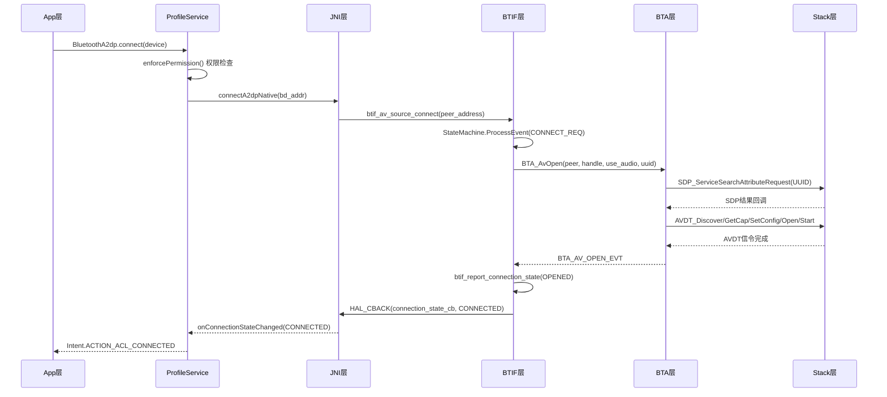
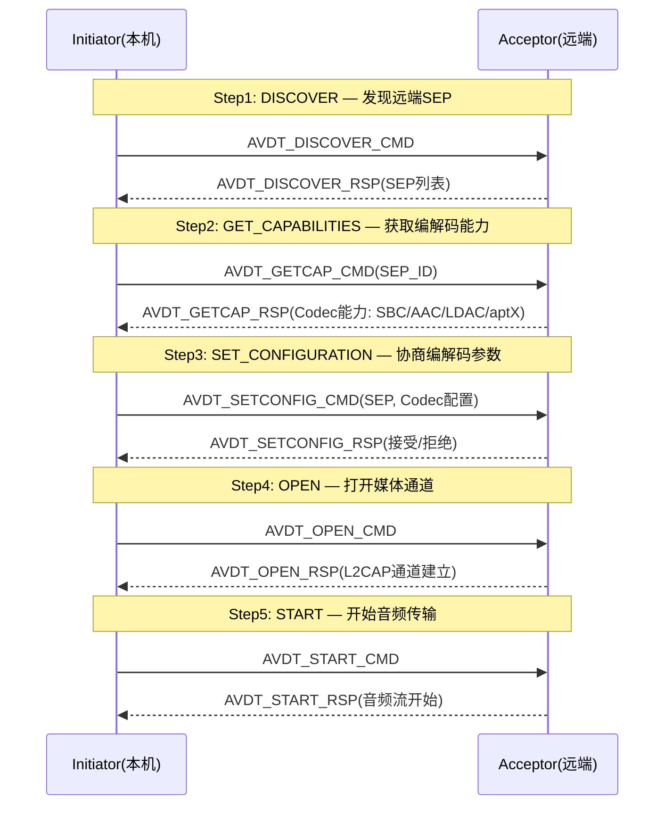
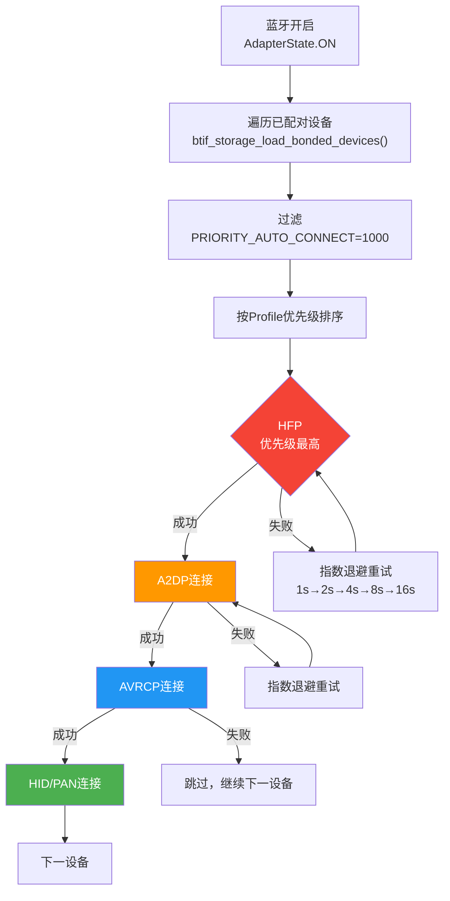
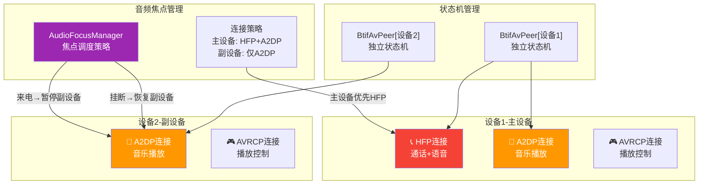

# T05_Profile连接流程详解

> 学习日期：2026-05-16 | 优先级：P0 | 预计学习时间：3小时
> 前置知识：T01_蓝牙整体架构理解、T04_配对流程详解
> 涉及源码目录：system/btif/src/, system/bta/av/, system/bta/ag/, system/stack/avdt/, system/stack/rfcomm/

---

## 📋 本章导读

- **学什么**：Profile连接的通用调用链模式、A2DP五步AVDT信令流程、HFP SLC协商与WBS/SWB编解码、自动连接优先级决策、多设备连接架构
- **为什么学**：车载蓝牙70%的连接问题出在Profile连接阶段，不理解AVDT信令和SLC协商就无法定位A2DP无声、HFP无通话等高频问题
- **学完能做**：
  - 根据日志追踪Profile连接的完整调用链，快速定位卡在哪一步
  - 理解A2DP/HFP连接的差异，区分SDP查询、信令建立、音频通道三个阶段
  - 排查自动连接失败、多设备切换异常等车载常见问题

---

## 🗺️ 架构全景图

### Profile连接通用调用链时序图



### A2DP AVDT五步信令流程图



### HFP SLC协商状态图

```mermaid
stateDiagram-v2
    [*] --> RFCOMM_CONNECT: BTA_AgOpen
    RFCOMM_CONNECT --> SLC_BRSF: RFCOMM连接成功
    SLC_BRSF --> SLC_CIND: AT+BRSF协商完成
    SLC_CIND --> SLC_CMER: AT+CIND指示器协商完成
    SLC_CMER --> SLC_CHLD: AT+CMER事件报告启用
    SLC_CHLD --> SLC_BIND: AT+CHLD呼叫保持协商
    SLC_BIND --> SLC_BAC: AT+BIND特征协商
    SLC_BAC --> SLC_CONNECTED: AT+BAC编解码协商完成
    SLC_CONNECTED --> SCO_SETUP: 可选SCO建立
    SLC_CONNECTED --> WBS_NEGOTIATE: AT+BCC触发WBS协商
    WBS_NEGOTIATE --> SCO_SETUP: mSBC/LC3/aptX编解码器确认
    SCO_SETUP --> [*]: 音频链路就绪

    note right of SLC_BRSF: 蓝牙远程支持功能<br/>Bit0: HF指示器<br/>Bit1: eSCO<br/>Bit2: 编解码器协商
    note right of SLC_BAC: 蓝牙音频编解码器<br/>CVSD: HFP默认<br/>mSBC: WBS<br/>LC3: SWB<br/>aptX: 厂商扩展
```

### 自动连接优先级决策图



### 多设备连接架构图



---

## 🔍 代码导航

| 步骤 | 操作 | 文件 | 行号 | 看什么 |
|------|------|------|------|--------|
| 1 | 打开文件 | system/btif/src/btif_av.cc | L3545 | btif_av_sink_connect：A2DP Sink连接入口 |
| 2 | 打开文件 | system/btif/src/btif_av.cc | L3461 | connect_int：连接任务分发，Source/Sink路由 |
| 3 | 打开文件 | system/btif/src/btif_av.cc | L1740 | StateIdle::ProcessEvent：空闲态接收连接请求 |
| 4 | 打开文件 | system/bta/av/bta_av_act.cc | L500+ | bta_av_api_open：BTA层A2DP打开处理 |
| 5 | 打开文件 | system/stack/avdt/avdt_api.cc | L200+ | AVDT_DiscoverReq：AVDT第一步SEP发现 |
| 6 | 打开文件 | system/btif/src/btif_hf.cc | L400+ | btif_hf_connect：HFP连接入口 |
| 7 | 打开文件 | system/bta/ag/bta_ag_act.cc | L300+ | bta_ag_api_open：BTA层HFP打开处理 |
| 8 | 打开文件 | system/bta/ag/bta_ag_at.cc | L1+ | AT命令处理：SLC协商核心逻辑 |
| 9 | 打开文件 | system/btif/src/btif_dm.cc | L3800+ | btif_storage_load_bonded_devices：自动连接设备加载 |
| 10 | 打开文件 | system/btif/src/btif_av.cc | L267-409 | BtifAvPeer：每个远端设备独立状态机 |
| 11 | 打开文件 | system/btif/src/btif_av.cc | L180-264 | BtifAvStateMachine：5个状态类定义 |
| 12 | 打开文件 | system/btif/src/btif_av.cc | L130-145 | 14种事件枚举：BTIF_AV_CONNECT_REQ等 |

---

## 📖 核心流程详解

### 1.1 A2DP连接入口：btif_av_source_connect

```cpp
// 📂 system/btif/src/btif_av.cc:3545
static bt_status_t btif_av_source_connect(const RawAddress& peer_address) {
    // [1] 🔍 检查协议栈是否就绪
    //     💡C++: 全局函数检查，类似Java的isInitialized()前置检查
    if (!btif_av_both_enable()) {
        return BT_STATUS_NOT_READY;
    }
    // [2] 📨 将连接请求入队，串行化处理
    //     💡C++: btif_queue_connect类似Java的ThreadPoolExecutor.submit()
    //     防止多个Profile同时发起连接导致资源竞争
    return btif_queue_connect(UUID_SERVCLASS_AUDIO_SOURCE, peer_address, connect_int);
}
```

### 1.2 A2DP连接分发：connect_int

```cpp
// 📂 system/btif/src/btif_av.cc:3461
static bt_status_t connect_int(const RawAddress& peer_address, uint16_t uuid) {
    // [1] 🔍 判断Source/Sink角色路由
    //     💡C++: 三元运算符选择Source或Sink管理器
    //     类似Java的 if-else 工厂模式选择
    BtifAvPeer* peer = (uuid == UUID_SERVCLASS_AUDIO_SOURCE)
                           ? btif_av_source.FindOrCreatePeer(peer_address)
                           : btif_av_sink.FindOrCreatePeer(peer_address);
    // [2] 📨 向状态机投递连接请求事件
    //     💡C++: ProcessEvent是状态模式的核心方法
    //     类似Java的 state.handleEvent(event)
    peer->StateMachine().ProcessEvent(BTIF_AV_CONNECT_REQ_EVT, nullptr);
    return BT_STATUS_SUCCESS;
}
```

### 1.3 A2DP空闲态处理：StateIdle::ProcessEvent

```cpp
// 📂 system/btif/src/btif_av.cc:1740
bool StateIdle::ProcessEvent(uint32_t event, void* p_data) {
    switch (event) {
    case BTIF_AV_CONNECT_REQ_EVT: {
        // [1] 🔍 检查是否允许连接（连接数限制）
        //     💡C++: AllowedToConnect()检查全局最大连接数
        //     类似Java的 semaphore.tryAcquire()
        if (!peer_.AllowedToConnect()) {
            log::error("Cannot connect to peer");
            return false;
        }
        // [2] 查询强制编解码器优先级
        btif_av_query_mandatory_codec_priority(peer_.PeerAddress());
        // [3] 📨 向BTA层发起A2DP打开请求
        //     💡C++: BTA_AvOpen是BTA层入口，投递BTA_AV_API_OPEN_EVT
        //     类似Java的 handler.sendMessage(obtainMessage(OPEN))
        BTA_AvOpen(peer_.PeerAddress(), peer_.BtaHandle(),
                   true, peer_.LocalUuidServiceClass());
        // [4] 📨 状态迁移到Opening
        //     💡C++: TransitionTo是状态机核心，修改当前状态指针
        //     类似Java的 state = new OpeningState()
        peer_.StateMachine().TransitionTo(kStateOpening);
        break;
    }
    // ... 其他事件处理
    }
    return true;
}
```

### 1.4 BTA层A2DP打开：bta_av_api_open

```cpp
// 📂 system/bta/av/bta_av_act.cc:500+
void bta_av_api_open(tBTA_AV_SCB* p_scb, tBTA_AV_DATA* p_data) {
    // [1] 🔍 检查是否可以发起新连接
    //     💡C++: p_scb是Stream Control Block，每个SEP一个
    //     类似Java的 Session对象
    if (p_scb->in_use) {
        log::warning("Stream already in use");
        return;
    }
    // [2] 📨 发起SDP查询——查找远端A2DP服务
    //     UUID 0x110B = Audio Sink, 0x110A = Audio Source
    //     💡C++: SDP_ServiceSearchAttributeRequest是异步操作
    //     结果通过bta_av_sdp_result回调返回
    SDP_ServiceSearchAttributeRequest(
        p_scb->peer_addr, UUID_SERVCLASS_AUDIO_SINK,
        bta_av_sdp_result, p_scb);
    // [3] 设置SDP查询定时器
    //     💡C++: alarm_set_on_mloop在主循环上设置定时器
    //     类似Java的 handler.postDelayed(runnable, timeout)
    alarm_set_on_mloop(p_scb->link_signalling_timer,
                       BTA_AV_SIGNALLING_TIMEOUT_MS,
                       bta_av_signalling_timer_cback, p_scb);
}
```

### 1.5 AVDT信令建立：五步流程

```cpp
// 📂 system/stack/avdt/avdt_api.cc:200+
// Step1: DISCOVER — 发现远端SEP
tAVDT_RESULT AVDT_DiscoverReq(const RawAddress& bd_addr,
                               tAVDT_CTRL_CBACK* p_cback) {
    // [1] 创建SEP发现请求
    //     💡C++: avdt_ad_write_req将信令写入L2CAP通道
    //     类似Java的 outputStream.write(packet)
    avdt_sig_send_msg(bd_addr, AVDT_DISCOVER_CMD, ...);
    return AVDT_SUCCESS;
}

// 📂 system/stack/avdt/avdt_api.cc:350+
// Step2: GET_CAPABILITIES — 获取编解码能力
tAVDT_RESULT AVDT_GetCapReq(uint8_t seid, tAVDT_CTRL_CBACK* p_cback) {
    // [2] 请求指定SEP的编解码能力
    //     💡C++: seid是Stream Endpoint ID，每个SEP唯一
    //     类似Java的 endpointId
    avdt_sig_send_msg(bd_addr, AVDT_GETCAP_CMD, seid, ...);
    return AVDT_SUCCESS;
}

// 📂 system/stack/avdt/avdt_api.cc:450+
// Step3: SET_CONFIGURATION — 协商编解码参数
tAVDT_RESULT AVDT_SetConfigReq(uint8_t seid, uint8_t int_seid,
                                tAVDT_CFG* p_cfg) {
    // [3] 📨 设置编解码器配置——SBC/AAC/LDAC/aptX选择
    //     💡C++: p_cfg是编解码器配置结构体，包含codec类型和参数
    //     类似Java的 CodecConfig对象
    avdt_sig_send_msg(bd_addr, AVDT_SETCONFIG_CMD, seid, int_seid, p_cfg);
    return AVDT_SUCCESS;
}

// 📂 system/stack/avdt/avdt_api.cc:550+
// Step4: OPEN — 打开媒体通道
tAVDT_RESULT AVDT_OpenReq(uint8_t seid, uint8_t int_seid) {
    // [4] 📨 打开L2CAP媒体通道
    //     💡C++: 此步骤建立实际的L2CAP数据传输通道
    //     类似Java的 socket.connect()
    avdt_sig_send_msg(bd_addr, AVDT_OPEN_CMD, seid, int_seid);
    return AVDT_SUCCESS;
}

// 📂 system/stack/avdt/avdt_api.cc:650+
// Step5: START — 开始音频传输
tAVDT_RESULT AVDT_StartReq(uint8_t seid) {
    // [5] 📨 启动媒体流传输
    //     💡C++: START后音频数据开始通过L2CAP通道传输
    //     类似Java的 mediaPlayer.start()
    avdt_sig_send_msg(bd_addr, AVDT_START_CMD, seid);
    return AVDT_SUCCESS;
}
```

### 1.6 A2DP连接完成回调：btif_report_connection_state

```cpp
// 📂 system/btif/src/btif_av.cc:1200+
static void btif_report_connection_state(btav_connection_state_t state,
                                          const RawAddress& bd_addr) {
    // [1] 📨 通过HAL_CBACK通知JNI层连接状态变化
    //     💡C++: HAL_CBACK是宏，展开为 bt_hal_cbacks->callback(args)
    //     类似Java的 listener.onConnectionStateChanged(state)
    HAL_CBACK(bt_hal_cbacks, connection_state_cb,
              state, btav_audio_config_t{}, bd_addr);
    // [2] 如果是CONNECTED状态，通知音频状态
    if (state == BTAV_CONNECTION_STATE_CONNECTED) {
        // [3] 📨 触发AVDT_START，进入音频传输
        //     💡C++: 状态机迁移到Started
        //     类似Java的 stateMachine.transitionTo(STARTED)
        peer->StateMachine().ProcessEvent(
            BTIF_AV_START_STREAM_REQ_EVT, nullptr);
    }
}
```

### 1.7 HFP连接入口：btif_hf_connect

```cpp
// 📂 system/btif/src/btif_hf.cc:400+
static bt_status_t btif_hf_connect(const RawAddress& bd_addr) {
    // [1] 🔍 检查协议栈是否就绪
    if (!btif_hf_is_enabled()) {
        return BT_STATUS_NOT_READY;
    }
    // [2] 📨 投递到BTIF主线程执行
    //     💡C++: do_in_main_thread + base::BindOnce
    //     类似Java的 handler.post(() -> btif_hf_connect_int(addr))
    do_in_main_thread(base::BindOnce(btif_hf_connect_int, bd_addr));
    return BT_STATUS_SUCCESS;
}

// 📂 system/btif/src/btif_hf.cc:450+
static void btif_hf_connect_int(const RawAddress& bd_addr) {
    // [3] 📨 向BTA层发起HFP打开请求
    //     💡C++: BTA_AgOpen投递BTA_AG_API_OPEN_EVT
    //     SDP查询UUID: 0x111E(HFP HF), 0x1131(HFP AG)
    BTA_AgOpen(btif_hf_cb[index].bta_handle, bd_addr,
               btif_hf_cb[index].services);
    // [4] BTA层发起SDP查询→RFCOMM连接→SLC协商
    //     SLC: AT+BRSF→AT+CIND→AT+CMER→AT+CHLD→AT+BIND→AT+BAC→AT+BCC
    //     💡C++: SLC是Service Level Connection，AT命令协商
    //     类似Java的 handshake协议协商
}
```

### 1.8 HFP SLC协商与WBS/SWB编解码

```cpp
// 📂 system/bta/ag/bta_ag_at.cc
// SLC协商AT命令序列处理
// [1] AT+BRSF: 蓝牙远程支持功能
//     💡C++: BRSF是位掩码，表示HF/AG支持的功能
//     类似Java的 featureFlags |= FEATURE_CODEC_NEG
void bta_ag_at_brsf(tBTA_AG_SCB* p_scb, uint32_t peer_brsf) {
    // 协商双方共同支持的功能
    p_scb->peer_features = peer_brsf & p_scb->local_features;
}

// [2] AT+CIND: 呼叫指示器
//     call, callsetup, callheld, service, signal, roam, battchg

// [3] AT+CMER: 事件报告启用
//     💡C++: 启用指示器状态变化事件上报
//     类似Java的 registerObserver(callback)

// [4] AT+CHLD: 呼叫保持功能

// [5] AT+BIND: HF指示器绑定

// [6] AT+BAC: 蓝牙音频编解码器支持
//     💡C++: 编解码器能力协商，决定后续SCO音频编码
//     CVSD=默认, mSBC=WBS, LC3=SWB, aptX=厂商扩展
void bta_ag_at_bac(tBTA_AG_SCB* p_scb, uint16_t codecs) {
    // [7] 📨 协商编解码器选择
    if (codecs & BTM_SCO_CODEC_LC3) {
        p_scb->negotiated_codec = UUID_CODEC_LC3;     // SWB: LC3
    } else if (codecs & BTM_SCO_CODEC_MSBC) {
        p_scb->negotiated_codec = UUID_CODEC_MSBC;    // WBS: mSBC
    } else {
        p_scb->negotiated_codec = UUID_CODEC_CVSD;    // 默认: CVSD
    }
}

// [8] AT+BCC: 蓝牙编解码器协商触发
//     💡C++: BCC触发WBS/SWB编解码器重新协商
//     类似Java的 renegotiateCodec()
```

---

## 💡 C++知识卡片

### 💡 C++知识卡片：虚函数表vtable与多态

> 🔄 Java类比：Java所有非final方法默认是虚函数，C++需要显式virtual关键字

```cpp
// Java: 所有方法默认可重写（虚函数语义）
class StateBase {
    public boolean processEvent(int event) { return false; }  // 自动虚函数
}
class StateIdle extends StateBase {
    @Override
    public boolean processEvent(int event) { ... }  // 自动多态
}

// C++: 必须显式声明virtual
class StateBase {
public:
    virtual bool ProcessEvent(uint32_t event, void* data) { return false; }
    // 💡C++: virtual关键字让编译器生成vtable（虚函数表）
    // vtable是一个函数指针数组，每个virtual函数一个槽位
    // 类似Java的方法分派表(vtable)，但C++可以控制哪些函数参与多态
    virtual ~StateBase() = default;  // 💡C++: 虚析构函数，确保delete基类指针时调用正确析构
};

class StateIdle : public StateBase {
public:
    bool ProcessEvent(uint32_t event, void* data) override { ... }
    // 💡C++: override关键字让编译器检查是否正确重写
    // 类似Java的@Override注解，但C++中是可选的（强烈建议使用）
};

// 调用过程：
StateBase* state = new StateIdle();
state->ProcessEvent(CONNECT_REQ, nullptr);
// [1] 编译器通过state的vptr找到StateIdle的vtable
// [2] 从vtable中查找ProcessEvent的函数指针
// [3] 调用StateIdle::ProcessEvent
// ⚠️ 如果忘记virtual，会调用StateBase::ProcessEvent（静态绑定）
```

### 💡 C++知识卡片：智能指针shared_ptr/unique_ptr与对象生命周期

> 🔄 Java类比：Java有GC自动管理，C++用智能指针手动但自动化管理

```cpp
// Java: 对象由GC管理，无需手动释放
BtifAvPeer peer = new BtifAvPeer(address);  // GC自动回收

// C++: unique_ptr — 独占所有权，类似Java的单一所有者
// 📂 system/btif/src/btif_av.cc 中BtifAvPeer的管理
class BtifAvSource {
    std::unordered_map<RawAddress, std::unique_ptr<BtifAvPeer>> peers_;
    // 💡C++: unique_ptr表示BtifAvSource独占BtifAvPeer的所有权
    // 当BtifAvSource销毁时，所有BtifAvPeer自动销毁
    // 类似Java的 composition关系，但Java靠GC延迟回收

    BtifAvPeer* FindOrCreatePeer(const RawAddress& addr) {
        auto it = peers_.find(addr);
        if (it != peers_.end()) return it->second.get();
        // 💡C++: std::make_unique创建unique_ptr，类似Java的new
        // .get()获取裸指针，不转移所有权
        auto peer = std::make_unique<BtifAvPeer>(addr, ...);
        BtifAvPeer* raw = peer.get();
        peers_[addr] = std::move(peer);
        // 💡C++: std::move转移unique_ptr所有权
        // 转移后原peer变为nullptr，防止双重释放
        return raw;
    }
};

// C++: shared_ptr — 共享所有权，引用计数管理
// 💡C++: shared_ptr类似Java的引用计数GC，但不是循环收集
// 当最后一个shared_ptr销毁时，对象自动释放
// ⚠️ shared_ptr有性能开销（原子引用计数），优先使用unique_ptr
```

### 💡 C++知识卡片：RAII资源管理

> 🔄 Java类比：Java用try-with-resources，C++用析构函数自动释放

```cpp
// Java: try-with-resources
try (FileInputStream fis = new FileInputStream("file")) {
    fis.read();
}  // 自动调用close()

// C++: RAII — 资源获取即初始化
// 📂 system/stack/avdt/avdt_api.cc 中定时器的RAII管理
class ScopedAlarm {
    alarm_t* alarm_;
public:
    ScopedAlarm(const char* name, uint64_t interval_ms,
                alarm_callback_t cb, void* data) {
        alarm_ = alarm_new(name);
        alarm_set_on_mloop(alarm_, interval_ms, cb, data);
    }
    ~ScopedAlarm() {
        // 💡C++: 析构函数自动释放资源，无论函数如何退出
        // 包括正常返回、提前return、甚至异常抛出
        // 类似Java的 finally块，但更优雅——编译器保证调用
        alarm_cancel(alarm_);
        alarm_free(alarm_);
    }
    // 💡C++: 禁止拷贝，防止双重释放
    // 类似Java的对象不可复制语义
    ScopedAlarm(const ScopedAlarm&) = delete;
    ScopedAlarm& operator=(const ScopedAlarm&) = delete;
};

// 使用：
void some_function() {
    ScopedAlarm timer("avdt_sig_timer", 8000, timeout_cb, nullptr);
    // ... 如果中途return或抛异常，timer析构函数自动调用
    // 无需手动 alarm_cancel + alarm_free
}  // ← timer析构函数在这里自动调用

// RAII在蓝牙协议栈中的典型应用：
// 1. std::lock_guard<std::mutex> — 互斥锁自动释放
// 2. std::unique_ptr — 堆内存自动释放
// 3. base::ScopedClosureRunner — 闭包自动执行
// 4. os::Alarm — 定时器自动取消
```

---

## 🗂️ Java ↔ C++ 对照表

| Java层 | JNI桥接 | C++层 | 数据流方向 |
|--------|---------|-------|-----------|
| BluetoothA2dp.connect(device) | connectA2dpNative(bd_addr) | btif_av_source_connect() [btif_av.cc:L3545] | ↓ Java→C++ |
| BluetoothHeadset.connect(device) | connectHfpNative(bd_addr) | btif_hf_connect() [btif_hf.cc:L400] | ↓ Java→C++ |
| A2dpService.connect() | connectA2dpNative() | connect_int() [btif_av.cc:L3461] | ↓ Java→C++ |
| HeadsetService.connect() | connectHfpNative() | btif_hf_connect_int() [btif_hf.cc:L450] | ↓ Java→C++ |
| onConnectionStateChanged(CONNECTED) | connection_state_cb | HAL_CBACK(connection_state_cb) [btif_av.cc:L1200] | ↑ C++→Java |
| onAudioStateChanged(STARTED) | audio_state_cb | HAL_CBACK(audio_state_cb) [btif_av.cc] | ↑ C++→Java |
| onSlcConnected() | slc_connected_cb | bta_ag_slc_open() [bta_ag_act.cc] | ↑ C++→Java |
| onCodecNegotiated(codec) | codec_negotiated_cb | bta_ag_codec_negotiated() [bta_ag_act.cc] | ↑ C++→Java |
| BluetoothAdapter.getProfileProxy() | initNative() | get_profile_interface() [bluetooth.cc:L914] | ↓ Java→C++ |
| AdapterService.autoConnect() | — | btif_storage_load_bonded_devices() [btif_dm.cc] | ↓ Java→C++ |

---

## 🐛 问题排查SOP

### 问题：A2DP连接卡在CONNECTING状态

```
步骤1: 查日志
  adb logcat -s bt_btif_av bt_bta_av bt_stack | grep -E "AVDT|A2DP|OPEN|SDP"

步骤2: 定位代码
  ① 搜索 "BTA_AV_API_OPEN_EVT" → bta_av_act.cc 检查BTA层是否收到事件
  ② 搜索 "SDP_ServiceSearchAttributeRequest" → 检查SDP查询是否发起
  ③ 搜索 "AVDT_DISCOVER" → 检查AVDT信令是否开始
  ④ 搜索 "AVDT_SET_CONFIGURATION" → 检查编解码器协商是否成功
  ⑤ 搜索 "AVDT_OPEN" → 检查媒体通道是否建立

步骤3: 常见根因
  ① SDP查询超时 → 远端设备未响应，检查ACL链路状态
  ② SDP查询返回空 → 远端不支持A2DP，检查UUID 0x110B
  ③ AVDT SET_CONFIGURATION被拒 → 编解码器不兼容，检查codec能力
  ④ AVDT OPEN失败 → L2CAP通道建立失败，检查PSM=0x0019
  ⑤ PRIORITY_OFF → 设备优先级为0，不会自动连接
  ⑥ 信令超时 → BTA_AV_SIGNALLING_TIMEOUT_MS=8000ms超时

步骤4: 深入排查
  抓取HCI snoop log，过滤AVDT信令包(L2CAP PSM=0x0019)
  检查远端设备SDP记录: sdptool browse <bd_addr>
```

### 问题：HFP连接成功但通话无声

```
步骤1: 查日志
  adb logcat -s bt_btif_hf bt_bta_ag bt_btm_sco | grep -E "SLC|SCO|WBS|BAC|codec"

步骤2: 定位代码
  ① 搜索 "SLC_CONNECTED" → 确认SLC协商是否完成
  ② 搜索 "AT+BAC" → 检查编解码器协商结果
  ③ 搜索 "bta_ag_codec_negotiated" → 确认协商的编解码器类型
  ④ 搜索 "BTM_SCO_CREATE" → 检查SCO链路是否建立
  ⑤ 搜索 "ESCO" → 检查是否使用eSCO

步骤3: 常见根因
  ① SLC未完成 → AT命令协商卡住，检查AT+BRSF/AT+CIND等
  ② WBS协商失败 → AT+BAC返回仅CVSD，检查远端是否支持mSBC
  ③ SCO建立失败 → 蓝牙芯片不支持eSCO参数，检查芯片能力
  ④ 音频路由未切换 → Android音频焦点未切换到蓝牙SCO
  ⑤ mSBC解码失败 → 芯片Offload初始化失败，检查audio HAL

步骤4: 深入排查
  抓取HCI snoop log，过滤SCO/eSCO包
  检查音频路由: dumpsys audio | grep -A5 "bluetooth"
  检查SCO参数: hci_cmd "Read Default Link Policy Setting"
```

---

## 🛠️ 动手练习

### 🟢 入门：阅读代码

1. 打开 `system/btif/src/btif_av.cc`，找到 `StateIdle::ProcessEvent`（L1740），列出所有处理的事件类型，思考为什么CONNECT_REQ在Idle态处理而不是Opening态。

2. 打开 `system/stack/avdt/avdt_api.cc`，找到 `AVDT_DiscoverReq` 和 `AVDT_StartReq`，对比它们的参数差异，理解为什么DISCOVER需要bd_addr而START只需要seid。

3. 打开 `system/btif/src/btif_hf.cc`，找到 `btif_hf_connect`（L400），追踪从Java层 `BluetoothHeadset.connect()` 到这里的完整调用链。

### 🟡 进阶：修改代码

1. 在 `btif_av.cc:StateIdle::ProcessEvent` 的 `BTIF_AV_CONNECT_REQ_EVT` 分支中添加日志，打印当前已连接设备数量和最大允许连接数，验证多设备连接限制是否生效。

2. 在 `bta_ag_at.cc` 的 `AT+BAC` 处理函数中，添加日志打印远端支持的编解码器列表，对比本地支持的编解码器，验证协商逻辑是否正确。

3. 修改自动连接优先级：在 `btif_dm.cc` 的 `btif_storage_load_bonded_devices` 中，将A2DP优先级提升到HFP之前，观察连接顺序变化和潜在问题。

### 🔴 实战：定位问题

1. 模拟场景：A2DP连接成功（日志显示CONNECTED），但音乐播放无声，日志中没有 `AUDIO_STATE_STARTED`。请追踪 `btif_av.cc` 中 `BTIF_AV_START_STREAM_REQ_EVT` 的完整处理路径，分析AVDT_START可能失败的原因。

2. 模拟场景：车载连接两部手机，主设备来电时副设备音乐未暂停。请分析音频焦点管理代码，找出焦点切换逻辑可能缺失的位置。

3. 模拟场景：HFP自动连接频繁失败，日志显示 `PRIORITY_OFF`。请追踪优先级设置和恢复的完整流程，分析哪些场景会导致优先级被重置为0。

---

## 📚 关键源码索引

| 序号 | 文件 | 行号 | 函数/类 | 作用 |
|------|------|------|---------|------|
| 1 | system/btif/src/btif_av.cc | L3545 | btif_av_source_connect() | A2DP Source连接入口 |
| 2 | system/btif/src/btif_av.cc | L3461 | connect_int() | 连接任务分发，Source/Sink路由 |
| 3 | system/btif/src/btif_av.cc | L1740 | StateIdle::ProcessEvent() | 空闲态接收连接请求 |
| 4 | system/btif/src/btif_av.cc | L180-264 | BtifAvStateMachine | 5个状态类(Idle/Opening/Opened/Started/Closing) |
| 5 | system/btif/src/btif_av.cc | L267-409 | BtifAvPeer | 每个远端设备独立状态机实例 |
| 6 | system/btif/src/btif_av.cc | L130-145 | 事件枚举 | 14种BTIF_AV事件定义 |
| 7 | system/btif/src/btif_av.cc | L1200+ | btif_report_connection_state() | A2DP连接状态上报 |
| 8 | system/bta/av/bta_av_act.cc | L500+ | bta_av_api_open() | BTA层A2DP打开处理 |
| 9 | system/bta/av/bta_av_act.cc | L700+ | bta_av_open_act() | SDP查询+AVDT信令发起 |
| 10 | system/stack/avdt/avdt_api.cc | L200+ | AVDT_DiscoverReq() | AVDT第一步：SEP发现 |
| 11 | system/stack/avdt/avdt_api.cc | L350+ | AVDT_GetCapReq() | AVDT第二步：获取编解码能力 |
| 12 | system/stack/avdt/avdt_api.cc | L450+ | AVDT_SetConfigReq() | AVDT第三步：编解码协商 |
| 13 | system/stack/avdt/avdt_api.cc | L550+ | AVDT_OpenReq() | AVDT第四步：打开媒体通道 |
| 14 | system/stack/avdt/avdt_api.cc | L650+ | AVDT_StartReq() | AVDT第五步：开始音频传输 |
| 15 | system/btif/src/btif_hf.cc | L400+ | btif_hf_connect() | HFP连接入口 |
| 16 | system/btif/src/btif_hf.cc | L450+ | btif_hf_connect_int() | HFP连接内部实现 |
| 17 | system/bta/ag/bta_ag_act.cc | L300+ | bta_ag_api_open() | BTA层HFP打开处理 |
| 18 | system/bta/ag/bta_ag_at.cc | L1+ | AT命令处理 | SLC协商核心：BRSF/CIND/CMER/CHLD/BIND/BAC/BCC |
| 19 | system/btif/src/btif_dm.cc | L3800+ | btif_storage_load_bonded_devices() | 自动连接设备加载与优先级排序 |
| 20 | system/btif/src/btif_av.cc | L411-419 | BtifAvSource/BtifAvSink | Source/Sink角色分离管理 |
