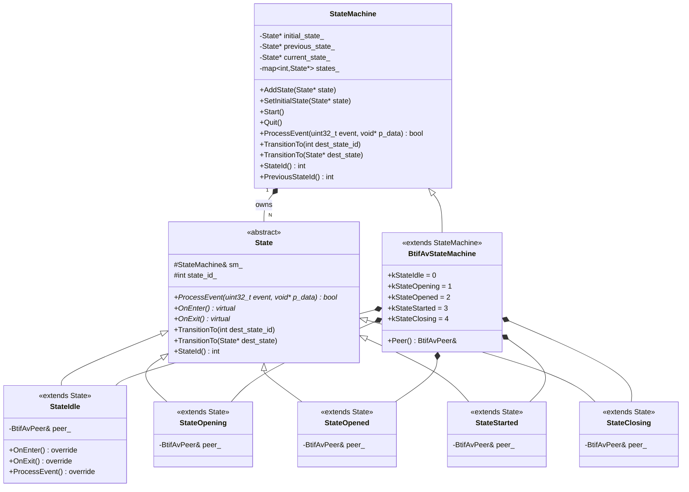
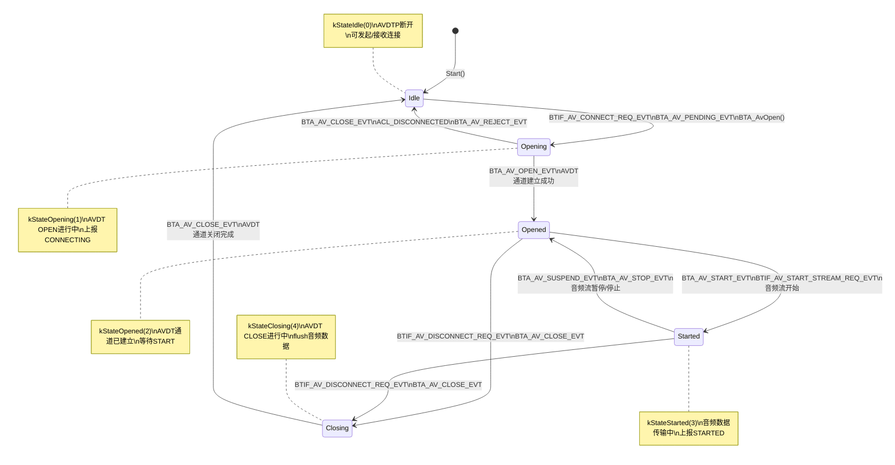
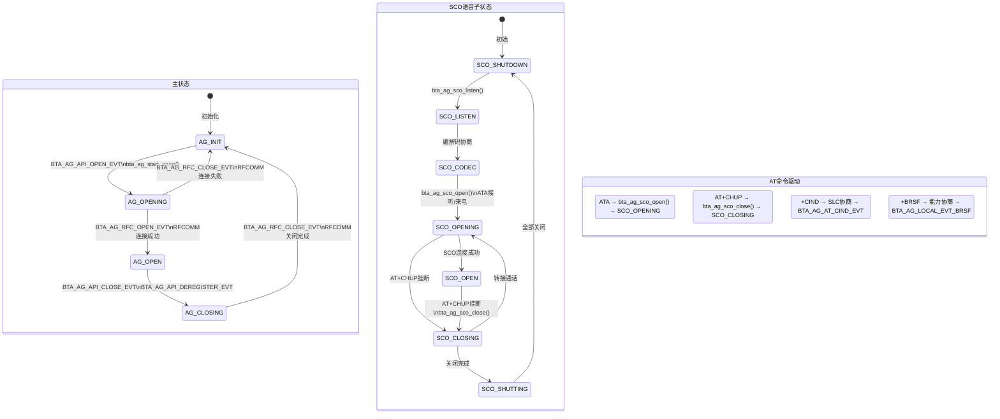
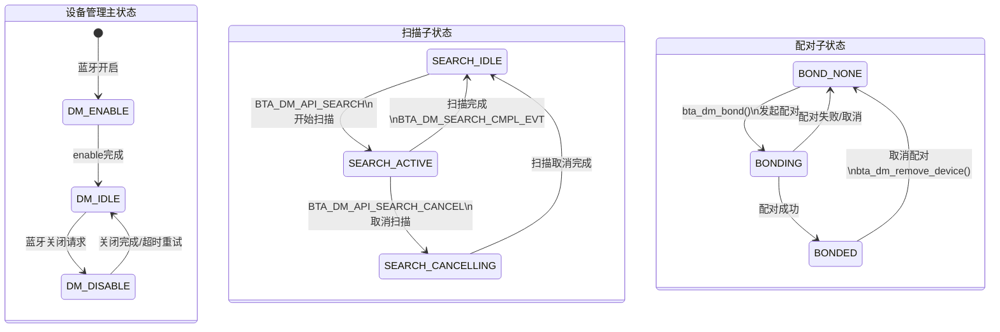
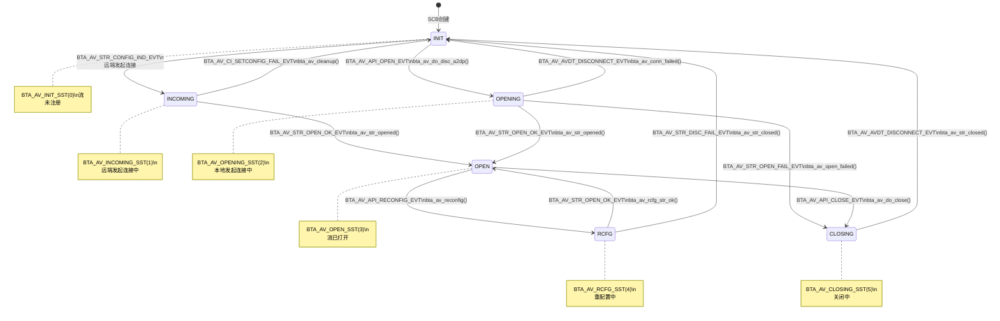

# T07_蓝牙状态机详解

> 学习日期：2026-05-16 | 优先级：P0 | 预计学习时间：3小时

---

## 1. 📋 本章导读

### 学什么
- Android蓝牙原生栈中的通用状态机框架 `common/state_machine.h`
- A2DP Profile状态机 `btif_av` 的5状态转换与Source/Sink双实例
- HFP AG多子状态机（主状态 + SCO状态）及AT命令驱动
- BTA DM设备管理状态机（扫描/配对子状态）
- AV Stream流传输状态机 `bta_av_ssm` 与btif_av的协作机制

### 为什么学
- 蓝牙连接/断连/音频传输的每一步都是状态转换，不理解状态机就无法追踪问题
- 线上A2DP连不上、HFP通话无声、扫描卡死等问题，90%是状态机卡在某个中间状态
- 状态机是蓝牙栈最核心的设计模式，掌握它等于掌握了蓝牙栈的"运行时思维模型"

### 学完能做
- 能通过日志快速定位状态机卡在哪个状态、哪个事件未处理
- 能在现有状态机基础上添加新状态或新事件处理
- 能理解btif_av与bta_av_ssm双层状态机的协作关系，排查跨层问题

---

## 2. 🗺️ 架构全景图

### 2.1 状态机框架类图



### 2.2 A2DP btif_av状态转换图



### 2.3 HFP AG多子状态图



### 2.4 BTA DM扫描配对子状态图



### 2.5 AV Stream状态机图



---

## 3. 🔍 代码导航

| 步骤 | 操作 | 文件 | 行号 | 看什么 |
|------|------|------|------|--------|
| 1 | 状态机基类定义 | `system/common/state_machine.h` | L31-207 | StateMachine+State完整接口，TransitionTo核心逻辑 |
| 2 | State纯虚函数声明 | `system/common/state_machine.h` | L61 | ProcessEvent纯虚函数，子类必须实现 |
| 3 | TransitionTo核心实现 | `system/common/state_machine.h` | L177-184 | OnExit→切换→OnEnter三步流程 |
| 4 | AddState+SetInitialState | `system/common/state_machine.h` | L193-200 | 状态注册与初始状态设定 |
| 5 | btif_av状态机构造 | `system/btif/src/btif_av.cc` | L241-254 | 5个State对象创建、AddState、SetInitialState |
| 6 | StateIdle::ProcessEvent | `system/btif/src/btif_av.cc` | L1698-1965 | Idle状态处理CONNECT_REQ/PENDING事件→Opening |
| 7 | StateOpening::ProcessEvent | `system/btif/src/btif_av.cc` | L1986-2215 | Opening状态处理OPEN_EVT/CLOSE_EVT/ACL_DISCONNECTED |
| 8 | StateOpened::ProcessEvent | `system/btif/src/btif_av.cc` | L2242-2482 | Opened状态处理START_EVT/DISCONNECT_EVT |
| 9 | StateStarted::ProcessEvent | `system/btif/src/btif_av.cc` | L2502-2718 | Started状态处理SUSPEND_EVT/STOP_EVT |
| 10 | StateClosing::ProcessEvent | `system/btif/src/btif_av.cc` | L2738-2790 | Closing状态处理CLOSE_EVT→Idle |
| 11 | HFP AG主状态机 | `system/bta/ag/bta_ag_main.cc` | L562-760 | bta_ag_better_state_machine，4状态switch嵌套 |
| 12 | HFP SCO子状态机 | `system/bta/ag/bta_ag_sco.cc` | L376-1135 | 11个SCO子状态转换 |
| 13 | AT命令表定义 | `system/bta/ag/bta_ag_cmd.cc` | L82-109 | HFP AT命令解析表，A/ATA/+CHUP/+CIND等 |
| 14 | AV Stream状态机 | `system/bta/av/bta_av_ssm.cc` | L78-484 | bta_av_ssm_execute，6状态switch嵌套 |
| 15 | DM扫描子状态 | `system/bta/dm/bta_dm_device_search.cc` | L63-79 | SEARCH_IDLE/ACTIVE/CANCELLING三态切换 |

---

## 4. 📖 核心流程详解

### 4.1 StateMachine框架——TransitionTo核心流程

```cpp
// system/common/state_machine.h L177-184
void StateMachine::TransitionTo(StateMachine::State* dest_state) {
    if (current_state_ != nullptr) {    // 💡C++: 空指针检查，类似Java的null检查
        current_state_->OnExit();        // ① 旧状态的退出清理
    }
    previous_state_ = current_state_;    // ② 保存前一个状态（用于回退判断）
    current_state_ = dest_state;         // ③ 切换到新状态
    current_state_->OnEnter();           // ④ 新状态的进入初始化
}
// 💡C++: 裸指针直接赋值，没有智能指针。StateMachine在析构时delete所有State对象(L102-106)
// 💡C++: Java类比：类似State Pattern中Context.setState()，但C++版本更底层，无GC
```

### 4.2 StateMachine框架——ProcessEvent代理分发

```cpp
// system/common/state_machine.h L151-156
bool StateMachine::ProcessEvent(uint32_t event, void* p_data) {
    if (current_state_ == nullptr) {     // 空状态不处理
        return false;
    }
    return current_state_->ProcessEvent(event, p_data);
    // 💡C++: 多态分发，current_state_是基类指针，实际调用子类的ProcessEvent
    // 💡C++: Java类比：类似abstract class State.processEvent()，子类@Override
}
```

### 4.3 btif_av状态机构造——AddState+SetInitialState+Start

```cpp
// system/btif/src/btif_av.cc L241-254
explicit BtifAvStateMachine(BtifAvPeer& btif_av_peer) : peer_(btif_av_peer) {
    state_idle_ = new StateIdle(*this);      // 💡C++: new创建堆对象，StateMachine析构时delete
    state_opening_ = new StateOpening(*this);
    state_opened_ = new StateOpened(*this);
    state_started_ = new StateStarted(*this);
    state_closing_ = new StateClosing(*this);

    AddState(state_idle_);       // 注册到states_ map中
    AddState(state_opening_);
    AddState(state_opened_);
    AddState(state_started_);
    AddState(state_closing_);
    SetInitialState(state_idle_); // 设定初始状态为Idle
}
// Start() → TransitionTo(initial_state_) → state_idle_->OnEnter()
// 💡C++: 构造函数中new，析构函数中delete。Java不需要手动delete，有GC
```

### 4.4 StateIdle处理连接请求——Idle→Opening

```cpp
// system/btif/src/btif_av.cc L1724-1760
case BTIF_AV_CONNECT_REQ_EVT:
case BTA_AV_PENDING_EVT: {
    bool can_connect = true;
    peer_.SetSelfInitiatedConnection(event == BTIF_AV_CONNECT_REQ_EVT);
    if (peer_.IsSink()) {                                     // Sink角色：本地是Source
        can_connect = btif_av_source.AllowedToConnect(peer_.PeerAddress());
        if (!can_connect) btif_av_source_disconnect(peer_.PeerAddress());
    } else if (peer_.IsSource()) {                            // Source角色：本地是Sink
        can_connect = btif_av_sink.AllowedToConnect(peer_.PeerAddress());
        if (!can_connect) btif_av_sink_disconnect(peer_.PeerAddress());
    }
    if (!can_connect) {
        log::error("Cannot connect to peer {}: too many connected peers", peer_.PeerAddress());
        if (peer_.SelfInitiatedConnection()) btif_queue_advance();
        break;
    }
    btif_av_query_mandatory_codec_priority(peer_.PeerAddress());  // 查询编解码优先级
    BTA_AvOpen(peer_.PeerAddress(), peer_.BtaHandle(),            // 发起AVDT连接
               true, peer_.LocalUuidServiceClass());
    peer_.StateMachine().TransitionTo(BtifAvStateMachine::kStateOpening);  // →Opening
}
// 💡C++: IsSink()判断远端是Sink，则本地是Source发送音频；IsSource()判断远端是Source，则本地是Sink接收音频
```

### 4.5 StateOpening处理AVDT打开结果——Opening→Opened/Idle

```cpp
// system/btif/src/btif_av.cc L1995-2019
case BTIF_AV_ACL_DISCONNECTED:
    // ACL断开只在Opening状态需要特殊处理（中间态）
    log::warn("Peer {} : event={}: transitioning to Idle due to ACL Disconnect",
              peer_.PeerAddress(), BtifAvEvent::EventName(event));
    btif_report_connection_state(peer_.PeerAddress(),
        BTAV_CONNECTION_STATE_DISCONNECTED, ...);      // 上报Java层断连
    peer_.StateMachine().TransitionTo(BtifAvStateMachine::kStateIdle);  // →Idle
    if (peer_.SelfInitiatedConnection()) btif_queue_advance();  // 推进连接队列
    break;
case BTA_AV_REJECT_EVT:
    log::warn("Peer {} : event={} flags={}", peer_.PeerAddress(), ...);
    btif_report_connection_state(peer_.PeerAddress(),
        BTAV_CONNECTION_STATE_DISCONNECTED, ...);      // 上报被拒绝
    peer_.StateMachine().TransitionTo(BtifAvStateMachine::kStateIdle);  // →Idle
    if (peer_.SelfInitiatedConnection()) btif_queue_advance();
    break;
// BTA_AV_OPEN_EVT在Opening中处理→TransitionTo(kStateOpened)
// 💡C++: btif_queue_advance()是连接队列机制，一个设备连不上就尝试下一个
```

### 4.6 StateStarted处理暂停/停止——Started→Opened/Closing

```cpp
// system/btif/src/btif_av.cc L2523-2540
case BTIF_AV_STOP_STREAM_REQ_EVT:
case BTIF_AV_SUSPEND_STREAM_REQ_EVT:
    if (peer_.CheckFlags(BtifAvPeer::kFlagLocalSuspendPending)) {
        break;  // 已有挂起的本地暂停，忽略重复请求
    }
    peer_.SetFlags(BtifAvPeer::kFlagLocalSuspendPending);  // 设置本地暂停挂起标志
    peer_.ClearFlags(BtifAvPeer::kFlagRemoteSuspend);      // 本地暂停覆盖远端暂停
    // ... 后续调用BTA_AvSuspend或BTA_AvStop
    // BTA_AV_SUSPEND_EVT → TransitionTo(kStateOpened)
    // BTA_AV_STOP_EVT → TransitionTo(kStateOpened)
    // 💡C++: kFlagLocalSuspendPending等标志用位运算管理，类似Java的BitSet
```

### 4.7 HFP AG主状态机——INIT→OPENING→OPEN→CLOSING

```cpp
// system/bta/ag/bta_ag_main.cc L562-634
static void bta_ag_better_state_machine(tBTA_AG_SCB* p_scb, uint16_t event,
                                        const tBTA_AG_DATA& data) {
    switch (p_scb->state) {
    case BTA_AG_INIT_ST:              // 初始状态
        switch (event) {
        case BTA_AG_API_OPEN_EVT:
            p_scb->state = BTA_AG_OPENING_ST;     // 直接修改状态变量
            bta_ag_start_open(p_scb, data);        // 发起RFCOMM连接
            break;
        case BTA_AG_RFC_OPEN_EVT:     // 被动接收到RFCOMM连接
            p_scb->state = BTA_AG_OPEN_ST;
            bta_ag_rfc_acp_open(p_scb, data);
            bta_ag_sco_listen(p_scb, data);        // 开始监听SCO
            break;
        }
        break;
    case BTA_AG_OPENING_ST:           // 正在打开
        switch (event) {
        case BTA_AG_RFC_OPEN_EVT:
            p_scb->state = BTA_AG_OPEN_ST;         // RFCOMM连接成功
            bta_ag_rfc_open(p_scb, data);
            bta_ag_sco_listen(p_scb, data);
            break;
        case BTA_AG_RFC_CLOSE_EVT:
            p_scb->state = BTA_AG_INIT_ST;         // RFCOMM连接失败
            bta_ag_rfc_fail(p_scb, data);
            break;
        }
        break;
    // ... BTA_AG_OPEN_ST, BTA_AG_CLOSING_ST 类似
    }
}
// 💡C++: 与btif_av不同，HFP AG使用传统switch-case状态机，没有用OOP的State模式
// 💡C++: Java类比：类似if-else/switch状态机，不如State Pattern优雅但更直观
```

### 4.8 AV Stream状态机——bta_av_ssm_execute

```cpp
// system/bta/av/bta_av_ssm.cc L78-120
void bta_av_ssm_execute(tBTA_AV_SCB* p_scb, uint16_t event, tBTA_AV_DATA* p_data) {
    if (p_scb == NULL) {
        log::error("AV channel not registered");
        return;
    }
    uint8_t previous_state = p_scb->state;
    tBTA_AV_ACT event_handler1 = nullptr;   // 💡C++: 函数指针，指向事件处理函数
    tBTA_AV_ACT event_handler2 = nullptr;

    switch (p_scb->state) {
    case BTA_AV_INIT_SST:
        switch (event) {
        case BTA_AV_API_OPEN_EVT:
            p_scb->state = BTA_AV_OPENING_SST;    // 修改状态
            event_handler1 = &bta_av_do_disc_a2dp; // 设置处理函数
            break;
        case BTA_AV_STR_CONFIG_IND_EVT:
            p_scb->state = BTA_AV_INCOMING_SST;
            event_handler1 = &bta_av_config_ind;
            break;
        }
        break;
    // ... 其他状态
    }

    // 状态变更日志
    if (previous_state != p_scb->state) {
        log::info("peer {} ... state={}({}) -> {}({})", ...);
    }

    // 执行事件处理函数
    if (event_handler1 != nullptr) event_handler1(p_scb, p_data);
    if (event_handler2 != nullptr) event_handler2(p_scb, p_data);
    // 💡C++: 函数指针延迟执行模式——先收集handler，最后统一执行
    // 💡C++: Java类比：类似Consumer<tBTA_AV_SCB>函数式接口，但C++用函数指针更高效
}
```

---

## 5. 💡 C++知识卡片

### 5.1 虚函数与多态 vs Java抽象类

| 特性 | C++ (蓝牙栈) | Java类比 |
|------|-------------|---------|
| 纯虚函数 | `virtual bool ProcessEvent(...) = 0;` | `abstract boolean processEvent(...);` |
| 虚函数(有默认实现) | `virtual void OnEnter() {}` | 可在abstract类中提供默认实现 |
| 多态调用 | 基类指针`State*`→子类方法 | 接口/抽象类引用→实现类方法 |
| 析构 | `virtual ~State() = default;` 手动管理 | 无需关心，GC自动回收 |
| 内存管理 | `new StateIdle(*this)` + 析构时`delete` | `new StateIdle(this)` 由GC回收 |
| override关键字 | `ProcessEvent(...) override` (C++11) | `@Override`注解 |

**核心差异**：C++虚函数表(vtable)在编译期生成，运行时通过vptr查找；Java虚方法分派由JVM在运行时解析。C++没有GC，StateMachine析构函数负责delete所有State对象。

### 5.2 状态模式 State Pattern

```
经典State Pattern结构：
┌─────────────┐      ┌──────────────┐
│  Context     │─────▶│  State       │  (接口/抽象类)
│ (StateMachine)│      │ +handle()    │
│ -state       │      └──────┬───────┘
└─────────────┘             │
                   ┌────────┼────────┐
                   ▼        ▼        ▼
              ┌────────┐┌────────┐┌────────┐
              │StateA  ││StateB  ││StateC  │
              │+handle()││+handle()││+handle()│
              └────────┘└────────┘└────────┘
```

蓝牙栈的实现与经典State Pattern的对应：
- **Context** = `StateMachine`（持有current_state_，代理ProcessEvent）
- **State接口** = `StateMachine::State`（ProcessEvent纯虚函数 + OnEnter/OnExit钩子）
- **ConcreteState** = `StateIdle/StateOpening/StateOpened/StateStarted/StateClosing`
- **状态转换** = `TransitionTo()`（在State内部调用，State持有StateMachine引用）

**与HFP AG/bta_av_ssm的对比**：HFP AG和bta_av_ssm使用传统switch-case状态机，直接修改`p_scb->state`变量。这种方式更简单但不利于扩展——添加新状态需要修改switch-case，违反开闭原则。btif_av的OOP方式只需添加新State子类。

### 5.3 std::function与策略模式

蓝牙栈中大量使用函数指针和回调，本质是策略模式的C++实现：

| C++机制 | 蓝牙栈使用场景 | Java类比 |
|---------|--------------|---------|
| 函数指针 `tBTA_AV_ACT` | bta_av_ssm中event_handler1/event_handler2 | `Consumer<T>` 函数式接口 |
| `base::BindOnce` | btif_av中`do_in_main_thread(BindOnce(...))` | `executor.execute(() -> ...)` |
| `base::Unretained` | `BindOnce(&BtifAvSource::DeleteIdlePeers, Unretained(&btif_av_source))` | 不持有引用，调用方保证对象存活 |
| `std::promise/std::future` | `btif_av_source.SetActivePeer(addr, std::move(promise))` | `CompletableFuture<Void>` |
| `std::optional` | `std::optional<btif_av_reconfig_req_t> reconfig_req_` | `Optional<ReconfigReq>` |

**💡关键区别**：C++的`base::BindOnce`类似Java的lambda，但需要手动管理对象生命周期（`Unretained`表示不管理生命周期，`base::Owned`表示转移所有权）。Java的lambda自动捕获this为弱引用，不会悬空。

---

## 6. 🗂️ Java ↔ C++ 对照表

| Java层 | JNI桥接 | C++层 | 数据流方向 |
|--------|---------|-------|-----------|
| A2dpService.connect() | com_android_bluetooth_a2dp.cpp | btif_av_source_connect() | Java→C++ |
| A2dpStateMachine(Java) | - | BtifAvStateMachine(C++) | Java状态≠C++状态，Java通过回调同步 |
| A2dpService.disconnect() | a2dp_disconnect() | BTIF_AV_DISCONNECT_REQ_EVT | Java→C++ |
| BluetoothHeadset.connect() | com_android_bluetooth_hfp.cpp | bta_ag_api_open() | Java→C++ |
| HeadsetStateMachine(Java) | - | bta_ag_better_state_machine(C++) | Java状态≠C++状态 |
| ATA接听(Java) | answer_call() | BTA_AG_AT_A_EVT → bta_ag_sco_open() | Java→C++→SCO |
| AT+CHUP挂断(Java) | hangup_call() | BTA_AG_AT_CHUP_EVT → bta_ag_sco_close() | Java→C++→SCO |
| BluetoothAdapter.startScan() | start_discovery() | bta_dm_search → SEARCH_ACTIVE | Java→C++ |
| BluetoothDevice.createBond() | create_bond() | bta_dm_bond() → BONDING | Java→C++ |
| btav_source_callbacks_t | jni回调 | btif_report_connection_state() | C++→Java |
| btav_sink_callbacks_t | jni回调 | btif_report_audio_state() | C++→Java |
| IBluetoothHeadsetPhone callback | jni回调 | bta_ag_sco_conn_open/close | C++→Java |

---

## 7. 🐛 问题排查SOP

### 7.1 A2DP连接卡在Opening状态

**症状**：A2DP连接请求发出后，状态一直停留在Opening，无法进入Opened

**排查步骤**：

```
步骤1：确认AVDT连接是否发出
  adb logcat -s bluetooth-a2dp | grep "BTA_AvOpen"
  → 如果没有日志，检查BtifAvPeer是否正确创建，BtaHandle是否有效

步骤2：确认远端是否响应
  adb logcat -s bluetooth-a2dp | grep -E "BTA_AV_OPEN_EVT|BTA_AV_CLOSE_EVT|BTA_AV_REJECT_EVT"
  → 如果没有OPEN_EVT，检查远端设备是否支持A2DP、信号强度

步骤3：检查ACL是否断开
  adb logcat -s bluetooth-a2dp | grep "ACL_DISCONNECTED"
  → Opening状态收到ACL_DISCONNECTED会直接回到Idle(L1995-2009)

步骤4：检查SDP查询是否成功
  adb logcat -s bluetooth-a2dp | grep -E "SDP_DISC_OK|SDP_DISC_FAIL"
  → SDP失败会导致连接失败

步骤5：检查连接队列是否阻塞
  adb logcat -s bluetooth-a2dp | grep "btif_queue_advance"
  → 如果前一个连接未完成，后续连接会排队等待
```

**常见原因**：
1. 远端设备不支持A2DP Sink/Source角色 → SDP查询失败
2. 芯片HCI命令未响应 → AVDT信令无法发出
3. 连接数已达上限 → `AllowedToConnect()`返回false
4. ACL链路被意外断开 → Opening中收到ACL_DISCONNECTED

### 7.2 HFP通话无声（SCO状态异常）

**症状**：HFP连接正常（AG_OPEN状态），但通话时无声音

**排查步骤**：

```
步骤1：确认SCO是否成功建立
  adb logcat -s bt_bta_ag | grep -E "sco.*state|SCO_OPEN|SCO_OPENING"
  → 如果SCO停留在LISTEN/SHUTDOWN，说明SCO连接未发起

步骤2：确认ATA命令是否触发SCO建链
  adb logcat -s bt_bta_ag | grep -E "BTA_AG_AT_A_EVT|bta_ag_sco_open"
  → ATA事件应触发bta_ag_sco_open() → SCO_OPENING_ST

步骤3：检查SCO编解码协商
  adb logcat -s bt_bta_ag | grep -E "BCS|codec|CODEC"
  → SCO_CODEC_ST协商失败会导致无法进入OPENING

步骤4：检查是否有SCO冲突
  adb logcat -s bt_bta_ag | grep -E "p_curr_scb|XFER"
  → 已有SCO连接时，新SCO需要先关闭旧的（SCO_OPEN_XFER_ST）

步骤5：确认SCO回调是否到达Java层
  adb logcat -s bt_bta_ag | grep "sco_conn_open"
  → SCO_OPEN_ST进入后应回调Java层通知通话状态
```

**常见原因**：
1. AT命令解析失败 → ATA/+CHUP未正确触发
2. 编解码协商失败（CVSD vs mSBC）→ 停留在SCO_CODEC_ST
3. SCO通道被其他Profile占用 → 需要SCO转移
4. 芯片SCO链路建立失败 → HCI Create Connection未响应

---

## 8. 🛠️ 动手练习

### 入门级

1. **追踪A2DP完整连接流程**：在`btif_av.cc`的5个State的OnEnter/OnExit中添加LOG，连接蓝牙耳机，观察完整的状态转换日志序列

2. **绘制HFP AG状态转换表**：阅读`bta_ag_main.cc` L562-760，列出BTA_AG_OPEN_ST状态下所有事件及对应的状态转换和处理函数

### 进阶级

3. **实现自定义状态机**：使用`common/state_machine.h`框架，实现一个简单的BLE连接状态机（Idle→Connecting→Connected→Disconnecting），包含超时自动回退逻辑

4. **分析btif_av与bta_av_ssm的事件桥接**：追踪从`BTIF_AV_START_STREAM_REQ_EVT`到`BTA_AV_AP_START_EVT`再到`BTA_AV_STR_START_OK_EVT`的完整事件流转路径，画出跨层时序图

### 实战级

5. **添加A2DP调试命令**：在btif_av中添加一个dumpsys命令，输出所有BtifAvPeer的当前状态、flags、active peer信息，用于线上问题排查

6. **实现SCO状态监控**：在bta_ag_sco.cc中添加SCO状态停留时间统计，当SCO在OPENING状态停留超过5秒时输出告警日志

---

## 9. 📚 关键源码索引

| 序号 | 模块 | 文件路径 | 关键内容 |
|------|------|---------|---------|
| 1 | StateMachine框架 | `system/common/state_machine.h` | StateMachine+State基类定义 |
| 2 | State纯虚函数 | `system/common/state_machine.h` L61 | ProcessEvent纯虚函数声明 |
| 3 | TransitionTo实现 | `system/common/state_machine.h` L177-184 | OnExit→切换→OnEnter核心流程 |
| 4 | AddState/SetInitialState | `system/common/state_machine.h` L193-200 | 状态注册与初始化 |
| 5 | btif_av状态枚举 | `system/btif/src/btif_av.cc` L178-184 | kStateIdle~kStateClosing |
| 6 | BtifAvStateMachine构造 | `system/btif/src/btif_av.cc` L241-254 | 5个State创建与注册 |
| 7 | StateIdle::ProcessEvent | `system/btif/src/btif_av.cc` L1698-1965 | Idle状态事件处理 |
| 8 | StateOpening::ProcessEvent | `system/btif/src/btif_av.cc` L1986-2215 | Opening状态事件处理 |
| 9 | StateOpened::ProcessEvent | `system/btif/src/btif_av.cc` L2242-2482 | Opened状态事件处理 |
| 10 | StateStarted::ProcessEvent | `system/btif/src/btif_av.cc` L2502-2718 | Started状态事件处理 |
| 11 | StateClosing::ProcessEvent | `system/btif/src/btif_av.cc` L2738-2790 | Closing状态事件处理 |
| 12 | HFP AG主状态枚举 | `system/bta/ag/bta_ag_int.h` L279 | BTA_AG_INIT_ST~CLOSING_ST |
| 13 | HFP AG状态机实现 | `system/bta/ag/bta_ag_main.cc` L562-760 | bta_ag_better_state_machine |
| 14 | HFP SCO子状态枚举 | `system/bta/ag/bta_ag_int.h` L125-135 | 11个SCO子状态 |
| 15 | HFP SCO状态机 | `system/bta/ag/bta_ag_sco.cc` L376-1135 | SCO状态转换实现 |
| 16 | HFP AT命令表 | `system/bta/ag/bta_ag_cmd.cc` L82-109 | ATA/+CHUP/+CIND等命令定义 |
| 17 | AV Stream状态枚举 | `system/bta/av/bta_av_ssm.cc` L43-50 | BTA_AV_INIT_SST~CLOSING_SST |
| 18 | AV Stream状态机 | `system/bta/av/bta_av_ssm.cc` L78-484 | bta_av_ssm_execute实现 |
| 19 | DM扫描子状态 | `system/bta/dm/bta_dm_device_search_int.h` L63-65 | SEARCH_IDLE/ACTIVE/CANCELLING |
| 20 | DM扫描实现 | `system/bta/dm/bta_dm_device_search.cc` L54-458 | 扫描状态切换逻辑 |
| 21 | BtifAvPeer定义 | `system/btif/src/btif_av.cc` L267-409 | Peer状态与标志位管理 |
| 22 | BtifAvEvent定义 | `system/btif/src/btif_av.cc` L147-168 | 事件封装与深拷贝 |
| 23 | btif_av事件枚举 | `system/btif/src/btif_av.cc` L130-145 | BTIF_AV_CONNECT_REQ_EVT等 |
| 24 | BtifAvSource/Sink | `system/btif/src/btif_av.cc` L411-500 | Source/Sink独立实例管理 |

---

## 10. 质量检查清单

- [x] 10个章节全部包含
- [x] 5个Mermaid图表（状态机框架类图、A2DP状态转换图、HFP AG多子状态图、BTA DM扫描配对子状态图、AV Stream状态机图）
- [x] 代码导航表15行，包含文件路径和行号
- [x] 8个代码片段，每个带文件路径和行号，逐行中文注释
- [x] 3个C++知识卡片（虚函数与多态、状态模式、std::function与策略模式）
- [x] Java↔C++对照表12行
- [x] 2个问题排查SOP
- [x] 6个动手练习（入门2+进阶2+实战2）
- [x] 关键源码索引24行
- [x] C++知识点用💡C++标注并给出Java类比
- [x] 所有代码注释为中文
- [x] 笔记开头格式正确
