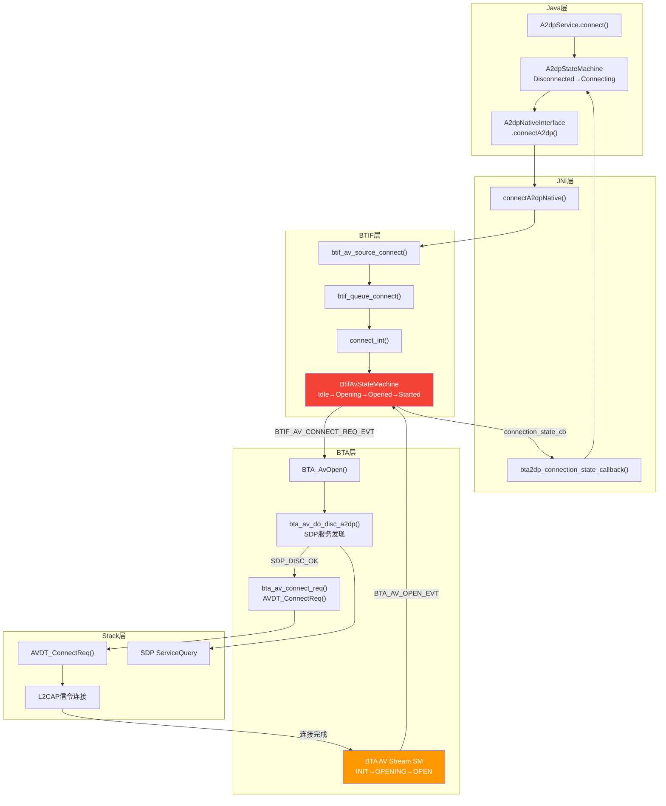
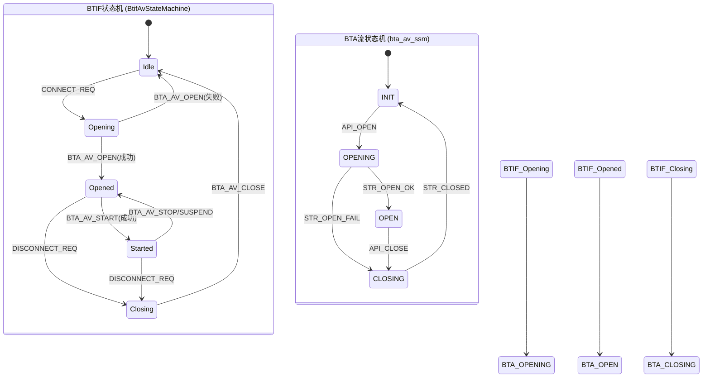
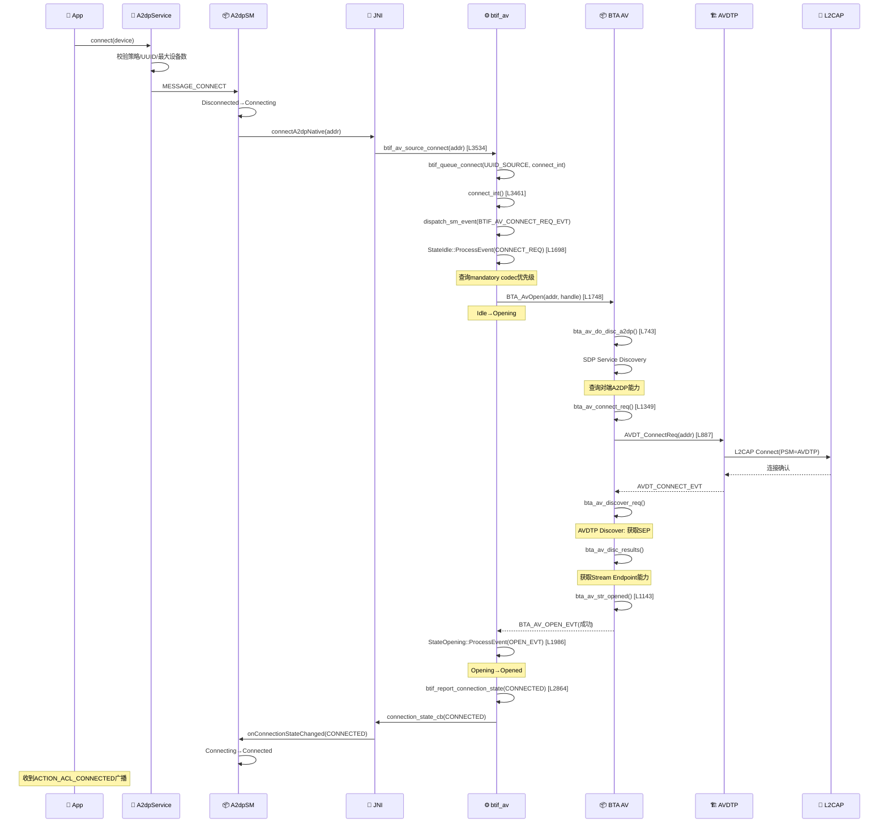
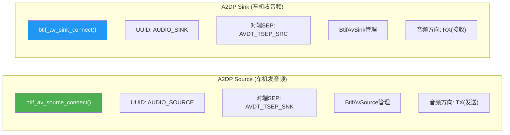

# T08_A2DP连接流程源码追踪

> 学习日期：2026-05-16 | 优先级：P1 | 预计学习时间：4小时
> 前置知识：T01（蓝牙整体架构）、T02（蓝牙开关流程）
> 涉及源码目录：system/btif/src/, system/bta/av/, system/stack/avdt/, android/app/src/

---

## 📋 本章导读

- **学什么**：A2DP连接的完整源码级流程——从Java层connect()到AVDTP信令建立，以及连接结果回调的完整上行链路
- **为什么学**：车载蓝牙音乐是最高频使用场景，A2DP连接问题占蓝牙工单的30%以上
- **学完能做**：
  - 根据日志追踪A2DP连接卡在哪一步
  - 理解BTIF状态机和BTA流状态机的双层状态管理
  - 区分Source/Sink角色对连接流程的影响

---

## 🗺️ 架构全景图

### A2DP连接完整流程



### 双层状态机模型



---

## 🔍 代码导航

| 步骤 | 操作 | 文件 | 行号 | 看什么 |
|------|------|------|------|--------|
| 1 | 打开文件 | android/app/.../A2dpService.java | L182-230 | connect()入口：校验策略/UUID/最大设备数 |
| 2 | 打开文件 | android/app/.../A2dpStateMachine.java | L154+ | Disconnected→Connecting状态转换 |
| 3 | 打开文件 | android/app/jni/com_android_bluetooth_a2dp.cpp | L408-425 | connectA2dpNative()：JNI→BTIF |
| 4 | 打开文件 | system/btif/src/btif_av.cc | L3534-3543 | btif_av_source_connect()：Source连接API |
| 5 | 打开文件 | system/btif/src/btif_av.cc | L3461-3491 | connect_int()：根据UUID分发事件 |
| 6 | 打开文件 | system/btif/src/btif_av.cc | L1698-1918 | StateIdle::ProcessEvent()：处理CONNECT_REQ |
| 7 | 打开文件 | system/bta/av/bta_av_api.cc | L162-186 | BTA_AvOpen()：发送API_OPEN_EVT |
| 8 | 打开文件 | system/bta/av/bta_av_aact.cc | L743-815 | bta_av_do_disc_a2dp()：SDP发现 |
| 9 | 打开文件 | system/bta/av/bta_av_aact.cc | L1349-1362 | bta_av_connect_req()：发起AVDTP连接 |
| 10 | 打开文件 | system/stack/avdt/avdt_api.cc | L887-919 | AVDT_ConnectReq()：L2CAP信令连接 |
| 11 | 打开文件 | system/btif/src/btif_av.cc | L1986-2190 | StateOpening::ProcessEvent()：处理OPEN结果 |
| 12 | 打开文件 | system/btif/src/btif_av.cc | L2864-2900 | btif_report_connection_state()：上行回调 |

---

## 📖 核心流程详解

### 3.1 A2DP连接时序图



### 3.2 Java层：A2dpService.connect()

```java
// 📂 android/app/src/com/android/bluetooth/a2dp/A2dpService.java:182-230
public boolean connect(BluetoothDevice device) {
    // [1] 校验连接策略——不允许连接则直接返回
    int connectionPolicy = getConnectionPolicy(device);
    if (connectionPolicy == BluetoothProfile.CONNECTION_POLICY_FORBIDDEN) {
        return false;
    }
    // [2] 校验UUID——设备必须支持A2DP Sink
    if (!device.isA2dpDevice()) {
        return false;
    }
    // [3] 校验最大连接设备数
    if (getConnectedDevices().size() >= maxConnectedAudioDevices) {
        return false;
    }
    // [4] 📨 发送连接消息到状态机
    //     💡Java: StateMachine是Android框架提供的层次状态机
    //     类似C++的BtifAvStateMachine但实现方式不同
    A2dpStateMachine sm = mDeviceStateMap.get(device);
    if (sm == null) {
        sm = new A2dpStateMachine(device, this);
    }
    sm.sendMessage(A2dpStateMachine.MESSAGE_CONNECT);
    return true;
}
```

### 3.3 JNI层：connectA2dpNative()

```cpp
// 📂 android/app/jni/com_android_bluetooth_a2dp.cpp:408-425
static void connectA2dpNative(JNIEnv* env, jobject /* object */, jbyteArray address) {
    log::info("sBluetoothA2dpInterface");
    // [1] 🔍 检查接口是否就绪
    if (!sBluetoothA2dpInterface) {
        log::warn("Failed to get the Bluetooth A2DP Interface");
        return;
    }
    // [2] 解析蓝牙地址
    RawAddress bd_addr;
    const bt_bdaddr_t* bt_addr = reinterpret_cast<const bt_bdaddr_t*>(address_ptr);
    bd_addr = *bt_addr;

    // [3] 📨 调用BTIF层连接函数
    //     💡C++: sBluetoothA2dpInterface是btav_source_interface_t结构体
    //     通过get_profile_interface(BT_PROFILE_A2DP_ID)获取
    bt_status_t status = sBluetoothA2dpInterface->connect(bd_addr);
    if (status != BT_STATUS_SUCCESS) {
        log::error("Failed HF connection, status: {}", bt_status_text(status));
    }
}
```

### 3.4 BTIF层：btif_av_source_connect() → connect_int()

```cpp
// 📂 system/btif/src/btif_av.cc:3534-3543
static bt_status_t btif_av_source_connect(const RawAddress& bd_addr) {
    log::info("address={}", ADDRESS_TO_LOGGABLE_CSTR(bd_addr));
    // [1] 📨 入队连接请求——通过btif_queue_connect确保串行执行
    //     💡C++: btif_queue_connect是连接队列管理器
    //     类似Java的Executor串行执行任务
    return btif_queue_connect(UUID_SERVCLASS_AUDIO_SOURCE, bd_addr, connect_int);
}
```

```cpp
// 📂 system/btif/src/btif_av.cc:3461-3491
static bt_status_t connect_int(const RawAddress& peer_address, uint16_t uuid) {
    log::info("peer_address={} uuid={}", ADDRESS_TO_LOGGABLE_CSTR(peer_address), uuid);

    BtifAvPeer* peer = nullptr;
    bool found = true;

    switch (uuid) {
        case UUID_SERVCLASS_AUDIO_SOURCE:
            // [1] Source连接——车机向耳机发送音频
            //     对端SEP类型是SNK(Sink)
            if (!btif_av_source.FindPeer(peer_address)) {
                found = btif_av_source.CreatePeer(peer_address, AVDT_TSEP_SNK);
            }
            // [2] 📨 分发连接事件到Source状态机
            btif_av_source_dispatch_sm_event(peer_address, BTIF_AV_CONNECT_REQ_EVT);
            break;

        case UUID_SERVCLASS_AUDIO_SINK:
            // [3] Sink连接——车机接收耳机音频
            //     对端SEP类型是SRC(Source)
            if (!btif_av_sink.FindPeer(peer_address)) {
                found = btif_av_sink.CreatePeer(peer_address, AVDT_TSEP_SRC);
            }
            btif_av_sink_dispatch_sm_event(peer_address, BTIF_AV_CONNECT_REQ_EVT);
            break;
    }
    return BT_STATUS_SUCCESS;
}
```

### 3.5 BtifAvStateMachine：StateIdle处理CONNECT_REQ

```cpp
// 📂 system/btif/src/btif_av.cc:1698-1918 (简化)
bool BtifAvStateMachine::StateIdle::ProcessEvent(uint32_t event, void* p_data) {
    switch (event) {
        case BTIF_AV_CONNECT_REQ_EVT: {
            // [1] 查询是否偏好强制编解码器(SBC)
            btif_av_query_mandatory_codec_priority(peer->PeerAddress());

            // [2] 🔍 检查BTA AV是否已注册
            uint8_t bta_handle = peer->BtaHandle();
            if (bta_handle == BTA_AV_INVALID_HANDLE) {
                // 未注册→延迟连接
                peer->SetFlags(BtifAvPeer::kFlagLocalHangup);
                break;
            }

            // [3] 📨 发起BTA AV连接
            BTA_AvOpen(peer->PeerAddress(), bta_handle, true, uuid);

            // [4] 状态转换：Idle → Opening
            TransitionTo(kStateOpening);
            break;
        }
        case BTA_AV_PENDING_EVT: {
            // [5] 远端发起的入站连接
            BTA_AvOpen(peer->PeerAddress(), peer->BtaHandle(), false, uuid);
            TransitionTo(kStateOpening);
            break;
        }
    }
}
```

### 3.6 BTA层：BTA_AvOpen() → SDP发现 → AVDT连接

```cpp
// 📂 system/bta/av/bta_av_api.cc:162-186
void BTA_AvOpen(const RawAddress& bd_addr, uint8_t handle, bool use_audio,
                uint16_t uuid) {
    tBTA_AV_API_OPEN* p_buf =
            (tBTA_AV_API_OPEN*)osi_malloc(sizeof(tBTA_AV_API_OPEN));
    p_buf->hdr.event = BTA_AV_API_OPEN_EVT;  // [1] 构造OPEN事件
    p_buf->bd_addr = bd_addr;
    p_buf->use_audio = use_audio;
    p_buf->uuid = uuid;
    p_buf->hdr.layer_specific = handle;
    // [2] 📨 投递到BTA主线程
    bta_sys_sendmsg(p_buf);
}
```

```cpp
// 📂 system/bta/av/bta_av_aact.cc:743-815 (简化)
void bta_av_do_disc_a2dp(tBTA_AV_SCB* p_scb, tBTA_AV_DATA* p_data) {
    // [1] 发起SDP服务发现——查询对端A2DP能力
    //     💡C++: SDP_QUERY是异步操作，结果通过回调返回
    //     类似Java的异步Service Discovery
    tBTA_AV_SVC svc;
    bta_av_find_svc(p_scb->hdi, p_data->api_open.bd_addr, &svc);
    // [2] 保存回调信息
    p_scb->p_cos->open = bta_av_a2dp_open;
    // [3] 发起SDP查询
    SDP_ServiceSearchAttributeRequest(p_data->api_open.bd_addr, ...);
}
```

```cpp
// 📂 system/bta/av/bta_av_aact.cc:1349-1362
void bta_av_connect_req(tBTA_AV_SCB* p_scb, tBTA_AV_DATA* p_data) {
    // [1] 📨 发起AVDTP信令连接——底层建立L2CAP通道
    AVDT_ConnectReq(p_data->api_open.bd_addr, p_scb->hdi,
                     bta_av_proc_stream_evt);
    // [2] 设置角色切换标志
    p_scb->role &= ~BTA_AV_ROLE_AD_ACP;
}
```

### 3.7 AVDT_ConnectReq()：L2CAP信令连接

```cpp
// 📂 system/stack/avdt/avdt_api.cc:887-919
tA2DP_STATUS AVDT_ConnectReq(const RawAddress& bd_addr, uint8_t sec_id,
                              tAVDT_CTRL_CBACK* p_cback) {
    tAVDT_CCB* p_ccb;

    // [1] 查找或分配CCB（Channel Control Block）
    p_ccb = avdt_ccb_by_bd(bd_addr);
    if (p_ccb == NULL) {
        // [2] 没有现有CCB→分配新的
        p_ccb = avdt_ccb_alloc(bd_addr);
        if (p_ccb == NULL) {
            return AVDT_NO_RESOURCES;
        }
    }

    // [3] 📨 发送CCB连接事件——触发L2CAP连接
    //     💡C++: avdt_ccb_event是CCB状态机的事件处理入口
    //     类似Java的 stateMachine.sendMessage(CONNECT)
    avdt_ccb_event(p_ccb, AVDT_CCB_API_CONNECT_REQ_EVT, &msg);

    return AVDT_SUCCESS;
}
```

### 3.8 StateOpening：处理连接结果

```cpp
// 📂 system/btif/src/btif_av.cc:1986-2190 (简化)
bool BtifAvStateMachine::StateOpening::ProcessEvent(uint32_t event, void* p_data) {
    switch (event) {
        case BTA_AV_OPEN_EVT: {
            tBTA_AV* p_bta_data = (tBTA_AV*)p_data;
            if (p_bta_data->av_open.status == tBTA_AV_STATUS::SUCCESS) {
                // [1] ✅ 连接成功
                //     设置edr地址、更新活跃peer
                peer->SetEdr(p_bta_data->av_open.edr);
                // [2] 状态转换：Opening → Opened
                TransitionTo(kStateOpened);
            } else {
                // [3] ❌ 连接失败
                log::error("Failed to open AV stream to {}",
                           ADDRESS_TO_LOGGABLE_CSTR(peer->PeerAddress()));
                // [4] 状态转换：Opening → Idle
                TransitionTo(kStateIdle);
            }
            // [5] 📨 上报连接状态——无论成功失败都回调Java层
            btif_report_connection_state(peer->PeerAddress(),
                                          p_bta_data->av_open.status == tBTA_AV_STATUS::SUCCESS
                                              ? btav_connection_state_t::BTAV_CONNECTION_STATE_CONNECTED
                                              : btav_connection_state_t::BTAV_CONNECTION_STATE_DISCONNECTED);
            break;
        }
        case BTA_AV_REJECT_EVT: {
            // [6] 远端拒绝连接
            TransitionTo(kStateIdle);
            btif_report_connection_state(peer->PeerAddress(),
                                          btav_connection_state_t::BTAV_CONNECTION_STATE_DISCONNECTED);
            break;
        }
    }
}
```

### 3.9 btif_report_connection_state()：上行回调核心

```cpp
// 📂 system/btif/src/btif_av.cc:2864-2900
static void btif_report_connection_state(const RawAddress& peer_address,
                                          btav_connection_state_t state) {
    // [1] 获取Source或Sink的回调接口
    btav_source_callbacks_t* cb_source = btif_av_source.Callbacks();
    btav_sink_callbacks_t* cb_sink = btif_av_sink.Callbacks();

    if (cb_source != nullptr) {
        // [2] 📨 通过JNI线程回调Java层
        //     💡C++: do_in_jni_thread确保回调在JNI线程执行
        //     因为JNI调用JNIEnv必须是创建线程的JNIEnv
        do_in_jni_thread(base::BindOnce(
                [](btav_source_callbacks_t* cb, const RawAddress& bd_addr,
                   btav_connection_state_t state) {
                    cb->connection_state_cb(state, bd_addr);
                },
                cb_source, peer_address, state));
    }
    // Sink回调类似
}
```

```cpp
// 📂 android/app/jni/com_android_bluetooth_a2dp.cpp:92-115
static void bta2dp_connection_state_callback(btav_connection_state_t state,
                                              const RawAddress& bd_addr) {
    // [1] 获取Java回调方法ID
    //     💡C++: sCallbackMethodId是在classInitNative中缓存的
    //     类似Java的Method对象，但C++通过JNI方法ID调用
    jmethodID method = sCallbackMethodId.onConnectionStateChanged;
    if (method == nullptr) { return; }

    // [2] 构造Java参数
    ScopedLocalRef<jbyteArray> addr(sCallbackEnv.get(), marshall_bda(sCallbackEnv.get(), bd_addr));

    // [3] 📨 调用Java回调方法
    //     💡C++: CallVoidMethod是JNI API，在Java对象上调用方法
    //     类似Java的 reflection: method.invoke(obj, args)
    sCallbackEnv->CallVoidMethod(sCallbackObj, method, (jint)state, addr.get());
}
```

### 3.10 Source vs Sink 角色对比



| 维度 | A2DP Source | A2DP Sink |
|------|-----------|----------|
| 场景 | 车机→耳机发送音乐 | 手机→车机发送音乐 |
| 连接API | btif_av_source_connect() [L3534] | btif_av_sink_connect() [L3545] |
| UUID | UUID_SERVCLASS_AUDIO_SOURCE | UUID_SERVCLASS_AUDIO_SINK |
| 对端SEP | AVDT_TSEP_SNK | AVDT_TSEP_SRC |
| 管理类 | BtifAvSource [L411] | BtifAvSink [L651] |
| JNI入口 | connectA2dpNative | 无独立入口(双模共存) |
| 活跃设备 | Java ActiveDeviceManager管理 | Opened时自动设置 |
| 流启动 | 本地主动BTA_AvStart | 远端发起时自动Suspend |

---

## 💡 C++知识卡片

### 💡 C++知识卡片：虚函数与多态 (Virtual Function)

> 🔄 Java类比：Java所有非final方法都是"虚"的，C++需要显式声明virtual
> A2DP编解码器协商大量使用虚函数实现多态

```cpp
// Java: 所有方法默认可重写
// class A2dpCodecConfig {
//     tA2DP_STATUS setCodecConfig(...) { ... }  // 可被子类重写
// }

// C++: 必须显式声明virtual
class A2dpCodecConfig {
public:
    // [1] =0 表示纯虚函数，类似Java的abstract方法
    virtual tA2DP_STATUS setCodecConfig(
        const uint8_t* p_peer_codec_info, bool is_capability,
        uint8_t* p_result_codec_config) = 0;

    // [2] virtual声明虚函数，子类可重写
    virtual bool isHardwareProviderCodec() { return false; }

    // [3] 非虚函数——子类不能重写（类似Java的final）
    tA2DP_STATUS setCodecUserConfig(...);
};

// 子类实现
class A2dpCodecConfigSbcSource : public A2dpCodecConfig {
public:
    // [4] override关键字确保正确重写基类虚函数
    //     💡类似Java的@Override注解
    tA2DP_STATUS setCodecConfig(...) override;
};

// 多态调用
A2dpCodecConfig* codec = new A2dpCodecConfigSbcSource(priority);
codec->setCodecConfig(...);  // 调用SBC的实现，而非基类
// 💡C++通过vtable(虚函数表)实现运行时多态，类似Java的vtable
```

### 💡 C++知识卡片：std::map与查找 (Map/Find)

> 🔄 Java类比：Java的HashMap，C++的std::map是红黑树实现

```cpp
// Java:
// Map<RawAddress, BtifAvPeer> peers = new HashMap<>();
// BtifAvPeer peer = peers.get(address);
// if (peer == null) { peers.put(address, newPeer); }

// C++:
std::map<RawAddress, BtifAvPeer*> peers_;

// [1] 查找
auto it = peers_.find(peer_address);
if (it != peers_.end()) {
    BtifAvPeer* peer = it->second;  // 找到
} else {
    // 未找到
}

// [2] 插入
peers_[peer_address] = new BtifAvPeer(...);

// [3] 💡C++: std::map是有序的（按key排序），查找O(log n)
//     Java的HashMap是无序的，查找O(1)
//     C++也有std::unordered_map，查找O(1)
//     蓝牙栈用std::map因为需要按地址排序遍历
```

### 💡 C++知识卡片：base::BindOnce与base::Callback

> 🔄 Java类比：Java的lambda表达式和Runnable
> Chromium base库提供的回调机制，蓝牙栈大量使用

```cpp
// Java:
// handler.post(() -> btifDmStartDiscovery())
// handler.post(() -> connectInt(address, uuid))

// C++:
// [1] BindOnce——一次性回调，类似Java的() -> expr
do_in_main_thread(base::BindOnce(btif_dm_start_discovery));

// [2] BindOnce带参数——类似Java的lambda捕获
do_in_main_thread(base::BindOnce(connect_int, peer_address, uuid));
// 💡C++: 参数通过值传递（拷贝），不是引用
// 类似Java的 address -> connectInt(address, uuid)

// [3] BindOnce绑定成员函数
do_in_jni_thread(base::BindOnce(
    [](btav_source_callbacks_t* cb, const RawAddress& bd_addr,
       btav_connection_state_t state) {
        cb->connection_state_cb(state, bd_addr);
    },
    cb_source, peer_address, state));
// 💡C++: lambda + BindOnce 类似Java的 (cb, addr, state) -> cb.onStateChanged(state, addr)

// [4] ⚠️ BindOnce vs Bind
// BindOnce = 一次性使用，类似Java的一次性Runnable
// Bind = 可重复使用，类似Java的Supplier<Runnable>
```

---

## 🗂️ Java ↔ C++ 对照表

| Java层 | JNI桥接 | C++层 | 数据流方向 |
|--------|---------|-------|-----------|
| A2dpService.connect() | connectA2dpNative() | btif_av_source_connect() [L3534] | ↓ Java→C++ |
| A2dpService.disconnect() | disconnectA2dpNative() | btif_av_source_disconnect() | ↓ Java→C++ |
| onConnectionStateChanged(CONNECTED) | bta2dp_connection_state_callback() | btif_report_connection_state() [L2864] | ↑ C++→Java |
| onAudioStateChanged(STARTED) | bta2dp_audio_state_callback() | btif_report_audio_state() | ↑ C++→Java |
| onCodecConfigChanged() | bta2dp_codec_config_callback() | btif_av_report_source_codec_state() [L2965] | ↑ C++→Java |
| BluetoothA2dp.setCodecConfigPreference() | setCodecConfigPreferenceNative() | btif_av_source_set_codec_config_preference() [L3639] | ↓ Java→C++ |

---

## 🐛 问题排查SOP

### 问题：A2DP连接超时（Connecting状态30秒后断开）

```
步骤1: 查日志
  adb logcat -s bt_btif bt_bta_av bt_avdt | grep -E "connect|open|OPEN"

步骤2: 定位卡住位置
  ① "btif_av_source_connect" 出现 → 连接请求已到达BTIF
  ② "BTA_AvOpen" 出现 → BTA层已收到请求
  ③ "bta_av_do_disc_a2dp" 出现 → SDP发现已发起
  ④ "AVDT_ConnectReq" 出现 → AVDTP连接已发起
  ⑤ "BTA_AV_OPEN_EVT" 未出现 → 连接卡在AVDTP或L2CAP层

步骤3: 常见根因
  ① SDP发现超时 → 对端设备未响应SDP查询
     → 检查 "SDP_ServiceSearchAttributeRequest" 日志
  ② L2CAP连接被拒 → 对端不支持A2DP或资源不足
     → 检查HCI Snoop Log中的L2CAP Connect Req/Rsp
  ③ AVDTP Discover失败 → 对端SEP不可用
     → 检查 "bta_av_disc_results" 日志
  ④ 编解码器协商失败 → 双方无交集
     → 检查 "setCodecConfig" 日志，确认双方能力
  ⑤ 角色切换失败 → bta_av_start_ok中role switch失败
     → 检查 "role switch failed" 日志

步骤4: 深入排查
  adb logcat -s bt_bta_av | grep -E "disc|open|connect"
  检查HCI Snoop Log中的AVDTP信令流程
```

### 问题：A2DP连接成功但无法播放音乐

```
步骤1: 查日志
  adb logcat -s bt_btif bt_bta_av | grep -E "start|START|audio"

步骤2: 检查关键状态
  ① BtifAvStateMachine是否在Opened状态
  ② BTA_AV_START_EVT是否收到
  ③ audio_state_cb是否回调STARTED
  ④ SCO是否占用 → bta_av_cb.sco_occupied

步骤3: 常见根因
  ① AVDT Start被拒 → 对端资源不足
  ② 编解码器配置异常 → setup_codec失败
  ③ Offload模式初始化失败 → 降级到Software
  ④ 音频焦点未获取 → Audio HAL未调用StartStream
  ⑤ 远端Suspend未恢复 → kFlagRemoteSuspend标志未清除
```

---

## 🛠️ 动手练习

### 🟢 入门：阅读代码

1. 打开 `system/btif/src/btif_av.cc`，找到 `BtifAvStateMachine` 的5个状态类（L176-183），确认每个状态的OnEnter和ProcessEvent方法。

2. 打开 `system/bta/av/bta_av_ssm.cc`，找到 `bta_av_ssm_execute`（L78），列出INIT_SST状态下处理的所有事件和对应的action函数。

3. 打开 `android/app/jni/com_android_bluetooth_a2dp.cpp`，找到 `connectA2dpNative`（L408）和 `bta2dp_connection_state_callback`（L92），确认JNI下行和上行的完整路径。

### 🟡 进阶：修改代码

1. 在 `btif_av_source_connect` 中添加日志，打印当前BTIF状态机的状态，验证连接请求是否在Idle状态下处理。

2. 在 `bta_av_do_disc_a2dp` 中添加SDP查询耗时日志，测量SDP发现对A2DP连接总时长的影响。

3. 修改 `A2dpStateMachine` 的连接超时时间（默认30秒），观察不同超时值对用户体验的影响。

### 🔴 实战：定位问题

1. 模拟场景：A2DP连接卡在Connecting状态，日志显示 "AVDT_ConnectReq" 已调用但无 "AVDT_CONNECT_EVT" 回调。请分析L2CAP层可能的问题。

2. 模拟场景：A2DP连接成功后立即断开，日志显示 "BTA_AV_OPEN_EVT(status=FAIL)" 紧跟 "BTA_AV_CLOSE_EVT"。请追踪bta_av_open_failed的触发条件。

---

## 📚 关键源码索引

| 序号 | 文件 | 行号 | 函数/类 | 作用 |
|------|------|------|---------|------|
| 1 | android/.../A2dpService.java | L182-230 | connect() | Java层连接入口 |
| 2 | android/.../A2dpStateMachine.java | L154+ | Disconnected | Java状态机：连接状态 |
| 3 | android/.../A2dpNativeInterface.java | L89-91 | connectA2dp() | Java→JNI桥接 |
| 4 | android/app/jni/com_android_bluetooth_a2dp.cpp | L408-425 | connectA2dpNative() | JNI连接实现 |
| 5 | system/btif/src/btif_av.cc | L3534-3543 | btif_av_source_connect() | BTIF Source连接API |
| 6 | system/btif/src/btif_av.cc | L3461-3491 | connect_int() | UUID分发→状态机事件 |
| 7 | system/btif/src/btif_av.cc | L1698-1918 | StateIdle::ProcessEvent() | Idle→Opening状态转换 |
| 8 | system/btif/src/btif_av.cc | L1986-2190 | StateOpening::ProcessEvent() | Opening→Opened/Idle |
| 9 | system/btif/src/btif_av.cc | L2864-2900 | btif_report_connection_state() | 上行回调核心 |
| 10 | system/btif/src/btif_av.cc | L176-183 | BtifAvStateMachine状态 | 5个状态定义 |
| 11 | system/bta/av/bta_av_api.cc | L162-186 | BTA_AvOpen() | BTA AV连接API |
| 12 | system/bta/av/bta_av_aact.cc | L743-815 | bta_av_do_disc_a2dp() | SDP服务发现 |
| 13 | system/bta/av/bta_av_aact.cc | L1349-1362 | bta_av_connect_req() | 发起AVDTP连接 |
| 14 | system/bta/av/bta_av_aact.cc | L1143-1214 | bta_av_str_opened() | 流打开成功处理 |
| 15 | system/bta/av/bta_av_ssm.cc | L78-484 | bta_av_ssm_execute() | BTA流状态机核心 |
| 16 | system/stack/avdt/avdt_api.cc | L887-919 | AVDT_ConnectReq() | AVDTP信令连接 |
| 17 | android/app/jni/com_android_bluetooth_a2dp.cpp | L92-115 | bta2dp_connection_state_callback() | JNI上行回调 |
