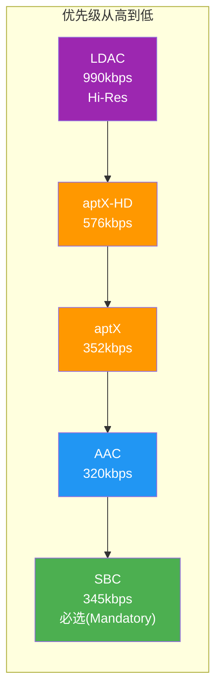
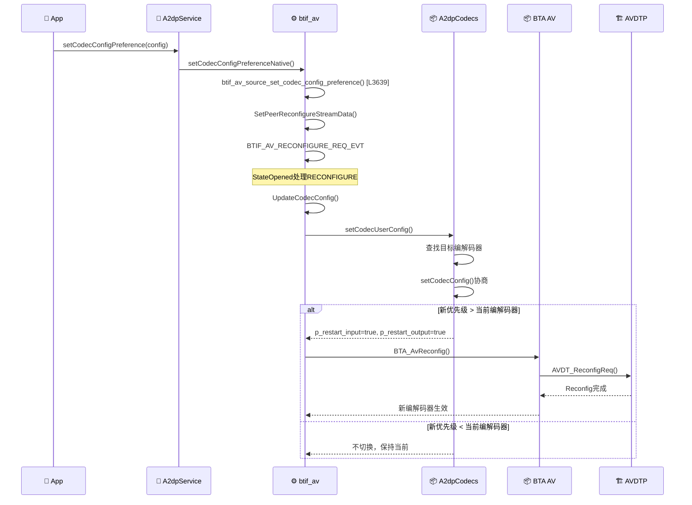

# T09_A2DP编解码器协商详解

> 学习日期：2026-05-16 | 优先级：P1 | 预计学习时间：3小时
> 前置知识：T08（A2DP连接流程）
> 涉及源码目录：system/stack/a2dp/, system/btif/src/, system/btif/co/

---

## 📋 本章导读

- **学什么**：A2DP编解码器优先级排序、能力协商算法、运行时切换机制、Offload模式差异
- **为什么学**：车载场景需要控制编解码器选择（如强制LDAC高音质或SBC兼容），理解协商流程是调试音质问题的前提
- **学完能做**：
  - 通过日志确认协商结果是否符合预期
  - 修改编解码器优先级实现强制选择
  - 区分Software和Offload协商路径的差异

---

## 🗺️ 架构全景图

### 编解码器协商流程

```mermaid
graph TD
    subgraph 初始化阶段
        INIT["A2dpCodecs::init()"]
        CREATE["createCodec()<br/>SBC/AAC/aptX/LDAC/OPUS"]
        SORT["按优先级排序<br/>ordered_source_codecs_"]
    end

    subgraph 连接阶段协商
        SDP["SDP发现对端能力"]
        PEER_CAP["setPeerSinkCodecCapabilities()"]
        SELECT["遍历ordered_source_codecs_<br/>找第一个双方都支持的"]
        SET_CFG["setCodecConfig()<br/>计算交集→选参数"]
    end

    subgraph 运行时切换
        USER_CFG["setCodecUserConfig()<br/>用户偏好设置"]
        RECONFIG["BTIF_AV_RECONFIGURE_REQ_EVT<br/>AVDT Reconfigure"]
        NEW_CFG["新编解码器生效"]
    end

    INIT --> CREATE --> SORT
    SDP --> PEER_CAP --> SELECT --> SET_CFG
    USER_CFG --> RECONFIG --> NEW_CFG

    style SET_CFG fill:#F44336,color:#fff
    style SELECT fill:#FF9800,color:#fff
```



### 编解码器优先级体系



---

## 🔍 代码导航

| 步骤 | 操作 | 文件 | 行号 | 看什么 |
|------|------|------|------|--------|
| 1 | 打开文件 | system/stack/a2dp/a2dp_codec_config.cc | L666-736 | A2dpCodecs::init()：编解码器初始化 |
| 2 | 打开文件 | system/stack/a2dp/a2dp_codec_config.cc | L184-237 | createCodec()：工厂方法 |
| 3 | 打开文件 | system/stack/a2dp/a2dp_codec_config.cc | L638-646 | compare_codec_priority()：优先级比较 |
| 4 | 打开文件 | system/stack/a2dp/a2dp_codec_config.cc | L173-182 | setDefaultCodecPriority()：默认优先级算法 |
| 5 | 打开文件 | system/stack/a2dp/a2dp_codec_config.cc | L805-911 | setCodecUserConfig()：用户配置与切换 |
| 6 | 打开文件 | system/stack/a2dp/a2dp_sbc.cc | L1020-1373 | SBC setCodecConfig()：SBC协商核心 |
| 7 | 打开文件 | system/stack/a2dp/a2dp_aac.cc | L941-1299 | AAC setCodecConfig()：AAC协商核心 |
| 8 | 打开文件 | system/stack/a2dp/a2dp_ext.cc | L42-110 | A2dpCodecConfigExt：Offload编解码器 |
| 9 | 打开文件 | system/btif/co/bta_av_co.cc | L765-856 | SetCodecUserConfig()：协调器入口 |
| 10 | 打开文件 | system/btif/src/btif_av.cc | L3639-3680 | btif_av_source_set_codec_config_preference() |

---

## 📖 核心流程详解

### 4.1 编解码器初始化与优先级排序

```cpp
// 📂 system/stack/a2dp/a2dp_codec_config.cc:666-736
bool A2dpCodecs::init() {
    // [1] 遍历所有编解码器索引，创建实例
    for (int i = BTAV_A2DP_CODEC_INDEX_MIN; i < BTAV_A2DP_CODEC_INDEX_MAX; i++) {
        btav_a2dp_codec_index_t codec_index =
                static_cast<btav_a2dp_codec_index_t>(i);

        // [2] 获取用户设置的优先级（从Java层传入）
        auto iter = codec_priorities_.find(codec_index);
        btav_a2dp_codec_priority_t codec_priority =
                (iter != codec_priorities_.end()) ? iter->second : 0;

        // [3] 🔑 工厂方法创建编解码器实例
        //     💡C++: createCodec是静态工厂方法
        //     类似Java的 Factory.create(type)
        A2dpCodecConfig* codec_config =
                A2dpCodecConfig::createCodec(codec_index, codec_priority);
        if (codec_config == nullptr) { continue; }

        // [4] 检查OPUS是否启用
        if (codec_index == BTAV_A2DP_CODEC_INDEX_SOURCE_OPUS) {
            if (!osi_property_get_bool("persist.bluetooth.opus.enabled", false)) {
                delete codec_config;
                continue;  // OPUS默认禁用
            }
        }

        // [5] 初始化编解码器（加载编码器库）
        if (!codec_config->init()) {
            delete codec_config;
            continue;
        }

        // [6] 🔑 按优先级排序插入
        //     ordered_source_codecs_是std::list<A2dpCodecConfig*>
        //     插入时按优先级降序排列
        if (codec_config->isSource()) {
            ordered_source_codecs_.push_back(codec_config);
            ordered_source_codecs_.sort(compare_codec_priority);
        }
    }
    return true;
}
```

```cpp
// 📂 system/stack/a2dp/a2dp_codec_config.cc:184-237
A2dpCodecConfig* A2dpCodecConfig::createCodec(btav_a2dp_codec_index_t codec_index,
                                                btav_a2dp_codec_priority_t codec_priority) {
    // [1] 🔍 检查是否为Offload编解码器
    //     💡C++: provider::supports_codec()检查Audio HAL是否支持该编解码器
    //     如果支持则创建A2dpCodecConfigExt（Offload版本）
    if (bluetooth::audio::a2dp::provider::supports_codec(codec_index)) {
        return new A2dpCodecConfigExt(codec_index, true /* is_source */);
    }

    // [2] Software编解码器——按类型创建
    switch (codec_index) {
        case BTAV_A2DP_CODEC_INDEX_SOURCE_SBC:
            return new A2dpCodecConfigSbcSource(codec_priority);
        case BTAV_A2DP_CODEC_INDEX_SOURCE_AAC:
            return new A2dpCodecConfigAacSource(codec_priority);
        case BTAV_A2DP_CODEC_INDEX_SOURCE_APTX:
            return new A2dpCodecConfigAptx(codec_priority);
        case BTAV_A2DP_CODEC_INDEX_SOURCE_APTX_HD:
            return new A2dpCodecConfigAptxHd(codec_priority);
        case BTAV_A2DP_CODEC_INDEX_SOURCE_LDAC:
            return new A2dpCodecConfigLdacSource(codec_priority);
        case BTAV_A2DP_CODEC_INDEX_SOURCE_OPUS:
            return new A2dpCodecConfigOpusSource(codec_priority);
        default:
            return nullptr;
    }
}
```

### 4.2 优先级计算与比较

```cpp
// 📂 system/stack/a2dp/a2dp_codec_config.cc:173-182
void A2dpCodecConfig::setDefaultCodecPriority() {
    // [1] 🔑 默认优先级算法
    //     priority = 1000 * (codec_index + 1) + 1
    //     SBC(Source) = 1000 * (1 + 1) + 1 = 2001
    //     AAC(Source) = 1000 * (3 + 1) + 1 = 4001
    //     aptX = 1000 * (5 + 1) + 1 = 6001
    //     aptX-HD = 1000 * (6 + 1) + 1 = 7001
    //     LDAC = 1000 * (7 + 1) + 1 = 8001
    //     💡C++: codec_index_是枚举值，越大优先级越高
    if (codec_priority_ == BTAV_A2DP_CODEC_PRIORITY_DEFAULT) {
        codec_priority_ =
                static_cast<btav_a2dp_codec_priority_t>(1000 * (codec_index_ + 1) + 1);
    }
}
```

```cpp
// 📂 system/stack/a2dp/a2dp_codec_config.cc:638-646
static bool compare_codec_priority(const A2dpCodecConfig* lhs, const A2dpCodecConfig* rhs) {
    // [1] 优先级高的排前面
    if (lhs->codecPriority() > rhs->codecPriority()) { return true; }
    if (lhs->codecPriority() < rhs->codecPriority()) { return false; }
    // [2] 优先级相同时，codec_index大的排前面
    return lhs->codecIndex() > rhs->codecIndex();
}
```

### 4.3 编解码器协商核心：setCodecConfig()

所有编解码器遵循统一的协商模式，以SBC为例：

```cpp
// 📂 system/stack/a2dp/a2dp_sbc.cc:1020-1373 (简化)
tA2DP_STATUS A2dpCodecConfigSbcBase::setCodecConfig(
        const uint8_t* p_peer_codec_info, bool is_capability,
        uint8_t* p_result_codec_config) {
    // [1] 解析对端OTA编解码器能力
    tA2DP_SBC_CIE peer_cie;
    A2DP_ParseInfoSbc(&peer_cie, p_peer_codec_info, is_capability);

    // [2] 计算本地能力与对端能力的交集
    //     💡C++: 位与操作计算交集
    //     类似Java的 EnumSet.intersection()
    uint8_t samp_freq = codec_local_capability_.samp_freq & peer_cie.samp_freq;
    uint8_t ch_mode = codec_local_capability_.ch_mode & peer_cie.ch_mode;

    // [3] 🔑 按优先级选择参数：用户偏好 > Audio配置 > 默认配置 > 最佳匹配
    //     采样率选择
    if (!select_audio_sample_rate(codec_audio_config_, samp_freq, &codec_config_, ...)) {
        if (!select_best_sample_rate(samp_freq, &codec_config_, ...)) {
            goto fail;  // 无交集则协商失败
        }
    }

    //     声道模式选择
    if (!select_audio_channel_mode(codec_audio_config_, ch_mode, &codec_config_, ...)) {
        if (!select_best_channel_mode(ch_mode, &codec_config_, ...)) {
            goto fail;
        }
    }

    //     位深选择（SBC固定16bit）
    select_best_bits_per_sample(&codec_config_);

    // [4] Bitpool协商——SBC特有
    A2DP_AdjustBitpool(&codec_config_);

    // [5] 构建OTA结果
    A2DP_BuildInfoSbc(AVDT_MEDIA_AUDIO, &codec_config_, p_result_codec_config);

    return A2DP_SUCCESS;

fail:
    // [6] 恢复保存的状态
    codec_config_ = saved_codec_config;
    return A2DP_FAIL;
}
```

### 4.4 各编解码器参数选择偏好

| 编解码器 | 采样率偏好 | 位深偏好 | 声道模式偏好 | 特殊参数 |
|----------|-----------|---------|-------------|---------|
| **SBC** | 48k > 44.1k | 16bit(固定) | JointStereo > Stereo > Dual > Mono | Bitpool: min~max |
| **AAC** | 96k > 88.2k > 48k > 44.1k | 32 > 24 > 16 | Stereo > Mono | VBR(双方支持才启用) |
| **aptX** | 48k > 44.1k | 16bit(固定) | Stereo > Mono | 固定352kbps |
| **aptX-HD** | 48k > 44.1k | 24bit | Stereo > Mono | 固定576kbps |
| **LDAC** | 192k > 176.4k > 96k > 88.2k > 48k > 44.1k | 32 > 24 > 16 | Dual > Stereo > Mono | 330/660/990kbps |

### 4.5 运行时编解码器切换



```cpp
// 📂 system/stack/a2dp/a2dp_codec_config.cc:805-911
bool A2dpCodecs::setCodecUserConfig(
        const btav_a2dp_codec_user_config_t& codec_user_config,
        const tA2DP_ENCODER_INIT_PEER_PARAMS* p_peer_params,
        const uint8_t* p_peer_sink_capabilities,
        uint8_t* p_result_codec_config, bool* p_restart_input,
        bool* p_restart_output, bool* p_config_updated) {

    // [1] 查找目标编解码器
    auto iter = ordered_source_codecs_.begin();
    for (; iter != ordered_source_codecs_.end(); ++iter) {
        if ((*iter)->codecIndex() == codec_user_config.codec_type) { break; }
    }
    if (iter == ordered_source_codecs_.end()) { return false; }

    A2dpCodecConfig* codec_config = *iter;

    // [2] 🔑 调用编解码器的setCodecUserConfig
    tA2DP_STATUS status = codec_config->setCodecUserConfig(
            codec_user_config, codec_audio_config_, p_peer_params,
            p_peer_sink_capabilities, true /* is_capability */,
            p_result_codec_config, p_restart_input, p_restart_output,
            p_config_updated);

    if (status != A2DP_SUCCESS) { return false; }

    // [3] 🔑 判断是否需要重连切换
    //     如果新编解码器优先级高于当前编解码器→需要重连
    //     💡C++: current_codec_config_是当前正在使用的编解码器
    if (codec_config->codecPriority() > current_codec_config_->codecPriority()) {
        *p_restart_input = true;
        *p_restart_output = true;
    }

    // [4] 更新排序——新优先级可能改变顺序
    ordered_source_codecs_.sort(compare_codec_priority);
    return true;
}
```

### 4.6 Offload模式编解码器协商

```cpp
// 📂 system/stack/a2dp/a2dp_ext.cc:42-110 (简化)
A2dpCodecConfigExt::A2dpCodecConfigExt(btav_a2dp_codec_index_t codec_index,
                                         bool is_source)
    : A2dpCodecConfig(codec_index, 0, "", BTAV_A2DP_CODEC_PRIORITY_DEFAULT) {
    // [1] 🔑 从Audio HAL Provider加载本地能力
    //     💡C++: provider::get_codec_capabilities()是AIDL HAL调用
    //     类似Java的 IBinder.transact()
    bluetooth::audio::a2dp::provider::get_codec_capabilities(
            codec_index, &codec_local_capability_);
}

tA2DP_STATUS A2dpCodecConfigExt::setCodecConfig(
        const uint8_t* p_peer_codec_info, bool is_capability,
        uint8_t* p_result_codec_config) {
    // [2] 🔑 Offload模式——由Audio HAL完成协商
    //     💡C++: provider::get_a2dp_configuration()把对端能力传给HAL
    //     HAL返回协商结果，而非本地计算
    auto configuration = bluetooth::audio::a2dp::provider::get_a2dp_configuration(
            codec_index_, p_peer_codec_info);

    if (configuration) {
        // [3] 使用HAL返回的配置
        memcpy(p_result_codec_config, configuration->data(),
               std::min(configuration->size(), AVDT_CODEC_SIZE));
        return A2DP_SUCCESS;
    }
    return A2DP_FAIL;
}

bool A2dpCodecConfigExt::setPeerCodecCapabilities(
        const uint8_t* p_peer_codec_capabilities) {
    // [4] 🔑 Offload模式——直接使用local_capability作为selectable
    //     因为HAL不提供对端能力解析接口
    codec_selectable_capability_ = codec_local_capability_;
    return true;
}
```

### 4.7 Software vs Offload 协商对比


| 对比项 | Software | Offload |
|--------|----------|---------|
| 能力来源 | A2DP Codec库(a2dp_sbc/aac/ldac.cc) | Audio HAL Provider |
| 对端能力解析 | 本地A2DP_ParseInfoXxx() | 不解析，透传给HAL |
| 协商算法 | 本地计算交集+优先级选择 | HAL内部实现 |
| 编码执行 | Host CPU编码 | DSP硬件编码 |
| 编解码器验证 | A2DP_IsPeerSinkCodecValid() | 跳过验证(isHardwareProviderCodec) |
| 可选能力 | 本地∩对端 | 直接用local_capability |

---

## 💡 C++知识卡片

### 💡 C++知识卡片：纯虚函数与抽象类 (Abstract Class)

> 🔄 Java类比：Java的abstract类和interface
> C++用纯虚函数(=0)定义接口，子类必须实现

```cpp
// Java:
// abstract class A2dpCodecConfig {
//     abstract tA2DP_STATUS setCodecConfig(...);  // 子类必须实现
//     boolean isHardwareProviderCodec() { return false; }  // 有默认实现
// }

// C++:
class A2dpCodecConfig {
public:
    // [1] =0 纯虚函数——类似Java的abstract方法
    //     含纯虚函数的类是抽象类，不能直接实例化
    virtual tA2DP_STATUS setCodecConfig(
        const uint8_t* p_peer_codec_info, bool is_capability,
        uint8_t* p_result_codec_config) = 0;

    // [2] 非纯虚函数——有默认实现，子类可选择重写
    virtual bool isHardwareProviderCodec() { return false; }

    // [3] 非虚函数——子类不能重写（类似Java的final方法）
    tA2DP_STATUS setCodecUserConfig(...);
};

// 💡 如果一个类只有纯虚函数，就等价于Java的interface
// 蓝牙栈中btav_source_callbacks_t结构体就类似一个interface
```

### 💡 C++知识卡片：位运算计算交集 (Bitwise AND)

> 🔄 Java类比：Java的EnumSet或位标志操作
> A2DP编解码器能力用位域表示，交集用位与(&)计算

```cpp
// Java:
// int localCapabilities = SAMPLING_RATE_44100 | SAMPLING_RATE_48000;  // 0x03
// int peerCapabilities = SAMPLING_RATE_48000 | SAMPLING_RATE_96000;   // 0x06
// int intersection = localCapabilities & peerCapabilities;             // 0x02 = 48kHz only

// C++: 完全相同的位运算
// SBC采样率位定义:
// A2DP_SBC_IE_SAMP_FREQ_44   = 0x01  (bit 0)
// A2DP_SBC_IE_SAMP_FREQ_48   = 0x02  (bit 1)
// 本地支持: 44.1k + 48k = 0x03
// 对端支持: 48k + 96k(无效) = 0x02
uint8_t samp_freq = codec_local_capability_.samp_freq & peer_cie.samp_freq;
// 0x03 & 0x02 = 0x02 → 只支持48kHz

// 💡 检查某一位是否设置:
if (samp_freq & A2DP_SBC_IE_SAMP_FREQ_48) {
    // 48kHz在交集中
}

// 💡 选择最佳: 从高位到低位检查
// select_best_sample_rate: 优先48k，其次44.1k
if (samp_freq & A2DP_SBC_IE_SAMP_FREQ_48) {
    codec_config_.samp_freq = A2DP_SBC_IE_SAMP_FREQ_48;
} else if (samp_freq & A2DP_SBC_IE_SAMP_FREQ_44) {
    codec_config_.samp_freq = A2DP_SBC_IE_SAMP_FREQ_44;
}
```

### 💡 C++知识卡片：工厂方法模式 (Factory Method)

> 🔄 Java类比：Java的Factory模式完全相同
> A2DP使用工厂方法根据codec_index创建不同编解码器实例

```cpp
// Java:
// static A2dpCodecConfig createCodec(CodecIndex index) {
//     switch (index) {
//         case SBC: return new A2dpCodecConfigSbc();
//         case AAC: return new A2dpCodecConfigAac();
//         ...
//     }
// }

// C++: 完全相同的模式
A2dpCodecConfig* A2dpCodecConfig::createCodec(
        btav_a2dp_codec_index_t codec_index,
        btav_a2dp_codec_priority_t codec_priority) {
    // 返回基类指针，实际对象是子类
    // 💡C++: 多态——通过基类指针调用子类方法
    switch (codec_index) {
        case BTAV_A2DP_CODEC_INDEX_SOURCE_SBC:
            return new A2dpCodecConfigSbcSource(codec_priority);
        case BTAV_A2DP_CODEC_INDEX_SOURCE_AAC:
            return new A2dpCodecConfigAacSource(codec_priority);
        // ...
    }
}

// 使用：
A2dpCodecConfig* codec = A2dpCodecConfig::createCodec(index, priority);
codec->setCodecConfig(...);  // 调用子类的实现
// 💡 new出来的对象必须手动delete，否则内存泄漏
// 蓝牙栈用std::unique_ptr管理生命周期
```

---

## 🗂️ Java ↔ C++ 对照表

| Java层 | JNI桥接 | C++层 | 数据流方向 |
|--------|---------|-------|-----------|
| BluetoothA2dp.setCodecConfigPreference() | setCodecConfigPreferenceNative() | btif_av_source_set_codec_config_preference() [L3639] | ↓ Java→C++ |
| BluetoothA2dp.getCodecStatus() | getCodecStatusNative() | A2dpCodecs::getCodecConfigAndCapabilities() | ↓ Java→C++ |
| onCodecConfigChanged() | bta2dp_codec_config_callback() | btif_av_report_source_codec_state() [L2965] | ↑ C++→Java |
| MandatoryCodecPreferred回调 | mandatoryCodecPreferredCallback() | btif_av_query_mandatory_codec_priority() [L2999] | ↑ C++→Java |

---

## 🐛 问题排查SOP

### 问题：协商结果不符合预期（如期望LDAC但实际SBC）

```
步骤1: 查日志
  adb logcat -s bt_a2dp bt_btif | grep -E "codec|setCodec|capability"

步骤2: 检查协商链路
  ① "setPeerSinkCodecCapabilities" → 对端能力是否包含LDAC
  ② "setCodecConfig" → 协商结果是否为LDAC
  ③ "current_codec_config" → 当前使用的编解码器

步骤3: 常见根因
  ① 对端不支持LDAC → 检查peer_sink_capabilities
  ② LDAC优先级被降低 → 检查codec_priorities设置
  ③ LDAC编码器库加载失败 → a2dp_codec_config.cc:L571 init()返回false
  ④ Offload模式不支持LDAC → provider::supports_codec()返回false
  ⑤ MandatoryCodecPreferred=true → 强制使用SBC

步骤4: 强制设置
  adb shell settings put global bluetooth_a2dp_codec_priority_ldac 10001
  重新连接A2DP
```

### 问题：编解码器切换失败

```
步骤1: 查日志
  adb logcat -s bt_btif bt_bta_av | grep -E "reconfig|RECONFIGURE"

步骤2: 常见根因
  ① 对端不支持Reconfigure → AVDT_ReconfigReq被拒
  ② 新编解码器优先级低于当前 → setCodecUserConfig不触发切换
  ③ 协商参数无交集 → setCodecConfig返回A2DP_FAIL
  ④ 流正在Start状态 → 必须先Suspend再Reconfigure

步骤3: 验证方法
  adb shell dumpsys bluetooth_manager | grep -A5 "Codec"
```

---

## 🛠️ 动手练习

### 🟢 入门：阅读代码

1. 打开 `system/stack/a2dp/a2dp_codec_config.cc`，找到 `A2dpCodecs::init()`（L666），列出所有创建的编解码器类型和默认优先级。

2. 打开 `system/stack/a2dp/a2dp_sbc.cc`，找到 `select_best_sample_rate`（L868），确认SBC采样率的选择优先级。

3. 打开 `system/stack/a2dp/a2dp_ext.cc`，对比 `setCodecConfig` 和Software版本的差异。

### 🟡 进阶：修改代码

1. 修改 `setDefaultCodecPriority` 的算法，使AAC优先级高于LDAC，观察协商结果的变化。

2. 在 `setCodecUserConfig` 中添加日志，打印每次编解码器切换的原因（优先级变化/用户设置/协商失败）。

3. 修改SBC的 `select_best_channel_mode`，使Dual Channel优先于Joint Stereo，观察音质变化。

### 🔴 实战：定位问题

1. 模拟场景：用户设置LDAC为首选编解码器，但连接后仍使用SBC。日志显示 "LDAC init failed"。请分析LDAC编码器库加载失败的排查路径。

2. 模拟场景：Offload模式下编解码器协商成功但音频无声。日志显示 "provider::get_a2dp_configuration returned"。请分析Offload协商结果与实际编码参数不匹配的可能性。

---

## 📚 关键源码索引

| 序号 | 文件 | 行号 | 函数/类 | 作用 |
|------|------|------|---------|------|
| 1 | system/stack/a2dp/a2dp_codec_config.cc | L666-736 | A2dpCodecs::init() | 编解码器初始化与排序 |
| 2 | system/stack/a2dp/a2dp_codec_config.cc | L184-237 | createCodec() | 工厂方法 |
| 3 | system/stack/a2dp/a2dp_codec_config.cc | L173-182 | setDefaultCodecPriority() | 默认优先级算法 |
| 4 | system/stack/a2dp/a2dp_codec_config.cc | L638-646 | compare_codec_priority() | 优先级比较器 |
| 5 | system/stack/a2dp/a2dp_codec_config.cc | L805-911 | setCodecUserConfig() | 用户配置与切换 |
| 6 | system/stack/a2dp/a2dp_codec_config.cc | L1015-1033 | setPeerSinkCodecCapabilities() | 设置对端能力 |
| 7 | system/stack/a2dp/a2dp_sbc.cc | L1020-1373 | SBC setCodecConfig() | SBC协商核心 |
| 8 | system/stack/a2dp/a2dp_sbc.cc | L868-881 | select_best_sample_rate() | SBC采样率选择 |
| 9 | system/stack/a2dp/a2dp_aac.cc | L941-1299 | AAC setCodecConfig() | AAC协商核心 |
| 10 | system/stack/a2dp/a2dp_vendor_ldac.cc | L809-1132 | LDAC setCodecConfig() | LDAC协商核心 |
| 11 | system/stack/a2dp/a2dp_ext.cc | L42-110 | A2dpCodecConfigExt | Offload编解码器 |
| 12 | system/btif/co/bta_av_co.cc | L765-856 | SetCodecUserConfig() | 协调器入口 |
| 13 | system/btif/src/btif_av.cc | L3639-3680 | btif_av_source_set_codec_config_preference() | 外部设置入口 |
| 14 | system/btif/src/btif_av.cc | L2999-3022 | btif_av_query_mandatory_codec_priority() | SBC偏好查询 |
