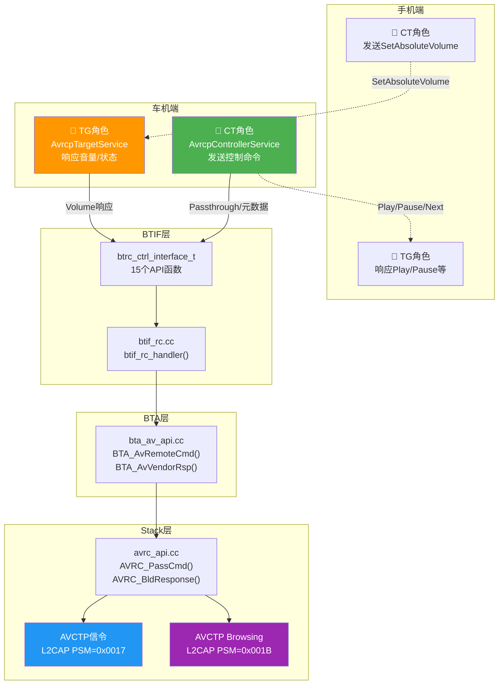
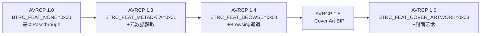
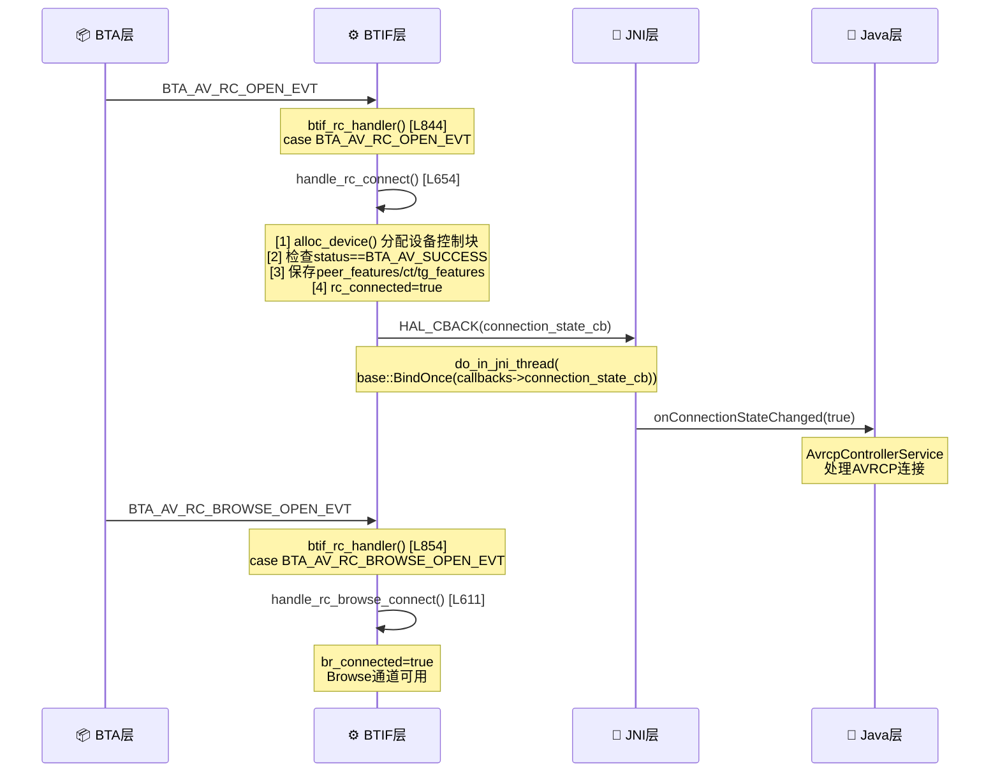
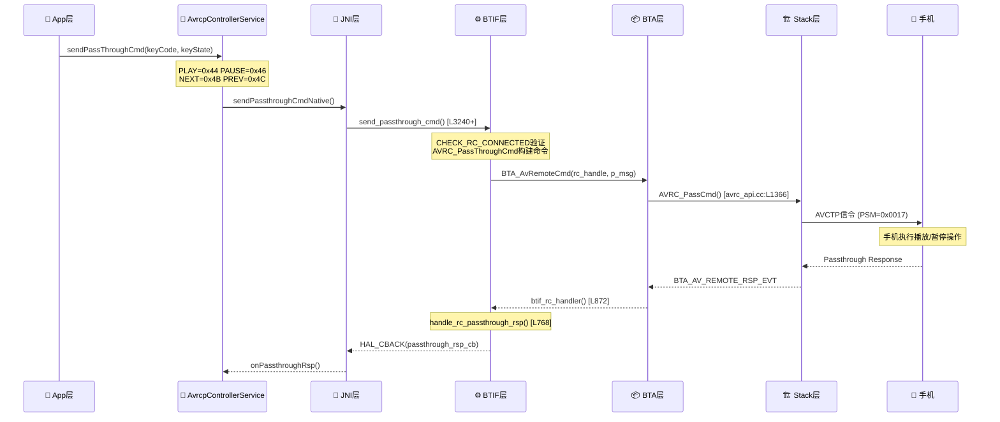
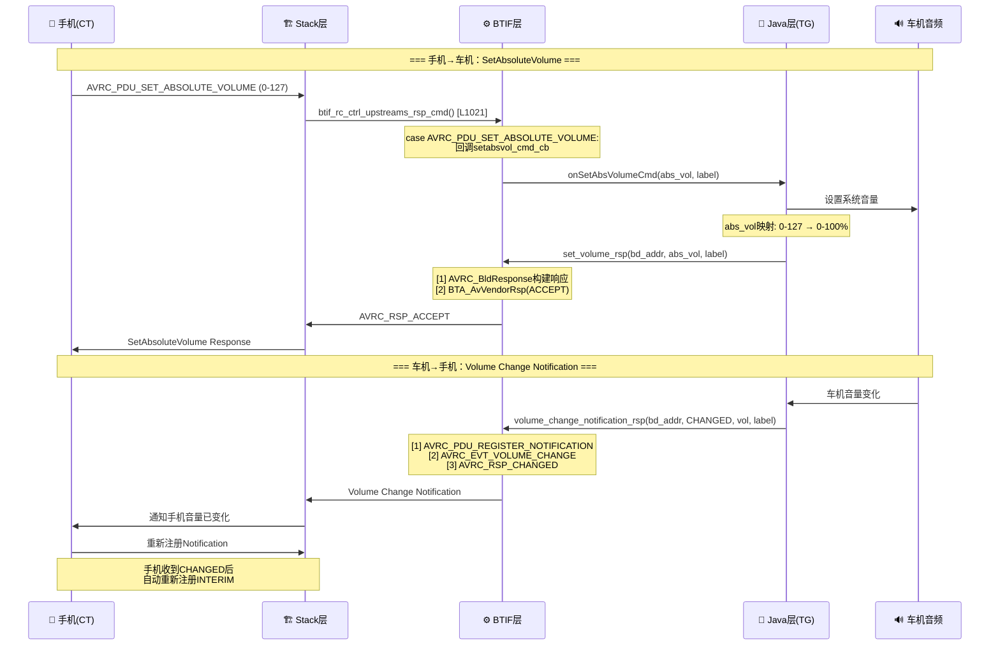
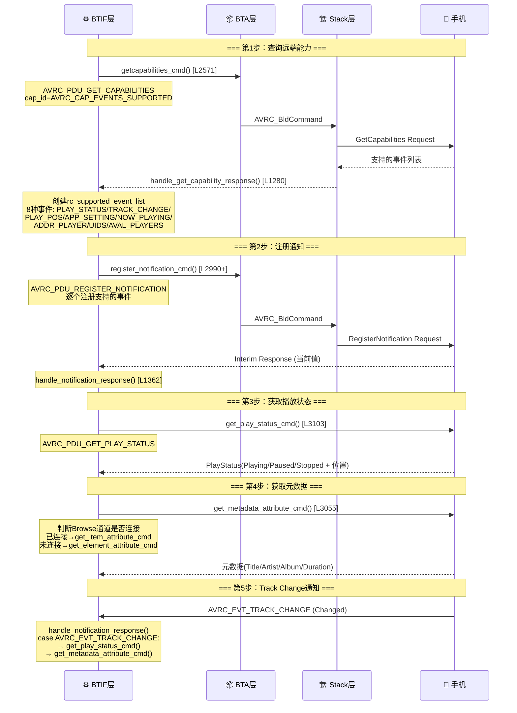
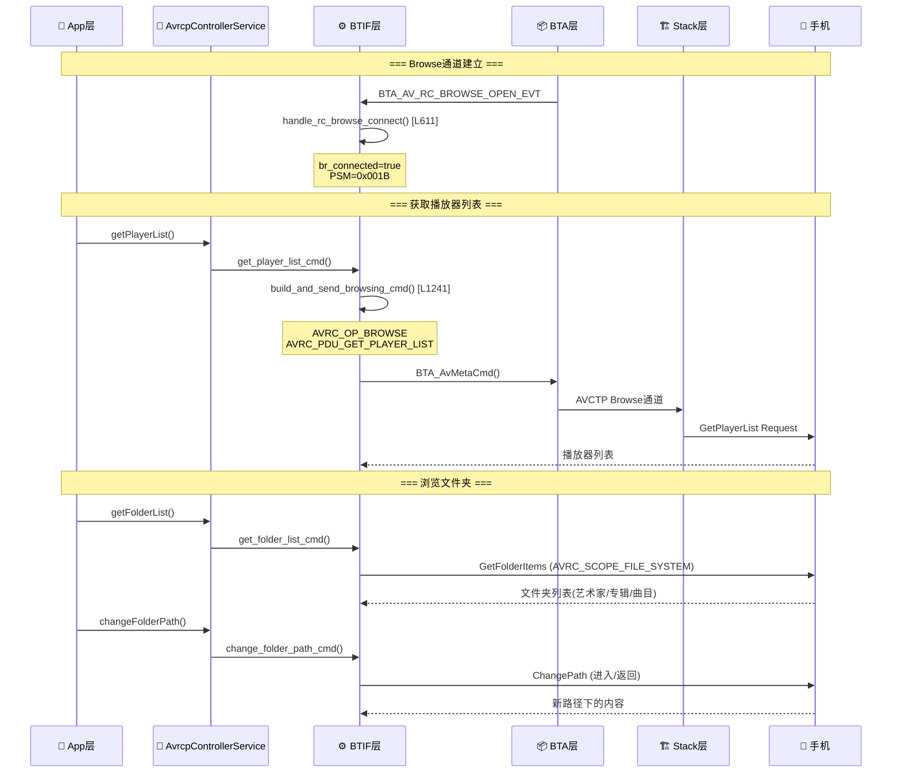
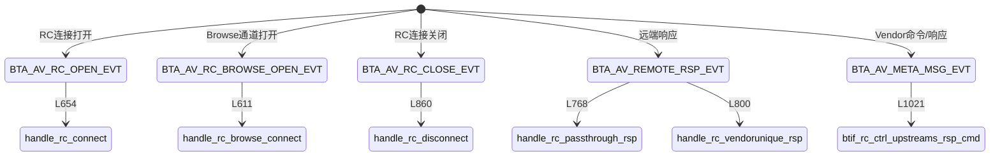

# T11_AVRCP控制与元数据详解

> 学习日期：2026-05-16 | 优先级：P1 | 预计学习时间：4小时
> 前置知识：T01（蓝牙整体架构）、T08（A2DP连接流程）
> 涉及源码目录：system/btif/src/, system/bta/av/, system/stack/avrc/, android/app/src/com/android/bluetooth/

---

## 📋 本章导读

- **学什么**：AVRCP协议的CT/TG双角色架构、Passthrough控制命令、Absolute Volume音量同步、元数据获取、Browsing浏览通道的完整源码级流程
- **为什么学**：车载蓝牙音乐场景中，播放控制、歌曲信息显示、音量同步是三大核心功能，全部由AVRCP实现，占车载蓝牙工单的20%以上
- **学完能做**：
  - 追踪AVRCP控制命令从Java到AVCTP的完整链路
  - 定位音量不同步、歌曲信息不更新等AVRCP问题
  - 理解CT/TG双角色在车载场景中的分工

---

## 🗺️ 架构全景图

### AVRCP CT/TG双角色架构



### AVRCP版本与Feature映射



---

## 🔍 代码导航

| 步骤 | 操作 | 文件 | 行号 | 看什么 |
|------|------|------|------|--------|
| 1 | 打开文件 | system/btif/src/btif_rc.cc | L3292-3310 | btrc_ctrl_interface_t接口表，15个API函数 |
| 2 | 打开文件 | system/btif/src/btif_rc.cc | L844-879 | btif_rc_handler事件分发 |
| 3 | 打开文件 | system/btif/src/btif_rc.cc | L654-718 | handle_rc_connect连接处理 |
| 4 | 打开文件 | system/btif/src/btif_rc.cc | L768-790 | handle_rc_passthrough_rsp响应处理 |
| 5 | 打开文件 | system/btif/src/btif_rc.cc | L3124-3151 | set_volume_rsp音量响应 |
| 6 | 打开文件 | system/btif/src/btif_rc.cc | L3162-3189 | volume_change_notification_rsp音量通知 |
| 7 | 打开文件 | system/btif/src/btif_rc.cc | L2571-2582 | getcapabilities_cmd能力查询 |
| 8 | 打开文件 | system/btif/src/btif_rc.cc | L3078-3092 | get_element_attribute_cmd元数据获取 |
| 9 | 打开文件 | system/btif/src/btif_rc.cc | L1241-1268 | build_and_send_browsing_cmd浏览命令 |
| 10 | 打开文件 | system/btif/src/btif_rc.cc | L1362-1419 | handle_notification_response通知响应 |

---

## 📖 核心流程详解

### 5.1 AVRCP连接建立



**源码追踪 — handle_rc_connect**：

```cpp
// 📂 system/btif/src/btif_rc.cc:654-718
static void handle_rc_connect(tBTA_AV_RC_OPEN* p_rc_open) {
  log::verbose("rc_handle: {}", p_rc_open->rc_handle);
  // [1] 🏭 分配设备控制块
  //     💡C++: alloc_device()从预分配数组中查找空闲slot
  btif_rc_device_cb_t* p_dev = alloc_device();
  if (p_dev == NULL) {
    log::error("p_dev is NULL");
    return;
  }

  // [2] 🔍 检查连接状态
  if (!(p_rc_open->status == BTA_AV_SUCCESS)) {
    //     ⚠️ 连接失败：清理所有状态并返回
    p_dev->rc_connected = false;
    BTA_AvCloseRc(p_rc_open->rc_handle);  // 关闭RC连接
    p_dev->rc_handle = 0;
    p_dev->rc_state = BTRC_CONNECTION_STATE_DISCONNECTED;
    p_dev->rc_features = 0;
    p_dev->peer_ct_features = 0;
    p_dev->peer_tg_features = 0;
    return;
  }

  // [3] 📋 保存远端特性信息
  //     peer_features: AVCTP层协商的特性
  //     peer_ct_features: 对端CT能力（车机关心对端TG能力）
  //     peer_tg_features: 对端TG能力
  p_dev->rc_addr = p_rc_open->peer_addr;
  p_dev->rc_features = p_rc_open->peer_features;
  p_dev->peer_ct_features = p_rc_open->peer_ct_features;
  p_dev->peer_tg_features = p_rc_open->peer_tg_features;
  p_dev->rc_cover_art_psm = p_rc_open->cover_art_psm;
  p_dev->rc_vol_label = MAX_LABEL;
  p_dev->rc_volume = MAX_VOLUME;

  // [4] ✅ 标记连接成功
  p_dev->rc_connected = true;
  p_dev->rc_handle = p_rc_open->rc_handle;
  p_dev->rc_state = BTRC_CONNECTION_STATE_CONNECTED;

  // [5] 📨 通知Java层
  //     💡C++: do_in_jni_thread将任务post到JNI线程执行
  //     base::BindOnce将函数+参数打包为可调用对象
  if (bt_rc_ctrl_callbacks != NULL) {
    do_in_jni_thread(
        base::BindOnce(bt_rc_ctrl_callbacks->connection_state_cb,
                       true, false, p_dev->rc_addr));
    handle_rc_ctrl_features(p_dev);  // 触发能力查询流程
  }
}
```

### 5.2 Passthrough控制命令



**源码追踪 — handle_rc_passthrough_rsp**：

```cpp
// 📂 system/btif/src/btif_rc.cc:768-790
static void handle_rc_passthrough_rsp(tBTA_AV_REMOTE_RSP* p_remote_rsp) {
  btif_rc_device_cb_t* p_dev = NULL;

  // [1] 🔍 通过rc_handle查找设备控制块
  p_dev = btif_rc_get_device_by_handle(p_remote_rsp->rc_handle);
  if (p_dev == NULL) {
    log::error("passthrough response for Invalid rc handle");
    return;
  }

  // [2] 🔍 检查本端是否支持RCTG特性
  //     💡C++: 位与运算&检查特性标志位
  //     类似Java的 (features & FLAG_RCTG) != 0
  if (!(p_dev->rc_features & BTA_AV_FEAT_RCTG)) {
    log::error("DUT does not support AVRCP controller role");
    return;
  }

  // [3] 📋 解析按键状态
  //     key_state==1: released(释放), key_state==0: pressed(按下)
  const char* status = (p_remote_rsp->key_state == 1) ? "released" : "pressed";
  log::verbose("rc_id: {} state: {}", p_remote_rsp->rc_id, status);

  // [4] 🧹 释放事务（label回收）
  //     💡C++: release_transaction将label归还到可用池
  //     类似Java的消息队列ack机制
  release_transaction(p_dev, p_remote_rsp->label);

  // [5] 📨 回调Java层
  if (bt_rc_ctrl_callbacks != NULL) {
    do_in_jni_thread(base::BindOnce(
        bt_rc_ctrl_callbacks->passthrough_rsp_cb,
        p_dev->rc_addr,
        p_remote_rsp->rc_id,
        p_remote_rsp->key_state));
  }
}
```

### 5.3 Absolute Volume音量同步（车载关键）



**源码追踪 — set_volume_rsp**：

```cpp
// 📂 system/btif/src/btif_rc.cc:3124-3151
static bt_status_t set_volume_rsp(const RawAddress& bd_addr,
                                   uint8_t abs_vol, uint8_t label) {
  tAVRC_STS status = BT_STATUS_UNSUPPORTED;
  tAVRC_RESPONSE avrc_rsp;
  BT_HDR* p_msg = NULL;
  // [1] 🔍 查找设备控制块
  btif_rc_device_cb_t* p_dev = btif_rc_get_device_by_bda(bd_addr);
  CHECK_RC_CONNECTED(p_dev);  // 宏：检查rc_connected==true

  log::verbose("abs_vol: {}", abs_vol);

  // [2] 📦 构建AVRCP响应
  //     opcode=AVRC_OP_VENDOR: Vendor Dependent命令
  //     pdu=AVRC_PDU_SET_ABSOLUTE_VOLUME: PDU类型
  //     volume=abs_vol: 0-127的绝对音量值
  avrc_rsp.volume.opcode = AVRC_OP_VENDOR;
  avrc_rsp.volume.pdu = AVRC_PDU_SET_ABSOLUTE_VOLUME;
  avrc_rsp.volume.status = AVRC_STS_NO_ERROR;
  avrc_rsp.volume.volume = abs_vol;

  // [3] 🔨 序列化响应为字节流
  //     💡C++: AVRC_BldResponse将结构体序列化为BT_HDR
  //     BT_HDR是蓝牙协议栈通用的消息缓冲区头
  status = AVRC_BldResponse(p_dev->rc_handle, &avrc_rsp, &p_msg);
  if (status == AVRC_STS_NO_ERROR) {
    // [4] 📨 发送ACCEPT响应
    //     data_start: 消息体起始地址
    //     💡C++: (p_msg + 1)跳过BT_HDR头，+offset到数据区
    uint8_t* data_start = (uint8_t*)(p_msg + 1) + p_msg->offset;
    BTA_AvVendorRsp(p_dev->rc_handle, label,
                    AVRC_RSP_ACCEPT, data_start, p_msg->len, 0);
    status = BT_STATUS_SUCCESS;
  }
  // [5] 🧹 释放消息缓冲区
  //     ⚠️ osi_free必须调用，否则内存泄漏
  osi_free(p_msg);
  return (bt_status_t)status;
}
```

**源码追踪 — volume_change_notification_rsp**：

```cpp
// 📂 system/btif/src/btif_rc.cc:3162-3189
static bt_status_t volume_change_notification_rsp(
    const RawAddress& bd_addr,
    btrc_notification_type_t rsp_type,
    uint8_t abs_vol, uint8_t label) {
  tAVRC_STS status = BT_STATUS_UNSUPPORTED;
  tAVRC_RESPONSE avrc_rsp;
  BT_HDR* p_msg = NULL;

  btif_rc_device_cb_t* p_dev = btif_rc_get_device_by_bda(bd_addr);
  CHECK_RC_CONNECTED(p_dev);

  // [1] 📦 构建Register Notification响应
  //     pdu=AVRC_PDU_REGISTER_NOTIFICATION
  //     event_id=AVRC_EVT_VOLUME_CHANGE: 音量变化事件
  //     param.volume=abs_vol: 当前绝对音量
  avrc_rsp.reg_notif.opcode = AVRC_OP_VENDOR;
  avrc_rsp.reg_notif.pdu = AVRC_PDU_REGISTER_NOTIFICATION;
  avrc_rsp.reg_notif.status = AVRC_STS_NO_ERROR;
  avrc_rsp.reg_notif.param.volume = abs_vol;
  avrc_rsp.reg_notif.event_id = AVRC_EVT_VOLUME_CHANGE;

  // [2] 🔨 序列化并发送
  status = AVRC_BldResponse(p_dev->rc_handle, &avrc_rsp, &p_msg);
  if (status == AVRC_STS_NO_ERROR) {
    uint8_t* data_start = (uint8_t*)(p_msg + 1) + p_msg->offset;
    // [3] 🔍 区分INTERIM/CHANGED响应类型
    //     INTERIM: 首次注册的即时响应（当前值）
    //     CHANGED: 值变化后的通知响应
    //     💡C++: 三元运算符，类似Java的 ? :
    BTA_AvVendorRsp(
        p_dev->rc_handle, label,
        (rsp_type == BTRC_NOTIFICATION_TYPE_INTERIM)
            ? AVRC_RSP_INTERIM : AVRC_RSP_CHANGED,
        data_start, p_msg->len, 0);
    status = BT_STATUS_SUCCESS;
  }
  osi_free(p_msg);
  return (bt_status_t)status;
}
```

### 5.4 元数据获取流程



**源码追踪 — getcapabilities_cmd**：

```cpp
// 📂 system/btif/src/btif_rc.cc:2571-2582
static bt_status_t getcapabilities_cmd(uint8_t cap_id,
                                        btif_rc_device_cb_t* p_dev) {
  log::verbose("cap_id: {}", cap_id);
  CHECK_RC_CONNECTED(p_dev);  // 宏：验证rc_connected

  // [1] 📦 构建GetCapabilities命令
  //     💡C++: tAVRC_COMMAND是union类型，所有AVRCP命令共用
  //     类似Java的sealed class，但C++用union实现
  tAVRC_COMMAND avrc_cmd = {0};  // 零初始化
  avrc_cmd.get_caps.opcode = AVRC_OP_VENDOR;
  avrc_cmd.get_caps.capability_id = cap_id;
  avrc_cmd.get_caps.pdu = AVRC_PDU_GET_CAPABILITIES;
  avrc_cmd.get_caps.status = AVRC_STS_NO_ERROR;

  // [2] 📨 构建并发送Vendor命令
  return build_and_send_vendor_cmd(&avrc_cmd, AVRC_CMD_STATUS, p_dev);
}
```

**源码追踪 — get_metadata_attribute_cmd**：

```cpp
// 📂 system/btif/src/btif_rc.cc:3055-3067
static bt_status_t get_metadata_attribute_cmd(
    uint8_t num_attribute, const uint32_t* p_attr_ids,
    btif_rc_device_cb_t* p_dev) {
  log::verbose("num_attribute: {} attribute_id: {}", num_attribute, p_attr_ids[0]);

  // [1] 🔍 判断Browse通道是否已连接
  //     如果已连接，使用Browse通道获取元数据（更高效）
  //     如果未连接，使用Control通道的GetElementAttributes
  if (p_dev->br_connected) {
    return get_item_attribute_cmd(p_dev->rc_playing_uid,
                                  AVRC_SCOPE_NOW_PLAYING,
                                  num_attribute, p_attr_ids, p_dev);
  }
  // [2] 默认使用Control通道
  return get_element_attribute_cmd(num_attribute, p_attr_ids, p_dev);
}

// 📂 system/btif/src/btif_rc.cc:3078-3092
static bt_status_t get_element_attribute_cmd(
    uint8_t num_attribute, const uint32_t* p_attr_ids,
    btif_rc_device_cb_t* p_dev) {
  CHECK_RC_CONNECTED(p_dev);
  tAVRC_COMMAND avrc_cmd = {0};
  avrc_cmd.get_elem_attrs.opcode = AVRC_OP_VENDOR;
  avrc_cmd.get_elem_attrs.status = AVRC_STS_NO_ERROR;
  avrc_cmd.get_elem_attrs.num_attr = num_attribute;
  avrc_cmd.get_elem_attrs.pdu = AVRC_PDU_GET_ELEMENT_ATTR;
  // [3] 📋 填充请求的属性ID列表
  //     0x01=TITLE 0x02=ARTIST 0x03=ALBUM
  //     0x04=TRACK_NUM 0x05=NUM_TRACKS 0x06=GENRE
  //     0x07=PLAYING_TIME 0x08=COVER_ARTWORK_HANDLE
  for (int count = 0; count < num_attribute; count++) {
    avrc_cmd.get_elem_attrs.attrs[count] = p_attr_ids[count];
  }
  return build_and_send_vendor_cmd(&avrc_cmd, AVRC_CMD_STATUS, p_dev);
}
```

**源码追踪 — handle_notification_response**：

```cpp
// 📂 system/btif/src/btif_rc.cc:1362-1419
static void handle_notification_response(tBTA_AV_META_MSG* pmeta_msg,
                                          tAVRC_REG_NOTIF_RSP* p_rsp) {
  btif_rc_device_cb_t* p_dev = btif_rc_get_device_by_handle(pmeta_msg->rc_handle);
  if (p_dev == NULL) { log::error("p_dev NULL"); return; }

  // [1] 🔍 区分Interim/Changed响应
  //     Interim=首次注册的即时响应
  //     Changed=值变化后的通知
  if (pmeta_msg->code == AVRC_RSP_INTERIM) {
    switch (p_rsp->event_id) {
      // [2] 📋 播放状态变化
      case AVRC_EVT_PLAY_STATUS_CHANGE:
        // 立即获取完整播放状态
        get_play_status_cmd(p_dev);
        do_in_jni_thread(base::BindOnce(
            bt_rc_ctrl_callbacks->play_status_changed_cb,
            p_dev->rc_addr,
            (btrc_play_status_t)p_rsp->param.play_status));
        break;

      // [3] 📋 曲目变化 → 触发元数据获取
      case AVRC_EVT_TRACK_CHANGE:
        if (rc_is_track_id_valid(p_rsp->param.track)) {
          // 解析8字节Track ID
          uint8_t* p_data = p_rsp->param.track;
          BE_STREAM_TO_UINT64(p_dev->rc_playing_uid, p_data);
          // ⚠️ 关键：Track变化后必须重新获取播放状态+元数据
          get_play_status_cmd(p_dev);
          get_metadata_attribute_cmd(attr_list_size, attr_list, p_dev);
        }
        break;

      // [4] 📋 其他事件通知
      case AVRC_EVT_NOW_PLAYING_CHANGE:
        do_in_jni_thread(base::BindOnce(
            bt_rc_ctrl_callbacks->now_playing_contents_changed_cb,
            p_dev->rc_addr));
        break;
      case AVRC_EVT_ADDR_PLAYER_CHANGE:
        do_in_jni_thread(base::BindOnce(
            bt_rc_ctrl_callbacks->addressed_player_changed_cb,
            p_dev->rc_addr, p_rsp->param.addr_player.player_id));
        break;
    }
  }
}
```

### 5.5 Browsing浏览通道



**源码追踪 — build_and_send_browsing_cmd**：

```cpp
// 📂 system/btif/src/btif_rc.cc:1241-1268
static bt_status_t build_and_send_browsing_cmd(tAVRC_COMMAND* avrc_cmd,
                                                btif_rc_device_cb_t* p_dev) {
  rc_transaction_t* p_transaction = NULL;
  // [1] 📦 创建事务上下文
  //     💡C++: rc_transaction_context_t使用指定初始化器(designated initializer)
  //     .rc_addr, .label, .opcode, .command.browse = {pdu}
  //     类似Java的builder模式
  rc_transaction_context_t context = {
      .rc_addr = p_dev->rc_addr,
      .label = MAX_LABEL,
      .opcode = AVRC_OP_BROWSE,
      .command = {.browse = {avrc_cmd->pdu}}};

  // [2] 🏷️ 获取事务label（协议层事务标识）
  bt_status_t tran_status = get_transaction(p_dev, context, &p_transaction);
  if (tran_status != BT_STATUS_SUCCESS || p_transaction == NULL) {
    return BT_STATUS_FAIL;
  }

  // [3] 🔨 序列化命令
  BT_HDR* p_msg = NULL;
  tAVRC_STS status = AVRC_BldCommand(avrc_cmd, &p_msg);
  if (status != AVRC_STS_NO_ERROR) {
    release_transaction(p_dev, p_transaction->label);
    return BT_STATUS_FAIL;
  }

  // [4] 📨 通过BTA发送Browse命令
  //     AVRC_CMD_CTRL: 控制类型命令
  BTA_AvMetaCmd(p_dev->rc_handle, p_transaction->label,
                AVRC_CMD_CTRL, p_msg);
  // [5] ⏱️ 启动超时定时器
  //     💡C++: alarm是蓝牙协议栈的定时器实现
  //     超时后自动释放事务
  start_transaction_timer(p_dev, p_transaction->label, BTIF_RC_TIMEOUT_MS);
  return BT_STATUS_SUCCESS;
}
```

### 5.6 btif_rc_handler事件分发



**源码追踪 — btif_rc_handler**：

```cpp
// 📂 system/btif/src/btif_rc.cc:844-879
void btif_rc_handler(tBTA_AV_EVT event, tBTA_AV* p_data) {
  log::verbose("event: {}", dump_rc_event(event));
  btif_rc_device_cb_t* p_dev = NULL;
  switch (event) {
    // [1] RC连接打开事件
    case BTA_AV_RC_OPEN_EVT:
      handle_rc_connect(&(p_data->rc_open));  // L654
      break;
    // [2] Browse通道打开事件
    case BTA_AV_RC_BROWSE_OPEN_EVT:
      handle_rc_browse_connect(&p_data->rc_browse_open);  // L611
      break;
    // [3] RC连接关闭事件
    case BTA_AV_RC_CLOSE_EVT:
      handle_rc_disconnect(&(p_data->rc_close));  // L860
      break;
    // [4] Passthrough/Vendor响应
    case BTA_AV_REMOTE_RSP_EVT:
      if (p_data->remote_rsp.rc_id == AVRC_ID_VENDOR) {
        handle_rc_vendorunique_rsp(&p_data->remote_rsp);  // L800
      } else {
        handle_rc_passthrough_rsp(&p_data->remote_rsp);  // L768
      }
      break;
  }
}
```

---

## 💡 C++知识卡片

### 💡 C++知识卡片：函数指针结构体（接口表模式）

> 🔄 Java类比：Java的Interface接口 ≈ C++的函数指针结构体
> Java用interface定义行为契约，C++用结构体+函数指针实现同样的多态

```cpp
// Java: 定义接口
// public interface BtrcCtrlInterface {
//     void init_ctrl(Callbacks callbacks);
//     void send_passthrough_cmd(byte[] addr, int keyCode, int keyState);
//     void set_volume_rsp(byte[] addr, int absVol, int label);
// }

// C++: 用函数指针结构体实现"接口"
// 📂 system/btif/src/btif_rc.cc:3292-3310
typedef struct {
    size_t size;                    // 结构体大小，用于版本兼容
    bt_status_t (*init_ctrl)(btrc_ctrl_callbacks_t* callbacks);
    bt_status_t (*send_passthrough_cmd)(const RawAddress& bd_addr, ...);
    bt_status_t (*set_volume_rsp)(const RawAddress& bd_addr, ...);
    bt_status_t (*volume_change_notification_rsp)(const RawAddress& bd_addr, ...);
    void (*cleanup_ctrl)(void);
} btrc_ctrl_interface_t;

// ⚠️ 关键区别：
// Java: 运行时多态（虚表），有GC管理生命周期
// C++: 编译时绑定函数指针，需要手动管理内存
// C++的size字段用于ABI兼容性检查（Java不需要）
```

### 💡 C++知识卡片：union类型（共用体）

> 🔄 Java类比：Java没有直接等价物，最接近的是sealed class + record
> C++ union让多个类型共享同一段内存，节省空间

```cpp
// 📂 AVRCP命令使用union
// tAVRC_COMMAND是union，所有AVRCP命令共用同一块内存
typedef union {
    tAVRC_GET_CAPS_CMD get_caps;          // GetCapabilities
    tAVRC_GET_PLAY_STATUS_CMD get_play_status;  // GetPlayStatus
    tAVRC_GET_ELEM_ATTRS_CMD get_elem_attrs;    // GetElementAttributes
    tAVRC_SET_ABSOLUTE_VOLUME_CMD volume;       // SetAbsoluteVolume
    tAVRC_REG_NOTIF_CMD reg_notif;              // RegisterNotification
} tAVRC_COMMAND;

// 💡 使用方式：
tAVRC_COMMAND avrc_cmd = {0};  // 零初始化整个union
avrc_cmd.get_elem_attrs.pdu = AVRC_PDU_GET_ELEMENT_ATTR;  // 只使用一个成员

// ⚠️ 注意：union同一时刻只能使用一个成员
// 写入get_elem_attrs后再读get_caps是未定义行为
// Java没有这个问题，因为每个对象有独立内存
```

### 💡 C++知识卡片：位运算检查特性标志

> 🔄 Java类比：Java也用位运算检查标志位，但C++更频繁使用
> 蓝牙协议栈大量使用bit flag表示特性/状态

```cpp
// 📂 system/btif/src/btif_rc.cc:777
// 检查设备是否支持RCTG特性
if (!(p_dev->rc_features & BTA_AV_FEAT_RCTG)) {
    log::error("DUT does not support AVRCP controller role");
    return;
}

// 💡 位运算解读：
// BTA_AV_FEAT_RCTG = 0x00000001 (bit 0)
// rc_features = 0x00000005 (bit 0 + bit 2)
// rc_features & BTA_AV_FEAT_RCTG = 0x00000001 (非0=支持)

// AVRCP Feature位定义 (bt_rc.h):
// BTRC_FEAT_NONE            = 0x00  // 无特性
// BTRC_FEAT_METADATA        = 0x01  // bit 0: 元数据
// BTRC_FEAT_ABSOLUTE_VOLUME = 0x02  // bit 1: 绝对音量
// BTRC_FEAT_BROWSE          = 0x04  // bit 2: 浏览
// BTRC_FEAT_COVER_ARTWORK   = 0x08  // bit 3: 封面艺术

// ⚠️ Java等价写法完全相同：
// if ((features & BTRC_FEAT_METADATA) != 0) { ... }
```

---

## 🗂️ Java ↔ C++ 对照表

| Java层 | JNI桥接 | C++层 |
|--------|---------|-------|
| AvrcpControllerService.sendPassThroughCmd() | com_android_bluetooth_avrcp_controller.cpp | btif_rc.cc: send_passthrough_cmd() [L3240+] |
| AvrcpControllerService.onConnectionStateChanged() | btif_rc.cc: HAL_CBACK(connection_state_cb) [L715] | btif_rc_handler: BTA_AV_RC_OPEN_EVT [L848] |
| AvrcpTargetService.setVolume() | com_android_bluetooth_avrcp_target.cpp | btif_rc.cc: set_volume_rsp() [L3124] |
| AvrcpTargetService.sendVolumeChanged() | com_android_bluetooth_avrcp_target.cpp | btif_rc.cc: volume_change_notification_rsp() [L3162] |
| AvrcpControllerService.onTrackChanged() | btif_rc.cc: HAL_CBACK(track_change_cb) | handle_notification_response() [L1391] |
| AvrcpControllerService.handleGetFolderItemsRsp() | com_android_bluetooth_avrcp_controller.cpp | btif_rc.cc: handle_get_folder_items_response() |
| BluetoothAvrcpPlayer.getCurrentMetadata() | btif_rc.cc: HAL_CBACK(metadata_cb) | get_element_attribute_cmd() [L3078] |

---

## 🐛 问题排查SOP

### 问题1：AVRCP控制命令无响应

```
步骤1: 查日志
  adb logcat -s bt_btif_avrc | grep -i "passthrough\|remote_cmd\|rc_handle"

步骤2: 定位代码
  搜索 "passthrough response for Invalid rc handle"
  → btif_rc.cc:L773 → rc_handle无效
  搜索 "DUT does not support AVRCP controller role"
  → btif_rc.cc:L778 → BTA_AV_FEAT_RCTG未设置

步骤3: 常见根因
  ① AVCTP通道未建立 → 检查BTA_AV_RC_OPEN_EVT是否收到
  ② 远端不支持TG角色 → 检查peer_tg_features
  ③ 事务label耗尽 → 检查MAX_TRANSACTIONS_PER_SESSION
  ④ 超时未响应 → 检查BTIF_RC_TIMEOUT_MS定时器

步骤4: Snoop验证
  Wireshark过滤: btavctp
  查看AVCTP帧中AVRCP_PDU_PASS_THROUGH是否发出
```

### 问题2：音量不同步

```
步骤1: 查日志
  adb logcat -s bt_btif_avrc | grep -i "abs_vol\|set_volume\|volume_change"

步骤2: 定位代码
  搜索 "abs_vol:" → btif_rc.cc:L3132 → 确认收到SetAbsoluteVolume
  搜索 "failed to build command" → btif_rc.cc:L3147 → AVRC_BldResponse失败

步骤3: 常见根因
  ① 手机不支持Absolute Volume → 检查BTRC_FEAT_ABSOLUTE_VOLUME
  ② RegisterNotification未注册 → AVRC_EVT_VOLUME_CHANGE未注册
  ③ label不匹配 → set_volume_rsp的label与请求不一致
  ④ 车机音量映射错误 → abs_vol(0-127)到系统音量的换算

步骤4: Snoop验证
  Wireshark过滤: btavctp
  查看AVRC_PDU_SET_ABSOLUTE_VOLUME交互序列
  查看AVRC_PDU_REGISTER_NOTIFICATION (VOLUME_CHANGE)
```

### 问题3：歌曲信息不更新

```
步骤1: 查日志
  adb logcat -s bt_btif_avrc | grep -i "track_change\|metadata\|element_attr"

步骤2: 定位代码
  搜索 "AVRC_EVT_TRACK_CHANGE" → handle_notification_response() [L1391]
  搜索 "invalid media attr id" → btif_rc.cc:L2203 → 属性ID无效

步骤3: 常见根因
  ① Track Change通知未注册 → rc_supported_event_list为空
  ② GetCapabilities未返回TRACK_CHANGE → 手机不支持
  ③ GetElementAttributes响应为空 → 手机端媒体播放器未提供元数据
  ④ Browse通道未建立 → get_metadata_attribute_cmd走Control通道失败

步骤4: dumpsys检查
  adb dumpsys bluetooth_manager | grep -i "avrcp\|metadata\|track"
```

---

## 🛠️ 动手练习

### 🟢 入门：阅读代码
打开 `system/btif/src/btif_rc.cc`，找到 `btrc_ctrl_interface_t` 接口表（L3292），列出所有15个API函数，并标注每个函数对应的AVRCP功能。

### 🟡 进阶：追踪音量流程
1. 在 `set_volume_rsp()` [L3124] 和 `volume_change_notification_rsp()` [L3162] 中添加日志
2. 连接蓝牙耳机，调节手机音量，观察日志输出
3. 画出完整的Absolute Volume双向同步时序图

### 🔴 实战：定位AVRCP问题
模拟一个"歌曲信息不显示"的问题场景：
1. 使用 `adb logcat -s bt_btif_avrc` 抓取日志
2. 检查 `handle_notification_response()` 中 `AVRC_EVT_TRACK_CHANGE` 是否触发
3. 检查 `get_metadata_attribute_cmd()` 是否被调用
4. 使用HCI Snoop Log验证AVCTP帧交互
5. 编写问题排查报告

---

## 📚 关键源码索引

| 序号 | 文件 | 行号 | 函数/类 | 作用 |
|------|------|------|---------|------|
| 1 | system/btif/src/btif_rc.cc | L3292-3310 | btrc_ctrl_interface_t | AVRCP控制接口表(15个API) |
| 2 | system/btif/src/btif_rc.cc | L844-879 | btif_rc_handler() | BTA事件分发 |
| 3 | system/btif/src/btif_rc.cc | L654-718 | handle_rc_connect() | RC连接建立 |
| 4 | system/btif/src/btif_rc.cc | L768-790 | handle_rc_passthrough_rsp() | Passthrough响应处理 |
| 5 | system/btif/src/btif_rc.cc | L1021-1036 | btif_rc_ctrl_upstreams_rsp_cmd() | 上行Vendor命令处理 |
| 6 | system/btif/src/btif_rc.cc | L3124-3151 | set_volume_rsp() | Absolute Volume响应 |
| 7 | system/btif/src/btif_rc.cc | L3162-3189 | volume_change_notification_rsp() | 音量变化通知 |
| 8 | system/btif/src/btif_rc.cc | L2571-2582 | getcapabilities_cmd() | 能力查询 |
| 9 | system/btif/src/btif_rc.cc | L1280-1341 | handle_get_capability_response() | 能力查询响应 |
| 10 | system/btif/src/btif_rc.cc | L1362-1419 | handle_notification_response() | 通知响应处理 |
| 11 | system/btif/src/btif_rc.cc | L3055-3067 | get_metadata_attribute_cmd() | 元数据获取入口 |
| 12 | system/btif/src/btif_rc.cc | L3078-3092 | get_element_attribute_cmd() | Control通道元数据 |
| 13 | system/btif/src/btif_rc.cc | L3103-3113 | get_play_status_cmd() | 播放状态查询 |
| 14 | system/btif/src/btif_rc.cc | L1241-1268 | build_and_send_browsing_cmd() | Browse通道命令 |
| 15 | system/bta/av/bta_av_api.cc | L392 | BTA_AvRemoteCmd() | BTA层远程命令 |
| 16 | system/bta/av/bta_av_api.cc | L483 | BTA_AvVendorRsp() | BTA层Vendor响应 |
| 17 | system/stack/avrc/avrc_api.cc | L1079 | AVRC_Open() | AVRC连接打开 |
| 18 | system/stack/avrc/avrc_api.cc | L1141 | AVRC_OpenBrowse() | Browse通道打开 |
| 19 | system/stack/avrc/avrc_api.cc | L1366 | AVRC_PassCmd() | Passthrough命令 |
