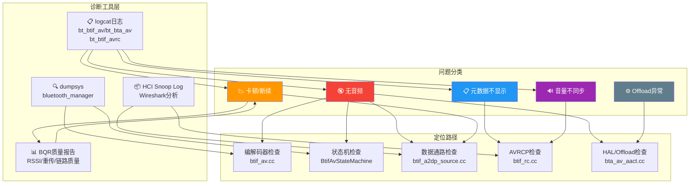
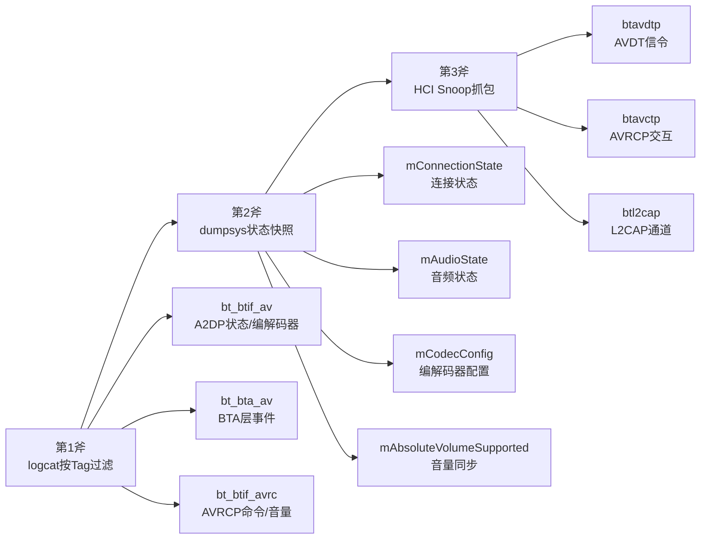
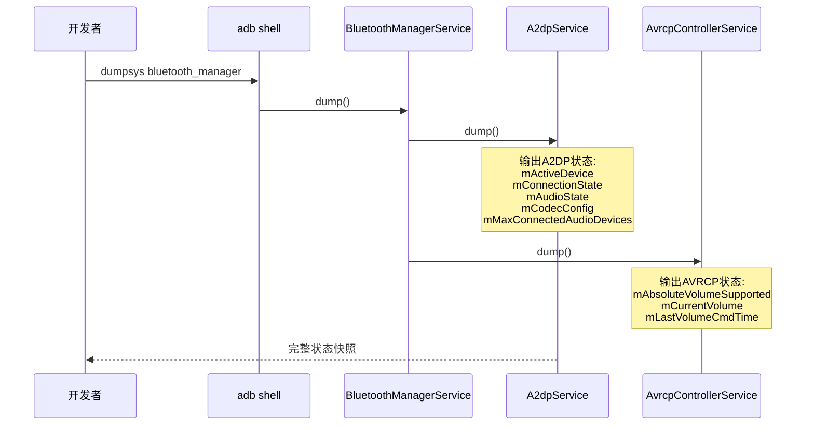
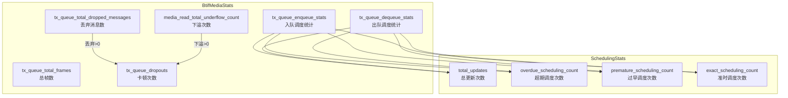
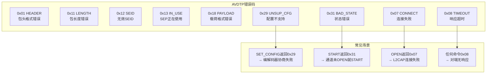
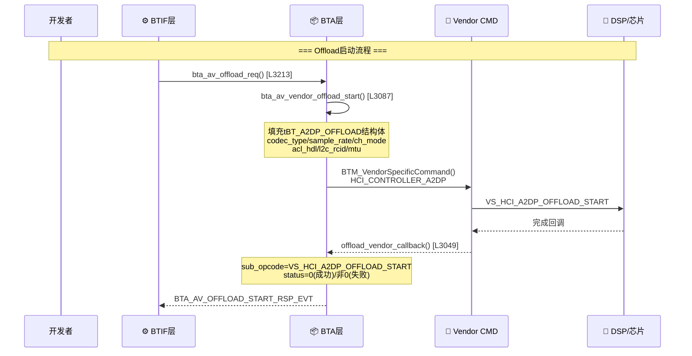
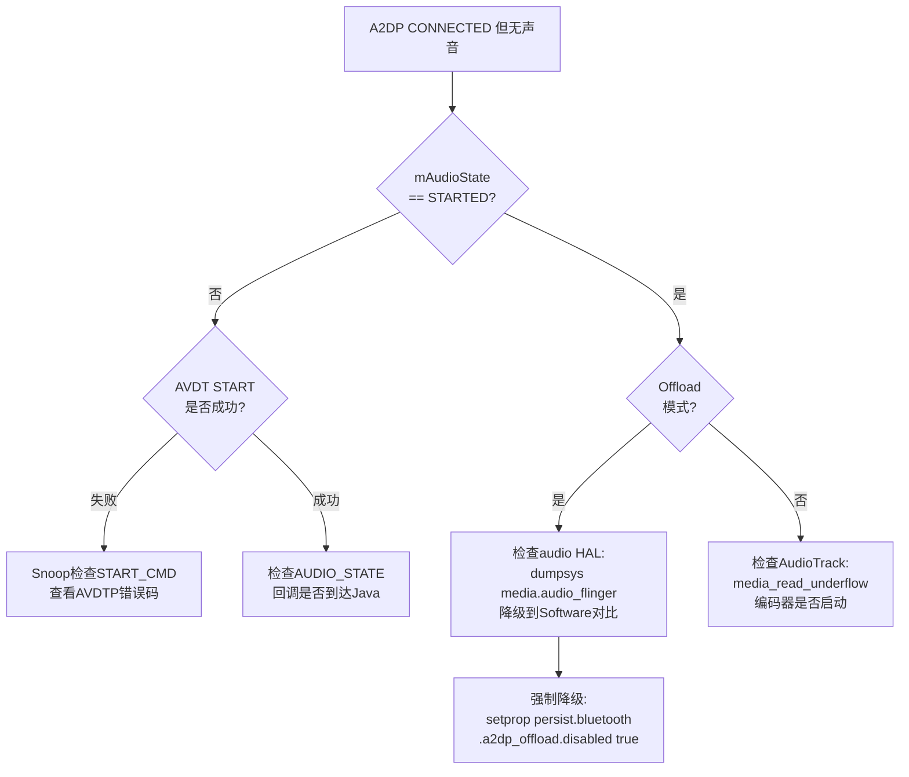
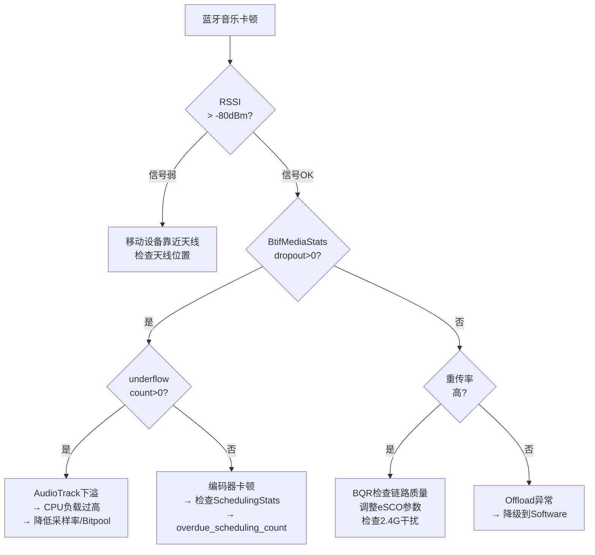

# T12_A2DP_AVRCP问题定位实战

> 学习日期：2026-05-16 | 优先级：P1 | 预计学习时间：3小时
> 前置知识：T08（A2DP连接流程）、T09（编解码器协商）、T10（音频数据通路）、T11（AVRCP控制与元数据）
> 涉及源码目录：system/btif/src/, system/bta/av/, system/stack/include/, system/gd/hal/

---

## 📋 本章导读

- **学什么**：A2DP/AVRCP问题的系统化定位方法——日志分析、dumpsys诊断、HCI Snoop抓包、Offload调试、统计指标解读
- **为什么学**：车载蓝牙音乐问题占蓝牙工单的40%以上，掌握定位方法是从"猜测"到"精准定位"的关键转变
- **学完能做**：
  - 使用日志三板斧快速定位A2DP/AVRCP问题层级
  - 解读dumpsys输出中的关键状态字段
  - 通过HCI Snoop Log追踪AVDT信令和音频数据流
  - 区分Software/Offload路径问题

---

## 🗺️ 架构全景图

### A2DP/AVRCP问题定位全景



---

## 🔍 代码导航

| 步骤 | 操作 | 文件 | 行号 | 看什么 |
|------|------|------|------|--------|
| 1 | 打开文件 | system/btif/src/btif_a2dp_source.cc | L131-173 | BtifMediaStats统计类 |
| 2 | 打开文件 | system/btif/src/btif_a2dp_source.cc | L1117-1180 | debug_dump统计输出 |
| 3 | 打开文件 | system/btif/src/btif_av.cc | L3979-4020 | btif_debug_av_peer_dump |
| 4 | 打开文件 | system/bta/av/bta_av_aact.cc | L1603-1650 | bta_av_open_failed |
| 5 | 打开文件 | system/bta/av/bta_av_aact.cc | L2431-2455 | bta_av_start_failed |
| 6 | 打开文件 | system/bta/av/bta_av_aact.cc | L3049-3085 | offload_vendor_callback |
| 7 | 打开文件 | system/stack/include/avdt_api.h | L208-250 | AVDTP错误码定义 |
| 8 | 打开文件 | system/gd/hal/snoop_logger.cc | L972-984 | A2DP Snoop过滤 |

---

## 📖 核心流程详解

### 5.1 日志分析三板斧



**A2DP日志Tag与关键字**：

```bash
# 完整A2DP连接日志
adb logcat -s bt_btif_av bt_bta_av | grep -i "peer\|state\|connect\|open\|codec"

# 关键日志行解读：
# bt_btif_av: "BtifAvPeer: XX:XX:XX:XX:XX:XX State: Idle → Opening"
#   → 状态机转换，定位连接卡在哪一步
# bt_btif_av: "codec_config: SBC 44100 Stereo Bitpool=53"
#   → 编解码器协商结果
# bt_btif_av: "AUDIO_STATE_STARTED"
#   → 音频开始传输
# bt_bta_av: "bta_av_open_failed"
#   → 连接失败，检查错误码
```

**AVRCP日志Tag与关键字**：

```bash
adb logcat -s bt_btif_avrc | grep -i "vol\|metadata\|track\|play\|passthru\|register"

# 关键日志行解读：
# bt_btif_avrc: "abs_vol: 100" → 收到SetAbsoluteVolume命令
# bt_btif_avrc: "Interim response: 0x02" → TRACK_CHANGE通知注册成功
# bt_btif_avrc: "passthrough response for Invalid rc handle"
#   → rc_handle无效，AVCTP通道可能未建立
```

### 5.2 dumpsys诊断详解



**A2DP dumpsys关键字段**：

```bash
adb dumpsys bluetooth_manager | grep -A 20 "A2DP"

# 关键字段解读：
# mActiveDevice: XX:XX:XX:XX:XX:XX
#   → 当前活跃设备，为空说明没有活跃连接
# mConnectionState: 2  (0=DISCONNECTED, 1=CONNECTING, 2=CONNECTED, 3=DISCONNECTING)
#   → 连接状态
# mAudioState: 1  (0=NOT_STARTED, 1=STARTED, 2=REMOTE_SUSPEND)
#   → 音频状态，STARTED才说明有音频流
# mCodecConfig: SBC 44100 Stereo Bitpool=53
#   → 当前编解码器配置
# mAbsoluteVolumeSupported: true/false
#   → 是否支持绝对音量
# mIsPlaying: true/false
#   → 是否正在播放
```

### 5.3 BtifMediaStats统计指标



**源码追踪 — BtifMediaStats**：

```cpp
// 📂 system/btif/src/btif_a2dp_source.cc:131-173
class BtifMediaStats {
public:
  BtifMediaStats() { Reset(); }
  void Reset() {
    session_start_us = 0;
    session_end_us = 0;
    // [1] 入队/出队调度统计
    tx_queue_enqueue_stats.Reset();  // 编码后入队
    tx_queue_dequeue_stats.Reset();  // 发送出队
    // [2] 帧统计
    tx_queue_total_frames = 0;           // 总编码帧数
    tx_queue_max_frames_per_packet = 0;  // 每包最大帧数
    // [3] 排队时间统计
    tx_queue_total_queueing_time_us = 0;  // 总排队时间
    tx_queue_max_queueing_time_us = 0;    // 最大排队时间
    // [4] 读写统计
    tx_queue_total_readbuf_calls = 0;     // AudioTrack读取次数
    tx_queue_last_readbuf_us = 0;         // 最后读取时间
    // [5] 丢弃/卡顿统计（关键！）
    tx_queue_total_flushed_messages = 0;  // 刷新的消息数
    tx_queue_total_dropped_messages = 0;  // ⚠️ 丢弃的消息数
    tx_queue_max_dropped_messages = 0;    // 最大丢弃数
    tx_queue_dropouts = 0;                // ⚠️ 卡顿次数
    // [6] 下溢统计（关键！）
    media_read_total_underflow_bytes = 0;  // 下溢字节数
    media_read_total_underflow_count = 0;  // ⚠️ 下溢次数
    media_read_last_underflow_us = 0;      // 最后下溢时间
    codec_index = -1;                       // 当前编解码器
  }
  // ...
};
```

**源码追踪 — debug_dump输出**：

```cpp
// 📂 system/btif/src/btif_a2dp_source.cc:1117-1180
void btif_a2dp_source_debug_dump(int fd) {
  // [1] 累积统计
  btif_a2dp_source_accumulate_stats(&btif_a2dp_source_cb.stats,
                                     &btif_a2dp_source_cb.accumulated_stats);
  // [2] 输出TxQueue统计
  dprintf(fd, "\nA2DP State:\n");
  dprintf(fd, "  TxQueue:\n");
  // 入队/出队/读取次数
  dprintf(fd, "  Counts (enqueue/dequeue/readbuf) : %zu / %zu / %zu\n",
          enqueue_stats->total_updates, dequeue_stats->total_updates,
          accumulated_stats->tx_queue_total_readbuf_calls);
  // ⚠️ 关键：丢弃/卡顿/下溢
  dprintf(fd, "  Counts (flushed/dropped/dropouts) : %zu / %zu / %zu\n",
          accumulated_stats->tx_queue_total_flushed_messages,
          accumulated_stats->tx_queue_total_dropped_messages,
          accumulated_stats->tx_queue_dropouts);
  // ⚠️ 下溢是卡顿的直接原因
  dprintf(fd, "  Counts (underflow) : %zu\n",
          accumulated_stats->media_read_total_underflow_count);
}
```

### 5.4 btif_debug_av_peer_dump状态机调试

```cpp
// 📂 system/btif/src/btif_av.cc:3979-4020
static void btif_debug_av_peer_dump(int fd, const BtifAvPeer& peer) {
  // [1] 状态机当前状态
  int state = peer.StateMachine().StateId();
  // Idle/Opening/Opened/Started/Closing
  dprintf(fd, "  Peer: %s\n", peer.PeerAddress().ToRedactedStringForLogging().c_str());
  dprintf(fd, "    Connected: %s\n", peer.IsConnected() ? "true" : "false");
  dprintf(fd, "    Streaming: %s\n", peer.IsStreaming() ? "true" : "false");
  dprintf(fd, "    SEP: %d(%s)\n", peer.PeerSep(), (peer.IsSource()) ? "Source" : "Sink");
  dprintf(fd, "    State Machine: %s\n", state_str.c_str());
  // [2] 连接标志
  dprintf(fd, "    Flags: %s\n", peer.FlagsToString().c_str());
  dprintf(fd, "    BTA Handle: 0x%x\n", peer.BtaHandle());
  // [3] 编解码器偏好
  dprintf(fd, "    Codec Preferred: %s\n",
          peer.IsMandatoryCodecPreferred() ? "Mandatory" : "Optional");
  // [4] 延迟报告
  dprintf(fd, "    Delay Reporting: %u (in 1/10 milliseconds) \n", peer.GetDelayReport());
}
```

### 5.5 AVDTP错误码速查



**AVDTP错误码完整定义**：

```cpp
// 📂 system/stack/include/avdt_api.h:208-250
// 协议错误码（AVDTP规范定义）
#define AVDT_ERR_HEADER    0x01  // 包头格式错误
#define AVDT_ERR_LENGTH    0x11  // 包长度错误
#define AVDT_ERR_SEID      0x12  // 无效SEID
#define AVDT_ERR_IN_USE    0x13  // SEP正在使用
#define AVDT_ERR_NOT_IN_USE 0x14 // SEP未使用
#define AVDT_ERR_CATEGORY  0x17  // 错误的服务类别
#define AVDT_ERR_PAYLOAD   0x18  // 载荷格式错误
#define AVDT_ERR_NSC       0x19  // 命令不支持
#define AVDT_ERR_INVALID_CAP 0x1A // 无效能力重配置
#define AVDT_ERR_RECOV_TYPE 0x22 // 恢复类型未定义
#define AVDT_ERR_MEDIA_TRANS 0x23 // 媒体传输能力错误
#define AVDT_ERR_UNSUP_CFG 0x29  // ⚠️ 配置不支持（协商失败）
#define AVDT_ERR_BAD_STATE 0x31  // ⚠️ 状态错误（操作顺序错）
// 额外错误码
#define AVDT_ERR_CONNECT   0x07  // ⚠️ 连接失败
#define AVDT_ERR_TIMEOUT   0x08  // ⚠️ 响应超时
```

### 5.6 Offload调试路径



**源码追踪 — offload_vendor_callback**：

```cpp
// 📂 system/bta/av/bta_av_aact.cc:3049-3085
static void offload_vendor_callback(tBTM_VSC_CMPL* param) {
  tBTA_AV value{0};
  uint8_t sub_opcode = 0;
  if (param->param_len) {
    // [1] 📋 解析Vendor响应
    value.status = static_cast<tBTA_AV_STATUS>(param->p_param_buf[0]);
  }
  if (value.status == 0) {
    // [2] ✅ Offload操作成功
    sub_opcode = param->p_param_buf[1];
    switch (sub_opcode) {
      case VS_HCI_A2DP_OFFLOAD_START:
      case VS_HCI_A2DP_OFFLOAD_START_V2:
        // [3] 启动成功
        if (bta_av_cb.offload_start_pending_hndl) {
          bta_av_cb.offload_started_hndl = bta_av_cb.offload_start_pending_hndl;
          bta_av_cb.offload_start_pending_hndl = BTA_AV_INVALID_HANDLE;
        }
        (*bta_av_cb.p_cback)(BTA_AV_OFFLOAD_START_RSP_EVT, &value);
        break;
    }
  } else {
    // [4] ❌ Offload操作失败
    //     ⚠️ 这是Offload问题的核心定位点
    if (param->opcode != VS_HCI_A2DP_OFFLOAD_STOP) {
      bta_av_cb.offload_start_pending_hndl = BTA_AV_INVALID_HANDLE;
      (*bta_av_cb.p_cback)(BTA_AV_OFFLOAD_START_RSP_EVT, &value);
    }
  }
}
```

### 5.7 五大典型案例

#### 案例1：A2DP连接成功但无音频



#### 案例2：蓝牙音乐卡顿



#### 案例3：AVRCP歌曲信息不显示

```
定位路径:
1. logcat -s bt_btif_avrc | grep "track_changed\|AVRC_EVT_TRACK_CHANGE"
   → 检查是否收到track change event
2. Snoop: btavctp → AVRC_PDU_REGISTER_NOTIFICATION
   → 是否注册了AVRC_EVT_TRACK_CHANGE
3. Snoop: AVRC_PDU_GET_ELEMENT_ATTR
   → 命令是否发出 + 响应是否包含数据
4. 检查手机AVRCP版本和interop配置
```

#### 案例4：音量不同步

```
定位路径:
1. dumpsys → mAbsoluteVolumeSupported → true/false
2. logcat -s bt_btif_avrc | grep "register_notification.*VOLUME"
   → 是否注册了AVRC_EVT_VOLUME_CHANGE
3. logcat -s bt_btif_avrc | grep "set_volume_rsp"
   → 是否正确响应SetAbsoluteVolume
4. Snoop → AVRC_PDU_SET_ABSOLUTE_VOLUME交互序列
5. 检查abs_vol(0-127)到系统音量的映射
```

#### 案例5：A2DP Offload异常

```
定位路径:
1. 确认Offload支持:
   adb shell getprop ro.bluetooth.a2dp_offload.supported
2. 检查Offload状态:
   adb dumpsys bluetooth_manager | grep -i offload
3. 检查Audio HAL:
   adb dumpsys media.audio_flinger | grep -A 5 a2dp
4. 强制降级测试:
   adb shell setprop persist.bluetooth.a2dp_offload.disabled true
   重启蓝牙进程验证
5. 查看Vendor CMD日志:
   logcat | grep "VS_HCI_A2DP_OFFLOAD"
6. DSP日志: vendor日志查看芯片侧状态
```

---

## 💡 C++知识卡片

### 💡 C++知识卡片：dprintf文件描述符输出

> 🔄 Java类比：Java的PrintWriter + FileDescriptor ≈ C++的dprintf
> dumpsys通过文件描述符fd传递输出流

```cpp
// Java: PrintWriter pw = new PrintWriter(fd);
// pw.println("A2DP State:");
// pw.printf("  Counts: %d / %d / %d\n", a, b, c);

// C++: dprintf直接写入文件描述符
// 📂 system/btif/src/btif_a2dp_source.cc:1127
dprintf(fd, "\nA2DP State:\n");
dprintf(fd, "  TxQueue:\n");
dprintf(fd, "  Counts (enqueue/dequeue/readbuf) : %zu / %zu / %zu\n",
        enqueue_stats->total_updates, dequeue_stats->total_updates,
        accumulated_stats->tx_queue_total_readbuf_calls);

// 💡 关键区别：
// Java: 使用PrintWriter，有自动flush和编码处理
// C++: dprintf是POSIX函数，直接写fd，无缓冲
// %zu: size_t的格式说明符，Java没有对应物（Java用%d）
// ⚠️ dprintf的fd由dumpsys框架传入，不要close它
```

### 💡 C++知识卡片：统计类的Reset()模式

> 🔄 Java类比：Java的reset()方法 ≈ C++的Reset()方法
> C++手动管理每个字段的初始值，Java可以依赖默认值

```cpp
// 📂 system/btif/src/btif_a2dp_source.cc:134-155
void Reset() {
    // [1] 每个字段必须显式重置
    //     💡C++: 没有GC，没有默认值
    //     Java的int默认0，C++的局部变量是未定义值
    session_start_us = 0;
    session_end_us = 0;
    tx_queue_enqueue_stats.Reset();  // 递归调用子对象的Reset
    tx_queue_dequeue_stats.Reset();
    tx_queue_total_frames = 0;
    tx_queue_total_dropped_messages = 0;
    tx_queue_dropouts = 0;
    media_read_total_underflow_count = 0;
    media_read_total_underflow_bytes = 0;
    codec_index = -1;  // -1表示未设置
}

// ⚠️ C++陷阱：忘记Reset会导致脏数据
// Java: 新对象自动初始化为0/null
// C++: 必须手动Reset，否则上次的数据残留
```

---

## 🗂️ Java ↔ C++ 对照表

| Java层 | JNI桥接 | C++层 |
|--------|---------|-------|
| A2dpService.dump() | fd传递 | btif_a2dp_source_debug_dump() [L1117] |
| A2dpStateMachine.dump() | fd传递 | btif_debug_av_peer_dump() [L3979] |
| A2dpService.getConnectionState() | AIDL | btif_av.cc: btif_av_source_connect() |
| A2dpService.getCodecStatus() | AIDL | btif_av.cc: btif_av_get_codec_config() |
| AvrcpControllerService.dump() | fd传递 | btif_rc.cc: rc_ctrl_procedure_complete() |
| HeadsetService.dump() | fd传递 | btif_hf.cc: HeadsetInterface::DebugDump() [L1635] |

---

## 🐛 问题排查SOP

### 问题：A2DP连接失败

```
步骤1: 查日志
  adb logcat -s bt_btif_av bt_bta_av | grep -i "open_failed\|fail\|error"

步骤2: 定位代码
  搜索 "bta_av_open_failed" → bta_av_aact.cc:L1603
  → open_status = BTA_AV_FAIL_STREAM → AVDT连接失败
  搜索 "BTA_AV_FAIL_GET_CAP" → bta_av_aact.cc:L1630
  → 已有同设备活跃连接

步骤3: 常见根因
  ① SDP查询超时 → 手机端未注册A2DP SDP记录
  ② AVDT_ERR_CONNECT(0x07) → L2CAP连接被拒
  ③ AVDT_ERR_UNSUP_CFG(0x29) → 编解码器协商失败
  ④ AVDT_ERR_TIMEOUT(0x08) → 对端无响应

步骤4: Snoop验证
  Wireshark过滤: btavdtp || btsdp
  追踪DISCOVER→GET_CAP→SET_CONFIG→OPEN完整序列
```

---

## 🛠️ 动手练习

### 🟢 入门：阅读dumpsys输出
1. 连接蓝牙耳机，执行 `adb dumpsys bluetooth_manager`
2. 找到A2DP相关输出，记录mConnectionState、mAudioState、mCodecConfig
3. 对照btif_debug_av_peer_dump()源码，理解每个字段的来源

### 🟡 进阶：分析卡顿问题
1. 播放蓝牙音乐，执行 `adb dumpsys bluetooth_manager | grep -A 30 "A2DP State"`
2. 找到TxQueue统计，检查dropped/dropouts/underflow计数
3. 对照BtifMediaStats类，理解每个统计指标的含义
4. 尝试降低Bitpool验证卡顿是否改善

### 🔴 实战：完整问题定位
模拟一个"A2DP连接成功但无音频"的场景：
1. 使用logcat抓取完整连接日志
2. 使用dumpsys检查mAudioState
3. 使用HCI Snoop Log追踪AVDT信令
4. 检查Offload状态
5. 编写完整的问题排查报告，包含日志证据和根因分析

---

## 📚 关键源码索引

| 序号 | 文件 | 行号 | 函数/类 | 作用 |
|------|------|------|---------|------|
| 1 | system/btif/src/btif_a2dp_source.cc | L105-129 | SchedulingStats | 调度统计类 |
| 2 | system/btif/src/btif_a2dp_source.cc | L131-173 | BtifMediaStats | 媒体统计类 |
| 3 | system/btif/src/btif_a2dp_source.cc | L1117-1180 | btif_a2dp_source_debug_dump() | A2DP统计dump输出 |
| 4 | system/btif/src/btif_av.cc | L3979-4020 | btif_debug_av_peer_dump() | Peer状态dump |
| 5 | system/btif/src/btif_av.cc | L4022-4030 | btif_debug_av_source_dump() | Source全局dump |
| 6 | system/bta/av/bta_av_aact.cc | L1603-1650 | bta_av_open_failed() | 连接失败处理 |
| 7 | system/bta/av/bta_av_aact.cc | L2431-2455 | bta_av_start_failed() | 启动失败处理 |
| 8 | system/bta/av/bta_av_aact.cc | L3049-3085 | offload_vendor_callback() | Offload Vendor回调 |
| 9 | system/bta/av/bta_av_aact.cc | L3087-3116 | bta_av_vendor_offload_start() | Offload启动 |
| 10 | system/stack/include/avdt_api.h | L208-250 | AVDT_ERR_* | AVDTP错误码定义 |
| 11 | system/gd/hal/snoop_logger.cc | L972-984 | IsA2dpMediaPacket() | Snoop A2DP过滤 |
