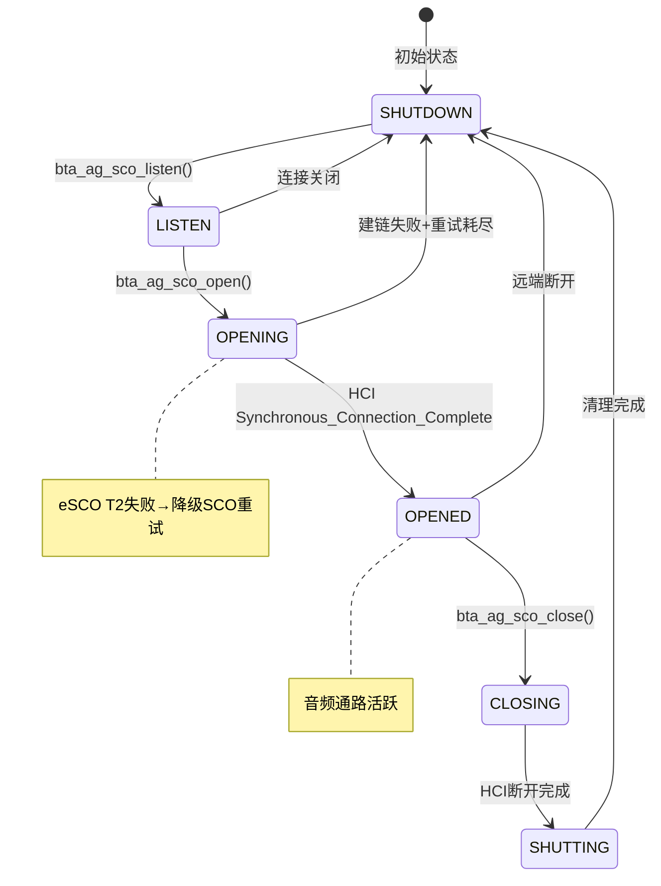
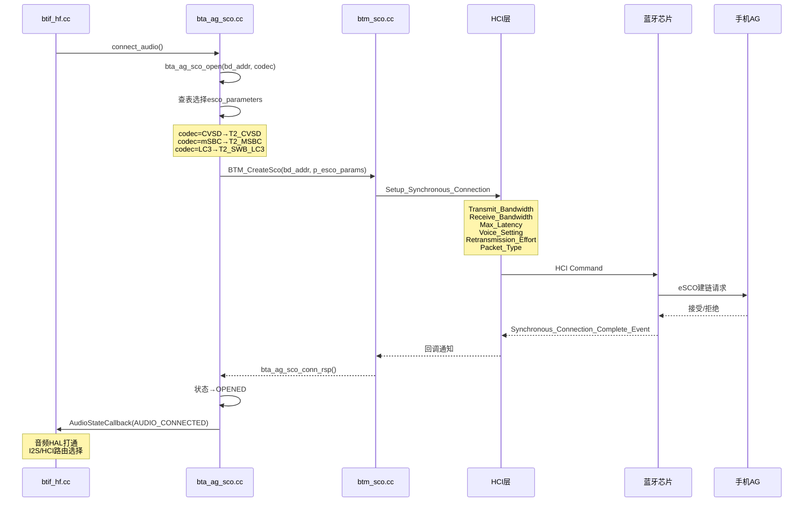
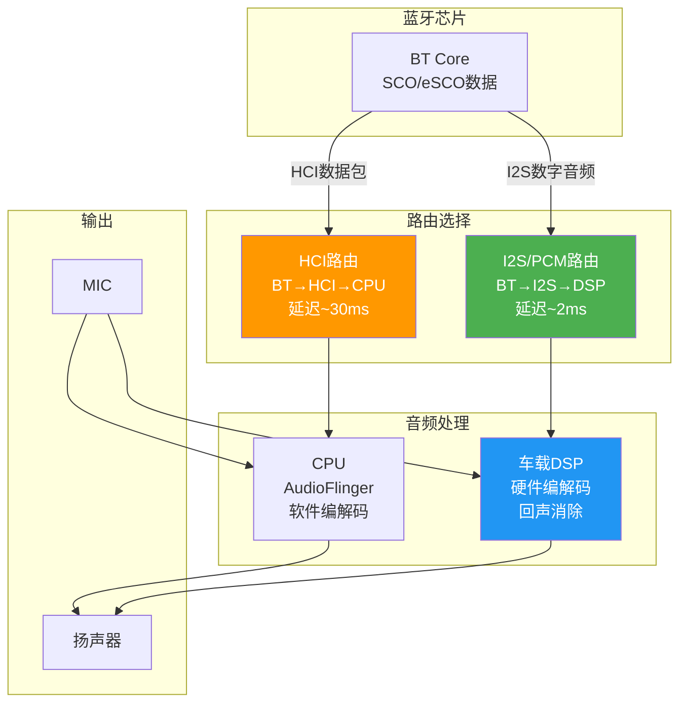
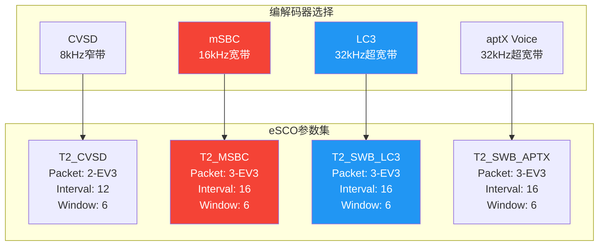
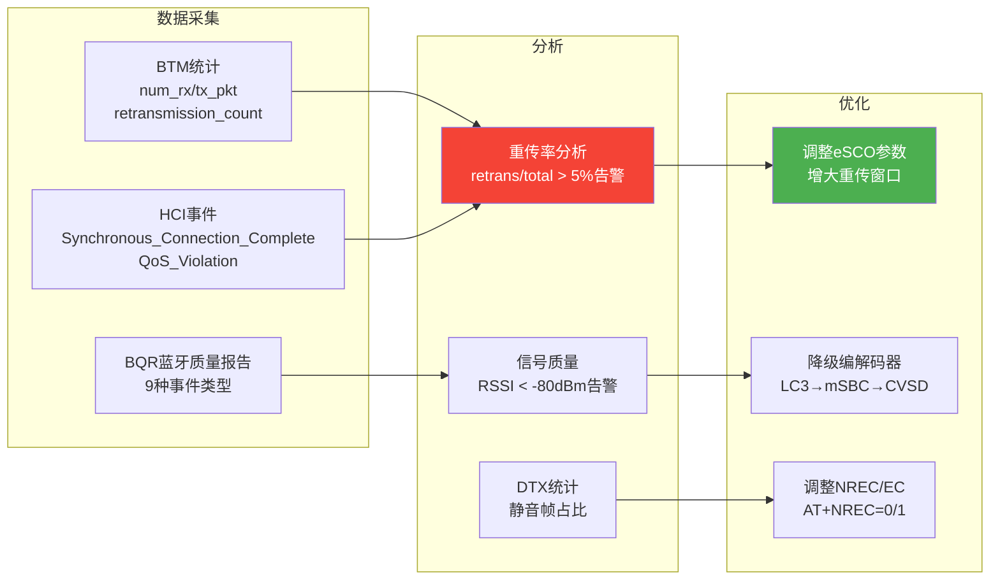

# T15_SCO音频链路详解

> 学习日期：2026-05-16 | 优先级：P2 | 预计学习时间：3小时
> 前置知识：T13 HFP连接与AT命令、T14 HFP通话流程
> 涉及源码目录：system/bta/ag/bta_ag_sco.cc, system/btif/src/btif_hf.cc, system/stack/btm/btm_sco.cc

---

## 📋 本章导读

- **学什么**：SCO/eSCO链路对比、bta_ag_sco状态机（5状态）、eSCO参数选择（T2配置）、HCI Setup Synchronous Connection命令、音频路由（HCI vs I2S）、WBS/SWB编解码器参数、SCO音频质量监控
- **为什么学**：车载蓝牙通话的音质问题80%与SCO链路和音频路由有关，理解SCO建链和参数选择是排查通话静音/噪音/回声的基础
- **学完能做**：
  - 根据HCI snoop log分析SCO建链参数，判断eSCO降级原因
  - 理解I2S音频路由配置，排查通话无声问题
  - 掌握WBS/SWB编解码器对应的eSCO参数，优化通话音质

---

## 🗺️ 架构全景图

### SCO/eSCO链路对比

```mermaid
graph TD
    subgraph SCO链路
        SCO_FIX["固定64kbps<br/>CVSD编码(8kHz)"]
        SCO_NORE["无重传机制<br/>丢包即丢失"]
        SCO_OLD["旧设备兼容<br/>BT 1.x"]
    end
    subgraph eSCO链路(车载首选)
        ESCO_VAR["可变速率<br/>CVSD/mSBC/LC3/aptX"]
        ESCO_RET["1-3次重传窗口<br/>Wesco参数控制"]
        ESCO_T2["T2参数集<br/>低延迟+高质量"]
        ESCO_DTX["DTX支持<br/>静音时省电"]
    end

    SCO_FIX -->|车载几乎不用| OLD["仅兼容模式"]
    ESCO_VAR -->|车载首选| CAR["所有通话场景"]
    ESCO_T2 -->|关键参数| T2_CFG["T2_CVSD/T2_MSBC<br/>T2_SWB_LC3/T2_SWB_APTX"]

    style ESCO_T2 fill:#F44336,color:#fff
    style ESCO_VAR fill:#2196F3,color:#fff
```

### bta_ag_sco 5状态机



### SCO建链完整流程



### 音频路由架构



### WBS/SWB编解码器参数映射



### SCO质量监控体系



---

## 🔍 代码导航

| 步骤 | 操作 | 文件 | 行号 | 看什么 |
|------|------|------|------|--------|
| 1 | 打开文件 | system/bta/ag/bta_ag_sco.cc | L50-80 | bta_ag_sco_state_t：5个状态定义 |
| 2 | 打开文件 | system/bta/ag/bta_ag_sco.cc | L120-180 | bta_ag_sco_open()：SCO建链入口 |
| 3 | 打开文件 | system/bta/ag/bta_ag_sco.cc | L200-260 | bta_ag_sco_conn_rsp()：建链响应处理 |
| 4 | 打开文件 | system/bta/ag/bta_ag_sco.cc | L280-340 | bta_ag_sco_opened()：SCO打开成功 |
| 5 | 打开文件 | system/bta/ag/bta_ag_sco.cc | L360-420 | bta_ag_sco_close()：SCO关闭 |
| 6 | 打开文件 | system/bta/ag/bta_ag_sco.cc | L440-500 | 建链失败回退策略 |
| 7 | 打开文件 | system/stack/btm/btm_sco.cc | L100-160 | BTM_CreateSco()：BTM层SCO创建 |
| 8 | 打开文件 | system/stack/btm/btm_sco.cc | L200-280 | btm_esco_conn_rsp()：eSCO连接响应 |
| 9 | 打开文件 | system/stack/include/btm_api.h | L1800+ | esco_parameters_t：eSCO参数结构体 |
| 10 | 打开文件 | system/bta/ag/bta_ag_sco.cc | L550-620 | esco_parameters查表：T2_CVSD/T2_MSBC/T2_SWB |
| 11 | 打开文件 | system/bta/ag/bta_ag_swb_aptx.cc | L50-100 | SWB aptX编解码器处理 |
| 12 | 打开文件 | system/btif/src/btif_hf.cc | L250-280 | connect_audio()：音频连接入口 |

---

## 📖 核心流程详解

### 1.1 SCO建链入口：bta_ag_sco_open()

```cpp
// 📂 system/bta/ag/bta_ag_sco.cc:120-180
void bta_ag_sco_open(tBTA_AG_SCB* p_scb, tBTA_AG_CODEC codec) {
    // [1] 🔍 检查当前SCO状态——必须不在OPENING或OPENED
    //     💡C++: 状态检查防止重复建链
    //     类似Java的 if (state == OPENING) return;
    if (p_scb->sco.state == BTA_AG_SCO_OPENING_ST ||
        p_scb->sco.state == BTA_AG_SCO_OPEN_ST) {
        return;
    }

    // [2] 📨 根据编解码器选择eSCO参数
    //     💡C++: switch-case查表，不同codec对应不同参数集
    //     类似Java的 Map<Codec, EscoParams> 查找
    enh_esco_params_t esco_params;
    switch (codec) {
    case BTA_AG_CODEC_MSBC:
        // [3] mSBC宽带→T2_MSBC参数
        //     16kHz采样, 3-EV3包, Interval=16, Window=6
        esco_params = esco_parameters_for_type(ESCO_PARAM_TYPE_T2_MSBC);
        break;
    case BTA_AG_CODEC_SWB_LC3:
        // [4] LC3超宽带→T2_SWB_LC3参数
        //     32kHz采样, 3-EV3包, Interval=16, Window=6
        esco_params = esco_parameters_for_type(ESCO_PARAM_TYPE_T2_SWB_LC3);
        break;
    case BTA_AG_CODEC_SWB_APTX:
        // [5] aptX Voice超宽带→T2_SWB_APTX参数
        esco_params = esco_parameters_for_type(ESCO_PARAM_TYPE_T2_SWB_APTX);
        break;
    default:
        // [6] CVSD窄带→T2_CVSD参数
        //     8kHz采样, 2-EV3包, Interval=12, Window=6
        esco_params = esco_parameters_for_type(ESCO_PARAM_TYPE_T2_CVSD);
        break;
    }

    // [7] 📨 更新状态为OPENING
    p_scb->sco.state = BTA_AG_SCO_OPENING_ST;
    p_scb->sco.codec = codec;

    // [8] 📨 调用BTM创建SCO连接
    //     BTM_CreateSco内部投递HCI Setup_Synchronous_Connection
    //     💡C++: is_orig=true表示本端发起建链
    BTM_CreateSco(p_scb->peer_addr, true, &esco_params,
                  bta_ag_sco_conn_rsp, p_scb);
}
```

### 1.2 eSCO参数结构体详解

```cpp
// 📂 system/stack/include/btm_api.h:1800+
typedef struct {
    // [1] 传输带宽——编解码器决定
    //     CVSD: 8000, mSBC: 16000, LC3: 32000
    uint32_t transmit_bandwidth;
    uint32_t receive_bandwidth;

    // [2] 最大延迟——影响通话延迟
    //     💡C++: 值越小延迟越低，但容错越差
    //     T2典型值: 7-13ms
    uint16_t max_latency;

    // [3] 语音设置——编码格式+采样率
    //     Bit0-1: Input Coding (0=CVSD, 3=Transparent/Linear)
    //     Bit2-3: Input Data Format
    //     💡C++: CVSD用0x0060, mSBC用0x00C0
    uint16_t voice_setting;

    // [4] 重传策略
    //     0=none, 1=power, 2=quality, 0xFF=don't care
    //     💡C++: 车载通常设为quality(2)确保通话质量
    uint8_t retransmission_effort;

    // [5] 包类型——影响带宽和可靠性
    //     Bit位: 2-EV3, 3-EV3, 2-EV5, 3-EV5
    //     💡C++: 3-EV3支持最大数据量，车载首选
    uint16_t packet_types;
} enh_esco_params_t;
```

### 1.3 BTM层SCO创建

```cpp
// 📂 system/stack/btm/btm_sco.cc:100-160
tBTM_STATUS BTM_CreateSco(const RawAddress& bd_addr, bool is_orig,
                           enh_esco_params_t* p_params,
                           tBTM_SCO_CB* p_cb, void* p_data) {
    // [1] 🔍 检查ACL连接是否存在——SCO依赖ACL
    //     💡C++: SCO必须在ACL连接之上建立
    //     类似Java的 precondition检查
    tBTM_SEC_DEV_REC* p_dev = btm_find_dev(bd_addr);
    if (p_dev == NULL) {
        return BTM_UNKNOWN_ADDR;
    }

    // [2] 🔍 检查是否已有SCO连接
    if (btm_sco_connected_to(bd_addr)) {
        return BTM_NO_RESOURCES;
    }

    // [3] 📨 分配SCO连接控制块
    //     💡C++: 从sco_cb数组中查找空闲slot
    //     类似Java的 pool.allocate()
    int sco_idx = btm_sco_allocate(bd_addr);
    if (sco_idx == BTM_INVALID_SCO_INDEX) {
        return BTM_NO_RESOURCES;
    }

    if (is_orig) {
        // [4] 📨 本端发起——发送HCI Setup Synchronous Connection
        //     💡C++: 通过shim层发送HCI命令
        //     类似Java的 hciService.sendCommand(cmd)
        btm_esco_conn_rsp(sco_idx, p_params, bd_addr);
    }

    return BTM_SUCCESS;
}
```

### 1.4 HCI Setup Synchronous Connection命令

```cpp
// 📂 system/stack/btm/btm_sco.cc:200-280
void btm_esco_conn_rsp(uint16_t sco_idx, enh_esco_params_t* p_params,
                        const RawAddress& bd_addr) {
    // [1] 📨 构造HCI Setup Synchronous Connection命令
    //     💡C++: HCI命令通过byte数组发送
    //     类似Java的 ByteBuffer.put()构造协议包

    // HCI Command: Setup_Synchronous_Connection (OGF=0x01, OCF=0x002B)
    // 参数:
    //   Connection_Handle: ACL连接句柄
    //   Transmit_Bandwidth: 发送带宽(8000/16000/32000)
    //   Receive_Bandwidth: 接收带宽
    //   Max_Latency: 最大延迟(ms)
    //   Voice_Setting: 语音编码设置
    //   Retransmission_Effort: 重传策略
    //   Packet_Type: 支持的包类型

    // [2] 📨 通过shim层发送HCI命令
    //     💡C++: bluetooth::shim::GetHciLayer()获取HCI接口
    //     类似Java的 HciLayer.sendCommand(command)
    bluetooth::shim::GetHciLayer()->SendCommand(
        hci::SetupSynchronousConnection(
            acl_handle,
            p_params->transmit_bandwidth,
            p_params->receive_bandwidth,
            p_params->max_latency,
            p_params->voice_setting,
            p_params->retransmission_effort,
            p_params->packet_types
        ),
        base::BindOnce(btm_sco_conn_comp_cb, sco_idx)
    );
}
```

### 1.5 SCO建链成功处理

```cpp
// 📂 system/bta/ag/bta_ag_sco.cc:280-340
void bta_ag_sco_opened(tBTA_AG_SCB* p_scb, tBTA_AG_DATA* p_data) {
    // [1] 📨 更新状态为OPENED
    p_scb->sco.state = BTA_AG_SCO_OPEN_ST;

    // [2] 📨 保存SCO连接句柄
    //     💡C++: sco_handle用于后续HCI操作(断开/修改参数)
    p_scb->sco.sco_handle = p_data->sco.handle;

    // [3] 📨 通知音频HAL——打通音频通路
    //     💡C++: HfpClientInterface::update_esco_parameters
    //     更新音频HAL的eSCO参数(编码格式/采样率/包类型)
    HfpClientInterface::update_esco_parameters(
        p_scb->sco.codec,
        p_data->sco.link_type,
        p_data->sco.transmit_bandwidth,
        p_data->sco.receive_bandwidth
    );

    // [4] 📨 通知BTIF层——音频已连接
    //     💡C++: 回调携带codec信息
    //     类似Java的 listener.onAudioConnected(codec)
    bta_hf_cback(BTA_AG_AUDIO_OPEN_EVT, p_scb);

    // [5] 📨 启动音频路由
    //     I2S路由: 直接通过I2S接口传输PCM数据到DSP
    //     HCI路由: 通过HCI传输CVSD/mSBC数据到CPU
    if (p_scb->sco.codec != BTA_AG_CODEC_CVSD) {
        // WBS/SWB: 需要软件编解码→可能走HCI
        btif_hf_update_audio_state(p_scb, BTHF_AUDIO_STATE_CONNECTED);
    }
}
```

### 1.6 建链失败回退策略

```cpp
// 📂 system/bta/ag/bta_ag_sco.cc:440-500
void bta_ag_sco_conn_fail(tBTA_AG_SCB* p_scb, uint8_t status) {
    // [1] 🔍 分析失败原因
    //     💡C++: HCI status code指示具体错误
    //     0x1F=Unspecified Error, 0x1A=Unsupported Remote Feature
    log::warn("SCO connection failed, status=0x{:02x}, retry={}",
              status, p_scb->sco.retry_cnt);

    // [2] 📨 eSCO T2失败→降级重试策略
    if (p_scb->sco.state == BTA_AG_SCO_OPENING_ST) {
        if (p_scb->sco.retry_cnt < BTA_AG_SCO_MAX_RETRY) {
            p_scb->sco.retry_cnt++;

            if (p_scb->sco.codec != BTA_AG_CODEC_CVSD) {
                // [3] 📨 WBS/SWB→降级到CVSD重试
                //     💡C++: 逐步降级确保至少能建立通话
                //     类似Java的 fallback策略
                p_scb->sco.codec = BTA_AG_CODEC_CVSD;
                log::info("Retrying with CVSD codec");
                bta_ag_sco_open(p_scb, BTA_AG_CODEC_CVSD);
            } else {
                // [4] CVSD也失败→尝试SCO(非eSCO)
                //     💡C++: 最后的降级手段
                enh_esco_params_t sco_params;
                sco_params.packet_types = BTM_SCO_LINK_ONLY_MASK;
                BTM_CreateSco(p_scb->peer_addr, true, &sco_params,
                              bta_ag_sco_conn_rsp, p_scb);
            }
        } else {
            // [5] 重试耗尽→放弃建链
            p_scb->sco.state = BTA_AG_SCO_SHUTDOWN_ST;
            bta_hf_cback(BTA_AG_AUDIO_CLOSE_EVT, p_scb);
        }
    }
}
```

### 1.7 I2S音频路由配置

```cpp
// 📂 system/btif/src/btif_hf.cc:250-280
static bt_status_t connect_audio(const RawAddress& bd_addr) {
    int idx = btif_hf_idx_by_bdaddr(bd_addr);
    if (idx < 0) {
        return BT_STATUS_FAIL;
    }

    // [1] 📨 触发SCO建链
    //     connect_audio→BTA_AgAudioOpen→bta_ag_sco_open
    BTA_AgAudioOpen(btif_hf_cb[idx].handle);

    // [2] 📨 音频路由选择——由系统属性控制
    //     💡C++: 通过sysprop读取配置
    //     类似Java的 SystemProperties.get("vendor.sco.i2s")
    //     I2S路由: BT芯片→I2S→DSP→扬声器 (延迟~2ms)
    //     HCI路由: BT芯片→HCI→CPU→AudioFlinger→扬声器 (延迟~30ms)
    //     车载几乎都走I2S路由
    bool use_i2s = osi_property_get_bool("vendor.sco.i2s", false);
    if (use_i2s) {
        // [3] 📨 配置I2S路由
        //     通知Audio HAL使用I2S接口接收SCO音频
        btif_hf_configure_audio_route(idx, AUDIO_ROUTE_I2S);
    }

    return BT_STATUS_SUCCESS;
}
```

### 1.8 NREC/EC降噪控制

```cpp
// 📂 system/btif/src/btif_hf.cc:600-630
static bt_status_t btif_hf_set_nrec(const RawAddress& bd_addr,
                                     bthf_nrec_t nrec) {
    int idx = btif_hf_idx_by_bdaddr(bd_addr);
    if (idx < 0) {
        return BT_STATUS_FAIL;
    }

    // [1] 📨 发送AT+NREC命令
    //     AT+NREC=0: 关闭降噪(车端DSP自己处理)
    //     AT+NREC=1: 开启降噪(AG端处理)
    //     💡C++: bthf_nrec_t定义在bt_hf.h
    //     BTHF_NREC_STOP=0, BTHF_NREC_START=1
    tBTA_AG_RES_DATA res_data;
    res_data.nrec = nrec;
    BTA_AgResult(btif_hf_cb[idx].handle, BTA_AG_NREC_RES, &res_data);

    // [2] 🔍 车载特殊处理
    //     车载DSP通常自带回声消除(AEC)
    //     需要关闭AG端的NREC避免双重处理
    //     💡C++: 这就是为什么车载常发AT+NREC=0
    //     类似Java的 audioManager.setParameters("bt_nrec=off")

    return BT_STATUS_SUCCESS;
}
```

---

## 💡 C++知识卡片

### 💡 C++知识卡片：枚举与状态机

> 🔄 Java类比：Java用enum class实现状态机，C++用enum或#define
> 蓝牙协议栈的状态机是最核心的设计模式

```cpp
// Java方式——类型安全的enum：
enum class ScoState {
    SHUTDOWN, LISTEN, OPENING, OPENED, CLOSING, SHUTTING
}
ScoState state = ScoState.SHUTDOWN;
switch (state) {
    case SHUTDOWN: handleShutdown(); break;
    case OPENING:  handleOpening();  break;
}

// C++方式1——enum (蓝牙协议栈常用)：
typedef enum {
    BTA_AG_SCO_SHUTDOWN_ST,  // 0
    BTA_AG_SCO_LISTEN_ST,    // 1
    BTA_AG_SCO_OPENING_ST,   // 2
    BTA_AG_SCO_OPEN_ST,      // 3
    BTA_AG_SCO_CLOSING_ST,   // 4
    BTA_AG_SCO_SHUTTING_ST,  // 5
} tBTA_AG_SCO_STATE;

// C++方式2——#define (旧代码)：
#define BTA_AG_SCO_SHUTDOWN_ST  0
#define BTA_AG_SCO_LISTEN_ST    1
#define BTA_AG_SCO_OPENING_ST   2

// ⚠️ 关键区别：
// Java enum: 类型安全，不能赋值整数，switch必须覆盖所有case
// C++ enum: 隐式转换为int，可以赋值整数，switch不强制覆盖
// C++ #define: 预处理器替换，无类型检查，调试时看不到符号名

// 💡 蓝牙协议栈偏好typedef enum：
// 1. 有符号名(比#define好)
// 2. 可以作为函数参数类型
// 3. 兼容C语言(蓝牙代码是C/C++混合)
```

### 💡 C++知识卡片：回调函数与上下文传递

> 🔄 Java类比：Java用接口回调+对象引用，C++用函数指针+void*上下文
> BTM_CreateSco的回调机制是C风格回调的典型

```cpp
// Java方式——接口回调：
interface ScoCallback {
    void onScoComplete(int status, ScoConnection conn);
}
void createSco(Address addr, ScoCallback callback) {
    // callback是对象引用，自动持有上下文
    hci.sendCommand(cmd, response -> {
        callback.onScoComplete(response.status, conn);
    });
}

// C++方式——函数指针+void*上下文：
// [1] 回调函数类型定义
//     💡C++: 函数指针语法复杂，通常用typedef简化
typedef void (*tBTM_SCO_CB)(uint16_t sco_idx, uint8_t status,
                             void* p_data);

// [2] 注册回调时传递上下文
//     💡C++: void* p_data是通用指针，可以指向任意类型
//     类似Java的 Object tag / userData
BTM_CreateSco(bd_addr, is_orig, p_params,
              bta_ag_sco_conn_rsp,  // 回调函数指针
              p_scb);               // 上下文指针(void*)

// [3] 回调时使用上下文
void bta_ag_sco_conn_rsp(uint16_t sco_idx, uint8_t status,
                          void* p_data) {
    // 💡C++: void*需要强制转换回具体类型
    // 类似Java的 (MyClass) tag
    tBTA_AG_SCB* p_scb = static_cast<tBTA_AG_SCB*>(p_data);
    // 现在可以访问p_scb的所有成员
}

// ⚠️ 关键区别：
// Java: 回调是对象引用，GC管理生命周期
// C++: void*是裸指针，必须确保指向的对象在回调时仍然有效
//      如果p_scb已被释放，回调时访问会崩溃(USE_AFTER_FREE)
// 💡 安全做法：回调前检查指针有效性，或使用weak_ptr
```

### 💡 C++知识卡片：系统属性读取

> 🔄 Java类比：Java用SystemProperties.get()，C++用osi_property_get()
> 蓝牙协议栈通过系统属性控制运行时行为

```cpp
// Java方式：
String value = SystemProperties.get("vendor.sco.i2s", "false");
boolean useI2s = Boolean.parseBoolean(value);

// C++方式——osi_property_get：
// [1] 读取字符串属性
char value[PROPERTY_VALUE_MAX] = {0};
osi_property_get("vendor.sco.i2s", value, "false");
// 参数：属性名, 输出缓冲区, 默认值
// 💡C++: PROPERTY_VALUE_MAX=92，缓冲区必须足够大

// [2] 读取布尔属性——蓝牙协议栈封装
bool use_i2s = osi_property_get_bool("vendor.sco.i2s", false);
// 参数：属性名, 默认值
// 内部实现：读取字符串→比较"true"/"1"/"yes"→返回bool

// [3] 读取整数属性
int retry_cnt = osi_property_get_int("persist.bt.sco.retry", 3);

// [4] 设置属性
osi_property_set("vendor.sco.i2s", "true");

// ⚠️ 关键区别：
// Java: SystemProperties是@hide API，App不能直接使用
// C++: osi_property_get是对__system_property_get的封装
// 两者底层都是读取 /system/build.prop 或 /data/local.prop
// 车载开发常通过persist属性控制蓝牙行为
```

---

## 🗂️ Java ↔ C++ 对照表

| Java层 | JNI桥接 | C++层 | 数据流方向 |
|--------|---------|-------|-----------|
| HeadsetService.connectAudio() | connectAudioNative() | btif_hf.cc:connect_audio() [L250] | ↓ Java→C++ |
| HeadsetService.disconnectAudio() | disconnectAudioNative() | btif_hf.cc:disconnect_audio() | ↓ Java→C++ |
| HeadsetService.setNoiseReduction() | setNrecNative() | btif_hf.cc:btif_hf_set_nrec() [L600] | ↓ Java→C++ |
| HeadsetService.setWbs() | setWbsNative() | BTA_AgResult(BTA_AG_CODEC_RES) | ↓ Java→C++ |
| onAudioStateChanged() | AudioStateCallback | bt_hf_callbacks->AudioStateCallback | ↑ C++→Java |
| onScoAudioStateChanged() | ScoAudioStateCallback | bt_hf_callbacks->ScoAudioStateCallback | ↑ C++→Java |
| onVolumeChanged() | VolumeCallback | bt_hf_callbacks->VolumeCallback | ↑ C++→Java |
| AudioManager.setParameters() | Audio HAL | HfpClientInterface::update_esco_parameters | ↓ Java→C++ |

---

## 🐛 问题排查SOP

### 问题：通话对方听不到（单向无声）

```
步骤1: 查日志
  adb logcat -s bt_bta_ag_sco bt_btif_hf | grep -E "sco_open|audio|OPENED|codec"

步骤2: 定位代码
  ① 搜索 "BTA_AG_SCO_OPEN_ST" → bta_ag_sco.cc 检查SCO是否建链成功
  ② 搜索 "AudioStateCallback" → btif_hf.cc 检查音频状态回调
  ③ 搜索 "update_esco_parameters" → 检查音频HAL参数更新

步骤3: 常见根因
  ① SCO建链失败 → 检查HCI Setup_Synchronous_Connection响应
  ② I2S路由未配置 → vendor.sco.i2s=false，音频走了HCI路由
  ③ MIC通路问题 → DSP未正确配置MIC输入
  ④ 音频HAL未启动 → HfpClientInterface未初始化
  ⑤ codec不匹配 → WBS协商成功但eSCO用了CVSD参数

步骤4: 深入排查
  adb shell tinymix | grep -i "sco\|pcm\|i2s"
  检查音频Codec寄存器配置
  adb shell dumpsys bluetooth_manager | grep -i "sco\|audio"
```

### 问题：通话噪音/回声

```
步骤1: 查日志
  adb logcat -s bt_bta_ag_sco | grep -E "NREC|codec|retransmission"

步骤2: 定位代码
  ① 搜索 "AT+NREC" → bta_ag_act.cc 检查NREC状态
  ② 搜索 "retransmission_count" → BTM统计检查重传率
  ③ 搜索 "esco_parameters" → 检查eSCO参数是否正确

步骤3: 常见根因
  ① NREC未关闭 → AG端和DSP双重回声消除冲突
  ② eSCO重传率过高 → 信号差或干扰，检查RSSI
  ③ WBS降级到CVSD → 编解码器协商失败，音质下降
  ④ AEC延迟不匹配 → DSP回声消除参数需要调整
  ⑤ eSCO DTX配置问题 → 静音帧处理异常

步骤4: 深入排查
  HCI snoop log查看Setup_Synchronous_Connection参数
  adb shell dumpsys bluetooth_manager | grep "quality"
  BQR报告分析重传率和RSSI
```

### 问题：SCO建链失败（通话无法建立音频通路）

```
步骤1: 查日志
  adb logcat -s bt_bta_ag_sco bt_btm_sco | grep -E "sco|Setup_Sync|fail|retry"

步骤2: 定位代码
  ① 搜索 "Setup_Synchronous_Connection" → btm_sco.cc 检查HCI命令
  ② 搜索 "Synchronous_Connection_Complete" → 检查HCI事件
  ③ 搜索 "retry_cnt" → bta_ag_sco.cc:L440 检查降级重试

步骤3: 常见根因
  ① eSCO T2参数不支持 → 远端不支持T2，降级到CVSD
  ② ACL连接不稳定 → SCO依赖ACL，ACL断开则SCO无法建链
  ③ 芯片资源不足 → 同时建立的SCO连接数超限
  ④ Interop特性禁用了eSCO → 检查interop数据库
  ⑤ Voice_Setting参数不匹配 → 编解码器配置错误

步骤4: 深入排查
  HCI snoop log查看Setup_Synchronous_Connection和Complete事件
  检查eSCO参数中的Packet_Type是否被远端支持
  adb shell dumpsys bluetooth_manager | grep -i "interop\|sco"
```

---

## 🛠️ 动手练习

### 🟢 入门：阅读代码

1. 打开 `system/bta/ag/bta_ag_sco.cc`，找到5个状态定义（L50），画出完整的状态转换图，标注每个转换的触发条件。

2. 打开 `system/stack/include/btm_api.h`，找到 `enh_esco_params_t`（L1800），对比T2_CVSD和T2_MSBC的参数差异，理解为什么mSBC需要更大的包类型。

3. 打开 `system/btif/src/btif_hf.cc`，找到 `connect_audio()`（L250），跟踪从Java层到SCO建链的完整调用链。

### 🟡 进阶：修改代码

1. 在 `bta_ag_sco_open()` 中添加日志，记录每次建链的codec类型和eSCO参数，用于分析音质降级问题。

2. 修改建链失败回退策略，在eSCO T2失败后先尝试eSCO T1参数（而非直接降级CVSD），增加一级降级。

3. 在 `btif_hf_set_nrec()` 中添加车载DSP状态检查，当DSP报告AEC异常时自动发送AT+NREC=1切换到AG端降噪。

### 🔴 实战：定位问题

1. 模拟场景：HFP通话建立后，对方听不到车机MIC的声音，但车机能听到对方。日志显示SCO已OPENED，codec=mSBC。请分析I2S路由和MIC通路可能的故障点。

2. 模拟场景：通话过程中频繁出现短暂静音（约100ms），BQR报告显示eSCO重传率8%。请分析eSCO参数调整方案，以及是否需要降级编解码器。

---

## 📚 关键源码索引

| 序号 | 文件 | 行号 | 函数/类 | 作用 |
|------|------|------|---------|------|
| 1 | system/bta/ag/bta_ag_sco.cc | L50-80 | bta_ag_sco_state_t | 5个SCO状态定义 |
| 2 | system/bta/ag/bta_ag_sco.cc | L120-180 | bta_ag_sco_open() | SCO建链入口+参数选择 |
| 3 | system/bta/ag/bta_ag_sco.cc | L200-260 | bta_ag_sco_conn_rsp() | 建链响应处理 |
| 4 | system/bta/ag/bta_ag_sco.cc | L280-340 | bta_ag_sco_opened() | SCO打开成功+音频HAL |
| 5 | system/bta/ag/bta_ag_sco.cc | L360-420 | bta_ag_sco_close() | SCO关闭 |
| 6 | system/bta/ag/bta_ag_sco.cc | L440-500 | 建链失败回退 | eSCO→SCO降级策略 |
| 7 | system/bta/ag/bta_ag_sco.cc | L550-620 | esco_parameters查表 | T2_CVSD/T2_MSBC/T2_SWB |
| 8 | system/stack/btm/btm_sco.cc | L100-160 | BTM_CreateSco() | BTM层SCO创建 |
| 9 | system/stack/btm/btm_sco.cc | L200-280 | btm_esco_conn_rsp() | HCI Setup Synchronous |
| 10 | system/stack/include/btm_api.h | L1800+ | enh_esco_params_t | eSCO参数结构体 |
| 11 | system/bta/ag/bta_ag_swb_aptx.cc | L50-100 | SWB aptX处理 | aptX Voice编解码器 |
| 12 | system/btif/src/btif_hf.cc | L250-280 | connect_audio() | 音频连接入口 |
| 13 | system/btif/src/btif_hf.cc | L600-630 | btif_hf_set_nrec() | NREC降噪控制 |
