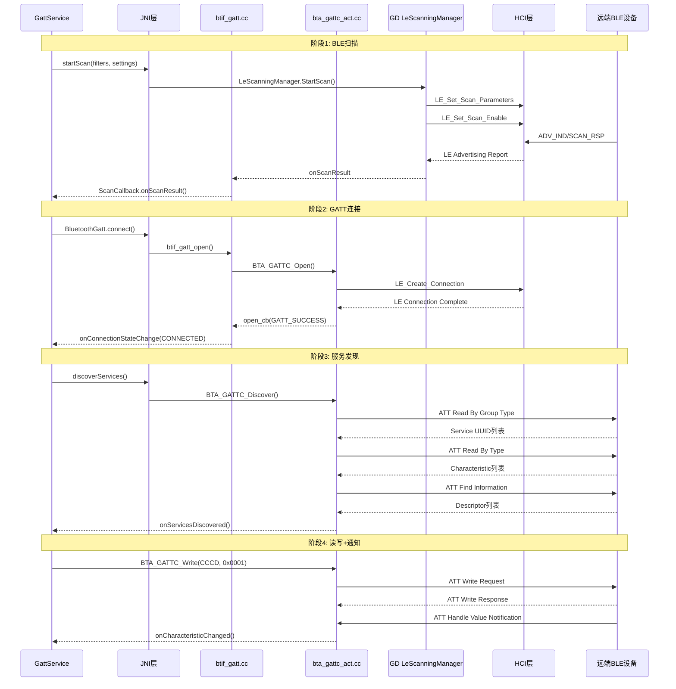
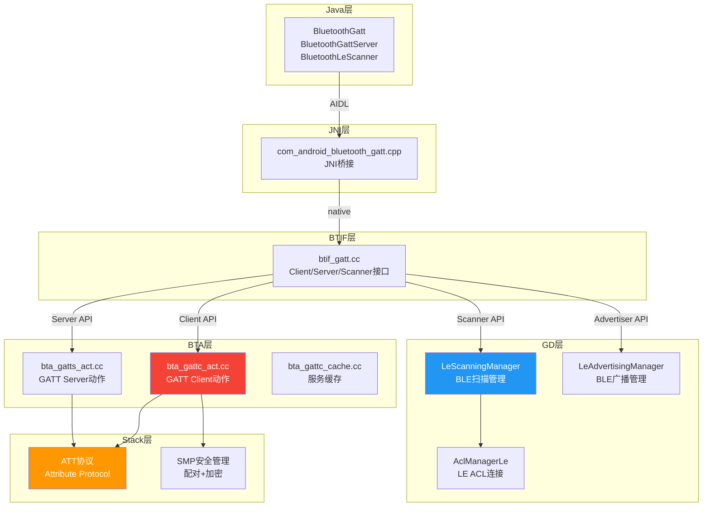
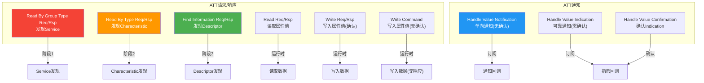
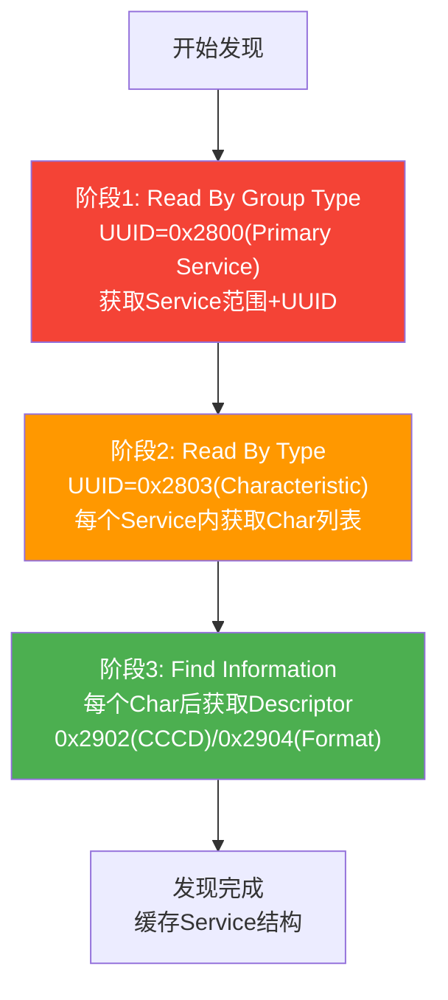
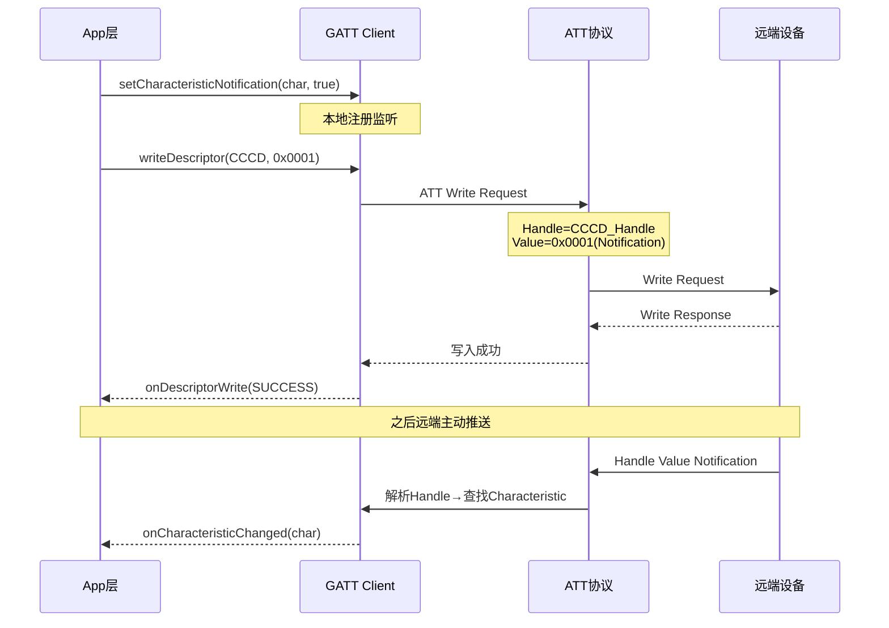
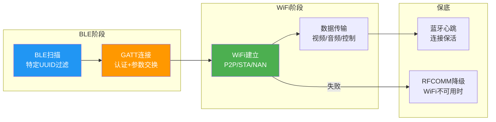

# T17_BLE_GATT完整流程详解

> 学习日期：2026-05-16 | 优先级：P3 | 预计学习时间：4小时
> 前置知识：T01蓝牙整体架构、T04配对流程、T06回调机制
> 涉及源码目录：system/btif/src/btif_gatt.cc, system/bta/gatt/, system/gd/hci/le_scanning_manager/

---

## 📋 本章导读

- **学什么**：BLE扫描（GD LeScanningManager）、GATT连接、服务发现（ATT协议）、读写操作、通知/指示机制、GATT Server端、车载互联GATT应用
- **为什么学**：车载手机互联（HiCar/CarPlay/CarLink）100%依赖BLE GATT完成设备发现和握手，GATT问题是互联故障的首要原因
- **学完能做**：
  - 根据日志追踪BLE扫描→GATT连接→服务发现→读写的完整路径
  - 理解ATT协议的7种PDU类型，能从snoop log中分析GATT交互
  - 掌握CCCD通知注册机制，排查通知不生效问题

---

## 🗺️ 架构全景图

### BLE GATT完整流程



### GATT协议栈层次架构



### ATT协议PDU类型



### GATT服务发现三阶段



### CCCD通知注册机制



### 车载互联GATT应用模式



---

## 🔍 代码导航

| 步骤 | 操作 | 文件 | 行号 | 看什么 |
|------|------|------|------|--------|
| 1 | 打开文件 | system/btif/src/btif_gatt.cc | L100-140 | btif_gatt_open()：GATT连接入口 |
| 2 | 打开文件 | system/btif/src/btif_gatt.cc | L200-240 | btif_gatt_discover_services()：服务发现入口 |
| 3 | 打开文件 | system/btif/src/btif_gatt.cc | L300-340 | btif_gatt_read_char()：读Characteristic |
| 4 | 打开文件 | system/btif/src/btif_gatt.cc | L350-400 | btif_gatt_write_char()：写Characteristic |
| 5 | 打开文件 | system/bta/gatt/bta_gattc_act.cc | L150-200 | bta_gattc_open()：BTA层连接处理 |
| 6 | 打开文件 | system/bta/gatt/bta_gattc_act.cc | L300-360 | bta_gattc_disc_res_cback()：发现结果回调 |
| 7 | 打开文件 | system/bta/gatt/bta_gattc_act.cc | L72-80 | tGATT_CBACK回调表：8个回调函数 |
| 8 | 打开文件 | system/bta/gatt/bta_gattc_cache.cc | L50-100 | GATT服务缓存机制 |
| 9 | 打开文件 | system/gd/hci/le_scanning_manager/ | - | GD层BLE扫描管理器 |
| 10 | 打开文件 | system/bta/gatt/bta_gatts_act.cc | L100-150 | GATT Server端处理 |
| 11 | 打开文件 | system/stack/gatt/att_protocol.cc | L50-120 | ATT协议PDU构造 |
| 12 | 打开文件 | system/stack/gatt/gatt_attr.cc | L30-80 | GATT属性数据库 |

---

## 📖 核心流程详解

### 1.1 BLE扫描：GD LeScanningManager

```cpp
// 📂 system/btif/src/btif_gatt.cc (Scanner接口)
// BLE扫描已迁移到GD层，不再走btif_dm传统路径

// [1] 📨 Java层发起扫描
//     BluetoothLeScanner.startScan(filters, settings, callback)
//     → GattService → JNI → btif_gatt.cc
//     💡C++: GD层直接处理，不经过BTA
//     类似Java的 direct channel，跳过中间层

// [2] 📨 GD LeScanningManager处理
//     💡C++: LeScanningManager是GD模块，运行在GD线程
//     类似Java的 ExecutorService.submit(task)
//     内部流程:
//     a. 构造HCI扫描参数:
//        - LE_Scan_Type: Active(0x01)/Passive(0x00)
//        - LE_Scan_Interval: N×0.625ms, 典型800(500ms)
//        - LE_Scan_Window: N×0.625ms, 典型96(60ms)
//        - Scanning_Filter_Policy: Accept All/Whitelist/RPA
//     b. 发送HCI命令:
//        LE_Set_Scan_Parameters → LE_Set_Scan_Enable
//     c. 接收HCI事件:
//        LE Advertising Report → 解析ADV_IND/SCAN_RSP
//     d. 回调Java层:
//        onScanResult(ScanResult)

// [3] 三种扫描模式
//     SCAN_MODE_LOW_LATENCY: ~10ms间隔，高功耗
//     SCAN_MODE_BALANCED: ~100ms间隔，平衡
//     SCAN_MODE_LOW_POWER: ~1s间隔，低功耗
//     💡C++: 车载互联通常用LOW_LATENCY确保快速发现
```

### 1.2 GATT连接：btif_gatt_open()

```cpp
// 📂 system/btif/src/btif_gatt.cc:100-140
static void btif_gatt_open(int client_if, const RawAddress& bd_addr,
                            bool is_direct, int transport) {
    // [1] 🔍 检查连接方向
    //     is_direct=true: 直连(指定地址)
    //     is_direct=false: 后台连接(自动扫描)
    //     💡C++: 车载互联都用直连模式
    if (is_direct) {
        // [2] 📨 发起GATT连接
        //     BTA_GATTC_Open内部:
        //     → bta_gattc_open() → HCI LE_Create_Connection
        //     💡C++: transport=BT_TRANSPORT_LE指定BLE传输
        //     类似Java的 BluetoothDevice.connectGatt(transport=LE)
        BTA_GATTC_Open(client_if, bd_addr, is_direct, transport,
                        false, false);
    }

    // [3] 连接参数（HCI LE_Create_Connection参数）
    //     Conn_Interval_Min/Max: 7.5ms-4s (影响功耗和延迟)
    //     Conn_Latency: 0-499 (从设备可跳过的连接事件数)
    //     Supervision_Timeout: 100ms-32s (超时断开)
    //     💡C++: 车载互联通常要求低延迟:
    //     Interval=15ms, Latency=0, Timeout=2s
}
```

```cpp
// 📂 system/bta/gatt/bta_gattc_act.cc:150-200
void bta_gattc_open(tBTA_GATTC_CB* p_cb, tBTA_GATTC_DATA* p_data) {
    // [1] 🔍 检查是否已有连接
    tBTA_GATTC_CLCB* p_clcb = bta_gattc_find_clcb_by_conn_id(
        p_data->api_conn.client_if, p_data->api_conn.bd_addr);

    if (p_clcb != NULL && p_clcb->connected) {
        // [2] 已连接→直接回调成功
        //     💡C++: 防止重复连接
        bta_gattc_conn_cback(p_cb, p_clcb, GATT_SUCCESS);
        return;
    }

    // [3] 📨 分配连接控制块
    p_clcb = bta_gattc_clcb_alloc(p_data->api_conn.client_if,
                                   p_data->api_conn.bd_addr);

    // [4] 📨 发起HCI LE_Create_Connection
    //     💡C++: GATT_Connect是Stack层API
    //     内部调用GD AclManagerLe->CreateConnection()
    GATT_Connect(p_data->api_conn.client_if, p_data->api_conn.bd_addr,
                 p_data->api_conn.is_direct, p_data->api_conn.transport);
}
```

### 1.3 服务发现：ATT三阶段

```cpp
// 📂 system/btif/src/btif_gatt.cc:200-240
static void btif_gatt_discover_services(int conn_id) {
    // [1] 📨 发起服务发现
    //     BTA_GATTC_Discover内部按三阶段执行:
    //     💡C++: 每个阶段使用不同的ATT PDU类型
    //     类似Java的递归遍历树结构

    // 阶段1: ATT Read By Group Type Request
    //   UUID=0x2800 (GATT_PRIMARY_SERVICE)
    //   → Response: Handle范围 + Service UUID
    //   → 每个Service得到: start_handle, end_handle, uuid

    // 阶段2: ATT Read By Type Request (每个Service)
    //   UUID=0x2803 (GATT_CHARACTERISTIC_DECLARATION)
    //   → Response: Handle/Properties/Value_Handle/UUID
    //   → 每个Char得到: handle, properties, value_handle, uuid

    // 阶段3: ATT Find Information Request (每个Char后)
    //   Handle范围: char_handle+1 ~ next_service_start-1
    //   → Response: Handle/UUID
    //   → 每个Descriptor得到: handle, uuid
    //   → 常见Descriptor:
    //     0x2902: CCCD (Client Characteristic Configuration)
    //     0x2904: Format (Presentation Format)
    //     0x2901: User Description

    BTA_GATTC_Discover(conn_id, GATT_DISC_SRVC_ALL, 0x0001, 0xFFFF);
}
```

```cpp
// 📂 system/bta/gatt/bta_gattc_act.cc:300-360
void bta_gattc_disc_res_cback(tBTA_GATTC_CLCB* p_clcb,
                                tBTA_GATTC_DATA* p_data) {
    // [1] 🔍 处理发现结果——逐条解析ATT响应
    //     💡C++: 回调被多次调用，每次处理一条ATT响应
    //     类似Java的 SAX解析器事件回调

    tBTA_GATTC_DISC_RES* p_res = &p_data->disc_res;

    switch (p_res->disc_type) {
    case GATT_DISC_SRVC_ALL:
        // [2] Service发现结果
        //     保存: start_handle, end_handle, uuid
        bta_gattc_add_srvc_to_cache(p_clcb, p_res);
        break;

    case GATT_DISC_CHAR:
        // [3] Characteristic发现结果
        //     保存: handle, properties, value_handle, uuid
        bta_gattc_add_char_to_cache(p_clcb, p_res);
        break;

    case GATT_DISC_CHAR_DSCPT:
        // [4] Descriptor发现结果
        //     保存: handle, uuid
        bta_gattc_add_dscpt_to_cache(p_clcb, p_res);
        break;
    }

    // [5] 📨 发现完成→回调Java层
    //     💡C++: 所有ATT响应解析完毕后触发
    if (p_clcb->disc_active == false) {
        btif_gattc_cb_impl(BTA_GATTC_DISCOVER_CMPL_EVT, p_clcb);
    }
}
```

### 1.4 GATT读操作

```cpp
// 📂 system/btif/src/btif_gatt.cc:300-340
static void btif_gatt_read_char(int conn_id, uint16_t handle,
                                 int auth_req) {
    // [1] 📨 发起读请求
    //     BTA_GATTC_Read→ATT Read Request→远端响应
    //     💡C++: auth_req指定安全级别
    //     GATT_AUTH_REQ_NONE: 无认证
    //     GATT_AUTH_REQ_MITM: 需要MITM保护
    //     GATT_AUTH_REQ_SIGNED: 签名认证
    BTA_GATTC_Read(conn_id, handle, auth_req, 0, GATT_CHAR_READ);
}

// 📂 system/bta/gatt/bta_gattc_act.cc
void bta_gattc_read_cmpl(tBTA_GATTC_CLCB* p_clcb,
                          tBTA_GATTC_DATA* p_data) {
    // [2] 📨 读完成回调
    //     ATT Read Response → value数据
    //     💡C++: bta_gattc_cmpl_cback统一处理所有操作完成
    //     类似Java的 callback.onSuccess(result)
    tBTA_GATTC_READ* p_read = &p_data->read;

    // [3] 📨 通知Java层
    //     onCharacteristicRead(char, value, status)
    btif_gattc_cb_impl(BTA_GATTC_READ_CHAR_EVT, p_read);
}
```

### 1.5 GATT写操作

```cpp
// 📂 system/btif/src/btif_gatt.cc:350-400
static void btif_gatt_write_char(int conn_id, uint16_t handle,
                                  int write_type, int auth_req,
                                  vector<uint8_t>& value) {
    // [1] 📨 根据write_type选择不同的ATT写操作
    //     💡C++: write_type决定ATT PDU类型
    //     类似Java的 enum switch策略
    switch (write_type) {
    case GATT_WRITE_TYPE_DEFAULT:
        // [2] ATT Write Request → 需要远端确认响应
        //     最可靠，车载互联常用
        BTA_GATTC_Write(conn_id, handle, auth_req, value,
                         GATT_WRITE, 0, 0);
        break;

    case GATT_WRITE_TYPE_NO_RESPONSE:
        // [3] ATT Write Command → 无确认，不回调
        //     💡C++: 也叫"Write Without Response"
        //     速度快但不保证送达
        BTA_GATTC_Write(conn_id, handle, auth_req, value,
                         GATT_WRITE_NO_RSP, 0, 0);
        break;

    case GATT_WRITE_TYPE_SIGNED:
        // [4] ATT Signed Write → 带签名，无确认
        //     用于LE安全连接
        BTA_GATTC_Write(conn_id, handle, auth_req, value,
                         GATT_WRITE_SIGNED, 0, 0);
        break;
    }
}
```

### 1.6 CCCD通知注册

```cpp
// 📂 system/btif/src/btif_gatt.cc
static void btif_gatt_write_descriptor(int conn_id, uint16_t handle,
                                        int auth_req,
                                        vector<uint8_t>& value) {
    // [1] 📨 写CCCD Descriptor启用通知
    //     CCCD UUID=0x2902
    //     Value=0x0001: 启用Notification
    //     Value=0x0002: 启用Indication
    //     Value=0x0000: 禁用通知
    //     💡C++: 通知注册分两步:
    //     Step1: setCharacteristicNotification() → 本地注册监听
    //     Step2: writeDescriptor(CCCD, 0x0001) → 远端启用推送
    //     缺少Step2则远端不会推送数据！

    BTA_GATTC_Write(conn_id, handle, auth_req, value,
                     GATT_WRITE, 0, 0);
}

// 通知接收路径:
// 远端 → ATT Handle Value Notification
// → bta_gattc_process_indicate()
// → btif_gattc_cb_impl(BTA_GATTC_NOTIF_EVT)
// → Java: onCharacteristicChanged(char)
```

### 1.7 GATT Server端（车机作外设）

```cpp
// 📂 system/btif/src/btif_gatt.cc (Server接口)
// 车机作为GATT Server的场景:
// 1. 车机广播特定UUID → 手机扫描发现
// 2. 手机主动连接 → 车机接受连接
// 3. 手机读取车机Characteristic → 获取车辆信息
// 4. 手机写入车机Characteristic → 发送控制命令

// [1] 📨 添加GATT Service
//     BluetoothGattServer.addService(service)
//     → BTA_GATTS_AddService → 注册属性数据库
//     💡C++: Service定义包含Char和Descriptor
//     类似Java的 Service构造器模式

// [2] 📨 启动BLE广播
//     startAdvertising() → GD LeAdvertisingManager
//     → HCI LE_Set_Advertising_Data + LE_Set_Advertise_Enable
//     💡C++: 广播数据包含Service UUID
//     手机通过UUID过滤找到车机

// [3] 📨 处理读写请求
//     onCharacteristicReadRequest → sendResponse(value)
//     onCharacteristicWriteRequest → 处理写入数据
//     💡C++: BTA_GATTS_ReadCharacteristic / BTA_GATTS_Write
//     类似Java的 HttpServlet.doGet/doPost
```

---

## 💡 C++知识卡片

### 💡 C++知识卡片：回调表模式 (Callback Table)

> 🔄 Java类比：Java用接口+匿名内部类实现回调，C++用函数指针数组
> GATT回调表tGATT_CBACK是典型的C风格回调设计

```cpp
// Java方式：
public interface GattCallback {
    void onConnectionStateChange(int state);
    void onServicesDiscovered(List<Service> services);
    void onCharacteristicRead(Char c, byte[] value);
    void onCharacteristicWrite(Char c, int status);
    void onCharacteristicChanged(Char c, byte[] value);
    void onDescriptorWrite(Descriptor d, int status);
}
// 注册：gattClient.setCallback(callback);

// C++方式——GATT回调表：
// 📂 system/bta/gatt/bta_gattc_act.cc:L72-80
typedef struct {
    tBTA_GATTC_CONN_CB* p_conn_cb;      // 连接状态回调
    tBTA_GATTC_CMPL_CB* p_cmpl_cb;      // 操作完成回调(读/写)
    tBTA_GATTC_DISC_RES_CB* p_disc_res_cb; // 发现结果回调
    tBTA_GATTC_DISC_CMPL_CB* p_disc_cmpl_cb; // 发现完成回调
    tBTA_GATTC_ENC_CMPL_CB* p_enc_cmpl_cb;   // 加密完成回调
    tBTA_GATTC_CONGESTION_CB* p_congestion_cb; // 拥塞回调
    tBTA_GATTC_PHY_UPDATE_CB* p_phy_update_cb; // PHY更新回调
    tBTA_GATTC_CONN_UPDATE_CB* p_conn_update_cb; // 连接参数更新回调
} tGATT_CBACK;

// 注册：BTA_GATTC_AppRegister(&cback) → 保存到全局回调表
// 调用：p_cb->p_cmpl_cb(event, data) → 分发到具体处理函数

// ⚠️ 关键区别：
// Java: 接口回调是对象引用，有GC管理
// C++: 函数指针+void*上下文，必须确保生命周期
// 蓝牙协议栈用回调表统一管理8种GATT事件
```

### 💡 C++知识卡片：枚举值与位标志 (Bit Flags)

> 🔄 Java类比：Java用EnumSet或@IntDef，C++用位或运算组合标志
> GATT Characteristic的Properties是位标志的典型应用

```cpp
// Java方式：
@IntDef(flag=true, value={
    READ, WRITE, NOTIFY, INDICATE, ...
})
public @interface GattProperty {}
int props = GattProperty.READ | GattProperty.NOTIFY;

// C++方式——GATT Properties位标志：
// 📂 system/stack/include/gatt_api.h
#define GATT_CHAR_PROP_BROADCAST    0x01  // Bit0: 广播
#define GATT_CHAR_PROP_READ         0x02  // Bit1: 可读
#define GATT_CHAR_PROP_WRITE_NO_RSP 0x04  // Bit2: 无响应写
#define GATT_CHAR_PROP_WRITE        0x08  // Bit3: 有响应写
#define GATT_CHAR_PROP_NOTIFY       0x10  // Bit4: 通知
#define GATT_CHAR_PROP_INDICATE     0x20  // Bit5: 指示
#define GATT_CHAR_PROP_AUTH         0x40  // Bit6: 需认证
#define GATT_CHAR_PROP_EXT_PROP     0x80  // Bit7: 扩展属性

// 使用位或组合：
uint8_t props = GATT_CHAR_PROP_READ | GATT_CHAR_PROP_NOTIFY;
// 0x02 | 0x10 = 0x12

// 使用位与检查：
bool can_read = (props & GATT_CHAR_PROP_READ) != 0;    // true
bool can_write = (props & GATT_CHAR_PROP_WRITE) != 0;   // false

// ⚠️ 位标志 vs 枚举值：
// 枚举值：互斥，只能选一个（如连接状态IDLE/CONNECTED/DISCONNECTED）
// 位标志：可组合，同时设置多个（如Properties=READ|WRITE|NOTIFY）
// 区分方法：值是否为2的幂次(1,2,4,8,16...)
```

### 💡 C++知识卡片：智能指针与对象生命周期

> 🔄 Java类比：Java有GC自动管理，C++需要手动或用智能指针
> GD层大量使用std::unique_ptr和std::shared_ptr

```cpp
// Java方式：GC自动回收
BluetoothGattService service = new BluetoothGattService(uuid, type);
// 无需手动释放，GC处理

// C++方式1——裸指针(旧代码，蓝牙协议栈BTA/BTIF层)：
tBTA_GATTC_CLCB* p_clcb = new tBTA_GATTC_CLCB();
// ⚠️ 必须手动delete，否则内存泄漏
delete p_clcb;

// C++方式2——unique_ptr(GD新代码)：
// 💡C++: unique_ptr独占所有权，离开作用域自动释放
// 类似Java的 try-with-resources
auto scanner = std::make_unique<LeScanningManager>();
// 离开作用域自动delete，无需手动管理

// C++方式3——shared_ptr(GD层共享对象)：
// 💡C++: shared_ptr引用计数，最后一个引用释放时自动delete
// 类似Java的 GC引用计数(概念上)
auto service = std::make_shared<GattService>(uuid, type);
auto service2 = service;  // 引用计数+1
// service和service2都释放后，对象才被delete

// ⚠️ 蓝牙代码中的选择：
// BTA/BTIF层：裸指针+手动管理（C风格，历史代码）
// GD层：unique_ptr/shared_ptr（现代C++，新代码）
// 车载开发修改BTA/BTIF时，必须注意手动释放
```

---

## 🗂️ Java ↔ C++ 对照表

| Java层 | JNI桥接 | C++层 | 数据流方向 |
|--------|---------|-------|-----------|
| BluetoothLeScanner.startScan() | gattClientScanNative() | GD LeScanningManager.StartScan() | ↓ Java→C++ |
| BluetoothLeScanner.stopScan() | gattClientScanNative() | GD LeScanningManager.StopScan() | ↓ Java→C++ |
| BluetoothGatt.connect() | gattClientConnectNative() | btif_gatt.cc:btif_gatt_open() [L100] | ↓ Java→C++ |
| BluetoothGatt.disconnect() | gattClientDisconnectNative() | BTA_GATTC_Close() | ↓ Java→C++ |
| BluetoothGatt.discoverServices() | gattClientSearchServiceNative() | btif_gatt.cc:btif_gatt_discover_services() [L200] | ↓ Java→C++ |
| BluetoothGatt.readCharacteristic() | gattClientReadCharacteristicNative() | btif_gatt.cc:btif_gatt_read_char() [L300] | ↓ Java→C++ |
| BluetoothGatt.writeCharacteristic() | gattClientWriteCharacteristicNative() | btif_gatt.cc:btif_gatt_write_char() [L350] | ↓ Java→C++ |
| BluetoothGatt.writeDescriptor() | gattClientWriteDescriptorNative() | btif_gatt.cc:btif_gatt_write_descriptor() | ↓ Java→C++ |
| onConnectionStateChange() |GattClientConnectionStateCallback| btif_gattc_cb_impl(CONN_EVT) | ↑ C++→Java |
| onServicesDiscovered() | GattClientSearchCompleteCallback | btif_gattc_cb_impl(DISCOVER_CMPL) | ↑ C++→Java |
| onCharacteristicRead() | GattClientReadCallback | btif_gattc_cb_impl(READ_CHAR_EVT) | ↑ C++→Java |
| onCharacteristicWrite() | GattClientWriteCallback | btif_gattc_cb_impl(WRITE_CHAR_EVT) | ↑ C++→Java |
| onCharacteristicChanged() | GattClientNotifyCallback | btif_gattc_cb_impl(NOTIF_EVT) | ↑ C++→Java |
| onScanResult() | GattClientScanResultCallback | GD onScanResult | ↑ C++→Java |

---

## 🐛 问题排查SOP

### 问题：BLE扫描不到目标设备

```
步骤1: 查日志
  adb logcat -s bt_btif_gatt bt_btif_scan | grep -E "scan|ScanResult|filter"

步骤2: 定位代码
  ① 搜索 "onScanResult" → GD LeScanningManager 检查扫描结果
  ② 搜索 "ScanFilter" → 检查UUID过滤是否正确
  ③ 搜索 "LE_Set_Scan_Enable" → 检查扫描是否启动

步骤3: 常见根因
  ① ScanFilter UUID不匹配 → 128-bit UUID比较错误
  ② 扫描模式太省电 → LOW_POWER模式间隔太大
  ③ 远端未广播 → 检查远端Advertising数据
  ④ 权限问题 → Android 12+需要BLUETOOTH_SCAN权限
  ⑤ 硬件不支持 → 检查芯片BLE能力

步骤4: 深入排查
  HCI snoop log查看LE Advertising Report事件
  adb shell dumpsys bluetooth_manager | grep -A 10 "scanManager"
```

### 问题：GATT连接后服务发现失败

```
步骤1: 查日志
  adb logcat -s bt_btif_gatt bt_bta_gattc | grep -E "discover|disc|service"

步骤2: 定位代码
  ① 搜索 "BTA_GATTC_Discover" → bta_gattc_act.cc 检查发现请求
  ② 搜索 "disc_res_cback" → 检查发现结果回调
  ③ 搜索 "disc_cmpl" → 检查发现完成事件

步骤3: 常见根因
  ① ATT MTU过小 → 服务数据超过MTU导致截断
  ② 连接参数不合适 → Conn_Interval太大导致超时
  ③ 远端Service Changed → 缓存过期需刷新
  ④ 加密未完成 → SMP配对未完成就发起发现
  ⑤ GATT缓存损坏 → 清除缓存重试

步骤4: 深入排查
  HCI snoop log查看ATT Read By Group Type请求和响应
  adb shell dumpsys bluetooth_manager | grep -i "gatt\|service"
```

### 问题：CCCD写入成功但收不到通知

```
步骤1: 查日志
  adb logcat -s bt_btif_gatt bt_bta_gattc | grep -E "notify|indicate|CCCD|0x2902"

步骤2: 定位代码
  ① 搜索 "writeDescriptor" → 检查CCCD写入值
  ② 搜索 "NOTIF_EVT" → 检查通知事件是否到达
  ③ 搜索 "Handle Value Notification" → ATT层通知

步骤3: 常见根因
  ① CCCD值写错 → 0x0001=Notification, 0x0002=Indication
  ② 本地未注册监听 → setCharacteristicNotification未调用
  ③ 远端未推送 → 远端Characteristic不支持NOTIFY
  ④ 连接断开 → 通知通道依赖连接状态
  ⑤ MTU不足 → 通知数据超过协商MTU

步骤4: 深入排查
  HCI snoop log查看ATT Write Request(CCCD)和Handle Value Notification
  确认远端是否在CCCD写入后开始推送Notification
```

---

## 🛠️ 动手练习

### 🟢 入门：阅读代码

1. 打开 `system/btif/src/btif_gatt.cc`，找到 `btif_gatt_open()`（L100），跟踪从Java层connect()到HCI LE_Create_Connection的完整调用链。

2. 打开 `system/bta/gatt/bta_gattc_act.cc`，找到 `tGATT_CBACK`回调表（L72），列出8个回调函数，理解每个回调的触发时机。

3. 打开 `system/stack/gatt/att_protocol.cc`，找到ATT PDU构造代码，理解Read By Group Type Request的格式。

### 🟡 进阶：修改代码

1. 在 `btif_gatt_open()` 中添加连接参数日志，记录Conn_Interval/Latency/Supervision_Timeout，用于分析车载互联连接质量。

2. 在 `bta_gattc_disc_res_cback()` 中添加服务发现的计时日志，记录每个阶段的耗时，用于优化发现速度。

3. 修改CCCD写入逻辑，在写入0x0001(Notification)后自动验证远端是否开始推送，超时则重试。

### 🔴 实战：定位问题

1. 模拟场景：HiCar连接时BLE扫描正常，GATT连接成功，但discoverServices()返回空列表。日志显示ATT Read By Group Type Request已发送但无Response。请分析可能的原因（提示：检查MTU协商和加密状态）。

2. 模拟场景：GATT通知注册成功（CCCD写入0x0001成功），但onCharacteristicChanged()从未被调用。snoop log显示远端确实发送了Handle Value Notification。请追踪通知从ATT层到Java回调的完整路径，找出通知丢失的环节。

---

## 📚 关键源码索引

| 序号 | 文件 | 行号 | 函数/类 | 作用 |
|------|------|------|---------|------|
| 1 | system/btif/src/btif_gatt.cc | L100-140 | btif_gatt_open() | GATT连接入口 |
| 2 | system/btif/src/btif_gatt.cc | L200-240 | btif_gatt_discover_services() | 服务发现入口 |
| 3 | system/btif/src/btif_gatt.cc | L300-340 | btif_gatt_read_char() | 读Characteristic |
| 4 | system/btif/src/btif_gatt.cc | L350-400 | btif_gatt_write_char() | 写Characteristic |
| 5 | system/bta/gatt/bta_gattc_act.cc | L72-80 | tGATT_CBACK | 8个GATT回调函数 |
| 6 | system/bta/gatt/bta_gattc_act.cc | L150-200 | bta_gattc_open() | BTA层连接处理 |
| 7 | system/bta/gatt/bta_gattc_act.cc | L300-360 | bta_gattc_disc_res_cback() | 发现结果回调 |
| 8 | system/bta/gatt/bta_gattc_cache.cc | L50-100 | GATT服务缓存 | 缓存+刷新机制 |
| 9 | system/gd/hci/le_scanning_manager/ | - | LeScanningManager | GD层BLE扫描 |
| 10 | system/bta/gatt/bta_gatts_act.cc | L100-150 | GATT Server处理 | Server端读写 |
| 11 | system/stack/gatt/att_protocol.cc | L50-120 | ATT PDU构造 | 7种ATT消息 |
| 12 | system/stack/gatt/gatt_attr.cc | L30-80 | GATT属性数据库 | 属性注册+查找 |
