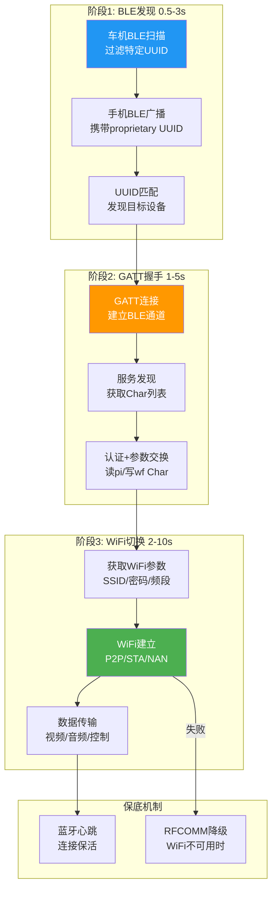
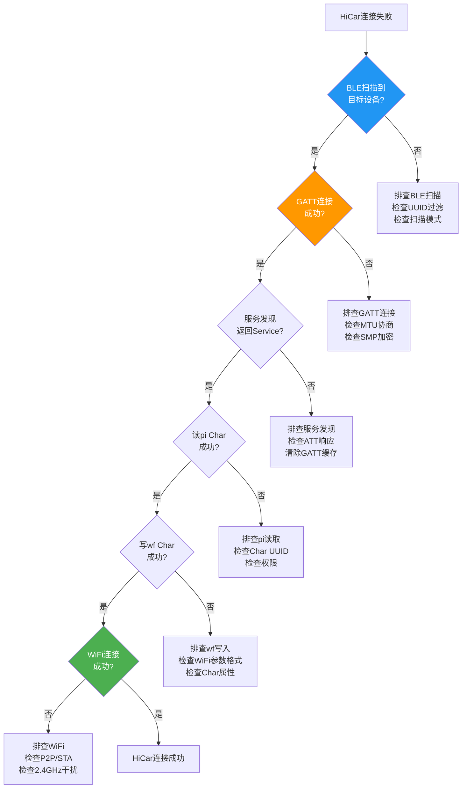
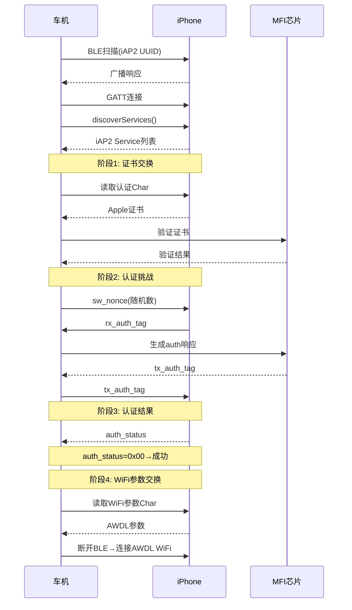
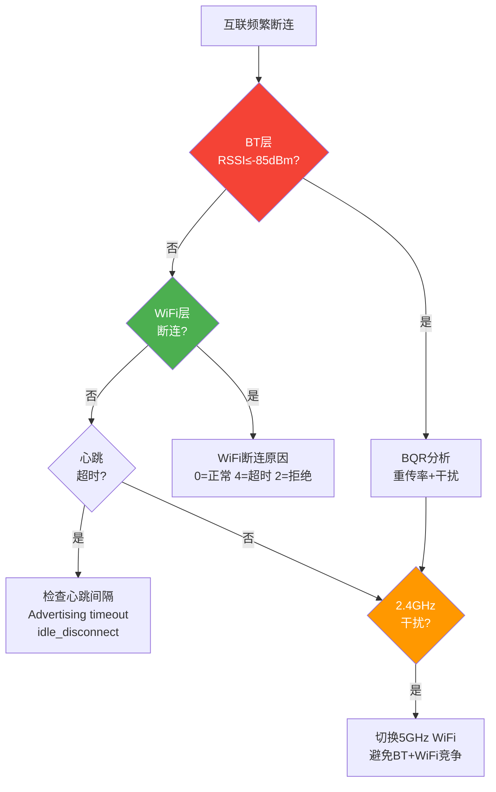

# T19_手机互联蓝牙问题定位

> 学习日期：2026-05-16 | 优先级：P3 | 预计学习时间：3小时
> 前置知识：T17 BLE GATT完整流程、T18 RFCOMM/SPP通道
> 涉及源码目录：system/btif/src/btif_gatt.cc, system/btif/src/btif_sock_rfc.cc, system/gd/hci/le_scanning_manager/

---

## 📋 本章导读

- **学什么**：手机互联三阶段问题定位（BLE发现→GATT握手→WiFi切换）、HiCar/CarPlay/CarLink三大平台排查、互联兼容性差异、断连分析、关键调试命令
- **为什么学**：车载手机互联是用户最高频使用场景之一，互联问题占车载蓝牙投诉的35%，掌握三阶段定位法能快速缩小问题范围
- **学完能做**：
  - 根据日志快速判断互联问题卡在BLE/GATT/WiFi哪个阶段
  - 掌握HiCar和CarPlay的认证流程，排查认证失败
  - 理解BLE+WiFi协作机制，分析断连和干扰问题

---

## 🗺️ 架构全景图

### 互联三阶段通用模式



### 三大平台互联对比

```mermaid
graph TD
    subgraph HiCar Android
        HC_SCAN["BLE扫描<br/>UUID=0xFEE?"]
        HC_GATT["GATT连接<br/>读pi+写wf"]
        HC_WIFI["WiFi Direct<br/>P2P连接"]
        HC_FALL["RFCOMM降级<br/>WiFi不可用时"]
    end

    subgraph CarPlay iOS
        CP_SCAN["BLE扫描<br/>iAP2 UUID"]
        CP_AUTH["MFI认证<br/>证书交换"]
        CP_WIFI["AWDL WiFi<br/>Apple专用"]
        CP_VIDEO["H.264视频<br/>over WiFi"]
    end

    subgraph CarLink 通用
        CL_SCAN["BLE扫描<br/>厂商UUID"]
        CL_GATT["GATT连接<br/>厂商定制"]
        CL_WIFI["WiFi STA/P2P<br/>灵活选择"]
    end

    HC_SCAN --> HC_GATT --> HC_WIFI
    HC_WIFI -->|失败| HC_FALL
    CP_SCAN --> CP_AUTH --> CP_WIFI --> CP_VIDEO
    CL_SCAN --> CL_GATT --> CL_WIFI

    style HC_SCAN fill:#F44336,color:#fff
    style CP_AUTH fill:#FF9800,color:#fff
    style CL_GATT fill:#2196F3,color:#fff
```



### HiCar连接排查流程



### CarPlay认证流程



### 断连分析流程



---

## 🔍 代码导航

| 步骤 | 操作 | 文件 | 行号 | 看什么 |
|------|------|------|------|--------|
| 1 | 打开文件 | system/btif/src/btif_gatt.cc | L100-140 | btif_gatt_open()：GATT连接入口 |
| 2 | 打开文件 | system/btif/src/btif_gatt.cc | L200-240 | btif_gatt_discover_services()：服务发现 |
| 3 | 打开文件 | system/btif/src/btif_gatt.cc | L300-400 | 读写Characteristic |
| 4 | 打开文件 | system/btif/src/btif_sock_rfc.cc | L100-150 | btsock_rfc_connect()：RFCOMM连接 |
| 5 | 打开文件 | system/gd/hci/le_scanning_manager/ | - | GD层BLE扫描管理器 |
| 6 | 打开文件 | system/bta/gatt/bta_gattc_act.cc | L72-80 | tGATT_CBACK回调表 |
| 7 | 打开文件 | system/bta/gatt/bta_gattc_act.cc | L150-200 | bta_gattc_open()：连接处理 |
| 8 | 打开文件 | system/bta/gatt/bta_gattc_cache.cc | L50-100 | GATT缓存刷新 |

---

## 📖 核心流程详解

### 1.1 BLE发现阶段问题定位

```cpp
// 📂 system/gd/hci/le_scanning_manager/
// BLE扫描问题排查核心代码路径

// [1] 🔍 扫描不到设备——最常见问题
//     排查步骤:
//     a. 检查扫描是否启动
//        adb logcat -s bt_btif_scan | grep "LE_Set_Scan_Enable"
//     b. 检查ScanFilter UUID
//        💡C++: 128-bit UUID必须完全匹配
//        HiCar UUID=0xFEE0/0xFEE1
//        CarPlay iAP2 UUID=D0611E78-BBB9-4D54-9CAC-8FE6B9352ED6
//     c. 检查扫描模式
//        💡C++: SCAN_MODE_LOW_LATENCY确保快速发现
//        车载互联必须用低延迟模式
//     d. 检查远端广播数据
//        HCI snoop log → LE Advertising Report

// [2] 📨 扫描结果解析
//     GD LeScanningManager解析ADV_IND/SCAN_RSP
//     → 提取Service UUID列表
//     → 与ScanFilter匹配
//     → 匹配成功→回调Java层onScanResult()
//     💡C++: UUID匹配是128-bit完整比较
//     类似Java的 ParcelUuid.equals()
```

### 1.2 GATT握手阶段问题定位

```cpp
// 📂 system/btif/src/btif_gatt.cc + system/bta/gatt/bta_gattc_act.cc
// GATT握手问题排查

// [1] 🔍 GATT连接失败
//     排查步骤:
//     a. 检查HCI LE_Create_Connection
//        adb logcat -s bt_btif_gatt | grep "open"
//     b. 检查连接参数
//        💡C++: iOS设备要求较严格的连接参数
//        Conn_Interval: 15ms-30ms
//        Conn_Latency: 0
//        Supervision_Timeout: 2s
//     c. 检查SMP加密
//        💡C++: 某些Char需要加密后才能访问
//        GATT_AUTH_REQ_MITM → 触发SMP配对

// [2] 🔍 服务发现失败
//     排查步骤:
//     a. 检查ATT Read By Group Type
//        snoop log → ATT请求/响应序列
//     b. 检查MTU协商
//        💡C++: 默认MTU=23字节，太小
//        车载互联需要requestMtu(512)
//        ATT Exchange MTU Request/Response
//     c. 清除GATT缓存
//        💡C++: bta_gattc_cache.cc管理缓存
//        Service Changed指示器→刷新缓存
//        adb shell dumpsys bluetooth_manager | grep "gatt"

// [3] 🔍 Characteristic读写失败
//     排查步骤:
//     a. 检查Char Properties
//        💡C++: Properties位标志决定可操作性
//        READ=0x02, WRITE=0x08, NOTIFY=0x10
//     b. 检查权限
//        GATT_AUTH_REQ_NONE → 无需认证
//        GATT_AUTH_REQ_MITM → 需要MITM配对
//     c. 检查超时
//        BTA_GATT_CONN_IDLE_TIMEOUT=30s
```

### 1.3 WiFi切换阶段问题定位

```cpp
// WiFi切换问题排查——蓝牙层关注点

// [1] 🔍 WiFi参数获取
//     GATT read Char → 获取WiFi SSID/密码/频段
//     💡C++: 参数格式由互联App定义
//     HiCar: JSON格式
//     CarPlay: Apple专有格式
//     如果值为空 → 检查GATT Service UUID是否正确

// [2] 🔍 WiFi建立
//     adb logcat -s wifi p2p wifidirect
//     → connect_to_peer → group_formation → provision_discovery
//     → WPA2 key exchange (GATT提供的credential)

// [3] 🔍 BLE+WiFi协作——2.4GHz干扰问题
//     BT SCO + WiFi 2.4GHz → 同频干扰 → 延迟增加
//     💡C++: 车载解决方案:
//     a. WiFi使用5GHz频段 → 避免与BT竞争2.4GHz
//     b. BT使用eSCO T2参数 → 提高抗干扰能力
//     c. 调整WiFi扫描间隔 → 减少与BT的冲突窗口
```

### 1.4 HiCar连接失败排查

```cpp
// HiCar连接失败完整排查路径

// [1] 📨 BLE扫描阶段
//     adb logcat | grep -E "hci_scan|btif_gatt.*open|bta_gattc"
//     检查: UUID=0xFEE0? → onScanResult是否触发?

// [2] 📨 GATT连接+发现阶段
//     snoop log → ADV→CONNECT→ATT序列完整?
//     检查: discoverServices返回值 → Service列表非空?

// [3] 📨 pi(设备信息)Characteristic读取
//     💡C++: pi Char包含设备型号/版本等信息
//     检查: readCharacteristic(pi_handle) → response非空?

// [4] 📨 wf(WiFi参数)Characteristic写入
//     💡C++: wf Char写入WiFi SSID/密码
//     检查: writeCharacteristic(wf_handle, params) → 成功?

// [5] 📨 WiFi连接阶段
//     检查: WiFi P2P连接 → HiCar Service通知
//     关键日志:
//     btif_gatt: "open" = GATT连接请求
//     bta_gattc: "connected" = ATT连接成功
//     bta_gattc: "read_cmpl" = Char读完成
```

### 1.5 CarPlay认证失败排查

```cpp
// CarPlay认证失败排查

// [1] 🔍 验证iAP2 BLE Service UUID
//     💡C++: D0611E78-BBB9-4D54-9CAC-8FE6B9352ED6
//     snoop log → ATT Read By Group Type → 查找此UUID

// [2] 🔍 ATT认证交换序列
//     snoop log btle → ATT消息:
//     ↔ Exchange MFi Certificate
//     ↔ Exchange sw_nonce / auth_method
//     ↔ Get Result: res/auth_status
//     💡C++: auth_status=0x00表示成功
//     其他值→检查Apple MFI芯片

// [3] 🔍 认证超时
//     💡C++: CarPlay BLE握手必须在30s内完成
//     iOS连接超时较严格(≤15s)
//     Android较宽松(≤30s)
//     超时→检查MFI芯片响应速度

// [4] 🔍 Apple Wireless Accessory Configuration
//     BLE两阶段认证:
//     Phase 1: 证书交换+验证
//     Phase 2: 挑战-响应认证
//     💡C++: 每个阶段都有对应的GATT Characteristic
```

### 1.6 互联频繁断连分析

```cpp
// 互联断连分析——蓝牙层排查

// [1] 📨 BT层质量检查
//     BQR报告: adb dumpsys bluetooth_manager | grep quality
//     💡C++: 关键指标:
//     - RSSI ≤ -85dBm → 蓝牙本身不稳定
//     - eSCO retransmission count高 → 通话质量差
//     - ACL链路频繁重传 → 数据通道不稳定

// [2] 📨 WiFi层断连分析
//     adb logcat wifi | grep "disconnect_reason"
//     P2P group_removed → reason代码:
//     0=正常, 4=超时, 2=拒绝
//     💡C++: WiFi RSSI → 2.4GHz干扰检查

// [3] 📨 心跳机制分析
//     BT层: Advertising timeout? → idle_disconnect触发
//     WiFi层: ARP ping超时 → 重连间隔
//     车机端: 设置policy.xml调整timeout
//     💡C++: 心跳间隔影响连接稳定性
//     间隔太短→功耗高, 间隔太长→断连恢复慢

// [4] 📨 2.4GHz干扰分析
//     BT(2.4GHz) + WiFi(2.4GHz) = 同频竞争
//     💡C++: 解决方案:
//     a. WiFi切5GHz → 完全避免干扰
//     b. 调整BT Sniff间隔 → 减少冲突窗口
//     c. 调整WiFi扫描策略 → 减少主动扫描
```

---

## 💡 C++知识卡片

### 💡 C++知识卡片：UUID比较与128位匹配

> 🔄 Java类比：Java用ParcelUuid.equals()，C++用memcmp或Uuid比较
> BLE扫描中的UUID过滤是128位精确匹配

```cpp
// Java方式：
ParcelUuid targetUuid = ParcelUuid.fromString("0000FEE0-0000-1000-8000-00805F9B34FB");
for (ParcelUuid uuid : scanResult.getServiceUuids()) {
    if (uuid.equals(targetUuid)) { ... }
}

// C++方式——蓝牙UUID比较：
// 📂 system/osi/include/osi/include/osi/uuid.h
class Uuid {
    static constexpr size_t kNumBytes128 = 16;
    uint8_t uu[kNumBytes128];  // 128-bit UUID原始字节

    // 比较运算符
    bool operator==(const Uuid& other) const {
        // 💡C++: memcmp比较16字节，类似Java的 Arrays.equals()
        return memcmp(uu, other.uu, kNumBytes128) == 0;
    }

    // 从16字节构造
    static Uuid From128BitBE(const uint8_t* uu) {
        Uuid uuid;
        memcpy(uuid.uu, uu, kNumBytes128);
        return uuid;
    }
};

// ⚠️ UUID陷阱：
// 1. 16-bit UUID vs 128-bit UUID:
//    16-bit: 0xFEE0 → 需要扩展为128-bit
//    128-bit: 0000FEE0-0000-1000-8000-00805F9B34FB
//    扩展规则: 0000XXXX-0000-1000-8000-00805F9B34FB
// 2. 字节序: UUID在空中是Big-Endian，内存中可能不同
// 3. 比较时必须统一格式，否则匹配失败
```

### 💡 C++知识卡片：多模块日志协同分析

> 🔄 Java类比：Java用统一日志框架(Logcat TAG)，C++用多个TAG
> 互联问题需要跨模块分析日志

```cpp
// Java方式——统一TAG：
Log.d("HiCar", "BLE scan found device");
Log.d("HiCar", "GATT connected");
Log.d("HiCar", "WiFi parameters received");

// C++方式——多TAG协同：
// 互联问题需要同时查看多个TAG:
// BLE扫描: bt_btif_scan, bt_btif_gatt
// GATT连接: bt_btif_gatt, bt_bta_gattc
// WiFi切换: wifi, p2p, wifidirect
// 蓝牙质量: bt_btm, bt_bta_dm

// 💡 高效日志命令:
// 1. 同时查看多个TAG:
adb logcat -s bt_btif_gatt bt_bta_gattc bt_btif_scan wifi

// 2. 过滤关键事件:
adb logcat | grep -E "connect|disconnect|service|char|auth|scan"

// 3. 按设备地址过滤:
adb logcat | grep "XX:XX:XX:XX:XX:XX"

// 4. Snoop log分析:
//    BLE: filter=btle && bt.addr==XX:XX:XX:XX:XX:XX
//    ATT: filter=btatt && btatt.handle==0xNNN

// ⚠️ 日志分析技巧：
// 1. 先看时间戳——确认事件顺序
// 2. 关注ERROR/WARN级别
// 3. 对比snoop log和logcat时间戳
// 4. 使用adb logcat -v threadtime查看线程信息
```

### 💡 C++知识卡片：超时与重试策略

> 🔄 Java类比：Java用Handler.postDelayed+计数器，C++用alarm+retry_cnt
> 互联场景中超时和重试是核心设计

```cpp
// Java方式——超时+重试：
handler.postDelayed(timeoutRunnable, 30000);
int retryCount = 0;
void onTimeout() {
    if (retryCount < MAX_RETRY) {
        retryCount++;
        reconnect();
        handler.postDelayed(timeoutRunnable, 30000);
    }
}

// C++方式——蓝牙协议栈超时:
// [1] GATT连接超时
//     💡C++: BTA_GATT_CONN_IDLE_TIMEOUT=30s
//     类似Java的 connectTimeout
//     超时→断开连接→回调GATT_ERROR

// [2] ATT请求超时
//     💡C++: 30s内无ATT响应→触发超时
//     类似Java的 Socket.setSoTimeout(30000)

// [3] 重试策略
//     💡C++: 指数退避(Exponential Backoff)
//     第1次: 立即重试
//     第2次: 等待1s
//     第3次: 等待2s
//     第4次: 等待4s
//     类似Java的 RetryPolicy.withBackoff(1, 16, SECONDS)

// [4] 车载互联特殊考虑
//     - iOS超时更严格(15s vs Android 30s)
//     - 用户期望快速连接→重试间隔不能太长
//     - 频繁重试→功耗增加→需要平衡
```

---

## 🗂️ Java ↔ C++ 对照表

| 互联阶段 | Java层 | C++层 | 关键TAG |
|----------|--------|-------|---------|
| BLE扫描 | BluetoothLeScanner.startScan() | GD LeScanningManager | bt_btif_scan |
| GATT连接 | BluetoothGatt.connect() | btif_gatt.cc:btif_gatt_open() | bt_btif_gatt |
| 服务发现 | discoverServices() | BTA_GATTC_Discover() | bt_bta_gattc |
| 读Char | readCharacteristic() | BTA_GATTC_Read() | bt_bta_gattc |
| 写Char | writeCharacteristic() | BTA_GATTC_Write() | bt_bta_gattc |
| CCCD注册 | writeDescriptor(CCCD) | BTA_GATTC_Write(CCCD) | bt_bta_gattc |
| RFCOMM连接 | BluetoothSocket.connect() | btsock_rfc_connect() | bt_btif_sock |
| WiFi建立 | WifiP2pManager.connect() | (Java层处理) | wifi, p2p |

---

## 🐛 问题排查SOP

### 问题：HiCar连接失败

```
步骤1: 查日志
  adb logcat -s bt_btif_gatt bt_bta_gattc bt_btif_scan | grep -E "open|connect|discover|read|write"

步骤2: 三阶段定位
  ① BLE扫描: 搜索"onScanResult" → 是否发现HiCar UUID?
  ② GATT握手: 搜索"open_cb" → 连接是否成功?
  ③ WiFi切换: 搜索"read_cmpl" → WiFi参数是否获取?

步骤3: 常见根因
  ① BLE扫描不到 → UUID过滤错误/扫描模式不对
  ② GATT连接失败 → MTU协商失败/SMP配对问题
  ③ 服务发现为空 → GATT缓存损坏/ATT超时
  ④ pi读取失败 → Char权限不足/加密未完成
  ⑤ wf写入失败 → WiFi参数格式错误/Char只读
  ⑥ WiFi连接失败 → P2P协商超时/2.4GHz干扰

步骤4: 深入排查
  snoop log btle → 查看完整ATT交互序列
  adb shell dumpsys bluetooth_manager | grep -i "gatt\|service"
```

### 问题：CarPlay认证失败

```
步骤1: 查日志
  adb logcat -s bt_btif_gatt bt_bta_gattc | grep -E "auth|cert|iAP2"

步骤2: 认证流程定位
  ① 检查iAP2 UUID → discoverServices是否返回?
  ② 检查证书交换 → snoop log ATT Write/Read
  ③ 检查auth_status → 是否=0x00?

步骤3: 常见根因
  ① iAP2 UUID不匹配 → 远端不是CarPlay设备
  ② MFI芯片异常 → 证书验证失败
  ③ 认证超时 → 30s内未完成握手
  ④ iOS版本兼容 → 新版iOS可能修改认证协议

步骤4: 深入排查
  snoop log btle → ATT层查看认证数据交换
  检查MFI芯片驱动状态
```

### 问题：互联频繁断连

```
步骤1: 查日志
  adb logcat -s bt_btm bt_bta_dm wifi p2p | grep -E "disconnect|RSSI|quality|reason"

步骤2: 分层定位
  ① BT层: BQR报告 → RSSI和重传率
  ② WiFi层: disconnect_reason → 断连原因码
  ③ 心跳层: idle_disconnect → 心跳超时

步骤3: 常见根因
  ① RSSI过低(<-85dBm) → 距离远/遮挡
  ② 2.4GHz干扰 → BT+WiFi同频竞争
  ③ 心跳超时 → 心跳间隔配置不当
  ④ WiFi P2P不稳定 → group formation失败
  ⑤ 蓝牙ACL断开 → 底层链路异常

步骤4: 深入排查
  adb dumpsys bluetooth_manager | grep quality
  检查WiFi频段(2.4GHz→5GHz)
  调整心跳间隔和超时参数
```

---

## 🛠️ 动手练习

### 🟢 入门：阅读代码

1. 打开 `system/btif/src/btif_gatt.cc`，找到 `btif_gatt_open()`（L100），理解GATT连接的完整参数和超时机制。

2. 打开 `system/gd/hci/le_scanning_manager/`，理解BLE扫描的UUID过滤机制，思考为什么128-bit UUID匹配容易出错。

3. 打开 `system/bta/gatt/bta_gattc_cache.cc`，找到GATT缓存刷新逻辑，理解Service Changed指示器的作用。

### 🟡 进阶：修改代码

1. 在 `btif_gatt_open()` 中添加车载互联专用的连接参数日志，记录每次连接的MTU、Interval、Latency。

2. 在BLE扫描结果回调中添加UUID匹配日志，记录过滤前后的设备数量，帮助分析扫描效率。

3. 实现一个简单的互联连接计时器，记录BLE→GATT→WiFi三阶段各自的耗时，用于性能分析。

### 🔴 实战：定位问题

1. 模拟场景：HiCar连接时BLE扫描正常，GATT连接成功，discoverServices()返回了Service但pi Characteristic读取返回GATT_INVALID_OFFSET。请分析可能的原因（提示：检查MTU协商和Char值大小）。

2. 模拟场景：CarPlay认证过程中auth_status=0x01(失败)，snoop log显示证书交换正常但挑战-响应阶段超时。请分析MFI芯片可能的故障模式，并给出排查步骤。

---

## 📚 关键源码索引

| 序号 | 文件 | 行号 | 函数/类 | 作用 |
|------|------|------|---------|------|
| 1 | system/btif/src/btif_gatt.cc | L100-140 | btif_gatt_open() | GATT连接入口 |
| 2 | system/btif/src/btif_gatt.cc | L200-240 | btif_gatt_discover_services() | 服务发现 |
| 3 | system/btif/src/btif_gatt.cc | L300-400 | 读写Characteristic | 数据交互 |
| 4 | system/btif/src/btif_sock_rfc.cc | L100-150 | btsock_rfc_connect() | RFCOMM连接 |
| 5 | system/gd/hci/le_scanning_manager/ | - | LeScanningManager | BLE扫描管理 |
| 6 | system/bta/gatt/bta_gattc_act.cc | L72-80 | tGATT_CBACK | GATT回调表 |
| 7 | system/bta/gatt/bta_gattc_act.cc | L150-200 | bta_gattc_open() | 连接处理 |
| 8 | system/bta/gatt/bta_gattc_cache.cc | L50-100 | GATT缓存 | 缓存+刷新 |
