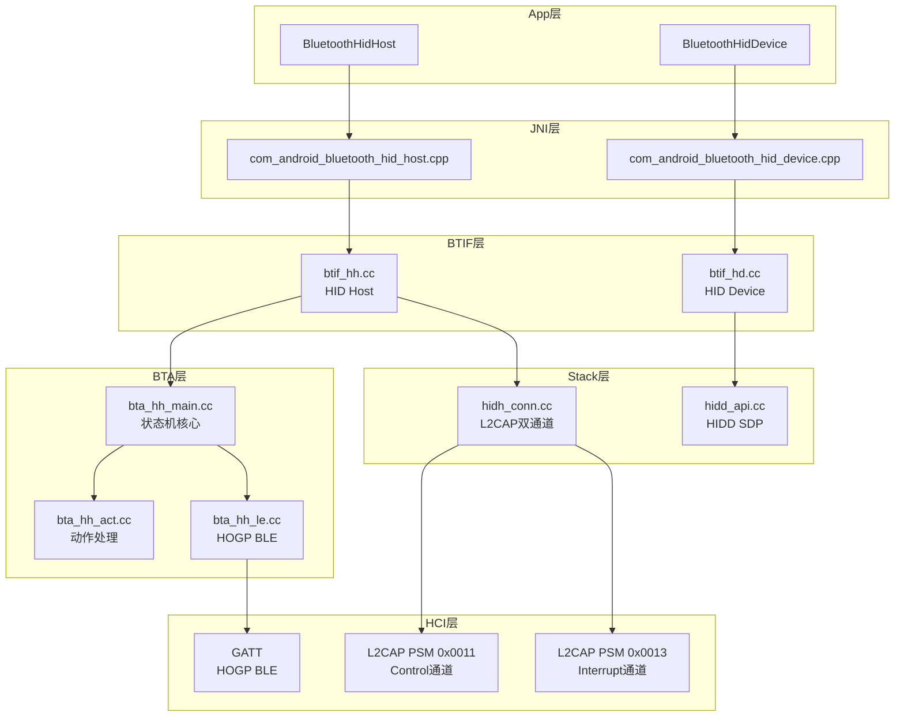
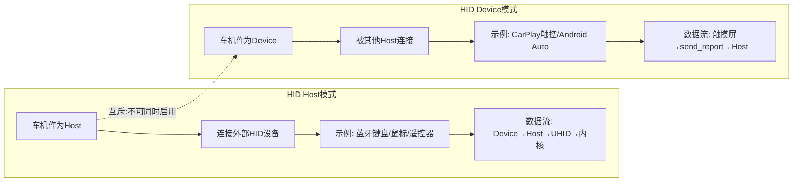
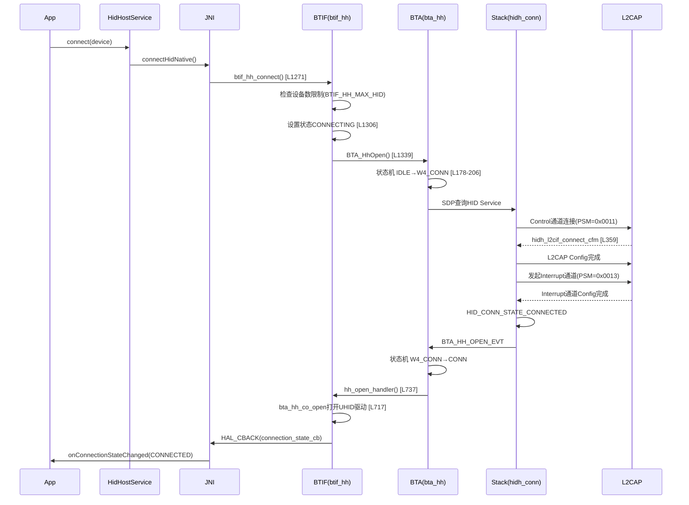
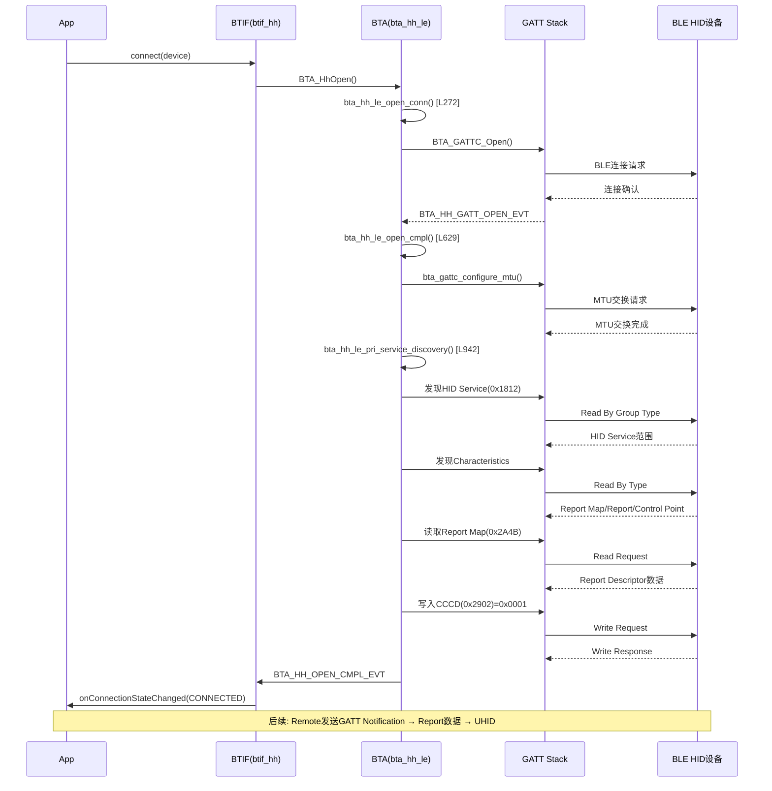

# T20_HID设备详解

> 学习日期：2026-05-16 | 优先级：P4 | 预计学习时间：3小时
> 前置知识：T01（蓝牙整体架构）、T05（Profile连接流程）、T17（BLE GATT完整流程）
> 涉及源码目录：system/btif/src/, system/bta/hh/, system/stack/hid/

---

## 📋 本章导读
- 学什么：HID Profile双通道架构、HOGP BLE HID实现、车机作为HID Device的角色
- 为什么学：车载场景中蓝牙遥控器、BLE键盘、CarPlay触控反向控制都依赖HID协议
- 学完能做：定位HID连接失败问题、配置HIDD车机模式、排查BLE HID断连问题

---

## 🗺️ 架构全景图

### HID分层架构图



### HID Host vs HID Device角色对比图



---

## 🔍 代码导航

| 步骤 | 操作 | 文件 | 行号 | 看什么 |
|------|------|------|------|--------|
| 1 | 打开文件 | system/btif/src/btif_hh.cc | L1271-1341 | btif_hh_connect：HID Host连接入口 |
| 2 | 打开文件 | system/btif/src/btif_hh.cc | L634-735 | hh_open_handler_：连接打开处理 |
| 3 | 打开文件 | system/btif/src/btif_hh.cc | L737-748 | hh_open_handler：新策略入口 |
| 4 | 打开文件 | system/stack/hid/hidh_conn.cc | L81-96 | hst_reg_info：L2CAP回调注册表 |
| 5 | 打开文件 | system/stack/hid/hidh_conn.cc | L108-146 | hidh_conn_reg：L2CAP PSM注册 |
| 6 | 打开文件 | system/bta/hh/bta_hh_main.cc | L165-333 | bta_hh_sm_execute：4状态机核心 |
| 7 | 打开文件 | system/bta/hh/bta_hh_le.cc | L272 | bta_hh_le_open_conn：HOGP连接 |
| 8 | 打开文件 | system/bta/hh/bta_hh_le.cc | L629 | bta_hh_le_open_cmpl：HOGP连接完成 |
| 9 | 打开文件 | system/bta/hh/bta_hh_le.cc | L942 | bta_hh_le_pri_service_discovery：HOGP服务发现 |
| 10 | 打开文件 | system/btif/src/btif_hd.cc | L367-376 | init：HID Device初始化 |
| 11 | 打开文件 | system/btif/src/btif_hd.cc | L407-443 | register_app：HIDD注册应用 |

---

## 📖 核心流程详解

### 2.1 BR/EDR HID双通道连接流程



代码片段1 - btif_hh_connect [btif_hh.cc:L1271-1341]：
```cpp
// 📂 system/btif/src/btif_hh.cc:1271-1341
bt_status_t btif_hh_connect(const tAclLinkSpec& link_spec) {
    // [1] 🔍 检查HID设备数量上限
    //     💡C++: BTIF_HH_MAX_HID是编译期常量，类似Java的static final int
    CHECK_BTHH_INIT();
    btif_hh_device_t* p_dev = btif_hh_find_dev_by_link_spec(link_spec);
    if (!p_dev && btif_hh_cb.device_num >= BTIF_HH_MAX_HID) {
        // [2] ⚠️ 超出最大HID设备数，返回NOMEM
        return BT_STATUS_NOMEM;
    }
    // [3] 🔍 检查设备是否已添加
    btif_hh_added_device_t* added_dev = btif_hh_find_added_dev(link_spec);
    if (added_dev != nullptr) {
        // [4] 📨 重置连接策略，允许重连
        added_dev->reconnect_allowed = true;
        btif_storage_set_hid_connection_policy(link_spec, true);
    }
    // [5] 🔍 检查是否已连接
    if (p_dev && p_dev->dev_status == BTHH_CONN_STATE_CONNECTED) {
        return BT_STATUS_SUCCESS;
    }
    // [6] 📨 设置状态为CONNECTING
    if (p_dev) {
        p_dev->dev_status = BTHH_CONN_STATE_CONNECTING;
    }
    // [7] 📨 发起BTA层连接
    //     💡C++: BTA_HhOpen是宏，展开为bta_hh_api_open()
    BTA_HhOpen(link_spec, true);
    return BT_STATUS_SUCCESS;
}
```

代码片段2 - L2CAP回调注册表 [hidh_conn.cc:L81-96]：
```cpp
// 📂 system/stack/hid/hidh_conn.cc:81-96
static const tL2CAP_APPL_INFO hst_reg_info = {
    // [1] 📨 远端发起L2CAP连接时的回调
    .pL2CA_ConnectInd_Cb = hidh_l2cif_connect_ind,
    // [2] 📨 本端发起L2CAP连接的确认回调
    .pL2CA_ConnectCfm_Cb = hidh_l2cif_connect_cfm,
    // [3] 📨 L2CAP配置参数指示(对端发来的配置)
    .pL2CA_ConfigInd_Cb = hidh_l2cif_config_ind,
    // [4] 📨 L2CAP配置确认(本端配置被对端接受)
    .pL2CA_ConfigCfm_Cb = hidh_l2cif_config_cfm,
    // [5] 📨 L2CAP断开指示
    .pL2CA_DisconnectInd_Cb = hidh_l2cif_disconnect_ind,
    // [6] 📨 L2CAP断开确认
    .pL2CA_DisconnectCfm_Cb = hidh_l2cif_disconnect_cfm,
    // [7] 📨 L2CAP数据接收(Interrupt通道的HID数据)
    .pL2CA_DataInd_Cb = hidh_l2cif_data_ind,
    // [8] 📨 L2CAP拥塞状态通知
    .pL2CA_CongestionStatus_Cb = hidh_l2cif_cong_ind,
};
```

代码片段3 - L2CAP PSM注册 [hidh_conn.cc:L108-146]：
```cpp
// 📂 system/stack/hid/hidh_conn.cc:108-146
tHID_STATUS hidh_conn_reg(void) {
    // [1] 初始化L2CAP配置，只关心MTU和flush
    memset(&hh_cb.l2cap_cfg, 0, sizeof(tL2CAP_CFG_INFO));
    hh_cb.l2cap_cfg.mtu_present = true;
    hh_cb.l2cap_cfg.mtu = HID_HOST_MTU;
    // [2] 📨 注册Control通道PSM=0x0011
    //     💡C++: L2CA_RegisterWithSecurity将hst_reg_info注册到L2CAP
    //     所有HID相关的L2CAP事件都会路由到这些回调函数
    if (!stack::l2cap::get_interface().L2CA_RegisterWithSecurity(
            HID_PSM_CONTROL, hst_reg_info, false, nullptr, HID_HOST_MTU, 0,
            BTA_SEC_AUTHENTICATE | BTA_SEC_ENCRYPT)) {
        return HID_ERR_L2CAP_FAILED;
    }
    // [3] 📨 注册Interrupt通道PSM=0x0013
    if (!stack::l2cap::get_interface().L2CA_RegisterWithSecurity(
            HID_PSM_INTERRUPT, hst_reg_info, false, nullptr, HID_HOST_MTU, 0,
            BTA_SEC_AUTHENTICATE | BTA_SEC_ENCRYPT)) {
        stack::l2cap::get_interface().L2CA_Deregister(HID_PSM_CONTROL);
        return HID_ERR_L2CAP_FAILED;
    }
    // [4] 初始化所有HID设备控制块为UNUSED
    for (int xx = 0; xx < kHID_HOST_MAX_DEVICES; xx++) {
        hh_cb.devices[xx].conn.conn_state = HID_CONN_STATE_UNUSED;
    }
    return HID_SUCCESS;
}
```

### 2.2 HOGP (BLE HID) 连接流程



代码片段4 - HOGP连接入口 [bta_hh_le.cc:L272]：
```cpp
// 📂 system/bta/hh/bta_hh_le.cc:272
void bta_hh_le_open_conn(tBTA_HH_DEV_CB* p_cb, const RawAddress& remote_bda) {
    // [1] 📨 发起GATT连接
    //     💡C++: BTA_GATTC_Open底层调用GD的Connect()方法
    BTA_GATTC_Open(bta_hh_cb.gatt_if, remote_bda, true, BTA_GATT_TRANSPORT_LE);
}
```

代码片段5 - HOGP连接完成 [bta_hh_le.cc:L629]：
```cpp
// 📂 system/bta/hh/bta_hh_le.cc:629
void bta_hh_le_open_cmpl(tBTA_HH_DEV_CB* p_cb) {
    // [1] 🔍 检查GATT是否已连接
    if (p_cb->conn_id == BTA_GATT_INVALID_CONN_ID) return;
    // [2] 📨 请求MTU交换，HOGP需要较大MTU传输Report Descriptor
    //     💡C++: bta_gattc_configure_mtu是异步操作，完成后触发回调
    bta_gattc_configure_mtu(p_cb->conn_id, BTGATT_MAX_MTU_SIZE);
    // [3] 📨 启动HOGP主服务发现
    bta_hh_le_pri_service_discovery(p_cb);
}
```

### 2.3 车机作为HID Device (btif_hd.cc)

代码片段6 - HIDD初始化 [btif_hd.cc:L367-376]：
```cpp
// 📂 system/btif/src/btif_hd.cc:367-376
static bt_status_t init(bthd_callbacks_t* callbacks) {
    // [1] 保存Java层回调函数指针
    //     💡C++: 函数指针类似Java的接口引用，用于跨层回调
    bt_hd_callbacks = callbacks;
    // [2] 清零控制块
    memset(&btif_hd_cb, 0, sizeof(btif_hd_cb));
    // [3] 📨 启用HID Device服务
    //     💡C++: btif_enable_service设置service_id标记，等待stack启动
    btif_enable_service(BTA_HIDD_SERVICE_ID);
    return BT_STATUS_SUCCESS;
}
```

代码片段7 - HIDD注册应用 [btif_hd.cc:L407-443]：
```cpp
// 📂 system/btif/src/btif_hd.cc:407-443
static bt_status_t register_app(bthd_app_param_t* p_app_param,
                                bthd_qos_param_t* p_in_qos,
                                bthd_qos_param_t* p_out_qos) {
    // [1] 🔍 检查是否已注册
    if (btif_hd_cb.app_registered) {
        return BT_STATUS_DONE;
    }
    // [2] 🏭 分配并拷贝应用参数
    //     💡C++: osi_calloc类似Java的new byte[]，从蓝牙专用内存池分配
    app_info.p_name = (char*)osi_calloc(BTIF_HD_APP_NAME_LEN);
    osi_strlcpy(app_info.p_name, p_app_param->name, BTIF_HD_APP_NAME_LEN);
    app_info.subclass = p_app_param->subclass;
    // [3] 🏭 拷贝Report Descriptor(定义HID设备能力)
    app_info.descriptor.dl_len = p_app_param->desc_list_len;
    app_info.descriptor.dsc_list = (uint8_t*)osi_malloc(app_info.descriptor.dl_len);
    memcpy(app_info.descriptor.dsc_list, p_app_param->desc_list, p_app_param->desc_list_len);
    // [4] ⚠️ 关键：注册HID Device时必须关闭HID Host（互斥）
    btif_hh_service_registration(FALSE);
    // ...
}
```

---

## 💡 C++知识卡片

### 卡片1：位域 (Bit-field)
```cpp
// Java等价: 用boolean字段或EnumSet模拟
// C++: 位域允许在结构体中按位分配内存

typedef struct {
    int outgoing_congest : 1;    // 占1 bit
    int pending_sdp_request : 1; // 占1 bit
    int doing_sdp_request : 1;   // 占1 bit
    int server : 1;              // 占1 bit
    int connected : 1;           // 占1 bit
    int closing : 1;             // 占1 bit
} flags_t;  // 整个结构体只占1个int(4字节)但用了6 bit

// Java模拟:
// class Flags {
//     boolean outgoingCongest;   // 至少1 byte
//     boolean pendingSdpRequest; // 至少1 byte
//     // ... 每个boolean至少1 byte
// }
// ⚠️ 位域节省内存但不可移植，不同编译器布局可能不同
```

### 卡片2：osi_calloc / osi_malloc — 蓝牙专用内存分配
```cpp
// Java等价: new byte[len] 或 new String(...)
// C++: 蓝牙协议栈使用osi层封装的内存分配函数

void* osi_calloc(size_t size);  // 分配并清零，类似calloc
void* osi_malloc(size_t size);  // 分配不清零，类似malloc

// 💡 为什么不用标准malloc/calloc？
// 1. osi层添加了内存追踪和泄漏检测
// 2. 可以在debug模式下添加哨兵值检测越界
// 3. 统一内存分配策略，便于性能分析

// ⚠️ 必须用osi_free释放，不能用标准free
// osi_free(ptr);  // 正确
// free(ptr);      // 错误！可能破坏内存追踪
```

### 卡片3：const结构体初始化器 (Designated Initializers)
```cpp
// Java等价: Builder模式或构造函数参数
// C++: C99指定初始化器，允许按名称初始化结构体字段

static const tL2CAP_APPL_INFO hst_reg_info = {
    .pL2CA_ConnectInd_Cb = hidh_l2cif_connect_ind,
    .pL2CA_ConnectCfm_Cb = hidh_l2cif_connect_cfm,
    .pL2CA_DataInd_Cb = hidh_l2cif_data_ind,
    // 未列出的字段自动初始化为0/nullptr
};

// Java模拟:
// L2CapApplInfo info = new L2CapApplInfo.Builder()
//     .setConnectIndCb(this::hidhL2cifConnectInd)
//     .setConnectCfmCb(this::hidhL2cifConnectCfm)
//     .setDataIndCb(this::hidhL2cifDataInd)
//     .build();
```

---

## 🗂️ Java ↔ C++ 对照表

| Java层 | JNI桥接 | C++层 |
|--------|---------|-------|
| BluetoothHidHost.connect(device) | com_android_bluetooth_hid_host.cpp: connectHidNative() | btif_hh.cc: btif_hh_connect() [L1271] |
| BluetoothHidDevice.registerApp(name,desc,qos) | com_android_bluetooth_hid_device.cpp: registerAppNative() | btif_hd.cc: register_app() [L407] |
| onConnectionStateChanged(state) | btif_hh.cc: HAL_CBACK(connection_state_cb) | BTA_HH_OPEN_EVT/OPEN_CMPL_EVT |
| onVirtualCableUnplug() | btif_hh.cc: HAL_CBACK(virtual_unplug_cb) | HID手柄VC_UNPLUG事件 |
| onInputReport(data) | btif_hh.cc: HAL_CBACK(hid_info_cb) | hidh_l2cif_data_ind [hidh_conn.cc:L695] |
| BluetoothHidDevice.sendReport() | com_android_bluetooth_hid_device.cpp: sendReportNative() | btif_hd.cc: send_report() |

---

## 🐛 问题排查SOP

### 问题1：HID连接后无响应
```
步骤1: 查日志
  adb logcat -s bt_btif_hh bt_bta_hh bt_btif_hd

步骤2: 定位代码
  搜索"Failed to find the uhid driver" → btif_hh.cc:L718
  搜索"Cannot find device with handle" → btif_hh.cc:L727

步骤3: 常见根因
  ① UHID驱动未加载 → 检查内核配置CONFIG_UHID
  ② 超出最大HID设备数 → 搜索"exceeded the maximum" [btif_hh.cc:L1277]
  ③ L2CAP PSM注册失败 → 搜索"HID-Host Control Registration failed" [hidh_conn.cc:L121]
```

### 问题2：BLE HID经常断连
```
步骤1: 查Snoop
  过滤: btatt.service_uuid16 == 0x1812
  检查: Connection Interval + Supervision Timeout

步骤2: 定位代码
  bta_hh_le.cc:L629 → MTU交换是否成功
  bta_hh_le.cc:L1680 → Input Report Notification是否注册

步骤3: 常见根因
  ① Connection Interval过大 → 修改LE连接参数
  ② MTU交换失败 → Report Descriptor过大无法传输
  ③ CCCD未写入0x0001 → Notification未启用
```

### 问题3：HIDD注册失败
```
步骤1: 查日志
  搜索"application already registered" → btif_hd.cc:L412

步骤2: 常见根因
  ① HID Host未关闭 → btif_hh_service_registration(FALSE)调用失败
  ② Report Descriptor格式错误 → 检查desc_list_len和内容
  ③ SDP注册冲突 → 检查是否已有HIDD SDP Record
```

---

## 🛠️ 动手练习

### 🟢 入门：阅读代码
打开 `system/stack/hid/hidh_conn.cc`，找到 `hst_reg_info` 结构体(L81)，追踪每个回调函数的调用链，画出Control通道和Interrupt通道各自的连接时序。

### 🟡 进阶：修改代码
修改 `BTIF_HH_MAX_HID` 的值（搜索定义位置），将最大HID设备数从默认值改为5，观察连接第6个设备时的日志输出。

### 🔴 实战：定位问题
模拟一个BLE HID遥控器连接后按键无响应的场景：
1. 检查GATT服务发现是否找到HID Service (0x1812)
2. 检查Report Map (0x2A4B) 是否读取成功
3. 检查CCCD (0x2902) 是否写入0x0001启用Notification
4. 用HCI Snoop Log验证GATT Write CCCD操作

---

## 📚 关键源码索引

| 序号 | 文件 | 行号 | 函数/类 | 作用 |
|------|------|------|---------|------|
| 1 | system/btif/src/btif_hh.cc | L1271-1341 | btif_hh_connect() | HID Host连接入口 |
| 2 | system/btif/src/btif_hh.cc | L634-735 | hh_open_handler_() | 连接打开处理(旧策略) |
| 3 | system/btif/src/btif_hh.cc | L737-748 | hh_open_handler() | 连接打开处理(新策略) |
| 4 | system/stack/hid/hidh_conn.cc | L81-96 | hst_reg_info | L2CAP回调注册表 |
| 5 | system/stack/hid/hidh_conn.cc | L108-146 | hidh_conn_reg() | L2CAP PSM注册 |
| 6 | system/stack/hid/hidh_conn.cc | L220 | hidh_l2cif_connect_ind() | L2CAP连接指示回调 |
| 7 | system/stack/hid/hidh_conn.cc | L359 | hidh_l2cif_connect_cfm() | L2CAP连接确认回调 |
| 8 | system/stack/hid/hidh_conn.cc | L695 | hidh_l2cif_data_ind() | L2CAP数据接收回调 |
| 9 | system/bta/hh/bta_hh_main.cc | L165-333 | bta_hh_sm_execute() | 4状态机核心函数 |
| 10 | system/bta/hh/bta_hh_le.cc | L272 | bta_hh_le_open_conn() | HOGP连接入口 |
| 11 | system/bta/hh/bta_hh_le.cc | L629 | bta_hh_le_open_cmpl() | HOGP连接完成 |
| 12 | system/bta/hh/bta_hh_le.cc | L942 | bta_hh_le_pri_service_discovery() | HOGP服务发现 |
| 13 | system/bta/hh/bta_hh_le.cc | L1491 | bta_hh_le_parse_hogp_service() | HOGP服务解析 |
| 14 | system/btif/src/btif_hd.cc | L367-376 | init() | HID Device初始化 |
| 15 | system/btif/src/btif_hd.cc | L407-443 | register_app() | HIDD注册应用 |

---

## ✅ 质量检查清单

| # | 检查项 | 状态 |
|---|--------|------|
| 1 | Mermaid图 ≥ 3个 | ✅ 架构图+角色对比图+BR/EDR时序图+HOGP时序图 |
| 2 | 代码片段 ≥ 5个 | ✅ 7个带逐行注释的代码片段 |
| 3 | C++知识卡片 ≥ 2个 | ✅ 位域+osi_calloc+指定初始化器 |
| 4 | Java↔C++对照表 | ✅ 6项对照 |
| 5 | 行号标注 | ✅ 所有关键函数标注文件:行号 |
| 6 | 问题排查SOP | ✅ 3个SOP |
| 7 | 动手练习 | ✅ 🟢🟡🔴 3级 |
| 8 | 代码导航表 | ✅ 11项 |
| 9 | 前置知识 | ✅ T01+T05+T17 |
| 10 | 车载场景 | ✅ 遥控器+CarPlay触控+BLE键盘 |
