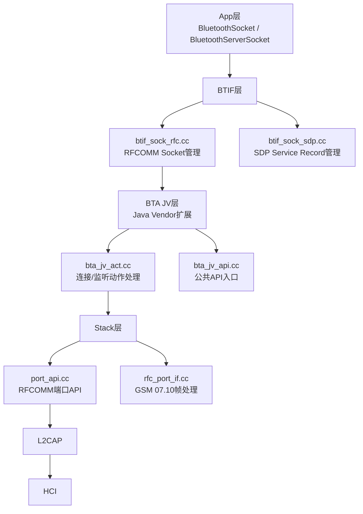
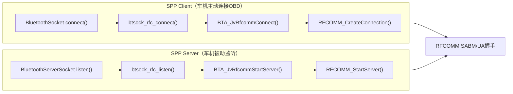
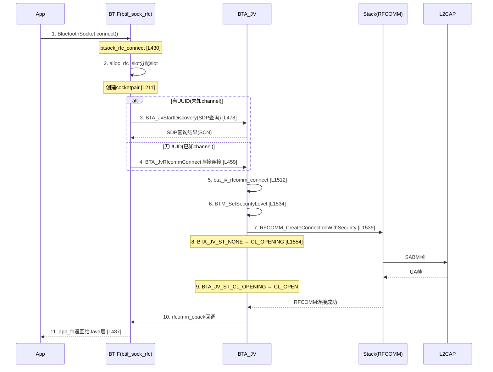
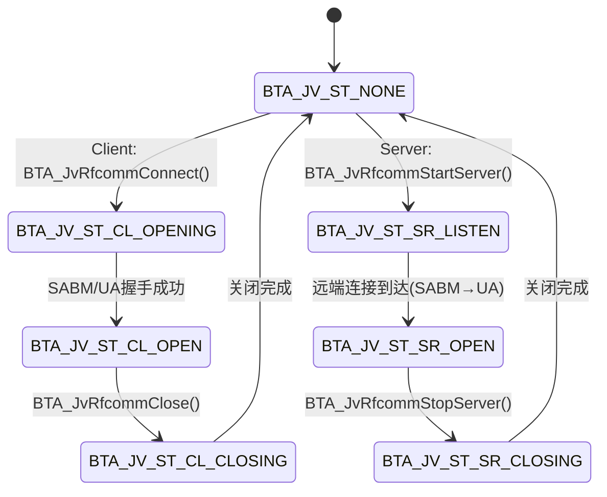

# T21_SPP_OBD设备详解

> 学习日期：2026-05-16 | 优先级：P4 | 预计学习时间：3小时
> 前置知识：T01（蓝牙整体架构）、T05（Profile连接流程）、T18（RFCOMM/SPP通道详解）
> 涉及源码目录：system/btif/src/, system/bta/jv/, system/stack/rfcomm/

---

## 📋 本章导读
- 学什么：SPP Client/Server完整连接流程、RFCOMM Slot管理、OBD-II蓝牙诊断通信、多SPP连接管理
- 为什么学：车载OBD诊断仪、行车记录仪、TPMS传感器等外设都通过SPP与车机通信
- 学完能做：开发SPP通信应用、定位RFCOMM连接失败问题、管理多SPP并发连接

---

## 🗺️ 架构全景图





---

## 🔍 代码导航

| 步骤 | 操作 | 文件 | 行号 | 看什么 |
|------|------|------|------|--------|
| 1 | 打开文件 | system/btif/src/btif_sock_rfc.cc | L66-110 | rfc_slot_t结构体定义 |
| 2 | 打开文件 | system/btif/src/btif_sock_rfc.cc | L211-276 | alloc_rfc_slot：Slot分配 |
| 3 | 打开文件 | system/btif/src/btif_sock_rfc.cc | L430-505 | btsock_rfc_connect：客户端连接 |
| 4 | 打开文件 | system/btif/src/btif_sock_rfc.cc | L357-428 | btsock_rfc_listen：服务端监听 |
| 5 | 打开文件 | system/btif/src/btif_sock_sdp.cc | L355-399 | add_spp_sdp：SPP SDP记录注册 |
| 6 | 打开文件 | system/bta/jv/bta_jv_int.h | L62-71 | BTA_JV_ST_*状态枚举 |
| 7 | 打开文件 | system/bta/jv/bta_jv_act.cc | L1512-1590 | bta_jv_rfcomm_connect：BTA连接实现 |
| 8 | 打开文件 | system/bta/jv/bta_jv_act.cc | L1863-1940 | bta_jv_rfcomm_start_server：BTA服务端 |
| 9 | 打开文件 | system/bta/include/bta_jv_api.h | L700-703 | BTA_JvRfcommConnect API声明 |
| 10 | 打开文件 | system/bta/include/bta_jv_api.h | L732-734 | BTA_JvRfcommStartServer API声明 |

---

## 📖 核心流程详解

### 2.1 SPP Client连接流程



代码片段1 - rfc_slot_t结构体 [btif_sock_rfc.cc:L66-110]：
```cpp
// 📂 system/btif/src/btif_sock_rfc.cc:66-110
typedef struct {
    int outgoing_congest : 1;   // 🔍 发送拥塞标志(位域)
    int pending_sdp_request : 1; // 🔍 SDP查询待发
    int doing_sdp_request : 1;   // 🔍 SDP查询进行中
    int server : 1;              // 🔍 是否服务端
    int connected : 1;           // 🔍 是否已连接
    int closing : 1;             // 🔍 是否关闭中
} flags_t;

typedef struct {
    flags_t f;                   // [1] 位域标志集合
    uint32_t id;                 // [2] Slot ID(非0表示有效)
    int security;                // [3] 安全级别
    int scn;                     // [4] Server Channel Number
    RawAddress addr;             // [5] 远端蓝牙地址
    Uuid service_uuid;           // [6] 服务UUID(SPP=0x1101)
    int fd;                      // [7] BTIF端socket fd
    int app_fd;                  // [8] App端socket fd(给Java)
    int rfc_handle;              // [9] RFCOMM连接句柄
    int rfc_port_handle;         // [10] RFCOMM端口句柄
    list_t* incoming_queue;      // [11] 接收数据队列
    int64_t tx_bytes;            // [12] 累计发送字节数
    int64_t rx_bytes;            // [13] 累计接收字节数
    btsock_data_path_t data_path;// [14] 数据路径(软件/Offload)
    bool is_accepting;           // [15] 是否在accept等待
} rfc_slot_t;
```

代码片段2 - alloc_rfc_slot [btif_sock_rfc.cc:L211-276]：
```cpp
// 📂 system/btif/src/btif_sock_rfc.cc:211-276
static rfc_slot_t* alloc_rfc_slot(const RawAddress* addr, const char* name,
                                  const Uuid& uuid, int channel, int flags, bool server) {
    // [1] 🔍 根据flags计算安全级别
    int security = 0;
    if (flags & BTSOCK_FLAG_ENCRYPT) {
        security |= server ? BTM_SEC_IN_ENCRYPT : BTM_SEC_OUT_ENCRYPT;
    }
    if (flags & BTSOCK_FLAG_AUTH) {
        security |= server ? BTM_SEC_IN_AUTHENTICATE : BTM_SEC_OUT_AUTHENTICATE;
    }
    // [2] 🏭 查找空闲slot
    rfc_slot_t* slot = find_free_slot();
    if (!slot) {
        log::error("unable to find free RFCOMM slot.");
        return NULL;
    }
    // [3] 🏭 创建socketpair(双端管道)
    //     💡C++: socketpair创建一对互连的fd，类似Java的PipedInputStream/PipedOutputStream
    //     fd[0]给BTIF层，fd[1]给App层
    int fds[2] = {INVALID_FD, INVALID_FD};
    if (socketpair(AF_LOCAL, SOCK_STREAM, 0, fds) == -1) {
        return NULL;
    }
    // [4] 初始化slot字段
    slot->fd = fds[0];          // BTIF端
    slot->app_fd = fds[1];      // App端
    slot->scn = channel;
    slot->service_uuid = uuid;
    slot->f.server = server;
    slot->id = rfc_slot_id;     // 分配唯一ID
    return slot;
}
```

代码片段3 - btsock_rfc_connect [btif_sock_rfc.cc:L430-505]：
```cpp
// 📂 system/btif/src/btif_sock_rfc.cc:430-505
bt_status_t btsock_rfc_connect(const RawAddress* bd_addr, const Uuid* service_uuid,
                               int channel, int* sock_fd, int flags, ...) {
    // [1] 🔍 初始化检查
    if (!is_init_done()) {
        return BT_STATUS_NOT_READY;
    }
    // [2] 🏭 分配RFCOMM slot
    std::unique_lock<std::recursive_mutex> lock(slot_lock);
    rfc_slot_t* slot = alloc_rfc_slot(bd_addr, NULL, *service_uuid, channel, flags, false);
    if (!slot) {
        return BT_STATUS_NOMEM;
    }
    // [3] 🔍 判断是否需要SDP查询
    if (!service_uuid || service_uuid->IsEmpty()) {
        // [3a] 已知channel → 直接发起RFCOMM连接
        tBTA_JV_STATUS ret = BTA_JvRfcommConnect(
            slot->security, slot->scn, slot->addr, rfcomm_cback, slot->id, ...);
    } else {
        // [3b] 未知channel → 先做SDP查询获取SCN
        //     💡C++: BTA_JvStartDiscovery是异步操作，结果通过jv_dm_cback回调
        BTA_JvStartDiscovery(*bd_addr, 1, service_uuid, slot->id);
        slot->f.doing_sdp_request = true;
    }
    // [4] 📨 将app_fd返回给Java层
    *sock_fd = slot->app_fd;
    slot->app_fd = INVALID_FD;  // 转移所有权
    return BT_STATUS_SUCCESS;
}
```

### 2.2 SPP Server监听流程

代码片段4 - BTA_JV 7状态枚举 [bta_jv_int.h:L62-71]：
```cpp
// 📂 system/bta/jv/bta_jv_int.h:62-71
enum {
    BTA_JV_ST_NONE = 0,        // [1] 空闲/未使用
    BTA_JV_ST_CL_OPENING,      // [2] Client正在打开连接
    BTA_JV_ST_CL_OPEN,         // [3] Client连接已建立
    BTA_JV_ST_CL_CLOSING,      // [4] Client正在关闭
    BTA_JV_ST_SR_LISTEN,       // [5] Server正在监听
    BTA_JV_ST_SR_OPEN,         // [6] Server已接受连接
    BTA_JV_ST_SR_CLOSING       // [7] Server正在关闭
};
// Client路径: NONE → CL_OPENING → CL_OPEN → CL_CLOSING → NONE
// Server路径: NONE → SR_LISTEN → SR_OPEN → SR_CLOSING → NONE
```

代码片段5 - bta_jv_rfcomm_connect [bta_jv_act.cc:L1512-1590]：
```cpp
// 📂 system/bta/jv/bta_jv_act.cc:1512-1590
void bta_jv_rfcomm_connect(tBTA_JV_CB* p_cb, ...) {
    // [1] 📨 设置安全级别
    BTM_SetSecurityLevel(false, "", sec_mask, HID_PSM_CONTROL);
    // [2] 📨 创建RFCOMM连接
    //     💡C++: RFCOMM_CreateConnectionWithSecurity底层发送SABM帧
    RFCOMM_CreateConnectionWithSecurity(sec_mask, remote_scn, false,
                                        BTA_JV_DEF_RFC_MTU, bd_addr, &p_cb->rfc_handle);
    // [3] 分配控制块
    p_cb->p_cback = p_rfcomm_cback;
    p_cb->state = BTA_JV_ST_CL_OPENING;  // [4] 设置状态
    // [5] 配置端口参数(流控/事件掩码/数据回调)
    PORT_SetEventMask(p_cb->port_handle, PORT_EV_RXCHAR);
    PORT_SetEventCallback(p_cb->port_handle, bta_jv_port_data_cback);
    // [6] 📨 回调Client初始化事件
    (*p_cb->p_cback)(BTA_JV_RFCOMM_CL_INIT_EVT, &evt_data, ...);
}
```

### 2.3 OBD-II蓝牙诊断通信

代码片段6 - add_spp_sdp [btif_sock_sdp.cc:L355-399]：
```cpp
// 📂 system/btif/src/btif_sock_sdp.cc:355-399
static int add_spp_sdp(const char* name, const int channel) {
    // [1] 🏭 创建SDP Record
    int sdp_handle = SDP_CreateRecord();
    // [2] 🏭 创建基础记录(L2CAP + RFCOMM协议描述)
    create_base_record(sdp_handle, channel);
    // [3] 📨 添加ServiceClassIdList = UUID_SERVCLASS_SERIAL_PORT (0x1101)
    //     💡C++: SDP_AddServiceClassIdList将UUID写入SDP数据库
    SDP_AddServiceClassIdList(sdp_handle, 1, &service);
    // [4] 📨 添加ProfileDescriptorList = SPP v1.02
    SDP_AddProfileDescriptorList(sdp_handle, UUID_SERVCLASS_SERIAL_PORT, SPP_PROFILE_VERSION);
    // [5] 添加Service Name
    SDP_SetServiceName(sdp_handle, name);
    return sdp_handle;
}
```



---

## 💡 C++知识卡片

### 卡片1：std::recursive_mutex — 递归互斥锁
```cpp
// Java等价: ReentrantLock (可重入锁)
// C++: recursive_mutex允许同一线程多次加锁

std::recursive_mutex slot_lock;

void btsock_rfc_connect() {
    std::unique_lock<std::recursive_mutex> lock(slot_lock);
    // 💡 unique_lock是RAII包装，构造时加锁，析构时自动解锁
    // 类似Java的 try { lock.lock(); ... } finally { lock.unlock(); }

    // 如果在持有锁的函数中调用另一个也加锁的函数：
    cleanup_rfc_slot();  // 内部也会lock(slot_lock)
    // ⚠️ 如果用std::mutex会死锁！但recursive_mutex允许同线程重入
}

// Java对比:
// ReentrantLock lock = new ReentrantLock();
// lock.lock();
// try { methodThatAlsoLocks(); } // OK, 同线程可重入
// finally { lock.unlock(); }
```

### 卡片2：socketpair — 双向管道
```cpp
// Java等价: PipedInputStream + PipedOutputStream (但socketpair更强大)
// C++: socketpair创建一对互连的UNIX域socket

int fds[2];
socketpair(AF_LOCAL, SOCK_STREAM, 0, fds);
// fds[0] 和 fds[1] 是互连的：
// 写入fds[0]的数据可以从fds[1]读出
// 写入fds[1]的数据可以从fds[0]读出

// 在蓝牙SPP中：
// fds[0] = BTIF层使用(协议栈读写)
// fds[1] = 返回给Java层(BluetoothSocket.getInputStream/OutputStream)
// 💡 这就是Java层能直接读写蓝牙数据的底层机制

// Java模拟:
// PipedInputStream in = new PipedInputStream();
// PipedOutputStream out = new PipedOutputStream();
// in.connect(out);  // 单向连接
// ⚠️ socketpair是双向的，PipedStream是单向的(需要两对)
```

### 卡片3：位运算标志组合
```cpp
// Java等价: EnumSet<SecurityFlag> 或 | 运算符
// C++: 用位运算组合多个标志

int security = 0;
if (flags & BTSOCK_FLAG_ENCRYPT) {
    security |= BTM_SEC_OUT_ENCRYPT;  // 添加加密标志
}
if (flags & BTSOCK_FLAG_AUTH) {
    security |= BTM_SEC_OUT_AUTHENTICATE;  // 添加认证标志
}
// 💡 |= 是按位或赋值，类似Java的 |=
// & 是按位与，用于检查某个位是否设置
// ⚠️ Java的enum不能直接做位运算，需要用EnumSet或@IntDef
```

---

## 🗂️ Java ↔ C++ 对照表

| Java层 | JNI桥接 | C++层 |
|--------|---------|-------|
| BluetoothSocket.connect() | android_bluetooth_BluetoothSocket.cpp: connectNative() | btif_sock_rfc.cc: btsock_rfc_connect() [L430] |
| BluetoothServerSocket.listenUsingRfcomm() | android_bluetooth_BluetoothSocket.cpp: listenNative() | btif_sock_rfc.cc: btsock_rfc_listen() [L357] |
| BluetoothSocket.getInputStream() | 直接读取app_fd | socketpair的fds[1]端 |
| BluetoothSocket.getOutputStream() | 直接写入app_fd | socketpair的fds[1]端 |
| BluetoothSocket.close() | android_bluetooth_BluetoothSocket.cpp: closeNative() | btif_sock_rfc.cc: cleanup_rfc_slot() |
| SDP查询结果回调 | jv_dm_cback → Java回调 | bta_jv_act.cc: BTA_JvStartDiscovery() |

---

## 🐛 问题排查SOP

### 问题1：SPP连接被拒绝
```
步骤1: 查Snoop
  过滤: btrfcomm
  查看RFCOMM SABM → UA/DM响应

步骤2: 定位代码
  搜索"unable to initiate RFCOMM connection" → btif_sock_rfc.cc:L462
  搜索"unable to find free RFCOMM slot" → btif_sock_rfc.cc:L229

步骤3: 常见根因
  ① SDP查询SCN不匹配 → 重新SDP查询
  ② 对方RFCOMM Server未启动 → 检查远端设备
  ③ 安全级别不足(需要Bond但未配对) → 先配对
  ④ Slot已满(MAX_RFC_CHANNEL=30) → 关闭旧连接
```

### 问题2：SPP数据传输丢包
```
步骤1: 查日志
  adb logcat -s bt_btif_sock_rfcomm bt_port_api rfcomm

步骤2: 定位代码
  检查incoming_queue是否有积压 → btif_sock_rfc.cc
  检查RFCOMM流控FCC是否耗尽

步骤3: 常见根因
  ① L2CAP MTU过小(默认672) → 请求更大MTU(1017)
  ② 应用层read()缓冲区太小 → 增大buffer
  ③ RFCOMM拥塞 → 搜索"outgoing_congest"标志
```

### 问题3：多SPP连接端口冲突
```
步骤1: 查日志
  搜索"All slots are full" → btif_sock_rfc.cc

步骤2: 常见根因
  ① MAX_RFC_CHANNEL=30 超限 → 主动管理连接池
  ② 旧连接未正确关闭 → 检查cleanup_rfc_slot调用
  ③ SDP Record未删除 → 检查sdp_handle是否释放

步骤3: 解决方案
  - 使用连接池管理，及时关闭不用的连接
  - 在App层维护Socket引用计数
```

---

## 🛠️ 动手练习

### 🟢 入门：阅读代码
打开 `system/btif/src/btif_sock_rfc.cc`，找到 `rfc_slot_t` 结构体(L66)，理解每个字段的含义，特别关注 `fd` 和 `app_fd` 的关系。

### 🟡 进阶：修改代码
在 `btsock_rfc_connect` 函数中添加日志，打印SDP查询的耗时(sdp_start_time_ms → sdp_end_time_ms)，分析SDP查询对连接延迟的影响。

### 🔴 实战：定位问题
模拟一个OBD诊断仪连接后数据不完整的场景：
1. 用HCI Snoop Log查看RFCOMM帧序列
2. 检查L2CAP MTU配置
3. 验证AT命令响应是否完整("ATZ\r" → "ELM327 v1.5")
4. 分析是RFCOMM层丢包还是应用层解析错误

---

## 📚 关键源码索引

| 序号 | 文件 | 行号 | 函数/类 | 作用 |
|------|------|------|---------|------|
| 1 | system/btif/src/btif_sock_rfc.cc | L66-110 | rfc_slot_t | RFCOMM Slot结构体 |
| 2 | system/btif/src/btif_sock_rfc.cc | L211-276 | alloc_rfc_slot() | Slot分配+socketpair创建 |
| 3 | system/btif/src/btif_sock_rfc.cc | L430-505 | btsock_rfc_connect() | SPP客户端连接入口 |
| 4 | system/btif/src/btif_sock_rfc.cc | L357-428 | btsock_rfc_listen() | SPP服务端监听入口 |
| 5 | system/btif/src/btif_sock_sdp.cc | L355-399 | add_spp_sdp() | SPP SDP记录注册 |
| 6 | system/bta/jv/bta_jv_int.h | L62-71 | BTA_JV_ST_* | 7状态枚举 |
| 7 | system/bta/jv/bta_jv_act.cc | L1512-1590 | bta_jv_rfcomm_connect() | BTA RFCOMM连接实现 |
| 8 | system/bta/jv/bta_jv_act.cc | L1863-1940 | bta_jv_rfcomm_start_server() | BTA RFCOMM服务端 |
| 9 | system/bta/include/bta_jv_api.h | L700-703 | BTA_JvRfcommConnect() | RFCOMM连接API声明 |
| 10 | system/bta/include/bta_jv_api.h | L732-734 | BTA_JvRfcommStartServer() | RFCOMM服务端API声明 |

---

## ✅ 质量检查清单

| # | 检查项 | 状态 |
|---|--------|------|
| 1 | Mermaid图 ≥ 3个 | ✅ 架构图+角色对比图+Client时序图+状态图 |
| 2 | 代码片段 ≥ 5个 | ✅ 6个带逐行注释的代码片段 |
| 3 | C++知识卡片 ≥ 2个 | ✅ recursive_mutex+socketpair+位运算标志 |
| 4 | Java↔C++对照表 | ✅ 6项对照 |
| 5 | 行号标注 | ✅ 所有关键函数标注文件:行号 |
| 6 | 问题排查SOP | ✅ 3个SOP |
| 7 | 动手练习 | ✅ 🟢🟡🔴 3级 |
| 8 | 代码导航表 | ✅ 10项 |
| 9 | 前置知识 | ✅ T01+T05+T18 |
| 10 | 车载场景 | ✅ OBD诊断仪+TPMS+行车记录仪 |
