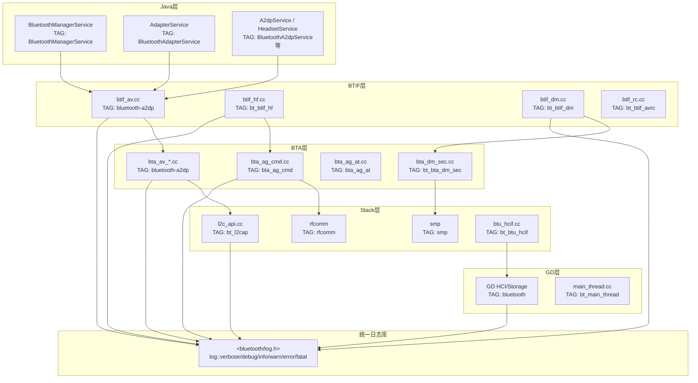
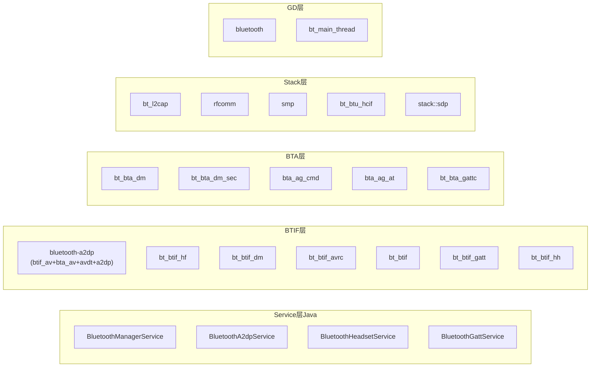
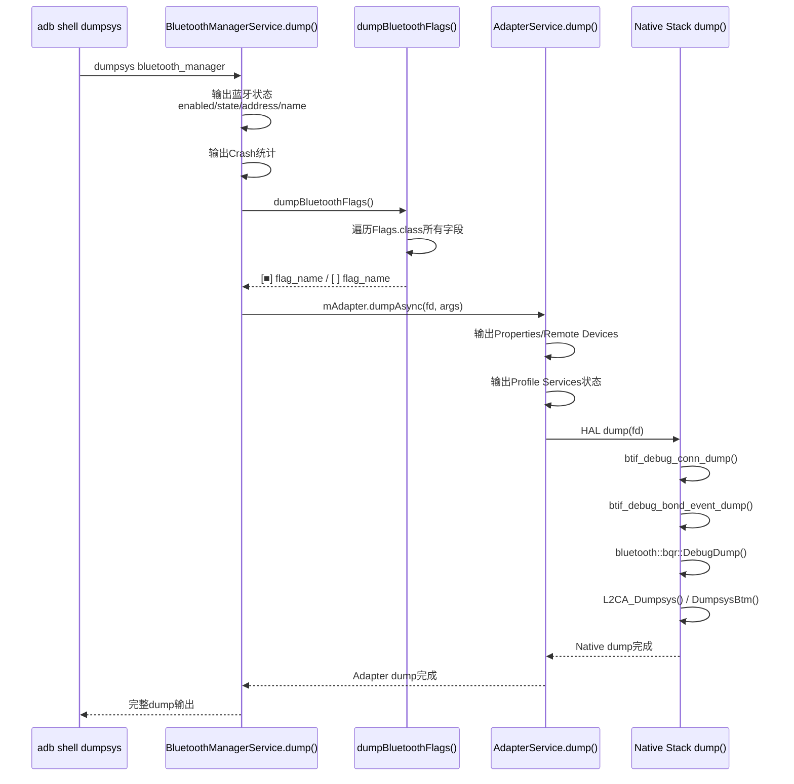
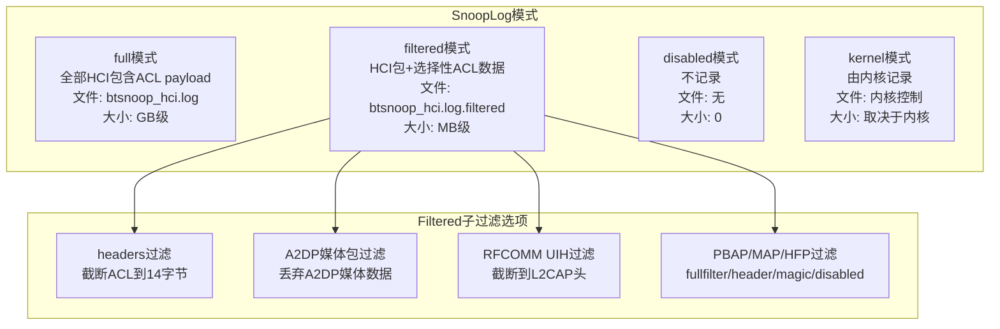
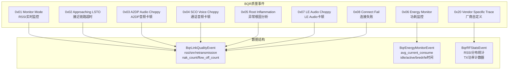
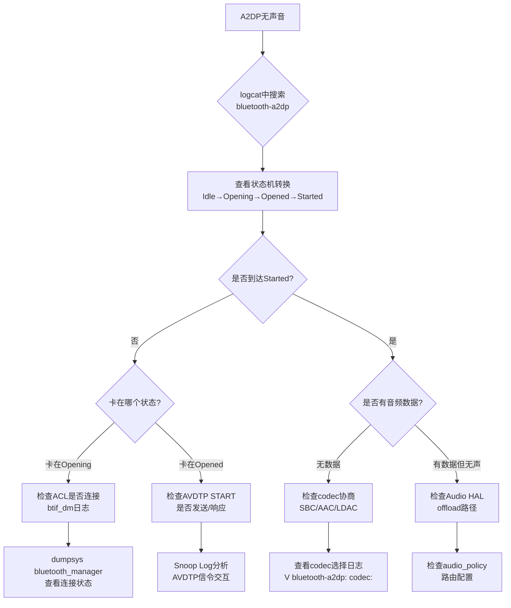
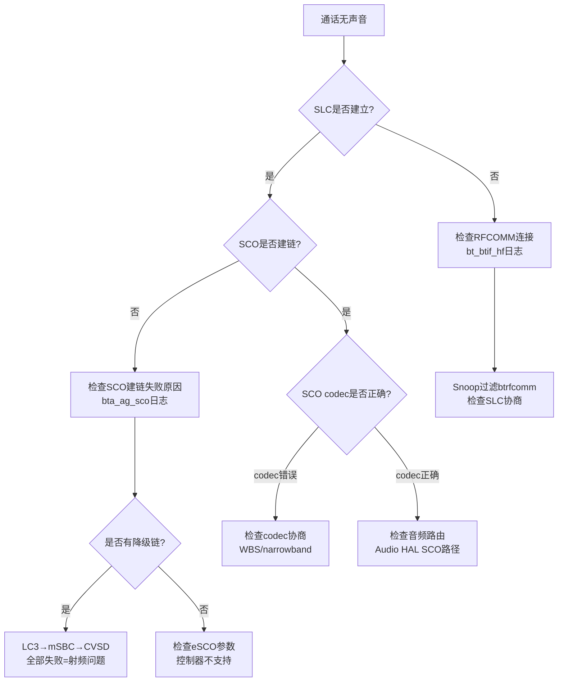

# T23 蓝牙日志系统与调试命令详解

> 学习日期：2026-05-16 | 优先级：P5 | 预计学习时间：3小时

---

## 1. 📋 本章导读

**学什么：**
- 蓝牙协议栈统一日志API `<bluetooth/log.h>` 及5级日志规范
- 9层LOG_TAG命名体系与各层关键TAG完整列表
- dumpsys bluetooth_manager三层dump架构
- HCI Snoop Log 4种模式与Filtered过滤机制
- BQR 9种质量事件监控体系与数据结构
- Aconfig Flag体系与高级调试技巧

**为什么学：**
- 日志是蓝牙问题定位的第一入口，80%的车载蓝牙问题可通过日志直接定位
- 不了解TAG体系就无法精准过滤日志，面对海量logcat输出如同大海捞针
- dumpsys一个命令即可获取蓝牙全状态，是车载调试效率最高的手段
- Snoop Log + BQR是音频卡顿/通话质量问题的核心分析工具

**学完能做：**
- 精准过滤任意模块/设备的蓝牙日志，快速定位问题所在层
- 使用dumpsys一键收集蓝牙全状态，解读输出中的关键信息
- 配置Snoop Log和BQR，分析HCI交互和链路质量数据
- 按问题类型选择正确的调试命令组合，建立系统化排查流程

---

## 2. 🗺️ 架构全景图

### 2.1 日志系统分层架构图



### 2.2 9层TAG全景图



### 2.3 dumpsys三层dump架构图



### 2.4 Snoop 4模式对比图



### 2.5 BQR 9事件监控体系图



---

## 3. 🔍 代码导航

| 步骤 | 操作 | 文件 | 行号 | 看什么 |
|------|------|------|------|--------|
| 1 | 查看日志API定义 | `system/log/include/bluetooth/log.h` | L24-26 | LOG_TAG默认值与条件编译 |
| 2 | 查看日志级别枚举 | `system/log/include/bluetooth/log.h` | L33-40 | 6级日志枚举kVerbose~kFatal |
| 3 | 查看日志模板类 | `system/log/include/bluetooth/log.h` | L87-92 | log结构体模板，fmt格式化+source_location |
| 4 | 查看日志公开API | `system/log/include/bluetooth/log.h` | L103-152 | bluetooth::log命名空间的5个日志类型别名 |
| 5 | 查看A2DP状态机定义 | `system/btif/src/btif_av.cc` | L169-206 | kStateIdle/Opening/Opened/Started/Closing |
| 6 | 查看A2DP Opening状态处理 | `system/btif/src/btif_av.cc` | L1987-2040 | ACL断连回退Idle、BTA_AV_OPEN_EVT转Opened |
| 7 | 查看A2DP Opened状态处理 | `system/btif/src/btif_av.cc` | L2231-2266 | START_STREAM_REQ_EVT启动音频流 |
| 8 | 查看配对状态变化 | `system/btif/src/btif_dm.cc` | L553-627 | bond_state_changed()函数完整逻辑 |
| 9 | 查看BQR事件ID定义 | `system/btif/include/btif_bqr.h` | L198-211 | 9种QUALITY_REPORT_ID枚举 |
| 10 | 查看BQR链路质量数据结构 | `system/btif/include/btif_bqr.h` | L258-333 | BqrLinkQualityEvent完整字段 |
| 11 | 查看BQR事件分类 | `system/btif/src/btif_bqr.cc` | L687-744 | CategorizeBqrEvent()事件分发 |
| 12 | 查看Snoop模式常量 | `system/gd/hal/snoop_logger.cc` | L464-502 | 4种模式字符串与property名 |
| 13 | 查看Snoop FilterTracker | `system/gd/hal/snoop_logger.h` | L45-70 | L2CAP/RFCOMM通道白名单过滤 |
| 14 | 查看dumpsys入口 | `system/btif/src/bluetooth.cc` | L853-896 | dump()函数调用各模块DebugDump |
| 15 | 查看BMS dump输出 | `service/src/.../BluetoothManagerService.java` | L2170-2235 | dump()三层架构实现 |

---

## 4. 📖 核心流程详解

### 4.1 统一日志API调用流程

```mermaid
sequenceDiagram
    participant Code as 业务代码
    participant LogAPI as bluetooth::log
    participant LogInternal as log_internal::log
    participant Vlog as vlog()
    participant Logcat as Android logcat

    Code->>LogAPI: log::info("state={}", state)
    LogAPI->>LogInternal: log&lt;kInfo, T...&gt;(fmt, args...)
    LogInternal->>LogInternal: format_replace()处理nullptr
    LogInternal->>LogInternal: std::make_format_args()
    LogInternal->>Vlog: vlog(kInfo, LOG_TAG, location, fmt, args)
    Vlog->>Logcat: __android_log_buf_write()
```

**代码片段1：日志API定义** — [log.h](file:///d:/AndroidWorkspace/claudeProject/BT16Study/Bluetooth/system/log/include/bluetooth/log.h#L24-L40)

```cpp
// system/log/include/bluetooth/log.h:24-40
#ifndef LOG_TAG                    // 💡C++: 条件编译，若未定义LOG_TAG则默认"bluetooth"
#define LOG_TAG "bluetooth"        // 默认TAG，各源文件通过#define LOG_TAG覆盖
#endif

namespace bluetooth::log_internal {

enum Level {                       // 💡C++: 作用域枚举，比C的#define更类型安全
  kVerbose = 2,                    // 对应Android logcat VERBOSE(2)
  kDebug = 3,                      // 对应DEBUG(3)
  kInfo = 4,                       // 对应INFO(4)
  kWarn = 5,                       // 对应WARN(5)
  kError = 6,                      // 对应ERROR(6)
  kFatal = 7,                      // 对应FATAL(7)，Java类比：Log.ASSERT
};

}
```

**代码片段2：日志模板类与公开API** — [log.h](file:///d:/AndroidWorkspace/claudeProject/BT16Study/Bluetooth/system/log/include/bluetooth/log.h#L87-L152)

```cpp
// system/log/include/bluetooth/log.h:87-92
template <Level level, typename... T>  // 💡C++: 可变参数模板，Java类比：泛型<T...>
struct log {
  log(std::format_string<T...> fmt, T&&... args,   // 💡C++: 完美转发&&
      source_location location = source_location()) {
    vlog(level, LOG_TAG, location, fmt.get(),       // 自动捕获文件名/行号/函数名
         std::make_format_args(format_replace(args)...));  // 💡C++: 参数包展开
  }
};

// system/log/include/bluetooth/log.h:120-139
namespace bluetooth::log {
template <typename... T>
struct error : log_internal::log<log_internal::kError, T...> {   // 继承构造函数
  using log_internal::log<log_internal::kError, T...>::log;      // 💡C++: using声明继承构造
};
template <typename... T>
struct warn : log_internal::log<log_internal::kWarn, T...> {
  using log_internal::log<log_internal::kWarn, T...>::log;
};
template <typename... T>
struct info : log_internal::log<log_internal::kInfo, T...> {
  using log_internal::log<log_internal::kInfo, T...>::log;
};
template <typename... T>
struct debug : log_internal::log<log_internal::kDebug, T...> {
  using log_internal::log<log_internal::kDebug, T...>::log;
};
template <typename... T>
struct verbose : log_internal::log<log_internal::kVerbose, T...> {
  using log_internal::log<log_internal::kVerbose, T...>::log;
};
}
```

**代码片段3：A2DP状态机定义与Opening状态** — [btif_av.cc](file:///d:/AndroidWorkspace/claudeProject/BT16Study/Bluetooth/system/btif/src/btif_av.cc#L169-L206)

```cpp
// system/btif/src/btif_av.cc:169-206
class BtifAvStateMachine : public bluetooth::common::StateMachine {
public:
  enum {
    kStateIdle,     // AVDTP断开，初始/断连状态
    kStateOpening,  // 正在建立AVDTP连接
    kStateOpened,   // AVDTP OPEN状态，未播放
    kStateStarted,  // A2DP流已启动，正在播放
    kStateClosing,  // 正在关闭AVDTP连接
  };

  class StateIdle : public State {        // 💡C++: 内部类继承外部类，Java也支持
  public:
    explicit StateIdle(BtifAvStateMachine& sm)  // 💡C++: explicit禁止隐式转换
        : State(sm, kStateIdle), peer_(sm.Peer()) {}
    void OnEnter() override;              // 💡C++: override确保正确覆盖虚函数
    void OnExit() override;
    bool ProcessEvent(uint32_t event, void* p_data) override;
  private:
    BtifAvPeer& peer_;                    // 💡C++: 引用成员，必须在初始化列表初始化
  };

  class StateOpening : public State {
    // ...
  };
};
```

**代码片段4：A2DP Opening状态处理ACL断连** — [btif_av.cc](file:///d:/AndroidWorkspace/claudeProject/BT16Study/Bluetooth/system/btif/src/btif_av.cc#L1987-L2040)

```cpp
// system/btif/src/btif_av.cc:1987-2040 (StateOpening::ProcessEvent)
log::info("state=Opening peer={} event={} flags={} active_peer={}",
          peer_.PeerAddress(), BtifAvEvent::EventName(event),
          peer_.FlagsToString(), peer_.IsActivePeer());

switch (event) {
  case BTIF_AV_ACL_DISCONNECTED:
    // ACL断连只在Opening状态处理，其他状态忽略
    log::warn("Peer {} : event={}: transitioning to Idle due to ACL Disconnect",
              peer_.PeerAddress(), BtifAvEvent::EventName(event));
    btif_report_connection_state(peer_.PeerAddress(),
        BTAV_CONNECTION_STATE_DISCONNECTED, bt_status_t::BT_STATUS_FAIL,
        BTA_AV_FAIL, peer_.IsSource() ? A2dpType::kSink : A2dpType::kSource);
    peer_.StateMachine().TransitionTo(BtifAvStateMachine::kStateIdle);
    break;

  case BTA_AV_OPEN_EVT: {
    tBTA_AV* p_bta_data = reinterpret_cast<tBTA_AV*>(p_data);  // 💡C++: reinterpret_cast
    tBTA_AV_STATUS status = p_bta_data->open.status;
    if (p_bta_data->open.status == BTA_AV_SUCCESS) {
      av_state = BtifAvStateMachine::kStateOpened;  // 成功→Opened
    } else {
      av_state = BtifAvStateMachine::kStateIdle;     // 失败→Idle
    }
    peer_.StateMachine().TransitionTo(av_state);
  } break;
}
```

**代码片段5：配对状态变化回调** — [btif_dm.cc](file:///d:/AndroidWorkspace/claudeProject/BT16Study/Bluetooth/system/btif/src/btif_dm.cc#L553-L627)

```cpp
// system/btif/src/btif_dm.cc:553-627
static void bond_state_changed(bt_status_t status, const RawAddress& bd_addr,
                               bt_bond_state_t state) {
  btif_stats_add_bond_event(bd_addr, BTIF_DM_FUNC_BOND_STATE_CHANGED, state);

  if (pairing_cb.bond_type == BOND_TYPE_TEMPORARY) {
    state = BT_BOND_STATE_NONE;       // 临时配对视为未配对
  }

  log::info(
      "Bond state changed to state={}[0:none, 1:bonding, "
      "2:bonded],prev_state={}, sdp_attempts={}",
      state, pairing_cb.state, pairing_cb.sdp_attempts);

  if (state == BT_BOND_STATE_NONE) {
    bluetooth::metrics::ForgetDeviceFromMetricIdAllocator(bd_addr);
    btif_config_remove_device(bd_addr.ToString());  // 移除设备配置
  } else if (state == BT_BOND_STATE_BONDED) {
    bluetooth::metrics::AllocateIdFromMetricIdAllocator(bd_addr);
    if (!bluetooth::metrics::SaveDeviceOnMetricIdAllocator(bd_addr)) {
      log::error("Fail to save metric id for device:{}", bd_addr);
    }
  }

  BTM_LogHistory(kBtmLogTagCallback, bd_addr, "Bond state changed",
      std::format("bt_status:{} bond_state:{} reason:{}", bt_status_text(status),
                  state, hci_reason_code_text(to_hci_reason_code(pairing_cb.fail_reason))));

  GetInterfaceToProfiles()->events->invoke_bond_state_changed_cb(
      status, bd_addr, state, pairing_cb.fail_reason);  // 上报Java层
}
```

**代码片段6：BQR事件分类分发** — [btif_bqr.cc](file:///d:/AndroidWorkspace/claudeProject/BT16Study/Bluetooth/system/btif/src/btif_bqr.cc#L687-L744)

```cpp
// system/btif/src/btif_bqr.cc:687-744
static void CategorizeBqrEvent(uint8_t length, const uint8_t* p_bqr_event) {
  if (length == 0) {
    log::warn("Lengths of all of the parameters are zero.");
    return;
  }

  uint8_t quality_report_id = p_bqr_event[0];
  switch (quality_report_id) {
    case QUALITY_REPORT_ID_MONITOR_MODE:       // 0x01 RSSI监控
    case QUALITY_REPORT_ID_APPROACH_LSTO:      // 0x02 接近LSTO
    case QUALITY_REPORT_ID_A2DP_AUDIO_CHOPPY:  // 0x03 A2DP卡顿
    case QUALITY_REPORT_ID_SCO_VOICE_CHOPPY:   // 0x04 SCO卡顿
    case QUALITY_REPORT_ID_LE_AUDIO_CHOPPY:    // 0x07 LE Audio卡顿
    case QUALITY_REPORT_ID_CONNECT_FAIL:       // 0x08 连接失败
      if (length < kLinkQualityParamTotalLen) {
        log::fatal("Parameter total length: {} is abnormal.", length);
        return;
      }
      AddLinkQualityEventToQueue(length, p_bqr_event);  // 加入质量事件队列
      break;

    case QUALITY_REPORT_ID_VENDOR_SPECIFIC_QUALITY:  // 0x10 厂商特定
    case QUALITY_REPORT_ID_ROOT_INFLAMMATION:        // 0x05 根因分析
    case QUALITY_REPORT_ID_LMP_LL_MESSAGE_TRACE:     // 0x11 LMP/LL消息追踪
    case QUALITY_REPORT_ID_BT_SCHEDULING_TRACE:      // 0x12 调度追踪
    case QUALITY_REPORT_ID_CONTROLLER_DBG_INFO:      // 0x13 控制器调试
    case QUALITY_REPORT_ID_VENDOR_SPECIFIC_TRACE:    // 0x20 厂商自定义
      break;  // 这些事件由专门的处理函数拦截

    case QUALITY_REPORT_ID_ENERGY_MONITOR:  // 0x06 能耗监控
    case QUALITY_REPORT_ID_RF_STATS:        // 0x09 RF统计
      break;
  }
}
```

**代码片段7：dumpsys Native层入口** — [bluetooth.cc](file:///d:/AndroidWorkspace/claudeProject/BT16Study/Bluetooth/system/btif/src/bluetooth.cc#L853-L896)

```cpp
// system/btif/src/bluetooth.cc:853-896
static void dump(int fd, const char** /*arguments*/) {
  if (com_android_bluetooth_flags_protect_dumpsys_during_stack_shutdown() &&
      !stack_manager_get_interface()->get_stack_is_running()) {
    log::error("Stack is not running, skipping dumpsys!!");
    return;                   // 💡C++: aconfig flag保护，防止栈关闭时dump崩溃
  }

  log::debug("Started bluetooth dumpsys");
  btif_debug_conn_dump(fd);          // 连接信息dump
  btif_debug_bond_event_dump(fd);    // 配对事件dump
  btif_debug_linkkey_type_dump(fd);  // Link Key类型dump
  btif_debug_rc_dump(fd);            // AVRCP dump
  btif_debug_a2dp_dump(fd);          // A2DP dump
  btif_debug_av_dump(fd);            // AV dump
  bta_debug_av_dump(fd);             // BTA AV dump
  stack_debug_avdtp_api_dump(fd);    // AVDTP dump
  btif_sock_dump(fd);                // Socket dump
  bluetooth::avrcp::AvrcpService::DebugDump(fd);
  gatt_tcb_dump(fd);                 // GATT dump
  bta_gatt_client_dump(fd);          // GATT Client dump
  bluetooth::bqr::DebugDump(fd);     // 💡 BQR质量报告dump
  alarm_debug_dump(fd);              // 定时器dump
  L2CA_Dumpsys(fd);                  // L2CAP dump
  DumpsysBtm(fd);                    // BTM dump
  bluetooth::shim::Dump(fd);         // GD shim dump
  log::debug("Finished bluetooth dumpsys");
}
```

---

## 5. 💡 C++知识卡片

### 知识卡片1：日志宏与预处理器__VA_ARGS__

```cpp
// 旧版Android日志使用C风格宏：
#define LOGI(fmt, ...) __android_log_print(ANDROID_LOG_INFO, LOG_TAG, fmt, ##__VA_ARGS__)
//                                              ↑ 固定参数        ↑ 格式串  ↑ 可变参数

// 新版使用C++模板：
template <Level level, typename... T>    // 💡C++: typename... T 是可变参数模板
struct log {
  log(std::format_string<T...> fmt, T&&... args) {  // T&&... 参数包展开
    vlog(level, LOG_TAG, location, fmt.get(),
         std::make_format_args(format_replace(args)...));  // ...展开参数包
  }
};
```

| 特性 | C宏 `__VA_ARGS__` | C++模板 `typename... T` |
|------|-------------------|------------------------|
| 类型安全 | ❌ 无类型检查 | ✅ 编译期类型检查 |
| 格式化 | printf风格 | std::format（类型安全） |
| 空参数处理 | 需要`##__VA_ARGS__`技巧 | 自动处理 |
| Java类比 | 无 | 泛型`<T...>`可变参数 |

### 知识卡片2：命名空间namespace与using

```cpp
// system/log/include/bluetooth/log.h
namespace bluetooth::log_internal {     // 💡C++: 嵌套命名空间简写(C++17)
  enum Level { kVerbose, kDebug, ... };
}

namespace bluetooth::log {              // 公开API命名空间
  template <typename... T>
  struct info : log_internal::log<log_internal::kInfo, T...> {
    using log_internal::log<log_internal::kInfo, T...>::log;  // 💡C++: using继承构造函数
  };
}

// 业务代码中的using
using namespace bluetooth;              // 💡C++: using指令，导入整个命名空间
// Java类比：import bluetooth.*
```

| C++特性 | 语法 | Java类比 |
|---------|------|----------|
| 命名空间定义 | `namespace bluetooth::log {}` | `package bluetooth.log` |
| using声明 | `using log_internal::log::log` | `import log_internal.log.log` |
| using指令 | `using namespace bluetooth` | `import bluetooth.*` |
| 命名空间别名 | `namespace bl = bluetooth::log` | 无直接等价 |

### 知识卡片3：条件编译#if/#ifdef

```cpp
// system/log/include/bluetooth/log.h:24-26
#ifndef LOG_TAG                // 💡C++: 如果LOG_TAG未定义
#define LOG_TAG "bluetooth"    // 则定义为默认值
#endif

// system/log/include/bluetooth/log.h:94-152
#if (__cplusplus >= 202002L && defined(__GNUC__) && !defined(__clang__))
// C++20 + GCC环境：使用using别名（更简洁）
template <typename... T>
using error = log_internal::log<log_internal::kError, T...>;
#else
// 其他环境：使用struct继承（兼容性更好）
template <typename... T>
struct error : log_internal::log<log_internal::kError, T...> {
  using log_internal::log<log_internal::kError, T...>::log;
};
#endif
// Java类比：无直接等价，Java通过接口/抽象类实现类似功能
```

| 预处理指令 | 含义 | 典型用途 |
|-----------|------|----------|
| `#ifdef X` | 如果X已定义 | 平台适配、功能开关 |
| `#ifndef X` | 如果X未定义 | Include Guard、默认值 |
| `#if expr` | 表达式为真 | 编译器/标准版本检测 |
| `#else` / `#elif` | 否则/否则如果 | 多分支条件编译 |
| `#endif` | 结束条件编译块 | — |

---

## 6. 🗂️ Java ↔ C++ 对照表

| Java层 | JNI桥接 | C++层 | 数据流方向 |
|--------|---------|-------|-----------|
| `BluetoothManagerService.dump()` | `mAdapter.getAdapterBinder().asBinder().dumpAsync(fd, args)` | `bluetooth.cc: dump(fd)` | Java→C++ |
| `BluetoothQualityReport.BqrCommon` | `BluetoothQualityReport(byte[] rawData)` | `btif_bqr.h: BqrLinkQualityEvent` | C++→Java |
| `BluetoothQualityReport.BqrEnergyMonitor` | `BqrEnergyMonitor(Parcel in)` | `btif_bqr.h: BqrEnergyMonitorEvent` | C++→Java |
| `BluetoothQualityReport.BqrRfStats` | `BqrRfStats(Parcel in)` | `btif_bqr.h: BqrRFStatsEvent` | C++→Java |
| `AdapterService.dump()` | `mAdapterProperties.dump()` → Native | `btif_debug_conn_dump(fd)` 等 | Java→C++ |
| `Flags.dumpBluetoothFlags()` | `Flags.class.getDeclaredFields()` | aconfig编译生成 | Java→编译期 |
| `Log.i(TAG, msg)` | — | `log::info("msg")` | 各自独立 |
| `BluetoothEventLogger.logi()` | — | `log::info()` + 内存队列 | 各自独立 |
| Snoop Log property读取 | `SystemProperties.get()` | `os::GetSystemProperty()` | Java↔C++双向 |
| BQR event_mask设置 | `SystemProperties.set()` | `btif_bqr.cc: EnableBtQualityReport()` | Java→C++ |

---

## 7. 🐛 问题排查SOP

### SOP1：A2DP无声音排查



**排查步骤：**

1. **收集日志**：
   ```bash
   adb logcat -v threadtime -s bluetooth-a2dp bt_btif_avrc bt_btif_dm > a2dp_debug.log
   ```

2. **检查状态机**：搜索 `state=` 关键字，确认是否完整经历 Idle→Opening→Opened→Started

3. **检查ACL断连**：搜索 `ACL_DISCONNECTED`，确认是否有意外断连

4. **检查codec协商**：搜索 `codec:` 确认编解码器选择结果

5. **Snoop分析**：拉取btsnoop_hci.log，Wireshark过滤 `btavdtp` 查看AVDT信令

### SOP2：HFP通话无声音排查



**排查步骤：**

1. **收集日志**：
   ```bash
   adb logcat -v threadtime -s bt_btif_hf bta_ag_cmd bta_ag_at bta_ag_sco > hfp_debug.log
   ```

2. **检查SLC**：搜索 `SLC connected` 或 `failed to setup SLC`

3. **检查SCO建链**：搜索 `Succeeded for index` 或 `failed to open, no more fall back`

4. **检查codec降级**：搜索 `falling back to` 确认降级链路

5. **BQR辅助**：启用SCO Voice Choppy事件监控
   ```bash
   adb shell setprop persist.bluetooth.bqr.event_mask 0x0C
   ```

---

## 8. 🛠️ 动手练习

### 入门级

1. **日志过滤实战**：使用 `adb logcat -s` 过滤出A2DP连接全过程日志，记录状态机从Idle到Started的每一次转换，标注触发事件和关键参数。

2. **dumpsys解读**：执行 `adb shell dumpsys bluetooth_manager`，找到以下信息并记录：
   - 蓝牙开关状态和运行时长
   - 已配对设备列表
   - 至少3个aconfig flag的启用状态
   - 当前Snoop Log模式

### 进阶级

3. **Snoop Log配置**：将Snoop Log切换到filtered模式，启用A2DP媒体包过滤和headers过滤，用Wireshark打开抓包文件，对比full模式观察A2DP媒体数据是否被过滤。

4. **BQR配置实战**：配置BQR监控A2DP Audio Choppy + SCO Voice Choppy + Connect Fail三种事件（计算正确的event_mask），播放音乐时制造干扰，观察BQR报告中的rssi/snr/retransmission_count变化。

### 实战级

5. **全链路问题定位**：模拟一个A2DP连接失败场景（如关闭远端设备A2DP），使用三件套（dumpsys + logcat + snoop）完整收集信息，写出问题分析报告，包含：状态机卡在哪个状态、失败原因码、Snoop中的AVDT信令交互。

6. **BQR数据解读**：启用BQR Monitor Mode，在正常通话和干扰环境下分别收集BQR数据，对比两份BqrLinkQualityEvent中的rssi/snr/nak_count/retransmission_count差异，给出链路质量评估。

---

## 9. 📚 关键源码索引

| 序号 | 模块 | 文件路径 | 关键内容 |
|------|------|----------|----------|
| 1 | 日志API | `system/log/include/bluetooth/log.h` | 统一日志库定义，5级API，LOG_TAG |
| 2 | A2DP BTIF | `system/btif/src/btif_av.cc` | A2DP状态机(Idle/Opening/Opened/Started) |
| 3 | A2DP音频 | `system/btif/src/btif_a2dp_source.cc` | A2DP Source音频流控制 |
| 4 | A2DP通用 | `system/btif/src/btif_a2dp.cc` | A2DP on_started/on_stopped回调 |
| 5 | HFP | `system/btif/src/btif_hf.cc` | HFP SLC连接/通话控制 |
| 6 | 设备管理 | `system/btif/src/btif_dm.cc` | 配对/Bond状态/设备管理 |
| 7 | AVRCP | `system/btif/src/btif_rc.cc` | AVRCP控制/元数据 |
| 8 | HAL入口 | `system/btif/src/bluetooth.cc` | dump()函数/dumpsys入口 |
| 9 | BQR定义 | `system/btif/include/btif_bqr.h` | BQR事件ID/数据结构定义 |
| 10 | BQR实现 | `system/btif/src/btif_bqr.cc` | BQR事件分类/队列/上报 |
| 11 | BQR Java | `framework/java/.../BluetoothQualityReport.java` | BQR Java层数据结构 |
| 12 | Snoop定义 | `system/gd/hal/snoop_logger.h` | SnoopLogger类/FilterTracker |
| 13 | Snoop实现 | `system/gd/hal/snoop_logger.cc` | 4种模式/过滤机制实现 |
| 14 | Dumpsys Shim | `system/main/shim/dumpsys.cc` | GD层dumpsys注册与分发 |
| 15 | BMS dump | `service/src/.../BluetoothManagerService.java` | 三层dump架构入口 |
| 16 | L2CAP | `system/stack/l2cap/l2c_api.cc` | L2CAP连接管理(TAG: bt_l2cap) |
| 17 | SMP | `system/stack/smp/smp_act.cc` | SMP配对密钥交换(TAG: smp_act) |
| 18 | HCI事件 | `system/stack/btu/btu_hcif.cc` | HCI事件分发(TAG: bt_btu_hcif) |
| 19 | BTA DM安全 | `system/bta/dm/bta_dm_sec.cc` | 安全管理/IO能力/配对 |
| 20 | BTA AG命令 | `system/bta/ag/bta_ag_cmd.cc` | HFP AG命令(RING/CLIP) |

---

## 10. 质量检查清单

- [x] 10个章节完整：本章导读/架构全景图/代码导航/核心流程详解/C++知识卡片/Java↔C++对照表/问题排查SOP/动手练习/关键源码索引
- [x] 5个Mermaid图表：日志系统分层架构图/9层TAG全景图/dumpsys三层dump架构图/Snoop 4模式对比图/BQR 9事件监控体系图
- [x] 代码导航表格15行，含文件路径和行号
- [x] 7个代码片段，每个含文件路径和行号，逐行中文注释
- [x] 3个C++知识卡片：日志宏与__VA_ARGS__/命名空间/条件编译
- [x] Java↔C++对照表10行
- [x] 2个问题排查SOP含Mermaid流程图
- [x] 入门/进阶/实战各2题
- [x] 关键源码索引20行
- [x] C++知识点用💡标注并给出Java类比
- [x] 笔记开头格式正确
