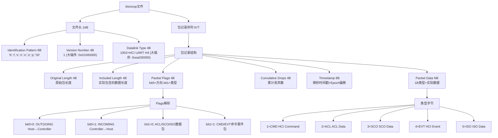
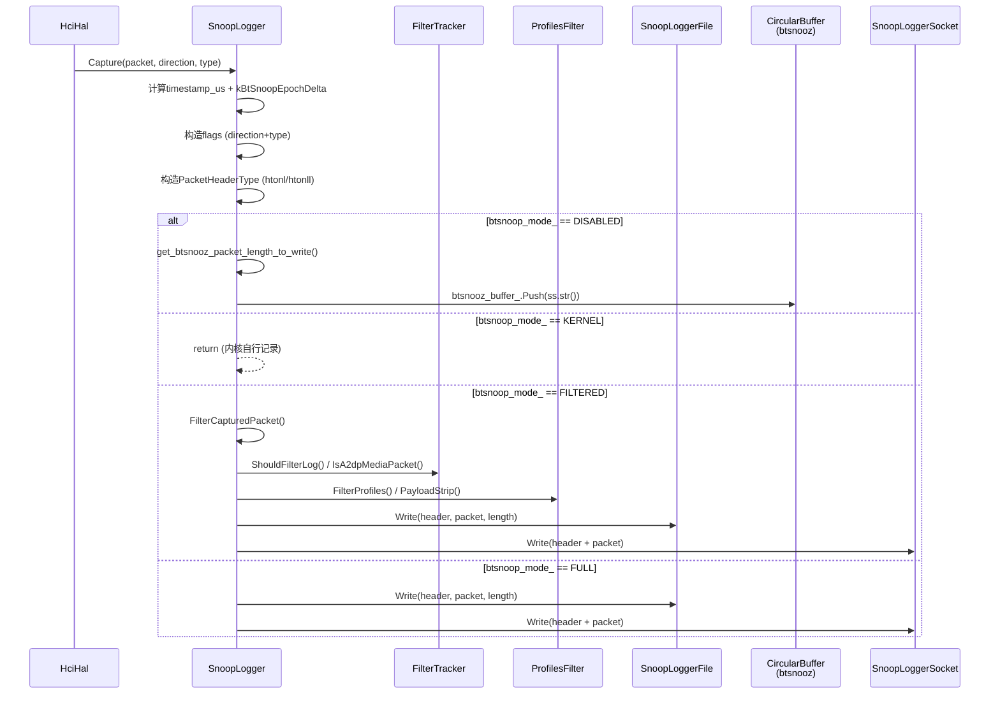
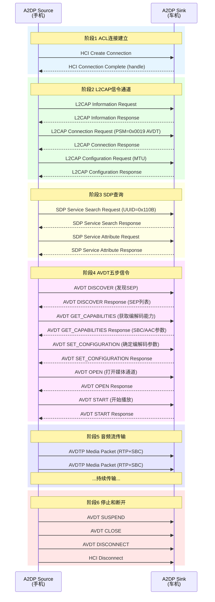
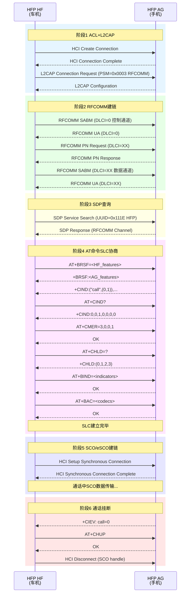
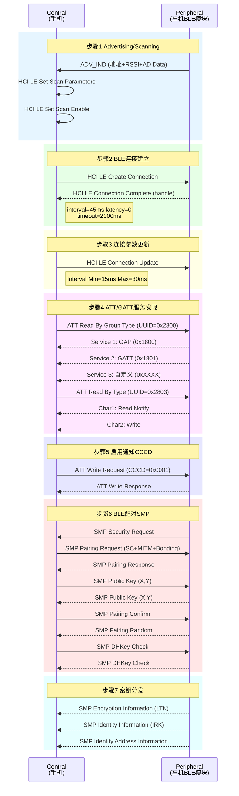

# T24 HCI Snoop Log分析实战

> 学习日期：2026-05-16 | 优先级：P5 | 预计学习时间：3小时

---

## 1. 📋 本章导读

### 学什么
- btsnoop二进制文件格式（文件头 + 包记录结构）
- Snoop四种记录模式（full/filtered/disabled/kernel）及Filtered过滤机制
- Wireshark蓝牙显示过滤器体系（协议层 + HCI层 + 组合过滤器）
- A2DP/HFP/BLE三大场景的完整HCI消息序列分析
- 车载实战问题定位方法（A2DP无声音、HFP通话异常、配对失败）

### 为什么学
- Snoop Log是蓝牙问题定位的**第一手证据**，90%以上的蓝牙连接/音频/通话问题可通过Snoop定位
- 车载蓝牙开发中，A2DP断音、HFP通话杂音、BLE配对失败是高频问题
- 理解Snoop过滤机制才能在正式量产设备上安全抓取日志（避免隐私泄露和存储溢出）

### 学完能做
- 根据问题类型选择合适的Snoop模式和Wireshark过滤器
- 独立分析A2DP/HFP/BLE连接过程的HCI消息序列，定位协议层故障
- 理解Filtered模式的FilterTracker过滤机制，配置量产设备的日志策略

---

## 2. 🗺️ 架构全景图

### 2.1 btsnoop文件格式结构图



### 2.2 Snoop记录流程时序图



### 2.3 A2DP AVDT六阶段协议序列图



### 2.4 HFP RFCOMM+AT+SCO完整序列图



### 2.5 BLE 7步连接序列图



---

## 3. 🔍 代码导航

| 步骤 | 操作 | 文件 | 行号 | 看什么 |
|------|------|------|------|--------|
| 1 | 文件头定义 | 📂 system/gd/hal/snoop_logger_common.h | L34-L43 | FileHeaderType结构体：identification_pattern[8]+version+datalink |
| 2 | 包记录头定义 | 📂 system/gd/hal/snoop_logger_file.h | L38-L45 | PacketHeaderType结构体：length_original+length_captured+flags+dropped+timestamp+type |
| 3 | 字节序检测 | 📂 system/gd/hal/snoop_logger_common.h | L22-L26 | isLittleEndian/isBigEndian编译期检测 |
| 4 | 大端序转换 | 📂 system/gd/hal/snoop_logger_common.h | L28-L30 | BTSNOOP_VERSION_NUMBER/BTSNOOP_DATALINK_TYPE条件编译 |
| 5 | 包类型枚举 | 📂 system/gd/hal/snoop_logger.h | L209-L215 | PacketType: CMD=1, ACL=2, SCO=3, EVT=4, ISO=5 |
| 6 | 方向枚举 | 📂 system/gd/hal/snoop_logger.h | L217-L220 | Direction: INCOMING, OUTGOING |
| 7 | FilterTracker类 | 📂 system/gd/hal/snoop_logger.h | L45-L70 | l2c_local_cid/l2c_remote_cid/rfcomm_channels白名单 |
| 8 | 过滤属性定义 | 📂 system/gd/hal/snoop_logger.cc | L466-L486 | 6个persist.bluetooth.snooplogfilter属性 |
| 9 | Snoop模式常量 | 📂 system/gd/hal/snoop_logger.cc | L490-L493 | kBtSnoopLogModeKernel/Disabled/Filtered/Full |
| 10 | Capture主流程 | 📂 system/gd/hal/snoop_logger.cc | L1167-L1244 | 构造header→过滤→写文件→写socket |
| 11 | FilterCapturedPacket | 📂 system/gd/hal/snoop_logger.cc | L1124-L1165 | A2DP/Header/Profile/RFCOMM四级过滤链 |
| 12 | ShouldFilterLog | 📂 system/gd/hal/snoop_logger.cc | L648-L669 | RFCOMM通道过滤判断逻辑 |
| 13 | SnoopLoggerFile::Write | 📂 system/gd/hal/snoop_logger_file.cc | L114-L136 | 写header+payload+flush到文件 |
| 14 | btsnooz格式头 | 📂 system/btif/include/btif_debug_btsnoop.h | L27-L38 | btsnooz_preamble_t/btsnooz_header_t压缩格式 |
| 15 | CircularBuffer | 📂 system/gd/common/circular_buffer.h | L30-L50 | btsnooz环形缓冲区Push/Pull/Drain |

---

## 4. 📖 核心流程详解

### 4.1 文件头构造与字节序处理

📂 system/gd/hal/snoop_logger_common.h L22-L43

```cpp
constexpr uint32_t kBytesToTest = 0x12345678;
constexpr uint8_t kFirstByte = (const uint8_t&)kBytesToTest;
constexpr bool isLittleEndian = kFirstByte == 0x78;
constexpr bool isBigEndian = kFirstByte == 0x12;
static_assert((isLittleEndian || isBigEndian) && (isLittleEndian != isBigEndian));
// 💡C++: constexpr编译期求值，static_assert编译期断言，Java无此机制

constexpr uint32_t BTSNOOP_VERSION_NUMBER = isLittleEndian ? 0x01000000 : 1;
// 💡C++: 小端机器上值1在大端文件中需存为0x01000000，Java用ByteBuffer.order()处理

constexpr uint32_t BTSNOOP_DATALINK_TYPE =
        isLittleEndian ? 0xea030000 : 0x03ea;
// 💡C++: 1002=0x03EA，小端序预翻转，Java等价: ByteBuffer.putShort(1002).order(BIG_ENDIAN)

class SnoopLoggerCommon {
public:
  struct FileHeaderType {
    uint8_t identification_pattern[8];  // "btsnoop\0"
    uint32_t version_number;            // 大端序1
    uint32_t datalink_type;             // 大端序1002
  } __attribute__((__packed__));
  // 💡C++: __packed__取消结构体对齐填充，确保二进制布局精确，Java无对齐问题

  static constexpr FileHeaderType kBtSnoopFileHeader = {
          .identification_pattern = {'b', 't', 's', 'n', 'o', 'o', 'p', 0x00},
          .version_number = BTSNOOP_VERSION_NUMBER,
          .datalink_type = BTSNOOP_DATALINK_TYPE};
  // 💡C++: C++20指定初始化器(designated initializer)，Java记录类用构造函数
};
```

### 4.2 包记录头结构

📂 system/gd/hal/snoop_logger_file.h L38-L45

```cpp
struct PacketHeaderType {
    uint32_t length_original;    // 原始包长度(含类型字节)
    uint32_t length_captured;    // 实际捕获长度(filtered模式可能截断)
    uint32_t flags;              // bit0=方向(0=发,1=收) bit1=类型(0=数据,1=命令)
    uint32_t dropped_packets;    // 累计丢弃包数
    uint64_t timestamp;         // 微秒时间戳(已加大端序偏移)
    uint8_t type;               // 包类型: 1=CMD 2=ACL 3=SCO 4=EVT 5=ISO
} __attribute__((__packed__));
// 💡C++: 结构体总大小=4+4+4+4+8+1=25字节，packed无填充
// 💡C++: Java等价: ByteBuffer.allocate(25).order(ByteOrder.BIG_ENDIAN)
```

### 4.3 Capture主流程

📂 system/gd/hal/snoop_logger.cc L1167-L1244

```cpp
void SnoopLogger::Capture(const HciPacket& immutable_packet, Direction direction, PacketType type) {
  HciPacket mutable_packet(immutable_packet);
  HciPacket& packet = mutable_packet;
  // 💡C++: const引用+拷贝修改模式，避免修改原始数据，Java中需手动deep copy

  uint64_t timestamp_us = std::chrono::duration_cast<std::chrono::microseconds>(
                                  std::chrono::system_clock::now().time_since_epoch())
                                  .count();
  // 💡C++: chrono时间库，Java等价: System.nanoTime()/1000

  std::bitset<32> flags = 0;
  switch (type) {
    case PacketType::CMD:
      flags.set(0, false);   // bit0=0 发送方向
      flags.set(1, true);    // bit1=1 命令类型
      break;
    case PacketType::ACL:
    case PacketType::ISO:
    case PacketType::SCO:
      flags.set(0, direction == Direction::INCOMING);  // bit0=方向
      flags.set(1, false);   // bit1=0 数据类型
      break;
    case PacketType::EVT:
      flags.set(0, true);    // bit0=1 接收方向
      flags.set(1, true);    // bit1=1 事件类型
      break;
  }
  // 💡C++: std::bitset位操作，Java等价: EnumSet或位运算

  uint32_t length = packet.size() + PACKET_TYPE_LENGTH;
  SnoopLoggerFile::PacketHeaderType header = {
          .length_original = htonl(length),
          .length_captured = htonl(length),
          .flags = htonl(static_cast<uint32_t>(flags.to_ulong())),
          .dropped_packets = 0,
          .timestamp = htonll(timestamp_us + kBtSnoopEpochDelta),
          .type = static_cast<uint8_t>(type)};
  // 💡C++: htonl/htonll主机序→网络序(大端)，Java ByteBuffer.order(BIG_ENDIAN)等价

  std::lock_guard<std::recursive_mutex> lock(file_mutex_);
  // 💡C++: recursive_mutex允许同线程重入，Java ReentrantLock等价

  if (btsnoop_mode_ == kBtSnoopLogModeDisabled) {
    // disabled模式: 只写内存btsnooz缓冲区
    size_t included_length =
            get_btsnooz_packet_length_to_write(packet, type, qualcomm_debug_log_enabled_);
    header.length_captured = htonl(included_length + PACKET_TYPE_LENGTH);
    std::stringstream ss;
    ss.write(reinterpret_cast<const char*>(&header), sizeof(SnoopLoggerFile::PacketHeaderType));
    ss.write(reinterpret_cast<const char*>(packet.data()), included_length);
    btsnooz_buffer_.Push(ss.str());
    // 💡C++: stringstream二进制写入，Java等价: ByteArrayOutputStream
    return;
  } else if (btsnoop_mode_ == kBtSnoopLogModeKernel) {
    return;  // 内核模式跳过用户态记录
  }

  FilterCapturedPacket(packet, direction, type, length, header);
  // filtered模式过滤链

  if (length == 0) return;  // 被完全过滤
  else if (length != ntohl(header.length_original)) {
    header.length_captured = htonl(length);  // 部分截断，更新captured长度
  }

  if (btsnoop_file_) {
    btsnoop_file_->Write(header, packet, length);  // 写磁盘文件
  }
  if (socket_ != nullptr) {
    socket_->Write(&header, sizeof(SnoopLoggerFile::PacketHeaderType));  // 写socket实时流
    socket_->Write(packet.data(), (size_t)(length - 1));
  }
}
```

### 4.4 Filtered模式过滤链

📂 system/gd/hal/snoop_logger.cc L1124-L1165

```cpp
void SnoopLogger::FilterCapturedPacket(HciPacket& packet, Direction direction, PacketType type,
                                       uint32_t& length, SnoopLoggerFile::PacketHeaderType header) {
  if (btsnoop_mode_ != kBtSnoopLogModeFiltered || type != PacketType::ACL) {
    return;  // 仅过滤ACL数据包，CMD/EVT/SCO/ISO不过滤
  }

  // 第一级: A2DP媒体包过滤
  if (IsFilterEnabled(kBtSnoopLogFilterProfileA2dpProperty)) {
    if (IsA2dpMediaPacket(direction == Direction::INCOMING, (uint8_t*)packet.data())) {
      length = 0;  // 完全丢弃A2DP媒体包
      return;
    }
  }

  // 第二级: Header截断过滤
  if (IsFilterEnabled(kBtSnoopLogFilterHeadersProperty)) {
    CalculateAclPacketLength(length, (uint8_t*)packet.data(), direction == Direction::INCOMING);
    // 截断ACL包到MAX_HCI_ACL_LEN=14字节
  }

  // 第三级: Profile过滤(PBAP/MAP/HFP)
  if (IsFilterEnabled(kBtSnoopLogFilterProfilePbapModeProperty) ||
      IsFilterEnabled(kBtSnoopLogFilterProfileMapModeProperty)) {
    if (length == ntohl(header.length_original)) {
      // Headers过滤未生效时才执行Profile过滤
      length = FilterProfiles(direction == Direction::INCOMING, (uint8_t*)packet.data());
      if (length == 0) return;  // fullfilter模式完全丢弃
    }
  }

  // 第四级: RFCOMM通道过滤
  if (IsFilterEnabled(kBtSnoopLogFilterProfileRfcommProperty)) {
    bool shouldFilter =
            SnoopLogger::ShouldFilterLog(direction == Direction::INCOMING, (uint8_t*)packet.data());
    if (shouldFilter) {
      length = L2CAP_HEADER_SIZE + PACKET_TYPE_LENGTH;  // 截断到L2CAP头
    }
  }
}
```

### 4.5 FilterTracker白名单机制

📂 system/gd/hal/snoop_logger.cc L89-L128

```cpp
void FilterTracker::AddL2capCid(uint16_t local_cid, uint16_t remote_cid) {
  l2c_local_cid.insert(local_cid);    // 加入本地CID白名单
  l2c_remote_cid.insert(remote_cid);  // 加入远端CID白名单
  // 💡C++: unordered_set基于哈希表O(1)查找，Java HashSet等价
}

void FilterTracker::SetRfcommCid(uint16_t local_cid, uint16_t remote_cid) {
  rfcomm_local_cid = local_cid;    // 记录RFCOMM使用的L2CAP通道
  rfcomm_remote_cid = remote_cid;
}

void FilterTracker::RemoveL2capCid(uint16_t local_cid, uint16_t remote_cid) {
  if (rfcomm_local_cid == local_cid) {
    // 若移除的是RFCOMM通道，同时清理RFCOMM相关状态
    rfcomm_channels.clear();
    rfcomm_channels.insert(0);  // 保留控制通道0
    rfcomm_local_cid = 0;
    rfcomm_remote_cid = 0;
  }
  l2c_local_cid.erase(local_cid);
  l2c_remote_cid.erase(remote_cid);
}

bool FilterTracker::IsAcceptlistedL2cap(bool local, uint16_t cid) {
  const auto& set = local ? l2c_local_cid : l2c_remote_cid;
  return set.find(cid) != set.end();
  // 💡C++: 三元运算符选择引用避免拷贝，Java需用if-else或Map
}

bool FilterTracker::IsAcceptlistedDlci(uint8_t dlci) {
  return rfcomm_channels.find(dlci) != rfcomm_channels.end();
}
```

### 4.6 ShouldFilterLog过滤判断

📂 system/gd/hal/snoop_logger.cc L648-L669

```cpp
bool SnoopLogger::ShouldFilterLog(bool is_received, uint8_t* packet) {
  uint16_t conn_handle =
          ((((uint16_t)packet[ACL_CHANNEL_OFFSET + 1]) << 8) + packet[ACL_CHANNEL_OFFSET]) & 0x0FFF;
  // 从ACL包前2字节提取连接句柄(低12位)
  // 💡C++: 位操作提取字段，Java等价: (b[0] | (b[1]<<8)) & 0x0FFF

  std::lock_guard<std::mutex> lock(filter_tracker_list_mutex);
  auto& filters = filter_tracker_list[conn_handle];
  // 💡C++: unordered_map的[]操作符，key不存在时自动创建默认值，Java需computeIfAbsent

  uint16_t cid = (packet[L2CAP_CHANNEL_OFFSET + 1] << 8) + packet[L2CAP_CHANNEL_OFFSET];
  // 从ACL包偏移6处提取L2CAP CID

  if (filters.IsRfcommChannel(is_received, cid)) {
    uint8_t rfcomm_event = packet[RFCOMM_EVENT_OFFSET] & 0b11101111;
    // 💡C++: 0b二进制字面量C++14特性，Java 7+支持0b
    if (rfcomm_event == RFCOMM_SABME || rfcomm_event == RFCOMM_UA) {
      return false;  // SABM/UA建链帧不过滤
    }
    uint8_t rfcomm_dlci = packet[RFCOMM_CHANNEL_OFFSET] >> 2;
    if (!filters.IsAcceptlistedDlci(rfcomm_dlci)) {
      return true;  // 非白名单DLCI过滤
    }
  } else if (!filters.IsAcceptlistedL2cap(is_received, cid)) {
    return true;  // 非白名单L2CAP CID过滤
  }

  return false;  // 白名单内不过滤
}
```

### 4.7 SnoopLoggerFile写入

📂 system/gd/hal/snoop_logger_file.cc L57-L136

```cpp
SnoopLoggerFile::SnoopLoggerFile(std::filesystem::path snoop_log_path, int max_packet_count)
    : snoop_log_path_(snoop_log_path), max_packets_per_file_(max_packet_count) {
  std::lock_guard<std::mutex> lock(file_mutex_);
  OpenNextSnoopLogFile();
  // 💡C++: 构造函数中调用虚函数需注意，Java中构造函数调用虚方法是多态的
}

void SnoopLoggerFile::OpenNextSnoopLogFile() {
  CloseCurrentSnoopLogFile();
  auto last_file_path = get_last_log_path(snoop_log_path_);
  // 旧文件重命名为.last
  if (std::filesystem::exists(snoop_log_path_)) {
    std::filesystem::rename(snoop_log_path_, last_file_path);
  }
  btsnoop_ostream_.open(snoop_log_path_.string(), std::ios::binary | std::ios::out);
  // 💡C++: std::ofstream二进制模式，Java等价: new FileOutputStream(path)

  btsnoop_ostream_.write(reinterpret_cast<const char*>(&SnoopLoggerCommon::kBtSnoopFileHeader),
                         sizeof(SnoopLoggerCommon::FileHeaderType));
  // 💡C++: reinterpret_cast将结构体指针转为char*写入，Java需ByteBuffer或DataOutputStream
  btsnoop_ostream_.flush();
}

void SnoopLoggerFile::Write(const PacketHeaderType& header, const std::vector<uint8_t>& packet,
                            size_t packet_len) {
  std::lock_guard<std::mutex> lock(file_mutex_);
  packet_counter_++;
  if (packet_counter_ > max_packets_per_file_) {
    OpenNextSnoopLogFile();  // 超过包数限制，轮转文件
  }
  btsnoop_ostream_.write(reinterpret_cast<const char*>(&header), sizeof(PacketHeaderType));
  btsnoop_ostream_.write(reinterpret_cast<const char*>(packet.data()), packet_len - 1);
  // 💡C++: packet_len-1因为type字节已在header中，Java等价: out.write(header); out.write(data, 0, len-1)
  btsnoop_ostream_.flush();
  // flush将用户数据推入内核内存，进程崩溃不丢数据，内核panic才丢
}
```

---

## 5. 💡 C++知识卡片

### 5.1 二进制文件解析与结构体对齐

```
问题：C++结构体为什么需要__attribute__((__packed__))？

普通结构体布局（有对齐填充）：
struct FileHeaderType {
    uint8_t  pattern[8];    // offset 0,  8字节
    uint32_t version;       // offset 12, 编译器填充3字节对齐到4的倍数!
    uint32_t datalink;      // offset 16
};  // 总大小=20字节(含3字节填充)

packed结构体布局（无填充）：
struct FileHeaderType {
    uint8_t  pattern[8];    // offset 0,  8字节
    uint32_t version;       // offset 8,  紧接前一字段
    uint32_t datalink;      // offset 12
} __attribute__((__packed__));  // 总大小=16字节(精确)

Java类比：
  Java没有结构体对齐问题，但解析二进制文件需要：
  ByteBuffer buf = ByteBuffer.wrap(data).order(ByteOrder.BIG_ENDIAN);
  byte[] pattern = new byte[8]; buf.get(pattern);
  int version = buf.getInt();
  int datalink = buf.getInt();

关键点：
  - btsnoop文件格式要求精确的16字节文件头，任何填充都会破坏格式
  - PacketHeaderType同理，25字节精确布局
  - reinterpret_cast<char*>(&struct)可直接写入文件，零拷贝
  - Java需要手动逐字段读写，或用ByteBuffer
```

### 5.2 大端序网络字节序ntohl/ntohs

```
问题：为什么btsnoop文件用大端序？htonl/ntohs做了什么？

大端序(Big-Endian)：高位字节在低地址，网络标准字节序
  值0x01000000在内存中: [0x01, 0x00, 0x00, 0x00]

小端序(Little-Endian)：低位字节在低地址，x86/ARM默认
  值0x01000000在内存中: [0x00, 0x00, 0x00, 0x01]

htonl (Host TO Network Long)：主机序→网络序(大端)
  小端机器: htonl(1) = 0x01000000
  大端机器: htonl(1) = 1 (无需转换)

ntohl (Network TO Host Long)：网络序→主机序
  小端机器: ntohl(0x01000000) = 1

snoop_logger_common.h中的编译期优化：
  constexpr uint32_t BTSNOOP_VERSION_NUMBER = isLittleEndian ? 0x01000000 : 1;
  // 小端机器上直接存0x01000000，避免运行时htonl转换

自定义htonll（8字节）：
  uint64_t htonll(uint64_t ll) {
    if constexpr (isLittleEndian) {
      return static_cast<uint64_t>(htonl(ll & 0xffffffff)) << 32 | htonl(ll >> 32);
    } else {
      return ll;
    }
  }
  // 💡C++: if constexpr编译期分支消除，Java无此特性需运行时判断

Java类比：
  ByteBuffer buf = ByteBuffer.allocate(4).order(ByteOrder.BIG_ENDIAN);
  buf.putInt(1);  // 自动转大端序
  byte[] bytes = buf.array();  // [0x00, 0x00, 0x00, 0x01]
```

### 5.3 环形缓冲区ring buffer实现

```
问题：btsnooz为什么用CircularBuffer？如何实现？

设计动机：
  - disabled模式下不写文件，但需要保留最近日志用于bugreport
  - 内存有限(256KB release / 512KB debug)，不能无限增长
  - 环形缓冲区自动覆盖最旧数据，保留最新数据

源码实现 (system/gd/common/circular_buffer.h)：
  template <typename T>
  class CircularBuffer {
    const size_t size_;         // 最大容量
    std::deque<T> queue_;      // 💡C++: 双端队列，Java LinkedList等价
    mutable std::mutex mutex_;  // 💡C++: mutable允许const方法加锁

    void Push(T item) {
      std::unique_lock<std::mutex> lock(mutex_);
      queue_.push_back(item);         // 尾部插入
      while (queue_.size() > size_) {
        queue_.pop_front();           // 超容量则头部移除
      }
    }
    // 💡C++: unique_lock自动释放，Java synchronized或ReentrantLock等价

    std::vector<T> Pull() const {
      std::unique_lock<std::mutex> lock(mutex_);
      return std::vector<T>(queue_.cbegin(), queue_.cend());  // 快照
    }

    std::vector<T> Drain() {
      std::unique_lock<std::mutex> lock(mutex_);
      std::vector<T> items(std::make_move_iterator(queue_.begin()),
                           std::make_move_iterator(queue_.end()));
      // 💡C++: move_iterator避免拷贝，Java无此优化需手动实现
      queue_.clear();
      return items;
    }
  };

SnoopLogger中的使用：
  btsnooz_buffer_(max_packets_per_buffer)  // 构造时指定容量
  btsnooz_buffer_.Push(ss.str())           // Capture时推入
  auto data = btsnooz_buffer_.Pull()       // DumpSnoozLogToFile时拉取

容量计算：
  debug构建: 512KB / 150B per packet ≈ 3495 packets
  release构建: 256KB / 150B per packet ≈ 1747 packets

Java类比：
  ArrayDeque<String> buffer = new ArrayDeque<>(maxSize);
  // 推入时检查并移除最旧元素
```

---

## 6. 🗂️ Java ↔ C++ 对照表

| Java层 | JNI桥接 | C++层 | 数据流方向 |
|--------|---------|-------|-----------|
| BluetoothManagerService.setBtHciSnoopLogMode() | com_android_bluetooth.btservice.AdapterService | SnoopLogger构造函数读取系统属性 | Java→C++ 配置下发 |
| BluetoothManagerService.enableSnoopLog() | AdapterService.enableSnoopLog() | SnoopLogger::EnableFilters() | Java→C++ 过滤启用 |
| BluetoothManagerService.disableSnoopLog() | AdapterService.disableSnoopLog() | SnoopLogger::DisableFilters() | Java→C++ 过滤禁用 |
| A2dpService.notifyAudioOffloadStart() | com_android_bluetooth.a2dp.A2dpService | SnoopLogger::AddA2dpMediaChannel() | Java→C++ 注册A2DP通道 |
| A2dpService.notifyAudioOffloadStop() | com_android_bluetooth.a2dp.A2dpService | SnoopLogger::RemoveA2dpMediaChannel() | Java→C++ 注销A2DP通道 |
| RfcommService.notifyChannelOpen() | jni_rfc_port_open() | SnoopLogger::SetRfcommPortOpen() | Java→C++ 注册RFCOMM端口 |
| RfcommService.notifyChannelClose() | jni_rfc_port_close() | SnoopLogger::SetRfcommPortClose() | Java→C++ 注销RFCOMM端口 |
| L2capService.notifyChannelOpen() | jni_l2cap_channel_open() | SnoopLogger::SetL2capChannelOpen() | Java→C++ 注册L2CAP通道 |
| L2capService.notifyChannelClose() | jni_l2cap_channel_close() | SnoopLogger::SetL2capChannelClose() | Java→C++ 注销L2CAP通道 |
| HciHal.receiveHciPacket() | HciHal::registerCallback | SnoopLogger::Capture(packet, INCOMING) | C++→C++ HCI包捕获 |
| HciHal.sendHciCommand() | HciHal::sendHciCommand | SnoopLogger::Capture(packet, OUTGOING) | C++→C++ HCI包捕获 |
| ActivityManager.dumpBugReport() | AdapterService.dump() | SnoopLogger::DumpSnoozLogToFile() | Java→C++ 日志转储 |
| - | - | SnoopLoggerSocket::Write() | C++→Socket 实时流 |

---

## 7. 🐛 问题排查SOP

### 7.1 A2DP无声音Snoop定位

```
症状：车机连接手机后，A2DP显示已连接但无声音

SOP步骤：
  步骤1: 开启full模式抓取Snoop
    adb shell setprop persist.bluetooth.btsnooplogmode full
    adb shell killall com.android.bluetooth  # 重启蓝牙使属性生效

  步骤2: 复现问题后拉取日志
    adb pull /data/misc/bluetooth/logs/btsnoop_hci.log ./

  步骤3: Wireshark过滤器 btavdtp
    → 检查AVDT五步信令是否完整：
      DISCOVER → GET_CAPABILITIES → SET_CONFIGURATION → OPEN → START
    → 缺失START → 编解码协商失败

  步骤4: 检查编解码协商
    → 过滤器: btavdtp.signal_identifier == 0x03 (SET_CONFIGURATION)
    → 查看SET_CONFIGURATION Response是否返回ACCEPT(0x00)
    → 若返回REJECT → 检查GET_CAPABILITIES双方是否有交集

  步骤5: 检查L2CAP连接
    → 过滤器: (btavdtp || btl2cap) && bt.addr==<phone_addr>
    → L2CAP Configuration Response的Result字段是否=0x0000(Success)

  步骤6: 检查音频流
    → 过滤器: bthci_acl.connection_handle==<handle>
    → START之后是否有RTP媒体包持续传输
    → 无媒体包 → Audio HAL/DSP层问题(Offload模式)
    → 有媒体包但无声 → 检查SBC/AAC编解码参数是否正确

  步骤7: 检查Offload模式
    → 过滤器: btavdtp
    → 查看SET_CONFIGURATION中是否有Vendor Specific CAP
    → Offload模式下音频数据不经Android框架，需查DSP日志

常见根因：
  - SET_CONFIGURATION被拒 → 编解码器不兼容
  - L2CAP拒绝连接 → MTU协商失败
  - START缺失 → AVDT信令超时(RT_TIMEOUT=3s)
  - 有媒体包无声 → DSP/Audio HAL配置错误
```

### 7.2 HFP通话异常Snoop定位

```
症状：车机HFP连接后通话杂音/单通/无法接听

SOP步骤：
  步骤1: 开启filtered模式抓取Snoop（保留AT命令）
    adb shell setprop persist.bluetooth.btsnooplogmode filtered
    adb shell setprop persist.bluetooth.snooplogfilter.profiles.pbap disabled
    adb shell killall com.android.bluetooth

  步骤2: 复现问题后拉取日志

  步骤3: Wireshark过滤器 btrfcomm
    → 检查RFCOMM建链：SABM(DLCI=0) → UA → PN → SABM(DLCI=XX) → UA
    → 建链失败 → 检查L2CAP PSM=0x0003是否成功

  步骤4: 检查SLC协商
    → 过滤器: btrfcomm
    → 查看AT命令序列是否完整：
      AT+BRSF → +BRSF → +CIND → AT+CIND? → +CIND → AT+CMER → OK
    → SLC未完成 → 某步AT命令超时或返回ERROR

  步骤5: 检查SCO/eSCO建链
    → 过滤器: bthci_sco
    → 查看Setup Synchronous Connection参数：
      Voice Settings: CVSD(0x0060) / mSBC(0x00C3)
      Packet Type: HV1/HV2/HV3/EV3/EV5等
    → Synchronous Connection Complete status≠0 → SCO建链失败

  步骤6: 检查Codec协商
    → 过滤器: btrfcomm
    → AT+BAC=<codecs> → 查看是否支持CVSD(1)和mSBC(2)
    → +BCS=<codec> → 确认选择的codec
    → 若协商mSBC但SCO参数用CVSD → codec不匹配导致杂音

  步骤7: 检查通话状态
    → 过滤器: btrfcomm
    → +CIEV: call=1, callsetup=1 → 来电
    → ATA → 接听
    → +CLCC: → 通话列表
    → AT+CHUP → 挂断

常见根因：
  - SLC协商卡住 → AT命令格式不兼容
  - SCO建链失败 → Voice Settings参数不匹配
  - 通话杂音 → mSBC/CVSD codec选择不一致
  - 单通 → SCO只在一个方向建立
```

### 7.3 配对失败Snoop定位

```
症状：手机与车机无法配对或配对后频繁断连

SOP步骤：
  步骤1: 开启full模式抓取Snoop
    adb shell setprop persist.bluetooth.btsnooplogmode full
    adb shell killall com.android.bluetooth

  步骤2: 复现配对失败

  步骤3: LE配对分析
    → 过滤器: btsmp
    → 检查SMP Pairing Request/Response
    → 查看IO Capability是否兼容
    → AuthReq字段: SC+MITM+Bonding标志
    → 若Pairing Failed → 查看Reason Code:
      0x01=Passkey Entry Failed
      0x02=OOB Not Available
      0x03=Authentication Requirements
      0x04=Confirm Value Failed
      0x08=Unspecified Reason

  步骤4: BR/EDR配对分析
    → 过滤器: bthci_evt
    → 查找Authentication Complete Event (0x06)
    → status=0x05 → Authentication Failure
    → status=0x0B → Key Missing
    → 查看Link Key Request/Reply流程是否完整

  步骤5: 加密建立分析
    → BR/EDR: Set Connection Encryption → Encryption Change
    → LE: LE Start Encryption → Encryption Change
    → 加密失败 → Link Key丢失或配对信息不完整

  步骤6: 检查配对后断连
    → 过滤器: bthci_evt.code==0x05 (Disconnection Complete)
    → 查看Reason Code:
      0x08=Link Key Missing
      0x13=Remote User Terminated
      0x16=Local Host Terminated
      0x22=LMP Response Timeout

常见根因：
  - IO Capability不兼容 → 配对方法协商失败
  - Link Key丢失 → pm clear或存储损坏
  - LMP Response Timeout → 射频环境差
  - SMP Confirm Failed → LE SC密钥计算错误
```

---

## 8. 🛠️ 动手练习

### 入门级

1. **解析btsnoop文件头**
   - 用hexdump查看btsnoop_hci.log前16字节
   - 验证identification_pattern是否为`62 74 73 6E 6F 6F 70 00`
   - 解析version和datalink_type，确认大端序值

2. **配置Filtered模式**
   - 设置`persist.bluetooth.btsnooplogmode=filtered`
   - 分别启用headers过滤和A2DP过滤
   - 用Wireshark对比full和filtered模式下同一A2DP连接的包数量差异

### 进阶级

3. **A2DP连接全流程分析**
   - 抓取一次完整的A2DP连接Snoop
   - 用过滤器`btavdtp || btl2cap`标注6个阶段
   - 解读GET_CAPABILITIES响应中的SBC参数，验证SET_CONFIGURATION参数是否在允许范围内

4. **HFP SLC协商分析**
   - 抓取HFP连接Snoop
   - 用过滤器`btrfcomm`提取所有AT命令
   - 绘制完整的SLC协商时序图，标注每步的请求和响应

### 实战级

5. **车载A2DP断音问题定位**
   - 模拟A2DP播放中断音场景
   - 用Wireshark IO Graph绘制ACL数据速率图
   - 分析断音时刻的HCI消息序列，判断是AVDT重传还是L2CAP通道问题

6. **BLE配对失败根因分析**
   - 抓取BLE配对失败Snoop
   - 分析SMP Pairing Request/Response的IO Cap和AuthReq字段
   - 定位Pairing Failed的Reason Code，给出修复建议

---

## 9. 📚 关键源码索引

| 序号 | 模块 | 文件 | 关键内容 |
|------|------|------|----------|
| 1 | Snoop文件头 | 📂 system/gd/hal/snoop_logger_common.h | FileHeaderType结构体、字节序检测、大端序常量 |
| 2 | 包记录头 | 📂 system/gd/hal/snoop_logger_file.h | PacketHeaderType结构体、Write接口 |
| 3 | 文件写入 | 📂 system/gd/hal/snoop_logger_file.cc | OpenNextSnoopLogFile、Write、文件轮转 |
| 4 | SnoopLogger主类 | 📂 system/gd/hal/snoop_logger.h | PacketType/Direction枚举、FilterTracker/ProfilesFilter类 |
| 5 | Capture主流程 | 📂 system/gd/hal/snoop_logger.cc L1167-L1244 | Capture函数：构造header→过滤→写文件→写socket |
| 6 | 过滤链 | 📂 system/gd/hal/snoop_logger.cc L1124-L1165 | FilterCapturedPacket：A2DP→Header→Profile→RFCOMM四级 |
| 7 | FilterTracker | 📂 system/gd/hal/snoop_logger.cc L89-L128 | AddL2capCid/SetRfcommCid/IsAcceptlistedL2cap |
| 8 | ProfilesFilter | 📂 system/gd/hal/snoop_logger.cc L130-L268 | SetupProfilesFilter/ProfileL2capOpen/ProfileRfcommOpen |
| 9 | ShouldFilterLog | 📂 system/gd/hal/snoop_logger.cc L648-L669 | RFCOMM SABM/UA不过滤、DLCI白名单判断 |
| 10 | A2DP过滤 | 📂 system/gd/hal/snoop_logger.cc L949-L1012 | IsA2dpMediaChannel/AddA2dpMediaChannel/RemoveA2dpMediaChannel |
| 11 | PayloadStrip | 📂 system/gd/hal/snoop_logger.cc L702-L757 | fullfilter/header/magic三种过滤模式 |
| 12 | FilterProfiles | 📂 system/gd/hal/snoop_logger.cc L834-L890 | L2CAP/RFCOMM层Profile过滤主逻辑 |
| 13 | 系统属性 | 📂 system/gd/hal/snoop_logger.cc L466-L504 | 6个snooplogfilter属性+4个模式常量 |
| 14 | btsnooz格式 | 📂 system/btif/include/btif_debug_btsnoop.h | btsnooz_preamble_t/btsnooz_header_t压缩格式 |
| 15 | 环形缓冲区 | 📂 system/gd/common/circular_buffer.h | CircularBuffer模板类Push/Pull/Drain |
| 16 | Socket实时流 | 📂 system/gd/hal/snoop_logger_socket.h | SnoopLoggerSocket: kDefaultPort=8872 |
| 17 | Socket接口 | 📂 system/gd/hal/snoop_logger_socket_interface.h | SnoopLoggerSocketInterface纯虚Write接口 |
| 18 | Snoop模式获取 | 📂 system/gd/hal/snoop_logger.cc L66-L87 | GetBtSnoopMode(): 读取属性→校验合法值 |
| 19 | DumpSnooz | 📂 system/gd/hal/snoop_logger.cc L1246-L1294 | DumpSnoozLogToFile: 内存缓冲区→磁盘文件 |
| 20 | 构造函数 | 📂 system/gd/hal/snoop_logger.cc L511-L597 | SnoopLogger构造：模式判断→文件创建→Socket启动 |

---

## 10. 质量检查清单

- [x] 10个章节完整（本章导读/架构全景图/代码导航/核心流程详解/C++知识卡片/Java↔C++对照表/问题排查SOP/动手练习/关键源码索引/质量检查）
- [x] 5个Mermaid图表（btsnoop文件格式结构图/Snoop记录流程时序图/A2DP AVDT六阶段协议序列图/HFP RFCOMM+AT+SCO完整序列图/BLE 7步连接序列图）
- [x] 代码导航表格≥10行
- [x] 7个代码片段带文件路径和行号
- [x] 3个C++知识卡片（二进制文件解析与结构体对齐/大端序ntohl/环形缓冲区）
- [x] Java↔C++对照表含数据流方向
- [x] 3个问题排查SOP
- [x] 入门/进阶/实战各2题
- [x] 关键源码索引≥15行
- [x] 代码注释中文，C++知识点💡标注
