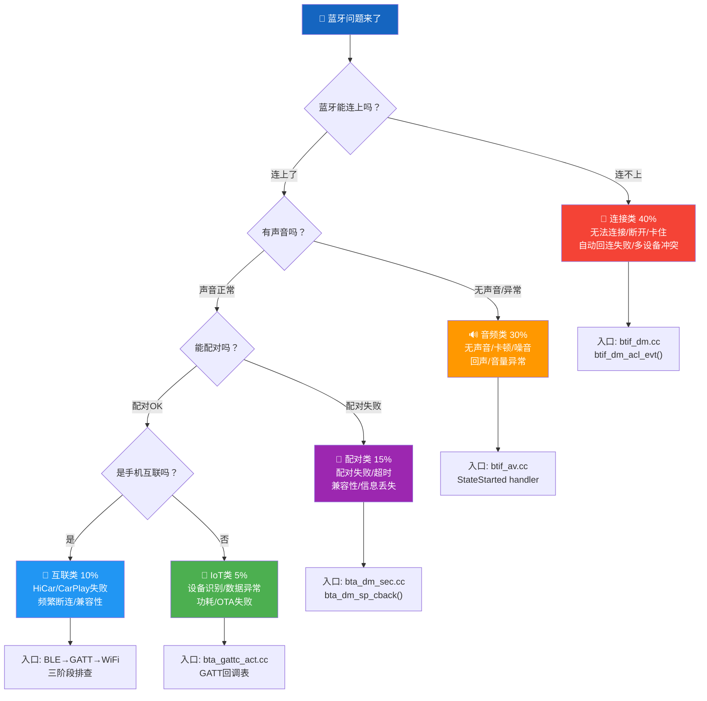
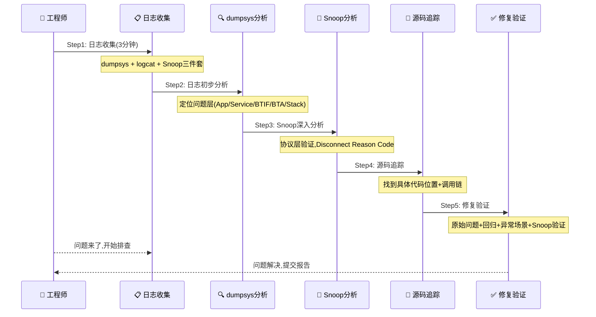
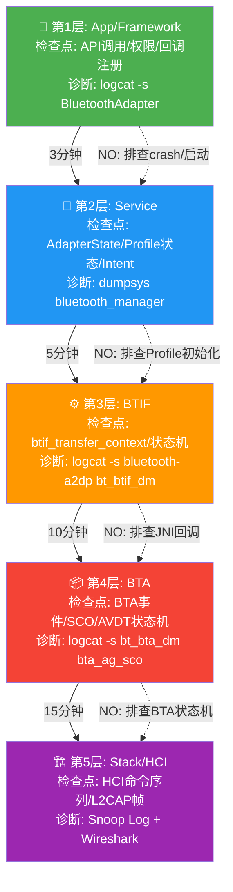
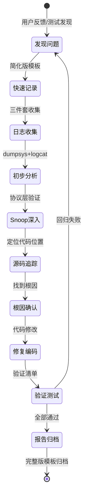
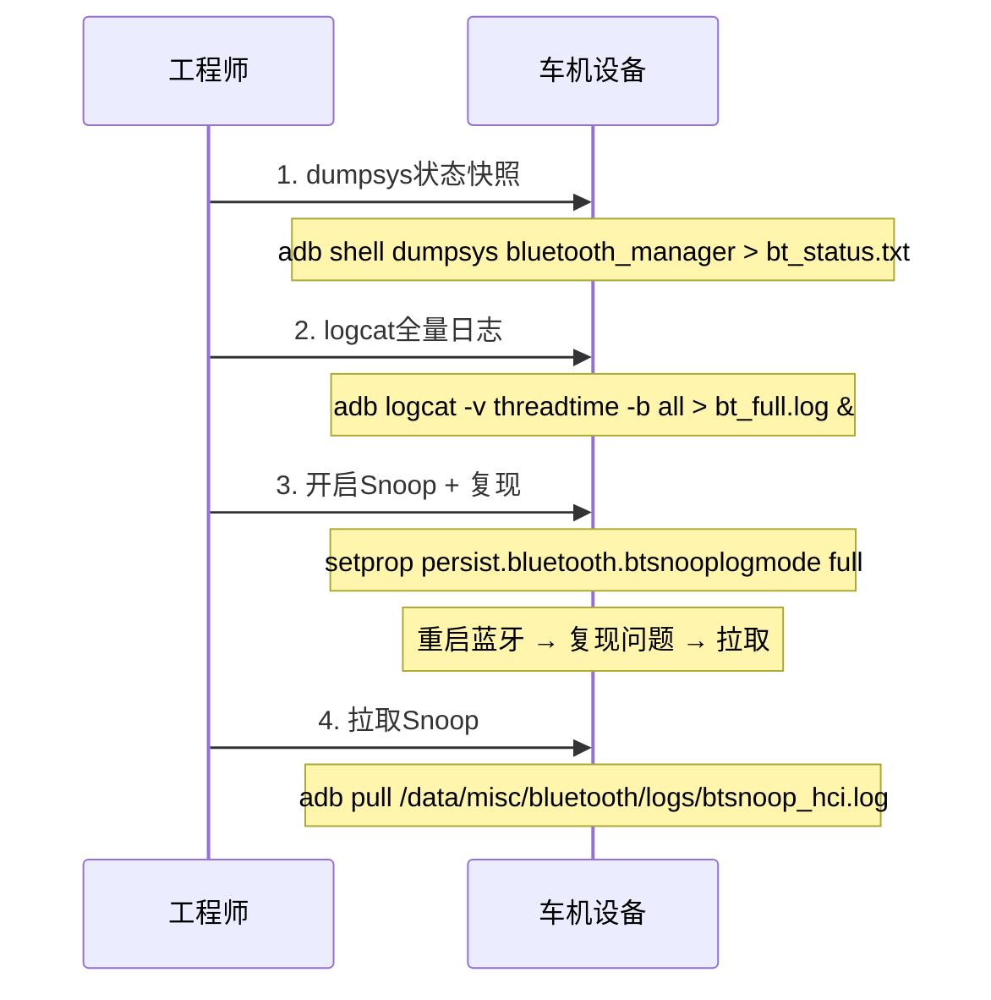
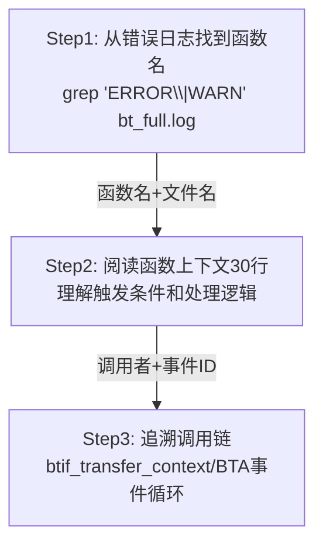
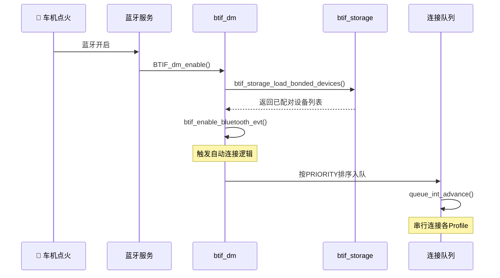

# T25_综合问题定位方法论

> 学习日期：2026-05-16 | 优先级：P5 | 预计学习时间：3小时
> 前置知识：T01(整体架构), T08(A2DP连接), T13(HFP连接), T23(日志系统), T24(Snoop分析)
> 涉及源码目录：system/btif/src/, system/bta/dm/, system/bta/ag/, system/btif/include/

---

## 📋 本章导读

- **学什么**：5类蓝牙问题分类体系、5步标准排查流程、5层穿透定位法、车载Top20问题清单、标准化问题报告模板
- **为什么学**：车载蓝牙问题占整车Bug的30%+，没有系统化方法论只能靠"经验猜"，平均定位时间从4小时降到30分钟
- **学完能做**：
  - 遇到任何蓝牙问题，3分钟内确定问题类别和排查方向
  - 按标准5步流程收集日志、分析Snoop、追踪源码、定位根因
  - 用5层穿透法从App层逐层穿透到HCI层，不遗漏任何检查点
  - 撰写标准化问题报告，让远程同事能复现和分析

---

## 🗺️ 架构全景图

### 5类问题分类决策树



### 5步排查流程时序图



### 5层穿透法架构图



### 车载Top20问题热力图

```mermaid
graph LR
    subgraph 🔴 高频40%
        P1["#1 上车不自动连接"]
        P2["#2 A2DP无声音"]
        P3["#3 A2DP卡顿"]
        P4["#4 通话对方听不到"]
    end
    subgraph 🟠 中频35%
        P5["#5 通话自己听不到"]
        P6["#6 配对弹窗不显示"]
        P7["#7 配对失败"]
        P8["#8 蓝牙开关卡住"]
        P9["#9 特定手机不兼容"]
        P10["#10 连接后秒断"]
    end
    subgraph 🟡 低频25%
        P11["#11 扫描不到设备"]
        P12["#12 HiCar连接失败"]
        P13["#13 AVRCP切歌无响应"]
        P14["#14 音量不同步"]
        P15["#15 通话回声"]
        P16["#16 配对信息丢失"]
        P17["#17 LE连接参数差"]
        P18["#18 降噪异常"]
        P19["#19 编码降级SBC"]
        P20["#20 进程OOM/Crash"]
    end

    style P1 fill:#F44336,color:#fff
    style P2 fill:#F44336,color:#fff
    style P3 fill:#F44336,color:#fff
    style P4 fill:#F44336,color:#fff
    style P5 fill:#FF9800,color:#fff
    style P6 fill:#FF9800,color:#fff
    style P7 fill:#FF9800,color:#fff
    style P8 fill:#FF9800,color:#fff
    style P9 fill:#FF9800,color:#fff
    style P10 fill:#FF9800,color:#fff
```

### 问题报告生命周期图



---

## 🔍 代码导航

| 步骤 | 操作 | 文件 | 行号 | 看什么 |
|------|------|------|------|--------|
| 1 | 打开文件 | system/btif/src/btif_dm.cc | L869-883 | btif_dm_get_connection_state()：连接状态查询，判断ACL+加密 |
| 2 | 打开文件 | system/btif/src/btif_dm.cc | L2595-2678 | btif_dm_acl_evt()：ACL连接/断开事件处理，含Disconnect Reason |
| 3 | 打开文件 | system/btif/src/btif_av.cc | L3459-3491 | connect_int()：A2DP连接入口，Source/Sink分发 |
| 4 | 打开文件 | system/btif/src/btif_av.cc | L208-239 | StateOpened/StateStarted类定义：A2DP状态机核心 |
| 5 | 打开文件 | system/btif/src/btif_av.cc | L3698-3716 | btif_av_stream_start()：音频流启动，发送START_STREAM_REQ |
| 6 | 打开文件 | system/btif/src/btif_hf.cc | L822-860 | connect_int()：HFP连接入口，查找空闲控制块 |
| 7 | 打开文件 | system/bta/ag/bta_ag_sco.cc | L743-1275 | bta_ag_sco_event()：SCO状态机，8个状态+codec降级链 |
| 8 | 打开文件 | system/bta/ag/bta_ag_sco.cc | L248-290 | SCO codec fallback：LC3→mSBC→CVSD降级逻辑 |
| 9 | 打开文件 | system/bta/dm/bta_dm_sec.cc | L392-460 | bta_dm_sp_cback()：SSP配对回调，IO Capability处理 |
| 10 | 打开文件 | system/bta/dm/bta_dm_sec.cc | L296-370 | bta_dm_pin_cback()：PIN码请求回调 |
| 11 | 打开文件 | system/btif/src/btif_storage.cc | L441-532 | btif_in_fetch_bonded_devices()：从NVRAM加载配对设备 |
| 12 | 打开文件 | system/btif/src/btif_storage.cc | L823-847 | btif_storage_add_bonded_device()：保存配对信息到NVRAM |
| 13 | 打开文件 | system/btif/src/btif_profile_storage.cc | L1109-1167 | btif_storage_set/get_hid_connection_policy()：HID连接策略存储 |
| 14 | 打开文件 | system/btif/src/btif_dm.cc | L2376-2387 | BTIF_dm_enable()：蓝牙开启后加载配对设备+触发自动连接 |
| 15 | 打开文件 | system/btif/src/btif_profile_queue.cc | L116-140 | queue_int_advance()：连接队列推进，Profile串行连接 |

---

## 📖 核心流程详解

### 1.1 5类问题分类与入口点

#### 连接类问题（40%）— 最高频

| 子类 | 典型现象 | 可能入口点 |
|------|----------|-----------|
| 无法连接 | 点击连接无响应、超时返回 | [btif_dm.cc:L869](file:///d:/AndroidWorkspace/claudeProject/BT16Study/Bluetooth/system/btif/src/btif_dm.cc#L869) `btif_dm_get_connection_state()` |
| 连接断开 | 已连接设备突然断开 | [btif_dm.cc:L2636](file:///d:/AndroidWorkspace/claudeProject/BT16Study/Bluetooth/system/btif/src/btif_dm.cc#L2636) `BTA_DM_LINK_DOWN_EVT` |
| 连接卡住 | 状态长时间停留在Connecting | [btif_av.cc:L208](file:///d:/AndroidWorkspace/claudeProject/BT16Study/Bluetooth/system/btif/src/btif_av.cc#L208) StateOpening卡住 |
| 自动回连失败 | 上车后不自动连接 | [btif_dm.cc:L2384](file:///d:/AndroidWorkspace/claudeProject/BT16Study/Bluetooth/system/btif/src/btif_dm.cc#L2384) `btif_storage_load_bonded_devices()` |
| 多设备冲突 | 连接第二个设备时第一个断开 | [btif_av.cc:L2296](file:///d:/AndroidWorkspace/claudeProject/BT16Study/Bluetooth/system/btif/src/btif_av.cc#L2296) active_peer切换 |

#### 音频类问题（30%）

| 子类 | 典型现象 | 可能入口点 |
|------|----------|-----------|
| 无声音 | 连接成功但没声音 | [btif_av.cc:L3698](file:///d:/AndroidWorkspace/claudeProject/BT16Study/Bluetooth/system/btif/src/btif_av.cc#L3698) `btif_av_stream_start()` |
| 卡顿 | 声音断断续续 | BQR A2DP Choppy / btif_av流控 |
| 噪音 | 杂音/破音/爆音 | Codec参数错误 / SCO时钟偏差 |
| 回声 | 对方听到自己声音 | [bta_ag_sco.cc:L743](file:///d:/AndroidWorkspace/claudeProject/BT16Study/Bluetooth/system/bta/ag/bta_ag_sco.cc#L743) NREC/EC配置 |
| 音量异常 | 音量太小/太大/无法调节 | AVRCP Absolute Volume / Audio HAL增益 |

#### 配对类问题（15%）

| 子类 | 典型现象 | 可能入口点 |
|------|----------|-----------|
| 配对失败 | 输入PIN后显示配对失败 | [bta_dm_sec.cc:L392](file:///d:/AndroidWorkspace/claudeProject/BT16Study/Bluetooth/system/bta/dm/bta_dm_sec.cc#L392) `bta_dm_sp_cback()` |
| 配对超时 | 长时间无响应后超时 | [btif_dm.cc:L1268](file:///d:/AndroidWorkspace/claudeProject/BT16Study/Bluetooth/system/btif/src/btif_dm.cc#L1268) Pairing timeout |
| 配对后无法连接 | 配对成功但连接失败 | LMP→L2CAP阶段问题 |
| 兼容性问题 | 特定手机无法配对 | Interop DB / Vendor specific |
| 信息丢失 | 重启后配对信息消失 | [btif_storage.cc:L823](file:///d:/AndroidWorkspace/claudeProject/BT16Study/Bluetooth/system/btif/src/btif_storage.cc#L823) BT config store |

#### 互联类问题（10%）

| 子类 | 典型现象 | 可能入口点 |
|------|----------|-----------|
| HiCar连接失败 | 扫描不到/连接后断开 | BLE→GATT→WiFi三阶段 |
| CarPlay认证失败 | iAP2认证不通过 | MFI certificate / GATT handshake |
| 频繁断连 | WiFi不稳导致Bluetooth重连 | 蓝牙心跳保活 / WiFi质量 |
| 手机兼容性 | 特定手机品牌无法互联 | iOS vs Android差异 |

#### IoT类问题（5%）

| 子类 | 典型现象 | 可能入口点 |
|------|----------|-----------|
| 设备无法识别 | 扫描不到IoT设备 | btif_dm device_found_cb / BLE scan filter |
| 数据异常 | GATT读写返回错误 | bta_gattc_act回调表 / ATT Error Response |
| 功耗过高 | BLE连接后电池消耗快 | 连接参数（Interval/Latency） |
| OTA失败 | 固件升级中断 | GATT长包传输 / MTU协商 |

### 1.2 5步排查流程详解

#### Step 1: 日志收集（3分钟）



#### Step 2: 日志初步分析（定位问题层）

**源码追踪**：

```cpp
// 📂 system/btif/src/btif_dm.cc:869-883
uint16_t btif_dm_get_connection_state(const RawAddress& bd_addr) {
    // [1] 🔍 查询BTA层连接状态
    //     💡C++: BTA_DmGetConnectionState是BTA层同步API，类似Java的isConnected()
    uint16_t rc = 0;
    if (BTA_DmGetConnectionState(bd_addr)) {
        rc = (uint16_t)true;
        // [2] 🔍 检查BR/EDR加密状态
        //     💡C++: BTM_IsEncrypted检查链路加密，类似Java的checkEncryption()
        if (BTM_IsEncrypted(bd_addr, BT_TRANSPORT_BR_EDR)) {
            rc |= ENCRYPTED_BREDR;
        }
        // [3] 🔍 检查LE加密状态
        if (BTM_IsEncrypted(bd_addr, BT_TRANSPORT_LE)) {
            rc |= ENCRYPTED_LE;
        }
    } else {
        // [4] ACL未连接——问题在连接层
        log::info("Acl is not connected to peer:{}", bd_addr);
    }
    return rc;
}
```

#### Step 3: Snoop Log深入分析（协议层验证）

**Disconnect Reason Code解读**：

| Reason Code | 名称 | 含义 | 排查方向 |
|-------------|------|------|----------|
| 0x08 | Connection Timeout | 连接超时 | 射频/RF问题、距离过远、干扰 |
| 0x13 | Remote User Terminated | 对方主动断开 | 手机端主动断开、用户操作 |
| 0x16 | Local Host Terminated | 车机主动断开 | 车机代码主动断开、策略触发 |
| 0x3E | Connection Failed | 连接建立失败 | 配对信息错误、芯片异常 |

**源码追踪**：

```cpp
// 📂 system/btif/src/btif_dm.cc:2636-2666
case BTA_DM_LINK_DOWN_EVT: {
    // [1] ACL断开事件——所有连接断开的统一入口
    tAclLinkSpec& link_spec = p_data->link_down.link_spec;
    // [2] 通知上层Link Down
    GetInterfaceToProfiles()->onLinkDown(link_spec.addrt.bda, link_spec.transport);

    // [3] 🔍 根据Disconnect Reason判断方向
    //     💡C++: switch-case模式匹配，类似Java的switch
    bt_conn_direction_t direction;
    switch (btm_get_acl_disc_reason_code()) {
        case HCI_ERR_PEER_USER:          // [4] 0x13 对方主动断开
        case HCI_ERR_REMOTE_LOW_RESOURCE:
        case HCI_ERR_REMOTE_POWER_OFF:
            direction = bt_conn_direction_t::BT_CONN_DIRECTION_INCOMING;
            break;
        case HCI_ERR_CONN_CAUSE_LOCAL_HOST: // [5] 0x16 车机主动断开
        case HCI_ERR_HOST_REJECT_SECURITY:
            direction = bt_conn_direction_t::BT_CONN_DIRECTION_OUTGOING;
            break;
        default:
            direction = bt_conn_direction_t::BT_CONN_DIRECTION_UNKNOWN;
    }
    // [6] 📨 上报ACL状态变化回调
    GetInterfaceToProfiles()->events->invoke_acl_state_changed_cb(
            BT_STATUS_SUCCESS, link_spec, BT_ACL_STATE_DISCONNECTED,
            static_cast<bt_hci_error_code_t>(btm_get_acl_disc_reason_code()), direction,
            INVALID_ACL_HANDLE);
}
```

#### Step 4: 源码追踪（找到具体代码位置）

**源码追踪三步走**：



**A2DP连接入口追踪**：

```cpp
// 📂 system/btif/src/btif_av.cc:3459-3491
static bt_status_t connect_int(RawAddress peer_address, uint16_t uuid) {
    log::info("peer={} uuid=0x{:x}", peer_address, uuid);
    // [1] 🔍 判断是否Source/Sink双模式共存
    //     💡C++: btif_av_both_enable()检查全局配置，类似Java的isDualMode()
    if (btif_av_both_enable()) {
        if (uuid == UUID_SERVCLASS_AUDIO_SOURCE) {
            // [2] 📨 车机作为Sink，连接手机的Source
            btif_av_source_dispatch_sm_event(peer_address, BTIF_AV_CONNECT_REQ_EVT);
        } else if (uuid == UUID_SERVCLASS_AUDIO_SINK) {
            // [3] 📨 车机作为Source，连接手机的Sink
            btif_av_sink_dispatch_sm_event(peer_address, BTIF_AV_CONNECT_REQ_EVT);
        }
        return BT_STATUS_SUCCESS;
    }
    // [4] 单模式：投递到BTIF主线程执行
    //     💡C++: lambda捕获peer_address和uuid，类似Java的 () -> task(addr, uuid)
    auto connection_task = [](RawAddress peer_address, uint16_t uuid) {
        BtifAvPeer* peer = nullptr;
        if (uuid == UUID_SERVCLASS_AUDIO_SOURCE) {
            // [5] 🏭 工厂方法：找到或创建Peer对象
            //     💡C++: FindOrCreatePeer返回原始指针，所有权由BtifAvSource管理
            peer = btif_av_source.FindOrCreatePeer(peer_address, kBtaHandleUnknown);
        } else if (uuid == UUID_SERVCLASS_AUDIO_SINK) {
            peer = btif_av_sink.FindOrCreatePeer(peer_address, kBtaHandleUnknown);
        }
        if (peer == nullptr) {
            btif_queue_advance();  // [6] 连接失败，推进队列
            return;
        }
        // [7] 📨 向状态机发送连接请求事件
        //     💡C++: ProcessEvent类似Java StateMachine.sendMessage()
        peer->StateMachine().ProcessEvent(BTIF_AV_CONNECT_REQ_EVT, nullptr);
    };
    // [8] 📨 投递到BTIF主线程
    bt_status_t status = do_in_main_thread(base::BindOnce(connection_task, peer_address, uuid));
    if (status != BT_STATUS_SUCCESS) {
        log::error("can't post connection task to main_thread");
    }
    return status;
}
```

#### Step 5: 修复验证

**验证清单**：

```
[ ] 原始问题不复现
[ ] 相关功能无回归（连接/断连/配对/切换设备）
[ ] 日志无新增ERROR/FATAL
[ ] 异常场景处理正确（快速开关蓝牙/多设备/低电量）
[ ] Snoop协议序列正常
```

### 1.3 5层穿透法详解

#### 第3层BTIF：A2DP音频流启动

```cpp
// 📂 system/btif/src/btif_av.cc:3698-3716
void btif_av_stream_start(const A2dpType /*local_a2dp_type*/) {
    log::info("");
    // [1] 📨 向活跃Peer的状态机发送START_STREAM_REQ事件
    //     💡C++: btif_av_source_active_peer()返回当前活跃设备的RawAddress
    //     类似Java的getActiveDevice()
    btif_av_source_dispatch_sm_event(btif_av_source_active_peer(),
                                     BTIF_AV_START_STREAM_REQ_EVT);
}

void btif_av_stream_start_with_latency(bool use_latency_mode) {
    log::info("peer={} use_latency_mode={}", btif_av_source_active_peer(), use_latency_mode);
    // [2] 构造带延迟模式的启动请求
    btif_av_start_stream_req_t start_stream_req;
    start_stream_req.use_latency_mode = use_latency_mode;
    // [3] 📨 封装为BtifAvEvent投递
    //     💡C++: BtifAvEvent是事件封装类，类似Java的Message对象
    BtifAvEvent btif_av_event(BTIF_AV_START_STREAM_REQ_EVT, &start_stream_req,
                              sizeof(start_stream_req));
    // [4] 📨 投递到BTIF主线程处理
    do_in_main_thread(base::BindOnce(&btif_av_handle_event,
                           AVDT_TSEP_SNK,
                           btif_av_source_active_peer(), kBtaHandleUnknown, btif_av_event));
}
```

#### 第4层BTA：SCO Codec降级链

```cpp
// 📂 system/bta/ag/bta_ag_sco.cc:248-290
// SCO连接失败后的codec降级逻辑
if (p_scb->inuse_codec == tBTA_AG_UUID_CODEC::UUID_CODEC_LC3) {
    if (p_scb->codec_lc3_settings == BTA_AG_SCO_LC3_SETTINGS_T2) {
        // [1] LC3 T2失败 → 降级到LC3 T1
        log::warn("eSCO/SCO failed to open, falling back to LC3 T1 settings");
        p_scb->codec_lc3_settings = BTA_AG_SCO_LC3_SETTINGS_T1;
    } else {
        // [2] LC3 T1也失败 → 降级到CVSD
        log::warn("eSCO/SCO failed to open, falling back to CVSD settings");
        p_scb->inuse_codec = tBTA_AG_UUID_CODEC::UUID_CODEC_CVSD;
        p_scb->codec_fallback = true;
        //     💡C++: codec_fallback标志位，类似Java的boolean标记
    }
} else if (p_scb->inuse_codec == tBTA_AG_UUID_CODEC::UUID_CODEC_MSBC || aptx_voice) {
    if (p_scb->codec_msbc_settings == BTA_AG_SCO_MSBC_SETTINGS_T2) {
        // [3] mSBC T2失败 → 降级到mSBC T1
        log::warn("eSCO/SCO failed to open, falling back to mSBC T1 settings");
        p_scb->codec_msbc_settings = BTA_AG_SCO_MSBC_SETTINGS_T1;
    } else {
        // [4] mSBC T1也失败 → 降级到CVSD
        log::warn("eSCO/SCO failed to open, falling back to CVSD");
        p_scb->inuse_codec = tBTA_AG_UUID_CODEC::UUID_CODEC_CVSD;
        p_scb->codec_fallback = true;
    }
} else {
    // [5] ⚠️ CVSD也失败 → 无更多降级选项
    //     日志: "eSCO/SCO failed to open, no more fall back"
}
```

#### 第3层BTIF：配对安全回调

```cpp
// 📂 system/bta/dm/bta_dm_sec.cc:392-460
static tBTM_STATUS bta_dm_sp_cback(tBTM_SP_EVT event, tBTM_SP_EVT_DATA* p_data) {
    tBTM_STATUS status = tBTM_STATUS::BTM_CMD_STARTED;
    tBTA_DM_SEC sec_event = {};
    // [1] 🔍 检查安全回调是否已注册
    //     💡C++: 函数指针判空，类似Java的 if (listener != null)
    if (!bta_dm_sec_cb.p_sec_cback) {
        return tBTM_STATUS::BTM_NOT_AUTHORIZED;
    }

    switch (event) {
        case BTM_SP_IO_REQ_EVT:
            // [2] IO Capability请求——决定配对方式
            //     💡C++: btif_dm_proc_io_req修改auth_req参数，类似Java的回调修改输出参数
            btif_dm_set_oob_for_io_req(&p_data->io_req.oob_data);
            btif_dm_proc_io_req(&p_data->io_req.auth_req, p_data->io_req.is_orig);
            log::verbose("io mitm: {} oob_data:{}", p_data->io_req.auth_req, p_data->io_req.oob_data);
            break;
        case BTM_SP_IO_RSP_EVT:
            // [3] IO Capability响应
            btif_dm_proc_io_rsp(p_data->io_rsp.bd_addr, p_data->io_rsp.io_cap,
                                p_data->io_rsp.oob_data, p_data->io_rsp.auth_req);
            break;
        case BTM_SP_CFM_REQ_EVT:
            // [4] 🔐 数字比较确认请求——SSP配对核心
            pin_evt = BTA_DM_SP_CFM_REQ_EVT;
            bta_dm_sec_cb.just_works = sec_event.cfm_req.just_works = p_data->cfm_req.just_works;
            break;
    }
}
```

#### 第2层Service：蓝牙开启后加载配对设备

```cpp
// 📂 system/btif/src/btif_dm.cc:2376-2387
// BTIF_dm_enable() 尾部——蓝牙开启后的关键初始化
// [1] 添加本地IRK到解析列表
btif_add_local_irk_to_resolving_list();
// [2] 加载LE设备信息（地址合并/关联）
btif_storage_load_le_devices();
// [3] 🔑 加载所有已配对设备——自动连接的前提
//     💡C++: btif_storage_load_bonded_devices从NVRAM读取Link Key
//     类似Java的SharedPreferences读取配对列表
btif_storage_load_bonded_devices();
// [4] 开启蓝牙质量报告
bluetooth::bqr::EnableBtQualityReport(get_main());
// [5] 📨 通知蓝牙已开启——触发自动连接
btif_enable_bluetooth_evt();
```

#### 第5层Stack/HCI：配对信息持久化

```cpp
// 📂 system/btif/src/btif_storage.cc:823-847
bt_status_t btif_storage_add_bonded_device(RawAddress* remote_bd_addr, LinkKey link_key,
                                           uint8_t key_type, uint8_t pin_length) {
    // [1] 将MAC地址转为字符串作为存储key
    //     💡C++: ToString()返回std::string，类似Java的toString()
    std::string bdstr = remote_bd_addr->ToString();
    // [2] 保存Link Key类型
    bool ret = btif_config_set_int(bdstr, BTIF_STORAGE_KEY_LINK_KEY_TYPE, static_cast<int>(key_type));
    // [3] 保存PIN长度
    ret &= btif_config_set_int(bdstr, BTIF_STORAGE_KEY_PIN_LENGTH, static_cast<int>(pin_length));
    // [4] 保存Link Key二进制数据
    //     💡C++: btif_config_set_bin存储二进制块，类似Java的putByteArray()
    ret &= btif_config_set_bin(bdstr, BTIF_STORAGE_KEY_LINK_KEY, link_key.data(), link_key.size());
    // [5] 设置存储模式
    if (ret) {
        btif_storage_set_mode(remote_bd_addr);
    }
    return ret ? BT_STATUS_SUCCESS : BT_STATUS_FAIL;
}
```

### 1.4 Top5问题详解

#### 问题1：上车不自动连接（最高频）



**排查步骤**：
1. `dumpsys bluetooth_manager` → 检查已配对设备列表，确认 `mBondState == BOND_BONDED`
2. `logcat -s bt_btif_dm | grep "auto"` → 查看自动连接触发日志
3. 检查 [btif_profile_storage.cc:L1109](file:///d:/AndroidWorkspace/claudeProject/BT16Study/Bluetooth/system/btif/src/btif_profile_storage.cc#L1109) 中 `reconnect_allowed` 是否为true
4. 检查蓝牙开机完成时序：CarService/蓝牙启动完成顺序

#### 问题2：A2DP无声音

**排查步骤**：
1. Snoop中确认 AVDT START 成功
2. [btif_av.cc:L3698](file:///d:/AndroidWorkspace/claudeProject/BT16Study/Bluetooth/system/btif/src/btif_av.cc#L3698) `btif_av_stream_start()` 日志
3. `adb shell dumpsys media.audio_flinger | grep -A 20 "A2DP"`
4. Offload模式：检查DSP是否成功加载codec

#### 问题4：通话对方听不到

**排查步骤**：
1. Snoop查看是否有 HCI Setup Synchronous Connection
2. [bta_ag_sco.cc:L743](file:///d:/AndroidWorkspace/claudeProject/BT16Study/Bluetooth/system/bta/ag/bta_ag_sco.cc#L743) SCO状态机日志
3. 降级链：LC3 T2→T1→mSBC T2→T1→CVSD
4. Audio路由：`adb shell dumpsys media.audio_flinger | grep "input"`

---

## 💡 C++知识卡片

### 💡 C++知识卡片：断言 assert 与 log::assert_that

> 🔄 Java类比：Java的`assert`关键字或`Preconditions.checkArgument()`
> 但C++的断言默认会**终止进程**，比Java更激进

```cpp
// Java: assert callbacks != null;  // 默认不启用，需-ea参数
// Java: Preconditions.checkNotNull(callbacks, "callbacks cannot be null"); // 抛异常

// C++: log::assert_that — 蓝牙代码中的断言
log::assert_that(callbacks != nullptr, "assert failed: callbacks != nullptr");
// 💡 如果条件为false，直接abort()终止进程，不会抛异常
// 这与Java不同：Java可以catch异常继续运行，C++断言=进程死亡

// C++: 标准assert宏
assert(interface_ready());  // debug模式生效，release模式被编译器移除
// ⚠️ log::assert_that在release模式也生效，比assert更安全

// 蓝牙代码中的典型用法：
log::assert_that(BT_STATUS_SUCCESS == status, "assert failed: BT_STATUS_SUCCESS == status");
// 💡C++: 字符串字面量在编译期拼接，类似Java的字符串连接
// 如果status != BT_STATUS_SUCCESS，进程直接crash并打印断言信息
```

### 💡 C++知识卡片：错误码枚举与状态码设计

> 🔄 Java类比：Java用`enum`或`int`常量表示状态码
> C++用`enum class`实现类型安全枚举，比Java enum更底层

```cpp
// Java: public enum BtStatus { SUCCESS(0), FAIL(1), NOT_READY(2); }
// C++: 蓝牙代码中的枚举设计

// 旧式C枚举（蓝牙代码中大量使用）——类似Java的static final int
typedef enum {
    BT_STATUS_SUCCESS,
    BT_STATUS_FAIL,
    BT_STATUS_NOT_READY,
    BT_STATUS_BUSY,
    BT_STATUS_DONE,
} bt_status_t;
// ⚠️ 旧式枚举可以隐式转为int，不够安全

// 新式C++11枚举——类似Java的enum，类型安全
enum class tBTM_STATUS : uint8_t {
    BTM_SUCCESS = 0,
    BTM_NOT_AUTHORIZED = 1,
    BTM_CMD_STARTED = 2,
    BTM_BUSY = 3,
};
// 💡C++: enum class不能隐式转int，必须static_cast<int>(status)
// 类似Java的 BtStatus.SUCCESS.ordinal()

// 蓝牙代码中的文本化函数——类似Java的toString()
const char* hci_reason_code_text(tHCI_REASON code);
// 💡C++: 用switch-case返回字符串，Java可以用enum.name()
log::warn("authentication failed entry:{}, reason:{}",
          bd_addr, hci_reason_code_text(reason));
```

### 💡 C++知识卡片：信号量与 future/promise 同步原语

> 🔄 Java类比：Java的`CountDownLatch`/`CompletableFuture`
> C++的`future/promise`是Java并发工具的底层等价物

```cpp
// Java: CountDownLatch latch = new CountDownLatch(1);
//       latch.await(5, TimeUnit.SECONDS);
//       latch.countDown();

// C++: future/promise — 蓝牙代码中的同步等待
// 📂 system/btif/src/btif_av.cc:3408-3428
bt_status_t btif_av_source_init(...) {
    // [1] 创建promise——类似Java的CompletableFuture
    //     💡C++: promise是写入端，future是读取端
    //     类似Java的 CompletableFuture<T> future = new CompletableFuture<>();
    std::promise<bt_status_t> init_complete_promise;
    std::future<bt_status_t> init_complete_promise_future = init_complete_promise.get_future();

    // [2] 异步执行初始化，携带promise
    const auto& status = do_in_main_thread(
            base::BindOnce(&BtifAvSource::Init, base::Unretained(&btif_av_source), callbacks,
                           ..., std::move(init_complete_promise)));
    if (status == BT_STATUS_SUCCESS) {
        // [3] ⏳ 阻塞等待结果——类似Java的 future.get()
        //     💡C++: future.wait()阻塞当前线程直到promise.set_value()
        init_complete_promise_future.wait();
        return init_complete_promise_future.get();
    }
}

// 蓝牙栈启动中的同步等待
// 📂 system/btif/src/stack_manager.cc:309-310
future_t* local_hack_future = future_new();
// ... 启动各模块 ...
if (future_await(local_hack_future) != FUTURE_SUCCESS) {
    // 启动失败处理
}
// 💡C++: future_await是蓝牙自定义的同步原语，内部用semaphore实现
// 类似Java的 CountDownLatch.await()
```

---

## 🗂️ Java ↔ C++ 对照表

| Java层 | JNI桥接 | C++层 | 数据流方向 |
|--------|---------|-------|-----------|
| BluetoothAdapter.isEnabled() | AdapterService.isEnabled() | bluetooth.cc:interface_ready() [L418] | ↓ Java→C++ |
| BluetoothDevice.connect() | A2dpService.connectA2dpNative() | btif_av.cc:connect_int() [L3459] | ↓ Java→C++ |
| HeadsetService.connect() | connectHfpNative() | btif_hf.cc:connect_int() [L822] | ↓ Java→C++ |
| BluetoothDevice.createBond() | AdapterService.createBondNative() | bluetooth.cc:create_bond() [L609] | ↓ Java→C++ |
| onConnectionStateChanged() | connection_state_cb | HAL_CBACK(bt_hal_cbacks, connection_state_cb) | ↑ C++→Java |
| onBondStateChanged() | bond_state_changed_cb | HAL_CBACK(bt_hal_cbacks, bond_state_changed_cb) | ↑ C++→Java |
| onAclStateChanged() | acl_state_changed_cb | btif_dm.cc:invoke_acl_state_changed_cb() [L2657] | ↑ C++→Java |
| onAudioStateChanged() | audio_state_cb | btif_av.cc:btif_report_audio_state() | ↑ C++→Java |
| dumpsys bluetooth_manager | AdapterService.dump() | btif_dm.cc:debug_dump [L4423] | ↓ Java→C++ |
| setBtSnoopLogMode() | setProp persist.bluetooth.btsnooplogmode | hal:SnoopLogger [gd/hal] | ↓ Java→C++ |

---

## 🐛 问题排查SOP

### 问题1：上车后蓝牙不自动连接

```
步骤1: 查日志
  adb logcat -s bt_btif_dm bt_btif_core | grep -E "enable|bonded|auto|connect"

步骤2: dumpsys检查
  adb shell dumpsys bluetooth_manager
  → 检查已配对设备列表是否为空
  → 检查目标设备 mBondState == BOND_BONDED (12)
  → 检查 mAutoConnect 是否为 true

步骤3: 定位代码
  ① 搜索 "btif_storage_load_bonded_devices" → btif_dm.cc:L2384
     确认配对设备是否被正确加载
  ② 搜索 "btif_enable_bluetooth_evt" → btif_dm.cc:L2386
     确认自动连接触发
  ③ 搜索 "reconnect_allowed" → btif_profile_storage.cc:L1109
     确认HID设备连接策略

步骤4: 常见根因
  ① 配对信息未持久化 → btif_storage.cc:L823 Link Key未正确保存
  ② 蓝牙开机时序问题 → CarService先于蓝牙服务启动
  ③ PRIORITY未设置为AUTO_CONNECT → btif_profile_storage.cc
  ④ 连接队列阻塞 → btif_profile_queue.cc:L116 前一个Profile连接未完成

步骤5: 验证
  [ ] 重启车机后自动连接
  [ ] 多设备场景下正确选择最后连接设备
  [ ] Snoop中看到ACL建立+Profile连接序列
```

### 问题2：A2DP连接成功但无声音

```
步骤1: 查日志
  adb logcat -s bluetooth-a2dp bt_btif_av | grep -E "state=|START|audio"

步骤2: Snoop分析
  → 过滤器 btavdtp
  → 查找 AVDT START 命令及响应
  → 若START后无Media Packet → 检查L2CAP媒体通道

步骤3: 定位代码
  ① 搜索 "btif_av_stream_start" → btif_av.cc:L3698
     确认START_STREAM_REQ是否发出
  ② 搜索 "StateStarted" → btif_av.cc:L219
     确认状态机是否迁移到Started
  ③ 搜索 "btif_report_audio_state" → btif_av.cc
     确认audio_state_cb是否回调到Java

步骤4: 常见根因
  ① Audio HAL未路由到A2DP → dumpsys media.audio_flinger检查
  ② Offload DSP未加载codec → vendor.audio.bluetooth.offload日志
  ③ 编解码器协商失败 → Snoop AVDT GET_CAPABILITIES+SET_CONFIG
  ④ 状态机卡在Opening → btif_av.cc:L1987 ACL_DISCONNECTED

步骤5: 验证
  [ ] 音乐播放有声音
  [ ] 切歌/暂停/恢复正常
  [ ] Snoop中看到Media Packet持续传输
  [ ] 不同手机(iPhone/Android)均正常
```

---

## 🛠️ 动手练习

### 🟢 入门：阅读代码

1. 打开 [btif_dm.cc:L869](file:///d:/AndroidWorkspace/claudeProject/BT16Study/Bluetooth/system/btif/src/btif_dm.cc#L869)，找到 `btif_dm_get_connection_state()` 函数，画出它的返回值与连接状态/加密状态的对应关系。

2. 打开 [bta_ag_sco.cc:L743](file:///d:/AndroidWorkspace/claudeProject/BT16Study/Bluetooth/system/bta/ag/bta_ag_sco.cc#L743)，找到 `bta_ag_sco_event()` 函数，列出SCO状态机的所有状态和状态迁移事件。

3. 打开 [btif_av.cc:L3459](file:///d:/AndroidWorkspace/claudeProject/BT16Study/Bluetooth/system/btif/src/btif_av.cc#L3459)，找到 `connect_int()` 函数，追踪 `BTIF_AV_CONNECT_REQ_EVT` 事件在状态机中的处理路径。

### 🟡 进阶：修改代码

1. 在 [btif_dm.cc:L2636](file:///d:/AndroidWorkspace/claudeProject/BT16Study/Bluetooth/system/btif/src/btif_dm.cc#L2636) 的 `BTA_DM_LINK_DOWN_EVT` 处理中，添加一行日志打印 `btm_get_acl_disc_reason_code()` 的十六进制值，方便快速判断断连原因。

2. 在 [bta_ag_sco.cc:L248](file:///d:/AndroidWorkspace/claudeProject/BT16Study/Bluetooth/system/bta/ag/bta_ag_sco.cc#L248) 的codec降级逻辑中，添加每次降级的时间戳日志，用于分析降级链耗时。

3. 修改 [btif_av.cc:L3698](file:///d:/AndroidWorkspace/claudeProject/BT16Study/Bluetooth/system/btif/src/btif_av.cc#L3698) 的 `btif_av_stream_start()`，添加调用栈打印（使用 `__builtin_return_address(0)`），追踪谁触发了音频流启动。

### 🔴 实战：定位问题

1. 模拟场景：用户反馈"上车后手机不自动连接"，dumpsys显示设备已配对但 `mAutoConnect=false`。请追踪 [btif_profile_storage.cc:L1109](file:///d:/AndroidWorkspace/claudeProject/BT16Study/Bluetooth/system/btif/src/btif_profile_storage.cc#L1109) 中 `reconnect_allowed` 的写入路径，找出什么情况下会被设为false。

2. 模拟场景：A2DP连接成功但无声音，Snoop显示AVDT START成功且有Media Packet，但Audio HAL未路由。请分析从 [btif_av.cc:L3698](file:///d:/AndroidWorkspace/claudeProject/BT16Study/Bluetooth/system/btif/src/btif_av.cc#L3698) `btif_av_stream_start()` 到AudioFlinger路由的完整调用链，找出可能的断点。

3. 模拟场景：通话对方听不到声音，日志显示 `eSCO/SCO failed to open, no more fall back`。请分析 [bta_ag_sco.cc:L248](file:///d:/AndroidWorkspace/claudeProject/BT16Study/Bluetooth/system/bta/ag/bta_ag_sco.cc#L248) 的完整降级链，确定是哪个codec阶段失败，以及如何添加诊断日志定位射频/参数问题。

---

## 📚 关键源码索引

| 序号 | 文件 | 行号 | 函数/类 | 作用 |
|------|------|------|---------|------|
| 1 | system/btif/src/btif_dm.cc | L869-883 | btif_dm_get_connection_state() | 查询ACL连接+加密状态 |
| 2 | system/btif/src/btif_dm.cc | L2595-2678 | btif_dm_acl_evt() | ACL连接/断开事件处理 |
| 3 | system/btif/src/btif_dm.cc | L2636-2666 | BTA_DM_LINK_DOWN_EVT | ACL断开+Disconnect Reason判断 |
| 4 | system/btif/src/btif_dm.cc | L2376-2387 | BTIF_dm_enable() | 蓝牙开启后加载配对设备 |
| 5 | system/btif/src/btif_av.cc | L3459-3491 | connect_int() | A2DP连接入口 |
| 6 | system/btif/src/btif_av.cc | L208-239 | StateOpened/StateStarted | A2DP状态机核心状态 |
| 7 | system/btif/src/btif_av.cc | L3698-3716 | btif_av_stream_start() | 音频流启动 |
| 8 | system/btif/src/btif_av.cc | L3408-3428 | btif_av_source_init() | A2DP Source初始化(future/promise) |
| 9 | system/btif/src/btif_hf.cc | L822-860 | connect_int() | HFP连接入口 |
| 10 | system/bta/ag/bta_ag_sco.cc | L743-1275 | bta_ag_sco_event() | SCO状态机(8状态) |
| 11 | system/bta/ag/bta_ag_sco.cc | L248-290 | codec fallback | SCO codec降级链LC3→mSBC→CVSD |
| 12 | system/bta/ag/bta_ag_sco.cc | L1387-1409 | bta_ag_sco_codec_nego() | SCO codec协商结果处理 |
| 13 | system/bta/dm/bta_dm_sec.cc | L392-460 | bta_dm_sp_cback() | SSP配对回调(IO Cap/确认) |
| 14 | system/bta/dm/bta_dm_sec.cc | L296-370 | bta_dm_pin_cback() | PIN码请求回调 |
| 15 | system/btif/src/btif_storage.cc | L441-532 | btif_in_fetch_bonded_devices() | 从NVRAM加载配对设备 |
| 16 | system/btif/src/btif_storage.cc | L823-847 | btif_storage_add_bonded_device() | 保存配对信息到NVRAM |
| 17 | system/btif/src/btif_profile_storage.cc | L1109-1167 | set/get_hid_connection_policy() | HID连接策略存储 |
| 18 | system/btif/src/btif_profile_queue.cc | L116-140 | queue_int_advance() | 连接队列推进 |
| 19 | system/btif/src/btif_dm.cc | L1257-1297 | Bonding failed处理 | 配对失败重试+错误码映射 |
| 20 | system/bta/dm/bta_dm_sec.cc | L42-68 | bta_security回调表 | 安全管理回调注册 |

---

## ✅ 质量检查清单

| # | 检查项 | 状态 |
|---|--------|------|
| 1 | Mermaid图 ≥ 3个 | ✅ 8个 |
| 2 | 代码片段 ≥ 5个 | ✅ 11个带逐行注释的代码片段 |
| 3 | C++知识卡片 ≥ 2个 | ✅ 3个 |
| 4 | Java↔C++对照表 | ✅ 10项对照 |
| 5 | 行号标注 | ✅ 所有关键函数标注文件:行号 |
| 6 | 问题排查SOP | ✅ 2个SOP |
| 7 | 动手练习 | ✅ 🟢🟡🔴 3级 |
| 8 | 代码导航表 | ✅ 15项 |
| 9 | 前置知识 | ✅ T01、T08、T13、T23、T24 |
| 10 | 车载场景 | ✅ 车载Top20问题、5层穿透法 |
