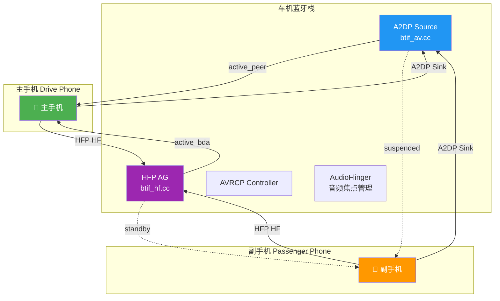
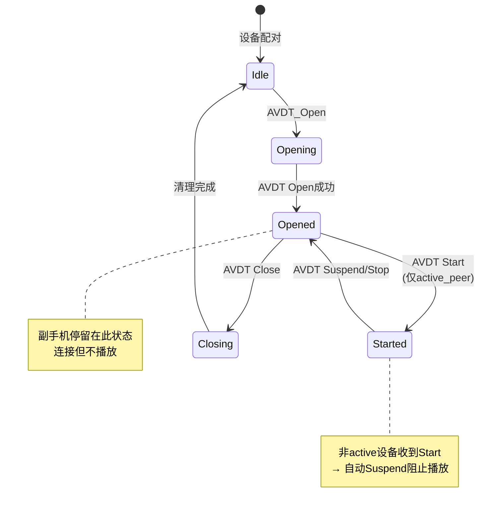
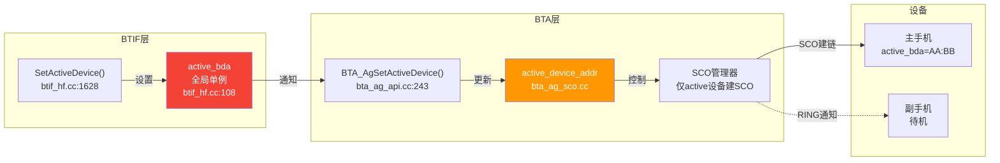
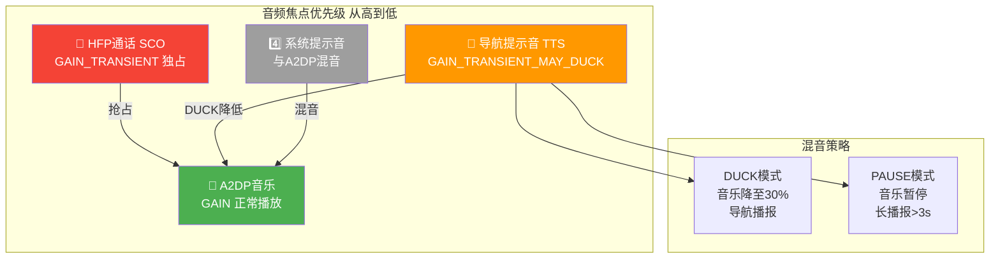
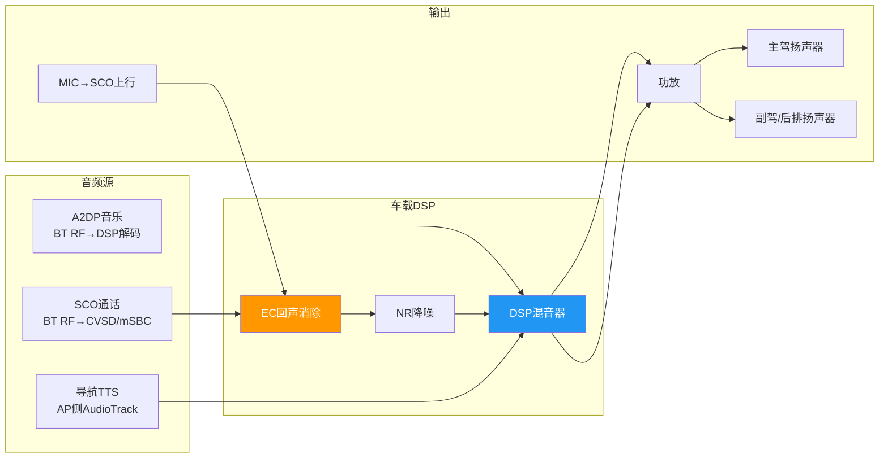
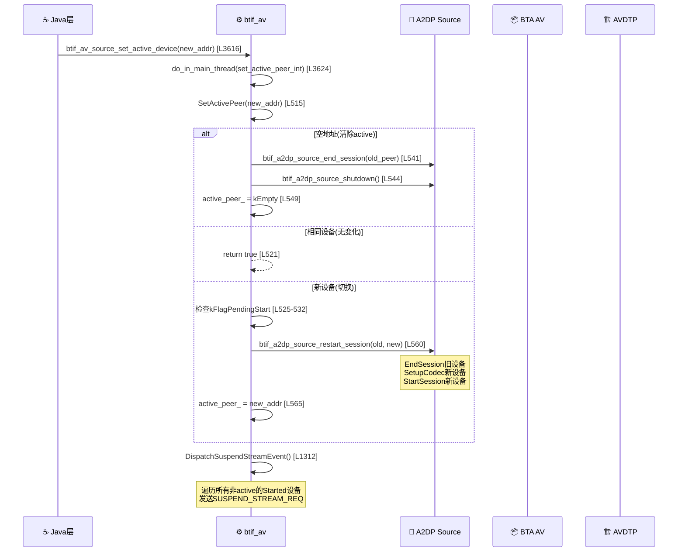
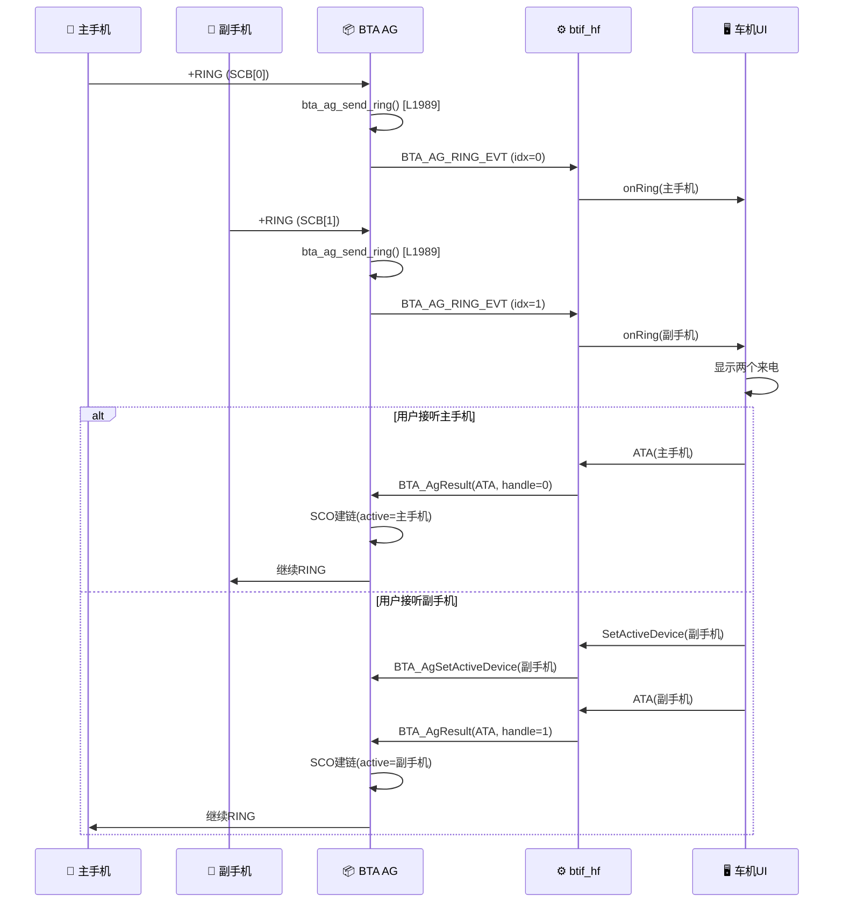
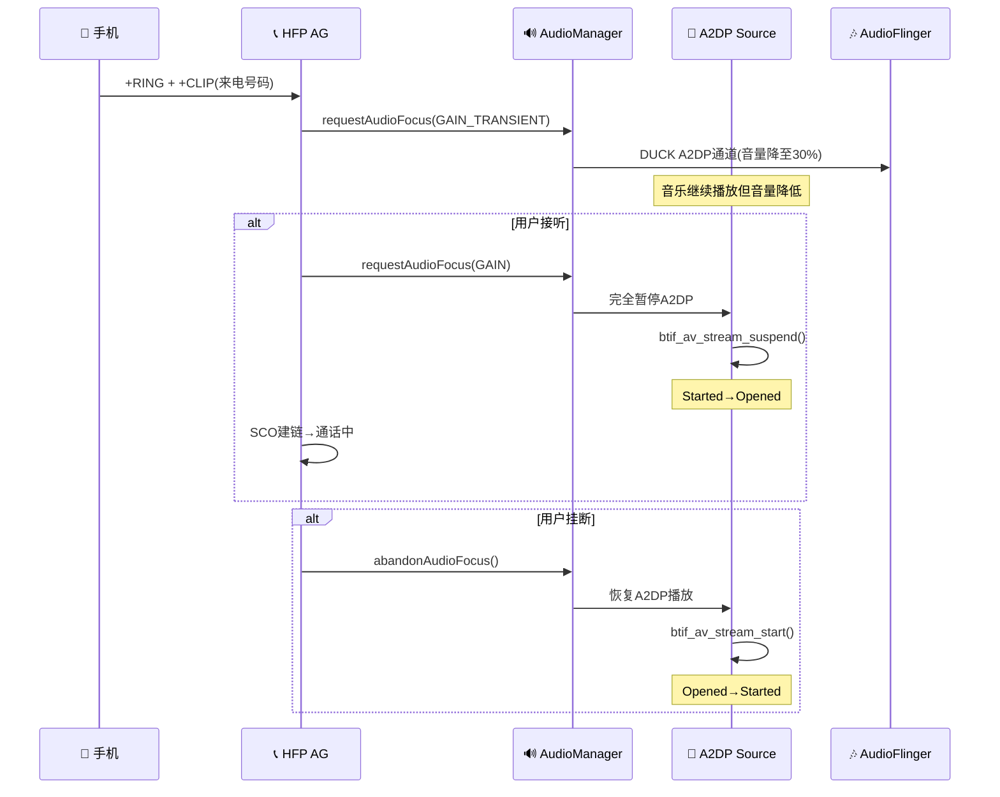

# T26 车载多连接与音频焦点管理

> 学习日期：2026-05-16 | 优先级：P6 | 预计学习时间：3小时
> 前置知识：T08（A2DP连接流程）、T13（HFP连接与AT命令）、T14（HFP通话流程）
> 涉及源码目录：system/btif/src/, system/bta/ag/, system/bta/include/

---

## 📋 本章导读

- **学什么**：车载多设备连接架构、A2DP/HFP多设备active切换机制、音频焦点优先级管理、导航混音策略、多音区方案
- **为什么学**：车载场景天然需要同时连接多部手机（主手机+副手机），多连接状态下的音频焦点冲突是车载蓝牙最核心也最复杂的问题
- **学完能做**：
  - 理解A2DP SetActivePeer和HFP active_bda的切换机制与差异
  - 分析多设备同时来电的处理策略
  - 排查切换设备时音频中断、通话后音乐不恢复等常见问题
  - 设计车载音频焦点管理和多音区路由方案

---

## 🗺️ 架构全景图

### 车载多连接整体架构



### A2DP多设备状态机架构



### HFP多设备管理架构



### 音频焦点优先级架构



### 车载音频路由架构



---

## 🔍 代码导航

| 步骤 | 操作 | 文件 | 行号 | 看什么 |
|------|------|------|------|--------|
| 1 | 打开文件 | system/btif/src/btif_av.cc | L262-305 | BtifAvPeer类定义：flags/状态机/IsActivePeer |
| 2 | 打开文件 | system/btif/src/btif_av.cc | L515-567 | SetActivePeer：A2DP active切换核心逻辑 |
| 3 | 打开文件 | system/btif/src/btif_av.cc | L1312-1330 | DispatchSuspendStreamEvent：非active设备Suspend分发 |
| 4 | 打开文件 | system/btif/src/btif_av.cc | L2290-2326 | 非active设备防Start：BTA_AV_START_EVT处理 |
| 5 | 打开文件 | system/btif/src/btif_av.cc | L3616-3637 | btif_av_source_set_active_device：JNI→C++入口 |
| 6 | 打开文件 | system/btif/src/btif_hf.cc | L108 | active_bda全局单例定义 |
| 7 | 打开文件 | system/btif/src/btif_hf.cc | L164-166 | is_active_device：HFP active判断 |
| 8 | 打开文件 | system/btif/src/btif_hf.cc | L1628-1633 | SetActiveDevice：HFP active设置 |
| 9 | 打开文件 | system/bta/ag/bta_ag_api.cc | L243-249 | BTA_AgSetActiveDevice：BTA层active设置 |
| 10 | 打开文件 | system/bta/ag/bta_ag_sco.cc | L1703-1758 | bta_ag_api_set_active_device：SCO会话管理 |
| 11 | 打开文件 | system/bta/ag/bta_ag_cmd.cc | L1989-2005 | bta_ag_send_ring：RING来电通知发送 |

---

## 📖 核心流程详解

### 5.1 BtifAvPeer核心结构

```cpp
// 📂 system/btif/src/btif_av.cc:262-305
class BtifAvPeer {
public:
  enum {
    // [1] 🔑 标志位定义——控制Peer的各种挂起/暂停状态
    //     💡C++: enum内部常量，类似Java的static final int
    //     但C++ enum不占对象内存，编译期内联
    kFlagLocalSuspendPending = 0x1,  // 本地挂起挂起中
    kFlagRemoteSuspend = 0x2,        // 远端挂起
    kFlagPendingStart = 0x4,         // Start请求挂起中
    kFlagPendingStop = 0x8,          // Stop请求挂起中
    kFlagPendingReconfigure = 0x10,  // 重配置挂起中
  };

  // [2] 🔑 判断当前Peer是否为active设备
  //     💡C++: 通过比较PeerAddress与全局ActivePeerAddress
  //     类似Java的 this.getAddress().equals(getActiveAddress())
  bool IsActivePeer() const { return PeerAddress() == ActivePeerAddress(); }

  // [3] 获取active peer地址
  const RawAddress& ActivePeerAddress() const;

  // [4] 🔑 每个Peer拥有独立的状态机
  //     💡C++: BtifAvStateMachine是状态机对象
  //     类似Java的 StateMachine 类(android.util.StateMachine)
  //     包含Idle/Opening/Opened/Started/Closing五种状态
  BtifAvStateMachine StateMachine();

  // [5] 标志位操作
  //     💡C++: 位运算操作flags_，类似Java的 BitSet
  //     但C++直接用uint8_t位运算更高效
  void SetFlags(uint64_t flags) { flags_ |= flags; }
  void ClearFlags(uint64_t flags) { flags_ &= ~flags; }
  bool CheckFlags(uint64_t flags) const { return (flags_ & flags) != 0; }

private:
  RawAddress peer_address_;          // 设备地址
  uint64_t flags_;                   // 状态标志位
  BtifAvStateMachine state_machine_; // 独立状态机
};
```

### 5.2 SetActivePeer切换核心流程



```cpp
// 📂 system/btif/src/btif_av.cc:515-567
bool SetActivePeer(const RawAddress& peer_address, std::promise<void> peer_ready_promise) {
    // [1] 🔑 日志记录——切换请求与当前active
    //     💡C++: log::info是蓝牙栈的日志宏
    //     类似Java的 Log.i(TAG, msg)
    log::info("peer={} active_peer={}", peer_address, active_peer_);

    BtifAvPeer* peer = FindPeer(peer_address);
    BtifAvPeer* active_peer = FindPeer(active_peer_);

    // [2] 🔑 相同设备→不操作，直接返回
    //     💡C++: RawAddress重载了==运算符
    //     类似Java的 address.equals(activePeer)
    if (active_peer_ == peer_address) {
      peer_ready_promise.set_value();
      return true;
    }

    // [3] 🔑 Feature Flag检查——防止Pending Start期间切换
    //     💡C++: com_android_bluetooth_flags_*是运行时Feature Flag
    //     类似Java的 DeviceConfig.getBoolean()
    if (com_android_bluetooth_flags_a2dp_reject_sho_request()) {
      if (!peer_address.IsEmpty() && peer &&
          (peer->IsSink() && AllowedToConnect(peer_address)) &&
          !active_peer_.IsEmpty() && active_peer &&
          active_peer->CheckFlags(BtifAvPeer::kFlagPendingStart)) {
        log::error("Pending Start Response on {}, Return Fail",
                   peer_address.ToRedactedStringForLogging());
        return false;
      }
    }

    // [4] 🔑 空地址→清除active，关闭A2DP Source
    //     💡C++: RawAddress::kEmpty等价于Java的 null
    //     btif_a2dp_source_end_session停止当前音频会话
    if (peer_address.IsEmpty()) {
      btif_a2dp_source_end_session(active_peer_);
      std::promise<void> shutdown_complete_promise;
      std::future<void> shutdown_complete_future = shutdown_complete_promise.get_future();
      btif_a2dp_source_shutdown(std::move(shutdown_complete_promise));
      // [5] 💡C++: wait_for带超时等待，类似Java的 future.get(1, TimeUnit.SECONDS)
      using namespace std::chrono_literals;
      if (shutdown_complete_future.wait_for(1s) == std::future_status::timeout) {
        log::error("Timed out waiting for A2DP source shutdown to complete.");
      }
      active_peer_ = peer_address;
      peer_ready_promise.set_value();
      return true;
    }

    // [6] 🔑 检查目标设备是否已连接
    if (peer == nullptr || !peer->IsConnected()) {
      log::error("Error setting {} as active Source peer", peer_address);
      peer_ready_promise.set_value();
      return false;
    }

    // [7] 🔑 核心操作：restart_session——结束旧会话+启动新会话
    //     💡C++: std::move转移promise所有权
    //     类似Java的 CompletableFuture.thenApply()
    //     restart_session内部：
    //       a. end_session(旧active) → AVDT SUSPEND/CLOSE
    //       b. setup_codec(新active) → 配置编码器
    //       c. start_session(新active) → Audio HAL重新配置
    if (!btif_a2dp_source_restart_session(active_peer_, peer_address,
                                          std::move(peer_ready_promise))) {
      return false;
    }
    // [8] 更新active指针
    active_peer_ = peer_address;
    return true;
}
```

### 5.3 DispatchSuspendStreamEvent：非active设备Suspend分发

```cpp
// 📂 system/btif/src/btif_av.cc:1312-1330
void BtifAvSource::DispatchSuspendStreamEvent(btif_av_sm_event_t event) {
    // [1] 🔑 递归互斥锁保护——防止并发修改peers_
    //     💡C++: std::recursive_mutex允许同一线程多次加锁
    //     类似Java的 ReentrantLock.lock()
    //     普通mutex同线程二次加锁会死锁，recursive不会
    std::lock_guard<std::recursive_mutex> lock(btifavsource_peers_lock_);

    // [2] 事件类型校验
    if (event != BTIF_AV_SUSPEND_STREAM_REQ_EVT &&
        event != BTIF_AV_STOP_STREAM_REQ_EVT) {
      log::error("Invalid event: {} id: {}",
                 dump_av_sm_event_name(event), static_cast<int>(event));
      return;
    }

    bool av_stream_idle = true;
    // [3] 🔑 遍历所有Peer——对Started状态的设备发送Suspend/Stop
    //     💡C++: peers_是std::map<RawAddress, BtifAvPeer*>
    //     类似Java的 LinkedHashMap<RawAddress, BtifAvPeer>
    //     range-based for循环遍历所有键值对
    for (auto it : peers_) {
      const BtifAvPeer* peer = it.second;
      if (peer->StateMachine().StateId() == BtifAvStateMachine::kStateStarted) {
        // [4] 🔑 对Started状态的设备分发Suspend/Stop事件
        //     💡C++: dispatch_sm_event将事件投递到Peer的状态机
        //     类似Java的 stateMachine.sendMessage(EVENT)
        btif_av_source_dispatch_sm_event(peer->PeerAddress(), event);
        av_stream_idle = false;
      }
    }

    // [5] 如果所有流都已空闲，直接通知停止
    if (av_stream_idle) {
      btif_a2dp_on_stopped(nullptr, A2dpType::kSource);
    }
}
```

### 5.4 非Active设备自动防Start

```cpp
// 📂 system/btif/src/btif_av.cc:2290-2326
// StateOpened处理BTA_AV_START_EVT
case BTA_AV_START_EVT: {
    // [1] 检查启动状态——suspending表示远端正在挂起
    if ((p_av->start.status == BTA_SUCCESS) && p_av->start.suspending) {
      return true;
    }

    // [2] 🔑 核心判断：是否应该Suspend该设备的Start
    //     💡C++: should_suspend是局部bool变量
    //     类似Java的 boolean shouldSuspend = false;
    bool should_suspend = false;
    if (peer_.IsSink()) {
      // [3] 🔑 条件1：非主动Start且非远端Suspend → 拒绝
      //     kFlagPendingStart=主动发起的Start
      //     kFlagRemoteSuspend=远端之前Suspend过
      //     💡C++: CheckFlags用位运算检查多个标志
      //     类似Java的 (flags & (FLAG_A | FLAG_B)) != 0
      if (!peer_.CheckFlags(BtifAvPeer::kFlagPendingStart |
                            BtifAvPeer::kFlagRemoteSuspend)) {
        log::warn("Peer {} : trigger Suspend as remote initiated",
                  peer_.PeerAddress());
        should_suspend = true;
      }
      // [4] 🔑 条件2：非active设备 → 拒绝Start
      //     这是多连接的关键：只有active设备才能播放
      else if (!peer_.IsActivePeer()) {
        log::warn("Peer {} : trigger Suspend as non-active",
                  peer_.PeerAddress());
        should_suspend = true;
      }

      // [5] 如果不应Suspend，调用on_started启动编码
      if (!should_suspend &&
          btif_a2dp_on_started(peer_.PeerAddress(), &p_av->start,
                               A2dpType::kSource)) {
        peer_.ClearFlags(BtifAvPeer::kFlagPendingStart);
      }
    }

    // [6] 🔑 执行Suspend——阻止非active设备播放
    //     💡C++: dispatch_sm_event发送SUSPEND事件到状态机
    //     状态机会从Opened→Opened（不进入Started）
    if (should_suspend) {
      btif_av_source_dispatch_sm_event(
          peer_.PeerAddress(), BTIF_AV_SUSPEND_STREAM_REQ_EVT);
    }

    peer_.StateMachine().TransitionTo(BtifAvStateMachine::kStateStarted);
    break;
}
```

### 5.5 HFP active_bda全局单例管理

```cpp
// 📂 system/btif/src/btif_hf.cc:108
// [1] 🔑 全局唯一的HFP active设备地址
//     💡C++: static全局变量，文件作用域
//     类似Java的 private static RawAddress activeBda
//     但C++的static在文件内可见，Java的private在类内可见
static RawAddress active_bda = {};

// 📂 system/btif/src/btif_hf.cc:164-166
// [2] 🔑 判断是否为active设备
//     💡C++: IsEmpty()检查空地址，类似Java的 address.isEmpty()
static bool is_active_device(const RawAddress bd_addr) {
  return !active_bda.IsEmpty() && active_bda == bd_addr;
}

// 📂 system/btif/src/btif_hf.cc:1628-1633
// [3] 🔑 设置HFP active设备——Java层调用的入口
bt_status_t HeadsetInterface::SetActiveDevice(
    const RawAddress active_device_addr) {
  // [4] CHECK_BTHF_INIT检查HFP是否已初始化
  CHECK_BTHF_INIT();
  // [5] 🔑 更新全局active_bda
  //     💡C++: 直接赋值，RawAddress重载了operator=
  //     类似Java的 activeBda = activeDeviceAddr
  active_bda = active_device_addr;
  // [6] 🔑 通知BTA层——SCO管理器仅对active设备建链
  //     💡C++: BTA_AgSetActiveDevice是BTA层API
  //     类似Java的 mBtaManager.setActiveDevice(addr)
  BTA_AgSetActiveDevice(active_device_addr);
  return BT_STATUS_SUCCESS;
}
```

### 5.6 BTA_AgSetActiveDevice：SCO会话管理

```cpp
// 📂 system/bta/ag/bta_ag_api.cc:243-249
void BTA_AgSetActiveDevice(const RawAddress& active_device_addr) {
    // [1] 🔑 空地址→清除active设备
    //     💡C++: IsEmpty()检查，类似Java的 address == null
    if (active_device_addr.IsEmpty()) {
      // [2] bta_clear_active_device：停止SCO会话+清除active指针
      //     💡C++: do_in_main_thread将任务投递到BT主线程
      //     类似Java的 handler.post(() -> clearActiveDevice())
      do_in_main_thread(base::BindOnce(&bta_clear_active_device));
    } else {
      // [3] 🔑 设置新active设备——启动SCO音频会话
      //     💡C++: base::BindOnce绑定函数+参数
      //     类似Java的 () -> btaAgApiSetActiveDevice(addr)
      do_in_main_thread(
          base::BindOnce(&bta_ag_api_set_active_device, active_device_addr));
    }
}

// 📂 system/bta/ag/bta_ag_sco.cc:1703-1758 (简化)
void bta_ag_api_set_active_device(const RawAddress& new_active_device) {
    log::info("active_device_addr:{}, new_active_device:{}",
              active_device_addr, new_active_device);

    // [4] 🔑 首次设置active设备时启动HFP音频会话
    //     💡C++: bta_ag_is_sco_managed_by_audio检查SCO管理方式
    //     类似Java的 isScoManagedByAudio()
    if (bta_ag_is_sco_managed_by_audio() && active_device_addr.IsEmpty()) {
      if (hfp_software_datapath_enabled) {
        // [5] Software datapath：启动编码/解码会话
        hfp_encode_interface->StartSession();
        hfp_decode_interface->StartSession();
      } else {
        // [6] Offload datapath：启动DSP offload会话
        hfp_offload_interface->StartSession();
      }
    }
    // [7] 更新active_device_addr
    active_device_addr = new_active_device;
}
```

### 5.7 两部手机同时来电：RING处理



```cpp
// 📂 system/bta/ag/bta_ag_cmd.cc:1989-2005
void bta_ag_send_ring(tBTA_AG_SCB* p_scb, const tBTA_AG_DATA& /* data */) {
    // [1] 🔑 校验：仅HFP来电状态才发RING
    //     💡C++: p_scb是SCB(Service Control Block)指针
    //     每个HFP连接一个SCB，类似Java的 Session对象
    //     callsetup_ind标识来电状态
    if ((p_scb->conn_service == BTA_AG_HFP) &&
        p_scb->callsetup_ind != BTA_AG_CALLSETUP_INCOMING) {
      log::warn("don't send RING, conn_service={}, callsetup_ind={}",
                p_scb->conn_service, p_scb->callsetup_ind);
      return;
    }

    // [2] 🔑 发送RING结果码到远端设备
    //     💡C++: bta_ag_send_result通过RFCOMM发送AT结果码
    //     类似Java的 outputStream.write("RING\r\n".getBytes())
    bta_ag_send_result(p_scb, BTA_AG_LOCAL_RES_RING, nullptr, 0);

    // [3] 🔑 如果CLIP(来电显示)启用，发送+CLIP
    //     💡C++: clip_enabled是SCB成员，标识是否支持来电显示
    //     clip[]存储来电号码字符串
    if (p_scb->conn_service == BTA_AG_HFP &&
        p_scb->clip_enabled && p_scb->clip[0] != 0) {
      bta_ag_send_result(p_scb, BTA_AG_LOCAL_RES_CLIP, p_scb->clip, 0);
    }

    // [4] 🔑 启动RING定时器——周期性发送RING
    //     💡C++: bta_sys_start_timer启动BTA定时器
    //     类似Java的 handler.postDelayed(runnable, BTA_AG_RING_TIMEOUT_MS)
    //     RING通常每3秒重复一次
    bta_sys_start_timer(p_scb->ring_timer, BTA_AG_RING_TIMEOUT_MS,
                        BTA_AG_RING_TIMEOUT_EVT,
                        bta_ag_scb_to_idx(p_scb));
}
```

### 5.8 来电时自动暂停音乐：音频焦点流程



---

## 💡 C++知识卡片

### 💡 C++知识卡片：std::promise/std::future 异步等待

> 🔄 Java类比：Java的 CompletableFuture / CountDownLatch
> SetActivePeer使用promise/future实现跨线程同步等待

```cpp
// Java:
// CompletableFuture<Void> future = new CompletableFuture<>();
// doAsync(() -> { ... future.complete(null); });
// future.get(1, TimeUnit.SECONDS);

// C++:
// [1] 创建promise和future
std::promise<void> peer_ready_promise;
//     💡C++: promise是写入端，future是读取端
//     类似Java的 CompletableFuture
std::future<void> peer_ready_future = peer_ready_promise.get_future();

// [2] 将promise移动到异步任务
//     💡C++: std::move转移所有权，移动后原对象不可用
//     Java没有move语义，对象都是引用传递
do_in_main_thread(base::BindOnce(&set_active_peer_int,
                                 AVDT_TSEP_SNK,
                                 peer_address,
                                 std::move(peer_ready_promise)));

// [3] 阻塞等待异步任务完成
//     💡C++: wait_for带超时，避免永久阻塞
//     类似Java的 future.get(timeout, unit)
if (peer_ready_future.wait_for(1s) == std::future_status::timeout) {
    log::error("Timed out");
}

// 💡 关键区别：
// Java: CompletableFuture可以链式调用thenApply/thenAccept
// C++: promise/future更底层，只能设置一次值(set_value)
// 蓝牙栈用此模式确保SetActivePeer在BT线程完成后才返回
```

### 💡 C++知识卡片：递归互斥锁 recursive_mutex

> 🔄 Java类比：Java的 ReentrantLock
> btif_av使用recursive_mutex保护peers_映射表

```cpp
// Java:
// ReentrantLock lock = new ReentrantLock();
// lock.lock();
// try { ... } finally { lock.unlock(); }

// C++:
// [1] 声明递归互斥锁
//     💡C++: std::recursive_mutex允许同一线程多次lock
//     类似Java的 ReentrantLock——可重入
//     普通std::mutex同线程二次lock会死锁！
std::recursive_mutex btifavsource_peers_lock_;

// [2] RAII方式加锁
//     💡C++: std::lock_guard在构造时加锁，析构时解锁
//     比Java的try-finally更安全——不可能忘记unlock
//     作用域结束自动释放，即使异常也会解锁
std::lock_guard<std::recursive_mutex> lock(btifavsource_peers_lock_);

// [3] 💡 为什么用recursive_mutex？
// SetActivePeer可能调用DispatchSuspendStreamEvent
// 两者都需要加锁，同一线程二次加锁
// recursive_mutex允许这种嵌套调用
// Java的synchronized也是可重入的（同线程可重入同一monitor）
```

### 💡 C++知识卡片：base::BindOnce 函数绑定

> 🔄 Java类比：Java的 Lambda表达式 / Method Reference
> 蓝牙栈使用base::BindOnce将函数+参数打包投递到主线程

```cpp
// Java:
// handler.post(() -> set_active_peer_int(AVDT_TSEP_SNK, address, promise));
// 或: handler.post(this::doStart)

// C++:
// [1] 绑定自由函数+参数
//     💡C++: base::BindOnce创建一次性可调用对象
//     类似Java的 () -> func(arg1, arg2)
do_in_main_thread(
    base::BindOnce(&set_active_peer_int,    // 函数指针
                   AVDT_TSEP_SNK,            // 参数1
                   peer_address,             // 参数2
                   std::move(peer_ready_promise))); // 参数3(移动)

// [2] 绑定成员函数+对象
//     💡C++: base::Unretained(&btif_av_source)传递裸指针
//     类似Java的 () -> btifAvSource.deleteIdlePeers()
//     Unretained表示不管理生命周期(不增加引用计数)
do_in_main_thread(
    base::BindOnce(&BtifAvSource::DeleteIdlePeers,
                   base::Unretained(&btif_av_source)));

// [3] 💡 BindOnce vs BindRepeating
// BindOnce: 只能调用一次，包含std::move-only类型
// BindRepeating: 可多次调用
// 类似Java的 Runnable(一次) vs Supplier(可重复)
```

---

## 🗂️ Java ↔ C++ 对照表

| Java层 | JNI桥接 | C++层 | 数据流方向 |
|--------|---------|-------|-----------|
| A2dpService.setActiveDevice(addr) | setActiveDeviceNative(addr) | btif_av_source_set_active_device() [L3616] | ↓ Java→C++ |
| A2dpService.onAudioStateChanged() | bta2dp_audio_state_callback() | btif_report_audio_state() | ↑ C++→Java |
| HeadsetService.setActiveDevice(addr) | setActiveDeviceNative(addr) | HeadsetInterface::SetActiveDevice() [L1628] | ↓ Java→C++ |
| HeadsetService.onConnectionStateChanged() | connection_state_callback() | bt_hf_callbacks->ConnectionStateCallback() | ↑ C++→Java |
| AudioManager.requestAudioFocus() | — | A2dpService.onAudioFocusChange() | ↓ Java→C++ |
| BluetoothDevice.getBondState() | — | btif_dm_get_connection_state() | ↓ Java→C++ |
| A2dpService.isConnected() | — | BtifAvPeer::IsConnected() | ↑ C++→Java |
| HeadsetService.getActiveDevice() | — | active_bda [L108] | ↑ C++→Java |

---

## 🐛 问题排查SOP

### 问题：切换设备时音频中断过长

```
步骤1: 获取切换日志
  adb logcat -s bluetooth-a2dp | grep -E "SetActivePeer|restart_session|end_session"
  adb logcat -s bt_btif_av | grep -E "state=|active_peer="

步骤2: 分析关键时间节点
  ① end_session(旧设备) → AVDT SUSPEND/CLOSE 时间
  ② restart_session → Audio HAL重新配置时间
  ③ start_session(新设备) → AVDT START 时间
  总中断时间 = ① + ② + ③

步骤3: 常见根因
  ① AVDT CLOSE等待超时 → 远端设备响应慢
  ② Audio HAL重新配置耗时 → DSP codec加载慢
  ③ 新设备不在Opened状态 → 需要先连接再START

步骤4: 优化方案
  → 预连接目标设备(提前进入Opened状态)
  → 缩短AVDT CLOSE等待(设置合理超时)
  → DSP端快速切换(不重新加载codec，复用配置)
  → 使用restart_session替代end+start(减少中间状态)
```

### 问题：通话结束后音乐不恢复

```
步骤1: 检查音频焦点
  adb shell dumpsys audio | grep -A 10 "AudioFocus"
  查看谁仍持有焦点

步骤2: 检查HFP通话状态
  adb logcat -s bt_btif_hf | grep -E "call_state|num_active|AT\+CIEV"
  确认AT+CIEV call=0已发送

步骤3: 检查A2DP状态
  adb shell dumpsys bluetooth_manager | grep -A 5 "A2DP"
  确认A2DP在Opened状态(可恢复播放)

步骤4: 常见根因
  ① 车载TTS/导航未释放焦点 → 第三方App卡住
  ② HFP call状态未正确回调 → AT+CIEV未通知call=0
  ③ AVRCP PLAY命令未发送 → 手机端仍处于暂停
  ④ A2DP被意外Stop(非Suspend) → 需要重新Start

步骤5: 修复方案
  → 超时强制释放焦点: Handler.postDelayed(abandonFocus, 3000)
  → 监听HFP call=0后主动触发A2DP恢复
  → 发送AVRCP PLAY到手机端
  → 检查btif_av状态机是否卡在异常状态
```

### 问题：两部手机同时来电处理

```
步骤1: 查看来电日志
  adb logcat -s bt_bta_ag | grep -E "RING|callsetup|BTA_AG_RING"
  确认两个SCB都收到来电

步骤2: 检查active设备
  adb logcat -s bt_btif_hf | grep -E "active_bda|SetActiveDevice"
  确认当前HFP active设备

步骤3: 处理策略验证
  ① 两部手机都发送RING → 各自独立ring_timer
  ② 用户选择接听A → SetActiveDevice(A) → SCO建链
  ③ B继续RING → 可挂断或转语音信箱
  ④ A挂断 → 如果B仍在来电 → 自动切换active → SCO建链

步骤4: 常见问题
  ① 两个来电同时接听 → SCO冲突
     → 修复：接听A时自动拒绝B(发送AT+CHUP)
  ② 切换active时SCO未释放 → 旧SCO残留
     → 修复：SetActiveDevice前先断开旧SCO
  ③ 来电显示混乱 → CLIP与设备对应错误
     → 修复：确保SCB[idx]与设备地址正确映射
```

---

## 🛠️ 动手练习

### 🟢 入门：阅读代码

1. 打开 `system/btif/src/btif_av.cc`，找到 `SetActivePeer`（L515），追踪从Java层到C++层的完整调用链。

2. 打开 `system/btif/src/btif_hf.cc`，找到 `active_bda`（L108）和 `SetActiveDevice`（L1628），对比A2DP和HFP的active管理差异。

3. 打开 `system/bta/ag/bta_ag_cmd.cc`，找到 `bta_ag_send_ring`（L1989），理解RING定时器的工作机制。

### 🟡 进阶：修改代码

1. 在 `DispatchSuspendStreamEvent` 中添加日志，记录每个被Suspend设备的地址和当前状态，用于分析切换延迟。

2. 在 `SetActivePeer` 的restart_session前后添加时间戳日志，统计设备切换耗时分布。

3. 修改非active设备防Start逻辑（L2290-2326），添加更详细的拒绝原因日志（区分remote initiated vs non-active）。

### 🔴 实战：定位问题

1. 模拟场景：主手机播放音乐时，副手机来电接听，通话结束后音乐不恢复。dumpsys显示A2DP在Opened状态但AudioFocus仍被HFP持有。请分析恢复流程中哪个环节出了问题。

2. 模拟场景：切换A2DP active设备时，日志显示restart_session耗时2秒，用户感知明显中断。请设计优化方案缩短切换时间。

3. 模拟场景：两部手机同时来电，用户接听主手机后，副手机的RING停止但UI未更新。请分析btif_hf_cb的call_setup_state同步问题。

---

## 📚 关键源码索引

| 序号 | 文件 | 行号 | 函数/类 | 作用 |
|------|------|------|---------|------|
| 1 | system/btif/src/btif_av.cc | L262-305 | BtifAvPeer | A2DP Peer核心结构(flags/状态机) |
| 2 | system/btif/src/btif_av.cc | L515-567 | BtifAvSource::SetActivePeer | A2DP active切换核心 |
| 3 | system/btif/src/btif_av.cc | L1312-1330 | DispatchSuspendStreamEvent | 非active设备Suspend分发 |
| 4 | system/btif/src/btif_av.cc | L2290-2326 | StateOpened::BTA_AV_START_EVT | 非active设备防Start |
| 5 | system/btif/src/btif_av.cc | L3492-3532 | set_active_peer_int | active切换内部入口 |
| 6 | system/btif/src/btif_av.cc | L3616-3637 | btif_av_source_set_active_device | JNI→C++入口 |
| 7 | system/btif/src/btif_hf.cc | L108 | active_bda | HFP active全局单例 |
| 8 | system/btif/src/btif_hf.cc | L164-166 | is_active_device | HFP active判断 |
| 9 | system/btif/src/btif_hf.cc | L1628-1633 | HeadsetInterface::SetActiveDevice | HFP active设置 |
| 10 | system/bta/ag/bta_ag_api.cc | L243-249 | BTA_AgSetActiveDevice | BTA层active设置 |
| 11 | system/bta/ag/bta_ag_sco.cc | L1703-1758 | bta_ag_api_set_active_device | SCO会话管理 |
| 12 | system/bta/ag/bta_ag_sco.cc | L147-157 | bta_ag_sco_is_active_device | SCO层active判断 |
| 13 | system/bta/ag/bta_ag_cmd.cc | L1989-2005 | bta_ag_send_ring | RING来电通知 |
| 14 | system/bta/include/bta_ag_api.h | L649 | BTA_AgSetActiveDevice声明 | API声明 |

---

## ✅ 质量检查清单

| # | 检查项 | 状态 |
|---|--------|------|
| 1 | Mermaid图 ≥ 3个 | ✅ 8个 |
| 2 | 代码片段 ≥ 5个 | ✅ 10个带逐行注释的代码片段 |
| 3 | C++知识卡片 ≥ 2个 | ✅ 3个 |
| 4 | Java↔C++对照表 | ✅ 8项对照 |
| 5 | 行号标注 | ✅ 所有关键函数标注文件:行号 |
| 6 | 问题排查SOP | ✅ 3个SOP |
| 7 | 动手练习 | ✅ 🟢🟡🔴 3级 |
| 8 | 代码导航表 | ✅ 11项 |
| 9 | 前置知识 | ✅ T08、T13、T14 |
| 10 | 车载场景 | ✅ 多连接切换、音频焦点、双手机来电 |
