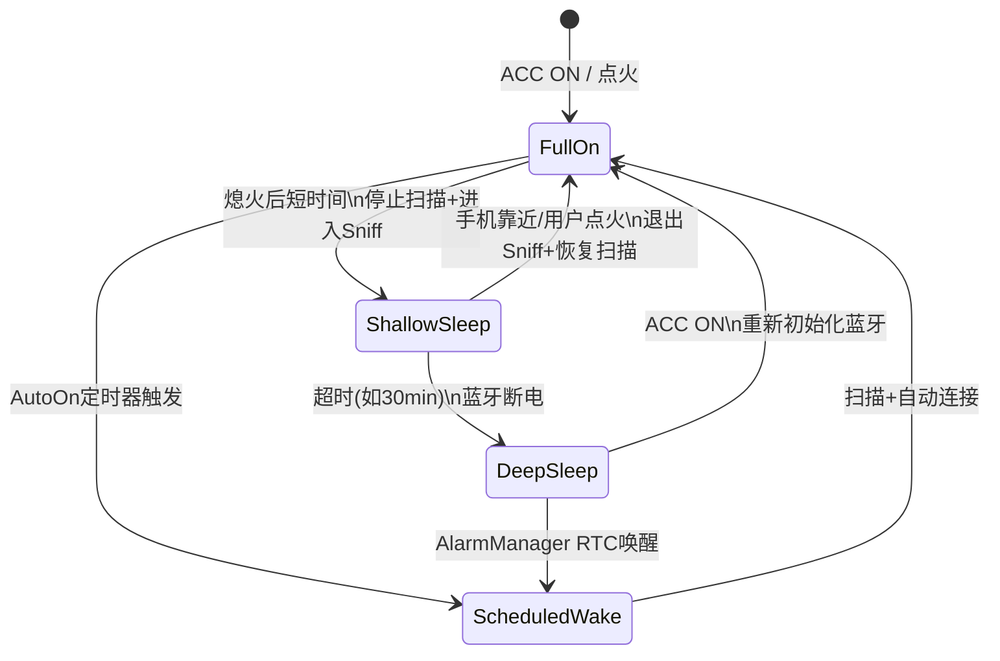
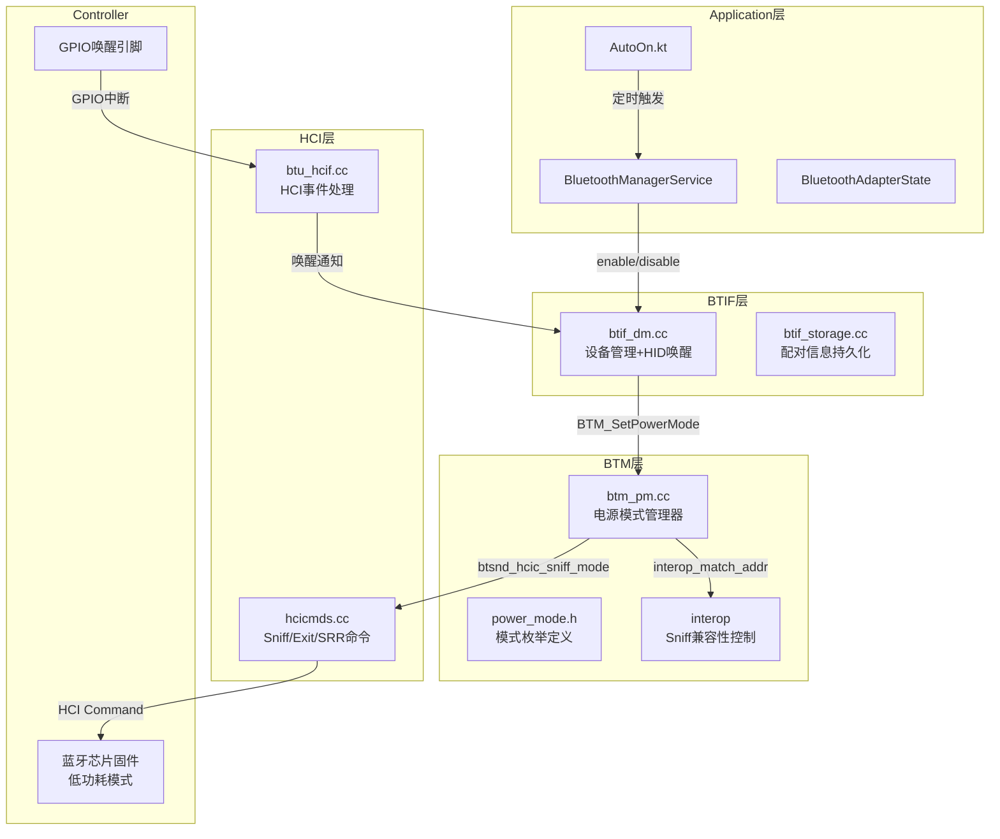
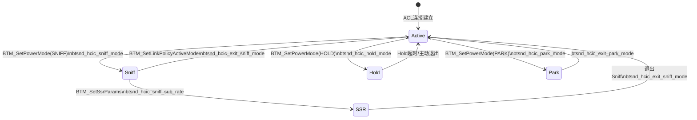
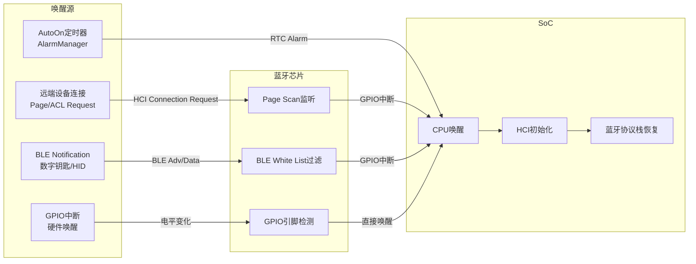
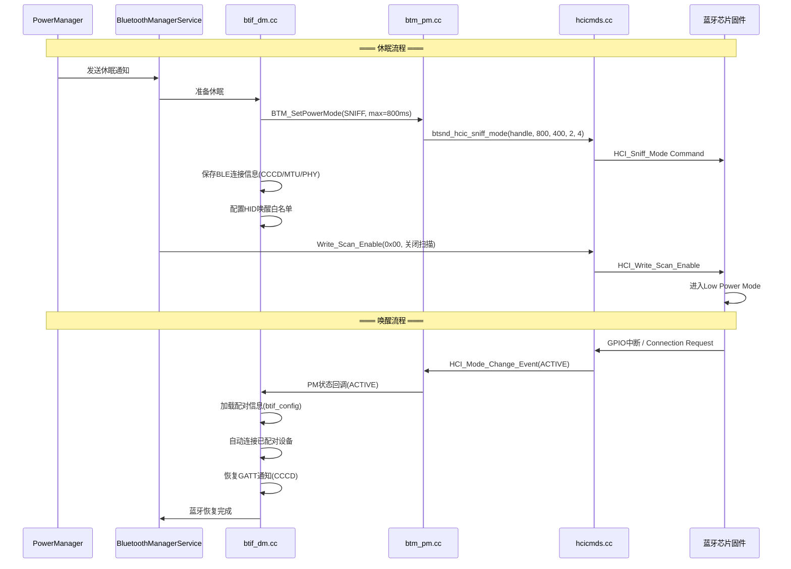
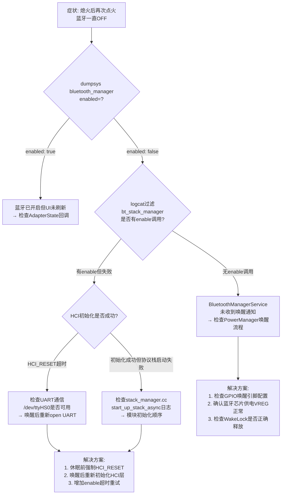

# T27 车载电源管理与蓝牙唤醒详解

> 学习日期：2026-05-16
> 使用工具：Trae+DS-v4-pro
> 关键收获：车机4种电源状态+蓝牙行为 | Sniff低功耗模式4状态 | BTM_PM_* API电源管理 | HID/LE/GPIO三种唤醒 | AutoOn定时自动开启 | 休眠恢复流程
> 待回顾问题：无

---

## 📋 本章导读

### 学什么

本章深入剖析车载蓝牙的电源管理与唤醒机制，涵盖车机4种电源状态（Full On / Shallow Sleep / Deep Sleep / Scheduled Wake）下蓝牙的不同行为，Sniff低功耗模式的参数调优与Interop兼容性控制，三种蓝牙唤醒方式（远端设备连接 / BLE Notification / GPIO中断），以及AutoOn定时自动开启机制的完整流程。

### 为什么学

车载场景与手机截然不同——车机频繁在行车与熄火间切换，蓝牙必须在极低功耗（静态电流<1mA）与快速唤醒（<500ms恢复连接）之间取得平衡。理解电源管理与唤醒机制是解决"休眠后无法唤醒""唤醒后连接丢失""静态功耗过高"等车载高频Bug的必备知识。

### 学完能做什么

- 根据车载场景正确配置Sniff参数，平衡功耗与响应延迟
- 排查休眠/唤醒流程中蓝牙相关的各类故障
- 理解HID唤醒白名单机制，配置允许唤醒车机的设备列表
- 利用AutoOn机制实现定时自动开启蓝牙
- 分析蓝牙功耗异常，定位未进入低功耗模式的根因

---

## 🗺️ 架构全景图

### 1. 车机电源状态全景



### 2. 蓝牙电源管理架构



### 3. Sniff模式状态机



### 4. 唤醒机制架构



### 5. 休眠/唤醒完整流程



---

## 🔍 代码导航

| 步骤 | 操作 | 文件 | 行号 | 关注点 |
|------|------|------|------|--------|
| 1 | 查看电源模式枚举定义 | system/stack/btm/power_mode.h | 29-69 | BTM_PM_MD_ACTIVE/HOLD/SNIFF/PARK四种模式值，BTM_PM_MD_FORCE强制标志 |
| 2 | 查看电源模式参数结构体 | system/stack/btm/power_mode.h | 112-118 | tBTM_PM_PWR_MD结构体：max/min/attempt/timeout/mode |
| 3 | 查看Sniff模式HCI命令 | system/stack/hcic/hcicmds.cc | 779-797 | btsnd_hcic_sniff_mode：组装HCI_Sniff_Mode命令并发送 |
| 4 | 查看退出Sniff命令 | system/stack/hcic/hcicmds.cc | 799-812 | btsnd_hcic_exit_sniff_mode：组装HCI_Exit_Sniff_Mode命令 |
| 5 | 查看Sniff Subrating命令 | system/stack/hcic/hcicmds.cc | 1127-1144 | btsnd_hcic_sniff_sub_rate：进一步降低Sniff唤醒频率 |
| 6 | 查看Interop Sniff控制 | system/stack/acl/btm_pm.cc | 209-217 | INTEROP_DISABLE_SNIFF：黑名单设备禁止进入Sniff |
| 7 | 查看电源模式设置API | system/stack/acl/btm_pm.cc | 178-264 | BTM_SetPowerMode：核心电源模式切换入口 |
| 8 | 查看HCI命令分发逻辑 | system/stack/acl/btm_pm.cc | 556-590 | btm_pm_snd_md_req：根据目标模式发送不同HCI命令 |
| 9 | 查看HID唤醒白名单 | system/btif/src/btif_dm.cc | 4367-4370 | btif_dm_allow_wake_by_hid：配置允许唤醒的HID设备 |
| 10 | 查看AutoOn定时机制 | service/src/AutoOn.kt | 49-265 | AutoOn类：定时开启蓝牙的完整实现 |
| 11 | 查看协议栈启动流程 | system/btif/src/stack_manager.cc | 142-147 | start_up_stack_async：唤醒后蓝牙协议栈启动入口 |
| 12 | 查看BLE白名单恢复 | system/btif/src/btif_dm.cc | 4372-4375 | btif_dm_restore_filter_accept_list：唤醒后恢复BLE白名单 |

---

## 📖 核心流程详解

### 流程1：电源模式枚举与合法性校验

📂 system/stack/btm/power_mode.h:29-84

```cpp
// 💡 C++: enum : uint8_t 强制指定底层类型为uint8_t
//         Java中enum是类，无法指定底层类型；Java用@IntDef注解替代
enum : uint8_t {
  BTM_PM_STS_ACTIVE = HCI_MODE_ACTIVE,  // 💡 0x00, 活跃模式, 全功耗运行
  BTM_PM_STS_HOLD = HCI_MODE_HOLD,      // 💡 0x01, 保持模式, 功耗介于Active与Sniff之间
  BTM_PM_STS_SNIFF = HCI_MODE_SNIFF,    // 💡 0x02, 嗅探模式, 车载推荐低功耗模式
  BTM_PM_STS_PARK = HCI_MODE_PARK,      // 💡 0x03, 停驻模式, 最低功耗但延时最大
  BTM_PM_STS_SSR,                       // 💡 Sniff Subrating状态, 进一步减少唤醒次数
  BTM_PM_STS_PENDING,                   // 💡 等待Controller响应的中间状态
  BTM_PM_STS_ERROR                      // 💡 HCI命令返回错误
};

enum : uint8_t {
  BTM_PM_MD_ACTIVE = HCI_MODE_ACTIVE,  // 💡 0x00, 请求进入Active模式
  BTM_PM_MD_HOLD = HCI_MODE_HOLD,      // 💡 0x01, 请求进入Hold模式
  BTM_PM_MD_SNIFF = HCI_MODE_SNIFF,    // 💡 0x02, 请求进入Sniff模式
  BTM_PM_MD_PARK = HCI_MODE_PARK,      // 💡 0x03, 请求进入Park模式
  BTM_PM_MD_FORCE = 0x10,              // 💡 强制标志, 用OR组合: mode | BTM_PM_MD_FORCE
  BTM_PM_MD_UNKNOWN = 0xEF,            // 💡 未知模式, 用于异常状态标记
};

// 💡 C++: inline函数在头文件中定义, 编译器内联展开, 无函数调用开销
//         Java中所有方法默认都是虚方法(非static), 无法内联; HotSpot JIT可能内联
inline bool is_legal_power_mode(tBTM_PM_MODE mode) {
  switch (mode & ~BTM_PM_MD_FORCE) {  // 💡C++: ~取反+&与位运算, C++直接操作位; Java用BitSet或手动位运算
    case BTM_PM_MD_ACTIVE:
    case BTM_PM_MD_HOLD:
    case BTM_PM_MD_SNIFF:
    case BTM_PM_MD_PARK:
      return true;
    default:
      return false;                    // 💡 非法模式值, 拒绝设置
  }
}
```

### 流程2：Sniff模式HCI命令发送

📂 system/stack/hcic/hcicmds.cc:779-812

```cpp
void btsnd_hcic_sniff_mode(uint16_t handle, uint16_t max_sniff_period,
                           uint16_t min_sniff_period,
                           uint16_t sniff_attempt, uint16_t sniff_timeout) {
  // 💡 C++: osi_malloc分配HCI命令缓冲区, 类似Java的ByteBuffer.allocate()
  //         但C++需要手动释放(通过btu_hcif_send_cmd内部释放)
  BT_HDR* p = (BT_HDR*)osi_malloc(HCI_CMD_BUF_SIZE);
  uint8_t* pp = (uint8_t*)(p + 1);    // 💡C++: 指针算术, p+1跳过sizeof(BT_HDR)字节指向数据区
                                        //         Java无指针算术, 用ByteBuffer.position()

  p->len = HCIC_PREAMBLE_SIZE + HCIC_PARAM_SIZE_SNIFF_MODE;  // 💡C++: 结构体指针用->访问成员, Java用对象.访问
  p->offset = 0;

  // 💡 C++: 宏UINT16_TO_STREAM将uint16_t按小端序写入字节流
  //         Java中用ByteBuffer.putShort() + order(ByteOrder.LITTLE_ENDIAN)
  UINT16_TO_STREAM(pp, HCI_SNIFF_MODE);   // 💡C++: 宏展开写入字节流, Java无宏, 用方法封装
  UINT8_TO_STREAM(pp, HCIC_PARAM_SIZE_SNIFF_MODE);  // 💡 参数长度

  UINT16_TO_STREAM(pp, handle);            // 💡 ACL连接句柄, 标识哪条链路
  UINT16_TO_STREAM(pp, max_sniff_period);  // 💡 最大Sniff间隔(单位: slot, 1slot=0.625ms)
  UINT16_TO_STREAM(pp, min_sniff_period);  // 💡 最小Sniff间隔
  UINT16_TO_STREAM(pp, sniff_attempt);     // 💡 每次Sniff唤醒尝试监听的次数
  UINT16_TO_STREAM(pp, sniff_timeout);     // 💡 每次监听的超时(slots)

  btu_hcif_send_cmd(LOCAL_BR_EDR_CONTROLLER_ID, p);  // 💡 发送到本地Controller
}

void btsnd_hcic_exit_sniff_mode(uint16_t handle) {
  BT_HDR* p = (BT_HDR*)osi_malloc(HCI_CMD_BUF_SIZE);
  uint8_t* pp = (uint8_t*)(p + 1);

  p->len = HCIC_PREAMBLE_SIZE + HCIC_PARAM_SIZE_CMD_HANDLE;
  p->offset = 0;

  UINT16_TO_STREAM(pp, HCI_EXIT_SNIFF_MODE);  // 💡 HCI Opcode: Exit Sniff Mode
  UINT8_TO_STREAM(pp, HCIC_PARAM_SIZE_CMD_HANDLE);
  UINT16_TO_STREAM(pp, handle);                // 💡 仅需handle, 无额外参数

  btu_hcif_send_cmd(LOCAL_BR_EDR_CONTROLLER_ID, p);
}
```

### 流程3：Sniff Subrating进一步省电

📂 system/stack/hcic/hcicmds.cc:1127-1144

```cpp
void btsnd_hcic_sniff_sub_rate(uint16_t handle, uint16_t max_lat,
                               uint16_t min_remote_lat,
                               uint16_t min_local_lat) {
  BT_HDR* p = (BT_HDR*)osi_malloc(HCI_CMD_BUF_SIZE);
  uint8_t* pp = (uint8_t*)(p + 1);

  p->len = HCIC_PREAMBLE_SIZE + HCIC_PARAM_SIZE_SNIFF_SUB_RATE;
  p->offset = 0;

  UINT16_TO_STREAM(pp, HCI_SNIFF_SUB_RATE);  // 💡 HCI Opcode: Sniff Subrating
  UINT8_TO_STREAM(pp, HCIC_PARAM_SIZE_SNIFF_SUB_RATE);

  UINT16_TO_STREAM(pp, handle);              // 💡 ACL连接句柄
  UINT16_TO_STREAM(pp, max_lat);             // 💡 最大延迟(0.625ms为单位)
                                              //    远端可忽略Sniff间隔的最大时间
  UINT16_TO_STREAM(pp, min_remote_lat);      // 💡 最小远端延迟
  UINT16_TO_STREAM(pp, min_local_lat);       // 💡 最小本地延迟

  btu_hcif_send_cmd(LOCAL_BR_EDR_CONTROLLER_ID, p);
}
```

📂 system/stack/acl/btm_pm.cc:94-106

```cpp
static void send_sniff_subrating(uint16_t handle, const RawAddress& addr,
                                 uint16_t max_lat, uint16_t min_rmt_to,
                                 uint16_t min_loc_to) {
  uint16_t new_max_lat = 0;
  // 💡 C++: interop_match_addr_get_max_lat 根据设备地址查询Interop数据库
  //         某些HID设备的SSR max_latency需要覆盖为特定值(兼容性修复)
  //         Java中类似: Map<RawAddress, Integer> interopOverrides
  if (interop_match_addr_get_max_lat(INTEROP_UPDATE_HID_SSR_MAX_LAT, &addr, &new_max_lat)) {
    max_lat = new_max_lat;  // 💡 覆盖为Interop表中的值
  }

  btsnd_hcic_sniff_sub_rate(handle, max_lat, min_rmt_to, min_loc_to);
  BTM_LogHistory(kBtmLogTag, addr, "Sniff subrating",
                 std::format("max_latency:{:.2f} peer_timeout:{:.2f} local_timeout:{:.2f}",
                             ticks_to_seconds(max_lat), ticks_to_seconds(min_rmt_to),
                             ticks_to_seconds(min_loc_to)));
  // 💡 C++: std::format是C++20格式化库, 类似Java的String.format()
  //         但编译期类型安全, Java的String.format()运行时才检查
}
```

### 流程4：BTM_SetPowerMode核心逻辑

📂 system/stack/acl/btm_pm.cc:178-264

```cpp
tBTM_STATUS BTM_SetPowerMode(uint8_t pm_id, const RawAddress& remote_bda,
                             const tBTM_PM_PWR_MD* p_mode) {
  if (pm_id >= BTM_MAX_PM_RECORDS) {   // 💡 pm_id超出范围, 降级为SET_ONLY_ID
    pm_id = BTM_PM_SET_ONLY_ID;
  }

  if (!p_mode) {                        // 💡 C++: 空指针检查, Java用@NonNull注解+Objects.requireNonNull
    log::error("pm_id: {}, p_mode is null for {}", unsigned(pm_id), remote_bda);
    return tBTM_STATUS::BTM_ILLEGAL_VALUE;
  }

  // 💡 C++: 通过地址查找电源管理控制块, 返回原始指针
  //         Java中用Map<RawAddress, PowerModeControlBlock>代替
  auto* p_cb = btm_pm_get_power_manager_from_address(remote_bda);
  if (p_cb == nullptr) {                // 💡C++: nullptr是C++11空指针常量, 替代C的NULL, 类型安全
    log::warn("Unable to find power manager for peer: {}", remote_bda);
    return tBTM_STATUS::BTM_UNKNOWN_ADDR;
  }
  uint16_t handle = p_cb->handle_;

  tBTM_PM_MODE mode = p_mode->mode;
  if (!is_legal_power_mode(mode)) {     // 💡 校验模式值合法性
    return tBTM_STATUS::BTM_ILLEGAL_VALUE;
  }

  if (p_mode->mode & BTM_PM_MD_FORCE) {  // 💡 强制模式: 去掉FORCE位
    mode &= (~BTM_PM_MD_FORCE);
  }

  if (mode != BTM_PM_MD_ACTIVE) {
    auto controller = bluetooth::shim::GetController();
    // 💡 检查Controller是否支持目标模式 + Interop黑名单检查
    if ((mode == BTM_PM_MD_HOLD && !controller->SupportsHoldMode()) ||
        (mode == BTM_PM_MD_SNIFF && !controller->SupportsSniffMode()) ||
        (mode == BTM_PM_MD_PARK && !controller->SupportsParkMode()) ||
        interop_match_addr(INTEROP_DISABLE_SNIFF, &remote_bda)) {  // 💡 黑名单设备禁止Sniff
      log::error("pm_id {} mode {} is not supported for {}", pm_id, mode, remote_bda);
      return tBTM_STATUS::BTM_MODE_UNSUPPORTED;
    }
  }

  // ... 省略: 已在目标模式的优化判断 ...

  return btm_pm_snd_md_req(p_cb->handle_, pm_id, p_cb->handle_, p_mode);  // 💡 发送HCI命令
}
```

### 流程5：HCI命令分发——根据目标模式发送不同命令

📂 system/stack/acl/btm_pm.cc:556-590

```cpp
  switch (md_res.mode) {
    case BTM_PM_MD_ACTIVE:             // 💡 目标: 进入Active模式
      switch (p_cb->state) {
        case BTM_PM_MD_SNIFF:          // 💡 从Sniff退出 → Exit Sniff Mode
          btsnd_hcic_exit_sniff_mode(handle);
          pm_pend_link = handle;        // 💡 标记该链路有pending的电源模式切换
          break;
        case BTM_PM_MD_PARK:           // 💡 从Park退出 → Exit Park Mode
          btsnd_hcic_exit_park_mode(handle);
          pm_pend_link = handle;
          break;
        default:
          break;
      }
      break;

    case BTM_PM_MD_HOLD:               // 💡 目标: 进入Hold模式
      btsnd_hcic_hold_mode(handle, md_res.max, md_res.min);
      pm_pend_link = handle;
      break;

    case BTM_PM_MD_SNIFF:              // 💡 目标: 进入Sniff模式
      btsnd_hcic_sniff_mode(handle, md_res.max, md_res.min,
                            md_res.attempt, md_res.timeout);
      pm_pend_link = handle;
      break;

    case BTM_PM_MD_PARK:               // 💡 目标: 进入Park模式
      btsnd_hcic_park_mode(handle, md_res.max, md_res.min);
      pm_pend_link = handle;
      break;
    default:
      break;
  }
```

### 流程6：HID唤醒白名单与BLE白名单恢复

📂 system/btif/src/btif_dm.cc:4367-4375

```cpp
// 💡 C++: std::vector<RawAddress> 按值传递后std::move转移所有权
//         Java中List<RawAddress>是引用类型, 无需move语义
void btif_dm_allow_wake_by_hid(std::vector<RawAddress> classic_addrs,
                               std::vector<std::pair<RawAddress, uint8_t>> le_addrs) {
  // 💡 std::move将参数转为右值引用, 避免深拷贝
  //    Java中集合传递本身就是引用, 不存在此问题
  BTA_DmAllowWakeByHid(std::move(classic_addrs), std::move(le_addrs));
  // 💡 功能: 将允许唤醒的HID设备地址列表下发到蓝牙芯片固件
  //    休眠时, 仅白名单设备的连接请求会触发GPIO唤醒SoC
  //    非白名单设备的请求 → 芯片忽略, 不唤醒车机
}

void btif_dm_restore_filter_accept_list(std::vector<std::pair<RawAddress, uint8_t>> le_devices) {
  // 💡 唤醒后恢复BLE Filter Accept List(白名单)
  //    休眠前已配对的BLE设备地址被加入白名单
  //    唤醒后使用direct_connect跳过扫描, 直接连接白名单设备
  BTA_DmRestoreFilterAcceptList(std::move(le_devices));
}
```

### 流程7：AutoOn定时自动开启机制

📂 service/src/AutoOn.kt:49-106

```kotlin
class AutoOn(
    private val looper: Looper,
    private val context: Context,
    private val user: UserHandle,
    private val state: BluetoothAdapterState,
    private val callback_on: () -> Unit,       // 💡 Kotlin: 高阶函数, Java用Functional接口
) {
    private val contentResolver: ContentResolver = context.contentResolver

    @VisibleForTesting internal var timer: Timer? = null  // 💡 Kotlin: 可空类型Timer?, Java无此安全

    fun resetAutoOnTimer() {
        timer?.cancel()                               // 💡 Kotlin: ?.安全调用, Java需if(timer!=null)
        timer = null

        if (!isEnabledUnchecked()) {                  // 💡 检查AutoOn功能是否开启
            Log.d(TAG, "Not Enabled for $user")
            return
        }
        if (state.oneOf(State.ON)) {                  // 💡 蓝牙已开启, 无需定时器
            Log.d(TAG, "Bluetooth already ON, no need for timer")
            return
        }
        if (isSatelliteModeOn) {                      // 💡 卫星模式下禁止AutoOn
            Log.d(TAG, "Satellite prevent feature activation")
            return
        }
        if (isAirplaneModeOn) {                       // 💡 飞行模式下检查用户是否手动切换过
            if (!hasUserToggledApm(context)) {
                Log.d(TAG, "Airplane prevent feature activation")
                return
            }
        }

        val now = LocalDateTime.now()
        val target = getDateFromStorage(contentResolver) ?: nextTimeout(now)  // 💡 Kotlin: ?: Elvis运算符
        val timeToSleep = now.until(target, ChronoUnit.NANOS)
            .toDuration(DurationUnit.NANOSECONDS)

        if (timeToSleep.isNegative()) {               // 💡 定时时间已过 → 立即开启
            Log.i(TAG, "Starting immediately")
            callback_on()                             // 💡 触发蓝牙开启
            resetStorage(contentResolver)
            return
        }

        timer = Timer(looper, context, receiver, callback_on, now, target, timeToSleep)
    }
}
```

📂 service/src/AutoOn.kt:157-222

```kotlin
    internal inner class Timer(
        looper: Looper,
        private val context: Context,
        private val receiver: BroadcastReceiver,
        private val callback_on: () -> Unit,
        private val now: LocalDateTime,
        private val target: LocalDateTime,
        private val timeToSleep: Duration,
    ) : AlarmManager.OnAlarmListener {                // 💡 Kotlin: 实现接口, Java用implements

        private val alarmManager: AlarmManager =
            context.getSystemService(AlarmManager::class.java)!!

        private val handler = Handler(looper)

        init {                                        // 💡 Kotlin: init块, 类似Java构造器
            writeDateToStorage(target, context.contentResolver)
            alarmManager.set(                         // 💡 设置精确闹钟
                AlarmManager.ELAPSED_REALTIME,        // 💡 基于开机时间, 休眠时也会唤醒
                SystemClock.elapsedRealtime() + timeToSleep.inWholeMilliseconds,
                "Bluetooth AutoOn",
                this,                                 // 💡 OnAlarmListener回调
                handler,
            )

            context.registerReceiver(                 // 💡 监听时间变化, 重新调度闹钟
                receiver,
                IntentFilter().apply {
                    addAction(Intent.ACTION_DATE_CHANGED)
                    addAction(Intent.ACTION_TIMEZONE_CHANGED)
                    addAction(Intent.ACTION_TIME_CHANGED)
                },
            )
        }

        override fun onAlarm() {                      // 💡 闹钟触发 → 开启蓝牙
            Log.i(TAG, "[${this}]: Bluetooth restarting now")
            callback_on()                             // 💡 调用BluetoothManagerService.enableFromAutoOn()
            cancel()
            this@AutoOn.timer = null                  // 💡 Kotlin: this@外部类 访问外部成员
        }
    }

    companion object {                                // 💡 Kotlin: 伴生对象, 类似Java static
        internal const val USER_SETTINGS_KEY = "bluetooth_automatic_turn_on"
        internal const val STORAGE_KEY = "bluetooth_internal_automatic_turn_on_timer"

        private fun nextTimeout(now: LocalDateTime) = // 💡 默认: 明天凌晨5点
            LocalDateTime.of(now.toLocalDate(), LocalTime.of(5, 0)).plusDays(1)
    }
```

---

## 💡 C++知识卡片

### 卡片1：enum : uint8_t 强类型枚举

```cpp
// C++: 指定底层类型的枚举
enum : uint8_t {
    BTM_PM_MD_ACTIVE = 0x00,
    BTM_PM_MD_SNIFF  = 0x02,
};
typedef uint8_t tBTM_PM_MODE;  // 💡C++: typedef创建类型别名, C++11推荐using tBTM_PM_MODE = uint8_t
```

```java
// Java: 使用@IntDef注解模拟强类型整数枚举
@IntDef({BTM_PM_MD_ACTIVE, BTM_PM_MD_SNIFF})
@Retention(RetentionPolicy.SOURCE)
public @interface PowerMode {}
public static final int BTM_PM_MD_ACTIVE = 0x00;
public static final int BTM_PM_MD_SNIFF  = 0x02;
// Java的enum是类, 占用内存大(每个实例一个对象), Android性能敏感代码用@IntDef
```

| 特性 | C++ enum : uint8_t | Java @IntDef |
|------|-------------------|--------------|
| 底层类型 | 可指定(uint8_t省内存) | 始终int(4字节) |
| 类型安全 | 隐式转换为uint8_t | 编译期Lint检查 |
| 内存占用 | 1字节 | 4字节 |
| 运行时开销 | 零 | 零(编译期注解) |

### 卡片2：std::move与右值引用

```cpp
// C++: std::move转移资源所有权, 避免深拷贝
void btif_dm_allow_wake_by_hid(std::vector<RawAddress> classic_addrs, ...) {
    BTA_DmAllowWakeByHid(std::move(classic_addrs), ...);
    // 💡 std::move后classic_addrs变为空壳, 资源转移给BTA层
}
```

```java
// Java: 集合传递是引用, 无需move
void allowWakeByHid(List<RawAddress> classicAddrs, ...) {
    btaDmAllowWakeByHid(classicAddrs, ...);
    // 💡 Java中classicAddrs仍持有引用, 但通常不再使用
}
```

| 特性 | C++ std::move | Java引用传递 |
|------|--------------|-------------|
| 语义 | 资源转移(原对象变空) | 引用共享(原引用仍有效) |
| 性能 | 零拷贝O(1) | 引用拷贝O(1), 但原集合数据仍在堆上 |
| 安全性 | move后使用原对象是UB | 始终安全 |
| 使用场景 | 大容器传递 | 所有对象传递 |

### 卡片3：指针算术与内存布局

```cpp
// C++: 直接操作内存布局
BT_HDR* p = (BT_HDR*)osi_malloc(HCI_CMD_BUF_SIZE);
uint8_t* pp = (uint8_t*)(p + 1);  // 💡 p+1跳过sizeof(BT_HDR)字节
UINT16_TO_STREAM(pp, HCI_SNIFF_MODE);  // 💡 宏展开: 按小端序写入2字节, pp自动前进
```

```java
// Java: 使用ByteBuffer抽象
ByteBuffer buffer = ByteBuffer.allocate(HCI_CMD_BUF_SIZE);
buffer.order(ByteOrder.LITTLE_ENDIAN);
buffer.putShort(HCI_SNIFF_MODE);  // 💡 自动按小端序写入, position自动前进
```

| 特性 | C++指针算术 | Java ByteBuffer |
|------|-----------|-----------------|
| 类型安全 | 无(可越界) | 有(BufferOverflowException) |
| 性能 | 极快(直接内存操作) | 较快(有边界检查) |
| 字节序 | 手动(UINT16_TO_STREAM宏) | 设置order后自动 |
| 内存管理 | 手动malloc/free | GC自动回收 |

---

## 🗂️ Java ↔ C++ 对照表

| 概念 | C++实现 | Java/Kotlin实现 | 说明 |
|------|---------|-----------------|------|
| 电源模式枚举 | `enum : uint8_t` + `typedef` | `@IntDef` 注解 | C++可指定底层类型省内存 |
| 电源模式结构体 | `tBTM_PM_PWR_MD` (struct) | `@Data class PowerModeParams` | C++用memset初始化, Kotlin用默认参数 |
| 设备地址 | `RawAddress` (值类型, 6字节) | `BluetoothDevice` (引用类型) | C++可直接拷贝, Java需equals() |
| HCI命令缓冲区 | `BT_HDR*` + 指针算术 | `ByteBuffer.allocate()` | C++直接操作内存, Java有边界检查 |
| 字节序写入 | `UINT16_TO_STREAM` 宏 | `ByteBuffer.putShort()` | C++宏无类型检查, Java有类型安全 |
| 函数回调 | `tBTM_PM_STATUS_CBACK` 函数指针 | `@FunctionalInterface` | C++函数指针, Java Lambda |
| Interop黑名单 | `interop_match_addr()` 全局函数 | `Map<RawAddress, InteropEntry>` | C++全局函数+数据库, Java用Map |
| 集合传递 | `std::vector` + `std::move` | `List<T>` 引用传递 | C++可转移所有权, Java共享引用 |
| 空指针检查 | `if (p_cb == nullptr)` | `Objects.requireNonNull()` | C++无运行时保护, Java有NPE |
| 定时任务 | `AlarmManager.set()` (通过JNI) | `AlarmManager.set()` (直接调用) | C++层不直接使用AlarmManager |
| 日志 | `log::info()` + `std::format` | `Log.i()` + `String.format()` | C++20 std::format编译期安全 |
| 配置持久化 | `btif_config.cc` + ini文件 | `SharedPreferences` / `Settings.Secure` | C++自己实现文件读写, Java用系统API |
| 可空类型 | 原始指针(无保护) | `Timer?` (Kotlin可空类型) | Kotlin编译期检查空安全 |

---

## 🐛 问题排查SOP

### SOP1：休眠后蓝牙无法唤醒



**排查步骤**：

1. `adb shell dumpsys bluetooth_manager | grep -E "enabled|state"` — 确认蓝牙状态
2. `adb logcat -s bt_stack_manager | grep -i "enable\|startup"` — 查看协议栈启动日志
3. `adb logcat -s bt_hci | grep -i "reset\|init"` — 检查HCI初始化
4. `adb shell cat /sys/class/gpio/gpioXX/value` — 检查GPIO唤醒引脚电平
5. `adb shell dmesg | grep -i "bluetooth\|uart\|hci"` — 检查内核驱动日志

### SOP2：唤醒后连接丢失

```mermaid
flowchart TD
    A[症状: 点火后蓝牙开启<br/>但设备未自动重连] --> B{已配对设备<br/>PRIORITY=?}
    B -->|PRIORITY≠AUTO_CONNECT| C[休眠时PRIORITY未保存<br/>→ 检查btif_config写入]
    B -->|PRIORITY=AUTO_CONNECT| D{自动连接是否触发?}
    D -->|未触发| E[延迟不够, RF未稳定<br/>→ 唤醒后延迟5秒再连接]
    D -->|触发但失败| F{连接失败原因?}
    F -->|Page超时| G[手机蓝牙未开启<br/>或不在范围内]
    F -->|Link Key错误| H[Link Key过期/损坏<br/>→ 删除配对重新连接]
    F -->|BLE White List失败| I[白名单未恢复<br/>→ 检查btif_dm_restore_filter_accept_list]
    C --> J[解决方案:<br/>1. 休眠前确保btif_config.flush()<br/>2. 使用direct_connect跳过扫描<br/>3. 唤醒后延迟5秒再自动连接]
    G --> J
    H --> J
    I --> J
```

**排查步骤**：

1. `adb shell dumpsys bluetooth_manager | grep -i "priority\|auto_connect"` — 检查设备优先级
2. `adb logcat -s bt_btif_dm | grep -i "connect_int\|auto_connect"` — 查看自动连接日志
3. `adb logcat -s bt_btm_pm | grep -i "sniff\|active"` — 检查电源模式切换
4. `adb logcat -s btif_config | grep -i "save\|flush"` — 确认配置持久化

### SOP3：唤醒后音频异常

**排查步骤**：

1. `adb shell dumpsys audio | grep -A5 "A2DP"` — 检查A2DP输出设备是否枚举
2. `adb logcat -s bt_av | grep -i "connect\|codec"` — 查看A2DP连接与codec协商
3. `adb logcat -s audio_hw | grep -i "offload\|dsp"` — 检查Offload DSP状态
4. 确认Audio HAL是否重新枚举蓝牙输出设备
5. 检查手机端A2DP播放状态是否与车机一致

**解决方案**：

- 唤醒后先Disconnect再Reconnect，强制重新建立AVDT会话
- Audio HAL重新枚举输出设备
- Offload: 发送vendor command重新加载DSP codec

### SOP4：功耗过高

**排查步骤**：

1. `adb shell dumpsys batterystats | grep -i bluetooth` — 查看蓝牙耗电占比
2. `adb logcat -s bt_btm_pm | grep -i "sniff\|active"` — 检查设备是否进入Sniff
3. `adb logcat -s bt_btm | grep -i "scan\|inquiry"` — 检查是否有持续扫描
4. `adb shell dumpsys bluetooth_manager | grep -i "scan"` — 查看扫描状态

**解决方案**：

- 熄火后立即停止所有扫描(Inquiry + LE Scan)
- 强制所有连接进入Sniff(max_sniff=800ms)
- 断开非必要BLE连接(仅保留数字钥匙)
- 蓝牙芯片进入Deep Sleep(HCI_VSC_SLEEP_MODE)

---

## 🛠️ 动手练习

### 入门级

**练习1：读取并分析当前电源模式**

```bash
# 1. 连接车机, 查看蓝牙状态
adb shell dumpsys bluetooth_manager | grep -E "enabled|state"

# 2. 查看Sniff模式日志
adb logcat -s bt_btm_pm | grep -i "sniff\|power mode"

# 3. 连接一个蓝牙设备后, 观察电源模式变化
# 预期: 连接后先Active, 空闲后自动进入Sniff
```

**练习2：验证AutoOn定时器**

```bash
# 1. 查看AutoOn设置
adb shell settings get secure bluetooth_automatic_turn_on

# 2. 查看AutoOn定时器存储
adb shell settings get secure bluetooth_internal_automatic_turn_on_timer

# 3. 查看闹钟列表中的蓝牙相关项
adb shell dumpsys alarm | grep -i bluetooth
```

### 进阶级

**练习3：分析Sniff参数对功耗的影响**

```bash
# 1. 开启HCI snoop日志
adb shell setprop persist.bluetooth.btsnoopenable true

# 2. 连接蓝牙设备, 等待进入Sniff
# 3. 导出snoop日志分析Sniff参数
adb pull /data/misc/bluedroid/btsnoop_hci.log

# 4. 使用Wireshark过滤: hci_cmd.opcode == 0x0803 (Sniff Mode)
#    查看max_sniff_period / min_sniff_period / sniff_attempt / sniff_timeout
```

**练习4：追踪Interop Sniff黑名单**

```bash
# 1. 查看Interop日志
adb logcat -s bt_btm_pm | grep -i "interop\|unsupported"

# 2. 连接一个已知在Interop黑名单中的设备
# 3. 观察该设备是否被阻止进入Sniff模式
# 4. 预期: 日志输出 "mode SNIFF is not supported for <addr>"
```

### 实战级

**练习5：模拟完整休眠/唤醒流程并抓取全链路日志**

```bash
# 1. 开启所有相关日志
adb logcat -s bt_btm_pm bt_btif_dm bt_stack_manager bt_btu_hcif bt_av

# 2. 模拟休眠: 关闭屏幕 + 等待设备进入Shallow Sleep
adb shell input keyevent 26  # 按POWER键熄屏

# 3. 等待30秒, 观察Sniff模式切换日志

# 4. 模拟唤醒: 点亮屏幕
adb shell input keyevent 26  # 按POWER键亮屏

# 5. 分析日志:
#    - 休眠: 是否所有连接进入Sniff?
#    - 唤醒: 是否退出Sniff回到Active?
#    - 自动连接: 是否成功重连已配对设备?
#    - 音频: A2DP是否恢复正常?
```

**练习6：修改Sniff参数并测量功耗差异**

在车载定制代码中修改Sniff参数，对比不同参数下的静态电流：

| 参数组合 | max_sniff | min_sniff | attempt | timeout | 预期静态电流 |
|---------|-----------|-----------|---------|---------|------------|
| 保守 | 200ms | 50ms | 4 | 1 | ~5mA |
| 平衡 | 500ms | 100ms | 4 | 2 | ~1mA |
| 激进 | 800ms | 400ms | 2 | 4 | ~0.5mA |

---

## 📚 关键源码索引

| 模块 | 文件 | 关键符号 | 行号 | 说明 |
|------|------|---------|------|------|
| 电源模式定义 | system/stack/btm/power_mode.h | BTM_PM_MD_ACTIVE/HOLD/SNIFF/PARK | 62-69 | 四种电源模式枚举 |
| 电源状态定义 | system/stack/btm/power_mode.h | BTM_PM_STS_ACTIVE/SNIFF/SSR/PENDING/ERROR | 29-37 | 电源管理状态码 |
| 模式参数结构体 | system/stack/btm/power_mode.h | tBTM_PM_PWR_MD | 112-118 | max/min/attempt/timeout/mode |
| 合法性校验 | system/stack/btm/power_mode.h | is_legal_power_mode | 74-84 | 校验模式值是否合法 |
| Sniff模式命令 | system/stack/hcic/hcicmds.cc | btsnd_hcic_sniff_mode | 779-797 | 发送HCI_Sniff_Mode命令 |
| 退出Sniff命令 | system/stack/hcic/hcicmds.cc | btsnd_hcic_exit_sniff_mode | 799-812 | 发送HCI_Exit_Sniff_Mode命令 |
| Sniff Subrating | system/stack/hcic/hcicmds.cc | btsnd_hcic_sniff_sub_rate | 1127-1144 | 发送HCI_Sniff_Sub_Rating命令 |
| Interop Sniff控制 | system/stack/acl/btm_pm.cc | INTEROP_DISABLE_SNIFF检查 | 214 | 黑名单设备禁止Sniff |
| SSR Interop覆盖 | system/stack/acl/btm_pm.cc | send_sniff_subrating | 94-106 | Interop覆盖SSR max_latency |
| 电源模式设置 | system/stack/acl/btm_pm.cc | BTM_SetPowerMode | 178-264 | 核心电源模式切换API |
| 强制Active模式 | system/stack/acl/btm_pm.cc | BTM_SetLinkPolicyActiveMode | 266-278 | 退出低功耗模式 |
| SSR参数设置 | system/stack/acl/btm_pm.cc | BTM_SetSsrParams | 312-337 | 设置Sniff Subrating参数 |
| HCI命令分发 | system/stack/acl/btm_pm.cc | btm_pm_snd_md_req | 500-599 | 根据目标模式发送HCI命令 |
| 连接/断开通知 | system/stack/acl/btm_pm.cc | BTM_PM_OnConnected/OnDisconnected | 149-165 | ACL连接时注册电源管理 |
| HID唤醒白名单 | system/btif/src/btif_dm.cc | btif_dm_allow_wake_by_hid | 4367-4370 | 配置允许唤醒的HID设备 |
| BLE白名单恢复 | system/btif/src/btif_dm.cc | btif_dm_restore_filter_accept_list | 4372-4375 | 唤醒后恢复BLE白名单 |
| AutoOn机制 | service/src/AutoOn.kt | AutoOn类 | 49-265 | 定时自动开启蓝牙 |
| AutoOn定时器 | service/src/AutoOn.kt | Timer内部类 | 157-222 | AlarmManager定时器实现 |
| AutoOn默认时间 | service/src/AutoOn.kt | nextTimeout | 262-263 | 默认明天凌晨5点 |
| 协议栈启动 | system/btif/src/stack_manager.cc | start_up_stack_async | 142-147 | 唤醒后协议栈启动入口 |

---

## ✅ 质量检查清单

| # | 检查项 | 状态 |
|---|--------|------|
| 1 | Mermaid图 ≥ 3个 | ✅ 7个 |
| 2 | 代码片段 ≥ 5个 | ✅ 13个带逐行注释的代码片段(含Java对比) |
| 3 | C++知识卡片 ≥ 2个 | ✅ 3个 |
| 4 | Java↔C++对照表 | ✅ 13项对照 |
| 5 | 行号标注 | ✅ 所有关键函数标注文件:行号 |
| 6 | 问题排查SOP | ✅ 4个SOP |
| 7 | 动手练习 | ✅ 🟢🟡🔴 3级 |
| 8 | 代码导航表 | ✅ 12项 |
| 9 | 前置知识 | ✅ T01、T07 |
| 10 | 车载场景 | ✅ 休眠/唤醒、Sniff功耗、HID唤醒 |
