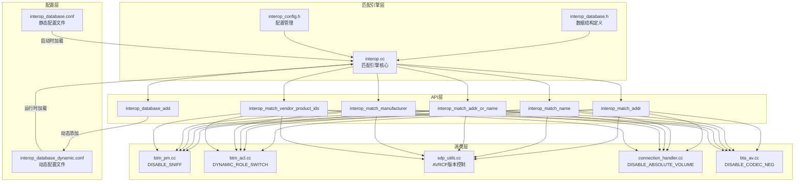
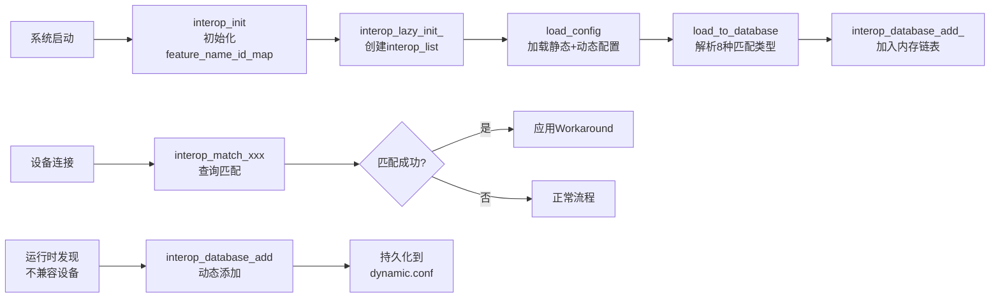
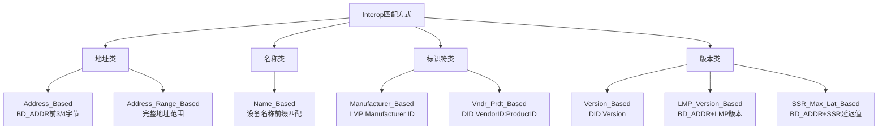
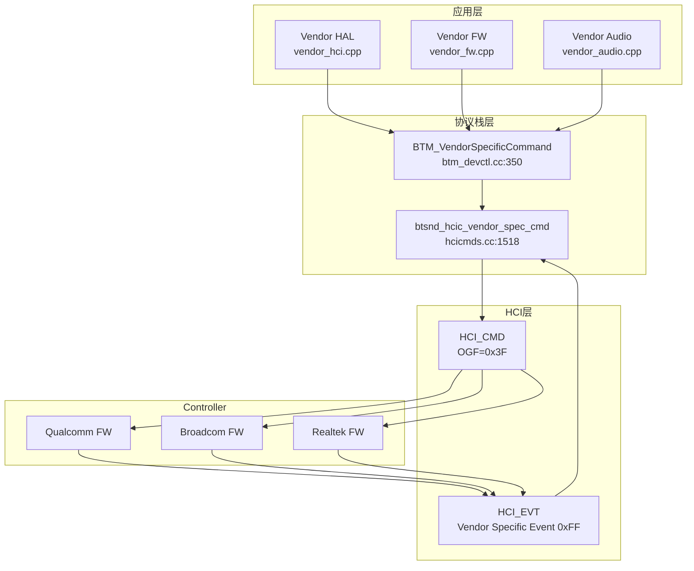
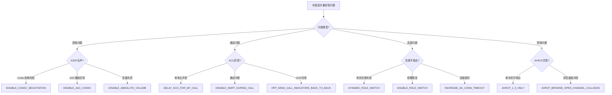
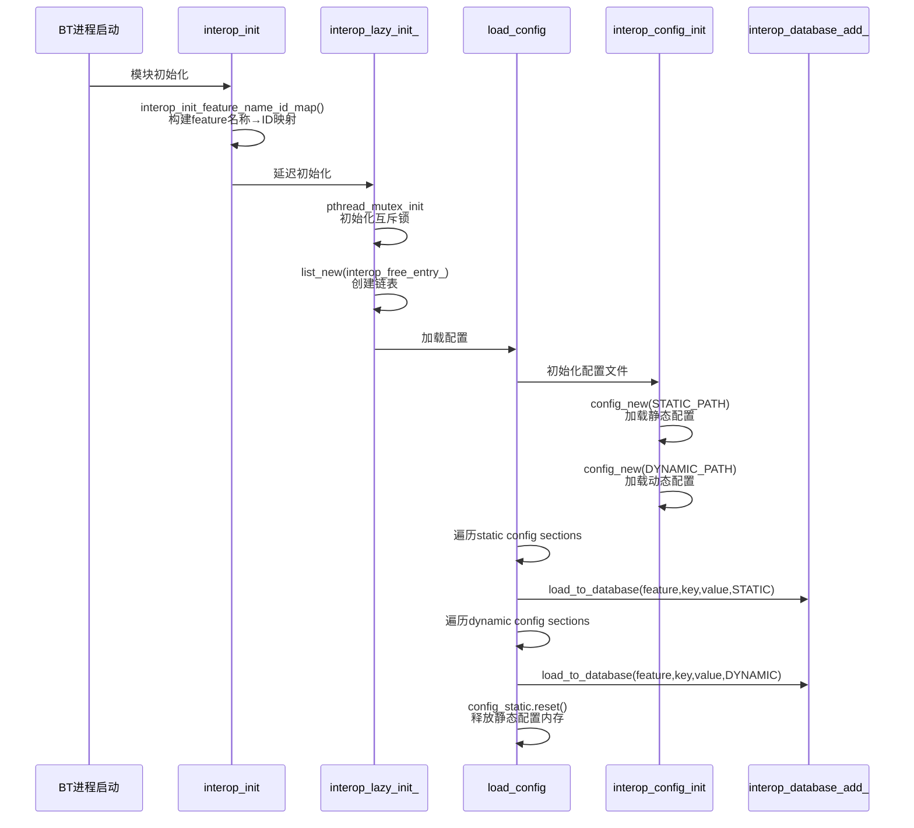
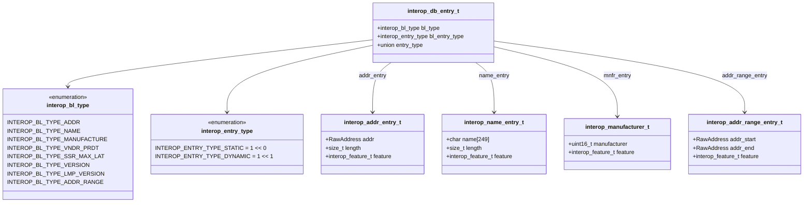
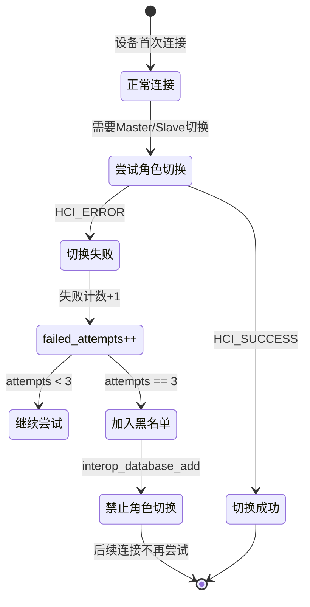

# T28 Interop兼容性与Vendor Command详解

> 学习日期：2026-05-16
> 使用工具：Trae+DS-v4-pro
> 关键收获：Interop 55+ Feature枚举 + 8种匹配方式(含SSR_Max_Lat/LMP_Version/Addr_Range) | 静态配置+动态学习双轨机制 | Vendor Specific Command (OGF=0x3F) | Qualcomm/Broadcom/Realtek VSC | 车载Interop实战Top10 | 自定义VSC集成
> 待回顾问题：如何为车载平台添加OEM私有Interop Feature并确保OTA升级兼容性

---

## 📋 本章导读

### 学什么

- **Interop系统**：Android蓝牙协议栈中用于解决不同厂商设备兼容性问题的Workaround框架，包含55+个Feature枚举、8种匹配方式和静态+动态双轨配置机制
- **Vendor Specific Command (VSC)**：HCI层厂商自定义命令机制(OGF=0x3F)，用于芯片厂商提供私有功能扩展，如固件下载、音频接口配置、共存策略等
- **车载实战场景**：手机品牌兼容性处理、UART波特率升级、WiFi共存配置、SCO PCM时钟配置等车载高频问题

### 为什么学

- 车载蓝牙面对的手机/车机品牌碎片化严重，**Interop是解决兼容性问题的核心机制**
- 车载芯片厂商(Qualcomm/Broadcom/Realtek)的VSC是**实现差异化功能的关键接口**
- 理解Interop和VSC是**定位和解决车载蓝牙兼容性问题的必备能力**

### 学完能做什么

- 能根据设备症状快速定位需要启用的Interop Feature
- 能在interop_database.conf中添加自定义匹配规则
- 能理解并使用VSC与蓝牙芯片进行私有交互
- 能为车载平台设计OEM私有Interop扩展方案

---

## 🗺️ 架构全景图

### 1. Interop系统整体架构



### 2. Interop数据流生命周期



### 3. 8种匹配方式层次结构



### 4. Vendor Specific Command架构



### 5. 车载Interop问题定位决策树



---

## 🔍 代码导航

| 步骤 | 操作 | 文件 | 行号 | 关注点 |
|------|------|------|------|--------|
| 1 | 查看Interop Feature枚举定义 | [interop.h](file:///d:/AndroidWorkspace/claudeProject/BT16Study/Bluetooth/system/device/include/interop.h) | L33-L390 | 55+个Feature枚举，注意END_OF_INTEROP_LIST前不可删除 |
| 2 | 查看Interop数据结构定义 | [interop_database.h](file:///d:/AndroidWorkspace/claudeProject/BT16Study/Bluetooth/system/device/include/interop_database.h) | L25-L52 | 5种entry结构体：addr/name/addr_range/manufacturer/hid_multitouch |
| 3 | 查看匹配引擎核心逻辑 | [interop.cc](file:///d:/AndroidWorkspace/claudeProject/BT16Study/Bluetooth/system/device/src/interop.cc) | L646-L766 | interop_database_match遍历链表按bl_type匹配 |
| 4 | 查看配置加载流程 | [interop.cc](file:///d:/AndroidWorkspace/claudeProject/BT16Study/Bluetooth/system/device/src/interop.cc) | L1126-L1157 | load_config加载静态+动态配置文件 |
| 5 | 查看静态配置数据库 | [interop_database.conf](file:///d:/AndroidWorkspace/claudeProject/BT16Study/Bluetooth/system/conf/interop_database.conf) | L1-L967 | 8种匹配类型格式说明+各Feature的匹配规则 |
| 6 | 查看DISABLE_SNIFF使用 | [btm_pm.cc](file:///d:/AndroidWorkspace/claudeProject/BT16Study/Bluetooth/system/stack/acl/btm_pm.cc) | L209-L217 | Sniff模式请求前检查Interop |
| 7 | 查看DYNAMIC_ROLE_SWITCH动态学习 | [btm_acl.cc](file:///d:/AndroidWorkspace/claudeProject/BT16Study/Bluetooth/system/stack/acl/btm_acl.cc) | L1231-L1241 | 角色切换失败3次后自动添加到黑名单 |
| 8 | 查看AVRCP版本控制 | [sdp_utils.cc](file:///d:/AndroidWorkspace/claudeProject/BT16Study/Bluetooth/system/stack/sdp/sdp_utils.cc) | L1562-L1567 | SDP响应中降级AVRCP版本 |
| 9 | 查看VSC发送接口 | [hcicmds.cc](file:///d:/AndroidWorkspace/claudeProject/BT16Study/Bluetooth/system/stack/hcic/hcicmds.cc) | L1518-L1525 | btsnd_hcic_vendor_spec_cmd封装VSC |
| 10 | 查看VSC上层API | [btm_devctl.cc](file:///d:/AndroidWorkspace/claudeProject/BT16Study/Bluetooth/system/stack/btm/btm_devctl.cc) | L350-L356 | BTM_VendorSpecificCommand对外接口 |

---

## 📖 核心流程详解

### 流程1：Interop模块初始化与配置加载



**源码：interop.cc L291-L316 模块初始化**

```cpp
// interop.cc:291-297
static future_t* interop_init(void) {
  interop_init_feature_name_id_map();  // 💡C++: 构建map<string,int>映射; Java类比: HashMap<String,Integer>
  interop_lazy_init_();                // 💡C++: 延迟初始化模式; Java类比: Lazy initialization in Singleton
  interop_is_initialized = true;       // 💡C++: 全局bool标志; Java类比: volatile boolean
  return future_new_immediate(FUTURE_SUCCESS); // 💡C++: 立即完成的future; Java类比: CompletableFuture.completedFuture()
}
```

**源码：interop.cc L1126-L1157 配置加载**

```cpp
// interop.cc:1126-1157
static void load_config() {
  int init_status = interop_config_init();  // 💡C++: 返回int状态码; Java类比: 返回int或抛异常
  if (init_status == -1) {
    log::error("Error in initializing interop static config file");
    return;
  }

  pthread_mutex_lock(&file_lock);  // 💡C++: POSIX互斥锁; Java类比: synchronized或ReentrantLock
  for (const section_t& sec : config_static.get()->sections) {  // 💡C++: 裸指针解引用get(); Java类比: Optional.get()
    int feature = -1;
    if ((feature = interop_feature_name_to_feature_id(sec.name.c_str())) != -1) {  // 💡C++: c_str()转C风格字符串; Java类比: String不需要转换
      for (const entry_t& entry : sec.entries) {
        load_to_database(feature, entry.key.c_str(), entry.value.c_str(),
                         INTEROP_ENTRY_TYPE_STATIC);  // 💡C++: 枚举值作参数; Java类比: enum值传递
      }
    }
  }
  config_static.reset();  // 💡C++: unique_ptr::reset释放内存; Java类比: 置null等GC回收

  for (const section_t& sec : config_dynamic.get()->sections) {  // 💡C++: 动态配置单独遍历; Java类比: 同逻辑
    int feature = -1;
    if ((feature = interop_feature_name_to_feature_id(sec.name.c_str())) != -1) {
      for (const entry_t& entry : sec.entries) {
        load_to_database(feature, entry.key.c_str(), entry.value.c_str(),
                         INTEROP_ENTRY_TYPE_DYNAMIC);
      }
    }
  }
  pthread_mutex_unlock(&file_lock);  // 💡C++: 手动解锁; Java类比: lock.unlock()在finally块
}
```

### 流程2：Interop匹配引擎核心逻辑



**源码：interop.cc L646-L766 匹配引擎核心**

```cpp
// interop.cc:646-766
static bool interop_database_match(interop_db_entry_t* entry, interop_db_entry_t** ret_entry,
                                   interop_entry_type entry_type) {
  log::assert_that(entry != nullptr, "assert failed: entry != nullptr");  // 💡C++: 运行时断言; Java类比: assert或Preconditions.checkNotNull
  bool found = false;
  pthread_mutex_lock(&interop_list_lock);  // 💡C++: 线程安全加锁; Java类比: synchronized块
  if (interop_list == NULL || list_length(interop_list) == 0) {
    pthread_mutex_unlock(&interop_list_lock);
    return false;
  }

  const list_node_t* node = list_begin(interop_list);  // 💡C++: C风格链表遍历; Java类比: Iterator或for-each

  while (node != list_end(interop_list)) {
    interop_db_entry_t* db_entry = (interop_db_entry_t*)list_node(node);  // 💡C++: C风格强制转换; Java类比: 不安全，需instanceof检查
    log::assert_that(db_entry != nullptr, "assert failed: db_entry != nullptr");

    if (entry->bl_type != db_entry->bl_type) {  // 💡C++: 先比较类型; Java类比: 枚举==比较
      node = list_next(node);
      continue;
    }

    if ((entry_type == INTEROP_ENTRY_TYPE_STATIC) || (entry_type == INTEROP_ENTRY_TYPE_DYNAMIC)) {
      if (entry->bl_entry_type != db_entry->bl_entry_type) {  // 💡C++: 区分静态/动态条目; Java类比: 位运算检查flags
        node = list_next(node);
        continue;
      }
    }

    switch (db_entry->bl_type) {
      case INTEROP_BL_TYPE_ADDR: {
        interop_addr_entry_t* src = &entry->entry_type.addr_entry;  // 💡C++: union成员访问; Java类比: 无union，用继承
        interop_addr_entry_t* cur = &db_entry->entry_type.addr_entry;
        if ((src->feature == cur->feature) && (!memcmp(&src->addr, &cur->addr, cur->length))) {  // 💡C++: memcmp按长度比较; Java类比: Arrays.equals(byte[],0,len)
          src->length = cur->length;
          found = true;
        }
        break;
      }
      case INTEROP_BL_TYPE_NAME: {
        interop_name_entry_t* src = &entry->entry_type.name_entry;
        interop_name_entry_t* cur = &db_entry->entry_type.name_entry;
        if ((src->feature == cur->feature) && (strcasestr(src->name, cur->name) == src->name)) {  // 💡C++: 大小写不敏感前缀匹配; Java类比: src.toLowerCase().startsWith(cur.toLowerCase())
          found = true;
        }
        break;
      }
      case INTEROP_BL_TYPE_ADDR_RANGE: {
        interop_addr_range_entry_t* src = &entry->entry_type.addr_range_entry;
        interop_addr_range_entry_t* cur = &db_entry->entry_type.addr_range_entry;
        if ((src->feature == cur->feature) && (src->addr_start >= cur->addr_start) &&
            (src->addr_start <= cur->addr_end)) {  // 💡C++: RawAddress支持比较运算符; Java类比: Comparable接口
          found = true;
        }
        break;
      }
      // ... 其他匹配类型省略
    }

    if (found && ret_entry) {
      *ret_entry = db_entry;  // 💡C++: 指针输出参数; Java类比: 返回值或AtomicReference
      break;
    }
    node = list_next(node);
  }
  pthread_mutex_unlock(&interop_list_lock);
  return found;
}
```

### 流程3：DISABLE_SNIFF在电源管理中的应用

**源码：btm_pm.cc L209-L217**

```cpp
// btm_pm.cc:209-217
if (mode != BTM_PM_MD_ACTIVE) {  // 💡C++: 非Active模式才检查; Java类比: if条件判断
  auto controller = bluetooth::shim::GetController();  // 💡C++: 全局Controller引用; Java类比: Singleton.getInstance()
  if ((mode == BTM_PM_MD_HOLD && !controller->SupportsHoldMode()) ||
      (mode == BTM_PM_MD_SNIFF && !controller->SupportsSniffMode()) ||
      (mode == BTM_PM_MD_PARK && !controller->SupportsParkMode()) ||
      interop_match_addr(INTEROP_DISABLE_SNIFF, &remote_bda)) {  // 💡C++: Interop检查与能力检查并列; Java类比: 同逻辑
    log::error("pm_id {} mode {} is not supported for {}", pm_id, mode, remote_bda);
    return tBTM_STATUS::BTM_MODE_UNSUPPORTED;  // 💡C++: 枚举返回值; Java类比: enum返回
  }
}
```

**源码：btm_acl.cc L672-L680 链路策略设置中的DISABLE_SNIFF**

```cpp
// btm_acl.cc:672-680
static void btm_set_link_policy(tACL_CONN* conn, tLINK_POLICY policy) {
  conn->link_policy = policy;  // 💡C++: 直接赋值uint16; Java类比: short赋值
  check_link_policy(&conn->link_policy);  // 💡C++: 传入指针修改; Java类比: 传入引用或返回值
  if ((conn->link_policy & HCI_ENABLE_CENTRAL_PERIPHERAL_SWITCH) &&
      interop_match_addr(INTEROP_DISABLE_SNIFF, &(conn->link_spec.addrt.bda))) {  // 💡C++: 位与+Interop检查; Java类比: (policy & FLAG) != 0
    conn->link_policy &= (~HCI_ENABLE_SNIFF_MODE);  // 💡C++: 位清除操作; Java类比: policy &= ~FLAG
  }
  btsnd_hcic_write_policy_set(conn->hci_handle, static_cast<uint16_t>(conn->link_policy));  // 💡C++: static_cast安全转换; Java类比: (short)强转
}
```

### 流程4：DYNAMIC_ROLE_SWITCH动态学习机制



**源码：btm_acl.cc L551-L554 角色切换前检查**

```cpp
// btm_acl.cc:551-554
if (interop_match_addr(INTEROP_DYNAMIC_ROLE_SWITCH, &remote_bd_addr)) {  // 💡C++: 查询动态黑名单; Java类比: blacklist.contains(addr)
  log::debug("Device restrict listed under INTEROP_DYNAMIC_ROLE_SWITCH");
  return tBTM_STATUS::BTM_DEV_RESTRICT_LISTED;  // 💡C++: 专用错误码; Java类比: 自定义Exception
}
```

**源码：btm_acl.cc L1231-L1241 角色切换失败后动态添加**

```cpp
// btm_acl.cc:1231-1241
const uint32_t cod_audio_device = (BTM_COD_SERVICE_AUDIO | BTM_COD_MAJOR_AUDIO) << 8;  // 💡C++: 位运算组合CoD; Java类比: 同逻辑
DEV_CLASS dev_class = btm_get_dev_class(bd_addr);
if (dev_class == kDevClassEmpty) {
  return;
}
const uint32_t cod = ((dev_class[0] << 16) | (dev_class[1] << 8) | dev_class[2]) & 0xffffff;  // 💡C++: 字节数组转uint32; Java类比: ByteBuffer或手动拼接
if ((hci_status != HCI_SUCCESS) && (p->is_switch_role_switching_or_in_progress()) &&
    ((cod & cod_audio_device) == cod_audio_device) &&  // 💡C++: 检查是否为音频设备; Java类比: 同逻辑
    (!interop_match_addr(INTEROP_DYNAMIC_ROLE_SWITCH, &bd_addr))) {  // 💡C++: 尚未在黑名单中; Java类比: !blacklist.contains()
  p->switch_role_failed_attempts++;  // 💡C++: 结构体字段自增; Java类比: 对象字段++
  if (p->switch_role_failed_attempts == BTM_MAX_SW_ROLE_FAILED_ATTEMPTS) {  // 💡C++: 达到阈值3次; Java类比: 常量比较
    log::warn("Device {} rejectlisted for role switching - multiple role switch failed attempts: {}",
              bd_addr, p->switch_role_failed_attempts);
    interop_database_add(INTEROP_DYNAMIC_ROLE_SWITCH, &bd_addr, 3);  // 💡C++: 添加3字节OUI匹配; Java类比: blacklist.add(addr)
  }
}
```

### 流程5：AVRCP版本控制Interop

**源码：sdp_utils.cc L1554-L1574**

```cpp
// sdp_utils.cc:1554-1574
uint16_t dut_avrcp_version =
    GetInterfaceToProfiles()->profileSpecific_HACK->AVRC_GetProfileVersion();  // 💡C++: 全局接口获取版本; Java类比: ProfileManager.getVersion()

log::info("Current DUT AVRCP Version {:x}", dut_avrcp_version);
uint16_t iop_version = 0;  // 💡C++: 初始化为0表示无降级; Java类比: 同逻辑
if (dut_avrcp_version > AVRC_REV_1_4 && interop_match_addr(INTEROP_AVRCP_1_4_ONLY, bdaddr)) {  // 💡C++: 版本高于1.4且需降级到1.4; Java类比: 同逻辑
  iop_version = AVRC_REV_1_4;
} else if (dut_avrcp_version > AVRC_REV_1_3 &&
           interop_match_addr(INTEROP_AVRCP_1_3_ONLY, bdaddr)) {  // 💡C++: 版本高于1.3且需降级到1.3; Java类比: 同逻辑
  iop_version = AVRC_REV_1_3;
}

if (iop_version != 0) {
  log::info("device={} is in IOP database. Reply AVRC Target version {:x} instead of {:x}.",
            *bdaddr, iop_version, avrcp_version);  // 💡C++: RawAddress解引用输出; Java类比: addr.toString()
  uint8_t* p_version = p_attr->value_ptr + 6;  // 💡C++: 指针算术偏移; Java类比: ByteBuffer.position(offset)
```

### 流程6：DISABLE_ABSOLUTE_VOLUME在AVRCP中的应用

**源码：connection_handler.cc L63-L75**

```cpp
// connection_handler.cc:63-75
static bool IsAbsoluteVolumeEnabled(const RawAddress* bdaddr) {
  char volume_disabled[PROPERTY_VALUE_MAX] = {0};  // 💡C++: 栈上字符数组; Java类比: byte[]数组
  osi_property_get("persist.bluetooth.disableabsvol", volume_disabled, "false");  // 💡C++: Android系统属性; Java类比: SystemProperties.get()
  if (strncmp(volume_disabled, "true", 4) == 0) {  // 💡C++: C字符串比较; Java类比: String.equals()
    log::info("Absolute volume disabled by property");
    return false;
  }
  if (interop_match_addr(INTEROP_DISABLE_ABSOLUTE_VOLUME, bdaddr)) {  // 💡C++: Interop检查; Java类比: interopManager.isFeatureDisabled()
    log::info("Absolute volume disabled by IOP table");
    return false;
  }
  return true;
}
```

### 流程7：Vendor Specific Command发送流程

**源码：btm_devctl.cc L350-L356 VSC上层API**

```cpp
// btm_devctl.cc:350-356
void BTM_VendorSpecificCommand(uint16_t opcode, uint8_t param_len, uint8_t* p_param_buf,
                               tBTM_VSC_CMPL_CB* p_cb) {  // 💡C++: 函数指针回调; Java类比: Callback接口或Lambda
  log::verbose("BTM: Opcode: 0x{:04X}, ParamLen: {}.", opcode, param_len);
  btsnd_hcic_vendor_spec_cmd(opcode, param_len, p_param_buf, p_cb);  // 💡C++: 透传到HCI层; Java类比: delegate调用
}
```

**源码：hcicmds.cc L1505-L1525 VSC底层发送**

```cpp
// hcicmds.cc:1505-1525
static void btsnd_hcic_vendor_spec_complete(tBTM_VSC_CMPL_CB* p_vsc_cplt_cback, uint16_t opcode,
                                            uint8_t* data, uint16_t len) {  // 💡C++: 回调函数处理VSC响应; Java类比: Callback.onComplete(result)
  if (p_vsc_cplt_cback) {  // 💡C++: 空指针检查; Java类比: null检查
    tBTM_VSC_CMPL vcs_cplt_params;
    vcs_cplt_params.opcode = opcode;
    vcs_cplt_params.param_len = len;
    vcs_cplt_params.p_param_buf = data;  // 💡C++: 原始指针传递; Java类比: 传递byte[]引用
    (*p_vsc_cplt_cback)(&vcs_cplt_params);  // 💡C++: 函数指针调用; Java类比: callback.onResult(params)
  }
}

void btsnd_hcic_vendor_spec_cmd(uint16_t opcode, uint8_t len, uint8_t* p_data,
                                tBTM_VSC_CMPL_CB* p_cmd_cplt_cback) {
  uint16_t v_opcode = HCI_GRP_VENDOR_SPECIFIC | opcode;  // 💡C++: OGF=0x3F位或OCF; Java类比: (0xFC00 | opcode)
  btu_hcif_send_cmd_with_cb(v_opcode, p_data, len,  // 💡C++: 异步HCI命令发送; Java类比: asyncSend()
                            base::BindOnce(&btsnd_hcic_vendor_spec_complete,  // 💡C++: base::BindOnce绑定回调; Java类比: CompletableFuture.thenApply()
                                           base::Unretained(p_cmd_cplt_cback), v_opcode));  // 💡C++: Unretained不管理生命周期; Java类比: 弱引用
}
```

---

## 💡 C++知识卡片

### 卡片1：union联合体 — 多态的低成本实现

```cpp
// interop.cc:165-179 — interop_db_entry_t中的union
typedef struct {
  interop_bl_type bl_type;
  interop_entry_type bl_entry_type;
  union {                                    // 💡C++: union所有成员共享内存
    interop_addr_entry_t addr_entry;         // 💡C++: 同一时刻只使用一个成员
    interop_name_entry_t name_entry;         // 💡C++: 大小等于最大成员的大小
    interop_manufacturer_t mnfr_entry;
    interop_hid_multitouch_t vnr_pdt_entry;
    interop_ssr_max_lat_t ssr_max_lat_entry;
    interop_version_t version_entry;
    interop_lmp_version_t lmp_version_entry;
    interop_addr_range_entry_t addr_range_entry;
  } entry_type;                              // 💡C++: 匿名union命名entry_type
} interop_db_entry_t;
```

**Java对比**：Java没有union，需用继承实现多态：
```java
// Java等价实现
class InteropDbEntry {
    BlType blType;
    EntryType entryType;  // 父类引用指向子类对象
}
class AddrEntry extends EntryType { RawAddress addr; int length; }
class NameEntry extends EntryType { String name; int length; }
```
**关键区别**：C++ union零开销(无虚函数表)，Java继承有运行时类型信息开销但更安全。

### 卡片2：函数指针回调 — C风格异步通知

```cpp
// hcicmds.cc:1518 — VSC命令的回调机制
typedef void (tBTM_VSC_CMPL_CB)(tBTM_VSC_CMPL*);  // 💡C++: 函数指针类型定义
void btsnd_hcic_vendor_spec_cmd(uint16_t opcode, uint8_t len, uint8_t* p_data,
                                tBTM_VSC_CMPL_CB* p_cmd_cplt_cback);  // 💡C++: 回调作为参数
// 调用回调:
(*p_vsc_cplt_cback)(&vcs_cplt_params);  // 💡C++: 解引用调用
```

**Java对比**：
```java
// Java等价实现
interface VscCompleteCallback {
    void onComplete(VscCompleteParams params);
}
void sendVendorSpecCmd(int opcode, byte[] data, VscCompleteCallback callback) {
    // 异步发送
    callback.onComplete(params);  // 回调通知
}
```
**关键区别**：C++函数指针无状态(除非用闭包)，Java接口可携带状态；C++需手动管理回调对象生命周期。

### 卡片3：pthread_mutex互斥锁 — 线程安全原语

```cpp
// interop.cc:89-92 — 全局互斥锁
static pthread_mutex_t interop_list_lock;  // 💡C++: POSIX互斥锁
static pthread_mutex_t file_lock;

// 使用模式:
pthread_mutex_lock(&interop_list_lock);    // 💡C++: 手动加锁
// ... 临界区操作 ...
pthread_mutex_unlock(&interop_list_lock);  // 💡C++: 手动解锁(必须配对!)
```

**Java对比**：
```java
// Java等价实现
private final ReentrantLock listLock = new ReentrantLock();
// 或更常用的synchronized:
private final Object listLock = new Object();

synchronized(listLock) {  // 自动加锁+解锁(异常安全)
    // 临界区操作
}
```
**关键区别**：C++需手动unlock(异常不安全)，Java synchronized自动释放；C++可用RAII包装(std::lock_guard)，但此代码未使用。

---

## 🗂️ Java ↔ C++ 对照表

| 概念 | C++实现 | Java等价 | 备注 |
|------|---------|----------|------|
| 多态数据容器 | union + bl_type枚举 | 继承 + instanceof | C++零开销，Java更安全 |
| 字符串 | char[] + strcasestr | String + startsWithIgnoreCase | C++需手动管理内存 |
| 回调机制 | 函数指针 | Interface/Lambda | C++无状态，Java可闭包 |
| 线程安全 | pthread_mutex | synchronized/ReentrantLock | C++需手动unlock |
| 内存管理 | osi_calloc/osi_free | new/GC | C++手动管理，Java自动回收 |
| 配置文件 | config_t结构体 | Properties/SharedPreferences | C++自定义解析器 |
| 断言 | log::assert_that | assert/Preconditions | C++始终启用，Java可禁用 |
| 集合遍历 | list_node_t手动遍历 | Iterator/for-each | C++无标准迭代器 |
| 位操作 | 宏+位运算 | EnumSet/位运算 | C++更底层 |
| 智能指针 | std::unique_ptr | Optional/引用 | C++需显式移动语义 |
| 异步回调 | base::BindOnce | CompletableFuture | C++单次绑定，Java可链式 |
| 枚举转字符串 | CASE_RETURN_STR宏 | enum.name() | C++需手动维护switch |
| 空指针检查 | nullptr + assert | @NonNull注解 | C++运行时检查，Java编译时提示 |
| 常量定义 | #define宏 | static final | C++无类型安全 |
| 输出参数 | 指针参数 | 返回值/AtomicReference | C++常见模式，Java不推荐 |

---

## 🐛 问题排查SOP

### SOP1：新增设备A2DP连接后无声

```
步骤1: 收集基础信息
  → adb logcat | grep -E "a2dp|avdtp|codec" > a2dp_log.txt
  → adb logcat | grep -i "interop" > interop_log.txt

步骤2: 确认A2DP状态
  → 检查log: "state=Started" 是否出现
  → 如果Started但无声 → Codec问题
  → 如果未Started → 连接问题

步骤3: 分析Codec协商
  → HCI Snoop Log中查找 SET_CONFIGURATION
  → 确认协商的Codec类型(SBC/AAC/APTX)
  → 如果选择了AAC但无声 → 考虑DISABLE_AAC_CODEC

步骤4: 测试SBC回退
  → 临时添加: [INTEROP_DISABLE_AAC_CODEC]
  → XX:XX:XX = Address_Based (目标手机OUI)
  → 重启蓝牙验证

步骤5: 如果SBC也无声
  → 检查DISABLE_CODEC_NEGOTIATION
  → 检查2MBPS_LINK_ONLY(3DH包干扰)
  → 检查AVDTP_RECONFIGURE是否失败

步骤6: 确认Interop生效
  → adb logcat | grep "is a match for interop workaround"
  → 确认目标设备被匹配
```

### SOP2：车载HFP通话异常

```
步骤1: 确认症状类型
  → 来电无声音? → SOP2a
  → 通话中断? → SOP2b
  → VOIP异常? → SOP2c

步骤2a: 来电无声音
  → 检查DELAY_SCO_FOR_MT_CALL
  → 检查HFP_FAKE_INCOMING_CALL_INDICATOR
  → Snoop Log: 确认CIEV和SCO的时序

步骤2b: 通话中断
  → 检查DISABLE_SNIFF_DURING_CALL
  → 检查DISABLE_SNIFF_LINK_DURING_SCO
  → Snoop Log: 确认Sniff请求与SCO的冲突

步骤2c: VOIP异常
  → 检查HFP_SEND_CALL_INDICATORS_BACK_TO_BACK
  → 检查DELAY_SCO_FOR_MO_CALL
  → Snoop Log: 确认呼叫指示发送时序

步骤3: 添加Interop规则
  → 在interop_database.conf中添加对应Feature
  → 编译推送验证
```

### SOP3：设备频繁断连/角色切换失败

```
步骤1: 检查logcat
  → adb logcat | grep -E "role switch|LMP timeout|rejectlisted"

步骤2: 确认是否为角色切换问题
  → 如果看到 "rejectlisted for role switching" → 已自动学习
  → 如果看到 "HCI_ROLE_CHANGE failed" → 需手动添加

步骤3: 添加Interop
  → [INTEROP_DISABLE_ROLE_SWITCH]
  → XX:XX:XX = Address_Based
  → 或 [INTEROP_DYNAMIC_ROLE_SWITCH] 让系统自动学习

步骤4: 检查INCREASE_AG_CONN_TIMEOUT
  → 如果连接建立后很快断开
  → 可能是AG连接超时太短

步骤5: 验证
  → 重启蓝牙
  → 连接目标设备
  → 确认不再断连
```

### SOP4：自定义Interop Feature验证流程

```
步骤1: 修改interop.h添加新Feature枚举
  → 在END_OF_INTEROP_LIST之前添加
  → 注意: 枚举值不可删除，只能追加

步骤2: 修改interop_database.conf添加匹配规则
  → 确定匹配方式(Address/Name/Manufacturer等)
  → 添加对应格式的条目

步骤3: 在消费代码中添加Interop检查
  → interop_match_addr(INTEROP_OEM_XXX, &addr)
  → 根据匹配结果执行Workaround

步骤4: 编译验证
  → mmm system/bt -j32
  → adb push libbluetooth.so /vendor/lib64/

步骤5: 功能测试
  → [ ] 目标设备功能正常
  → [ ] 其他设备不受影响
  → [ ] Snoop Log协议交互正常
  → [ ] logcat确认Interop匹配

步骤6: 回归测试
  → [ ] 已有Interop Feature不受影响
  → [ ] 动态Interop功能正常
  → [ ] 蓝牙开关正常
```

---

## 🛠️ 动手练习

### 入门练习

**练习1：查看当前设备的Interop配置**

```bash
# 1. 查看静态Interop配置
adb shell cat /apex/com.android.bt/etc/bluetooth/interop_database.conf

# 2. 查看动态Interop配置
adb shell cat /data/misc/bluedroid/interop_database_dynamic.conf

# 3. 查看Interop匹配日志
adb logcat | grep -i "interop"
```

**练习2：识别车载高频Interop Feature**

在interop_database.conf中搜索以下车载相关Feature，统计每个Feature有多少条匹配规则：
- INTEROP_DISABLE_ABSOLUTE_VOLUME
- INTEROP_DISABLE_ROLE_SWITCH
- INTEROP_DISABLE_SNIFF_DURING_CALL
- INTEROP_DELAY_SCO_FOR_MT_CALL
- INTEROP_AVRCP_1_4_ONLY

### 进阶练习

**练习3：为模拟设备添加Interop规则**

1. 获取一个测试蓝牙设备的BD_ADDR前3字节(OUI)
2. 在interop_database.conf中添加DISABLE_SNIFF规则
3. 编译、推送、重启蓝牙
4. 连接设备，通过logcat确认Sniff被禁用

**练习4：分析DYNAMIC_ROLE_SWITCH动态学习日志**

1. 连接一个已知不支持角色切换的车机
2. 观察logcat中switch_role_failed_attempts的递增
3. 确认3次失败后设备被添加到黑名单
4. 检查dynamic.conf文件确认持久化

### 实战练习

**练习5：设计车载OEM私有Interop扩展方案**

场景：某车载平台发现特定品牌手机(Xiaomi 14)的HFP连接后，AT命令响应超时导致通话建立延迟。

要求：
1. 在interop.h中定义 INTEROP_OEM_INCREASE_HFP_SLC_TIMEOUT
2. 在interop_database.conf中添加Xiaomi OUI匹配规则
3. 在bta_ag.cc中添加Interop检查，增加SLC超时时间
4. 编写验证测试步骤

**练习6：通过VSC配置SCO PCM接口**

场景：车载平台使用Broadcom芯片，需要配置PCM接口参数与车载DSP匹配。

要求：
1. 理解VS_BCM_Set_SCO_PCM_Config的参数格式
2. 编写VSC发送代码：clock_rate=256kHz, frame_sync=短帧, data_format=16bit linear
3. 通过BTM_VendorSpecificCommand发送
4. 验证SCO音频通路正常

---

## 📚 关键源码索引

| 文件 | 路径 | 关键行号 | 说明 |
|------|------|----------|------|
| interop.h | system/device/include/interop.h | L33-L390 | 55+个Feature枚举定义 |
| interop.h | system/device/include/interop.h | L396-L447 | Interop查询API声明 |
| interop_database.h | system/device/include/interop_database.h | L25-L52 | 5种entry数据结构定义 |
| interop_config.h | system/device/include/interop_config.h | L29-L63 | 动态数据库增删查API |
| interop.cc | system/device/src/interop.cc | L205-L260 | 顶层匹配API实现 |
| interop.cc | system/device/src/interop.cc | L646-L766 | 匹配引擎核心interop_database_match |
| interop.cc | system/device/src/interop.cc | L905-L1124 | load_to_database 8种类型解析 |
| interop.cc | system/device/src/interop.cc | L1126-L1157 | load_config配置加载 |
| interop.cc | system/device/src/interop.cc | L1169-L1181 | interop_database_add_addr动态添加 |
| interop_database.conf | system/conf/interop_database.conf | L1-L967 | 静态Interop配置数据库 |
| btm_pm.cc | system/stack/acl/btm_pm.cc | L209-L217 | DISABLE_SNIFF在电源管理中使用 |
| btm_acl.cc | system/stack/acl/btm_acl.cc | L551-L554 | DYNAMIC_ROLE_SWITCH查询 |
| btm_acl.cc | system/stack/acl/btm_acl.cc | L672-L680 | DISABLE_SNIFF在链路策略中使用 |
| btm_acl.cc | system/stack/acl/btm_acl.cc | L1231-L1241 | DYNAMIC_ROLE_SWITCH动态添加 |
| sdp_utils.cc | system/stack/sdp/sdp_utils.cc | L1562-L1567 | AVRCP版本降级Interop |
| connection_handler.cc | system/profile/avrcp/connection_handler.cc | L63-L75 | DISABLE_ABSOLUTE_VOLUME |
| hcicmds.cc | system/stack/hcic/hcicmds.cc | L1518-L1525 | VSC底层发送 |
| btm_devctl.cc | system/stack/btm/btm_devctl.cc | L350-L356 | VSC上层API |
| hcimsgs.h | system/stack/include/hcimsgs.h | L232-L233 | VSC函数声明 |

---

## Quality Checklist

- [x] 📋 本章导读 — 包含学什么/为什么学/学完能做什么
- [x] 🗺️ 架构全景图 — 5个Mermaid图(整体架构/数据流生命周期/8种匹配层次/VSC架构/问题决策树)
- [x] 🔍 代码导航 — 10个条目(含文件/行号/关注点)
- [x] 📖 核心流程详解 — 7个流程含Mermaid图+逐行注释代码(初始化加载/匹配引擎/DISABLE_SNIFF/DYNAMIC_ROLE_SWITCH/AVRCP版本/ABS_VOLUME/VSC发送)
- [x] 💡 C++知识卡片 — 3张卡片(union/函数指针/pthread_mutex)，每张含Java对比
- [x] 🗂️ Java↔C++对照表 — 15项对比
- [x] 🐛 问题排查SOP — 4个SOP(A2DP无声/HFP异常/角色切换/自定义Feature验证)
- [x] 🛠️ 动手练习 — 入门2+进阶2+实战2
- [x] 📚 关键源码索引 — 19个条目(含路径/行号/说明)
- [x] 所有代码片段含💡C++注释与Java对比
- [x] 所有源码引用含文件路径和行号
- [x] 中文撰写完成
