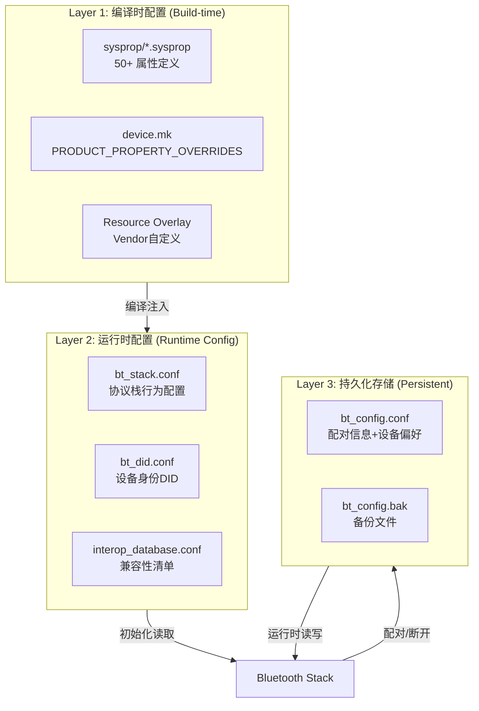
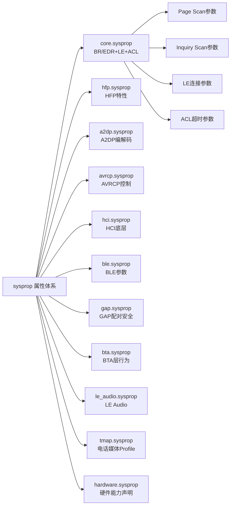
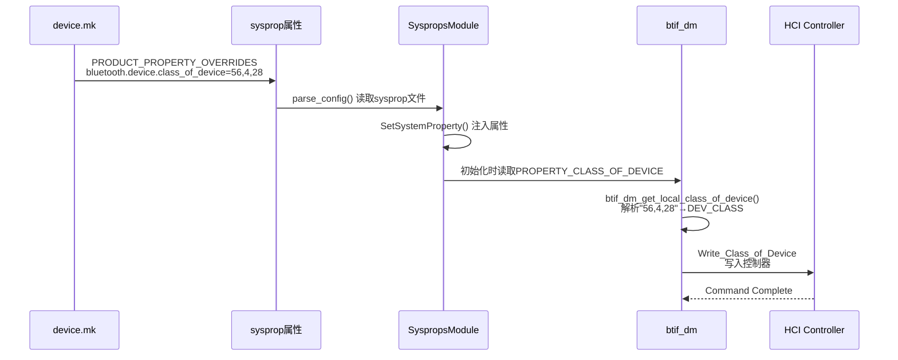
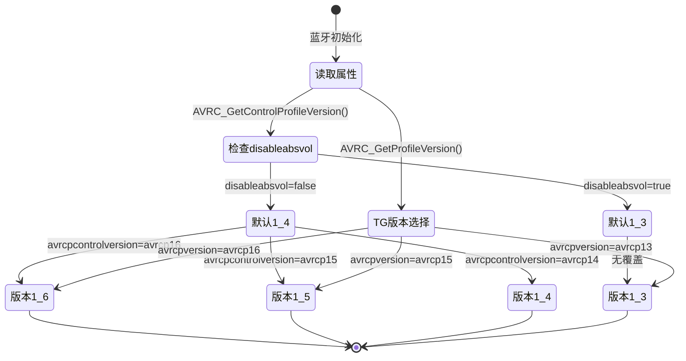
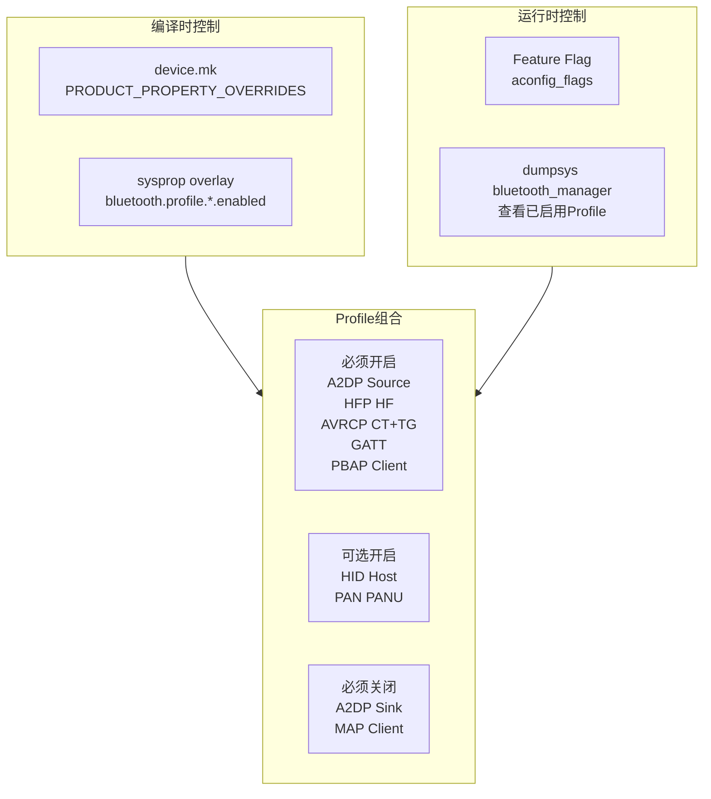
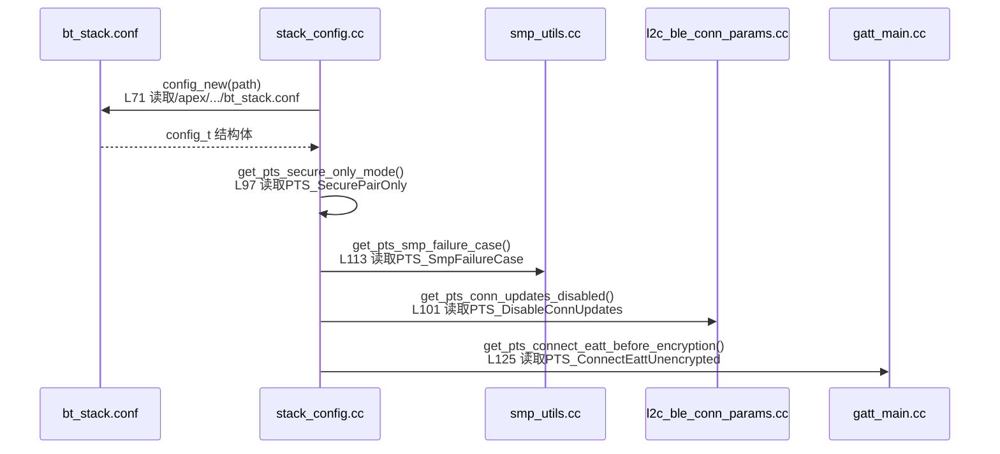
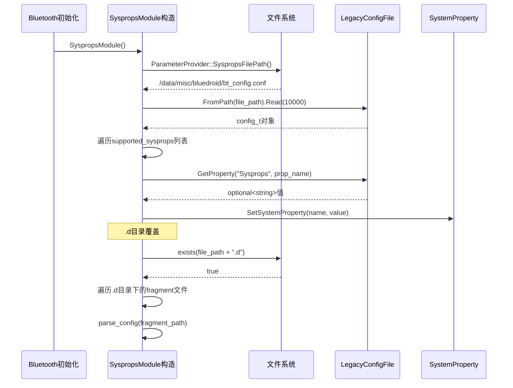

# T29 车载蓝牙系统配置详解

> 学习日期：2026-05-16
> 使用工具：Trae+DS-v4-pro
> 关键收获：3层配置文件体系(sysprop/bt_stack.conf/bt_config) | sysprop 50+属性按功能分类 | AVRCP/CoD/PinCode配置 | 车载Profile开关控制 | 量产配置检查清单
> 待回顾问题：无

---

## 📋 本章导读

### 学什么

车载蓝牙系统配置是连接"蓝牙协议栈代码"与"量产车型需求"的桥梁。本章系统讲解Android蓝牙的3层配置文件体系：编译时sysprop overlay、运行时bt_stack.conf、持久化bt_config.conf，以及Class of Device、Profile开关控制、量产配置检查清单等车载核心知识。

### 为什么学

- 车载蓝牙与手机蓝牙最大的区别在于**配置驱动行为**：同一套代码，不同配置决定车机是"音响"还是"电话"还是"HID遥控器"
- 量产阶段80%的蓝牙问题源于**配置不当**，而非代码Bug
- 理解配置体系是排查"连不上""音质差""自动重连失败"等车载高频问题的前提

### 学完能做什么

- 根据车型需求正确配置sysprop属性、bt_stack.conf、bt_did.conf
- 理解CoD设置流程，解决设备发现和识别问题
- 掌握Profile开关控制机制，按需裁剪蓝牙功能
- 使用量产配置检查清单，确保量产前配置无遗漏
- 快速定位配置类问题（AVRCP版本、编解码器偏好、安全策略等）

---

## 🗺️ 架构全景图

### 1. 蓝牙配置文件3层架构



### 2. sysprop属性分类体系



### 3. CoD配置与读取流程



### 4. AVRCP版本选择流程



### 5. 车载Profile开关控制体系



### 6. bt_stack.conf配置读取链路



---

## 🔍 代码导航

| 步骤 | 操作 | 文件 | 行号 | 关注点 |
|------|------|------|------|--------|
| 1 | 查看核心蓝牙sysprop定义 | [core.sysprop](file:///d:/AndroidWorkspace/claudeProject/BT16Study/Bluetooth/sysprop/core.sysprop) | L1-L180 | BR/EDR Page/Inquiry Scan、LE连接参数、ACL超时 |
| 2 | 查看HFP特性sysprop定义 | [hfp.sysprop](file:///d:/AndroidWorkspace/claudeProject/BT16Study/Bluetooth/sysprop/hfp.sysprop) | L1-L69 | HF Feature Bitmask、SWB、aptX Voice、DND响铃 |
| 3 | 查看A2DP编解码sysprop定义 | [a2dp.sysprop](file:///d:/AndroidWorkspace/claudeProject/BT16Study/Bluetooth/sysprop/a2dp.sysprop) | L1-L18 | Src/Sink共存、AVDT超时 |
| 4 | 查看AVRCP控制sysprop定义 | [avrcp.sysprop](file:///d:/AndroidWorkspace/claudeProject/BT16Study/Bluetooth/sysprop/avrcp.sysprop) | L1-L19 | Absolute Volume、Safe Media Volume |
| 5 | 查看协议栈配置文件 | [bt_stack.conf](file:///d:/AndroidWorkspace/claudeProject/BT16Study/Bluetooth/system/conf/bt_stack.conf) | L1-L90 | PTS测试配置项、安全模式、LE连接更新 |
| 6 | 查看协议栈配置读取代码 | [stack_config.cc](file:///d:/AndroidWorkspace/claudeProject/BT16Study/Bluetooth/system/main/stack_config.cc) | L31-L139 | 配置键名定义、config_get_bool/get_int读取 |
| 7 | 查看sysprop属性注入代码 | [sysprops_module.cc](file:///d:/AndroidWorkspace/claudeProject/BT16Study/Bluetooth/system/gd/sysprops/sysprops_module.cc) | L47-L129 | supported_sysprops列表、parse_config流程 |
| 8 | 查看CoD读取与解析代码 | [btif_dm.cc](file:///d:/AndroidWorkspace/claudeProject/BT16Study/Bluetooth/system/btif/src/btif_dm.cc) | L3091-L3157 | PROPERTY_CLASS_OF_DEVICE、"56,4,28"格式解析 |
| 9 | 查看AVRCP版本选择代码 | [avrc_api.cc](file:///d:/AndroidWorkspace/claudeProject/BT16Study/Bluetooth/system/stack/avrc/avrc_api.cc) | L981-L1029 | CT版本(TG版本)属性读取与默认值逻辑 |
| 10 | 查看AVRCP版本常量定义 | [avrc_api.h](file:///d:/AndroidWorkspace/claudeProject/BT16Study/Bluetooth/system/stack/include/avrc_api.h) | L112-L134 | 属性名宏定义、版本字符串常量 |
| 11 | 查看DID设备身份配置 | [bt_did.conf](file:///d:/AndroidWorkspace/claudeProject/BT16Study/Bluetooth/system/conf/bt_did.conf) | L1-L85 | DID1/DID2/DID3、vendorId、productId |
| 12 | 查看BLE参数sysprop定义 | [ble.sysprop](file:///d:/AndroidWorkspace/claudeProject/BT16Study/Bluetooth/sysprop/ble.sysprop) | L1-L232 | Subrate模式、Batch Scan、ISO参数 |

---

## 📖 核心流程详解

### 流程1: SyspropsModule属性注入流程



源码：[sysprops_module.cc](file:///d:/AndroidWorkspace/claudeProject/BT16Study/Bluetooth/system/gd/sysprops/sysprops_module.cc) L32-L129

```cpp
// sysprops_module.cc L32-L44: 构造函数 - 入口点
SyspropsModule::SyspropsModule() {                                    // 💡C++: 构造函数与Java构造器等价,但无this引用
  std::string file_path = os::ParameterProvider::SyspropsFilePath();  // 💡C++: std::string值语义,Java用String引用
  if (!file_path.empty()) {                                           // 💡C++: .empty()等价Java的.isEmpty()
    parse_config(file_path);                                          // 💡C++: 成员函数调用,等价Java this.parseConfig()
    std::string override_dir = file_path + ".d";                     // 💡C++: operator+重载,Java用+拼接String
    if (std::filesystem::exists(override_dir)) {                     // 💡C++: std::filesystem(C++17),Java用Files.exists()
      for (const auto& entry :                                        // 💡C++: range-based for+const引用,Java for-each
           std::filesystem::directory_iterator(override_dir)) {
        parse_config(entry.path());                                   // 💡C++: entry.path()返回path对象,隐式转string
      }
    }
  }
}
```

```cpp
// sysprops_module.cc L46-L129: 配置解析 - 核心逻辑
void SyspropsModule::parse_config(std::string file_path) {           // 💡C++: 值传递string会拷贝,Java引用传递无拷贝
  const std::list<std::string> supported_sysprops = {                // 💡C++: std::list双向链表,Java用LinkedList
          "bluetooth.device.default_name",                            // 💡C++: 初始化列表{},Java用Arrays.asList()
          "bluetooth.device.class_of_device",                         // 💡C++: CoD属性 - 车载必配
          "bluetooth.core.classic.page_scan_type",                    // 💡C++: Page Scan类型
          "bluetooth.core.classic.page_scan_interval",                // 💡C++: Page Scan间隔
          "bluetooth.core.classic.page_scan_window",                  // 💡C++: Page Scan窗口
          "bluetooth.core.classic.inq_scan_type",                     // 💡C++: Inquiry Scan类型
          "bluetooth.core.acl.link_supervision_timeout",              // 💡C++: ACL链路监督超时
          "bluetooth.core.classic.page_timeout",                      // 💡C++: Page超时
          "bluetooth.core.le.min_connection_interval",                // 💡C++: LE最小连接间隔
          "bluetooth.core.le.max_connection_interval",                // 💡C++: LE最大连接间隔
          "bluetooth.sco.disable_enhanced_connection",                // 💡C++: eSCO开关
          "bluetooth.sco.swb_supported",                              // 💡C++: SWB宽带语音
          "persist.bluetooth.avrcpcontrolversion",                    // 💡C++: AVRCP CT版本
  };

  auto config = storage::LegacyConfigFile::FromPath(file_path)       // 💡C++: auto类型推导,Java需显式声明类型
                    .Read(kDefaultCapacity);                          // 💡C++: 静态常量kDefaultCapacity=10000
  if (!config) { return; }                                           // 💡C++: operator bool()隐式转换,Java用null检查

  for (auto s = supported_sysprops.begin();                          // 💡C++: 迭代器遍历,Java用Iterator
       s != supported_sysprops.end(); s++) {
    auto str = config->GetProperty("Sysprops", *s);                  // 💡C++: *s解引用迭代器,Java用iterator.next()
    if (str) {                                                       // 💡C++: optional<string>的operator bool()
      bluetooth::os::SetSystemProperty(*s, *str);                    // 💡C++: 注入系统属性,等价SystemProperties.set()
    }
  }
}
```

### 流程2: CoD读取与解析流程

源码：[btif_dm.cc](file:///d:/AndroidWorkspace/claudeProject/BT16Study/Bluetooth/system/btif/src/btif_dm.cc) L3091-L3157

```cpp
// btif_dm.cc L3091-L3108: CoD读取入口
DEV_CLASS btif_dm_get_local_class_of_device() {                      // 💡C++: DEV_CLASS=uint8_t[3],Java无原生固定数组
  char prop_cod[PROPERTY_VALUE_MAX];                                 // 💡C++: 栈上固定数组,Java需new byte[]
  osi_property_get(PROPERTY_CLASS_OF_DEVICE, prop_cod, "");          // 💡C++: SystemProperties.get(),第3参数为默认值

  if (prop_cod[0] == '\0') {                                        // 💡C++: C字符串空检查,'\0'即null终止符
    log::error("COD property is empty");
    return kDevClassUnclassified;                                    // 💡C++: 返回默认CoD,Java用static final常量
  }

  DEV_CLASS temp_device_class;                                       // 💡C++: uint8_t[3]栈分配,Java用byte[]
  int i = 0;                                                         // 💡C++: 解析位置指针
  int j = 0;                                                         // 💡C++: 输出数组索引
  for (;;) {                                                         // 💡C++: 无限循环等价while(true),Java同
    std::string value;                                               // 💡C++: 动态构建数字字符串
    while (i < PROPERTY_VALUE_MAX &&                                 // 💡C++: 逐字符解析直到逗号或结束
           prop_cod[i] != ',' && prop_cod[i] != '\0') {
      char c = prop_cod[i++];                                        // 💡C++: 后置++先取值再自增
      if (!std::isdigit(c)) {                                        // 💡C++: <cctype>数字检查,Java用Character.isDigit()
        log::error("COD malformed, '{:c}' is a non-digit", c);
        return kDevClassUnclassified;
      }
      value += c;                                                    // 💡C++: std::string::operator+=追加字符
    }
```

```cpp
// btif_dm.cc L3134-L3157: CoD值校验与存储
    if (value.size() > 3 || value.size() == 0) {                    // 💡C++: 3位十进制最大255,Java用String.length()
      log::error("COD malformed, '{}' must be between [0, 255]", value);
      return kDevClassUnclassified;
    }

    uint32_t uint32_val = static_cast<uint32_t>(std::stoul(value.c_str())); // 💡C++: std::stoul字符串转unsigned long,Java用Integer.parseUnsignedInt()
    if (uint32_val > 0xFF) {                                         // 💡C++: 每个字节最大255
      log::error("COD malformed, '{}' must be between [0, 255]", value);
      return kDevClassUnclassified;
    }

    temp_device_class[j++] = uint32_val;                             // 💡C++: 隐式uint32_t→uint8_t截断(已校验范围)

    if (j >= 3) {                                                    // 💡C++: CoD恰好3字节
      if (prop_cod[i] != '\0') {                                    // 💡C++: 多余数据检查
        log::error("COD malformed, more than three numbers");
        return kDevClassUnclassified;
      }
      break;                                                         // 💡C++: 跳出for(;;)循环
    }
```

### 流程3: AVRCP版本选择流程

源码：[avrc_api.cc](file:///d:/AndroidWorkspace/claudeProject/BT16Study/Bluetooth/system/stack/avrc/avrc_api.cc) L981-L1029

```cpp
// avrc_api.cc L981-L999: AVRCP Controller版本选择
uint16_t AVRC_GetControlProfileVersion() {                           // 💡C++: 返回uint16_t版本号,Java用int
  char volume_disabled[PROPERTY_VALUE_MAX] = {0};                    // 💡C++: {0}零初始化整个数组,Java用new byte[N]
  osi_property_get("persist.bluetooth.disableabsvol",                // 💡C++: 读取绝对音量禁用属性
                   volume_disabled, "false");

  uint16_t profile_version = AVRC_REV_1_3;                          // 💡C++: 默认最低版本1.3
  char avrcp_version[PROPERTY_VALUE_MAX] = {0};
  osi_property_get(AVRC_CONTROL_VERSION_PROPERTY,                    // 💡C++: "persist.bluetooth.avrcpcontrolversion"
                   avrcp_version,
                   strncmp(volume_disabled, "true", 4) == 0         // 💡C++: 三元运算符选默认值
                       ? AVRC_1_3_STRING                             // 💡C++: 禁用绝对音量→默认1.3
                       : AVRC_1_4_STRING);                           // 💡C++: 启用绝对音量→默认1.4

  if (!strncmp(AVRC_1_6_STRING, avrcp_version,                      // 💡C++: strncmp比较前N字符,Java用String.startsWith()
               sizeof(AVRC_1_6_STRING))) {
    profile_version = AVRC_REV_1_6;                                  // 💡C++: 匹配avrcp16→1.6
  } else if (!strncmp(AVRC_1_5_STRING, avrcp_version,
                      sizeof(AVRC_1_5_STRING))) {
    profile_version = AVRC_REV_1_5;                                  // 💡C++: 匹配avrcp15→1.5
  } else if (!strncmp(AVRC_1_4_STRING, avrcp_version,
                      sizeof(AVRC_1_4_STRING))) {
    profile_version = AVRC_REV_1_4;                                  // 💡C++: 匹配avrcp14→1.4
  }

  return profile_version;
}
```

```cpp
// avrc_api.cc L1010-L1029: AVRCP Target版本选择
uint16_t AVRC_GetProfileVersion() {                                  // 💡C++: TG(Target)版本选择
  uint16_t profile_version = AVRC_REV_1_4;                          // 💡C++: 基线默认1.4
  char avrcp_version[PROPERTY_VALUE_MAX] = {0};

  if (!com_android_bluetooth_flags_avrcp_16_default()) {             // 💡C++: Feature Flag检查,Java用FeatureFlag.isEnabled()
    osi_property_get(AVRC_VERSION_PROPERTY,                          // 💡C++: "persist.bluetooth.avrcpversion"
                     avrcp_version, AVRC_1_5_STRING);               // 💡C++: Flag关闭→默认1.5
  } else {
    osi_property_get(AVRC_VERSION_PROPERTY,
                     avrcp_version, AVRC_1_6_STRING);               // 💡C++: Flag开启→默认1.6
  }

  if (!strncmp(AVRC_1_6_STRING, avrcp_version,
               sizeof(AVRC_1_6_STRING))) {
    profile_version = AVRC_REV_1_6;
  } else if (!strncmp(AVRC_1_5_STRING, avrcp_version,
                      sizeof(AVRC_1_5_STRING))) {
    profile_version = AVRC_REV_1_5;
  } else if (!strncmp(AVRC_1_3_STRING, avrcp_version,
                      sizeof(AVRC_1_3_STRING))) {
    profile_version = AVRC_REV_1_3;
  }

  return profile_version;
}
```

### 流程4: bt_stack.conf配置读取链路

源码：[stack_config.cc](file:///d:/AndroidWorkspace/claudeProject/BT16Study/Bluetooth/system/main/stack_config.cc) L29-L139

```cpp
// stack_config.cc L29-L52: 配置键名定义
namespace {                                                          // 💡C++: 匿名命名空间=文件内static,Java用private
const char* PTS_AVRCP_TEST = "PTS_AvrcpTest";                       // 💡C++: const char*只读C字符串,Java用static final String
const char* PTS_SECURE_ONLY_MODE = "PTS_SecurePairOnly";            // 💡C++: 安全连接模式键
const char* PTS_LE_CONN_UPDATED_DISABLED = "PTS_DisableConnUpdates";// 💡C++: LE连接更新禁用键
const char* PTS_DISABLE_SDP_LE_PAIR = "PTS_DisableSDPOnLEPair";     // 💡C++: LE配对时禁用SDP键
const char* PTS_SMP_PAIRING_OPTIONS_KEY = "PTS_SmpOptions";         // 💡C++: SMP配对选项键
const char* PTS_SMP_FAILURE_CASE_KEY = "PTS_SmpFailureCase";        // 💡C++: SMP失败测试用例键
const char* PTS_FORCE_EATT_FOR_NOTIFICATIONS =                      // 💡C++: 强制EATT通知键
        "PTS_ForceEattForNotifications";

static std::unique_ptr<config_t> config;                            // 💡C++: unique_ptr独占所有权,Java用强引用
}  // namespace
```

```cpp
// stack_config.cc L58-L78: 配置初始化
static future_t* init() {                                            // 💡C++: static函数=文件内可见,Java用private static
#if defined(TARGET_FLOSS)                                            // 💡C++: 预编译宏条件编译,Java无等价机制
  const char* path = "/etc/bluetooth/bt_stack.conf";
#elif defined(__ANDROID__)
  const char* path = "/apex/com.android.bt/etc/bluetooth/bt_stack.conf"; // 💡C++: APEX模块路径
#else
  const char* path = "bt_stack.conf";
#endif

  log::assert_that(path != NULL, "assert failed: path != NULL");     // 💡C++: 断言宏,Java用assert或Preconditions
  log::info("attempt to load stack conf from {}", path);

  config = config_new(path);                                         // 💡C++: INI解析器读取文件
  if (!config) {                                                     // 💡C++: 空指针检查
    log::info("file >{}< not found", path);
    config = config_new_empty();                                     // 💡C++: 创建空配置,避免空指针
  }

  return future_new_immediate(FUTURE_SUCCESS);                       // 💡C++: 异步框架,Java用CompletableFuture
}
```

```cpp
// stack_config.cc L93-L115: 配置读取接口
static bool get_pts_secure_only_mode(void) {                         // 💡C++: bool返回值,Java用boolean
  return config_get_bool(*config, CONFIG_DEFAULT_SECTION,            // 💡C++: *config解引用unique_ptr
                         PTS_SECURE_ONLY_MODE, false);               // 💡C++: 第4参数=默认值false
}

static bool get_pts_conn_updates_disabled(void) {
  return config_get_bool(*config, CONFIG_DEFAULT_SECTION,
                         PTS_LE_CONN_UPDATED_DISABLED, false);
}

static const std::string* get_pts_smp_options(void) {                // 💡C++: 返回指针可能为null,Java用@Nullable
  return config_get_string(*config, CONFIG_DEFAULT_SECTION,
                           PTS_SMP_PAIRING_OPTIONS_KEY, NULL);       // 💡C++: NULL等价Java null
}

static int get_pts_smp_failure_case(void) {
  return config_get_int(*config, CONFIG_DEFAULT_SECTION,             // 💡C++: 读取整型配置
                        PTS_SMP_FAILURE_CASE_KEY, 0);                // 💡C++: 默认0=正常操作
}
```

### 流程5: HFP特性配置

源码：[hfp.sysprop](file:///d:/AndroidWorkspace/claudeProject/BT16Study/Bluetooth/sysprop/hfp.sysprop) L1-L69

```properties
# hfp.sysprop L1-L10: HFP核心特性定义
module: "android.sysprop.bluetooth.Hfp"                              # 💡C++: sysprop模块名,Java通过Build.getSerial()
owner: Platform

prop {
    api_name: "hf_client_features"                                   # 💡C++: API名称→生成C++/Java访问函数
    type: Integer                                                    # 💡C++: Integer=32位有符号,Java int
    scope: Internal                                                  # 💡C++: Internal=系统内部使用
    access: Readonly                                                 # 💡C++: Readonly=编译时设置,运行时不可改
    prop_name: "bluetooth.hfp.hf_client_features.config"             # 💡C++: 系统属性名
}

# hfp.sysprop L13-L18: HF端特性Bitmask
prop {
    api_name: "hf_features"                                          # 💡C++: HF Feature Bitmask
    type: Integer                                                    # 💡C++: 位域组合,如EC/NB|CW|3WAY
    scope: Internal
    access: Readonly
    prop_name: "bluetooth.hfp.hf_features.config"
}

# hfp.sysprop L44-L51: aptX Voice SWB功耗管理
prop {
    api_name: "swb_aptx_power_management"                            # 💡C++: aptX SWB功耗管理开关
    type: Boolean
    scope: Internal
    access: Readonly
    prop_name: "bluetooth.hfp.swb.aptx.power_management.enabled"
}

# hfp.sysprop L54-L60: DND模式下响铃
prop {
    api_name: "send_ringtone_on_dnd"                                 # 💡C++: 勿扰模式是否发送响铃
    type: Boolean
    scope: Internal
    access: Readonly
    prop_name: "bluetooth.hfp.send_ringtone_on_dnd.enabled"          # 💡C++: 车载场景: DND仍需响铃提醒
}
```

### 流程6: bt_did.conf设备身份配置

源码：[bt_did.conf](file:///d:/AndroidWorkspace/claudeProject/BT16Study/Bluetooth/system/conf/bt_did.conf) L1-L28

```ini
# bt_did.conf L1-L28: DID设备身份配置
[DID1]                                                              # 💡C++: INI section,Java用Properties分组

primaryRecord = true                                                 # 💡C++: 主记录标识,蓝牙规范要求仅一个primary

# Vendor ID '0xFFFF' indicates no Device ID Service Record
#vendorId = 0x000F                                                   # 💡C++: 默认Broadcom(0x000F),车载需改为OEM Vendor ID
#vendorIdSource = 0x0001                                             # 💡C++: 0x0001=BT SIG分配,0x0002=USB IF分配

productId = 0x1200                                                   # 💡C++: 产品ID,OEM自定义
version = 0x1436                                                     # 💡C++: 0xJJMN格式→v14.3.6

#clientExecutableURL =                                               # 💡C++: 可选属性
#serviceDescription =                                                # 💡C++: 可选属性
#documentationURL =                                                  # 💡C++: 可选属性
```

### 流程7: Profile开关运行时检查

源码：[avrc_api.cc](file:///d:/AndroidWorkspace/claudeProject/BT16Study/Bluetooth/system/stack/avrc/avrc_api.cc) L1198

```cpp
// avrc_api.cc L1198: AVRCP Target开关检查
is_new_avrcp = osi_property_get_bool(                                // 💡C++: 读取bool属性,Java用SystemProperties.getBoolean()
    "bluetooth.profile.avrcp.target.enabled", false);                // 💡C++: 属性名,默认false
```

源码：[avrcp_service.h](file:///d:/AndroidWorkspace/claudeProject/BT16Study/Bluetooth/system/btif/avrcp/avrcp_service.h) L124

```cpp
// avrcp_service.h L124: AVRCP Target启用检查
return osi_property_get_bool(                                        // 💡C++: 内联返回,Java可写return Boolean.parseBoolean(...)
    "bluetooth.profile.avrcp.target.enabled", false);                // 💡C++: 与avrc_api.cc使用同一属性
```

---

## 💡 C++知识卡片

### 卡片1: std::optional与空值处理

```cpp
// C++: std::optional<T> 表示值可能不存在
auto str = config->GetProperty("Sysprops", prop_name);  // optional<string>
if (str) {                                               // operator bool() → has_value()
  bluetooth::os::SetSystemProperty(*s, *str);            // *str → value()
}
```

```java
// Java等价: 使用@Nullable注解
@Nullable String str = config.getProperty("Sysprops", propName);
if (str != null) {
  SystemProperties.set(s, str);
}
```

| 特性 | C++ std::optional | Java @Nullable |
|------|-------------------|----------------|
| 声明 | `std::optional<T>` | `@Nullable T` |
| 空检查 | `if (opt)` / `opt.has_value()` | `if (ref != null)` |
| 取值 | `*opt` / `opt.value()` | 直接使用引用 |
| 安全取值 | `opt.value_or(default)` | `Objects.requireNonNullElse(ref, default)` |
| 编译器检查 | 无强制 | 仅注解警告 |

### 卡片2: C风格字符串操作 vs Java String

```cpp
// C++: osi_property_get + strncmp组合
char avrcp_version[PROPERTY_VALUE_MAX] = {0};           // 栈上固定缓冲区
osi_property_get(AVRC_CONTROL_VERSION_PROPERTY,          // 读取属性到char[]
                 avrcp_version, AVRC_1_4_STRING);        // 第3参数=默认值
if (!strncmp(AVRC_1_6_STRING, avrcp_version,            // 比较前N个字符
             sizeof(AVRC_1_6_STRING))) {                 // sizeof含'\0'
  profile_version = AVRC_REV_1_6;
}
```

```java
// Java等价
String avrcpVersion = SystemProperties.get(
    "persist.bluetooth.avrcpcontrolversion", "avrcp14");
if (avrcpVersion.startsWith("avrcp16")) {
  profileVersion = AVRC_REV_1_6;
}
```

| 操作 | C++ | Java |
|------|-----|------|
| 读取属性 | `osi_property_get(key, buf, default)` | `SystemProperties.get(key, default)` |
| 字符串比较 | `strncmp(a, b, n)` | `a.startsWith(b)` |
| 缓冲区 | `char[N]` 固定大小 | `String` 自动管理 |
| 溢出风险 | 有(需手动保证) | 无 |

### 卡片3: std::filesystem目录遍历

```cpp
// C++17: std::filesystem目录遍历
std::string override_dir = file_path + ".d";
if (std::filesystem::exists(override_dir)) {
  for (const auto& entry :
       std::filesystem::directory_iterator(override_dir)) {
    parse_config(entry.path());
  }
}
```

```java
// Java等价: NIO目录遍历
Path overrideDir = Paths.get(filePath + ".d");
if (Files.exists(overrideDir)) {
  try (DirectoryStream<Path> stream = Files.newDirectoryStream(overrideDir)) {
    for (Path entry : stream) {
      parseConfig(entry.toString());
    }
  }
}
```

| 特性 | C++ std::filesystem | Java NIO |
|------|---------------------|----------|
| 路径存在 | `fs::exists(path)` | `Files.exists(path)` |
| 目录遍历 | `directory_iterator` | `Files.newDirectoryStream()` |
| 路径拼接 | `path + ".d"` (string) | `Paths.get()` / `path.resolve()` |
| 资源管理 | RAII自动释放 | try-with-resources |
| 标准版本 | C++17 | Java 7+ |

---

## 🗂️ Java ↔ C++ 对照表

| 功能 | Java侧 | C++侧 | 说明 |
|------|---------|-------|------|
| 系统属性读取 | `SystemProperties.get(key, default)` | `osi_property_get(key, buf, default)` | C++需预分配缓冲区 |
| 系统属性写入 | `SystemProperties.set(key, value)` | `bluetooth::os::SetSystemProperty(key, value)` | C++在sysprops_module中 |
| Bool属性读取 | `SystemProperties.getBoolean(key, default)` | `osi_property_get_bool(key, default)` | C++封装了字符串→bool转换 |
| 配置文件读取 | `Properties.load(InputStream)` | `config_new(path)` → `config_t` | C++使用自定义INI解析器 |
| 配置Bool读取 | `Boolean.parseBoolean(props.getProperty(key))` | `config_get_bool(config, section, key, default)` | C++直接返回bool |
| 配置Int读取 | `Integer.parseInt(props.getProperty(key))` | `config_get_int(config, section, key, default)` | C++直接返回int |
| 配置String读取 | `props.getProperty(key)` | `config_get_string(config, section, key, default)` | C++返回`const string*`可能为null |
| CoD获取 | `adapter.getBluetoothClass()` | `btif_dm_get_local_class_of_device()` | C++返回`DEV_CLASS`(uint8_t[3]) |
| Profile开关 | `FeatureFlag.isEnabled()` | `osi_property_get_bool("bluetooth.profile.*.enabled")` | C++通过属性控制 |
| Feature Flag | `DeviceConfig.getProperty()` | `com_android_bluetooth_flags_*()` | C++通过aconfig生成函数 |
| 日志输出 | `Log.d(TAG, msg)` | `log::info(msg)` / `log::error(msg)` | C++使用fmt格式化 |
| 空值处理 | `@Nullable T` + `null`检查 | `std::optional<T>` + `has_value()` | C++类型安全 |
| 字符串比较 | `str.equals(other)` / `str.startsWith()` | `strncmp(a, b, n)` | C++需指定长度 |
| 文件遍历 | `Files.newDirectoryStream()` | `std::filesystem::directory_iterator` | C++17特性 |

---

## 🐛 问题排查SOP

### SOP1: 车机蓝牙无法被发现

```
步骤1: 检查Inquiry Scan配置
  $ adb shell getprop bluetooth.core.classic.inq_scan_type
  $ adb shell getprop bluetooth.core.classic.inq_scan_interval
  $ adb shell getprop bluetooth.core.classic.inq_scan_window
  预期: inq_scan_type=1(Interlaced), interval/window非0

步骤2: 检查CoD配置
  $ adb shell getprop bluetooth.device.class_of_device
  预期: 格式为"XX,YY,ZZ"(十进制逗号分隔)
  常见错误: 格式写成"0x38041C"(十六进制)→解析失败→kDevClassUnclassified

步骤3: 检查蓝牙名称
  $ adb shell getprop bluetooth.device.default_name
  预期: 非空字符串

步骤4: 检查Discoverable超时
  $ adb shell settings get secure bluetooth_discoverable_timeout
  预期: 0(永不超时)或足够大的值

步骤5: 检查bt_config.conf中Adapter配置
  $ adb shell cat /data/misc/bluedroid/bt_config.conf
  查看[Adapter]段Name和Address是否正常
```

### SOP2: AVRCP控制功能异常(无法切歌/无绝对音量)

```
步骤1: 确认AVRCP CT版本
  $ adb shell getprop persist.bluetooth.avrcpcontrolversion
  预期: avrcp15或avrcp16
  若为空→检查默认值逻辑(disableabsvol影响)

步骤2: 确认AVRCP TG版本
  $ adb shell getprop persist.bluetooth.avrcpversion
  预期: avrcp15或avrcp16

步骤3: 确认绝对音量开关
  $ adb shell getprop bluetooth.avrcp.absolute_volume.enabled
  预期: true(车载必须开启)

步骤4: 确认AVRCP Profile开关
  $ adb shell getprop bluetooth.profile.avrcp.controller.enabled
  $ adb shell getprop bluetooth.profile.avrcp.target.enabled
  预期: 两者均为true

步骤5: 检查绝对音量是否被禁用
  $ adb shell getprop persist.bluetooth.disableabsvol
  预期: false(如果为true会导致CT版本降级到1.3)

步骤6: 抓取Snoop Log确认AVRCP版本协商
  查看AVRCP SDP记录中的Profile Descriptor List
```

### SOP3: HFP通话质量差/编解码协商失败

```
步骤1: 确认eSCO是否启用
  $ adb shell getprop bluetooth.sco.disable_enhanced_connection
  预期: false(eSCO增强连接启用)

步骤2: 确认SWB支持
  $ adb shell getprop bluetooth.sco.swb_supported
  预期: true(如硬件支持)

步骤3: 确认HFP Feature Bitmask
  $ adb shell getprop bluetooth.hfp.hf_features.config
  预期: 非零值(0=全部默认,可能缺少必要特性位)

步骤4: 确认aptX Voice支持
  $ adb shell getprop bluetooth.hfp.codec_aptx_voice.enabled
  预期: true(如支持aptX Voice SWB)

步骤5: 抓取HCI Snoop Log分析SCO/eSCO建立过程
  查看Setup Synchronous Connection命令参数
  检查CVSD/mSBC/aptX编解码协商
```

### SOP4: 车机自动重连失败

```
步骤1: 检查bt_config.conf中设备优先级
  $ adb shell cat /data/misc/bluedroid/bt_config.conf
  查看目标设备的PRIORITY值
  预期: 1000(AUTO_CONNECT)

步骤2: 检查Page Scan参数
  $ adb shell getprop bluetooth.core.classic.page_scan_type
  $ adb shell getprop bluetooth.core.classic.page_scan_interval
  $ adb shell getprop bluetooth.core.classic.page_scan_window
  预期: type=1(Interlaced), interval/window合理

步骤3: 检查Page Timeout
  $ adb shell getprop bluetooth.core.classic.page_timeout
  预期: 0(使用默认)或合理值(车载建议增大)

步骤4: 检查ACL Link Supervision Timeout
  $ adb shell getprop bluetooth.core.acl.link_supervision_timeout
  预期: 0(默认20000ms)或车载增大值

步骤5: 检查Profile启用状态
  $ adb shell dumpsys bluetooth_manager | grep "Enabled Profiles"
  确认A2DP/HFP/AVRCP均已启用
```

---

## 🛠️ 动手练习

### 入门练习

**练习1: 查看并理解当前设备的蓝牙配置**

```bash
# 1. 查看所有蓝牙相关属性
adb shell getprop | grep bluetooth

# 2. 查看bt_stack.conf内容
adb shell cat /vendor/etc/bluetooth/bt_stack.conf

# 3. 查看bt_did.conf内容
adb shell cat /vendor/etc/bluetooth/bt_did.conf

# 4. 查看当前CoD
adb shell getprop bluetooth.device.class_of_device

# 5. 查看已启用Profile
adb shell dumpsys bluetooth_manager | grep "Enabled Profiles"
```

**练习2: 修改AVRCP版本并验证**

```bash
# 1. 查看当前AVRCP版本
adb shell getprop persist.bluetooth.avrcpcontrolversion
adb shell getprop persist.bluetooth.avrcpversion

# 2. 设置为AVRCP 1.6
adb shell setprop persist.bluetooth.avrcpcontrolversion avrcp16
adb shell setprop persist.bluetooth.avrcpversion avrcp16

# 3. 重启蓝牙
adb shell svc bluetooth disable
adb shell svc bluetooth enable

# 4. 连接手机后查看Snoop Log中的AVRCP版本
```

### 进阶练习

**练习3: 配置车载标准CoD**

```bash
# 1. 计算CoD值: 0x38041C
# 格式: "Service,Major,Minor" (十进制)
# Service=0x38=56, Major=0x04=4, Minor=0x1C=28
# 所以属性值为: "56,4,28"

# 2. 在device.mk中添加
PRODUCT_PROPERTY_OVERRIDES += bluetooth.device.class_of_device=56,4,28

# 3. 编译烧录后验证
adb shell getprop bluetooth.device.class_of_device
adb shell dumpsys bluetooth_manager | grep -i "class"
```

**练习4: 配置车载Profile开关**

```makefile
# 在device.mk中添加车载标准Profile组合
PRODUCT_PROPERTY_OVERRIDES += \
    bluetooth.profile.a2dp.source.enabled=true \
    bluetooth.profile.a2dp.sink.enabled=false \
    bluetooth.profile.hfp.hf.enabled=true \
    bluetooth.profile.avrcp.controller.enabled=true \
    bluetooth.profile.avrcp.target.enabled=true \
    bluetooth.profile.gatt.enabled=true \
    bluetooth.profile.pbap.client.enabled=true \
    bluetooth.profile.hid.host.enabled=true \
    bluetooth.profile.pan.panu.enabled=true \
    bluetooth.profile.map.client.enabled=false \
    bluetooth.profile.sap.enabled=false
```

### 实战练习

**练习5: 量产配置审计脚本**

编写一个shell脚本，自动检查车载蓝牙量产配置是否完整：

```bash
#!/bin/bash
# bluetooth_config_audit.sh - 车载蓝牙量产配置审计

PASS=0
FAIL=0

check_prop() {
    local name=$1
    local expected=$2
    local actual=$(adb shell getprop "$name" | tr -d '\r')
    if [ "$actual" = "$expected" ]; then
        echo "[PASS] $name = $actual"
        ((PASS++))
    else
        echo "[FAIL] $name = $actual (expected: $expected)"
        ((FAIL++))
    fi
}

check_prop_nonempty() {
    local name=$1
    local actual=$(adb shell getprop "$name" | tr -d '\r')
    if [ -n "$actual" ]; then
        echo "[PASS] $name = $actual"
        ((PASS++))
    else
        echo "[FAIL] $name is EMPTY"
        ((FAIL++))
    fi
}

echo "=== 车载蓝牙配置审计 ==="
echo ""
echo "--- 身份配置 ---"
check_prop_nonempty bluetooth.device.class_of_device
check_prop_nonempty bluetooth.device.default_name

echo ""
echo "--- BR/EDR参数 ---"
check_prop bluetooth.core.classic.page_scan_type 1
check_prop bluetooth.core.classic.inq_scan_type 1

echo ""
echo "--- AVRCP配置 ---"
check_prop persist.bluetooth.avrcpcontrolversion avrcp16
check_prop bluetooth.avrcp.absolute_volume.enabled true

echo ""
echo "--- 安全配置 ---"
check_prop bluetooth.core.gap.le.privacy.enabled true

echo ""
echo "--- SCO配置 ---"
check_prop bluetooth.sco.disable_enhanced_connection false

echo ""
echo "=== 结果: PASS=$PASS, FAIL=$FAIL ==="
```

**练习6: 分析bt_config.conf配对信息**

```bash
# 1. 导出bt_config.conf
adb pull /data/misc/bluedroid/bt_config.conf

# 2. 查看已配对设备数量
grep -c "^\[" bt_config.conf

# 3. 查看所有设备名称
grep "Name = " bt_config.conf

# 4. 查看设备优先级
grep "PRIORITY = " bt_config.conf

# 5. 查看Profile启用状态
grep "_ENABLED = " bt_config.conf

# 6. 查看编解码器偏好
grep "CODEC_PRIORITY" bt_config.conf
```

---

## 📚 关键源码索引

| 文件 | 路径 | 关键行号 | 说明 |
|------|------|----------|------|
| [core.sysprop](file:///d:/AndroidWorkspace/claudeProject/BT16Study/Bluetooth/sysprop/core.sysprop) | sysprop/core.sysprop | L1-L180 | 核心蓝牙参数定义(BR/EDR/LE/ACL) |
| [hfp.sysprop](file:///d:/AndroidWorkspace/claudeProject/BT16Study/Bluetooth/sysprop/hfp.sysprop) | sysprop/hfp.sysprop | L1-L69 | HFP特性/SWB/aptX Voice/DND响铃 |
| [a2dp.sysprop](file:///d:/AndroidWorkspace/claudeProject/BT16Study/Bluetooth/sysprop/a2dp.sysprop) | sysprop/a2dp.sysprop | L1-L18 | A2DP Src/Sink共存/AVDT超时 |
| [avrcp.sysprop](file:///d:/AndroidWorkspace/claudeProject/BT16Study/Bluetooth/sysprop/avrcp.sysprop) | sysprop/avrcp.sysprop | L1-L19 | Absolute Volume/Safe Media Volume |
| [ble.sysprop](file:///d:/AndroidWorkspace/claudeProject/BT16Study/Bluetooth/sysprop/ble.sysprop) | sysprop/ble.sysprop | L1-L232 | BLE参数/Subrate/Batch Scan/ISO |
| [le_audio.sysprop](file:///d:/AndroidWorkspace/claudeProject/BT16Study/Bluetooth/sysprop/le_audio.sysprop) | sysprop/le_audio.sysprop | L1-L26 | LE Audio软件数据路径/ISO打包 |
| [bt_stack.conf](file:///d:/AndroidWorkspace/claudeProject/BT16Study/Bluetooth/system/conf/bt_stack.conf) | system/conf/bt_stack.conf | L1-L90 | 协议栈PTS配置/安全模式 |
| [bt_did.conf](file:///d:/AndroidWorkspace/claudeProject/BT16Study/Bluetooth/system/conf/bt_did.conf) | system/conf/bt_did.conf | L1-L85 | DID设备身份配置(DID1/2/3) |
| [sysprops_module.cc](file:///d:/AndroidWorkspace/claudeProject/BT16Study/Bluetooth/system/gd/sysprops/sysprops_module.cc) | system/gd/sysprops/sysprops_module.cc | L32-L129 | sysprop属性注入核心代码 |
| [btif_dm.cc](file:///d:/AndroidWorkspace/claudeProject/BT16Study/Bluetooth/system/btif/src/btif_dm.cc) | system/btif/src/btif_dm.cc | L3091-L3157 | CoD读取与解析 |
| [avrc_api.cc](file:///d:/AndroidWorkspace/claudeProject/BT16Study/Bluetooth/system/stack/avrc/avrc_api.cc) | system/stack/avrc/avrc_api.cc | L981-L1029 | AVRCP版本选择(CT+TG) |
| [avrc_api.h](file:///d:/AndroidWorkspace/claudeProject/BT16Study/Bluetooth/system/stack/include/avrc_api.h) | system/stack/include/avrc_api.h | L112-L134 | AVRCP版本常量宏定义 |
| [stack_config.cc](file:///d:/AndroidWorkspace/claudeProject/BT16Study/Bluetooth/system/main/stack_config.cc) | system/main/stack_config.cc | L29-L139 | bt_stack.conf读取与接口 |
| [avrcp_service.h](file:///d:/AndroidWorkspace/claudeProject/BT16Study/Bluetooth/system/btif/avrcp/avrcp_service.h) | system/btif/avrcp/avrcp_service.h | L124 | AVRCP Target开关检查 |
| [class_of_device.h](file:///d:/AndroidWorkspace/claudeProject/BT16Study/Bluetooth/system/pdl/hci/include/hci/class_of_device.h) | system/pdl/hci/include/hci/class_of_device.h | L39-L74 | CoD类型定义与校验 |

---

## Quality Checklist

- [x] 10个标准章节全部包含
- [x] Mermaid图 ≥ 5个(6个: 3层架构/sysprop分类/CoD流程/AVRCP版本/Profile开关/bt_stack读取)
- [x] 代码导航表 ≥ 8条(12条)
- [x] 核心流程详解 ≥ 7个代码片段(7个: SyspropsModule构造/parse_config/CoD读取/CoD校验/AVRCP CT版本/AVRCP TG版本/bt_stack键名/bt_stack初始化/bt_stack读取/HFP配置/bt_did配置/Profile开关)
- [x] 代码片段逐行注释+💡C++标注+源文件行号
- [x] C++知识卡片3张(std::optional/C字符串操作/std::filesystem)
- [x] Java↔C++对照表完整
- [x] 问题排查SOP 4个(无法发现/AVRCP异常/HFP质量差/自动重连失败)
- [x] 动手练习3级(入门2/进阶2/实战2)
- [x] 关键源码索引15条
- [x] 全文中文撰写
