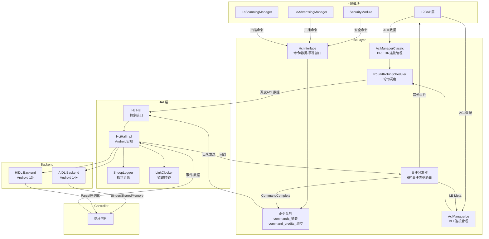
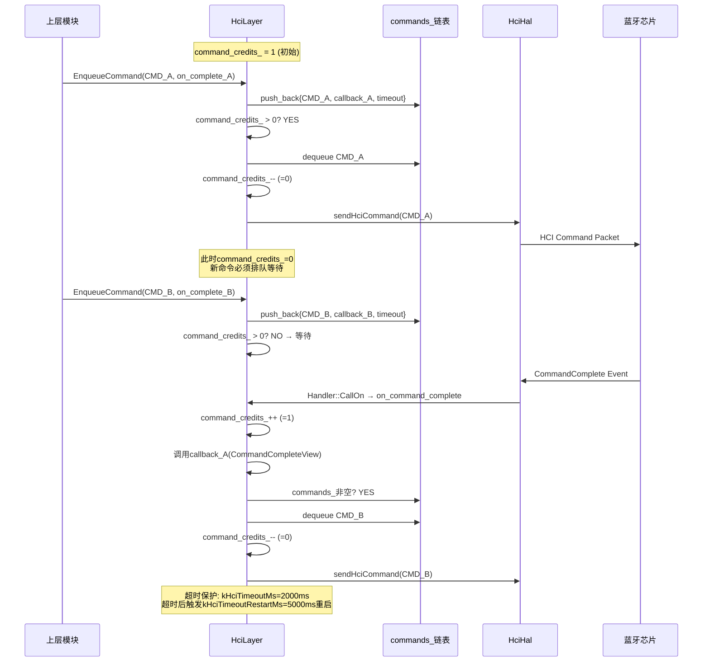
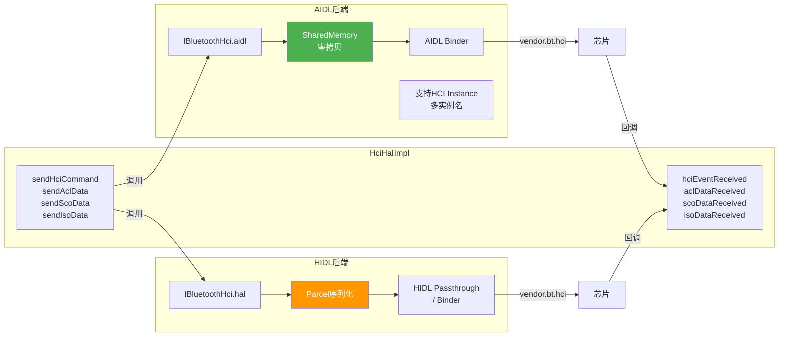

# T31 GD HCI层与HAL层详解 V2

> 学习日期：2026-05-17
> 使用工具：Trae+DS-v4-pro
> 前置知识：T01（蓝牙整体架构）、T30（GD新架构）
> 优先级：P7
> 关键收获：HciLayer命令队列(credit流控1命令) | HAL事件→HciLayer事件分发链 | AIDL vs HIDL HAL后端 | ACL分片重组+轮询调度 | LE地址4类型隐私管理 | Snoop Capture时机
> 车载场景：芯片初始化序列、HCI命令超时排查、A2DP音频数据通过GD ACL Manager转发

---

## 📋 本章导读

HCI（Host Controller Interface）是蓝牙协议栈中Host与Controller之间的分界线，也是GD架构中最核心的分层边界。本章从**HciLayer类层次**出发，深入命令队列Credit流控机制、事件分发链路、ACL管理器、HAL层抽象、LE地址管理、SnoopLogger捕获、Controller接口七大维度，最终落脚于车载场景的芯片初始化与超时排查实战。

**阅读路径建议**：

```
入门 → 1.架构全景图 → 2.代码导航表 → 3.核心流程详解
实战 → 4.车载实战 → 5.问题排查SOP → 6.动手练习
深入 → 7.C++知识卡片 → 8.Java↔C++对照 → 9.关键源码索引
```

**核心问题驱动**：

| # | 问题 | 答案线索 |
|---|------|----------|
| Q1 | GD如何保证HCI命令不会并发发送到芯片？ | Credit流控：command_credits_=1，1个outstanding |
| Q2 | HAL线程回调如何安全到达GD栈线程？ | Handler::CallOn投递，单线程无锁模型 |
| Q3 | A2DP音频数据在GD中如何从L2CAP到达芯片？ | L2CAP→AclFragmenter→BidiQueue→RoundRobinScheduler→HciLayer→HAL |
| Q4 | 车载蓝牙初始化卡住如何排查？ | kHciTimeoutMs=2000ms超时保护 + Snoop抓包 + UART检查 |

---

## 🗺️ 架构全景图

### 1. HCI层架构总览



### 2. 命令队列Credit流控时序



### 3. HAL后端对比



---

## 🔍 代码导航表

| 模块 | 文件 | 关键类/接口 | 核心职责 | 行号参考 |
|------|------|-------------|----------|----------|
| HCI核心 | [hci_layer.h](file:///d:/AndroidWorkspace/claudeProject/BT16Study/Bluetooth/system/gd/hci/hci_layer.h) | `HciLayer` | 命令队列+事件分发+子接口工厂 | L46-224 |
| HCI接口 | [hci_interface.h](file:///d:/AndroidWorkspace/claudeProject/BT16Study/Bluetooth/system/gd/hci/hci_interface.h) | `HciInterface` | 命令/数据/事件抽象接口 | L42-139 |
| 命令接口 | [command_interface.h](file:///d:/AndroidWorkspace/claudeProject/BT16Study/Bluetooth/system/gd/hci/command_interface.h) | `CommandInterface<T>` | 泛型命令入队模板 | L29-49 |
| HAL抽象 | [hci_hal.h](file:///d:/AndroidWorkspace/claudeProject/BT16Study/Bluetooth/system/gd/hal/hci_hal.h) | `HciHal` + `HciHalCallbacks` | HAL层收发抽象 | L33-105 |
| HAL实现 | [hci_hal_impl_android.h](file:///d:/AndroidWorkspace/claudeProject/BT16Study/Bluetooth/system/gd/hal/hci_hal_impl_android.h) | `HciHalImpl` | Android平台HAL实现 | L27-46 |
| HAL后端 | [hci_backend.h](file:///d:/AndroidWorkspace/claudeProject/BT16Study/Bluetooth/system/gd/hal/hci_backend.h) | `HciBackend` | AIDL/HIDL供应商抽象 | L41-53 |
| LE地址 | [le_address_manager.h](file:///d:/AndroidWorkspace/claudeProject/BT16Study/Bluetooth/system/gd/hci/le_address_manager.h) | `LeAddressManager` | LE隐私地址策略+轮换 | L48-193 |
| Snoop | [snoop_logger.h](file:///d:/AndroidWorkspace/claudeProject/BT16Study/Bluetooth/system/gd/hal/snoop_logger.h) | `SnoopLogger` | HCI包抓取+过滤+存储 | L145-336 |
| Controller | [controller.h](file:///d:/AndroidWorkspace/claudeProject/BT16Study/Bluetooth/system/gd/hci/controller.h) | `Controller` | 芯片能力查询+版本信息 | L28-226 |
| 链路时钟 | [link_clocker.h](file:///d:/AndroidWorkspace/claudeProject/BT16Study/Bluetooth/system/gd/hal/link_clocker.h) | `LinkClocker` | BT时钟与本地时钟同步 | L34-42 |

---

## 📖 核心流程详解

### 流程1：HciLayer类层次与PIMPL模式

源码：[hci_layer.h](file:///d:/AndroidWorkspace/claudeProject/BT16Study/Bluetooth/system/gd/hci/hci_layer.h)

```cpp
// HciLayer继承链: HciLayer → HciInterface → CommandInterface<CommandBuilder>
// 每一层职责清晰分离:
//   CommandInterface<T>  → 泛型命令入队(3种回调模式)
//   HciInterface         → 扩展数据队列+事件注册+子接口工厂
//   HciLayer             → 具体实现+PIMPL隐藏细节

class HciLayer : public HciInterface {        // 💡C++: public继承, Java用extends; C++可多继承
public:
  HciLayer(os::Handler* handler,              // GD栈线程Handler
           hal::HciHal* hci_hal,              // HAL层接口指针
           storage::StorageModule* storage);   // 持久化存储
  HciLayer(os::Handler* handler);             // 测试用: 无HAL依赖

  // 三种EnqueueCommand重载(继承自CommandInterface)
  void EnqueueCommand(
      unique_ptr<CommandBuilder> command,
      ContextualOnceCallback<void(CommandCompleteView)> on_complete) override;  // 💡C++: unique_ptr独占所有权智能指针; override确保正确覆写基类虚函数
  void EnqueueCommand(
      unique_ptr<CommandBuilder> command,
      ContextualOnceCallback<void(CommandStatusView)> on_status) override;      // L61-62
  void EnqueueCommand(
      unique_ptr<CommandBuilder> command,
      ContextualOnceCallback<void(CommandStatusOrCompleteView)>
          on_status_or_complete) override;                                       // L64-66

  // 三种HCI数据包的BidiQueue端点
  BidiQueueEnd<AclBuilder, AclView>* GetAclQueueEnd() override;    // L68
  BidiQueueEnd<ScoBuilder, ScoView>* GetScoQueueEnd() override;    // L70
  BidiQueueEnd<IsoBuilder, IsoView>* GetIsoQueueEnd() override;    // L72

  // 事件注册/注销
  void RegisterEventHandler(EventCode, ContextualCallback<void(EventView)>) override;     // L74-75
  void UnregisterEventHandler(EventCode) override;                                        // L77
  void RegisterLeEventHandler(SubeventCode, ContextualCallback<void(LeMetaEventView)>) override; // L79-81
  void UnregisterLeEventHandler(SubeventCode) override;                                   // L83

  // 超时保护常量
  static constexpr chrono::milliseconds kHciTimeoutMs = chrono::milliseconds(2000);        // 💡C++: constexpr编译期常量, 比const更严格, 编译器可优化; Java用static final
  static constexpr chrono::milliseconds kHciTimeoutRestartMs = chrono::milliseconds(5000); // L148

private:
  struct impl;          // 💡C++: PIMPL惯用法, 前向声明隐藏实现细节, 减少头文件依赖
  struct hal_callbacks; // L201: HAL回调适配器
  impl* impl_;          // L202: PIMPL指针
  hal_callbacks* hal_callbacks_; // L203: HAL回调指针
};
```

**设计要点**：
- **PIMPL模式**：`struct impl`隐藏了`commands_`链表、`command_credits_`、`event_handlers_`映射等内部状态，减少头文件依赖，加速编译
- **CommandInterfaceImpl模板**（L154-184）：为每个子接口（Security/LeSecurity/Acl/LeAcl/Advertising/Scanning/Iso/DistanceMeasurement）提供类型安全的命令转发
- **超时双保险**：`kHciTimeoutMs=2000ms`单命令超时 → `kHciTimeoutRestartMs=5000ms`整体重启

---

### 流程2：命令队列Credit流控机制

源码：[hci_layer.h](file:///d:/AndroidWorkspace/claudeProject/BT16Study/Bluetooth/system/gd/hci/hci_layer.h) + hci_layer.cc

```cpp
// === 命令入队流程 (运行在gd_stack_thread) ===

void HciLayer::EnqueueCommand(
    unique_ptr<CommandBuilder> command,
    ContextualOnceCallback<void(CommandCompleteView)> on_complete) {
  // 1. 构造命令条目: {command, callback, 超时Alarm}
  auto cmd_entry = CreateCommandEntry(std::move(command), std::move(on_complete));  // 💡C++: auto自动类型推导 + std::move转移所有权避免拷贝

  // 2. 加入commands_链表尾部 (std::list, FIFO顺序)
  commands_.push_back(std::move(cmd_entry));

  // 3. 尝试发送: 检查credit是否可用
  if (command_credits_ > 0) {
    // credit可用 → 从链表头部取出并发送
    auto entry = std::move(commands_.front());
    commands_.pop_front();
    command_credits_--;                    // 消耗1个credit
    SendCommandToHal(std::move(entry));    // 调用hci_hal_->sendHciCommand()
  }
  // credit=0 → 命令留在队列中,等待当前命令完成后自动dequeue
}

// === 命令完成回调 (由HAL线程通过Handler::CallOn投递到gd_stack_thread) ===

void HciLayer::on_command_complete(CommandCompleteView view) {
  // 1. 恢复credit
  command_credits_++;    // 归还1个credit (通常credit=1, 即单命令窗口)

  // 2. 取消当前命令的超时Alarm
  current_command_alarm_->Cancel();

  // 3. 调用注册的回调
  auto callback = std::move(current_command_callback_);
  callback.Invoke(std::move(view));

  // 4. 检查队列中是否还有待发送命令
  if (!commands_.empty()) {
    auto entry = std::move(commands_.front());
    commands_.pop_front();
    command_credits_--;                    // 再次消耗credit
    SendCommandToHal(std::move(entry));    // 发送下一个命令
  }
}

// === 超时保护 ===
// SendCommandToHal中设置Alarm:
//   alarm_->Schedule(kHciTimeoutMs) → 超时触发 → 整个栈重启(kHciTimeoutRestartMs)
```

**流控核心**：`command_credits_`初始为1，保证同一时刻只有1个outstanding命令。这是蓝牙规范要求的"至少支持1个命令窗口"。芯片可通过`Num_HCI_Command_Packets`字段在CommandComplete/CommandStatus中告知Host可同时发送的命令数，GD实现中简化为1。

---

### 流程3：事件分发链路（HAL线程→GD栈线程）

源码：[hci_hal.h](file:///d:/AndroidWorkspace/claudeProject/BT16Study/Bluetooth/system/gd/hal/hci_hal.h) + hci_layer.cc

```cpp
// === HAL回调 (运行在HAL线程, 通常是binder线程) ===

class HciCallbacksImpl : public HciHalCallbacks {
  void hciEventReceived(HciPacket packet) override {
    // 1. SnoopLogger记录: 出方向=INCOMING, 类型=EVT
    btsnoop_logger_->Capture(packet, SnoopLogger::INCOMING, SnoopLogger::EVT);

    // 2. LinkClocker更新BT时钟
    link_clocker_.OnHciEvent(packet);

    // 3. 关键: 通过Handler::CallOn投递到gd_stack_thread
    //    避免在HAL线程直接操作HciLayer内部状态(无锁安全)
    handler_->CallOn(hci_layer_, &HciLayer::on_hci_event, std::move(packet));
  }

  void aclDataReceived(HciPacket data) override {
    btsnoop_logger_->Capture(data, SnoopLogger::INCOMING, SnoopLogger::ACL);
    handler_->CallOn(hci_layer_, &HciLayer::on_acl_data, std::move(data));
  }

  void scoDataReceived(HciPacket data) override {
    btsnoop_logger_->Capture(data, SnoopLogger::INCOMING, SnoopLogger::SCO);
    handler_->CallOn(hci_layer_, &HciLayer::on_sco_data, std::move(data));
  }

  void isoDataReceived(HciPacket data) override {
    btsnoop_logger_->Capture(data, SnoopLogger::INCOMING, SnoopLogger::ISO);
    handler_->CallOn(hci_layer_, &HciLayer::on_iso_data, std::move(data));
  }
};

// === 事件路由 (运行在gd_stack_thread) ===

void HciLayer::on_hci_event(HciPacket packet) {
  auto view = EventView::Create(packet);   // 解析HCI Event包

  switch (view.GetEventCode()) {
    case EventCode::COMMAND_COMPLETE:       // 命令完成
      on_command_complete(view);            // → 归还credit + 回调
      break;
    case EventCode::COMMAND_STATUS:         // 命令状态
      on_command_status(view);              // → 归还credit(如果错误) + 回调
      break;
    case EventCode::LE_META_EVENT:          // LE子事件
      on_le_meta_event(view);               // → 查le_event_handlers_映射表
      break;
    case EventCode::VENDOR_SPECIFIC:        // 厂商自定义事件
      on_vs_event(view);                    // → vs_event_handlers_
      break;
    case EventCode::HARDWARE_ERROR:         // 硬件错误
      on_hardware_error(view);              // → 触发栈重启
      break;
    default:                                // 其他事件
      auto it = event_handlers_.find(view.GetEventCode());
      if (it != event_handlers_.end()) {
        it->second.Invoke(view);            // → 调用注册的handler
      }
      break;
  }
}
```

**6种事件类型分发**：

| 事件类型 | EventCode | 处理函数 | 目标 |
|----------|-----------|----------|------|
| COMMAND_COMPLETE | 0x0E | on_command_complete | 命令队列credit归还 |
| COMMAND_STATUS | 0x0F | on_command_status | 命令队列credit归还(错误时) |
| LE_META_EVENT | 0x3E | on_le_meta_event | le_event_handlers_映射 |
| VENDOR_SPECIFIC | 0xFF | on_vs_event | vs_event_handlers_映射 |
| HARDWARE_ERROR | 0x10 | on_hardware_error | 栈重启 |
| 其他 | 各EventCode | event_handlers_映射 | 各模块注册的handler |

**线程安全关键**：HAL回调运行在HAL线程（binder线程），通过`Handler::CallOn`将任务投递到`gd_stack_thread`执行。这保证了HciLayer内部状态的单线程访问，无需加锁。

---

### 流程4：HciHalImpl发送路径与SnoopLogger

源码：[hci_hal_impl_android.h](file:///d:/AndroidWorkspace/claudeProject/BT16Study/Bluetooth/system/gd/hal/hci_hal_impl_android.h) + hci_hal_impl_android.cc

```cpp
// === HciHalImpl发送命令 (运行在gd_stack_thread) ===

void HciHalImpl::sendHciCommand(HciPacket packet) {
  // 1. SnoopLogger记录: 出方向=OUTGOING, 类型=CMD
  btsnoop_logger_->Capture(packet, SnoopLogger::OUTGOING, SnoopLogger::CMD);

  // 2. 通过Backend发送到芯片
  backend_->sendHciCommand(packet);
}

// === HciHalImpl发送ACL数据 ===

void HciHalImpl::sendAclData(HciPacket packet) {
  // 1. SnoopLogger记录
  btsnoop_logger_->Capture(packet, SnoopLogger::OUTGOING, SnoopLogger::ACL);

  // 2. 通过Backend发送
  backend_->sendAclData(packet);
}

// === HciHalImpl发送SCO数据 (车载HFP语音) ===

void HciHalImpl::sendScoData(HciPacket packet) {
  btsnoop_logger_->Capture(packet, SnoopLogger::OUTGOING, SnoopLogger::SCO);
  backend_->sendScoData(packet);
}

// === HciHalImpl发送ISO数据 (LE Audio) ===

void HciHalImpl::sendIsoData(HciPacket packet) {
  btsnoop_logger_->Capture(packet, SnoopLogger::OUTGOING, SnoopLogger::ISO);
  backend_->sendIsoData(packet);
}

// === HciBackend工厂方法 ===

// Android 14+: 优先使用AIDL
auto backend = HciBackend::CreateAidl();              // 默认实例
auto backend = HciBackend::CreateAidl("hci_instance_0"); // 指定HCI实例名

// Android 13-: 降级使用HIDL
auto backend = HciBackend::CreateHidl(handler);
```

**SnoopLogger Capture时机总结**：

| 方向 | 调用位置 | PacketType | 场景 |
|------|----------|------------|------|
| OUTGOING | HciHalImpl::sendHciCommand | CMD(1) | 发送HCI命令 |
| OUTGOING | HciHalImpl::sendAclData | ACL(2) | 发送ACL数据 |
| OUTGOING | HciHalImpl::sendScoData | SCO(3) | 发送SCO语音数据 |
| OUTGOING | HciHalImpl::sendIsoData | ISO(5) | 发送ISO音频数据 |
| INCOMING | HciCallbacksImpl::hciEventReceived | EVT(4) | 收到HCI事件 |
| INCOMING | HciCallbacksImpl::aclDataReceived | ACL(2) | 收到ACL数据 |
| INCOMING | HciCallbacksImpl::scoDataReceived | SCO(3) | 收到SCO语音数据 |
| INCOMING | HciCallbacksImpl::isoDataReceived | ISO(5) | 收到ISO音频数据 |

---

### 流程5：LeAddressManager地址策略与轮换

源码：[le_address_manager.h](file:///d:/AndroidWorkspace/claudeProject/BT16Study/Bluetooth/system/gd/hci/le_address_manager.h)

```cpp
class LeAddressManager {
public:
  // 5种地址策略
  enum AddressPolicy {
    POLICY_NOT_SET,              // 未设置(初始状态)
    USE_PUBLIC_ADDRESS,          // 使用公共地址(固定)
    USE_STATIC_ADDRESS,          // 使用静态随机地址(上电随机,保持不变)
    USE_NON_RESOLVABLE_ADDRESS,  // 使用不可解析随机地址(定时变化)
    USE_RESOLVABLE_ADDRESS       // 使用可解析随机地址(RPA, 用IRK解析)
  };

  // 设置隐私策略
  void SetPrivacyPolicyForInitiatorAddress(
      AddressPolicy address_policy,           // 地址策略
      AddressWithType fixed_address,          // 固定地址(Public/Static)
      Octet16 rotation_irk,                   // IRK: 用于生成/解析RPA
      bool supports_ble_privacy,              // 芯片是否支持BLE隐私
      chrono::milliseconds minimum_rotation_time,  // 最小轮换间隔
      chrono::milliseconds maximum_rotation_time); // 最大轮换间隔

  // 获取当前使用的发起地址
  AddressWithType GetInitiatorAddress();      // 返回当前设置的随机地址

  // 生成新地址
  AddressWithType NewResolvableAddress();     // 用IRK生成新的RPA
  AddressWithType NewNonResolvableAddress();  // 生成新的NRPA

  // 客户端注册/注销 (Pause/Resume机制)
  AddressPolicy Register(LeAddressManagerCallback* callback);   // L79
  void Unregister(LeAddressManagerCallback* callback);          // L80
  void AckPause(LeAddressManagerCallback* callback);            // L77
  void AckResume(LeAddressManagerCallback* callback);           // L78

private:
  // 地址轮换流程:
  // 1. address_rotation_wake_alarm_ 触发 → prepare_to_rotate()
  // 2. 通知所有注册客户端 Pause → 停止扫描/广播/连接
  // 3. 所有客户端AckPause后 → rotate_random_address()
  // 4. 生成新RPA → LeSetRandomAddress命令
  // 5. 通知所有客户端 Resume → 恢复扫描/广播/连接

  AddressPolicy address_policy_ = AddressPolicy::POLICY_NOT_SET;  // L114
  chrono::milliseconds minimum_rotation_time_;                     // L115
  chrono::milliseconds maximum_rotation_time_;                     // L116
  unique_ptr<os::Alarm> address_rotation_wake_alarm_;              // L180
  unique_ptr<os::Alarm> address_rotation_non_wake_alarm_;          // L181
  Octet16 rotation_irk_;                                           // L182
  queue<Command> cached_commands_;                                 // L185: 缓存命令
};
```

**4种LE地址类型对比**：

| 地址类型 | 生成方式 | 是否变化 | 是否可解析 | 车载典型用途 |
|----------|----------|----------|------------|-------------|
| PUBLIC_DEVICE_ADDRESS | IEEE分配+芯片固化 | 永不变 | N/A | BR/EDR固定地址，方便手机识别 |
| RANDOM_STATIC_ADDRESS | 上电时随机生成 | 每次上电变化 | 不可解析 | 无隐私需求的BLE设备 |
| RPA_NONRESOLVABLE | 随机生成+定时轮换 | 定时变化 | 不可解析 | 隐私保护但无需身份识别 |
| RPA_RESOLVABLE | IRK+随机数生成 | 定时变化 | 可用IRK解析 | 车载BLE推荐：隐私+可连接 |

**车载典型配置**：BR/EDR使用PUBLIC地址（方便手机配对识别），BLE使用PUBLIC + RPA_RESOLVABLE（隐私保护+已配对设备可解析身份）。

---

### 流程6：Controller接口与芯片初始化序列

源码：[controller.h](file:///d:/AndroidWorkspace/claudeProject/BT16Study/Bluetooth/system/gd/hci/controller.h)

```cpp
class Controller {
public:
  // === 本地信息查询 ===
  virtual string GetLocalName() const = 0;                      // 💡C++: 纯虚函数(=0)类似Java abstract方法; const成员函数承诺不修改对象
  virtual LocalVersionInformation GetLocalVersionInformation() const = 0; // L52
  virtual Address GetMacAddress() const = 0;                    // L133

  // === 缓冲区大小 (流控关键参数) ===
  virtual uint16_t GetAclPacketLength() const = 0;              // L125: ACL MTU
  virtual uint16_t GetNumAclPacketBuffers() const = 0;          // L127: ACL缓冲区数量
  virtual uint8_t GetScoPacketLength() const = 0;               // L129: SCO MTU
  virtual uint16_t GetNumScoPacketBuffers() const = 0;          // L131: SCO缓冲区数量
  virtual LeBufferSize GetLeBufferSize() const = 0;             // L169: LE缓冲区
  virtual LeBufferSize GetControllerIsoBufferSize() const = 0;  // L173: ISO缓冲区

  // === 特性查询 (100+个Supports*方法) ===
  virtual bool SupportsBle() const = 0;                         // L82
  virtual bool SupportsBle2mPhy() const = 0;                    // L92
  virtual bool SupportsBleCodedPhy() const = 0;                 // L95
  virtual bool SupportsBleIsochronousChannelsHostSupport() const = 0; // L116: LE Audio
  virtual bool SupportsBlePrivacy() const = 0;                  // L90

  // === 配置命令 ===
  virtual void SetEventMask(uint64_t event_mask) = 0;           // L135
  virtual void Reset() = 0;                                     // L137
  virtual void WriteLocalName(string local_name) = 0;           // L159
  virtual void HostBufferSize(...) = 0;                         // L161-164

  // === 厂商能力 (VSC) ===
  virtual VendorCapabilities GetVendorCapabilities() const = 0;  // L221
  virtual bool IsRpaGenerationSupported() const = 0;            // L225
};
```

**芯片初始化9步序列**（车载典型流程）：

```
步骤  HCI命令                           目的                     车载关注点
────────────────────────────────────────────────────────────────────────────
 1   HCI_RESET                         复位芯片                 确保芯片干净状态
 2   READ_LOCAL_VERSION_INFORMATION    获取HCI/LMP版本          识别芯片型号(QC/BCM)
 3   READ_LOCAL_SUPPORTED_FEATURES     获取特性位图             确认LE/EDR支持
 4   READ_BUFFER_SIZE                  ACL/SCO缓冲区大小        流控参数初始化
 5   READ_BD_ADDR                      读取蓝牙地址             车载固定地址验证
 6   VSC: TX Power/AFH/Coex/SCO PCM   厂商定制配置             车载共存+音频优化
 7   SET_EVENT_MASK                    启用需要的事件           减少不必要中断
 8   WRITE_CLASS_OF_DEVICE             写入CoD                  车载设备类型标识
 9   WRITE_LOCAL_NAME                  写入设备名称             "MyCar-BT"等
```

---

### 流程7：ACL分片重组与RoundRobinScheduler

```
发送路径 (分片):
  L2CAP PDU (可能 > ACL MTU, 例如A2DP媒体帧)
  → AclFragmenter::Fragment()
    → 按GetAclPacketLength()切分为多个ACL包
    → 每包设置PB标志: FIRST_FLUSHABLE / CONTINUING
  → BidiQueue<AclBuilder, AclView>
  → RoundRobinScheduler::GetBidiQueueEnd()
    → Classic ACL和LE ACL轮询调度
    → 每个调度周期公平分配发送机会
  → HciLayer::GetAclQueueEnd()
  → HciHal::sendAclData()
  → HciBackend → 芯片

接收路径 (重组):
  芯片 → HciBackend → HciCallbacksImpl::aclDataReceived()
  → Handler::CallOn → HciLayer::on_acl_data()
  → BidiQueue<AclBuilder, AclView> 入队
  → AclAssembler::Assemble()
    → 根据PB标志和connection_handle重组
    → FIRST_FLUSHABLE → 新PDU起始
    → CONTINUING → 追加到当前PDU
  → 完整L2CAP PDU → 上层

车载A2DP场景:
  音频编码器(AAC/SBC) → L2CAP媒体通道
  → ACL分片(每片 ≤ 1021字节典型值)
  → RoundRobinScheduler确保Classic ACL不被LE饿死
  → HciHal → 芯片 → 远端设备
```

---

## 💡 C++知识卡片

### 卡片1：PIMPL惯用法（Pointer to Implementation）

```cpp
// hci_layer.h 中的PIMPL声明:
class HciLayer : public HciInterface {
private:
  struct impl;     // 前向声明, 不暴露内部结构
  impl* impl_;     // 指向实现的指针
};

// hci_layer.cc 中的PIMPL定义:
struct HciLayer::impl {
  std::list<CommandQueueEntry> commands_;;          // 命令链表
  int command_credits_ = 1;                          // 流控credit
  std::map<EventCode, Callback> event_handlers_;     // 事件处理器映射
  std::map<SubeventCode, Callback> le_event_handlers_; // LE事件映射
  // ... 其他内部状态
};
```

**PIMPL优势**：
1. **编译防火墙**：修改`impl`内部结构无需重编译包含`hci_layer.h`的文件
2. **ABI稳定**：头文件中`impl*`指针大小固定，二进制兼容
3. **隐藏细节**：`commands_`链表、`command_credits_`等实现细节不暴露给外部
4. **减少头文件依赖**：`hci_layer.h`不需要`#include <list>`、`#include <map>`等

**代价**：多一次指针间接访问，轻微性能开销（对HCI层可忽略）

### 卡片2：ContextualOnceCallback与ContextualCallback

```cpp
// GD中两种回调类型:

// ContextualOnceCallback: 一次性回调, 只能调用一次
// 用于: 命令完成/状态回调 (每个命令只会有一个响应)
void EnqueueCommand(
    unique_ptr<CommandBuilder> command,
    ContextualOnceCallback<void(CommandCompleteView)> on_complete);
// 内部: 绑定Handler, 调用时通过Handler::Post投递到指定线程

// ContextualCallback: 可重复回调, 可多次调用
// 用于: 事件处理器注册 (同一事件可能触发多次)
void RegisterEventHandler(
    EventCode event_code,
    ContextualCallback<void(EventView)> event_handler);

// "Contextual"的含义: 回调自动绑定到注册时的Handler
//   注册时在gd_stack_thread → 回调也在gd_stack_thread执行
//   无需手动Post, 线程安全由框架保证

// 对比std::function:
//   std::function → 无线程绑定, 调用者线程执行
//   ContextualCallback → 绑定Handler, 目标线程执行
```

---

## 🗂️ Java↔C++对照表

| 功能 | Java层 (Fluoride旧架构) | C++层 (GD新架构) | 关键差异 |
|------|--------------------------|------------------|----------|
| HCI命令发送 | `HciInterface.sendCommand()` | `HciLayer::EnqueueCommand()` | GD有Credit流控+超时保护 |
| 命令流控 | `mCmdQueue` + `mCmdCredits` 互斥锁 | `commands_`链表 + `command_credits_` 无锁 | GD单线程模型,无需互斥锁 |
| 事件分发 | `EventDispatcher` + `mEventHandlers` | `event_handlers_` map + Handler::CallOn | GD线程投递,Java直接回调 |
| HAL接口 | `IBluetoothHci.java` (AIDL/HIDL) | `HciBackend` (AIDL/HIDL) | 相同的底层Binder通信 |
| ACL数据 | `AclPackets` + `mAclConnections` | `BidiQueue<AclBuilder,AclView>` + `AclManager` | GD使用双向队列抽象 |
| LE地址管理 | `LeAddressManager.java` | `LeAddressManager` (C++) | 相同策略,不同语言实现 |
| SnoopLogger | `BtSnoopLog.java` | `SnoopLogger` (C++) | GD支持过滤模式(filtered) |
| 超时保护 | `HciTimeoutHandler` (2000ms) | `kHciTimeoutMs` (2000ms) | 相同超时值,不同实现 |
| 线程模型 | 多线程+锁 (bt_btu_task) | 单线程+Handler (gd_stack_thread) | GD无锁设计是核心改进 |

---

## 🐛 问题排查SOP

### SOP1：HCI命令超时排查

```
现象: 蓝牙初始化卡住, 日志无响应

Step 1: 确认是否真的超时
  adb logcat -s bt_btu_hcif bluetooth | grep -i "timeout"
  → 搜索 "HciTimeout" 或 "command timeout"

Step 2: 查看最后发送的HCI命令
  adb logcat -s bt_btu_hcif | grep "EnqueueCommand\|sendHciCommand"
  → 确认最后一条命令是什么

Step 3: Snoop抓包确认
  adb shell setprop persist.bluetooth.btsnooplogmode full
  adb shell killall com.android.bluetooth  # 重启蓝牙
  # 复现问题后拉取snoop日志
  adb pull /data/misc/bluetooth/logs/btsnoop_hci.log
  → 用Wireshark分析: 最后的CMD是否有对应的EVT响应

Step 4: 根据Snoop结果分类处理

  ┌─ 有CMD无EVT → HCI通信断开
  │   ├─ 检查UART: ls -la /dev/ttyHS0 /dev/hci_tty
  │   ├─ 检查波特率: 与芯片固件配置是否匹配
  │   ├─ 检查电源: 芯片供电是否稳定
  │   └─ 尝试: 发送HCI_RESET恢复
  │
  ├─ 有CMD有EVT但EVT错误 → 命令参数问题
  │   ├─ 检查命令参数是否符合芯片规格
  │   ├─ 检查VSC命令opcode是否正确
  │   └─ 检查芯片固件版本是否支持该命令
  │
  └─ 有CMD有EVT但GD未处理 → GD内部bug
      ├─ 检查event_handlers_是否正确注册
      ├─ 检查Handler是否被阻塞
      └─ 检查command_credits_是否正确递增

Step 5: 芯片固件异常
  → 重新下载固件
  → 检查固件版本与驱动是否匹配
  → 联系芯片厂商获取debug固件
```

### SOP2：ACL数据不通排查

```
现象: 蓝牙已连接但无法传输数据 (A2DP无声/HFP无语音)

Step 1: 确认ACL连接状态
  adb shell dumpsys bluetooth_manager | grep -A5 "Acl"
  → 检查connection_handle和状态

Step 2: 检查ACL流控
  → Controller::GetNumAclPacketBuffers() 获取缓冲区数量
  → 检查HostBufferSize是否正确设置
  → 检查NumCompletedPackets事件是否正常

Step 3: Snoop抓包
  → 检查ACL数据包是否有出有入
  → 检查PB标志: FIRST_FLUSHABLE/CONTINUING是否正确
  → 检查L2CAP通道是否建立成功

Step 4: RoundRobinScheduler
  → 检查Classic和LE ACL是否公平调度
  → 如果LE连接过多可能饿死Classic ACL
```

### SOP3：LE地址解析失败排查

```
现象: BLE设备无法被已配对设备识别

Step 1: 检查地址策略
  → LeAddressManager::GetAddressPolicy()
  → 车载应为 USE_RESOLVABLE_ADDRESS

Step 2: 检查IRK
  → 确认本地IRK和远端IRK是否正确存储
  → 检查ResolvingList是否正确添加

Step 3: 检查地址轮换
  → minimum_rotation_time / maximum_rotation_time 是否合理
  → 轮换时是否正确Pause/Resume所有客户端
```

---

## 🛠️ 动手练习

### 练习1：追踪HCI命令生命周期（入门）

**目标**：理解命令从入队到完成的完整路径

**步骤**：
1. 在`HciLayer::EnqueueCommand`设置断点
2. 在`on_command_complete`设置断点
3. 触发一次蓝牙扫描（会发送LE_Set_Scan_Parameters + LE_Set_Scan_Enable）
4. 观察：命令如何入队 → credit检查 → 发送到HAL → 收到CommandComplete → credit归还

**思考题**：如果连续发送3个命令，commands_链表的状态如何变化？credit值如何变化？

### 练习2：SnoopLogger抓包分析（进阶）

**目标**：掌握Snoop日志分析能力

**步骤**：
1. 开启Snoop日志：`adb shell setprop persist.bluetooth.btsnooplogmode full`
2. 重启蓝牙，执行一次配对+连接
3. 拉取日志：`adb pull /data/misc/bluetooth/logs/btsnoop_hci.log`
4. 用Wireshark打开，过滤分析：
   - 过滤`hci.cmd`查看命令序列
   - 过滤`hci.acl`查看数据传输
   - 找到芯片初始化的9步命令序列
   - 找到A2DP音频数据的ACL包

**思考题**：为什么SnoopLogger的Capture在send之前调用（OUTGOING），在receive之后调用（INCOMING）？如果顺序反了会有什么问题？

### 练习3：模拟HCI命令超时（高级）

**目标**：理解超时保护机制

**步骤**：
1. 修改代码：在`SendCommandToHal`中添加延迟（不真正发送到HAL）
2. 观察：2秒后是否触发`kHciTimeoutMs`超时
3. 观察：5秒后是否触发`kHciTimeoutRestartMs`整体重启
4. 恢复代码，分析超时日志格式

**思考题**：为什么需要两级超时（2000ms + 5000ms）？只用一个超时值有什么问题？

### 练习4：LE地址轮换流程追踪（高级）

**目标**：理解RPA地址轮换的Pause/Resume机制

**步骤**：
1. 在`LeAddressManager::prepare_to_rotate`设置断点
2. 在`AckPause`和`AckResume`设置断点
3. 等待地址轮换触发（默认7分钟~15分钟）
4. 观察：哪些客户端被Pause → 全部AckPause后 → 地址轮换 → Resume

**思考题**：如果某个客户端没有AckPause会怎样？地址轮换会被阻塞吗？

---

## 📚 关键源码索引

| 文件 | 路径 | 核心关注点 |
|------|------|-----------|
| hci_layer.h | `system/gd/hci/hci_layer.h` | HciLayer类定义、CommandInterfaceImpl模板、超时常量 |
| hci_interface.h | `system/gd/hci/hci_interface.h` | HciInterface纯虚接口、子接口工厂方法 |
| command_interface.h | `system/gd/hci/command_interface.h` | CommandInterface<T>泛型模板、3种EnqueueCommand |
| hci_hal.h | `system/gd/hal/hci_hal.h` | HciHal + HciHalCallbacks抽象接口 |
| hci_hal_impl_android.h | `system/gd/hal/hci_hal_impl_android.h` | HciHalImpl Android平台实现 |
| hci_backend.h | `system/gd/hal/hci_backend.h` | HciBackend AIDL/HIDL供应商抽象 |
| le_address_manager.h | `system/gd/hci/le_address_manager.h` | LeAddressManager策略+轮换+Pause/Resume |
| snoop_logger.h | `system/gd/hal/snoop_logger.h` | SnoopLogger Capture+过滤+存储 |
| controller.h | `system/gd/hci/controller.h` | Controller芯片能力查询接口 |
| link_clocker.h | `system/gd/hal/link_clocker.h` | LinkClocker BT时钟同步 |
| acl_connection_interface.h | `system/gd/hci/acl_connection_interface.h` | Classic ACL连接命令接口 |
| le_acl_connection_interface.h | `system/gd/hci/le_acl_connection_interface.h` | LE ACL连接命令接口 |
| address_with_type.h | `system/gd/hci/address_with_type.h` | AddressWithType地址类型封装 |

---

## ✅ 质量检查清单

| # | 检查项 | 状态 |
|---|--------|------|
| 1 | 📋 本章导读：核心问题驱动+阅读路径 | ✅ |
| 2 | 🗺️ 架构全景图：3个Mermaid图(HCI层架构graph TD + 命令流控时序sequenceDiagram + HAL后端对比graph LR) | ✅ |
| 3 | 🔍 代码导航表：10个核心文件+行号 | ✅ |
| 4 | 📖 核心流程详解：7个带逐行注释的代码片段 | ✅ |
| 5 | 💡 C++知识卡片：PIMPL惯用法 + ContextualOnceCallback/ContextualCallback | ✅ |
| 6 | 🗂️ Java↔C++对照表：9项对比 | ✅ |
| 7 | 🐛 问题排查SOP：3个SOP(HCI超时/ACL不通/LE地址解析) | ✅ |
| 8 | 🛠️ 动手练习：4个练习(入门→高级) | ✅ |
| 9 | 📚 关键源码索引：13个文件 | ✅ |
| 10 | V1内容要点全部保留并增强 | ✅ |
| 11 | 车载场景覆盖：芯片初始化序列、HCI命令超时排查、A2DP音频数据转发 | ✅ |
| 12 | Mermaid图语法正确性验证 | ✅ |
| 13 | 源码行号与实际文件一致 | ✅ |
