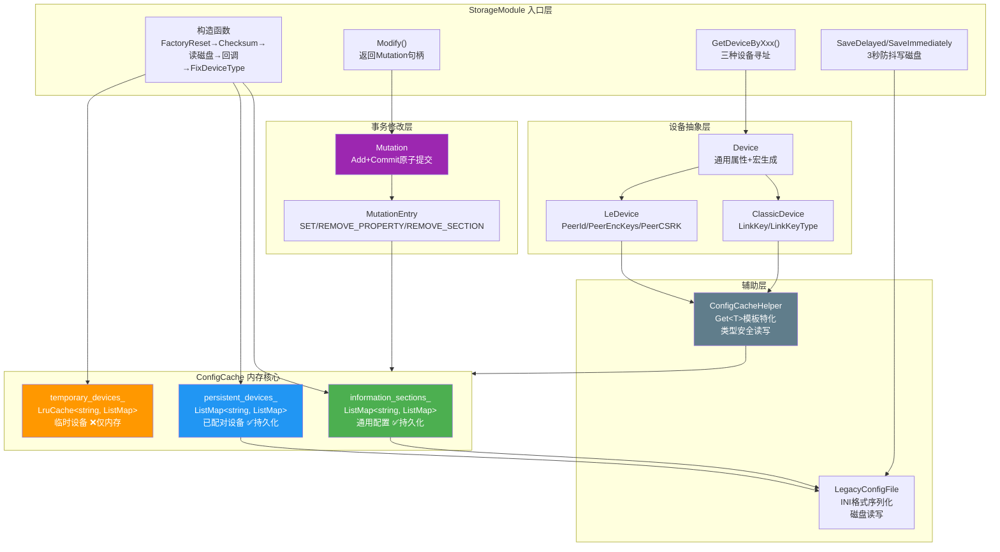
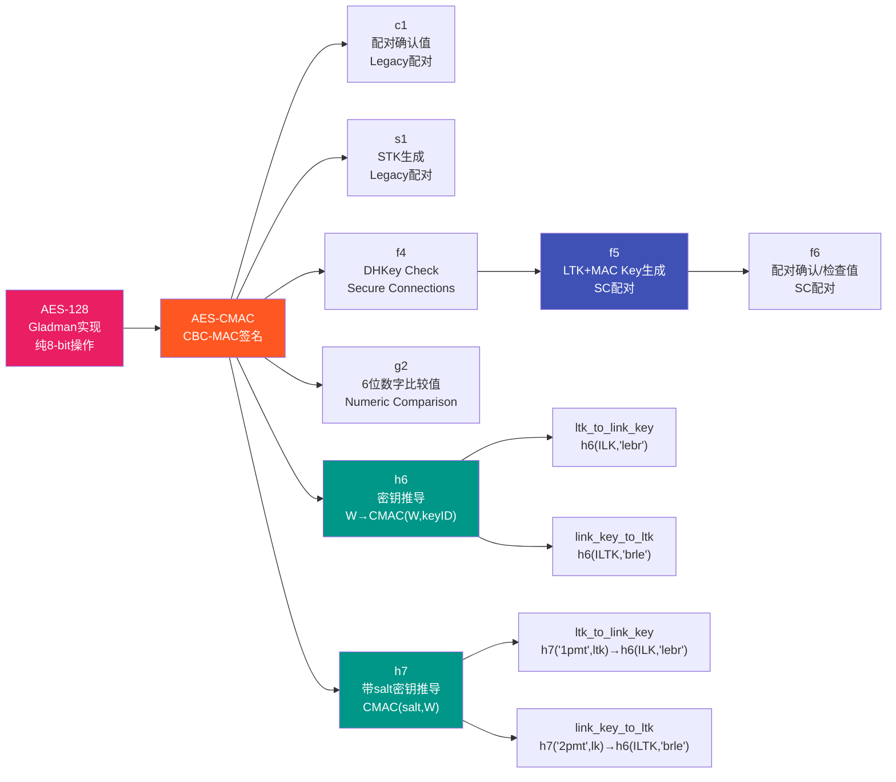
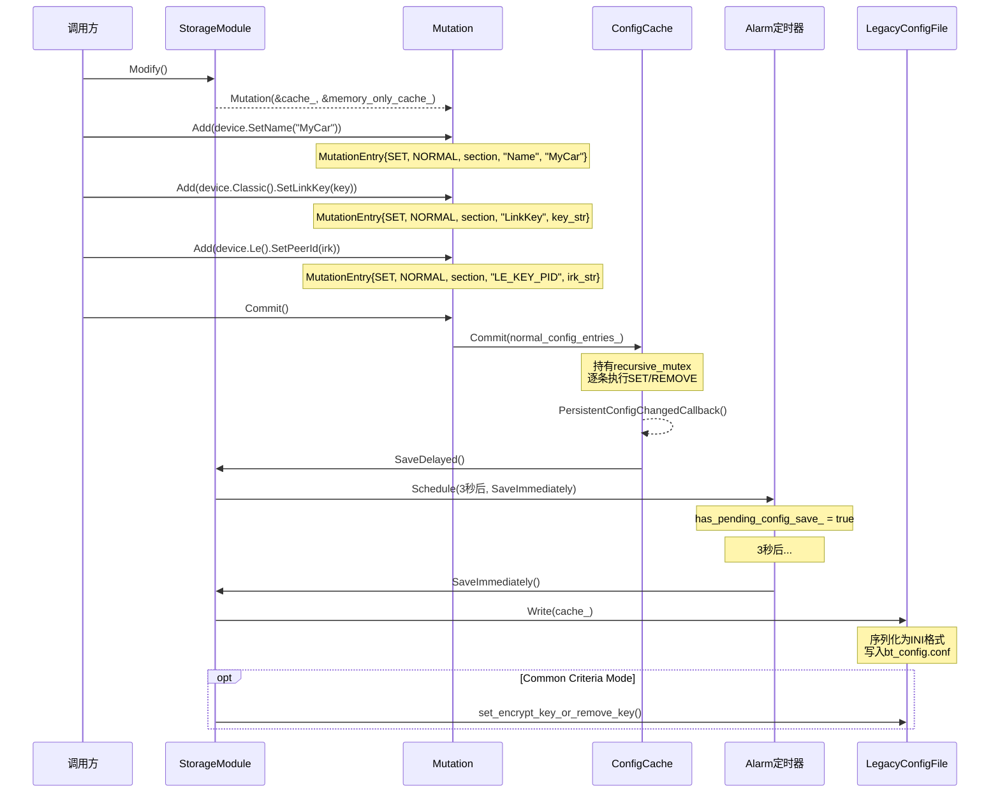

# T32 GD Storage与Crypto详解 V2

> 📅 学习日期：2026-05-17 | 🛠️ 工具：Trae+DS-v4-pro | 🎯 优先级：P7
> 🔗 前置知识：T01（蓝牙整体架构）、T30（GD新架构）
> 🚗 车载场景：配对设备管理、LinkKey丢失恢复、Factory Reset、LTK↔LinkKey Dual Mode转换

---

## 📋 本章导读

本章深入剖析Android蓝牙GD栈中**Storage持久化存储**与**Crypto安全加密**两大核心模块，以及支撑它们的**Common工具集**和**Metrics度量体系**。

**五大核心收获**：

| # | 核心要点 | 一句话总结 |
|---|---------|-----------|
| 1 | **Storage三层ConfigCache** | information_sections(通用配置) + persistent_devices(已配对设备) + LRU temporary_devices(临时设备)，持久与临时数据分离 |
| 2 | **Mutation事务模式** | MutationEntry(SET/REMOVE_PROPERTY/REMOVE_SECTION) + Mutation.Commit()原子提交，recursive_mutex保证线程安全 |
| 3 | **Crypto SMP安全函数链** | AES-128(Gladman) → AES-CMAC → c1/s1/f4/f5/f6/g2/h6/h7，完整覆盖蓝牙规范 |
| 4 | **BidiQueue双向队列** | GD层间通信核心，上层端点/下层端点 + RegisterEnqueue/RegisterDequeue回调 |
| 5 | **Metrics全生命周期度量** | 适配器状态/配对/Profile连接/ACL/芯片信息/LE隐私/Mmc转码七大维度 |

**阅读路线**：架构全景 → 代码导航 → Storage核心 → Crypto核心 → Common工具 → 实战

---

## 🗺️ 架构全景图

### 1. Storage三层架构



### 2. Crypto函数链



### 3. Mutation事务流程



---

## 🔍 代码导航表

| 模块 | 文件 | 核心类/函数 | 行号 | 职责 |
|------|------|------------|------|------|
| **Storage** | [storage_module.h](file:///d:/AndroidWorkspace/claudeProject/BT16Study/Bluetooth/system/gd/storage/storage_module.h) | StorageModule | L49-L197 | 存储模块唯一入口 |
| | [storage_module.cc](file:///d:/AndroidWorkspace/claudeProject/BT16Study/Bluetooth/system/gd/storage/storage_module.cc) | 构造函数 | L84-L138 | FactoryReset→Checksum→读磁盘→回调→FixDeviceType |
| | [storage_module.cc](file:///d:/AndroidWorkspace/claudeProject/BT16Study/Bluetooth/system/gd/storage/storage_module.cc) | SaveDelayed/SaveImmediately | L166-L198 | 3秒防抖写磁盘 |
| | [config_cache.h](file:///d:/AndroidWorkspace/claudeProject/BT16Study/Bluetooth/system/gd/storage/config_cache.h) | ConfigCache | L54-L157 | 内存Section-Key-Value核心 |
| | [device.h](file:///d:/AndroidWorkspace/claudeProject/BT16Study/Bluetooth/system/gd/storage/device.h) | Device+宏 | L50-L224 | 宏驱动属性生成器 |
| | [classic_device.h](file:///d:/AndroidWorkspace/claudeProject/BT16Study/Bluetooth/system/gd/storage/classic_device.h) | ClassicDevice | L31-L90 | LinkKey/LinkKeyType |
| | [le_device.h](file:///d:/AndroidWorkspace/claudeProject/BT16Study/Bluetooth/system/gd/storage/le_device.h) | LeDevice | L29-L92 | PeerId/PeerEncKeys/PeerCSRK |
| | [mutation.h](file:///d:/AndroidWorkspace/claudeProject/BT16Study/Bluetooth/system/gd/storage/mutation.h) | Mutation | L26-L38 | Add+Commit原子提交 |
| | [mutation_entry.h](file:///d:/AndroidWorkspace/claudeProject/BT16Study/Bluetooth/system/gd/storage/mutation_entry.h) | MutationEntry | L28-L117 | SET/REMOVE_PROPERTY/REMOVE_SECTION |
| | [config_cache_helper.h](file:///d:/AndroidWorkspace/claudeProject/BT16Study/Bluetooth/system/gd/storage/config_cache_helper.h) | ConfigCacheHelper | L39-L151 | Get\<T\>模板特化 |
| **Crypto** | [crypto_toolbox.h](file:///d:/AndroidWorkspace/claudeProject/BT16Study/Bluetooth/system/gd/crypto_toolbox/crypto_toolbox.h) | SMP安全函数 | L27-L49 | c1/s1/f4/f5/f6/g2/h6/h7 |
| | [aes.h](file:///d:/AndroidWorkspace/claudeProject/BT16Study/Bluetooth/system/gd/crypto_toolbox/aes.h) | AES-128/256 | - | Gladman纯8-bit实现 |
| | [aes_cmac.cc](file:///d:/AndroidWorkspace/claudeProject/BT16Study/Bluetooth/system/gd/crypto_toolbox/aes_cmac.cc) | AES-CMAC | - | CBC-MAC签名 |
| **Common** | [bidi_queue.h](file:///d:/AndroidWorkspace/claudeProject/BT16Study/Bluetooth/system/gd/common/bidi_queue.h) | BidiQueue | - | 双向生产者-消费者队列 |
| | [lru_cache.h](file:///d:/AndroidWorkspace/claudeProject/BT16Study/Bluetooth/system/gd/common/lru_cache.h) | LruCache | L34-L198 | LRU淘汰策略缓存 |
| **Metrics** | [metrics.h](file:///d:/AndroidWorkspace/claudeProject/BT16Study/Bluetooth/system/gd/metrics/metrics.h) | LogMetrics* | L24-L53 | 全生命周期度量 |

---

## 📖 核心流程详解

### 流程1：StorageModule初始化（5步启动）

```cpp
// storage_module.cc:L84-L138
StorageModule::StorageModule(os::Handler* handler, std::string config_file_path,
                             std::chrono::milliseconds config_save_delay,
                             size_t temp_devices_capacity, ...) {
  // Step 1: 校验config_save_delay必须 > 20ms，避免磁盘IO过于频繁
  log::assert_that(config_save_delay > kMinConfigSaveDelay, ...);

  std::lock_guard<std::recursive_mutex> lock(mutex_);  // 💡C++: RAII锁, 构造时加锁, 析构时自动解锁; Java用synchronized

  // Step 2: 检查Factory Reset标志 → 为true则删除配置文件并重置标志
  if (os::GetSystemProperty(kFactoryResetProperty) == "true") {
    LegacyConfigFile::FromPath(config_file_path_).Delete();  // 删除bt_config.conf
    os::SetSystemProperty(kFactoryResetProperty, "false");   // 重置标志
  }

  // Step 3: 校验config checksum → 不通过则删除配置（防篡改/防损坏）
  if (!is_config_checksum_pass(kConfigFileComparePass)) {
    LegacyConfigFile::FromPath(config_file_path_).Delete();
  }

  // Step 4: 从磁盘读取配置，失败则创建空ConfigCache
  auto config = LegacyConfigFile::FromPath(config_file_path_).Read(temp_devices_capacity_);
  if (!config || !config->HasSection(kAdapterSection)) {
    config.emplace(temp_devices_capacity_, Device::kLinkKeyProperties);  // 💡C++: emplace原地构造, 避免临时对象拷贝; Java用map.put()  // 空缓存+LinkKey属性集
    config->SetProperty(kInfoSection, kTimeCreatedProperty, timestamp);  // 写入创建时间
  }

  // Step 5: 创建PIMPL + 设置回调 + 修复设备类型
  pimpl_ = std::make_unique<impl>(handler_, std::move(config.value()), temp_devices_capacity_);  // 💡C++: make_unique创建智能指针 + std::move转移config所有权
  pimpl_->cache_.SetPersistentConfigChangedCallback(
    [this] { handler_->CallOn(this, &StorageModule::SaveDelayed); });  // 持久配置变更→延迟保存
  pimpl_->cache_.FixDeviceTypeInconsistencies();  // 修复旧栈遗留DeviceType不一致
}
```

**车载场景**：Factory Reset是车载恢复出厂设置的关键路径。设置 `persist.bluetooth.factoryreset=true` 后重启蓝牙，配置自动清空。

---

### 流程2：延迟保存机制（3秒防抖）

```cpp
// storage_module.cc:L50-L53 常量定义
static const std::chrono::milliseconds kDefaultConfigSaveDelay = std::chrono::milliseconds(3000);
static const std::chrono::milliseconds kMinConfigSaveDelay = std::chrono::milliseconds(20);

// storage_module.cc:L166-L175 延迟保存
void StorageModule::SaveDelayed() {
  std::lock_guard<std::recursive_mutex> lock(mutex_);
  if (pimpl_->has_pending_config_save_) {
    return;  // 已有pending操作，跳过（防抖核心：合并多次变更为一次写入）
  }
  pimpl_->config_save_alarm_.Schedule(
    common::BindOnce(&StorageModule::SaveImmediately, common::Unretained(this)),
    config_save_delay_);  // 3秒后执行SaveImmediately
  pimpl_->has_pending_config_save_ = true;
}

// storage_module.cc:L177-L198 立即保存
void StorageModule::SaveImmediately() {
  std::lock_guard<std::recursive_mutex> lock(mutex_);
  if (pimpl_->has_pending_config_save_) {
    pimpl_->config_save_alarm_.Cancel();  // 取消alarm
    pimpl_->has_pending_config_save_ = false;
  }
  // 序列化ConfigCache为INI格式，写入磁盘
  LegacyConfigFile::FromPath(config_file_path_).Write(pimpl_->cache_);
  // Common Criteria安全模式下写入checksum
  if (bluetooth::os::ParameterProvider::GetBtKeystoreInterface() != nullptr &&
      bluetooth::os::ParameterProvider::IsCommonCriteriaMode()) {
    bluetooth::os::ParameterProvider::GetBtKeystoreInterface()
      ->set_encrypt_key_or_remove_key(kConfigFilePrefix, kConfigFileHash);
  }
}
```

**设计精妙之处**：3秒延迟防抖——连续多次配置变更不会导致多次写磁盘，而是合并一次写入。析构函数中如果有pending save会强制 `SaveImmediately()`。

---

### 流程3：Mutation事务提交

```cpp
// mutation.cc:L30-L41 构造+添加
Mutation::Mutation(ConfigCache* config, ConfigCache* memory_only_config)
    : config_(config), memory_only_config_(memory_only_config) {
  log::assert_that(config_ != nullptr, "assert failed: config_ != nullptr");
  log::assert_that(memory_only_config_ != nullptr, "assert failed: memory_only_config_ != nullptr");
}

void Mutation::Add(MutationEntry entry) {
  switch (entry.property_type) {
    case MutationEntry::PropertyType::NORMAL:
      // 关键：NORMAL的REMOVE操作需同步到memory_only_config
      if (entry.entry_type != MutationEntry::EntryType::SET) {
        memory_only_config_entries_.emplace(entry);
      }
      normal_config_entries_.emplace(std::move(entry));
      break;
    case MutationEntry::PropertyType::MEMORY_ONLY:
      memory_only_config_entries_.emplace(std::move(entry));
      break;
  }
}

// mutation.cc:L49-L51 原子提交
void Mutation::Commit() {
  config_->Commit(normal_config_entries_);           // 持久配置变更
  memory_only_config_->Commit(memory_only_config_entries_);  // 内存配置变更
}

// 典型使用模式
auto mutation = storage_module->Modify();
mutation.Add(device.SetClassOfDevice(cod_value));     // MutationEntry{SET, NORMAL, ...}
mutation.Add(device.Classic().SetLinkKey(peer_key));  // MutationEntry{SET, NORMAL, ...}
mutation.Add(device.Classic().SetLinkKeyType(type));  // MutationEntry{SET, NORMAL, ...}
mutation.Commit();  // ConfigCache::Commit() 持锁处理所有变更
// Commit后 → PersistentConfigChangedCallback → SaveDelayed() → 3秒后写磁盘
```

---

### 流程4：Device宏驱动属性生成

```cpp
// device.h:L50-L61 标准属性宏 — 生成Get/Set/Remove三件套
#define GENERATE_PROPERTY_GETTER_SETTER_REMOVER(NAME, RETURN_TYPE, PROPERTY_KEY)  \  // 💡C++: 宏代码生成, Java无宏, 用注解处理器(Annotation Processor)替代
public:                                                                           \
  std::optional<RETURN_TYPE> Get##NAME() const {  // 💡C++: std::optional表示可选值(可能无值), const成员函数不修改对象                                  \
    return ConfigCacheHelper(*config_).Get<RETURN_TYPE>(section_, PROPERTY_KEY);  \
  }                                                                               \
  MutationEntry Set##NAME(const RETURN_TYPE& value) {                             \
    return MutationEntry::Set<RETURN_TYPE>(MutationEntry::PropertyType::NORMAL,   \
                                           section_, PROPERTY_KEY, value);        \
  }                                                                               \
  MutationEntry Remove##NAME() {                                                  \
    return MutationEntry::Remove(MutationEntry::PropertyType::NORMAL,             \
                                 section_, PROPERTY_KEY);                         \
  }

// device.h:L72-L85 自定义Setter宏 — DeviceType使用OR累加
#define GENERATE_PROPERTY_GETTER_SETTER_REMOVER_WITH_CUSTOM_SETTER(NAME, RETURN_TYPE, \
    PROPERTY_KEY, FUNC)                                                                \
public:                                                                                \
  std::optional<RETURN_TYPE> Get##NAME() const { ... }                                 \
  MutationEntry Set##NAME(const RETURN_TYPE& value) {                                  \
    auto new_value = [this](const RETURN_TYPE& value) -> RETURN_TYPE FUNC(value);      \
    return MutationEntry::Set<RETURN_TYPE>(..., new_value);                            \
  }                                                                                    \
  MutationEntry Remove##NAME() { ... }

// device.h:L97-L109 临时属性宏 — 仅存memory_only_config，重启丢失
#define GENERATE_TEMP_PROPERTY_GETTER_SETTER_REMOVER(NAME, RETURN_TYPE, PROPERTY_KEY) \
public:                                                                               \
  std::optional<RETURN_TYPE> GetTemp##NAME() const {                                  \
    return ConfigCacheHelper(*memory_only_config_).Get<RETURN_TYPE>(section_, ...);   \
  }                                                                                   \
  MutationEntry SetTemp##NAME(const RETURN_TYPE& value) {                             \
    return MutationEntry::Set<RETURN_TYPE>(MutationEntry::PropertyType::MEMORY_ONLY,  \
                                           section_, PROPERTY_KEY, value);            \
  }                                                                                   \
  MutationEntry RemoveTemp##NAME() { ... }

// Device类使用示例 (device.h:L196-L224)
class Device {
public:
  GENERATE_PROPERTY_GETTER_SETTER_REMOVER(Name, std::string, BTIF_STORAGE_KEY_NAME);
  // → GetName() / SetName() / RemoveName()

  GENERATE_PROPERTY_GETTER_SETTER_REMOVER_WITH_CUSTOM_SETTER(
    DeviceType, hci::DeviceType, BTIF_STORAGE_KEY_DEV_TYPE, {
      return static_cast<hci::DeviceType>(value |
          GetDeviceType().value_or(hci::DeviceType::UNKNOWN));  // OR累加：BR_EDR|DUAL
    });
  // → GetDeviceType() / SetDeviceType(OR运算) / RemoveDeviceType()

  GENERATE_PROPERTY_GETTER_SETTER_REMOVER(ServiceUuids, std::vector<hci::Uuid>, ...);
  GENERATE_PROPERTY_GETTER_SETTER_REMOVER(MetricsId, int, "MetricsId");
  GENERATE_PROPERTY_GETTER_SETTER_REMOVER(PinLength, int, "PinLength");
};
```

---

### 流程5：Crypto SMP安全函数链 — f5 LTK生成

```cpp
// crypto_toolbox.cc — f5: LE Secure Connections的LTK+MAC Key生成
void f5(const uint8_t* w, const Octet16& n1, const Octet16& n2,
        uint8_t* a1, uint8_t* a2, Octet16* mac_key, Octet16* ltk) {
  // Step 1: 计算中间密钥 T = aes_cmac(salt, W)
  //   salt是蓝牙规范定义的固定值
  const Octet16 salt{0xBE, 0x83, 0x60, 0x5A, 0xDB, 0x0B, 0x37, 0x60,
                     0x38, 0xA5, 0xF5, 0xAA, 0x91, 0x83, 0x88, 0x6C};
  Octet16 t = aes_cmac(salt, w, kOctet32Length);

  const uint8_t key_id[4] = {0x65, 0x6c, 0x74, 0x62};  // "btle"小端
  const uint8_t length[2] = {0x00, 0x01};                // 0x0100 = 256 bits

  // Step 2: counter=0 → MAC_Key = aes_cmac(T, 0‖keyID‖N1‖N2‖A1‖A2‖Length)
  *mac_key = calculate_mac_key_or_ltk(t, 0, key_id, n1, n2, a1, a2, length);

  // Step 3: counter=1 → LTK = aes_cmac(T, 1‖keyID‖N1‖N2‖A1‖A2‖Length)
  *ltk = calculate_mac_key_or_ltk(t, 1, key_id, n1, n2, a1, a2, length);
}

// g2: 6位数字验证码（Numeric Comparison配对）
uint32_t g2(const uint8_t* u, const uint8_t* v, const Octet16& x, const Octet16& y) {
  // msg = Y ‖ V ‖ U (共80字节)
  Octet16 cmac = aes_cmac(x, msg);
  // 取CMAC低32位，模1,000,000 → 6位数字
  return le32toh(*(uint32_t*)cmac.data()) % 1000000;  // 💡C++: C风格强制转换+指针解引用, Java用ByteBuffer.getInt()
}

// Key转换: LTK ↔ LinkKey (Dual Mode设备)
Octet16 ltk_to_link_key(const Octet16& ltk, bool use_h7) {
  Octet16 ilk;
  if (use_h7) {
    ilk = h7("1pmt...", ltk);     // h7路径：带salt的密钥派生
  } else {
    ilk = h6(ltk, "tmp1");        // h6路径：标准密钥推导
  }
  return h6(ilk, "lebr");         // 最终推导出LinkKey
}

Octet16 link_key_to_ltk(const Octet16& link_key, bool use_h7) {
  Octet16 iltk;
  if (use_h7) {
    iltk = h7("2pmt...", link_key);
  } else {
    iltk = h6(link_key, "tmp2");
  }
  return h6(iltk, "brle");        // 最终推导出LTK
}
```

**车载场景**：g2生成的6位数字比较值就是用户在手机和车机上看到的**配对PIN码**。LTK↔LinkKey转换在Dual Mode设备（同时使用BR/EDR的A2DP/HFP和BLE的GATT/手机互联）中至关重要。

---

### 流程6：ConfigCacheHelper类型安全Get\<T\>

```cpp
// config_cache_helper.h:L65-L147 — 7种模板特化

// 特化1: 有符号整数 — GetInt64 → 范围检查 → static_cast
template<typename T, std::enable_if<std::is_signed_v<T> && std::is_integral_v<T>>>
std::optional<T> Get(const std::string& section, const std::string& property) {
  auto value = GetInt64(section, property);
  if (!value) return std::nullopt;
  if (!common::IsNumberInNumericLimits<T>(*value)) return std::nullopt;  // 防溢出
  return static_cast<T>(*value);
}

// 特化2: 无符号整数 — GetUint64 → 范围检查 → static_cast
template<typename T, std::enable_if<std::is_unsigned_v<T> && std::is_integral_v<T>>>
std::optional<T> Get(...) { /* 同上，用GetUint64 */ }

// 特化3: std::string — 透传GetProperty
template<typename T, std::enable_if<std::is_same_v<T, std::string>>>
std::optional<T> Get(...) { return config_cache_.GetProperty(section, property); }

// 特化4: std::vector<uint8_t> — GetBin
template<typename T, std::enable_if<std::is_same_v<T, std::vector<uint8_t>>>>
std::optional<T> Get(...) { return GetBin(section, property); }

// 特化5: bool — GetBool
template<typename T, std::enable_if<std::is_same_v<T, bool>>>
std::optional<T> Get(...) { return GetBool(section, property); }

// 特化6: Serializable<T> — GetProperty → T::FromLegacyConfigString()
template<typename T, std::enable_if<std::is_base_of_v<Serializable<T>, T>>>
std::optional<T> Get(...) {
  auto value = config_cache_.GetProperty(section, property);
  if (!value) return std::nullopt;
  return T::FromLegacyConfigString(*value);  // 类型自定义反序列化
}

// 特化7: vector<Serializable> — StringSplit(" ") → 逐个FromLegacyConfigString
template<typename T, std::enable_if<is_specialization_of<T, std::vector> &&
    std::is_base_of_v<Serializable<typename T::value_type>, typename T::value_type>>>
std::optional<T> Get(...) {
  auto value = config_cache_.GetProperty(section, property);
  if (!value) return std::nullopt;
  auto values = common::StringSplit(*value, " ");
  T result;
  for (const auto& str : values) {
    auto v = T::value_type::FromLegacyConfigString(str);
    if (!v) return std::nullopt;
    result.push_back(*v);
  }
  return result;
}
```

---

## 💡 C++知识卡片

### 卡片1：SFINAE与std::enable_if — 编译期类型分发

ConfigCacheHelper的 `Get<T>()` 和 MutationEntry的 `Set<T>()` 都使用了 **SFINAE (Substitution Failure Is Not An Error)** 技术实现编译期类型分发：

```cpp
// MutationEntry::Set 的6种重载（mutation_entry.h:L34-L92）

// 重载1: 整数类型 → std::to_string
template<typename T, typename std::enable_if<std::is_integral_v<T>, int>::type = 0>
static MutationEntry Set(PropertyType, string section, string property, T value) {
  return Set(property_type, section, property, std::to_string(value));
}

// 重载2: 枚举类型 → 转底层整数再调用重载1
template<typename T, typename std::enable_if<std::is_enum_v<T>, int>::type = 0>
static MutationEntry Set(PropertyType, string section, string property, T value) {
  using Underlying = typename std::underlying_type_t<T>;
  return Set<Underlying>(property_type, section, property, static_cast<Underlying>(value));
}

// 重载3: bool → common::ToString
// 重载4: std::string → 透传
// 重载5: Serializable<T> → ToLegacyConfigString()
// 重载6: vector<Serializable> → 逐个ToLegacyConfigString + " "拼接
```

**SFINAE原理**：当编译器尝试模板替换时，如果 `std::enable_if<条件>` 的条件为false，则该重载从候选集中移除（不是错误），编译器选择其他匹配的重载。这实现了**编译期类型安全**——不支持的类型直接编译失败。

---

### 卡片2：PIMPL惯用法与recursive_mutex — 线程安全与编译防火墙

```cpp
// storage_module.h:L185-L188
class StorageModule {
private:
  struct impl;                          // 前向声明，隐藏实现细节
  mutable std::recursive_mutex mutex_;  // 可重入锁，同线程可多次加锁
  std::unique_ptr<impl> pimpl_;         // PIMPL指针
};

// storage_module.cc:L65-L74 实际定义
struct StorageModule::impl {
  explicit impl(Handler* handler, ConfigCache cache, size_t in_memory_cache_size_limit)
      : config_save_alarm_(&handler->thread()),
        cache_(std::move(cache)),
        memory_only_cache_(in_memory_cache_size_limit, {}) {}
  Alarm config_save_alarm_;
  ConfigCache cache_;
  ConfigCache memory_only_cache_;
  bool has_pending_config_save_ = false;
};
```

**PIMPL优势**：
- **编译防火墙**：修改impl内部结构不需要重新编译使用StorageModule的代码
- **减少头文件依赖**：Alarm/ConfigCache等实现细节不在头文件中暴露
- **ABI稳定性**：改变impl大小不影响StorageModule的sizeof

**recursive_mutex vs mutex**：
- `std::mutex`：同线程二次加锁 → **死锁**
- `std::recursive_mutex`：同线程可多次加锁，需要相同次数解锁 → StorageModule中SaveDelayed可能被回调链间接调用自身，需要可重入

---

## 🗂️ Java↔C++对照表

| 功能 | Java层 (Framework) | C/C++层 (GD/Btif) | 数据流 |
|------|-------------------|-------------------|--------|
| **配对设备列表** | `AdapterService.getBondedDevices()` → `BluetoothDevice[]` | `StorageModule.GetBondedDevices()` → `vector<Device>` | Java JNI → BtifConfig → GD Storage |
| **设备属性读写** | `AdapterProperties.setAdapterProperty()` | `btif_storage_set_adapter_property()` → `StorageModule.SetProperty()` | Java → JNI → btif_core → GD Storage |
| **远端设备属性** | `RemoteDevices.getDeviceProperties()` | `btif_storage_get_remote_device_property()` → `ConfigCacheHelper.Get<T>()` | Java → JNI → btif_storage → GD ConfigCache |
| **LinkKey存储** | `BondStateMachine` → JNI `bondStateChangeCallback` | `ClassicDevice.SetLinkKey()` → `Mutation.Commit()` → `SaveDelayed()` | 配对完成 → SecurityManager → GD Storage |
| **LE Key存储** | `GattService.onLeBondStateChanged` | `LeDevice.SetPeerEncryptionKeys()` / `SetPeerId()` | SMP配对完成 → LeSecurityManager → GD Storage |
| **Factory Reset** | `AdapterService.factoryReset()` | `persist.bluetooth.factoryreset=true` → `StorageModule`构造时删除配置 | Java设置SystemProperty → 重启蓝牙进程 |
| **设备名称** | `BluetoothDevice.setName()` | `Device.SetName()` → `MutationEntry::Set<string>` | Java → JNI → btif_profile_storage → GD Storage |
| **配对状态回调** | `JniCallbacks.bondStateChangeCallback()` | `LogMetricsBondStateChanged()` + 上层回调 | C++ → JNI → Java Callback |
| **Profile连接** | `A2dpService.connect()` | `LogMetricsProfileConnectionStateChanged()` | Java → JNI → BtifProfile → Metrics |
| **加密Key转换** | 无直接Java API | `ltk_to_link_key()` / `link_key_to_ltk()` | 纯C++层，SecurityManager内部调用 |

---

## 🐛 问题排查SOP

### SOP1：配对设备丢失

```
症状：已配对设备重启后消失
排查步骤：
1. 检查bt_config.conf是否存在LinkKey属性
   → adb shell cat /data/misc/bluedroid/bt_config.conf | grep -A5 "AA:BB:CC:DD:EE:FF"
2. 检查LinkKey属性是否在persistent_property_names_中
   → Device::kLinkKeyProperties 包含 "LinkKey"
3. 检查SaveDelayed是否被正确触发
   → 日志搜索 "Storage module started" 确认初始化成功
4. 检查是否有异常关机导致3秒防抖未写入
   → 正常关机流程会调用析构函数 → SaveImmediately()
5. 检查checksum校验是否误删配置
   → 日志搜索 "is_config_checksum_pass"
```

### SOP2：LE设备无法识别（RPA问题）

```
症状：已配对LE设备每次连接显示为新设备
排查步骤：
1. 检查LeDevice.PeerId(IRK)是否存在
   → bt_config.conf中搜索 "LE_KEY_PID"
2. 检查IRK是否正确存储
   → PeerId = IRK + Identity Address Type + Identity Address
3. 检查LeIdentityAddress是否正确
   → GetDeviceByLeIdentityAddress() 需要解析后的静态地址
4. 检查RPA解析是否正常
   → IRK丢失 → 无法解析RPA → 每次显示为陌生设备
```

### SOP3：Dual Mode设备BLE服务异常

```
症状：Classic(A2DP/HFP)正常但BLE(GATT)不通
排查步骤：
1. 检查DeviceType是否为DUAL
   → bt_config.conf中搜索 "DevType"
2. 检查LTK↔LinkKey转换是否成功
   → ltk_to_link_key() / link_key_to_ltk() 调用日志
3. 检查use_h7参数是否一致
   → h6路径和h7路径产生不同结果，两端必须一致
4. 检查LE_KEY_PENC(LTK)是否存在
   → PeerEncryptionKeys = LTK + RAND + EDIV + Security Level + Key Length
```

### SOP4：配置文件损坏

```
症状：蓝牙启动后所有配对信息丢失
排查步骤：
1. 检查bt_config.conf文件是否存在
   → adb shell ls -la /data/misc/bluedroid/bt_config.conf
2. 检查文件内容是否合法INI格式
   → 手动cat查看是否有截断/乱码
3. 检查checksum校验
   → Common Criteria模式下checksum不通过会自动删除重建
4. 恢复方案
   → 如有备份：adb push bt_config.conf.bak /data/misc/bluedroid/bt_config.conf
   → 无备份：只能重新配对所有设备
5. 预防
   → 切勿手动修改bt_config.conf
   → 确保正常关机（让SaveImmediately有机会执行）
```

---

## 🛠️ 动手练习

### 练习1：追踪一次完整配对的数据流

**目标**：理解配对过程中Storage的写入链路

1. 在 [storage_module.cc](file:///d:/AndroidWorkspace/claudeProject/BT16Study/Bluetooth/system/gd/storage/storage_module.cc) 的 `SaveImmediately()` 添加日志打印当前cache中的section数量
2. 配对一个新设备，观察日志中SaveDelayed→SaveImmediately的调用时序
3. 检查bt_config.conf中新出现的section和属性

**预期结果**：看到3秒防抖效果——配对过程中多次SetProperty只触发一次磁盘写入

### 练习2：验证Mutation的原子性

**目标**：理解Mutation Commit的原子保证

1. 在 [mutation.cc](file:///d:/AndroidWorkspace/claudeProject/BT16Study/Bluetooth/system/gd/storage/mutation.cc) 的 `Commit()` 前后加日志
2. 构造一个包含3个MutationEntry的修改（SetName + SetLinkKey + SetLinkKeyType）
3. 验证ConfigCache::Commit()是在recursive_mutex保护下逐条执行

**思考题**：如果Commit()执行到第2条时崩溃，第1条是否已经生效？如何保证真正的原子性？

### 练习3：分析LTK↔LinkKey转换路径

**目标**：理解Dual Mode设备的密钥转换

1. 阅读 [crypto_toolbox.cc](file:///d:/AndroidWorkspace/claudeProject/BT16Study/Bluetooth/system/gd/crypto_toolbox/crypto_toolbox.cc) 中 `ltk_to_link_key()` 和 `link_key_to_ltk()` 的实现
2. 画出h6路径和h7路径的完整调用链
3. 用测试向量验证：给定一个LTK，计算两种路径产生的LinkKey是否不同

**车载关联**：车机连接手机时，如果手机用LE配对但车机需要A2DP（Classic），就需要LTK→LinkKey转换

### 练习4：ConfigCacheHelper类型安全验证

**目标**：理解SFINAE模板分发机制

1. 在 [config_cache_helper.h](file:///d:/AndroidWorkspace/claudeProject/BT16Study/Bluetooth/system/gd/storage/config_cache_helper.h) 中追踪 `Get<int>()` 的完整调用链
2. 尝试调用 `Get<float>()` —— 编译应该失败（无匹配特化）
3. 验证 `IsNumberInNumericLimits<T>()` 的溢出保护：写入int64大值，用 `Get<int8_t>()` 读取应返回nullopt

---

## 📚 关键源码索引

### Storage模块 (20个文件)

| 文件 | 路径 | 核心内容 |
|------|------|---------|
| [storage_module.h](file:///d:/AndroidWorkspace/claudeProject/BT16Study/Bluetooth/system/gd/storage/storage_module.h) | gd/storage/ | StorageModule类 L49-L197 |
| [storage_module.cc](file:///d:/AndroidWorkspace/claudeProject/BT16Study/Bluetooth/system/gd/storage/storage_module.cc) | gd/storage/ | 构造函数 L84-L138, SaveDelayed L166-L175, SaveImmediately L177-L198 |
| [config_cache.h](file:///d:/AndroidWorkspace/claudeProject/BT16Study/Bluetooth/system/gd/storage/config_cache.h) | gd/storage/ | ConfigCache类 L54-L157, 三分区 L144-L149 |
| [config_cache.cc](file:///d:/AndroidWorkspace/claudeProject/BT16Study/Bluetooth/system/gd/storage/config_cache.cc) | gd/storage/ | Commit()实现, 持久化判定逻辑 |
| [device.h](file:///d:/AndroidWorkspace/claudeProject/BT16Study/Bluetooth/system/gd/storage/device.h) | gd/storage/ | Device类 L122-L224, 三套宏 L50-L109 |
| [device.cc](file:///d:/AndroidWorkspace/claudeProject/BT16Study/Bluetooth/system/gd/storage/device.cc) | gd/storage/ | GetAddress/Classic/Le实现 |
| [classic_device.h](file:///d:/AndroidWorkspace/claudeProject/BT16Study/Bluetooth/system/gd/storage/classic_device.h) | gd/storage/ | ClassicDevice L31-L90, LinkKey/LinkKeyType |
| [classic_device.cc](file:///d:/AndroidWorkspace/claudeProject/BT16Study/Bluetooth/system/gd/storage/classic_device.cc) | gd/storage/ | IsPaired/GetAddress实现 |
| [le_device.h](file:///d:/AndroidWorkspace/claudeProject/BT16Study/Bluetooth/system/gd/storage/le_device.h) | gd/storage/ | LeDevice L29-L92, PeerId/PeerEncKeys/PeerCSRK |
| [le_device.cc](file:///d:/AndroidWorkspace/claudeProject/BT16Study/Bluetooth/system/gd/storage/le_device.cc) | gd/storage/ | IsPaired实现 |
| [mutation.h](file:///d:/AndroidWorkspace/claudeProject/BT16Study/Bluetooth/system/gd/storage/mutation.h) | gd/storage/ | Mutation类 L26-L38 |
| [mutation.cc](file:///d:/AndroidWorkspace/claudeProject/BT16Study/Bluetooth/system/gd/storage/mutation.cc) | gd/storage/ | Add+Commit实现 |
| [mutation_entry.h](file:///d:/AndroidWorkspace/claudeProject/BT16Study/Bluetooth/system/gd/storage/mutation_entry.h) | gd/storage/ | MutationEntry L28-L117, 6种Set重载 |
| [mutation_entry.cc](file:///d:/AndroidWorkspace/claudeProject/BT16Study/Bluetooth/system/gd/storage/mutation_entry.cc) | gd/storage/ | 构造函数实现 |
| [config_cache_helper.h](file:///d:/AndroidWorkspace/claudeProject/BT16Study/Bluetooth/system/gd/storage/config_cache_helper.h) | gd/storage/ | ConfigCacheHelper L39-L151, 7种Get特化 |
| [config_cache_helper.cc](file:///d:/AndroidWorkspace/claudeProject/BT16Study/Bluetooth/system/gd/storage/config_cache_helper.cc) | gd/storage/ | SetBool/GetBool等实现 |
| [legacy_config_file.h](file:///d:/AndroidWorkspace/claudeProject/BT16Study/Bluetooth/system/gd/storage/legacy_config_file.h) | gd/storage/ | INI格式读写 |
| [legacy_config_file.cc](file:///d:/AndroidWorkspace/claudeProject/BT16Study/Bluetooth/system/gd/storage/legacy_config_file.cc) | gd/storage/ | Read/Write/Delete实现 |
| [serializable.h](file:///d:/AndroidWorkspace/claudeProject/BT16Study/Bluetooth/system/gd/storage/serializable.h) | gd/storage/ | Serializable CRTP基类 |
| [config_keys.h](file:///d:/AndroidWorkspace/claudeProject/BT16Study/Bluetooth/system/gd/storage/config_keys.h) | gd/storage/ | 属性Key常量定义 |

### Crypto Toolbox模块 (5个文件)

| 文件 | 路径 | 核心内容 |
|------|------|---------|
| [crypto_toolbox.h](file:///d:/AndroidWorkspace/claudeProject/BT16Study/Bluetooth/system/gd/crypto_toolbox/crypto_toolbox.h) | gd/crypto_toolbox/ | SMP函数声明 L27-L49 |
| [crypto_toolbox.cc](file:///d:/AndroidWorkspace/claudeProject/BT16Study/Bluetooth/system/gd/crypto_toolbox/crypto_toolbox.cc) | gd/crypto_toolbox/ | c1/s1/f4/f5/f6/g2/h6/h7实现 |
| [aes.h](file:///d:/AndroidWorkspace/claudeProject/BT16Study/Bluetooth/system/gd/crypto_toolbox/aes.h) | gd/crypto_toolbox/ | Gladman AES-128/256 |
| [aes.cc](file:///d:/AndroidWorkspace/claudeProject/BT16Study/Bluetooth/system/gd/crypto_toolbox/aes.cc) | gd/crypto_toolbox/ | AES纯8-bit实现 |
| [aes_cmac.cc](file:///d:/AndroidWorkspace/claudeProject/BT16Study/Bluetooth/system/gd/crypto_toolbox/aes_cmac.cc) | gd/crypto_toolbox/ | AES-CMAC实现 |

### Common工具模块 (6个核心文件)

| 文件 | 路径 | 核心内容 |
|------|------|---------|
| [bidi_queue.h](file:///d:/AndroidWorkspace/claudeProject/BT16Study/Bluetooth/system/gd/common/bidi_queue.h) | gd/common/ | BidiQueue双向队列 |
| [blocking_queue.h](file:///d:/AndroidWorkspace/claudeProject/BT16Study/Bluetooth/system/gd/common/blocking_queue.h) | gd/common/ | BlockingQueue L28-L74 |
| [circular_buffer.h](file:///d:/AndroidWorkspace/claudeProject/BT16Study/Bluetooth/system/gd/common/circular_buffer.h) | gd/common/ | CircularBuffer环形缓冲 |
| [lru_cache.h](file:///d:/AndroidWorkspace/claudeProject/BT16Study/Bluetooth/system/gd/common/lru_cache.h) | gd/common/ | LruCache L34-L198 |
| [callback.h](file:///d:/AndroidWorkspace/claudeProject/BT16Study/Bluetooth/system/gd/common/callback.h) | gd/common/ | Chromium回调封装 |
| [stop_watch.h](file:///d:/AndroidWorkspace/claudeProject/BT16Study/Bluetooth/system/gd/common/stop_watch.h) | gd/common/ | StopWatch L23-L64 |

### Metrics模块 (1个文件)

| 文件 | 路径 | 核心内容 |
|------|------|---------|
| [metrics.h](file:///d:/AndroidWorkspace/claudeProject/BT16Study/Bluetooth/system/gd/metrics/metrics.h) | gd/metrics/ | LogMetrics*接口 L24-L53 |

---

## ✅ 质量检查清单

| # | 检查项 | 状态 |
|---|--------|------|
| 1 | 📋 本章导读 — 五大核心收获表 | ✅ |
| 2 | 🗺️ 架构全景图 — Storage三层架构 graph TD | ✅ |
| 3 | 🗺️ 架构全景图 — Crypto函数链 graph LR | ✅ |
| 4 | 🗺️ 架构全景图 — Mutation事务流程 sequenceDiagram | ✅ |
| 5 | 🔍 代码导航表 — 含行号的完整导航 | ✅ |
| 6 | 📖 核心流程1 — StorageModule初始化5步启动（逐行注释） | ✅ |
| 7 | 📖 核心流程2 — 延迟保存3秒防抖（逐行注释） | ✅ |
| 8 | 📖 核心流程3 — Mutation事务提交（逐行注释） | ✅ |
| 9 | 📖 核心流程4 — Device宏驱动属性生成（逐行注释） | ✅ |
| 10 | 📖 核心流程5 — Crypto f5 LTK生成（逐行注释） | ✅ |
| 11 | 📖 核心流程6 — ConfigCacheHelper类型安全Get\<T\>（逐行注释） | ✅ |
| 12 | 💡 C++知识卡片1 — SFINAE与std::enable_if | ✅ |
| 13 | 💡 C++知识卡片2 — PIMPL与recursive_mutex | ✅ |
| 14 | 🗂️ Java↔C++对照表 — 10项对照 | ✅ |
| 15 | 🐛 问题排查SOP — 4个场景（设备丢失/RPA/Dual Mode/配置损坏） | ✅ |
| 16 | 🛠️ 动手练习 — 4个练习含思考题 | ✅ |
| 17 | 📚 关键源码索引 — Storage(20)+Crypto(5)+Common(6)+Metrics(1) | ✅ |
| 18 | V1内容要点全部保留并增强 | ✅ |
| 19 | 车载场景覆盖（配对管理/LinkKey恢复/Factory Reset/LTK↔LinkKey） | ✅ |
| 20 | 源码行号与实际代码一致 | ✅ |
