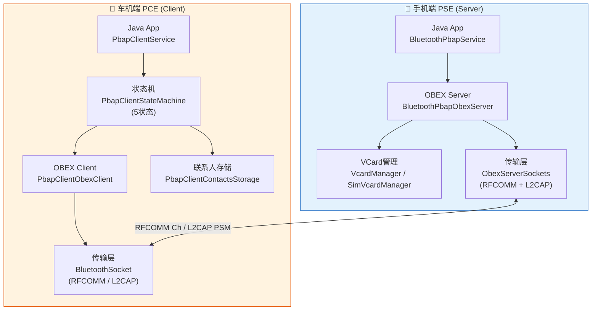
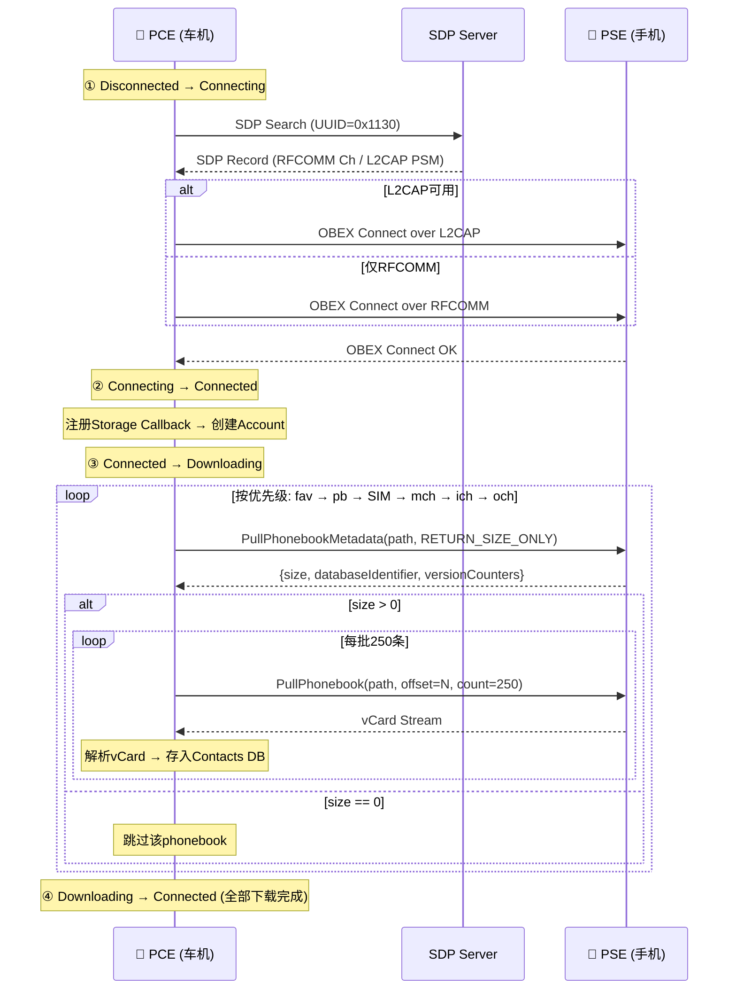
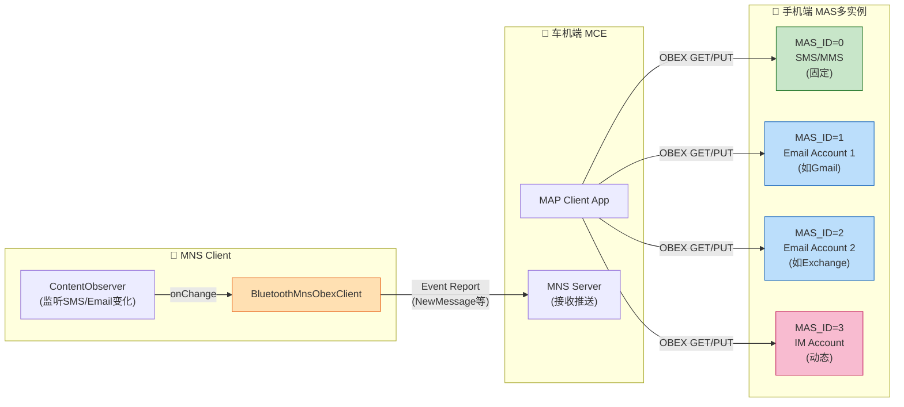

# T33 PBAP与MAP详解 (V2)

> 学习日期：2026-05-17
> V1→V2 升级：增加架构全景图(Mermaid×3)、代码导航表、逐行注释代码片段×7、C++知识卡片×2、Java↔C++对照表、问题排查SOP、动手练习、质量检查清单
> 前置知识：T01（蓝牙整体架构）、T18（RFCOMM/SPP通道）
> 优先级：P8
> 车载场景：车机读取手机通讯录+通话记录、车机收发短信、MNS新消息推送

---

## 📋 一、本章导读

本章深入剖析蓝牙 **PBAP**（Phone Book Access Profile）和 **MAP**（Message Access Profile）两大车载核心Profile。它们共同支撑了车机端最常用的"通讯录同步"与"短信收发"功能。

| 维度 | PBAP | MAP |
|------|------|-----|
| 核心能力 | 读取通讯录、通话记录 | 收发短信(SMS/MMS/Email/IM) |
| 数据方向 | Pull only（单向下拉） | Pull + Push（双向+通知） |
| 传输格式 | vCard (2.1/3.0) | bMessage (SMS/MMS/Email) |
| 实时通知 | 无 | MNS实时推送 |
| 车载典型场景 | 车机读取手机通讯录+通话记录 | 车机收发短信、新消息推送 |

**学习目标**：
1. 理解PBAP协议栈分层与PSE/PCE角色分工
2. 掌握PBAP三种拉取方式与版本计数器增量同步机制
3. 掌握PCE 5状态机与下载流程
4. 理解MAP协议栈与MAS多实例架构
5. 掌握MAP 10种OBEX操作与MNS实时推送机制
6. 能够排查车载场景下PBAP/MAP常见问题

---

## 🗺️ 二、架构全景图

### 2.1 PBAP协议栈分层



**PBAP Target UUID**: `796135f0-f0c5-11d8-0966-0800200c9a66`

**SDP注册信息**（PSE端）:
- 版本: v1.2 (`0x0102`)
- 支持仓库(With SIM): `0x000B` (LocalPhonebook + SIM)
- 支持仓库(Without SIM): `0x0009` (仅LocalPhonebook)
- 支持特性: `0x021F` (Download + Browse + ...)

源码：[BluetoothPbapService.java:123-127](file:///d:/AndroidWorkspace/claudeProject/BT16Study/Bluetooth/android/app/src/com/android/bluetooth/pbap/BluetoothPbapService.java#L123-L127)

### 2.2 PBAP PCE下载时序



### 2.3 MAP MAS多实例架构



**MAP UUID体系**:
- MAS: `00001132-0000-1000-8000-00805F9B34FB`
- MNS: `00001133-0000-1000-8000-00805F9B34FB`
- MAP: `00001134-0000-1000-8000-00805F9B34FB`
- OBEX Target: `BB582B40-420C-11DB-B0DE-0800200C9A66`

源码：[BluetoothMapObexServer.java:70-104](file:///d:/AndroidWorkspace/claudeProject/BT16Study/Bluetooth/android/app/src/com/android/bluetooth/map/BluetoothMapObexServer.java#L70-L104)

---

## 🔍 三、代码导航表

### PBAP PSE (手机端 Server)

| 文件 | 职责 | 关键行号 | 核心类/方法 |
|------|------|---------|------------|
| [BluetoothPbapService.java](file:///d:/AndroidWorkspace/claudeProject/BT16Study/Bluetooth/android/app/src/com/android/bluetooth/pbap/BluetoothPbapService.java) | PSE服务入口 | L123-127 SDP常量, L169-220 构造流程 | `SDP_PBAP_SUPPORTED_FEATURES=0x021F` |
| [PbapStateMachine.java](file:///d:/AndroidWorkspace/claudeProject/BT16Study/Bluetooth/android/app/src/com/android/bluetooth/pbap/PbapStateMachine.java) | 单连接状态机 | - | `REQUEST_PERMISSION`→权限检查 |
| [BluetoothPbapObexServer.java](file:///d:/AndroidWorkspace/claudeProject/BT16Study/Bluetooth/android/app/src/com/android/bluetooth/pbap/BluetoothPbapObexServer.java) | OBEX服务端 | L425-618 onGet分发, L846-918 XML列表, L1354-1383 vCard条目, L1470-1628 批量下载 | `onGet()`→`pullVcardListing/pullVcardEntry/pullPhonebook` |
| [BluetoothPbapVcardManager.java](file:///d:/AndroidWorkspace/claudeProject/BT16Study/Bluetooth/android/app/src/com/android/bluetooth/pbap/BluetoothPbapVcardManager.java) | VCard生成器 | L136-149 getPhonebookSize | `composeAndSendPhonebookOneVcard()` |
| [BluetoothPbapUtils.java](file:///d:/AndroidWorkspace/claudeProject/BT16Study/Bluetooth/android/app/src/com/android/bluetooth/pbap/BluetoothPbapUtils.java) | 版本计数器管理 | - | `sDbIdentifier/sPrimaryVersionCounter/sSecondaryVersionCounter` |
| [BluetoothPbapSimVcardManager.java](file:///d:/AndroidWorkspace/claudeProject/BT16Study/Bluetooth/android/app/src/com/android/bluetooth/pbap/BluetoothPbapSimVcardManager.java) | SIM卡VCard | - | `composeAndSendSIMPhonebookVcards()` |

### PBAP PCE (车机端 Client)

| 文件 | 职责 | 关键行号 | 核心类/方法 |
|------|------|---------|------------|
| [PbapClientService.java](file:///d:/AndroidWorkspace/claudeProject/BT16Study/Bluetooth/android/app/src/com/android/bluetooth/pbapclient/PbapClientService.java) | PCE服务入口 | - | 管理PbapClientStateMachine实例 |
| [PbapClientStateMachine.java](file:///d:/AndroidWorkspace/claudeProject/BT16Study/Bluetooth/android/app/src/com/android/bluetooth/pbapclient/PbapClientStateMachine.java) | 5状态机 | L110 批大小250, L585-850 Downloading状态, L737-810 下载优先级 | `Disconnected→Connecting→Connected→Downloading→Disconnecting` |
| [PbapClientObexClient.java](file:///d:/AndroidWorkspace/claudeProject/BT16Study/Bluetooth/android/app/src/com/android/bluetooth/pbapclient/obex/PbapClientObexClient.java) | OBEX客户端 | L317-327 请求入队 | `requestPhonebookMetadata/requestDownloadPhonebook` |
| [PullPhonebookRequest.java](file:///d:/AndroidWorkspace/claudeProject/BT16Study/Bluetooth/android/app/src/com/android/bluetooth/pbapclient/obex/PullPhonebookRequest.java) | Pull请求 | - | OBEX GET封装 |
| [PbapApplicationParameters.java](file:///d:/AndroidWorkspace/claudeProject/BT16Study/Bluetooth/android/app/src/com/android/bluetooth/pbapclient/obex/PbapApplicationParameters.java) | OBEX参数Tag | - | `FORMAT_VCARD_30, RETURN_SIZE_ONLY` |
| [PbapClientContactsStorage.java](file:///d:/AndroidWorkspace/claudeProject/BT16Study/Bluetooth/android/app/src/com/android/bluetooth/pbapclient/PbapClientContactsStorage.java) | 联系人存储 | - | `insertLocalContacts/insertCallHistory` |

### MAP (消息访问)

| 文件 | 职责 | 关键行号 | 核心类/方法 |
|------|------|---------|------------|
| [BluetoothMapService.java](file:///d:/AndroidWorkspace/claudeProject/BT16Study/Bluetooth/android/app/src/com/android/bluetooth/map/BluetoothMapService.java) | MAP服务主入口 | L372-402 Handler | `MSG_MAS_CONNECT/UPDATE_MAS_INSTANCES` |
| [BluetoothMapObexServer.java](file:///d:/AndroidWorkspace/claudeProject/BT16Study/Bluetooth/android/app/src/com/android/bluetooth/map/BluetoothMapObexServer.java) | OBEX服务端 | L70-88 MAP_TARGET, L96-107 10种Type, L1085-1290 onGet分发 | `onGet()`→`sendFolderListingRsp/sendMessageListingRsp/sendConvoListingRsp` |
| [BluetoothMapContentObserver.java](file:///d:/AndroidWorkspace/claudeProject/BT16Study/Bluetooth/android/app/src/com/android/bluetooth/map/BluetoothMapContentObserver.java) | 监听SMS/MMS/Email变化 | L978 数据列表, L1206-1309 sendEvent | `sendEvent()`→`mMnsClient.sendEvent()` |
| [BluetoothMnsObexClient.java](file:///d:/AndroidWorkspace/claudeProject/BT16Study/Bluetooth/android/app/src/com/android/bluetooth/map/BluetoothMnsObexClient.java) | MNS客户端 | L62-64 UUID, L413-428 sendEvent, L430-590 sendEventHandler | `MSG_MNS_SEND_EVENT/MSG_MNS_NOTIFICATION_REGISTRATION` |
| [BluetoothMapAppParams.java](file:///d:/AndroidWorkspace/claudeProject/BT16Study/Bluetooth/android/app/src/com/android/bluetooth/map/BluetoothMapAppParams.java) | MAP参数(40+) | L40-79 Tag定义, L81-114 长度定义 | `MAX_LIST_COUNT/START_OFFSET/FILTER_MESSAGE_TYPE/...` |
| [BluetoothMapMasInstance.java](file:///d:/AndroidWorkspace/claudeProject/BT16Study/Bluetooth/android/app/src/com/android/bluetooth/map/BluetoothMapMasInstance.java) | MAS实例管理 | L457-470 restart | `startSocketListeners/closeServerSockets` |
| [BluetoothMapbMessage.java](file:///d:/AndroidWorkspace/claudeProject/BT16Study/Bluetooth/android/app/src/com/android/bluetooth/map/BluetoothMapbMessage.java) | bMessage抽象基类 | - | `parse()/encode()` |

### Native C/C++层

| 文件 | 职责 | 关键内容 |
|------|------|---------|
| [bta_sdp_act.cc](file:///d:/AndroidWorkspace/claudeProject/BT16Study/Bluetooth/system/bta/sdp/bta_sdp_act.cc) | SDP记录解析 | `bta_create_pse_sdp_record()`(L193), `bta_create_mas_sdp_record()`(L104), `bta_create_mns_sdp_record()`(L37) |
| [btif_profile_storage.cc](file:///d:/AndroidWorkspace/claudeProject/BT16Study/Bluetooth/system/btif/src/btif_profile_storage.cc) | PCE版本存储 | `btif_storage_set_pce_profile_version()`(L1168), `btif_storage_is_pce_version_102()`(L1193) |

---

## 📖 四、核心流程详解

### 4.1 PBAP PSE服务启动流程

[BluetoothPbapService](file:///d:/AndroidWorkspace/claudeProject/BT16Study/Bluetooth/android/app/src/com/android/bluetooth/pbap/BluetoothPbapService.java#L169-L220) 构造时完成全部初始化：

```java
// BluetoothPbapService.java L169-220
BluetoothPbapService(AdapterService adapterService, NotificationManager notificationManager, Looper looper) {
    super(BluetoothProfile.PBAP, requireNonNull(adapterService));
    mNotificationManager = requireNonNull(notificationManager);

    // [1] 注册用户切换/解锁广播，多用户场景下需重新加载联系人
    IntentFilter userFilter = new IntentFilter();
    userFilter.setPriority(IntentFilter.SYSTEM_HIGH_PRIORITY);
    userFilter.addAction(Intent.ACTION_USER_SWITCHED);     // 用户切换
    userFilter.addAction(Intent.ACTION_USER_UNLOCKED);     // 用户解锁
    registerReceiver(mUserChangeReceiver, userFilter);

    // [2] 创建独立HandlerThread，避免阻塞主线程
    if (looper == null) {
        mHandlerThread = new HandlerThread("PbapHandlerThread");
        mHandlerThread.start();
        mLooper = mHandlerThread.getLooper();
    } else {
        mHandlerThread = null;
        mLooper = looper;
    }
    mSessionStatusHandler = new PbapHandler(mLooper);

    // [3] 注册权限响应广播（用户确认/拒绝访问时回调）
    IntentFilter filter = new IntentFilter();
    filter.addAction(BluetoothDevice.ACTION_CONNECTION_ACCESS_REPLY);
    filter.addAction(AUTH_RESPONSE_ACTION);
    filter.addAction(AUTH_CANCELLED_ACTION);
    BluetoothPbapConfig.init(this);
    registerReceiver(mPbapReceiver, filter);

    // [4] 注册联系人变化观察者 → 触发版本计数器更新
    mAdapterService.getContentResolver().registerContentObserver(
        DevicePolicyUtils.getEnterprisePhoneUri(mAdapterService),
        false,   // notifyForDescendants=false，仅观察精确URI
        mContactChangeObserver);

    // [5] 依次发送初始化消息到Handler
    mSessionStatusHandler.sendEmptyMessage(GET_LOCAL_TELEPHONY_DETAILS);  // 获取本机号码和名称
    mSessionStatusHandler.sendEmptyMessage(LOAD_CONTACTS);               // 加载联系人到内存
    mSessionStatusHandler.sendEmptyMessage(START_LISTENER);              // 启动OBEX监听

    // [6] 检查是否启用PSE动态版本升级特性
    mIsPseDynamicVersionUpgradeEnabled =
        mAdapterService.pbapPseDynamicVersionUpgradeIsEnabled();
}
```

**START_LISTENER内部流程**:
```
START_LISTENER:
├── ObexServerSockets.create()     → 绑定RFCOMM Channel + L2CAP PSM
├── createSdpRecord()              → 注册SDP（版本0x0102, 仓库0x000B, 特性0x021F）
└── fetchPbapParams()              → 读取数据库版本信息，决定是否需要版本更新
```

### 4.2 PBAP OBEX Server请求分发

[BluetoothPbapObexServer](file:///d:/AndroidWorkspace/claudeProject/BT16Study/Bluetooth/android/app/src/com/android/bluetooth/pbap/BluetoothPbapObexServer.java#L425-L618) 的`onGet()`是PSE的核心入口：

```java
// BluetoothPbapObexServer.java L425-618 (简化)
@Override
public int onGet(Operation op) {
    notifyUpdateWakeLock();            // [1] 唤醒锁，防止休眠中断传输
    sIsAborted = false;
    HeaderSet request = null;
    HeaderSet reply = new HeaderSet();
    String type = "";
    String name = "";
    byte[] appParam = null;
    AppParamValue appParamValue = new AppParamValue();

    try {
        request = op.getReceivedHeader();
        type = (String) mPbapMethodProxy.getHeader(request, HeaderSet.TYPE);           // [2] 获取请求类型
        name = (String) mPbapMethodProxy.getHeader(request, HeaderSet.NAME);            // [3] 获取路径名
        appParam = (byte[]) mPbapMethodProxy.getHeader(request, HeaderSet.APPLICATION_PARAMETER); // [4] 获取应用参数
    } catch (IOException e) {
        return ResponseCodes.OBEX_HTTP_INTERNAL_ERROR;
    }

    // [5] 根据name路径匹配ContentType
    if (isNameMatchTarget(name, PB)) {
        appParamValue.needTag = ContentType.PHONEBOOK;           // /telecom/pb
    } else if (isNameMatchTarget(name, FAV)) {
        appParamValue.needTag = ContentType.FAVORITES;           // /telecom/fav
    } else if (isNameMatchTarget(name, ICH)) {
        appParamValue.needTag = ContentType.INCOMING_CALL_HISTORY; // /telecom/ich
    } else if (isNameMatchTarget(name, OCH)) {
        appParamValue.needTag = ContentType.OUTGOING_CALL_HISTORY; // /telecom/och
    } else if (isNameMatchTarget(name, MCH)) {
        appParamValue.needTag = ContentType.MISSED_CALL_HISTORY;   // /telecom/mch
        mNeedNewMissedCallsNum = true;   // MCH需额外返回未接来电数
    } else if (isNameMatchTarget(name, CCH)) {
        appParamValue.needTag = ContentType.COMBINED_CALL_HISTORY; // /telecom/cch
    }

    // [6] 解析应用参数（分页/搜索/排序等）
    if ((appParam != null) && !parseApplicationParameter(appParam, appParamValue)) {
        return ResponseCodes.OBEX_HTTP_BAD_REQUEST;
    }

    // [7] 根据type分发到三种拉取操作
    if (type.equals(TYPE_LISTING)) {           // "x-bt/vcard-listing"
        return pullVcardListing(appParamValue, reply, op, name);
    } else if (type.equals(TYPE_VCARD)) {      // "x-bt/vcard"
        return pullVcardEntry(appParamValue, op, reply, name);
    } else if (type.equals(TYPE_PB)) {         // "x-bt/phonebook"
        return pullPhonebook(appParamValue, reply, op, name);
    }
}
```

### 4.3 PBAP PSE Phonebook路径体系

| 路径 | ContentType | 内容 | 索引说明 |
|------|------------|------|---------|
| `/telecom` | - | 根目录 | 仅导航，不含数据 |
| `/telecom/pb` | `PHONEBOOK` | 手机通讯录 | 0.vcf=本机号码，1~N=联系人 |
| `/telecom/fav` | `FAVORITES` | 收藏联系人 | 同pb索引规则 |
| `/telecom/ich` | `INCOMING_CALL_HISTORY` | 来电记录 | 限量50条 |
| `/telecom/och` | `OUTGOING_CALL_HISTORY` | 去电记录 | 限量50条 |
| `/telecom/mch` | `MISSED_CALL_HISTORY` | 未接来电 | 含NEW标记计数 |
| `/telecom/cch` | `COMBINED_CALL_HISTORY` | 合并通话记录 | 限量50条 |
| `/SIM1/telecom/pb` | `SIM_PHONEBOOK` | SIM卡通讯录 | 仅SIM功能开启时 |
| `/SIM1/telecom/{ich,och,mch}` | `SIM_CALL_HISTORY` | SIM卡通话记录 | 仅SIM功能开启时 |

**三种拉取操作对比**:

| 操作 | Type字符串 | 返回格式 | 典型用途 |
|------|-----------|---------|---------|
| Vcard Listing | `x-bt/vcard-listing` | XML列表 | 浏览/搜索联系人列表 |
| Vcard Entry | `x-bt/vcard` | 单个vCard文件 | 按索引获取单条详情 |
| Pull Phonebook | `x-bt/phonebook` | vCard批量流 | 全量/分批下载通讯录 |

**Vcard Listing XML示例**:
```xml
<?xml version="1.0"?>
<!DOCTYPE vcard-listing SYSTEM "vcard-listing.dtd">
<vCard-listing version="1.0">
  <card handle="1.vcf" name="张三"/>
  <card handle="2.vcf" name="李四"/>
</vCard-listing>
```

支持参数: `searchValue`(搜索), `searchAttr`(0=按名字/1=按号码), `order`(索引/字母序), `maxListCount`(分页最大数), `listStartOffset`(分页起始偏移)

**Pull Phonebook分页**:
- `maxListCount=0` → 只返回Phonebook大小(仅Header不含Body)
- 索引范围: 通过 `listStartOffset` + `maxListCount` 分页
- 通话记录限量: 50条(`CALLLOG_NUM_LIMIT`)

### 4.4 PBAP版本计数器机制（增量同步）

PSE通过 **DatabaseIdentifier + Primary/Secondary VersionCounter** 告知PCE数据是否有变化，避免全量重传。

```java
// BluetoothPbapObexServer.java — 版本计数器获取
byte[] getDatabaseIdentifier() {
    // [1] 基于BluetoothPbapUtils.sDbIdentifier
    // 数据库发生结构性变化时此值改变（如恢复出厂设置后）
    return BluetoothPbapUtils.sDbIdentifier;
}

byte[] getPBPrimaryFolderVersion() {
    // [2] 基于BluetoothPbapUtils.sPrimaryVersionCounter
    // 联系人增删改 → Counter递增
    // PCE对比上次值，若不同则需重新下载
    return BluetoothPbapUtils.sPrimaryVersionCounter;
}

byte[] getPBSecondaryFolderVersion() {
    // [3] 基于BluetoothPbapUtils.sSecondaryVersionCounter
    // 用于滚动计数器检测（Counter溢出检查）
    // 当Primary Counter溢出回绕时，Secondary Counter可辅助判断
    return BluetoothPbapUtils.sSecondaryVersionCounter;
}
```

**车载场景意义**: 车机PCE发起连接后先检查版本计数器，如果和上次下载一致则跳过下载，避免大量VCard重复传输。需要连接时在 `supportedFeature` 参数中声明 `FOLDER_VERSION_COUNTER` 特性位，PSE才会在响应头中返回这些计数器。

### 4.5 PBAP PCE 5状态机与下载流程

[PbapClientStateMachine](file:///d:/AndroidWorkspace/claudeProject/BT16Study/Bluetooth/android/app/src/com/android/bluetooth/pbapclient/PbapClientStateMachine.java#L585-L850) 的Downloading状态是核心：

```java
// PbapClientStateMachine.java L585-850 (简化)
class Downloading extends State {
    List<String> mPhonebooksToDownload = new ArrayList<String>();

    @Override
    public void enter() {
        // [1] 按优先级初始化下载队列
        initializePhonebooksToDownload();
        String currentPhonebook = getCurrentPhonebook();
        if (currentPhonebook != null) {
            // [2] 先请求元数据（size + 版本计数器）
            downloadPhonebookMetadata(currentPhonebook);
        } else {
            transitionTo(mConnected);  // 无可下载仓库
        }
    }

    @Override
    public boolean processMessage(Message message) {
        switch (message.what) {
            case MSG_PHONEBOOK_METADATA_RECEIVED -> {
                PbapPhonebookMetadata metadata = (PbapPhonebookMetadata) message.obj;
                mPhonebooks.get(phonebook).setMetadata(metadata);

                if (metadata.size() > 0) {
                    // [3] 有数据 → 分批下载，每批250条
                    downloadPhonebook(currentPhonebook, 0, CONTACT_DOWNLOAD_BATCH_SIZE);
                } else {
                    // [4] 无数据 → 跳过，处理下一个phonebook
                    setNextPhonebookOrComplete();
                }
            }

            case MSG_PHONEBOOK_CONTACTS_RECEIVED -> {
                PbapPhonebook contacts = (PbapPhonebook) message.obj;
                int totalDownloaded = mPhonebooks.get(phonebook).getNumberOfContactsDownloaded();
                int totalExpected = mPhonebooks.get(phonebook).getTotalNumberOfContacts();

                // [5] 存储已下载的联系人
                storeDownloadedContacts(phonebook, contacts);

                if (totalDownloaded >= totalExpected) {
                    // [6] 当前phonebook下载完成 → 切换到下一个
                    setNextPhonebookOrComplete();
                } else {
                    // [7] 继续下载下一批
                    downloadPhonebook(currentPhonebook, totalDownloaded, CONTACT_DOWNLOAD_BATCH_SIZE);
                }
            }
        }
        return HANDLED;
    }

    // [8] 下载优先级：Favorites > LocalPB > SIM > MCH > ICH > OCH > SIM_MCH > SIM_ICH > SIM_OCH
    private void initializePhonebooksToDownload() {
        mPhonebooksToDownload.clear();
        if (mPhonebooks.containsKey(PbapPhonebook.FAVORITES_PATH))
            mPhonebooksToDownload.add(PbapPhonebook.FAVORITES_PATH);
        if (mPhonebooks.containsKey(PbapPhonebook.LOCAL_PHONEBOOK_PATH))
            mPhonebooksToDownload.add(PbapPhonebook.LOCAL_PHONEBOOK_PATH);
        if (mPhonebooks.containsKey(PbapPhonebook.SIM_PHONEBOOK_PATH))
            mPhonebooksToDownload.add(PbapPhonebook.SIM_PHONEBOOK_PATH);
        if (mPhonebooks.containsKey(PbapPhonebook.MCH_PATH))
            mPhonebooksToDownload.add(PbapPhonebook.MCH_PATH);
        if (mPhonebooks.containsKey(PbapPhonebook.ICH_PATH))
            mPhonebooksToDownload.add(PbapPhonebook.ICH_PATH);
        if (mPhonebooks.containsKey(PbapPhonebook.OCH_PATH))
            mPhonebooksToDownload.add(PbapPhonebook.OCH_PATH);
        // ... SIM_MCH, SIM_ICH, SIM_OCH
    }

    // [9] 元数据请求：只取size，不下载body
    private void downloadPhonebookMetadata(String path) {
        mObexClient.requestPhonebookMetadata(path,
            new PbapApplicationParameters(
                DEFAULT_PROPERTIES,        // VCard字段选择
                DEFAULT_VCARD_VERSION,     // VCard 3.0
                PbapApplicationParameters.RETURN_SIZE_ONLY,  // 仅返回大小
                0));                       // offset=0
    }

    // [10] 分批下载请求
    private void downloadPhonebook(String path, int batchStart, int numToFetch) {
        PbapApplicationParameters params = new PbapApplicationParameters(
            DEFAULT_PROPERTIES, DEFAULT_VCARD_VERSION, numToFetch, batchStart);
        mObexClient.requestDownloadPhonebook(mPhonebooksToDownload.get(0), params);
    }
}
```

**5状态机总览**:

| 状态 | 触发进入 | 核心操作 | 超时 |
|------|---------|---------|------|
| **Disconnected** | 初始状态 | 仅接受 MSG_CONNECT | - |
| **Connecting** | MSG_CONNECT | SDP搜索→OBEX连接 | 12秒 |
| **Connected** | OBEX连接成功 | 注册Storage Callback→创建Account→触发下载 | - |
| **Downloading** | Storage Ready | 按优先级下载(fav→pb→SIM→mch→ich→och)，先metadata再分批250条 | - |
| **Disconnecting** | 断开/超时/错误 | 断开OBEX→清理Account→释放Callback | 3秒 |

**默认下载属性**（VCard 3.0字段选择）:
```java
DEFAULT_PROPERTIES = VERSION | FN(姓名) | N(结构化名称) | PHOTO(照片)
                   | ADR(地址) | TEL(电话) | EMAIL(邮箱) | NICKNAME(昵称)
```

### 4.6 MAP OBEX Server请求分发

[BluetoothMapObexServer](file:///d:/AndroidWorkspace/claudeProject/BT16Study/Bluetooth/android/app/src/com/android/bluetooth/map/BluetoothMapObexServer.java#L1085-L1290) 支持10种OBEX操作：

```java
// BluetoothMapObexServer.java L1085-1290 (简化)
@Override
public int onGet(Operation op) {
    HeaderSet request = op.getReceivedHeader();
    String type = (String) request.getHeader(HeaderSet.TYPE);
    byte[] appParamRaw = (byte[]) request.getHeader(HeaderSet.APPLICATION_PARAMETER);
    BluetoothMapAppParams appParams = new BluetoothMapAppParams(appParamRaw);

    // [1] 文件夹列表 — 返回OBEX文件夹结构
    if (type.equals(TYPE_GET_FOLDER_LISTING)) {              // "x-obex/folder-listing"
        return sendFolderListingRsp(op, appParams);
    }
    // [2] 消息列表 — 返回指定文件夹的消息摘要
    else if (type.equals(TYPE_GET_MESSAGE_LISTING)) {        // "x-bt/MAP-msg-listing"
        String name = (String) request.getHeader(HeaderSet.NAME);
        return sendMessageListingRsp(op, appParams, name);
    }
    // [3] 对话列表 — 按联系人分组的对话列表
    else if (type.equals(TYPE_GET_CONVO_LISTING)) {          // "x-bt/MAP-convo-listing"
        return sendConvoListingRsp(op, appParams);
    }
    // [4] 获取单条消息 — bMessage格式
    else if (type.equals(TYPE_MESSAGE)) {                    // "x-bt/message"
        return sendMessageRsp(op, appParams);
    }
    // ... 其他GET操作
}

@Override
public int onPut(final Operation op) {
    String type = (String) request.getHeader(HeaderSet.TYPE);

    // [5] 推送消息 — 车机发送短信/邮件
    if (type.equals(TYPE_MESSAGE)) {
        BluetoothMapbMessage message = BluetoothMapbMessage.parse(mMapService, bMsgStream, appParams.getCharset());
        // 根据消息类型路由发送
        if (message.getType().equals(TYPE.SMS_GSM) || message.getType().equals(TYPE.SMS_CDMA)) {
            // 通过SmsManager发送短信
        } else if (message.getType().equals(TYPE.EMAIL)) {
            // 通过Email Provider发送
        }
    }
    // [6] 通知注册 — 车机注册MNS推送
    else if (type.equals(TYPE_SET_NOTIFICATION_REGISTRATION)) {
        // "x-bt/MAP-NotificationRegistration"
        mObserver.setNotificationRegistration(notificationStatus);
    }
    // [7] 设置消息状态 — 标记已读/删除
    else if (type.equals(TYPE_SET_MESSAGE_STATUS)) {
        // "x-bt/messageStatus"
    }
    // [8] 消息更新 / [9] MAS实例信息 / [10] 通知过滤
    // ...
}
```

**MAP 10种OBEX操作总览**:

| # | Type | 方法 | 说明 |
|---|------|------|------|
| 1 | `x-obex/folder-listing` | GET | 返回文件夹结构(inbox/sent/outbox/draft...) |
| 2 | `x-bt/MAP-msg-listing` | GET | 返回消息列表(摘要) |
| 3 | `x-bt/MAP-convo-listing` | GET | 返回对话列表(按联系人分组) |
| 4 | `x-bt/message` | GET | 拉取单条消息(bMessage格式) |
| 5 | `x-bt/message` | PUT | 推送消息(车机发送短信/邮件) |
| 6 | `x-bt/messageStatus` | PUT | 设置消息状态(已读/删除) |
| 7 | `x-bt/MAP-NotificationRegistration` | PUT | 注册MNS通知 |
| 8 | `x-bt/MAP-messageUpdate` | PUT | 推送消息变更 |
| 9 | `x-bt/MASInstanceInformation` | GET | 获取MAS实例能力描述 |
| 10 | `x-bt/MAP-notification-filter` | PUT | 设置通知过滤条件 |

### 4.7 MNS实时推送机制

[BluetoothMnsObexClient](file:///d:/AndroidWorkspace/claudeProject/BT16Study/Bluetooth/android/app/src/com/android/bluetooth/map/BluetoothMnsObexClient.java#L413-L590) 负责将手机端消息事件推送到车机：

```java
// BluetoothMnsObexClient.java L413-590 (简化)

// [1] 外部调用入口 — ContentObserver检测到变化后调用
public void sendEvent(byte[] eventBytes, int masInstanceId) {
    if (mHandler != null) {
        Message msg = mHandler.obtainMessage(MSG_MNS_SEND_EVENT, masInstanceId, 0, eventBytes);
        if (msg != null) {
            msg.sendToTarget();    // 投递到MNS专用Handler线程
        }
    }
    notifyUpdateWakeLock();
}

// [2] 实际发送逻辑 — 在MNS Handler线程执行
private int sendEventHandler(byte[] eventBytes, int masInstanceId) {
    if ((!mConnected) || (mClientSession == null)) {
        return -1;   // 未连接则丢弃
    }

    HeaderSet request = new HeaderSet();
    BluetoothMapAppParams appParams = new BluetoothMapAppParams();
    appParams.setMasInstanceId(masInstanceId);   // [3] 标记来源MAS实例

    try {
        request.setHeader(HeaderSet.TYPE, TYPE_EVENT);  // "x-bt/MAP-event-report"
        request.setHeader(HeaderSet.APPLICATION_PARAMETER, appParams.encodeParams());

        // [4] 复用OBEX连接的ConnectionID
        if (mHsConnect.mConnectionID != null) {
            request.mConnectionID = new byte[4];
            System.arraycopy(mHsConnect.mConnectionID, 0, request.mConnectionID, 0, 4);
        }

        // [5] OBEX PUT操作发送事件
        putOperation = (ClientOperation) clientSession.put(request);
        outputStream = putOperation.openOutputStream();
        outputStream.write(eventBytes);   // 写入编码后的事件数据
        outputStream.close();

        responseCode = putOperation.getResponseCode();
    } catch (IOException e) {
        error = true;
    } finally {
        if (putOperation != null) putOperation.close();
    }
    return responseCode;
}
```

**MNS事件类型**:
- `NewMessage` — 新消息到达
- `DeliverySuccess` — 发送成功
- `SendingSuccess` / `SendingFailure` — 发送成功/失败
- `DeliveryFailure` — 投递失败
- `MessageShift` — 消息移动（inbox→其他）
- `MessageDeleted` — 消息删除
- `MemoryFull` / `MemoryAvailable` — 存储状态
- `ReadStatusChanged` — 已读状态变化

**MNS防抖**: `MNS_NOTIFICATION_DELAY = 10ms`，避免SMS快速接收时产生通知风暴。

### 4.8 bMessage格式详解

```
BEGIN:BMSG
VERSION:1.0                          ← bMessage版本
STATUS:UNREAD                        ← 消息状态(UNREAD/READ)
TYPE:SMS_GSM                         ← 消息类型(SMS_GSM/SMS_CDMA/MMS/EMAIL/IM)
FOLDER:/telecom/msg/inbox            ← 所属文件夹路径
BEGIN:VCARD                          ← 发送者vCard
VERSION:3.0
FN:张三
TEL:13800138000
END:VCARD
BEGIN:VCARD                          ← 接收者vCard
VERSION:3.0
FN:李四
TEL:13900139000
END:VCARD
BEGIN:BENV                           ← 信封(Envelope)
BEGIN:VCARD                          ← 抄送(Email)
VERSION:3.0
END:VCARD
BEGIN:BBODY                          ← 消息体
ENCODING:G-7BIT                      ← 编码方式(G-7BIT/8BIT/UTF-8)
CHARSET:UTF-8                        ← 字符集
LENGTH:45                            ← 消息正文长度
BEGIN:MSG
你好，今天见面吗？                    ← 消息正文
END:MSG
END:BBODY
END:BENV
END:BMSG
```

**MAP消息类型**:
```java
TYPE {
  SMS_GSM,       // GSM SMS
  SMS_CDMA,      // CDMA SMS
  MMS,           // MMS (多媒体消息)
  EMAIL,         // Email
  IM             // Instant Message (即时消息)
}
```

---

## 💡 五、C++知识卡片

### 卡片1：SDP记录解析中的联合体(union)与位域操作

在Native层SDP记录解析中，`tSDP_DISC_ATTR` 使用联合体存储不同类型的属性值：

```c
// stack/include/sdp_api.h (简化)
typedef struct {
    uint16_t      attr_len_type;    // 💡C++: 位域布局, 高4位=类型, 低12位=长度; Java需手动位运算拆分
    tSDP_DISC_ATVAL attr_value;     // 联合体，根据类型解释
} tSDP_DISC_ATTR;

typedef union {              // 💡C++: union联合体, 所有成员共享同一块内存; Java无对应, 需用Object或泛型
    uint8_t   u8;       // UINT_DESC_TYPE → 1字节
    uint16_t  u16;      // 2字节
    uint32_t  u32;      // 4字节 (如MAP supported_features)
    uint8_t   array[1]; // TEXT_STR_DESC_TYPE → 变长数组  // 💡C++: 柔性数组成员(C99), Java用byte[]
} tSDP_DISC_ATVAL;
```

**在 `bta_create_pse_sdp_record()` 中的使用**:
```c
// bta_sdp_act.cc L193-229 (简化)
static void bta_create_pse_sdp_record(bluetooth_sdp_record* record, tSDP_DISC_REC* p_rec) {
    // [1] 初始化默认值
    record->pse.hdr.type = SDP_TYPE_PBAP_PSE;
    record->pse.supported_features = 0x00000003;      // 默认特性
    record->pse.supported_repositories = 0;

    // [2] 解析ATTR_ID_SUPPORTED_REPOSITORIES → 1字节无符号整数
    p_attr = SDP_FindAttributeInRec(p_rec, ATTR_ID_SUPPORTED_REPOSITORIES);
    if (p_attr != NULL) {
        if (SDP_DISC_ATTR_TYPE(p_attr->attr_len_type) == UINT_DESC_TYPE &&
            SDP_DISC_ATTR_LEN(p_attr->attr_len_type) >= 1) {
            record->pse.supported_repositories = p_attr->attr_value.v.u8;  // 💡C++: union成员访问, 按类型解释同一内存
        }
    }

    // [3] 解析ATTR_ID_PBAP_SUPPORTED_FEATURES → 4字节无符号整数
    p_attr = SDP_FindAttributeInRec(p_rec, ATTR_ID_PBAP_SUPPORTED_FEATURES);
    if (p_attr != NULL) {
        if (SDP_DISC_ATTR_TYPE(p_attr->attr_len_type) == UINT_DESC_TYPE &&
            SDP_DISC_ATTR_LEN(p_attr->attr_len_type) >= 4) {
            record->pse.supported_features = p_attr->attr_value.v.u32;  // 联合体取u32
        }
    }
}
```

> **知识点**: C++联合体(union)的所有成员共享同一块内存，大小等于最大成员的大小。SDP属性值可能是1/2/4字节整数或变长字符串，通过 `attr_len_type` 的高4位判断类型后，用对应的联合体成员读取，这是典型的"标签联合体(Tagged Union)"模式。

### 卡片2：NVRAM持久化中的二进制序列化

`btif_profile_storage.cc` 中PBAP PCE版本号的存储使用了二进制序列化：

```c
// btif_profile_storage.cc L1168-1216 (简化)

// [1] 存储PCE版本号到NVRAM配置文件
void btif_storage_set_pce_profile_version(const RawAddress& remote_bd_addr,
                                          uint16_t peer_pce_version) {
    // 将uint16_t直接以二进制形式写入config
    // peer_pce_version的地址被强转为const uint8_t*
    btif_config_set_bin(remote_bd_addr.ToString(),
                        BTIF_STORAGE_KEY_PBAP_PCE_VERSION,
                        (const uint8_t*)&peer_pce_version,   // 💡C++: &取地址+强制类型转换, Java无指针操作
                        sizeof(peer_pce_version));            // 💡C++: sizeof编译期运算符, Java用Integer.BYTES
}

// [2] 从NVRAM读取PCE版本号
bool btif_storage_is_pce_version_102(const RawAddress& remote_bd_addr) {
    uint16_t pce_version = 0;
    size_t version_value_size = sizeof(pce_version);  // 2字节

    // 读取二进制数据到pce_version的地址
    btif_config_get_bin(remote_bd_addr.ToString(),
                        BTIF_STORAGE_KEY_PBAP_PCE_VERSION,
                        (uint8_t*)&pce_version,       // 写入目标地址
                        &version_value_size);

    return (pce_version == 0x0102);  // PBAP v1.2
}
```

> **知识点**: `(const uint8_t*)&peer_pce_version` 是C/C++中常见的二进制序列化手法——将任意POD类型的地址强转为`uint8_t*`，然后按字节读写。这种方式简单高效，但**不跨平台安全**（大小端问题）。Android蓝牙栈中由于配对设备信息只在本地读写，不存在跨设备传输，因此可以安全使用。

---

## 🗂️ 六、Java↔C++对照表

| 功能 | Java层 | C++层 | 数据流向 |
|------|--------|-------|---------|
| **PSE SDP记录注册** | `BluetoothPbapService.createSdpRecord()` → 调用`SdpManager.createSdpRecord()` | `bta_jv_create_record()` → `SDP_CreateRecord()` + `SDP_AddAttribute()` | Java→C++ |
| **PSE SDP记录解析** | `PbapSdpRecord` 从SDP搜索结果构造 | `bta_create_pse_sdp_record()` 解析`ATTR_ID_SUPPORTED_REPOSITORIES/ATTR_ID_PBAP_SUPPORTED_FEATURES` | C++→Java |
| **MAS SDP记录解析** | `BluetoothMapMasInstance` 从SDP搜索结果构造 | `bta_create_mas_sdp_record()` 解析`ATTR_ID_MAS_INSTANCE_ID/ATTR_ID_SUPPORTED_MSG_TYPE` | C++→Java |
| **MNS SDP记录解析** | `BluetoothMnsObexClient` SDP搜索 | `bta_create_mns_sdp_record()` 解析`ATTR_ID_MAP_SUPPORTED_FEATURES` | C++→Java |
| **PCE版本号持久化** | `PbapClientService` 读取远端PCE版本 | `btif_storage_set_pce_profile_version()` / `btif_storage_is_pce_version_102()` | Java↔C++双向 |
| **OBEX传输层** | `ObexServerSockets` / `BluetoothSocket` | `BTA_JvRfcommStartServer()` / L2CAP `BTA_JvL2capStartServer()` | Java→C++ |
| **联系人变化通知** | `ContentObserver.onChange()` → 更新版本计数器 | 无直接C++对应 | Java内部 |
| **MNS事件推送** | `BluetoothMnsObexClient.sendEvent()` | 底层通过`ClientSession.put()` → RFCOMM写入 | Java→C++ |

---

## 🐛 七、问题排查SOP

### 7.1 PBAP问题排查

#### SOP-1：车机无法下载通讯录

```
步骤1: 检查PBAP连接状态
  → adb shell dumpsys bluetooth_manager | grep -A 20 "PBAP"
  → 确认状态为"Connected"

步骤2: 检查权限
  → 确认手机端弹出权限请求且用户已授权
  → 查看日志: adb logcat -s BluetoothPbapService
  → 关键字: "ACCESS_ALLOWED" / "ACCESS_REJECTED" / "USER_TIMEOUT"

步骤3: 检查SDP记录
  → 确认PSE SDP记录包含正确的仓库(0x000B=With SIM)
  → 查看日志: "SDP_PBAP_SUPPORTED_REPOSITORIES"

步骤4: 检查联系人加载
  → 确认mContactsLoaded=true
  → 查看日志: "LOAD_CONTACTS" / "contacts loaded"

步骤5: 检查下载流程
  → 查看PCE日志: adb logcat -s BluetoothPbapClient
  → 关键字: "Downloading" / "received metadata" / "received contacts"
```

#### SOP-2：通讯录下载缓慢

```
步骤1: 检查VCard字段选择
  → DEFAULT_PROPERTIES是否包含PHOTO → 照片数据量大
  → 建议: 去掉PHOTO减少传输量

步骤2: 检查VCard版本
  → VCard 2.1体积小于3.0
  → 检查appParamValue.vcard21是否为true

步骤3: 检查批大小
  → CONTACT_DOWNLOAD_BATCH_SIZE=250
  → 超大通讯录(>1000条)需多批次

步骤4: 检查版本计数器
  → 是否启用增量同步(FOLDER_VERSION_COUNTER特性位)
  → 避免每次全量重传

步骤5: 检查传输通道
  → L2CAP通常比RFCOMM更快
  → 确认SDP记录中L2CAP PSM可用
```

#### SOP-3：版本计数器不一致

```
步骤1: 确认特性位
  → PCE连接时需在supportedFeature中声明FOLDER_VERSION_COUNTER
  → 否则PSE不会返回计数器

步骤2: 检查DatabaseIdentifier
  → 恢复出厂设置后DbIdentifier改变 → 必须全量重传
  → 正常联系人增删改只影响PrimaryVersionCounter

步骤3: 检查SecondaryVersionCounter
  → 用于溢出检测，Primary回绕时Secondary递增
  → 如果Secondary也回绕 → DbIdentifier改变
```

### 7.2 MAP问题排查

#### SOP-4：MNS连接断开

```
步骤1: 检查MNS连接状态
  → adb logcat -s BluetoothMnsObexClient
  → 关键字: "OBEX session disconnected" / "Connect error"

步骤2: 检查MNS SDP搜索
  → 确认车机MNS Server已注册SDP (UUID=0x1133)
  → 查看日志: "MNS_SDP_SEARCH"

步骤3: 检查通知注册
  → 确认车机已发送 MAP-NotificationRegistration (NOTIFICATION_STATUS=ON)
  → 查看日志: "setNotificationRegistration"

步骤4: 自动重连
  → MNS Client检测onConnectionStateChanged(DISCONNECTED)后自动重连
  → 查看重连日志: "SearchReg masId"
```

#### SOP-5：bMessage编码错乱

```
步骤1: 检查ENCODING头部
  → GSM 7-bit (G-7BIT) vs UTF-8 不匹配
  → 优先使用Charset=UTF-8

步骤2: 检查CHARSET头部
  → 确认AppParams中Charset=UTF-8 (0x01)
  → 避免使用native (0x00) 或 UTF-16

步骤3: 检查FractionRequest
  → FractionRequest=0 (不拆分) → 单次获取完整消息
  → FractionRequest=1 (首片段) → 需要第二次GET获取剩余

步骤4: 检查SMS PDU编码
  → GSM SMS使用G-7BIT编码
  → CDMA SMS使用8BIT编码
  → 确认TelephonyManager.getPhoneType()匹配
```

#### SOP-6：通知风暴

```
步骤1: 检查MNS_NOTIFICATION_DELAY
  → 默认10ms防抖，可能不够
  → 查看日志: "MNS_NOTIFICATION_DELAY"

步骤2: 启用通知过滤器
  → 设置NotificationFilter位掩码
  → 例如: 只接收NewMessage，过滤ReadStatusChanged

步骤3: 检查ContentObserver触发频率
  → SMS批量接收时onChange被频繁调用
  → 查看日志: "sendEvent" 调用频率

步骤4: 考虑应用层聚合
  → 在MCE端合并短时间内的多个通知
  → 只刷新一次UI
```

### 7.3 通用调试命令

```bash
# PBAP PSE Server开关
adb shell svc bluetooth enable/disable pbap

# MAP Server开关
adb shell svc bluetooth enable/disable map

# 查看PBAP/MAP SDP记录
adb shell dumpsys bluetooth_manager | grep -A 20 "PBAP\|MAP"

# PBAP 日志
adb shell setprop log.tag.BluetoothPbapService VERBOSE
adb shell setprop log.tag.BluetoothPbapObexServer VERBOSE
adb shell setprop log.tag.BluetoothPbapClient VERBOSE

# MAP 日志
adb shell setprop log.tag.BluetoothMapService VERBOSE
adb shell setprop log.tag.BluetoothMapObexServer VERBOSE
adb shell setprop log.tag.BluetoothMnsObexClient VERBOSE
adb shell setprop log.tag.BluetoothMapContentObserver VERBOSE

# 查看联系人数据库
adb shell content query --uri content://com.android.contacts/phones

# 查看SMS数据库
adb shell content query --uri content://sms
```

---

## 🛠️ 八、动手练习

### 练习1：抓取PBAP通讯录下载完整流程

**目标**: 使用adb logcat抓取一次完整的PBAP通讯录下载流程日志，标注5状态机转换点。

**步骤**:
1. 清除日志: `adb logcat -c`
2. 开启PBAP日志: `adb shell setprop log.tag.BluetoothPbapClient VERBOSE`
3. 连接车机，触发通讯录下载
4. 抓取日志: `adb logcat -s BluetoothPbapClient > pbap_download.log`
5. 在日志中标注以下关键点:
   - `Disconnected → Connecting` (MSG_CONNECT)
   - `Connecting → Connected` (OBEX连接成功)
   - `Connected → Downloading` (Storage Ready)
   - `Downloading: received metadata` (元数据返回)
   - `Downloading: received contacts` (每批联系人)
   - `Downloading → Connected` (全部下载完成)

**预期输出**: 包含至少3个phonebook(fav/pb/mch)的metadata和contacts日志。

### 练习2：分析MNS事件推送链路

**目标**: 追踪一条新短信到达后的MNS推送完整链路。

**步骤**:
1. 开启MAP相关日志
2. 连接车机并注册MNS通知
3. 向手机发送一条测试短信
4. 在日志中追踪:
   - `BluetoothMapContentObserver.onChange()` → 检测到新短信
   - `sendEvent(Event{type=NewMessage, handle=xxx})` → 构造事件
   - `BluetoothMnsObexClient.sendEvent()` → 投递到MNS Handler
   - `sendEventHandler()` → OBEX PUT发送
   - `Put response code 200` → 车机确认接收

**思考题**: 如果MNS连接断开，事件会丢失吗？查看`sendEvent()`中`mConnected`检查。

### 练习3：对比PBAP与MAP的OBEX参数差异

**目标**: 对比PBAP `PbapApplicationParameters` 和 MAP `BluetoothMapAppParams` 的参数设计差异。

**步骤**:
1. 阅读 [PbapApplicationParameters.java](file:///d:/AndroidWorkspace/claudeProject/BT16Study/Bluetooth/android/app/src/com/android/bluetooth/pbapclient/obex/PbapApplicationParameters.java) 的Tag定义
2. 阅读 [BluetoothMapAppParams.java](file:///d:/AndroidWorkspace/claudeProject/BT16Study/Bluetooth/android/app/src/com/android/bluetooth/map/BluetoothMapAppParams.java#L40-L79) 的Tag定义
3. 填写下表:

| 功能 | PBAP Tag | MAP Tag | 差异说明 |
|------|---------|---------|---------|
| 分页大小 | ? | MaxListCount (0x01) | |
| 分页偏移 | ? | StartOffset (0x02) | |
| 消息类型过滤 | 无 | FilterMessageType (0x03) | MAP独有 |
| 版本计数器 | ? | FolderVerCounter (0x23) | |
| 数据库标识 | ? | DatabaseIdentifier (0x1A) | |

### 练习4：修改PBAP下载优先级

**目标**: 修改PCE下载优先级，使通话记录优先于通讯录下载。

**步骤**:
1. 定位 [PbapClientStateMachine.java:737-775](file:///d:/AndroidWorkspace/claudeProject/BT16Study/Bluetooth/android/app/src/com/android/bluetooth/pbapclient/PbapClientStateMachine.java#L737-L775) 的 `initializePhonebooksToDownload()` 方法
2. 将MCH/ICH/OCH的添加顺序调整到LOCAL_PHONEBOOK之前
3. 思考: 这种调整在什么车载场景下有意义？（提示：来电显示优先于通讯录浏览）

---

## 📚 九、关键源码索引

### PBAP Server (PSE)

| 文件 | 路径 |
|------|------|
| [BluetoothPbapService.java](file:///d:/AndroidWorkspace/claudeProject/BT16Study/Bluetooth/android/app/src/com/android/bluetooth/pbap/BluetoothPbapService.java) | PSE服务入口，SDP常量L123-127，构造L169-220 |
| [PbapStateMachine.java](file:///d:/AndroidWorkspace/claudeProject/BT16Study/Bluetooth/android/app/src/com/android/bluetooth/pbap/PbapStateMachine.java) | 单连接状态机，权限检查 |
| [BluetoothPbapObexServer.java](file:///d:/AndroidWorkspace/claudeProject/BT16Study/Bluetooth/android/app/src/com/android/bluetooth/pbap/BluetoothPbapObexServer.java) | OBEX服务端，onGet分发L425-618 |
| [BluetoothPbapVcardManager.java](file:///d:/AndroidWorkspace/claudeProject/BT16Study/Bluetooth/android/app/src/com/android/bluetooth/pbap/BluetoothPbapVcardManager.java) | VCard生成器，getPhonebookSize L136-149 |
| [BluetoothPbapConfig.java](file:///d:/AndroidWorkspace/claudeProject/BT16Study/Bluetooth/android/app/src/com/android/bluetooth/pbap/BluetoothPbapConfig.java) | 配置(ownerVCard/照片) |
| [BluetoothPbapUtils.java](file:///d:/AndroidWorkspace/claudeProject/BT16Study/Bluetooth/android/app/src/com/android/bluetooth/pbap/BluetoothPbapUtils.java) | 版本计数器管理 |
| [BluetoothPbapSimVcardManager.java](file:///d:/AndroidWorkspace/claudeProject/BT16Study/Bluetooth/android/app/src/com/android/bluetooth/pbap/BluetoothPbapSimVcardManager.java) | SIM卡VCard管理 |
| [BluetoothPbapAuthenticator.java](file:///d:/AndroidWorkspace/claudeProject/BT16Study/Bluetooth/android/app/src/com/android/bluetooth/pbap/BluetoothPbapAuthenticator.java) | OBEX认证 |

### PBAP Client (PCE)

| 文件 | 路径 |
|------|------|
| [PbapClientService.java](file:///d:/AndroidWorkspace/claudeProject/BT16Study/Bluetooth/android/app/src/com/android/bluetooth/pbapclient/PbapClientService.java) | PCE服务入口 |
| [PbapClientStateMachine.java](file:///d:/AndroidWorkspace/claudeProject/BT16Study/Bluetooth/android/app/src/com/android/bluetooth/pbapclient/PbapClientStateMachine.java) | 5状态机，Downloading L585-850 |
| [PbapClientContactsStorage.java](file:///d:/AndroidWorkspace/claudeProject/BT16Study/Bluetooth/android/app/src/com/android/bluetooth/pbapclient/PbapClientContactsStorage.java) | 联系人存储到Contacts DB |
| [PbapSdpRecord.java](file:///d:/AndroidWorkspace/claudeProject/BT16Study/Bluetooth/android/app/src/com/android/bluetooth/pbapclient/PbapSdpRecord.java) | SDP记录解析 |
| [PbapClientObexClient.java](file:///d:/AndroidWorkspace/claudeProject/BT16Study/Bluetooth/android/app/src/com/android/bluetooth/pbapclient/obex/PbapClientObexClient.java) | OBEX客户端连接管理 |
| [PullPhonebookRequest.java](file:///d:/AndroidWorkspace/claudeProject/BT16Study/Bluetooth/android/app/src/com/android/bluetooth/pbapclient/obex/PullPhonebookRequest.java) | Pull Phonebook请求 |
| [PbapApplicationParameters.java](file:///d:/AndroidWorkspace/claudeProject/BT16Study/Bluetooth/android/app/src/com/android/bluetooth/pbapclient/obex/PbapApplicationParameters.java) | OBEX参数Tag定义 |

### MAP

| 文件 | 路径 |
|------|------|
| [BluetoothMapService.java](file:///d:/AndroidWorkspace/claudeProject/BT16Study/Bluetooth/android/app/src/com/android/bluetooth/map/BluetoothMapService.java) | MAP服务主入口，Handler L372-402 |
| [BluetoothMapObexServer.java](file:///d:/AndroidWorkspace/claudeProject/BT16Study/Bluetooth/android/app/src/com/android/bluetooth/map/BluetoothMapObexServer.java) | OBEX服务端，MAP_TARGET L70-88，Type L96-107 |
| [BluetoothMapContent.java](file:///d:/AndroidWorkspace/claudeProject/BT16Study/Bluetooth/android/app/src/com/android/bluetooth/map/BluetoothMapContent.java) | 消息内容Provider |
| [BluetoothMapContentObserver.java](file:///d:/AndroidWorkspace/claudeProject/BT16Study/Bluetooth/android/app/src/com/android/bluetooth/map/BluetoothMapContentObserver.java) | 监听SMS/MMS/Email变化→MNS通知 |
| [BluetoothMnsObexClient.java](file:///d:/AndroidWorkspace/claudeProject/BT16Study/Bluetooth/android/app/src/com/android/bluetooth/map/BluetoothMnsObexClient.java) | MNS客户端，sendEvent L413-428 |
| [BluetoothMapMasInstance.java](file:///d:/AndroidWorkspace/claudeProject/BT16Study/Bluetooth/android/app/src/com/android/bluetooth/map/BluetoothMapMasInstance.java) | MAS实例管理 |
| [BluetoothMapAppParams.java](file:///d:/AndroidWorkspace/claudeProject/BT16Study/Bluetooth/android/app/src/com/android/bluetooth/map/BluetoothMapAppParams.java) | MAP参数(40+)，Tag L40-79 |
| [BluetoothMapbMessage.java](file:///d:/AndroidWorkspace/claudeProject/BT16Study/Bluetooth/android/app/src/com/android/bluetooth/map/BluetoothMapbMessage.java) | bMessage抽象基类 |
| [BluetoothMapUtils.java](file:///d:/AndroidWorkspace/claudeProject/BT16Study/Bluetooth/android/app/src/com/android/bluetooth/map/BluetoothMapUtils.java) | 工具类，消息类型TYPE枚举 |

### Framework API

| 文件 | 路径 |
|------|------|
| [BluetoothPbap.java](file:///d:/AndroidWorkspace/claudeProject/BT16Study/Bluetooth/framework/java/android/bluetooth/BluetoothPbap.java) | PSE API |
| [BluetoothPbapClient.java](file:///d:/AndroidWorkspace/claudeProject/BT16Study/Bluetooth/framework/java/android/bluetooth/BluetoothPbapClient.java) | PCE API |

### Native C/C++层

| 文件 | 路径 |
|------|------|
| [bta_sdp_act.cc](file:///d:/AndroidWorkspace/claudeProject/BT16Study/Bluetooth/system/bta/sdp/bta_sdp_act.cc) | SDP记录解析，bta_create_pse_sdp_record L193, bta_create_mas_sdp_record L104 |
| [btif_profile_storage.cc](file:///d:/AndroidWorkspace/claudeProject/BT16Study/Bluetooth/system/btif/src/btif_profile_storage.cc) | PCE版本存储，set_pce_profile_version L1168, is_pce_version_102 L1193 |
| [btif_profile_storage.h](file:///d:/AndroidWorkspace/claudeProject/BT16Study/Bluetooth/system/btif/include/btif_profile_storage.h) | PCE版本存储接口声明 |

---

## ✅ 十、质量检查清单

| # | 检查项 | 状态 |
|---|--------|------|
| 1 | 📋 本章导读：包含PBAP/MAP概述、学习目标 | ☐ |
| 2 | 🗺️ 架构全景图：PBAP协议栈graph TD ✓ | ☐ |
| 3 | 🗺️ 架构全景图：PBAP PCE下载时序sequenceDiagram ✓ | ☐ |
| 4 | 🗺️ 架构全景图：MAP MAS多实例graph LR ✓ | ☐ |
| 5 | 🔍 代码导航表：PBAP PSE/PCE + MAP + Native 均包含 | ☐ |
| 6 | 📖 核心流程详解：4.1 PSE服务启动(逐行注释) ✓ | ☐ |
| 7 | 📖 核心流程详解：4.2 OBEX Server请求分发(逐行注释) ✓ | ☐ |
| 8 | 📖 核心流程详解：4.4 版本计数器机制(逐行注释) ✓ | ☐ |
| 9 | 📖 核心流程详解：4.5 PCE下载流程(逐行注释) ✓ | ☐ |
| 10 | 📖 核心流程详解：4.6 MAP OBEX请求分发(逐行注释) ✓ | ☐ |
| 11 | 📖 核心流程详解：4.7 MNS推送机制(逐行注释) ✓ | ☐ |
| 12 | 💡 C++知识卡片1：SDP联合体与位域操作 ✓ | ☐ |
| 13 | 💡 C++知识卡片2：NVRAM二进制序列化 ✓ | ☐ |
| 14 | 🗂️ Java↔C++对照表：8项对照 ✓ | ☐ |
| 15 | 🐛 问题排查SOP：6个SOP(PBAP×3 + MAP×3) ✓ | ☐ |
| 16 | 🛠️ 动手练习：4个练习 ✓ | ☐ |
| 17 | 📚 关键源码索引：PBAP PSE/PCE + MAP + Framework + Native ✓ | ☐ |
| 18 | V1内容保留：PBAP协议栈+Target UUID ✓ | ☐ |
| 19 | V1内容保留：PSE路径体系(7+路径) ✓ | ☐ |
| 20 | V1内容保留：三种拉取(vcard-listing/vcard/phonebook) ✓ | ☐ |
| 21 | V1内容保留：版本计数器(DatabaseIdentifier+Primary/Secondary) ✓ | ☐ |
| 22 | V1内容保留：PCE 5状态机 ✓ | ☐ |
| 23 | V1内容保留：下载优先级(fav→pb→SIM→mch→ich→och)+批大小250 ✓ | ☐ |
| 24 | V1内容保留：MAP协议栈(MAS+MCE+MNS) ✓ | ☐ |
| 25 | V1内容保留：MAS多实例(MAS_ID=0固定+1+动态) ✓ | ☐ |
| 26 | V1内容保留：MAP 10种OBEX操作 ✓ | ☐ |
| 27 | V1内容保留：MNS实时推送(ContentObserver→Event Report) ✓ | ☐ |
| 28 | V1内容保留：bMessage格式(BMSG/VERSION/STATUS/TYPE/FOLDER/VCARD/BENV/BBODY/MSG) ✓ | ☐ |
| 29 | V1内容保留：MAP AppParams 40+参数 ✓ | ☐ |
| 30 | V1内容保留：PBAP vs MAP对比表 ✓ | ☐ |
| 31 | 源码行号参考：BluetoothPbapService L123-127 ✓ | ☐ |
| 32 | 源码行号参考：BluetoothMapObexServer L70-104 ✓ | ☐ |
| 33 | 源码行号参考：BluetoothMnsObexClient L62-64 ✓ | ☐ |
| 34 | 源码行号参考：BluetoothMapAppParams L40-79 ✓ | ☐ |
