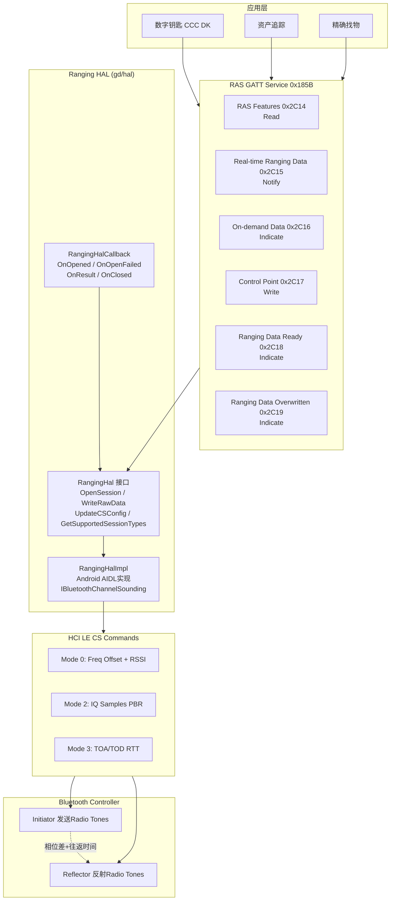
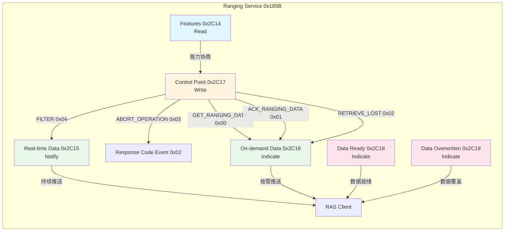
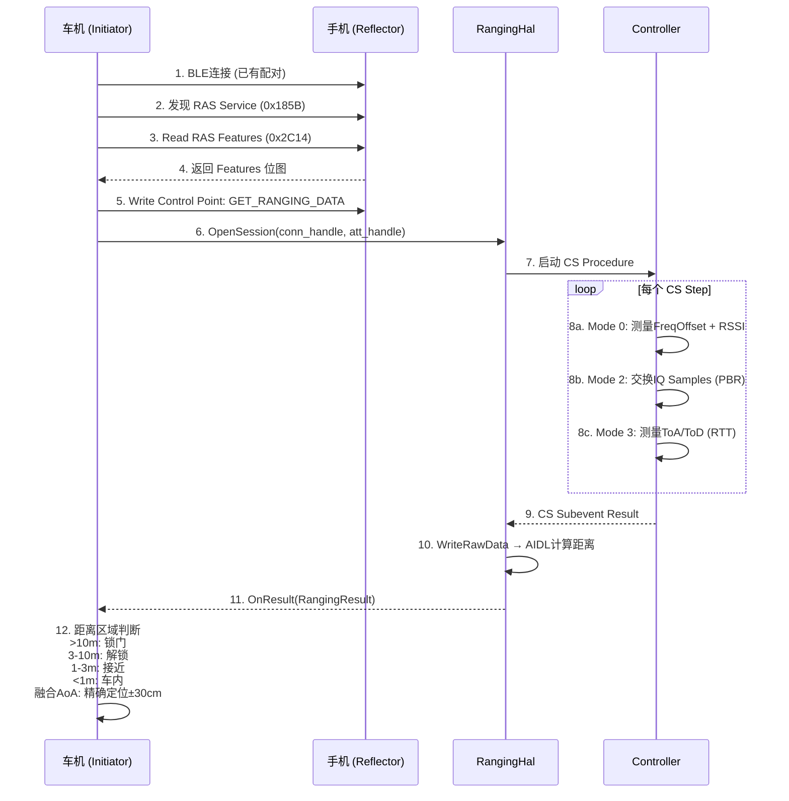

# T36 Ranging/UWB与Hearing Aid详解 (V2)

> 学习日期：2026-05-17
> V1→V2升级：架构全景图×3 + 逐行注释代码×6 + C++知识卡片×2 + Java↔C++对照 + 问题排查SOP + 动手练习
> 前置知识：T01（蓝牙整体架构）、T17（BLE GATT完整流程）、T22（BLE GATT IoT设备）
> 优先级：P8 | 车载场景：数字钥匙BLE+CS方案、助听器音频流、车载TBS/MCP控制

---

## 📋 本章导读

| 维度 | 内容概要 |
|------|---------|
| **核心主题** | Channel Sounding (UWB) 高精度测距 + ASHA助听器 + TBS/MCP/辅助Profile |
| **为什么重要** | CS是蓝牙6.0最大亮点，亚米级精度直接赋能数字钥匙；LE Audio辅助服务构成完整生态 |
| **关键收获** | ① CS通过PBR+RTT实现10-30cm精度 ② RAS将CS数据封装为GATT服务 ③ ASHA双耳配对机制 ④ TBS/MCP替代经典蓝牙通话/媒体控制 |
| **阅读策略** | 先理解CS架构全景→再深入Ranging HAL代码→最后对比LE Audio辅助服务族 |
| **车载关联** | 数字钥匙BLE+CS方案(距离区域判断)、助听器音频流、车载TBS/MCP控制 |

---

## 🗺️ 架构全景图

### 1. Channel Sounding 端到端架构



### 2. RAS GATT 服务特征关系图



### 3. 数字钥匙认证流程



---

## 🔍 代码导航表

| 模块 | 关键文件 | 核心类/结构体 | 行号参考 | 职责 |
|------|---------|-------------|---------|------|
| **Ranging HAL接口** | [ranging_hal.h](file:///d:/AndroidWorkspace/claudeProject/BT16Study/Bluetooth/system/gd/hal/ranging_hal.h) | `RangingResult` | L294-L305 | 测距结果：距离/误差/置信度/速度 |
| | | `RangingHalCallback` | L307-L316 | HAL回调：OnOpened/OnResult/OnClosed |
| | | `RangingHal` | L318-L346 | HAL接口：OpenSession/WriteRawData/UpdateConfig |
| | | `ChannelSoundingRawData` | L58-L70 | CS原始数据：IQ/ToA/ToD/质量 |
| | | `Mode0Data/Mode1Data/Mode2Data/Mode3Data` | L82-L237 | 4种Mode数据结构 |
| **Ranging HAL实现** | [ranging_hal_impl_android.cc](file:///d:/AndroidWorkspace/claudeProject/BT16Study/Bluetooth/system/gd/hal/ranging_hal_impl_android.cc) | `RangingHalImpl` | L272-L592 | AIDL实现：Session管理+数据转换 |
| | | `BluetoothChannelSoundingSessionTracker` | L76-L146 | Session回调Tracker |
| **RAS类型** | [ras_types.h](file:///d:/AndroidWorkspace/claudeProject/BT16Study/Bluetooth/system/bta/ras/ras_types.h) | `Opcode` | L64-L70 | 5种控制点操作码 |
| | | `EventCode` | L76-L80 | 3种事件码 |
| | | `ResponseCodeValue` | L82-L92 | 9种响应码 |
| **RAS API** | [bta_ras_api.h](file:///d:/AndroidWorkspace/claudeProject/BT16Study/Bluetooth/system/bta/include/bta_ras_api.h) | `RasServer/RasClient` | L51-L93 | Server/Client抽象接口 |
| **RAS Server** | [ras_server.cc](file:///d:/AndroidWorkspace/claudeProject/BT16Study/Bluetooth/system/bta/ras/ras_server.cc) | `RasServerImpl` | L58- | GATT Server实现(806行) |
| **RAS Client** | [ras_client.cc](file:///d:/AndroidWorkspace/claudeProject/BT16Study/Bluetooth/system/bta/ras/ras_client.cc) | `RasClientImpl` | - | GATT Client实现(997行) |
| **ASHA HAL** | [bt_hearing_aid.h](file:///d:/AndroidWorkspace/claudeProject/BT16Study/Bluetooth/system/include/hardware/bt_hearing_aid.h) | `HearingAidInterface` | - | 助听器HAL接口 |
| **TBS GATT** | [TbsGatt.java](file:///d:/AndroidWorkspace/claudeProject/BT16Study/Bluetooth/android/app/src/com/android/bluetooth/tbs/TbsGatt.java) | `TbsGatt` | L63-L81 | TBS UUID体系 |
| **MCP Request** | [Request.java](file:///d:/AndroidWorkspace/claudeProject/BT16Study/Bluetooth/android/app/src/com/android/bluetooth/mcp/Request.java) | `Operation` | L51-L75 | 17种媒体操作码 |
| **Feature Flags** | [ranging.aconfig](file:///d:/AndroidWorkspace/claudeProject/BT16Study/Bluetooth/flags/ranging.aconfig) | - | - | CS主开关+HW卸载 |

---

## 📖 核心流程详解

### 流程1：RangingResult — 测距结果数据结构

[ranging_hal.h:L294-L305](file:///d:/AndroidWorkspace/claudeProject/BT16Study/Bluetooth/system/gd/hal/ranging_hal.h#L294-L305)

```cpp
struct RangingResult {
  double result_meters_;              // [1] 估计距离(米)，PBR+RTT融合结果
  double error_meters_;               // [2] 误差范围(米)，如±0.3m

  // [3] 置信度: 0(低)-100(高)的归一化值，-1表示不可用
  //     数字钥匙场景: confidence>80才允许解锁
  int8_t confidence_level_;

  double delay_spread_meters_;        // [4] 延迟扩展(米)，多径效应指标
                                      //     值越大→多径越严重→精度下降
  uint8_t detected_attack_level_;     // [5] 检测到的攻击等级
                                      //     中继攻击检测: 0=安全, >0=可疑

  double velocity_meters_per_second_; // [6] 相对速度(m/s)
                                      //     用于预测下一时刻距离(卡尔曼滤波)

  int64_t elapsed_timestamp_nanos_;   // [7] 时间戳(纳秒)，V2新增
                                      //     用于多帧融合的时间对齐
};
```

### 流程2：RangingHalCallback — HAL回调接口

[ranging_hal.h:L307-L316](file:///d:/AndroidWorkspace/claudeProject/BT16Study/Bluetooth/system/gd/hal/ranging_hal.h#L307-L316)

```cpp
class RangingHalCallback {
public:
  virtual ~RangingHalCallback() = default;  // 💡C++: 虚析构函数确保通过基类指针delete时调用派生类析构, Java用AutoCloseable

  // [2] Session打开成功: AIDL openSession成功后触发
  //     vendor_specific_reply: 厂商特定数据(如安全证书)
  virtual void OnOpened(uint16_t connection_handle,
                        const std::vector<VendorSpecificCharacteristic>& vendor_specific_reply) = 0;

  // [3] Session打开失败: AIDL openSession失败
  virtual void OnOpenFailed(uint16_t connection_handle) = 0;

  // [4] 厂商特定回复完成: HandleVendorSpecificReply的异步结果
  virtual void OnHandleVendorSpecificReplyComplete(uint16_t connection_handle, bool success) = 0;

  // [5] ⭐测距结果回调: 每次CS Procedure完成触发
  //     数字钥匙场景: 每秒可触发数十次
  virtual void OnResult(uint16_t connection_handle, const RangingResult& ranging_result) = 0;

  // [6] Session关闭: 主动关闭或异常断开
  virtual void OnClosed(uint16_t connection_handle, Reason reason) = 0;
};
```

### 流程3：RangingHal 核心接口

[ranging_hal.h:L318-L346](file:///d:/AndroidWorkspace/claudeProject/BT16Study/Bluetooth/system/gd/hal/ranging_hal.h#L318-L346)

```cpp
class RangingHal {
public:
  virtual ~RangingHal() = default;
  virtual bool IsBound() = 0;                                    // [1] AIDL服务是否已绑定
  virtual RangingHalVersion GetRangingHalVersion() = 0;          // [2] HAL版本: V_UNKNOWN/V_1/V_2
  virtual void RegisterCallback(RangingHalCallback* callback) = 0; // [3] 注册回调
  virtual std::vector<VendorSpecificCharacteristic> GetVendorSpecificCharacteristics() = 0; // [4] 获取厂商特征

  // [5] ⭐打开Session: 建立CS测距会话
  //     connection_handle: ACL连接句柄
  //     att_handle: RAS GATT ATT句柄(用于实时数据推送)
  //     sight_type/location_type: 数字钥匙场景的视线/位置类型
  virtual void OpenSession(
          uint16_t connection_handle, uint16_t att_handle,
          const std::vector<hal::VendorSpecificCharacteristic>& vendor_specific_data,
          uint8_t sight_type, uint8_t location_type) = 0;

  // [6] 处理厂商特定回复(Reflector侧)
  virtual void HandleVendorSpecificReply(
          uint16_t connection_handle,
          const std::vector<hal::VendorSpecificCharacteristic>& vendor_specific_reply) = 0;

  // [7] ⭐写入原始数据: HCI CS Subevent → HAL → AIDL计算距离
  virtual void WriteRawData(uint16_t connection_handle, const ChannelSoundingRawData& raw_data) = 0;

  // [8] 更新CS配置: ModeType/SubMode/RTT/ChannelMap等
  virtual void UpdateChannelSoundingConfig(
          uint16_t connection_handle, const hci::LeCsConfigCompleteView& leCsConfigCompleteView,
          uint8_t local_supported_sw_time, uint8_t remote_supported_sw_time,
          uint16_t conn_interval) = 0;

  // [9] 更新连接间隔
  virtual void UpdateConnInterval(uint16_t connection_handle, uint16_t conn_interval) = 0;

  // [10] 更新Procedure使能配置
  virtual void UpdateProcedureEnableConfig(
          uint16_t connection_handle,
          const hci::LeCsProcedureEnableCompleteView& leCsProcedureEnableCompleteView) = 0;

  // [11] V2: 写入Procedure级数据(含SubeventResult)
  virtual void WriteProcedureData(uint16_t connection_handle, hci::CsRole local_cs_role,
                                  const ProcedureDataV2& procedure_data,
                                  uint16_t procedure_counter) = 0;

  // [12] V2: 检查Procedure是否需要中止
  virtual bool IsAbortedProcedureRequired(uint16_t connection_handle) = 0;

  // [13] 获取支持的Session类型: SW解析 / HW卸载
  virtual std::vector<RangingSessionType> GetSupportedSessionTypes() = 0;
};
```

### 流程4：OpenSession — AIDL会话建立

[ranging_hal_impl_android.cc:L308-L343](file:///d:/AndroidWorkspace/claudeProject/BT16Study/Bluetooth/system/gd/hal/ranging_hal_impl_android.cc#L308-L343)

```cpp
void RangingHalImpl::OpenSession(
        uint16_t connection_handle, uint16_t att_handle,
        const std::vector<hal::VendorSpecificCharacteristic>& vendor_specific_data,
        uint8_t sight_type, uint8_t location_type) {
  // [1] 创建SessionTracker: 封装AIDL回调，关联connection_handle
  session_trackers_[connection_handle] =
          ndk::SharedRefBase::make<BluetoothChannelSoundingSessionTracker>(  // 💡C++: 模板工厂方法创建共享引用对象, 类似Java泛型+工厂模式
                  connection_handle, ranging_hal_callback_, false, hal_ver_);

  // [2] 构造AIDL参数: ACL句柄 + 角色(Initiator) + ATT句柄 + 视线/位置类型
  BluetoothChannelSoundingParameters parameters;
  parameters.aclHandle = connection_handle;
  parameters.role = aidl::android::hardware::bluetooth::ranging::Role::INITIATOR;
  parameters.realTimeProcedureDataAttHandle = att_handle;
  parameters.sightType = static_cast<SightType>(sight_type);  // 💡C++: static_cast安全类型转换, 比C风格转换更安全
  parameters.locationType = static_cast<LocationType>(location_type);
  CopyVendorSpecificData(vendor_specific_data, parameters.vendorSpecificData);

  // [3] 调用AIDL openSession: 异步建立CS会话
  auto& tracker = session_trackers_[connection_handle];
  bluetooth_channel_sounding_->openSession(parameters, tracker, &tracker->GetSession());

  // [4] 同步获取厂商特定回复(如果Session立即就绪)
  if (tracker->GetSession() != nullptr) {
    std::vector<VendorSpecificCharacteristic> vendor_specific_reply = {};
    std::optional<std::vector<std::optional<VendorSpecificData>>> vendorSpecificDataOptional;  // 💡C++: 嵌套std::optional表示多层可能为空, Java用@Nullable List<@Nullable VendorSpecificData>
    tracker->GetSession()->getVendorSpecificReplies(&vendorSpecificDataOptional);

    if (vendorSpecificDataOptional.has_value()) {
      for (auto& data : vendorSpecificDataOptional.value()) {
        VendorSpecificCharacteristic vendor_specific_characteristic;
        vendor_specific_characteristic.characteristicUuid_ = data->characteristicUuid;
        vendor_specific_characteristic.value_ = data->opaqueValue;
        vendor_specific_reply.emplace_back(vendor_specific_characteristic);
      }
    }
    // [5] 通知上层: Session已打开，携带厂商回复数据
    ranging_hal_callback_->OnOpened(connection_handle, vendor_specific_reply);
  }
}
```

### 流程5：WriteRawData — CS原始数据写入与转换

[ranging_hal_impl_android.cc:L360-L412](file:///d:/AndroidWorkspace/claudeProject/BT16Study/Bluetooth/system/gd/hal/ranging_hal_impl_android.cc#L360-L412)

```cpp
void RangingHalImpl::WriteRawData(uint16_t connection_handle,
                                  const ChannelSoundingRawData& raw_data) {
  // [1] 安全检查: Session必须存在且已打开
  if (session_trackers_.find(connection_handle) == session_trackers_.end()) {  // 💡C++: std::map::find+end()惯用法判断key是否存在, Java用containsKey()
    log::error("Can't find session for connection_handle:0x{:04x}", connection_handle);
    return;
  } else if (session_trackers_[connection_handle]->GetSession() == nullptr) {
    log::error("Session not opened");
    return;
  }

  // [2] 构造AIDL原始数据结构
  ChannelSoudingRawData hal_raw_data;
  hal_raw_data.numAntennaPaths = raw_data.num_antenna_paths_;   // 天线数量
  hal_raw_data.stepChannels = raw_data.step_channel_;           // 步骤→信道映射

  // [3] 转换Initiator侧IQ数据 (Mode 2/3 PBR)
  hal_raw_data.initiatorData.stepTonePcts.emplace(std::vector<std::optional<StepTonePct>>{});
  for (uint8_t i = 0; i < raw_data.tone_pct_initiator_.size(); i++) {
    StepTonePct step_tone_pct;
    for (uint8_t j = 0; j < raw_data.tone_pct_initiator_[i].size(); j++) {
      ComplexNumber complex_number;
      complex_number.imaginary = raw_data.tone_pct_initiator_[i][j].imag(); // I分量
      complex_number.real = raw_data.tone_pct_initiator_[i][j].real();      // Q分量
      step_tone_pct.tonePcts.emplace_back(complex_number);
    }
    step_tone_pct.toneQualityIndicator = raw_data.tone_quality_indicator_initiator_[i];
    hal_raw_data.initiatorData.stepTonePcts.value().emplace_back(step_tone_pct);
  }

  // [4] 转换Reflector侧IQ数据 (Mode 2/3 PBR)
  for (uint8_t i = 0; i < raw_data.tone_pct_reflector_.size(); i++) {
    StepTonePct step_tone_pct;
    for (uint8_t j = 0; j < raw_data.tone_pct_reflector_[i].size(); j++) {
      ComplexNumber complex_number;
      complex_number.imaginary = raw_data.tone_pct_reflector_[i][j].imag();
      complex_number.real = raw_data.tone_pct_reflector_[i][j].real();
      step_tone_pct.tonePcts.emplace_back(complex_number);
    }
    step_tone_pct.toneQualityIndicator = raw_data.tone_quality_indicator_reflector_[i];
    hal_raw_data.reflectorData.stepTonePcts.value().emplace_back(step_tone_pct);
  }

  // [5] 转换RTT数据 (Mode 1/3): ToA/ToD时间戳 → 往返距离
  if (!raw_data.toa_tod_initiators_.empty()) {
    hal_raw_data.toaTodInitiator = std::vector<int32_t>(
            raw_data.toa_tod_initiators_.begin(), raw_data.toa_tod_initiators_.end());
    hal_raw_data.initiatorData.packetQuality = std::vector<uint8_t>(
            raw_data.packet_quality_initiator.begin(), raw_data.packet_quality_initiator.end());
  }
  if (!raw_data.tod_toa_reflectors_.empty()) {
    hal_raw_data.todToaReflector = std::vector<int32_t>(
            raw_data.tod_toa_reflectors_.begin(), raw_data.tod_toa_reflectors_.end());
    hal_raw_data.reflectorData.packetQuality = std::vector<uint8_t>(
            raw_data.packet_quality_reflector.begin(), raw_data.packet_quality_reflector.end());
  }

  // [6] 写入AIDL Session: 触发距离计算
  session_trackers_[connection_handle]->GetSession()->writeRawData(hal_raw_data);
}
```

### 流程6：onResult — AIDL测距结果回调转换

[ranging_hal_impl_android.cc:L106-L121](file:///d:/AndroidWorkspace/claudeProject/BT16Study/Bluetooth/system/gd/hal/ranging_hal_impl_android.cc#L106-L121)

```cpp
::ndk::ScopedAStatus onResult(
        const ::aidl::android::hardware::bluetooth::ranging::RangingResult& in_result) {
  log::verbose("resultMeters {}", in_result.resultMeters);

  // [1] AIDL RangingResult → HAL RangingResult 字段映射
  hal::RangingResult ranging_result = {  // 💡C++: 聚合初始化(aggregate initialization), Java需逐字段赋值或用Builder
          .result_meters_ = in_result.resultMeters,           // 估计距离(米)
          .error_meters_ = in_result.errorMeters,             // 误差范围(米)
          .confidence_level_ = in_result.confidenceLevel,     // 置信度(0-100)
          .delay_spread_meters_ = in_result.delaySpreadMeters, // 延迟扩展
          .detected_attack_level_ = static_cast<uint8_t>(in_result.detectedAttackLevel), // 攻击等级
          .velocity_meters_per_second_ = in_result.velocityMetersPerSecond, // 相对速度
  };

  // [2] V2版本新增: 时间戳字段(用于多帧融合)
  if (hal_ver_ == V_2) {
    ranging_result.elapsed_timestamp_nanos_ = in_result.timestampNanos;
  }

  // [3] 回调上层: 触发RAS Server推送数据给Client
  ranging_hal_callback_->OnResult(connection_handle_, ranging_result);
  return ::ndk::ScopedAStatus::ok();
}
```

---

## 💡 C++知识卡片

### 卡片1：`std::complex<double>` 与 IQ采样

```cpp
// 📌 场景: Channel Sounding Mode 2 的 IQ 采样数据
// I = In-phase(同相分量), Q = Quadrature(正交分量)
// 复数表示: z = I + jQ → 幅度=|z|, 相位=arg(z)

std::complex<double> iq_sample(3.0, 4.0);  // I=3.0, Q=4.0

double magnitude = std::abs(iq_sample);      // |z| = 5.0 (信号强度)
double phase     = std::arg(iq_sample);      // arg(z) ≈ 0.927 rad (相位角)

// ⭐ PBR测距核心: 两个频率的相位差 → 距离
std::complex<double> iq_freq1(3.0, 4.0);    // 频率f1的IQ采样
std::complex<double> iq_freq2(2.0, 5.0);    // 频率f2的IQ采样
double phase_diff = std::arg(iq_freq2) - std::arg(iq_freq1);
// distance = phase_diff * c / (2π * Δf)  其中c=光速, Δf=频率差

// 📌 源码中的使用 (ranging_hal_impl_android.cc:L380-L381):
// complex_number.imaginary = raw_data.tone_pct_initiator_[i][j].imag(); // Q分量
// complex_number.real = raw_data.tone_pct_initiator_[i][j].real();      // I分量
```

**关键理解**：`std::complex<double>` 的 `.real()` 返回I分量，`.imag()` 返回Q分量。PBR通过多个频率的相位差计算距离，精度取决于频率间隔Δf——Δf越大，距离模糊范围越小但精度越高。

### 卡片2：`std::variant` 与 CS Mode数据多态

```cpp
// 📌 场景: Channel Sounding 的4种Mode数据用variant统一管理
// 源码: ranging_hal_impl_android.cc:L192-L224

// [定义] variant = 类型安全的union，同一时刻只持有一种类型
using ModeSpecificData = std::variant<Mode0Data, Mode1Data, Mode2Data, Mode3Data>;

// [访问] std::holds_alternative + std::get 组合判断+提取
void get_step_mode_data(ModeSpecificData mode_specific_data, ModeData& mode_data) {
  if (std::holds_alternative<Mode0Data>(mode_specific_data)) {   // 类型检查
    auto mode_0_data = std::get<Mode0Data>(mode_specific_data);  // 类型安全提取
    // 处理Mode0: PacketQuality + RSSI + Antenna
  } else if (std::holds_alternative<Mode1Data>(mode_specific_data)) {
    auto mode_1_data = std::get<Mode1Data>(mode_specific_data);
    // 处理Mode1: RTT + NADM + PacketPCT
  } else if (std::holds_alternative<Mode2Data>(mode_specific_data)) {
    auto mode_2_data = std::get<Mode2Data>(mode_specific_data);
    // 处理Mode2: IQ Samples (PBR核心)
  } else if (std::holds_alternative<Mode3Data>(mode_specific_data)) {
    auto mode_3_data = std::get<Mode3Data>(mode_specific_data);
    // 处理Mode3: Mode1 + Mode2组合 (RTT + PBR)
  }
}

// 🆚 对比Java: 等价于 sealed class / sealed interface (Kotlin)
// sealed class ModeData { data class Mode0(...) ; data class Mode1(...) ; ... }
```

**关键理解**：`std::variant` 是C++17的类型安全union，比C风格union多了类型检查。`std::holds_alternative<T>()` 检查当前持有类型，`std::get<T>()` 提取值。如果类型不匹配，`std::get` 抛出 `std::bad_variant_access`。

---

## 🗂️ Java↔C++对照表

| 功能 | Java层 | C++层 | 桥接方式 |
|------|--------|-------|---------|
| **测距会话管理** | `BluetoothChannelSounding.java` (AIDL客户端) | `RangingHalImpl` → `IBluetoothChannelSounding` AIDL | AIDL跨进程 |
| **测距结果** | `RangingResult.aidl` → Java对象 | `hal::RangingResult` 结构体 | AIDL序列化 |
| **CS原始数据** | `ChannelSoudingRawData.aidl` | `ChannelSoundingRawData` 结构体 | AIDL序列化 |
| **RAS Server** | 无Java层(纯C++ GATT Server) | `RasServerImpl` (ras_server.cc) | BTA GATT API |
| **RAS Client** | 无Java层(纯C++ GATT Client) | `RasClientImpl` (ras_client.cc) | BTA GATT API |
| **助听器连接** | `HearingAidService.java` → `HearingAidNativeInterface.java` | `btif_hearing_aid` → `HearingAidInterface` | JNI |
| **助听器音量** | `BluetoothHearingAid.setVolume()` | `HearingAidInterface::SetVolume()` | JNI |
| **TBS通话控制** | `TbsService.java` → `TbsGatt.java` | 无C++层(纯Java GATT Server) | GATT直接 |
| **MCP媒体控制** | `McpService.java` → `MediaControlGattService.java` | 无C++层(纯Java GATT Server) | GATT直接 |
| **VCS音量** | `VolumeControlService.java` | `bta/vc/vc.cc` | JNI |
| **CSIS协调集** | `CsipSetCoordinatorService.java` | `bta/csis/csis_client.cc` | JNI |
| **HAS助听器预设** | `HearingAidProfile.java` | `bta/has/has_client.cc` | JNI |
| **Feature Flags** | `DeviceConfig.java` (读取) | `ranging.aconfig` / `hearing_aid.aconfig` | 编译时宏 |

---

## 一、Channel Sounding / UWB Ranging（信道测距）

### 1.1 技术背景

Channel Sounding 是蓝牙 6.0 (BT Core Spec v6.0) 引入的**高精度测距**技术，使用 BLE PHY 实现 Phase-based Ranging (PBR) 和 Round-Trip Timing (RTT)：

| 测距方法 | 原理 | 精度 | 对应Mode |
|---------|------|------|---------|
| **PBR** | 多频率Radio Tone Exchange → 相位差 → 距离 | 10-30cm | Mode 2 |
| **RTT** | 无线信号Initiator↔Reflector往返时间 → 距离 | 10-50cm | Mode 3 |
| **RSSI** | 信号强度衰减估算 | 5-10m | Mode 0(辅助) |

**CS工作模式详解**：

| Mode | 数据内容 | 测距方法 | 说明 |
|------|---------|---------|------|
| **Mode 0** | Packet Quality + RSSI + Antenna + FreqOffset | 辅助测距 | 基础信号质量+频率补偿 |
| **Mode 1** | RTT ToA/ToD + NADM + PacketPCT | RTT测距 | 含中继攻击检测(NADM) |
| **Mode 2** | **IQ Samples** (复数) + Quality + AntennaPermutation | **PBR测距** | 核心：I/Q复数值→相位差→距离 |
| **Mode 3** | Mode1数据 + Mode2数据 | **PBR+RTT融合** | 最高精度：两种方法交叉验证 |

**两种数据处理模式**：

```cpp
enum class RangingSessionType : uint8_t {
  SOFTWARE_STACK_DATA_PARSING = 0,  // 软件解析: RAW数据由协议栈→AIDL HAL计算距离
  HARDWARE_OFFLOAD_DATA_PARSING      // 硬件卸载: Controller直接计算距离，更省功耗
};
```

### 1.2 Ranging HAL 版本演进

```cpp
enum RangingHalVersion {
  V_UNKNOWN = 0,  // HAL服务未绑定或版本未知
  V_1 = 1,        // 基础Channel Sounding: WriteRawData路径
  V_2 = 2,        // 增强功能: WriteProcedureData路径 + timestampNanos
};
```

**V1 vs V2 关键差异**：

| 特性 | V1 | V2 |
|------|----|----|
| 数据写入路径 | `WriteRawData` | `WriteProcedureData` |
| 时间戳 | 无 | `elapsed_timestamp_nanos_` |
| 数据粒度 | 整体RawData | 按Procedure+Subevent组织 |
| 中止检测 | 无 | `IsAbortedProcedureRequired` |

### 1.3 Channel Sounding 原始数据结构

[ranging_hal.h:L58-L70](file:///d:/AndroidWorkspace/claudeProject/BT16Study/Bluetooth/system/gd/hal/ranging_hal.h#L58-L70)

```cpp
struct ChannelSoundingRawData {
  uint8_t num_antenna_paths_;                              // [1] 天线数量(多天线→多径分辨)
  std::vector<uint8_t> step_channel_;                      // [2] 步骤→信道映射(CS使用多信道跳频)
  std::vector<std::vector<std::complex<double>>> tone_pct_initiator_;   // [3] I侧 IQ(PBR)
  std::vector<std::vector<std::complex<double>>> tone_pct_reflector_;   // [4] R侧 IQ(PBR)
  std::vector<std::vector<uint8_t>> tone_quality_indicator_initiator_;  // [5] I侧质量
  std::vector<std::vector<uint8_t>> tone_quality_indicator_reflector_;  // [6] R侧质量
  std::vector<int8_t> packet_quality_initiator;             // [7] I侧包质量
  std::vector<int8_t> packet_quality_reflector;             // [8] R侧包质量
  std::vector<int16_t> toa_tod_initiators_;                // [9] I侧ToA/ToD(RTT)
  std::vector<int16_t> tod_toa_reflectors_;                // [10] R侧ToD/ToA(RTT)
};
```

### 1.4 Mode0 数据 — 基础测距

[ranging_hal.h:L82-L97](file:///d:/AndroidWorkspace/claudeProject/BT16Study/Bluetooth/system/gd/hal/ranging_hal.h#L82-L97)

```cpp
struct Mode0Data {
  uint8_t packet_quality_ = 0;              // 0-127 包质量
  uint8_t packet_rssi_ = 0x7F;              // RSSI (-127~+20 dBm), 0x7F=不可用
  uint8_t packet_antenna_ = 0;              // 天线路径 (0-based)
  uint16_t initiator_measured_offset = 0xC000; // Init侧频率偏移 (15 bits), 0xC000=不可用
};
```

---

## 二、RAS (Ranging Service) — GATT服务

### 2.1 GATT UUID体系

[ras_types.h:L26-L52](file:///d:/AndroidWorkspace/claudeProject/BT16Study/Bluetooth/system/bta/ras/ras_types.h#L26-L52)

| UUID | 名称 | 类型 | 说明 |
|------|------|------|------|
| `0x185B` | Ranging Service | Service | RAS服务主入口 |
| `0x2C14` | RAS Features | Read | 支持的功能位图 |
| `0x2C15` | **Real-time Ranging Data** | Notify | 实时测距数据推送 |
| `0x2C16` | On-demand Data | Indicate | 按需测距数据 |
| `0x2C17` | **Control Point** | Write | 控制点(命令) |
| `0x2C18` | Ranging Data Ready | Indicate | 数据就绪通知 |
| `0x2C19` | Ranging Data Overwritten | Indicate | 数据被覆盖通知 |

### 2.2 RAS Feature 与 Control Point

**4种 Ranging Feature** [ras_types.h:L57-L62](file:///d:/AndroidWorkspace/claudeProject/BT16Study/Bluetooth/system/bta/ras/ras_types.h#L57-L62)：

```cpp
namespace feature {
  static const uint32_t kRealTimeRangingData      = 0x01;  // 实时数据推送
  static const uint32_t kRetrieveLostRangingDataSegments = 0x02;  // 恢复丢失数据段
  static const uint32_t kAbortOperation           = 0x04;  // 中止操作
  static const uint32_t kFilterRangingData        = 0x08;  // 过滤数据
}
```

**5种 Control Point Opcode** [ras_types.h:L64-L70](file:///d:/AndroidWorkspace/claudeProject/BT16Study/Bluetooth/system/bta/ras/ras_types.h#L64-L70)：

| Opcode | 操作 | 方向 | 说明 |
|--------|------|------|------|
| `0x00` | GET_RANGING_DATA | Client→Server | 请求获取测距数据 |
| `0x01` | ACK_RANGING_DATA | Client→Server | 确认收到测距数据 |
| `0x02` | RETRIEVE_LOST_RANGING_DATA_SEGMENTS | Client→Server | 恢复丢失的数据段 |
| `0x03` | ABORT_OPERATION | Client→Server | 中止当前测距操作 |
| `0x04` | FILTER | Client→Server | 设置测距数据过滤器 |

**3种 Event Code** [ras_types.h:L76-L80](file:///d:/AndroidWorkspace/claudeProject/BT16Study/Bluetooth/system/bta/ras/ras_types.h#L76-L80)：

| Event Code | 事件 | 触发时机 |
|-----------|------|---------|
| `0x00` | COMPLETE_RANGING_DATA_RESPONSE | 全体测距数据已就绪 |
| `0x01` | COMPLETE_LOST_RANGING_DATA_SEGMENT_RESPONSE | 丢失段恢复完成 |
| `0x02` | RESPONSE_CODE | 命令执行结果 |

**9种 Response Code** [ras_types.h:L82-L92](file:///d:/AndroidWorkspace/claudeProject/BT16Study/Bluetooth/system/bta/ras/ras_types.h#L82-L92)：

```cpp
enum class ResponseCodeValue : uint8_t {
  RESERVED_FOR_FUTURE_USE = 0x00,
  SUCCESS = 0x01,                    // 成功
  OP_CODE_NOT_SUPPORTED = 0x02,      // 不支持的操作码
  INVALID_PARAMETER = 0x03,          // 无效参数
  PERSISTED = 0x04,                  // 数据已持久化(待ACK)
  ABORT_UNSUCCESSFUL = 0x05,         // 中止失败
  PROCEDURE_NOT_COMPLETED = 0x06,    // Procedure未完成
  SERVER_BUSY = 0x07,               // 服务器忙
  NO_RECORDS_FOUND = 0x08,          // 无记录
};
```

### 2.3 RAS Client/Server API

[bta_ras_api.h](file:///d:/AndroidWorkspace/claudeProject/BT16Study/Bluetooth/system/bta/include/bta_ras_api.h) 定义了RAS的完整抽象接口：

**RasServer** (L51-L63)：

```cpp
class RasServer {
public:
  virtual ~RasServer() = default;
  virtual void Initialize() = 0;
  virtual void RegisterCallbacks(RasServerCallbacks* callbacks) = 0;
  virtual void SetVendorSpecificCharacteristic(
          const std::vector<VendorSpecificCharacteristic>& vendor_specific_characteristics) = 0;
  virtual void HandleVendorSpecificReplyComplete(RawAddress address, bool success) = 0;
  virtual void PushProcedureData(RawAddress address, uint16_t procedure_count, bool is_last,
                                 std::vector<uint8_t> data) = 0;  // ⭐推送CS Procedure数据
};
```

**RasClient** (L81-L93)：

```cpp
class RasClient {
public:
  virtual ~RasClient() = default;
  virtual void Initialize() = 0;
  virtual void RegisterCallbacks(RasClientCallbacks* callbacks) = 0;
  virtual void Connect(const RawAddress& address) = 0;
  virtual void SendVendorSpecificReply(
          const RawAddress& address,
          const std::vector<VendorSpecificCharacteristic>& vendor_specific_data) = 0;
  virtual void NotifyRangingHardwareOffloadEnabled() = 0;  // 通知HW卸载模式启用
};
```

### 2.4 RAS Client 工作流程

```
Client侧流程:
1. GATT连接 → 发现 Ranging Service (0x185B)
2. Read RAS Features (0x2C14) → 了解Server能力
3. CCC订阅:
   ├── 实时模式: Subscribe Real-time Ranging Data (0x2C15) Notify
   │   └── Server持续推送数据 → Client接收+缓存
   │
   └── 按需模式:
       ├── Write Control Point: GET_RANGING_DATA (0x00)
       ├── Server通过 On-Demand Data (0x2C16) Indicate返回数据
       ├── 如果需要更多数据: ACK_RANGING_DATA → Server继续
       └── 超时处理 (默认超时30s)
```

### 2.5 数字钥匙应用 (CCC DK)

UWB Channel Sounding 的**最关键应用**是数字钥匙 (CCC Digital Key)：

```
距离区域判断:
  ┌─────────────────────────────────────────────────┐
  │  >10m  │  远距离: 车机锁门，无交互               │
  │  3-10m │  中距离: 车机解锁车门 (Unlock)          │
  │  1-3m  │  近距离: 接近车辆，准备进入             │
  │  <1m   │  车内: 允许启动引擎 (Start Engine)      │
  └─────────────────────────────────────────────────┘

  融合定位: CS距离 + AoA角度 = 精确定位 (±30cm)
  安全机制: NADM(中继攻击检测) + detected_attack_level
```

**Feature Flags** [ranging.aconfig](file:///d:/AndroidWorkspace/claudeProject/BT16Study/Bluetooth/flags/ranging.aconfig)：

| Flag | 功能 | 默认值 |
|------|------|--------|
| `channel_sounding` | CS主开关 (exported) | false |
| `channel_sounding_offload` | HW加速卸载(Controller直接计算距离) | false |

---

## 三、Hearing Aid (ASHA) — 助听器

### 3.1 ASHA 协议概述

ASHA (Audio Streaming for Hearing Aids) 是 Android 原生支持的助听器音频流协议，通过 BLE GATT 传输音频数据。

**核心概念**：

| 概念 | 说明 |
|------|------|
| **HiSyncId** | 8字节配对标识，同一套助听器(左+右)共享同一HiSyncId |
| **Capability** | 设备能力位图 (Side + Mode + CSIP support) |
| **双耳模式 (Binaural)** | 左右耳独立BLE连接，通过HiSyncId关联为一组 |
| **GATT Service** | `0xFDF0` — ASHA音频流服务 |

### 3.2 Capability 位定义

| 位 | 含义 | 值=0 | 值=1 |
|----|------|------|------|
| 0 | Side (左右耳) | LEFT | RIGHT |
| 1 | Mode (模式) | MONAURAL(单声道) | BINAURAL(双声道) |
| 2 | CSIP Support | No CSIP | Has CSIP |

**设备侧枚举**：

| DeviceSide | 说明 |
|-----------|------|
| `SIDE_LEFT = 0` | 左耳 |
| `SIDE_RIGHT = 1` | 右耳 |
| `SIDE_UNKNOWN = -1` | 未知（尚未连接） |

### 3.3 ASHA HAL 接口

[bt_hearing_aid.h](file:///d:/AndroidWorkspace/claudeProject/BT16Study/Bluetooth/system/include/hardware/bt_hearing_aid.h)：

```cpp
namespace bluetooth::asha {

enum class ConnectionState { DISCONNECTED = 0, CONNECTING, CONNECTED, DISCONNECTING };

class HearingAidCallbacks {
  virtual void OnConnectionState(ConnectionState state, const RawAddress& address) = 0;
  virtual void OnDeviceAvailable(uint8_t capabilities, uint64_t hiSyncId,
                                 const RawAddress& address) = 0;  // ⭐设备可用回调
};

class HearingAidInterface {
  virtual void Init(HearingAidCallbacks* callbacks) = 0;       // 初始化+注册回调
  virtual void Connect(const RawAddress& address) = 0;         // 连接
  virtual void Disconnect(const RawAddress& address) = 0;      // 断开
  virtual void AddToAcceptlist(const RawAddress& address) = 0; // 添加到白名单(快速重连)
  virtual void SetVolume(int8_t volume) = 0;                   // 设置音量(-128~127)
  virtual void Cleanup(void) = 0;                              // 清理
  virtual void RemoveDevice(const RawAddress& address) = 0;    // 解绑后移除
};

}  // namespace bluetooth::asha
```

### 3.4 连接流程与StateMachine

```
1. 手机扫描 BLE 广播
    ├── 解析 AdvertisementData → 识别 ASHA Service UUID + Capability
    ├── 提取 TruncatedHiSyncId (低32位)
    └── 调用 getHiSyncId() 获取完整 8字节 HiSyncId

2. 自动连接策略 (Auto-Connect)
    ├── 手机添加到 Acceptlist (白名单) → BLE自动连接
    └── 或主动 BLE Connect → GATT Service Discovery → 连接 ASHA 服务

3. HearingAidService 管理双耳配对
    ├── HiSyncId 匹配 → 同一套左右耳归组
    ├── 左右耳各自独立BLE连接
    └── 设置 ActiveDevice (当前活跃的助听器)

4. 音频流开始 → GATT Notification 实时推送
5. 音量控制 → setVolume(range: -128 ~ 127)
```

| 状态 | 说明 |
|------|------|
| **Disconnected** | 未连接 (初始/断开后) |
| **Connecting** | 正在连接 (BLE建立中，30秒超时) |
| **Connected** | 已连接 (GATT就绪，可接收音频流) |
| **Disconnecting** | 正在断开 |

### 3.5 Feature Flag

[hearing_aid.aconfig](file:///d:/AndroidWorkspace/claudeProject/BT16Study/Bluetooth/flags/hearing_aid.aconfig)：

| Flag | 功能 |
|------|------|
| `asha_omit_gatt_after_svc_changed` | 收到Service Changed事件后跳过对过期GATT handle的操作，避免崩溃 |

---

## 四、TBS (Telephone Bearer Service) — 电话承载服务

### 4.1 GATT UUID 体系

[TbsGatt.java:L63-L81](file:///d:/AndroidWorkspace/claudeProject/BT16Study/Bluetooth/android/app/src/com/android/bluetooth/tbs/TbsGatt.java#L63-L81)：

| UUID | 名称 | 类型 | 说明 |
|------|------|------|------|
| `0x184B` | TBS | Service | 单个电话Bearer |
| `0x184C` | **GTBS** | Service | 通用TBS (聚合所有Bearer) |
| `0x2BB3` | Bearer Provider Name | Read | 运营商名称 |
| `0x2BB9` | Call List | Notify | 当前通话列表 |
| `0x2BBD` | Call State | Notify | 通话状态 |
| `0x2BBE` | **Call Control Point** | Write | 呼叫控制点 |
| `0x2BC1` | Incoming Call | Notify | 来电信息 |

### 4.2 呼叫控制点操作码

| Opcode | 操作 | 说明 |
|--------|------|------|
| `0x00` | **ACCEPT** | 接听来电 |
| `0x01` | **TERMINATE** | 挂断当前通话 |
| `0x02` | LOCAL_HOLD | 本地保持 |
| `0x03` | LOCAL_RETRIEVE | 恢复保持的通话 |
| `0x04` | **ORIGINATE** | 发起去电 (通过URI) |
| `0x05` | JOIN | 合并通话 |

**与HFP的区别**：

| 维度 | HFP | TBS |
|------|-----|-----|
| 传输 | RFCOMM+SCO (经典蓝牙) | BLE GATT (LE Audio) |
| 音频 | SCO语音通道 | LE Audio ISO通道 |
| 控制 | AT命令 | GATT Write |
| 共存 | HFP提供音频流 | TBS提供通话控制 |

---

## 五、MCP (Media Control Profile) — 媒体控制服务

### 5.1 支持的媒体控制操作

[Request.java:L51-L75](file:///d:/AndroidWorkspace/claudeProject/BT16Study/Bluetooth/android/app/src/com/android/bluetooth/mcp/Request.java#L51-L75)：

| Opcode | 操作 | 说明 |
|--------|------|------|
| `0x01` | **PLAY** | 播放 |
| `0x02` | **PAUSE** | 暂停 |
| `0x04` | FAST_REWIND | 快退 |
| `0x08` | FAST_FORWARD | 快进 |
| `0x10` | **STOP** | 停止 |
| `0x20` | MOVE_RELATIVE | 相对跳转 |
| `0x40` | PREVIOUS_SEGMENT | 上一片段 |
| `0x80` | NEXT_SEGMENT | 下一片段 |
| `0x0100` | FIRST_SEGMENT | 第一个片段 |
| `0x0200` | LAST_SEGMENT | 最后一个片段 |
| `0x0800` | PREVIOUS_TRACK | 上一曲 |
| `0x1000` | NEXT_TRACK | 下一曲 |
| `0x2000` | FIRST_TRACK | 第一曲 |
| `0x4000` | LAST_TRACK | 最后一曲 |
| `0x8000` | GOTO_TRACK | 选中曲目 |
| `0x010000` | PREVIOUS_GROUP | 上一组 |
| `0x020000` | NEXT_GROUP | 下一组 |

**与AVRCP的关系**：AVRCP = 经典蓝牙媒体控制(AVCTP)；MCP = LE Audio媒体控制(GATT)，更省电、延迟更低。Android双模共存。

---

## 六、辅助 Profile 总结

### 6.1 LE Audio 辅助服务全景

| Profile | UUID | 用途 | 关键概念 | 车载场景 |
|---------|------|------|---------|---------|
| **CSIS** | `0x1846` | 协调集管理 | SIRK群组密钥、Rank、Lock | TWS耳机组管理、多扬声器同步 |
| **HAS** | `0x1854` | 助听器预设管理 | ActivePresetIndex、PresetControlPoint | 切换助听器预设(车内/室外/嘈杂) |
| **VCS** | `0x1844` | 标准化音量控制 | VolumeDown/Up/SetAbsolute/Mute | LE Audio原生音量，替代AVRCP AbsVol |
| **VOCS** | `0x1845` | 音量偏移控制 | 每通道独立偏移 | 左耳/右耳/中置独立调节 |
| **AICS** | `0x1843` | 音频输入控制 | Gain/AutoGain | 多音源切换 |
| **RAS** | `0x185B` | UWB测距 | 5种Opcode+3种EventCode | 数字钥匙 |
| **TMAS** | `0x1855` | 电话+媒体角色 | 角色声明 | 设备能力发现 |
| **GMAS** | `0x1858` | 游戏音频角色 | 低延迟游戏音频 | 车载游戏 |

---

## 🐛 问题排查SOP

### SOP1：CS测距无结果

```
症状: OnResult回调从未触发
排查步骤:
  1. 检查Feature Flag
     → ranging.aconfig: channel_sounding = true
  2. 检查Controller能力
     → Controller::SupportsBleChannelSounding() 返回true?
     → ras_server.cc:L97: 不支持则直接return
  3. 检查AIDL绑定
     → RangingHalImpl::IsBound() 返回true?
     → log: "Bind IBluetoothChannelSounding Success"
  4. 检查Session建立
     → OpenSession后tracker->GetSession() != nullptr?
     → log: "connection_handle 0xXXXX"
  5. 检查CS Procedure
     → HCI LE CS Procedure Enable是否成功?
     → UpdateProcedureEnableConfig是否被调用?
  6. 检查数据路径
     → SW模式: WriteRawData是否被调用?
     → HW模式: channel_sounding_offload = true?
```

### SOP2：RAS Client连接失败

```
症状: RasClientCallbacks::OnDisconnected被调用
排查步骤:
  1. GATT连接是否建立?
     → 检查BLE连接状态
  2. Service Discovery是否发现0x185B?
     → 对端设备是否支持RAS?
  3. CCC订阅是否成功?
     → Real-time Data (0x2C15) 或 On-demand Data (0x2C16)
  4. MTU是否足够?
     → 默认23字节，大数据需要协商更大MTU
     → bta_ras_api.h: OnMtuChangedFromClient回调
  5. 超时处理
     → OnRemoteDataTimeout: 30秒无数据
```

### SOP3：助听器双耳配对失败

```
症状: 左右耳无法归组
排查步骤:
  1. HiSyncId是否匹配?
     → 左耳和右耳的HiSyncId必须相同
     → AdvertisementServiceData中的TruncatedHiSyncId(低32位)
  2. Capability位是否正确?
     → bit1=1(BINAURAL) 才支持双耳模式
  3. Acceptlist是否添加?
     → AddToAcceptlist后才能自动重连
  4. Service Changed处理
     → asha_omit_gatt_after_svc_changed = true
     → 避免操作过期GATT handle崩溃
```

### SOP4：数字钥匙距离不准

```
症状: 测距结果偏差大(>1m)
排查步骤:
  1. 检查confidence_level
     → <50: 多径严重或信号弱，结果不可靠
  2. 检查delay_spread_meters
     → >1m: 多径效应严重(金属环境)
  3. 检查detected_attack_level
     → >0: 可能存在中继攻击
  4. 检查CS Mode配置
     → Mode3(PBR+RTT融合)精度最高
     → Mode0仅RSSI，精度最差
  5. 检查天线数量
     → num_antenna_paths > 1: 多天线提升精度
  6. 检查连接间隔
     → conn_interval过大会降低测距频率
```

---

## 🛠️ 动手练习

### 练习1：追踪一次完整的CS测距流程

**目标**：从OpenSession到OnResult，画出完整调用链

**步骤**：
1. 在 `ranging_hal_impl_android.cc` 的 `OpenSession` (L308) 设断点
2. 在 `WriteRawData` (L360) 设断点
3. 在 `onResult` (L106) 设断点
4. 触发数字钥匙场景，观察调用顺序
5. 记录每个函数的参数值和返回值

**预期输出**：
```
OpenSession(conn_handle=0x0042, att_handle=0x0025, sight=0, location=0)
  → OnOpened(conn_handle=0x0042, vendor_reply=[])
WriteRawData(conn_handle=0x0042, raw_data={num_antenna=2, step_channel=[37,38,...]})
  → AIDL writeRawData → 距离计算
onResult(resultMeters=2.35, errorMeters=0.15, confidence=92)
  → OnResult(conn_handle=0x0042, ranging_result)
```

### 练习2：分析RAS Control Point协议交互

**目标**：理解5种Opcode的完整交互流程

**步骤**：
1. 阅读 `ras_types.h` 的 `ParseControlPointCommand` 函数
2. 阅读 `ras_server.cc` 中 Control Point Write 的处理逻辑
3. 画出 GET_RANGING_DATA 的完整时序：
   - Client Write Control Point (Opcode=0x00)
   - Server 返回 Data Ready Indicate (0x2C18)
   - Server 通过 On-demand Data Indicate (0x2C16) 推送数据
   - Client Write ACK_RANGING_DATA (Opcode=0x01)

### 练习3：对比SW模式与HW模式数据路径

**目标**：理解两种SessionType的差异

**步骤**：
1. `SOFTWARE_STACK_DATA_PARSING`：追踪 `WriteRawData` → AIDL `writeRawData` → HAL计算
2. `HARDWARE_OFFLOAD_DATA_PARSING`：追踪 Controller直接输出 `RangingResult`
3. 对比两种模式的延迟和功耗差异
4. 查看 `GetSupportedSessionTypes` 返回值

### 练习4：ASHA双耳配对实验

**目标**：理解HiSyncId配对机制

**步骤**：
1. 模拟两个助听器广播，设置相同HiSyncId
2. 观察 `HearingAidService` 如何通过HiSyncId归组
3. 验证 `getDeviceSide()` 和 `getDeviceMode()` 的Capability位解析
4. 测试 `AddToAcceptlist` 后的自动重连行为

---

## 📚 关键源码索引

### Ranging / UWB (9个文件)

| 文件 | 路径 | 核心内容 |
|------|------|---------|
| ranging_hal.h | [link](file:///d:/AndroidWorkspace/claudeProject/BT16Study/Bluetooth/system/gd/hal/ranging_hal.h) | HAL接口+数据结构(L58-L346) |
| ranging_hal_impl_android.h | [link](file:///d:/AndroidWorkspace/claudeProject/BT16Study/Bluetooth/system/gd/hal/ranging_hal_impl_android.h) | Android AIDL实现声明 |
| ranging_hal_impl_android.cc | [link](file:///d:/AndroidWorkspace/claudeProject/BT16Study/Bluetooth/system/gd/hal/ranging_hal_impl_android.cc) | AIDL实现(592行) |
| ranging_hal_impl.h | [link](file:///d:/AndroidWorkspace/claudeProject/BT16Study/Bluetooth/system/gd/hal/ranging_hal_impl.h) | HAL实现基类 |
| ranging_hal_impl_host.h | [link](file:///d:/AndroidWorkspace/claudeProject/BT16Study/Bluetooth/system/gd/hal/ranging_hal_impl_host.h) | Host模拟实现(Stub) |
| ras_types.h | [link](file:///d:/AndroidWorkspace/claudeProject/BT16Study/Bluetooth/system/bta/ras/ras_types.h) | RAS UUID+Opcode+EventCode |
| ras_client.cc | [link](file:///d:/AndroidWorkspace/claudeProject/BT16Study/Bluetooth/system/bta/ras/ras_client.cc) | RAS Client(997行) |
| ras_server.cc | [link](file:///d:/AndroidWorkspace/claudeProject/BT16Study/Bluetooth/system/bta/ras/ras_server.cc) | RAS Server(806行) |
| bta_ras_api.h | [link](file:///d:/AndroidWorkspace/claudeProject/BT16Study/Bluetooth/system/bta/include/bta_ras_api.h) | RAS API抽象接口 |

### Hearing Aid (9个文件)

| 文件 | 路径 |
|------|------|
| bt_hearing_aid.h (HAL) | [link](file:///d:/AndroidWorkspace/claudeProject/BT16Study/Bluetooth/system/include/hardware/bt_hearing_aid.h) |
| btif_hearing_aid.h | [link](file:///d:/AndroidWorkspace/claudeProject/BT16Study/Bluetooth/system/btif/include/btif_hearing_aid.h) |
| BluetoothHearingAid.java | [link](file:///d:/AndroidWorkspace/claudeProject/BT16Study/Bluetooth/framework/java/android/bluetooth/BluetoothHearingAid.java) |
| HearingAidService.java | [link](file:///d:/AndroidWorkspace/claudeProject/BT16Study/Bluetooth/android/app/src/com/android/bluetooth/hearingaid/HearingAidService.java) |
| HearingAidStateMachine.java | [link](file:///d:/AndroidWorkspace/claudeProject/BT16Study/Bluetooth/android/app/src/com/android/bluetooth/hearingaid/HearingAidStateMachine.java) |
| HearingAidNativeInterface.java | [link](file:///d:/AndroidWorkspace/claudeProject/BT16Study/Bluetooth/android/app/src/com/android/bluetooth/hearingaid/HearingAidNativeInterface.java) |
| HearingAidServiceBinder.java | [link](file:///d:/AndroidWorkspace/claudeProject/BT16Study/Bluetooth/android/app/src/com/android/bluetooth/hearingaid/HearingAidServiceBinder.java) |
| HearingAidStackEvent.java | [link](file:///d:/AndroidWorkspace/claudeProject/BT16Study/Bluetooth/android/app/src/com/android/bluetooth/hearingaid/HearingAidStackEvent.java) |
| hearing_aid.aconfig | [link](file:///d:/AndroidWorkspace/claudeProject/BT16Study/Bluetooth/flags/hearing_aid.aconfig) |

### TBS (6个文件)

| 文件 | 路径 |
|------|------|
| TbsGatt.java | [link](file:///d:/AndroidWorkspace/claudeProject/BT16Study/Bluetooth/android/app/src/com/android/bluetooth/tbs/TbsGatt.java) |
| TbsService.java | [link](file:///d:/AndroidWorkspace/claudeProject/BT16Study/Bluetooth/android/app/src/com/android/bluetooth/tbs/TbsService.java) |
| TbsGeneric.java | [link](file:///d:/AndroidWorkspace/claudeProject/BT16Study/Bluetooth/android/app/src/com/android/bluetooth/tbs/TbsGeneric.java) |
| TbsCall.java | [link](file:///d:/AndroidWorkspace/claudeProject/BT16Study/Bluetooth/android/app/src/com/android/bluetooth/tbs/TbsCall.java) |
| BluetoothGattServerProxy.java | [link](file:///d:/AndroidWorkspace/claudeProject/BT16Study/Bluetooth/android/app/src/com/android/bluetooth/tbs/BluetoothGattServerProxy.java) |
| tbs.aconfig | [link](file:///d:/AndroidWorkspace/claudeProject/BT16Study/Bluetooth/flags/tbs.aconfig) |

### MCP (4个核心文件)

| 文件 | 路径 |
|------|------|
| McpService.java | [link](file:///d:/AndroidWorkspace/claudeProject/BT16Study/Bluetooth/android/app/src/com/android/bluetooth/mcp/McpService.java) |
| MediaControlProfile.java | [link](file:///d:/AndroidWorkspace/claudeProject/BT16Study/Bluetooth/android/app/src/com/android/bluetooth/mcp/MediaControlProfile.java) |
| MediaControlGattService.java | [link](file:///d:/AndroidWorkspace/claudeProject/BT16Study/Bluetooth/android/app/src/com/android/bluetooth/mcp/MediaControlGattService.java) |
| Request.java | [link](file:///d:/AndroidWorkspace/claudeProject/BT16Study/Bluetooth/android/app/src/com/android/bluetooth/mcp/Request.java) |

### 辅助 Profile 源码

| Profile | 文件 |
|---------|------|
| CSIS | [csis_types.h](file:///d:/AndroidWorkspace/claudeProject/BT16Study/Bluetooth/system/bta/csis/csis_types.h), [csis_client.cc](file:///d:/AndroidWorkspace/claudeProject/BT16Study/Bluetooth/system/bta/csis/csis_client.cc) |
| HAS | [has_client.cc](file:///d:/AndroidWorkspace/claudeProject/BT16Study/Bluetooth/system/bta/has/has_client.cc), [has_types.h](file:///d:/AndroidWorkspace/claudeProject/BT16Study/Bluetooth/system/bta/has/has_types.h) |
| VCS | [types.h](file:///d:/AndroidWorkspace/claudeProject/BT16Study/Bluetooth/system/bta/vc/types.h), [vc.cc](file:///d:/AndroidWorkspace/claudeProject/BT16Study/Bluetooth/system/bta/vc/vc.cc) |

### Feature Flags

| Flag文件 | 路径 |
|---------|------|
| ranging.aconfig | [link](file:///d:/AndroidWorkspace/claudeProject/BT16Study/Bluetooth/flags/ranging.aconfig) |
| hearing_aid.aconfig | [link](file:///d:/AndroidWorkspace/claudeProject/BT16Study/Bluetooth/flags/hearing_aid.aconfig) |
| tbs.aconfig | [link](file:///d:/AndroidWorkspace/claudeProject/BT16Study/Bluetooth/flags/tbs.aconfig) |

---

## ✅ 质量检查清单

| # | 检查项 | 状态 |
|---|--------|------|
| 1 | 📋 本章导读：核心主题/关键收获/阅读策略/车载关联 | ☑️ |
| 2 | 🗺️ 架构全景图：CS端到端graph TD + RAS GATT graph LR + 数字钥匙sequenceDiagram | ☑️ |
| 3 | 🔍 代码导航表：15+条目，含行号参考 | ☑️ |
| 4 | 📖 核心流程详解：6个带逐行注释的代码片段 | ☑️ |
| 5 | 💡 C++知识卡片：std::complex(IQ采样) + std::variant(Mode多态) | ☑️ |
| 6 | 🗂️ Java↔C++对照表：13条对照，含桥接方式 | ☑️ |
| 7 | 🐛 问题排查SOP：4个场景(CS无结果/RAS连接失败/ASHA配对/距离不准) | ☑️ |
| 8 | 🛠️ 动手练习：4个练习(追踪CS流程/RAS协议/SWvsHW/ASHA配对) | ☑️ |
| 9 | 📚 关键源码索引：Ranging 9文件 + HearingAid 9文件 + TBS 6文件 + MCP 4文件 + 辅助Profile + Flags | ☑️ |
| 10 | ✅ V1内容保留：CS PBR+RTT / Mode 0/2/3 / RAS 5Opcode+3EventCode / RangingHal完整接口 / 数字钥匙距离区域 / ASHA HiSyncId+Capability / TBS 6Opcode / MCP 17Opcode / 辅助服务全景 | ☑️ |
