# v2 Mermaid 模板库

> 本文档汇总 v2 章节生成时**唯一允许使用**的 Mermaid 模板。
>
> 中等模型生成 Mermaid 图时**只能填占位符**（节点文本、参与方名称），**禁止修改模板结构**（箭头类型、participant 数量、subgraph 嵌套）。
>
> 自检脚本 `scripts/verify_section.py` 会检查 Mermaid 块数量与语法。
>
> 若现有模板不足以表达某种关系，**需先在本文件追加新模板编号**，再使用。

---

## 使用规则

1. 每个模板有唯一编号（如 `T-SEQ-3`）
2. 模板包含「占位符」（`<placeholder>`）—— 中等模型只能替换占位符
3. 物料包 yaml 的 `mermaid_templates` 字段必须用编号引用，例：`id: T-SEQ-3`
4. 同一节至少使用 2 个不同模板（避免重复）
5. 占位符内禁止使用 `<` `>` `(` `)` 等会破坏 Mermaid 语法的字符

---

## A. 时序图（Sequence Diagram）

### A.1 T-SEQ-3：三方时序图（App / Service / Native）

**使用场景**：简单的三层调用关系，如 Java API → Service → Native

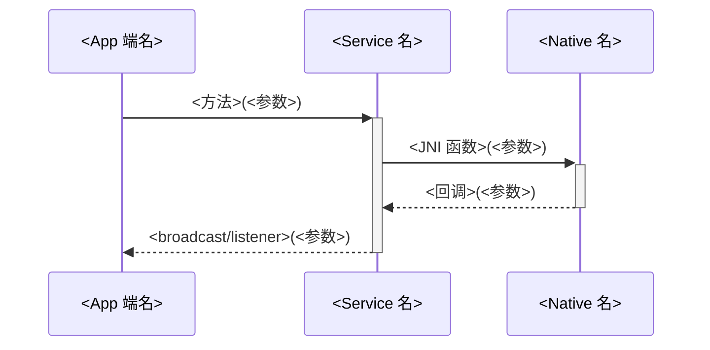

**占位符**：`<App 端名>`、`<Service 名>`、`<Native 名>`、`<方法>` 等
**禁止改动**：participant 数量、`-->>` 箭头方向、`+/-` 激活标记

---

### A.2 T-SEQ-5：五层完整调用链时序图

**使用场景**：端到端调用链（App / Framework / Service / JNI / BTA / Stack）

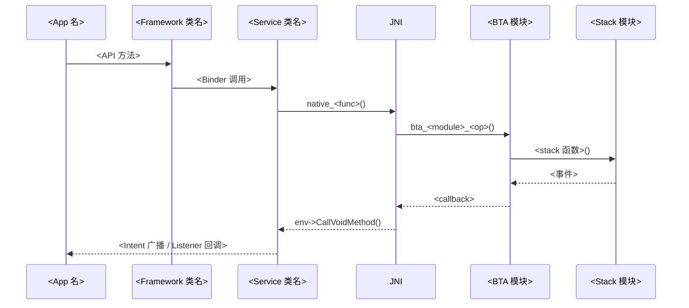

---

### A.3 T-SEQ-PEER：含对端的协议交互时序图

**使用场景**：与对端设备的协议帧交互（HFP AT 命令、SMP 配对、ATT 读写）

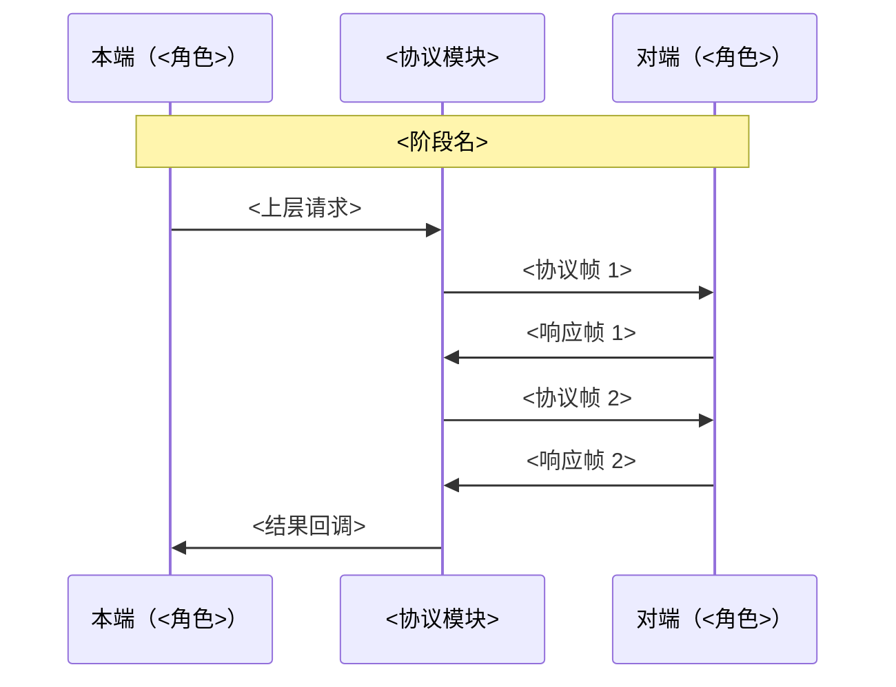

**变体**：可添加 1-3 个 `Note over` 标记协议阶段

---

### A.4 T-SEQ-PAIR：配对/连接专用时序图

**使用场景**：BLE 配对、HFP 连接、A2DP 连接等需要展示状态变迁的过程

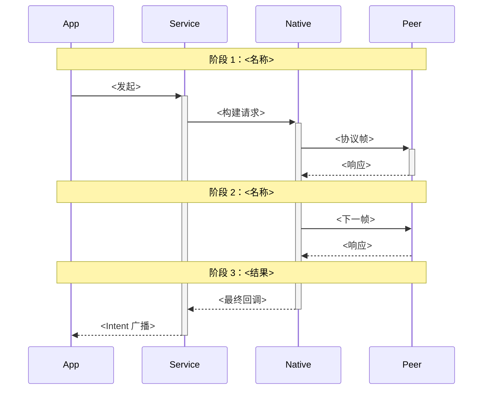

---

## B. 状态机（State Diagram）

### B.1 T-STATE-2：标准 Android StateMachine

**使用场景**：标准 4-5 个状态的 Android `StateMachine`（如 A2dpStateMachine）

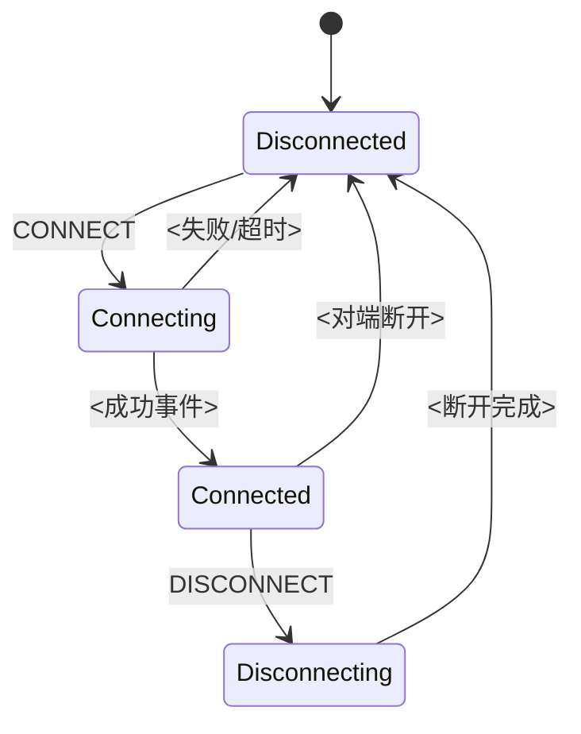

---

### B.2 T-STATE-3：含分支与异常的复杂状态机

**使用场景**：SMP / GATT 等多状态分支

```mermaid
stateDiagram-v2
  [*] --> IDLE
  IDLE --> <S1>: <事件 1>
  <S1> --> <S2>: <事件 2>
  <S1> --> ERROR: <异常>
  <S2> --> <S3>: <成功>
  <S2> --> ERROR: <异常>
  <S3> --> DONE: <完成>
  ERROR --> IDLE: <重置>
  DONE --> [*]
```

**占位符**：`<S1>` ~ `<S3>` 替换为实际状态名（用 PascalCase，禁含空格）

---

### B.3 T-STATE-NESTED：嵌套状态机（含子状态）

**使用场景**：HFP 连接中含 SLC 子状态、A2DP Streaming 含 Playing/Paused 子状态

```mermaid
stateDiagram-v2
  [*] --> Disconnected
  Disconnected --> Connecting

  state Connecting {
    [*] --> <Sub1>
    <Sub1> --> <Sub2>
    <Sub2> --> [*]
  }

  Connecting --> Connected
  Connected --> Disconnected: <断开>
```

---

## C. 架构图（Architecture Diagram）

### C.1 T-ARCH-4：四层架构图（App / FW / Native / HW）

**使用场景**：章节开头的总览图

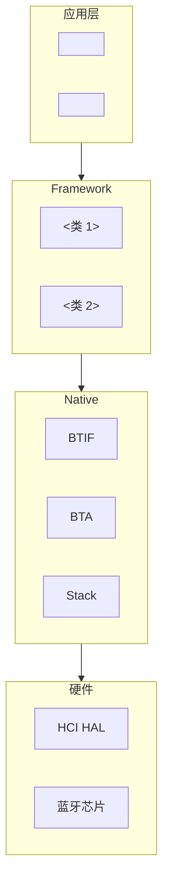

**占位符**：`<App 1>` 等节点名（不要含空格，用驼峰或下划线）

---

### C.2 T-ARCH-6：六层架构图（含 HAL 与对端）

**使用场景**：跨进程/跨设备的完整架构

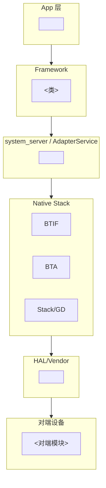

---

### C.3 T-ARCH-MODULE：单模块内部架构

**使用场景**：剖析单个 Profile/模块的子组件

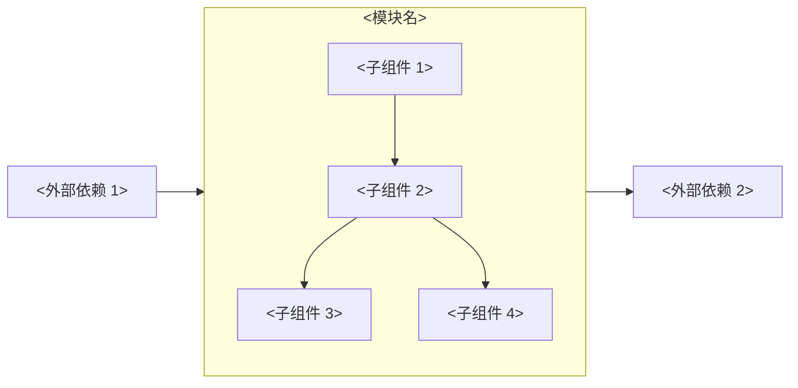

---

## D. 流程图（Flow Diagram）

### D.1 T-FLOW-3：三段式流程图（含分支）

**使用场景**：算法/判断流程

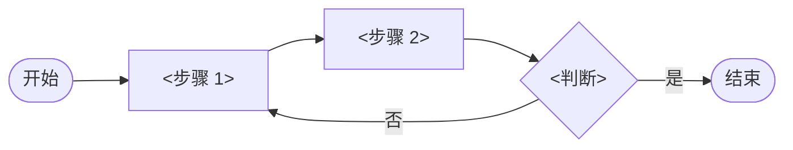

---

### D.2 T-FLOW-DECISION：完整决策树

**使用场景**：复杂决策（如 SMP Association Model 选择）

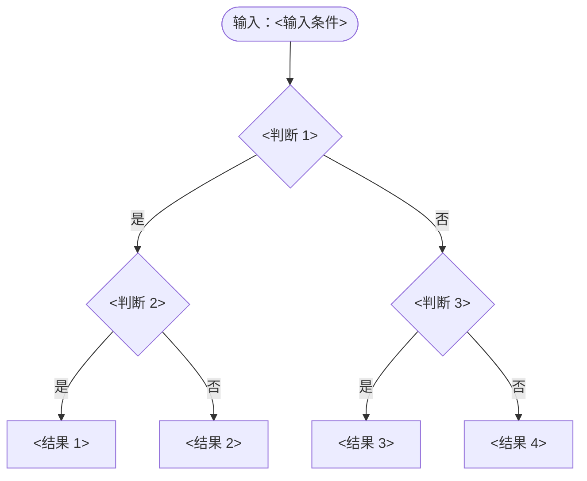

---

### D.3 T-FLOW-PIPELINE：流水线/数据流

**使用场景**：音频/数据处理流水线（如 A2DP 编码链路）

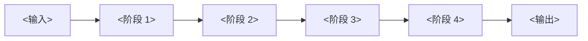

---

## E. 调用链专用图

### E.1 T-CALL-CHAIN：纵向调用链（含文件:行号）

**使用场景**：源码导读段，展示函数调用链

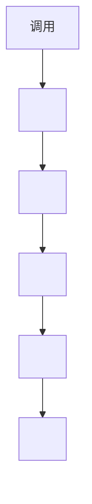

**占位符**：每个节点的 `<file:line>` 必须真实存在（自检会验证 file:line 引用）

---

## F. 协议帧时间线

### F.1 T-PCAP：协议帧时间线（btsnoop 解读专用）

**使用场景**：调试方法段，展示 btsnoop 抓包时间线

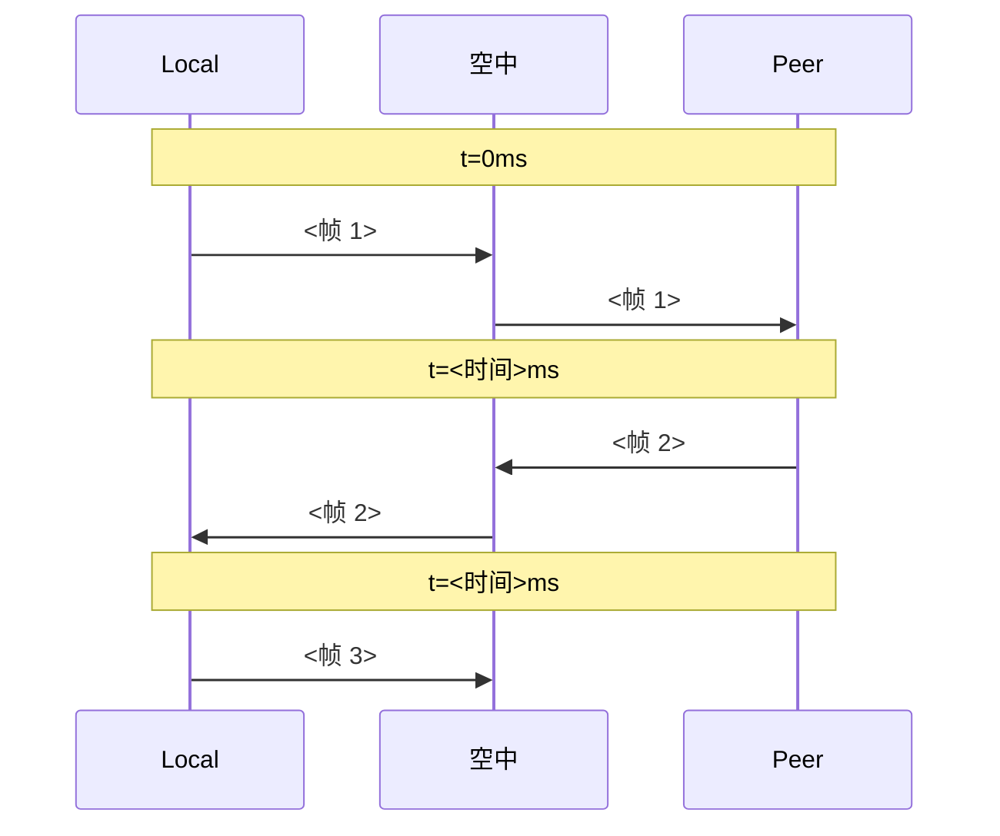

---

## G. 类图（少用，仅在数据结构关键时）

### G.1 T-CLASS：数据结构关系图

**使用场景**：解释 Native 数据结构关系（如 tGATT_TCB、tSMP_CB）

```mermaid
classDiagram
  class <类 A> {
    <字段 1>
    <字段 2>
    <方法 1>()
  }
  class <类 B> {
    <字段 1>
    <方法 1>()
  }
  <类 A> --> <类 B> : <关系名>
```

---

## H. 选型速查表

| 想表达 | 模板 | 备注 |
|--------|------|------|
| Java → JNI → Native 调用 | T-SEQ-3 | 3 层简化 |
| Java → FW → SVC → JNI → BTA → Stack | T-SEQ-5 | 5 层完整 |
| 与对端协议帧交互 | T-SEQ-PEER | 含对端 |
| 配对/连接全流程 | T-SEQ-PAIR | 含阶段 Note |
| 标准 4-5 状态状态机 | T-STATE-2 | 直接套用 |
| 复杂状态机含异常 | T-STATE-3 | 含 ERROR 状态 |
| 含子状态的状态机 | T-STATE-NESTED | 嵌套结构 |
| 章节开头的总览图 | T-ARCH-4 | 4 层经典 |
| 跨进程跨设备总览 | T-ARCH-6 | 6 层完整 |
| 单模块内部结构 | T-ARCH-MODULE | 含外部依赖 |
| 简单流程含分支 | T-FLOW-3 | 紧凑型 |
| 复杂决策树 | T-FLOW-DECISION | 决策算法 |
| 数据流水线 | T-FLOW-PIPELINE | 单向流 |
| 含 file:line 的调用链 | T-CALL-CHAIN | 源码导读专用 |
| btsnoop 协议时间线 | T-PCAP | 调试专用 |
| 数据结构关系 | T-CLASS | 仅必要时 |

---

## I. 禁用清单

中等模型在使用本模板库时，**禁止以下行为**：

| 禁用 | 原因 |
|-----|-----|
| 修改 `participant` 数量 | 破坏模板结构 |
| 添加 `Note over X,Y` 之外的复杂注解 | 渲染兼容性差 |
| 使用 `loop` / `alt` / `opt` | 中等模型语法错率高，需要时改用文字说明 |
| 用 `<br>` 之外的 HTML 标签 | 渲染不稳定 |
| 节点 ID 含中文 | Mermaid 解析不稳定，必须用拉丁字母 |
| 节点 ID 含空格、括号、点 | 解析失败 |
| 多于 8 个 participant 的时序图 | 超出可读范围，应拆分 |
| `flowchart` 中混用 `--->` 和 `-.->` | 视觉混乱 |

---

## J. 渲染验证

本地预览：
```bash
# 安装 Mermaid CLI（可选）
npm i -g @mermaid-js/mermaid-cli

# 渲染单个文件
mmdc -i diagram.mmd -o diagram.svg

# 集成到自检
python scripts/verify_section.py <章节.md>
# 若安装了 mmdc，自检会自动校验语法
```

---

## K. 维护

新增模板的流程：
1. 在对应类别（A-G）追加 `T-XXX-N` 编号
2. 提供完整模板源码 + 占位符列表 + 使用场景
3. 在 H 选型速查表追加一行
4. 通知所有进行中的物料包是否需要补充使用该模板
5. git commit 信息：`docs(模板库): 新增 T-XXX-N <名称>`
