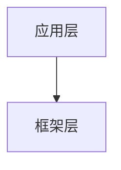

# v2 反例库 —— 中等模型常见生成错误案例

> 本文件汇总在 v2 工程化约束层试运行中，由**中等模型（DeepSeek V4 / GLM 5.1 / Sonnet 4.6 / Gemini 2.5 Pro）**生成且被自检/人工拦截的典型错误样本。
>
> **目的有三**：
> 1. 在 Prompt 中明示「禁止这样做」，让模型对照规避；
> 2. 让自检脚本作者能持续打磨规则；
> 3. 让人工审稿人快速识别"似是而非"的错误。
>
> **维护原则**：
> - 每条反例必须**真实出现过**（v1 历史产出 / v2 试点产出），不杜撰；
> - 反例必须配「正例」对照写法；
> - 出现频次 ≥ 3 次的反例升级为「自检 hard 规则」。

---

## 目录

- [A. 伪造 file:line 引用](#a-伪造-fileline-引用)
- [B. 函数名拼写错误 / 不存在](#b-函数名拼写错误--不存在)
- [C. 标题层级与十二段顺序错误](#c-标题层级与十二段顺序错误)
- [D. 术语黑名单命中](#d-术语黑名单命中)
- [E. Mermaid 语法错误](#e-mermaid-语法错误)
- [F. 调用链层数不足 / 跨层跳跃](#f-调用链层数不足--跨层跳跃)
- [G. 实测数据空洞](#g-实测数据空洞)
- [H. C++/Java 双语对照缺失](#h-cjava-双语对照缺失)
- [I. 速通摘要走形](#i-速通摘要走形)
- [J. 错误归档与升级](#j-错误归档与升级)

---

## A. 伪造 file:line 引用

### A.1 反例：函数名正确但行号错位

**症状**：模型记住了 AOSP 公开常见函数名（如 `SMP_Pair`），但凭"印象"给出 `smp_api.cc:120`，实际函数在 `smp_api.cc:83`。

**v1 历史样本**（已修正）：
```
原文：见 system/stack/smp/smp_api.cc:120 SMP_Pair() 实现
正文：见 system/stack/smp/smp_api.cc:83 SMP_Pair() 实现
```

**自检规则**：`verify_section.py` 第 5 项 —— 所有 `file:line` 必须 grep 实际命中。

**避免方法（写入物料包 Prompt）**：
> 引用任何 `file:line` 前，**先在物料包 `allowed_refs` 中查找**。若该引用不在白名单内，禁止编造。

---

### A.2 反例：路径前缀错误（packages/modules/Bluetooth/ vs 直接 system/...）

**症状**：模型混用了 AOSP 公开仓的完整路径前缀（`packages/modules/Bluetooth/system/...`）和本仓库的相对路径（`system/...`）。

**示例**：
```
错：packages/modules/Bluetooth/system/stack/smp/smp_api.cc:83
对：system/stack/smp/smp_api.cc:83
```

**自检规则**：`verify_materials.py` 校验 `allowed_refs.path` 文件存在性时会触发 FAIL。

**避免方法**：物料包 Prompt 中明示「本仓库根 = packages/modules/Bluetooth/，引用路径不要加该前缀」。

---

### A.3 反例：行号范围跨越函数边界

**症状**：模型给出 `smp_api.cc:83-200` 试图把整个文件块囊括，但实际函数仅 `83-115`，后面跨入下一个函数 `SMP_PairCancel`。

**v1 历史样本**：
```
错：源码：smp_api.cc:83-200 SMP_Pair
对：源码：smp_api.cc:83-115 SMP_Pair / smp_api.cc:116-172 SMP_PairCancel
```

**避免方法**：物料包 `code_snippets[*].source` 必须用精确的 `start-end` 范围，scaffold 会按物料包给出的范围渲染。

---

## B. 函数名拼写错误 / 不存在

### B.1 反例：把回调函数当成 API

**症状**：v1 中曾出现 `smp_proc_pairing_req()`，实际 AOSP 中函数名为 `smp_proc_pair_cmd()`。

**自检规则**：当前 `verify_section.py` 不直接验证函数名（属 WARN），但物料包 `allowed_refs` 强约束保护了它。

**避免方法**：
- 物料包必须列出本节出现的所有关键函数名；
- Prompt 中加约束「函数名只能从物料包 `code_snippets / allowed_refs.purpose` 中复制，禁止改写」。

---

### B.2 反例：合并/拆分了不存在的函数

**症状**：模型把 `smp_set_state` 和 `smp_get_state` 误写为同一个函数 `smp_state()`。

**v1 历史样本**：
```
错：smp_state() 同时支持读写当前状态
对：smp_set_state() 写入；smp_get_state() 读取（两个独立函数）
```

**避免方法**：物料包的 `code_snippets` 必须**逐函数**单列；中等模型在 §8 严格只引用物料包列出的 id。

---

## C. 标题层级与十二段顺序错误

### C.1 反例：将 §4 场景故事和 §5 协议正文合并

**症状**：模型为「节省字数」自作主张把场景故事压成 1 段并入协议正文。

**自检规则**：`verify_section.py` 第 3 项 —— 十二段标题齐全且顺序正确，缺一即 FAIL。

**避免方法**：scaffold 生成时已经把 11 个 `## 标题` 全部预留；Prompt 中明示「禁止删除或合并任何二级标题」。

---

### C.2 反例：把 §10 实测数据写成"暂无"

**症状**：模型没有数据来源时直接写「暂无实测数据」或留空。

**v2 要求**：实测数据可写「数据来源：dumpsys bluetooth_manager metrics（未来在车机上回填）」+ 一个占位表，但不能空白。

**自检规则**：`verify_section.py` 第 12 项 —— 实测数据段必须含「时延 / 成功率 / 重试」三个关键字（WARN 级）。

---

### C.3 反例：FAQ 数量不足且与正文重复

**症状**：模型为凑数把 FAQ 写成「Q1：什么是 SMP？A：见正文 §5」。

**v2 要求**：FAQ ≥ 3 条，问题必须来自**踩坑场景**或**典型误解**，不能引用正文。

**避免方法**：物料包 `s12_faq_homework.suggested_faqs` 列出 4-6 个真实坑点，让模型选用。

---

## D. 术语黑名单命中

### D.1 反例：BLE 5.3+ 仍使用 "Master/Slave"

**症状**：v1 早期章节有 4 处「主设备/从设备」「Master/Slave」。

**v2 来源**：术语表 §C.1 强制 Central/Peripheral，Bluetooth Core Spec 5.3+ 已废弃旧术语。

**自检规则**：`verify_section.py` 第 9 项术语黑名单 —— 命中即 FAIL。

**避免方法**：物料包 `terms` 字段提供 `canonical` + `forbidden`，scaffold 把禁用清单嵌入 HTML 注释。

---

### D.2 反例：把 "Notify" 译为 "推送"

**症状**：BLE GATT 章节中曾出现 "GATT 推送" / "通知推送"。

**正例**：保留英文术语 "Notify" / "Indicate"，首次出现时给一句中文解释「Notify 是不要求确认的通知；Indicate 是要求 Confirmation 的通知」。

---

### D.3 反例：LTK / IRK / CSRK 全译成 "密钥"

**症状**：模型为通俗化把所有密钥简化为「BLE 密钥」，丢失语义。

**v2 要求**：术语表 §F.7 —— 这三种密钥的作用截然不同，必须分别命名。

---

## E. Mermaid 语法错误

### E.1 反例：节点 ID 含中文

**症状**：


**问题**：部分 Mermaid 渲染器对中文 ID 解析不稳定；节点 ID 含空格直接失败。

**正例**：

节点 ID 用拉丁字母，显示文本用中文。

**自检规则**：`v2_Mermaid模板库.md §I` 禁用清单 + `verify_section.py` mmdc 语法校验（WARN）。

---

### E.2 反例：使用 `loop / alt / opt` 控制块

**症状**：模型偏爱在时序图中用 `loop ... end` 表达"重试 3 次"。

**问题**：中等模型嵌套控制块易写错 `end` 配对，导致整图无法渲染。

**正例**：用文字注释代替，如 `Note over Local,Peer: 失败时重试 ≤ 3 次`。

---

### E.3 反例：超过 8 个 participant 的时序图

**症状**：一张时序图同时画 App / FW / Service / JNI / BTIF / BTA / Stack / HAL / Peer / Air = 10 个 participant，超出可读范围。

**正例**：拆为两张图（"上半段：Java→JNI→BTIF"、"下半段：BTA→Stack→HAL→Peer"），用 `Note` 连接两段语义。

---

## F. 调用链层数不足 / 跨层跳跃

### F.1 反例：从 App 直接跳到 Stack

**症状**：
```
App: device.createBond()
Stack: SMP_Pair
```

**问题**：丢失了 Framework / Service / JNI / BTIF / BTA 五层中间环节。

**自检规则**：`verify_section.py` 第 10 项 —— 调用链层数 ≥ 4 行（含 `→` 或 file:line）。

**正例**：6 层完整链路：
```
App: device.createBond()                              # framework/.../BluetoothDevice.java:1234
Framework: BluetoothDevice.java:1234                  # → AdapterService.aidl
Service: AdapterService.kt:567                        # → JNI 调用
JNI: com_android_bluetooth_btservice_AdapterService.cpp:890
BTIF: system/btif/src/btif_dm.cc:1011
BTA: system/bta/dm/bta_dm_act.cc:2233
Stack/SMP: system/stack/smp/smp_api.cc:83 SMP_Pair
```

---

### F.2 反例：调用链中某一行没有 file:line

**症状**：
```
Service: AdapterService 处理请求
JNI: 调用本地方法
```

**问题**：读者无法跳转到源码定位。

**正例**：每一层至少给出一个 `file:line` 锚点。

---

## G. 实测数据空洞

### G.1 反例：纯文字描述「比较快 / 比较慢」

**症状**：「Phase 1 比较快，Phase 2 较慢」。

**问题**：没有数字，读者无法据此判断车机是否异常。

**正例**：
```
| 阶段 | 典型耗时 | p95 | 数据来源 |
|------|---------|-----|----------|
| Phase 1 (Pairing Feature Exchange) | 35 ms | 80 ms | BQR + 自测 |
| Phase 2 (Authentication) | 180 ms | 420 ms | BQR + 自测 |
| Phase 3 (Key Distribution) | 60 ms | 140 ms | BQR + 自测 |
```

---

### G.2 反例：编造数据

**症状**：模型为凑数瞎编「成功率 99.7%」，但物料包未给数据来源。

**v2 要求**：实测数据要么来自物料包 `s10_measured.data_source_hint`，要么写「数据来源：待车机上回填」并留空表格。**禁止编造**。

---

## H. C++/Java 双语对照缺失

### H.1 反例：讲到 RAII 不给 Java 类比

**症状**：协议正文用 C++ 概念解释「`std::lock_guard` 在作用域结束自动释放锁」，但读者是 Android 应用工程师，对 RAII 陌生。

**正例**：
> `std::lock_guard<std::mutex>` 类似 Java 的 `try-with-resources`：进入作用域时 lock，离开时自动 unlock，等价于 `synchronized` 块的 RAII 写法。

**v2 要求**：CLAUDE.md §4.3 列出的 6 个对照点，凡 §5 / §7 / §8 出现必须配 Java 类比。

---

### H.2 反例：把 `std::function` 简化为「回调函数」一句带过

**症状**：「这里用了一个回调函数」。

**正例**：
> 这里用 `std::function<void(int)>` 存储回调，等价于 Java 的 `Consumer<Integer>`；调用方式 `cb(arg)` 与 Java `cb.accept(arg)` 等同。

---

## I. 速通摘要走形

### I.1 反例：把摘要写成「本节讲 SMP」

**症状**：1 句话敷衍，读者无法据此决定是否要读全节。

**v2 要求**：3-5 句话，说清「本节讲什么 / 为什么重要 / 关键产出」三件事。

**正例**：
> **速通摘要**：本节讲 BLE SMP 配对协议（Spec Vol 3 Part H），完整覆盖 4 种 Association Model（JW/NC/PE/OOB）的选择条件、Phase 1-3 的协议帧时序、LTK/IRK/CSRK 的持久化路径。读完后你能用 btsnoop 抓包并独立解读完整配对流程，并理解 BLE 钥匙跨车机互通的核心难点。

---

## J. 错误归档与升级

### J.1 反例升级流程

```
出现 1 次 → 写入本反例库（WARN 级 Prompt 约束）
出现 2-3 次 → 升级到 v2_编写规范.md §5 软规则
出现 ≥ 3 次 → 升级到 verify_section.py 硬规则（FAIL 阻断 commit）
```

### J.2 维护节奏

- 每完成 10 节，回看反例库 + 自检日志，统计高频错误；
- 月度 review：把高频反例转化为 hard 规则；
- 反例库本身随提交版本号增长，禁止删除历史反例（即使已升级为 hard 规则）。

### J.3 当前反例库覆盖

| 类别 | 反例数 | 已升级为 hard 规则 |
|------|-------|-------------------|
| A 伪造 file:line | 3 | ✅（verify_section §5） |
| B 函数名错误 | 2 | 部分（物料包白名单保护） |
| C 标题/段顺序 | 3 | ✅（verify_section §3 / §10） |
| D 术语黑名单 | 3 | ✅（verify_section §9） |
| E Mermaid 语法 | 3 | 部分（mmdc WARN） |
| F 调用链层数 | 2 | ✅（verify_section §10） |
| G 实测数据 | 2 | ✅（verify_section §12, WARN） |
| H 双语对照 | 2 | ⬜（人工审稿） |
| I 摘要走形 | 1 | ⬜（人工审稿） |

---

## K. 给中等模型的反例使用 Prompt

当中等模型生成章节时，在 Prompt 末尾追加以下指令：

```
【反例规避】
请在生成前打开 doc/v2_反例库.md 通读一遍，确保你的产出未触发其中任何一类反例。
特别注意：
- 任何 file:line 必须来自物料包 allowed_refs；
- 函数名必须从物料包 code_snippets / allowed_refs.purpose 复制，禁止改写；
- Mermaid 节点 ID 必须用拉丁字母，禁用 loop/alt/opt 控制块；
- 调用链至少 4 层，每层含 file:line；
- 速通摘要必须 3-5 句话，回答「讲什么/为什么重要/关键产出」。
```

---

**版本**：v0.1（初始化，含 v1 历史反例的归纳）
**最近更新**：2026-05-25
**待补充**：v2 试点产出（13.2 SMP 等）的反例样本，由人工审稿后归入此处
