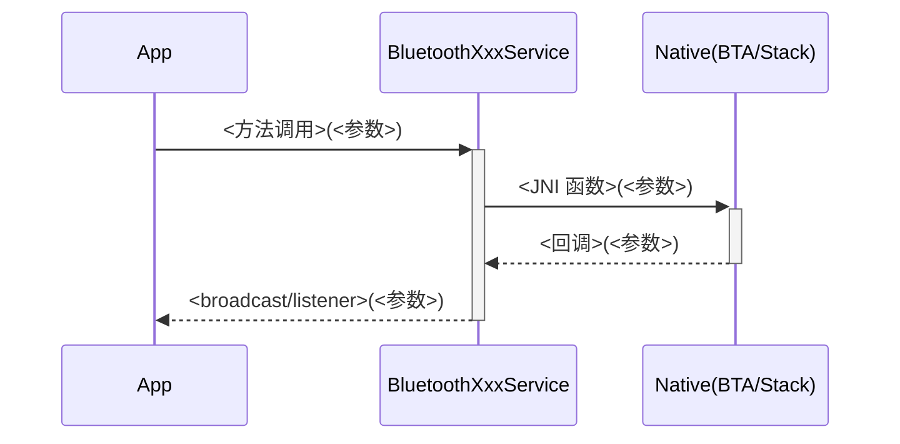
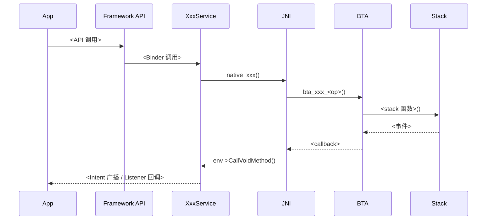
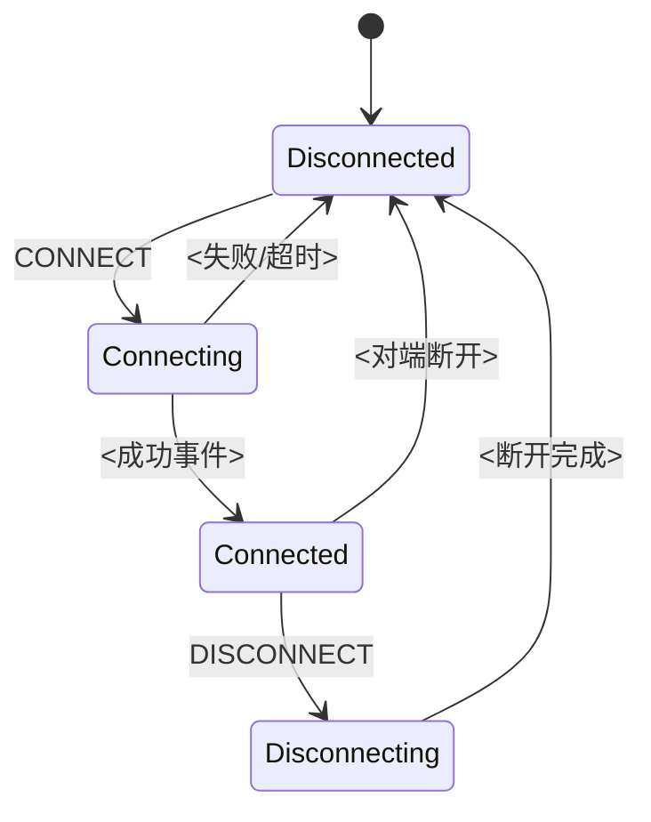
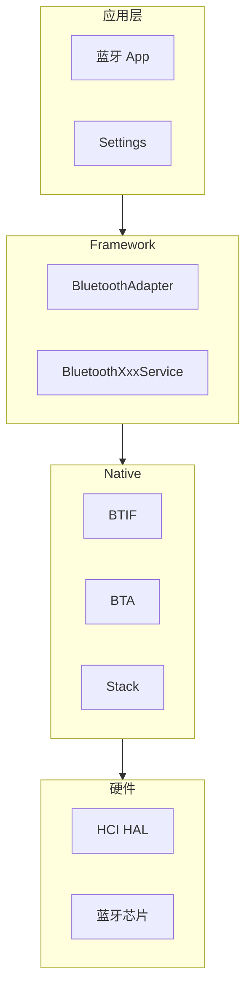
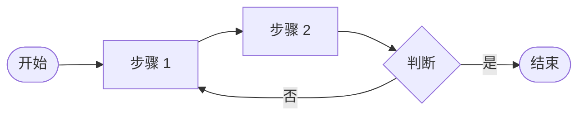

# v2 编写规范

> 本文档定义 **v2 学习资料每一节的编写流程、模板、质量门**。
> 适用对象：所有参与 v2 章节生成的人或模型（Claude Opus / Sonnet / DeepSeek V4 / GLM / Qwen / 开源模型 / 人工）。
>
> **本规范是硬性约束**，违反 §2 / §3 / §5 任意一条的产出不允许入库。

---

## 1. 节级五步工作流（强制）

```
Step 1  准备物料包（_物料包/<章>/<节>.yaml）
   │   负责方：强模型（Opus）或人工
   │   产出：allowed_refs / code_snippets / flags / terms / mermaid_templates / section_outline
   ▼
Step 2  模型按十二段填空模板生成草稿
   │   负责方：DeepSeek V4 等中等模型
   │   输入：物料包 + 本规范 + 全局 CLAUDE.md
   │   产出：doc/学习资料_v2/<章>/<节>.md
   ▼
Step 3  自检：python scripts/verify_section.py <节>.md
   │   PASS  → Step 4
   │   FAIL  → 回炉重写（≤ 3 次），3 次仍 FAIL → 人工接管 + 入反例库
   ▼
Step 4  写入跟踪记录 + git commit
   │   commit msg: docs(v2): 完成 <章节编号> <章节名>
   ▼
Step 5  每 5 节抽 1 节人工 review（见 §6）
```

---

## 2. 十二段填空模板（v2 标准节结构）

> 每节 Markdown 文件必须按以下 12 个一级标题依次出现，**顺序与标题文本严格固定**，否则自检 FAIL。

```markdown
---
# §1 元数据卡片（YAML frontmatter）
section_id: "06.2"
title: "GATT 连接全链路"
priority: P0
audience: ["车机蓝牙集成工程师", "栈维护工程师"]
prerequisites: ["02.3", "03.4", "08.2"]
related: ["13.2", "16.1"]
estimated_reading_min: 35
estimated_practice_min: 90
last_verified: "2026-05-25"
verified_against_aosp: "android-16.0.0_r5"
---

# <节编号> <节标题>

> **速通摘要**：<3-5 句，覆盖"这节讲什么 / 为什么重要 / 关键产出"，单读这段就能形成完整骨架。>

## §2 学习目标
- <目标 1，必须可验证（"能画出 XX 状态机"而非"理解 XX"）>
- <目标 2>
- <目标 3>

## §3 前置知识
- <列出本节假设读者已掌握的章节、概念、API>
- <若读者缺这些，应回到指定章节补课>

## §4 场景故事（车载视角）
<200 字以上，必须包含具体车机场景：A2DP / HFP / BLE 钥匙 / HiCar 等。
不要泛泛说"用户配对了一个设备"，而要说"驾驶员上车后手机自动重连车机播放音乐"。>

## §5 协议正文 / 概念深入
<本节核心理论部分。600 字以上。必须包含：
- 协议规范引用（Spec 章节号）
- 帧/包结构（含 hexdump 示例或字段表）
- 关键时序参数（超时、重试、状态转移）
- 与上下层协议的边界
本段是 v2 相对 v1 最大增强点：v1 多是"工程视角"，v2 必须有"协议视角"。>

## §6 分层调用链
<至少 4 层：
- App 层入口（Android API 调用）
- Java Service 层（packages/modules/Bluetooth/android/app/src/...）
- JNI 层（android/app/jni/...）
- BTIF 层（system/btif/...）
- BTA 层（system/bta/...）
- Stack 层（system/stack/...）
- 必要时含 GD 层（system/gd/...）
每层 1-2 行：函数名 + file:line。>

## §7 源码导读
<至少 6 个 file:line 引用，按推荐阅读顺序排列。每条说明"为什么读"。
所有引用必须在物料包 allowed_refs 中。>

## §8 简化代码片段
<至少 2 段，每段 20-50 行。直接来自物料包 code_snippets。
保留原行号注释（// L<行号>），不做语义改动。
每段后 3-5 行通俗解释。>

## §9 流程图 / 时序图（Mermaid）
<至少 2 张。使用 §4 中定义的 Mermaid 模板。
图 1 通常是端到端时序图；图 2 通常是状态机或分层架构。>

## §10 实测数据（v2 新增）
<必须包含：
- 时延：典型值 + p95 + 最差观测值（单位 ms）
- 成功率：典型场景成功率 + 边缘场景退化情况
- 重试 / 状态机循环次数
- 数据来源：实验室实测 / btsnoop 抓包统计 / dumpsys metrics
若该节无法直接实测，注明"参考 SIG / AOSP issue tracker"并给出链接。>

## §11 调试方法 / 车机集成点（v2 新增车机集成段）
<必须包含两小节：
### 调试方法
- logcat tag 清单
- dumpsys 命令
- btsnoop 抓取与 Wireshark 过滤
- aconfig flag 切换

### 车机集成点
- OEM 通常在哪里定制此模块
- 与车机 HMI / 仪表 / 仪表盘 / IVI 交互边界
- 多用户 / DPM / 飞行模式联动
>

## §12 FAQ + 自测题 + 上路任务（v2 新增自测题）
### FAQ
<至少 3 个真实问题，每个给出"短答 + 详答"。>

### 自测题
<至少 3 题，含 1 选择 + 1 简答 + 1 实操。答案放 `附录D/自测题答案/<节>.md`>

### 上路任务
<至少 2 个可在源码或仿真器上完成的任务。每个任务明确"成功标志"。>
```

---

## 3. 物料包规范（pre_section.yaml）

物料包是 v2 工程化的核心：**把"模型自由探索源码"改为"模型按预制清单填空"**，从根上杜绝伪造。

### 3.1 文件位置

```
doc/学习资料_v2/_物料包/
  ├── 06_GATT深度/
  │   ├── 06.1_GATT架构与角色.yaml
  │   ├── 06.2_GATT连接全链路.yaml
  │   ├── 06.3_服务发现与缓存.yaml
  │   └── ...
  ├── 12_LE_Audio全景/
  └── ...
```

### 3.2 必填字段（YAML schema）

```yaml
meta:                    # 元数据
  section_id: str        # "06.2"
  title: str
  priority: enum [P0, P1, P2, P3]
  related_sections: [str]
  last_verified: date    # YYYY-MM-DD，AOSP 上游可能变化，需季度回归

allowed_refs:            # 允许的 file:line 引用清单（强约束）
  - path: str            # 仓库相对路径，如 "system/stack/gatt/gatt_main.cc"
    lines: [int]         # 允许引用的行号清单
    purpose: str         # 该引用的用途说明
    verified_at: date    # 最后一次 grep 验证日期
  # 模型生成时不允许出现不在此清单的 file:line

code_snippets:           # 预截取的代码片段
  - id: str              # 唯一标识，模型按 id 引用
    source: str          # "system/stack/gatt/gatt_main.cc:245-280"
    language: str        # "cpp" / "java" / "kotlin"
    code: |              # 实际代码（已截取）
      ...
    annotation: str      # 通俗解释

flags:                   # 相关 aconfig flag
  - name: str
    default: bool
    impact: str

terms:                   # 术语约束（白名单 + 黑名单）
  - canonical: str       # 必须使用的标准译名
    forbidden: [str]     # 禁止使用的别名
    ref: str             # 在 doc/术语表.md 中的锚点

mermaid_templates:       # 推荐 Mermaid 模板
  - id: str              # T-SEQ-3 / T-STATE-2 等（见 §4）
    use_for: str

section_outline:         # 十二段填空提示
  s01_metadata: {...}
  s02_objectives: {...}
  ... (12 段)
```

### 3.3 制作物料包的工作流

**由强模型（Opus）或人工完成**：

```
1. grep / glob 找出本节相关的源码文件
2. Read 关键文件，标记需要引用的行号
3. 再次 grep 验证每个 file:line 真实存在
4. 截取代码片段，去除噪音
5. 列出相关 aconfig flag（搜索 flags/*.aconfig）
6. 从 doc/术语表.md 摘出本节涉及的术语锚点
7. 选择适合的 Mermaid 模板编号
8. 写 section_outline 填空提示
9. 自检：python scripts/verify_materials.py <节>.yaml
```

---

## 4. Mermaid 模板库

> 中等模型在复杂 Mermaid 图上容易语法错。预置以下模板，模型只填节点不改结构。

### T-SEQ-3：三方时序图（App / Service / Native）



### T-SEQ-5：五层完整调用链时序图



### T-STATE-2：标准 Android StateMachine 状态机



### T-ARCH-4：四层架构图



### T-FLOW-3：三段式流程图



**使用规则**：模型必须**只填占位符**（节点文本），不允许：
- 修改 participant / state 数量
- 修改箭头类型
- 添加非模板中的语法元素（如 `note over`、`Note left of` 等）

如确需变体，需先在物料包 `mermaid_templates` 中声明新模板编号，并附 .mmd 源文件到 `doc/v2_mermaid_templates/`。

---

## 5. 质量门（v2.0 入库硬指标）

**自检脚本 scripts/verify_section.py 必须 PASS，才能入库 commit**。检查项：

| 检查项 | 通过条件 | 严重度 |
|-------|---------|-------|
| 文件命名 | 匹配 `<编号>_<标题>.md`，无空格 | FAIL |
| YAML frontmatter | 必填字段齐全 | FAIL |
| 十二段标题 | 12 个一级标题正则匹配，顺序固定 | FAIL |
| `file:line` 引用 | 全部在 allowed_refs 中 + Grep 实际可命中 | FAIL |
| Mermaid 块 | ≥ 2 个 ```mermaid 围栏 | FAIL |
| Mermaid 语法 | 用 `mmdc --dry-run` 校验（可选，未装 mmdc 时跳过）| WARN |
| 各段字数 | 满足 outline.min_words | FAIL |
| 必含关键词 | outline.must_contain 全部出现 | FAIL |
| 术语黑名单 | terms.forbidden 词不出现 | FAIL |
| 调用链层数 | §6 至少 4 层 | FAIL |
| FAQ 数 | ≥ 3 | FAIL |
| 上路任务数 | ≥ 2 | FAIL |
| 自测题数 | ≥ 3 | FAIL |
| 实测数据字段 | §10 含「时延 / 成功率 / 重试」三关键字 | WARN |

**FAIL 阻断 commit，WARN 仅警告**。

---

## 6. 人工 review 清单（每 5 节抽 1 节）

```
□ 速通摘要是否真的"3 句话讲清这节"？
□ 场景故事是否有具体车机情境（非泛泛而谈）？
□ 协议正文是否引用 Spec 章节号？
□ 调用链是否真的"端到端"（不是只到 Service 层就停）？
□ 抽查 3 条 file:line：实际打开看，是否对应描述？
□ Mermaid 图是否真的渲染出来（在 markdown preview 里看）？
□ 实测数据是否有具体数字（不是"较快"、"稳定"这种模糊词）？
□ FAQ 是否真的解决困惑（不是凑数）？
□ 上路任务是否可执行（不是"试试看"这种废话）？
□ 与前后章节是否有交叉链接？
□ 术语是否与术语表一致？
```

发现严重问题 → 回炉 + 记入 `doc/v2_反例库.md`。

---

## 7. 反例库管理

每次自检 FAIL 或人工 review 发现伪造，记入 `doc/v2_反例库.md`：

```markdown
## 案例 <序号>：<简短描述>
- **节**：06.2
- **模型**：DeepSeek V4
- **失败类型**：伪造 file:line
- **原文**：
  > 见 `system/stack/gatt/gatt_main.cc:999` 中 `gatt_le_disc_cmpl_evt()`
- **真实情况**：该文件总行数 487，999 行不存在；该函数名实际为 `gatt_le_connect_complete`
- **回炉方式**：在物料包中加入 forbidden_lines: [999] + forbidden_functions: ["gatt_le_disc_cmpl_evt"]
- **教训**：物料包必须包含「函数名白名单」字段
- **日期**：2026-05-26
```

**每月回顾一次反例库**，提炼成下一轮物料包模板的输入。

---

## 8. 模型档位与适配

| 档位 | 代表模型 | 物料包详尽度 | 自检严格度 | 抽样比例 | 备注 |
|------|---------|------------|-----------|---------|------|
| 强 | Claude Opus 4.7 / GPT-5 | 简化版 | 标准 | 1/10 | 可省 code_snippets 预喂 |
| 中 | DeepSeek V4 / Sonnet 4.6 / Gemini 2.5 Pro | 完整版 | 严格 | 1/5 | **本项目当前默认档位** |
| 弱 | DeepSeek V3 / GPT-4o-mini / Llama 70B | 完整 + 全量代码预喂 | 严格 + 字数加权 | 1/3 | 实测题可能需要人工补 |

---

## 9. 强模型一次性移交清单（强模型 vs 中等模型边界）

> **核心原则**：v2 的批量产出由**中等模型**（DeepSeek V4 / GLM 5.1 / Sonnet 4.6 / Gemini 2.5 Pro）完成。强模型（Claude Opus）的工作必须**一次性前置完成**，**禁止**让中等模型流程中再依赖强模型介入。
>
> 一旦下表 ✅ 项全部就绪，中等模型即可独立完成「物料包 → 脚手架 → 填空 → 自检 → commit」的全闭环，不再需要 Opus。

### 9.1 强模型一次性移交物（已就绪 / 待补全）

| # | 移交物 | 状态 | 文件 | 用途 |
|---|--------|------|------|------|
| 1 | v2 升级方案 | ✅ | `doc/升级改造方案_v2.md` | 总体策略，方案 B 落地路径 |
| 2 | v2 编写规范 | ✅ | `doc/v2_编写规范.md`（本文件） | 中等模型的"工作守则" |
| 3 | 物料包示例 | ✅ | `doc/v2_物料包示例.md` | 中等模型理解物料包结构的范本 |
| 4 | 术语表 | ✅ | `doc/术语表.md` | 13 大类术语 canonical/forbidden |
| 5 | Mermaid 模板库 | ✅ | `doc/v2_Mermaid模板库.md` | 16 个唯一允许使用的模板 |
| 6 | 反例库 | ✅ v0.1 | `doc/v2_反例库.md` | 中等模型规避典型错误 |
| 7 | 物料包目录 README | ✅ | `doc/学习资料_v2/_物料包/README.md` | 物料包目录布局与工作流 |
| 8 | 物料包自检脚本 | ✅ | `scripts/verify_materials.py` | 强模型/人工写完物料包后立即校验 |
| 9 | 脚手架脚本 | ✅ | `scripts/scaffold_section.py` | 中等模型从物料包生成填空骨架 |
| 10 | 章节自检脚本 | ✅ | `scripts/verify_section.py` | 中等模型自检（FAIL 必须重写） |
| 11 | 试点物料包 1 个 | ✅ | `doc/学习资料_v2/_物料包/13_安全与加密/13.2_SMP详解.yaml` | 端到端流程已验证 |
| 12 | 全量物料包 | ⬜ 0/180 | `doc/学习资料_v2/_物料包/<ch>/*.yaml` | **当前唯一阻塞批量产出的事项** |

### 9.2 待补全（必须强模型/人工完成，不可交给中等模型）

#### A. 全量物料包批量制作（最重的剩余工作）

- **规模**：覆盖 ch00-ch24 共 25 章约 180 节
- **预算**：单节 1-1.5 小时 × 180 节 ≈ 200-270 工时（强模型）
- **优先级顺序**（与 `doc/开发计划.md` M6-M7 优先级一致）：
  1. **M6 P0**（约 12 节）：ch12 LE Audio 全景 + ch16 音频路由
  2. **M6 P1**（约 10 节）：ch13 安全与加密（13.1/13.3/13.4/13.5） + ch14 OBEX
  3. **M7 P0/P1**（约 13 节）：ch17 多设备 + ch18 BluetoothManagerService + ch19 BQR
  4. **方案 C 扩展**（约 25 节）：ch15/20-24（按用户后续决定是否启动）
  5. **v1 回填**（约 120 节）：ch00-ch11 升级 v2 标准

- **节奏建议**：
  - 不一次性写完 180 个，**按章批量做** —— 一章物料包做完即可让中等模型开始那一章
  - 强模型与中等模型可**并行**：强模型在做下一章物料包时，中等模型在写当前章节

#### B. 人工任务（强模型也不能代）

| 任务 | 说明 |
|-----|------|
| pcap 抓包样本 | 30+ 个 btsnoop 实拍，需真车机环境 |
| Android Studio 演示工程 | 5-8 个完整可编译项目 |
| 实测数据回填 | §10 表格的具体数字，需真车测量 |
| 章节抽样 review | 每 5 节抽 1 节，确认 §5 / §7 / §8 质量 |

### 9.3 中等模型自闭环边界

下列动作中等模型可**独立完成**，无需任何强模型介入：

```
[中等模型独立循环]
  ┌─────────────────────────────────────────┐
  │ 1. 读物料包                              │
  │ 2. python scripts/scaffold_section.py   │
  │ 3. 在脚手架填中文（受 HTML 注释约束指导）│
  │ 4. python scripts/verify_section.py     │
  │ 5. FAIL → 回到 step 3 重填（≤ 3 次）    │
  │ 6. PASS → 更新跟踪记录 + git commit     │
  └─────────────────────────────────────────┘
```

下列情况必须**移交给强模型/人工**：

| 情况 | 移交对象 |
|-----|---------|
| 自检 3 次仍 FAIL | 人工审稿 + 入反例库 |
| 物料包发现 file:line 失效（AOSP 升级） | 强模型重做物料包 |
| 出现现有 Mermaid 模板表达不了的图 | 强模型/人工在模板库追加 |
| 反例库高频错误 | 强模型升级 verify_section.py 规则 |
| 跨节交叉引用混乱 | 人工梳理 cross_links |

### 9.4 强模型移交后的"勿扰"承诺

- 中等模型在执行 §9.3 循环时，**不需要**调用 Claude Opus 任何 API；
- 中等模型遇到不确定，**优先用 verify 脚本仲裁**，而不是请强模型"判断一下"；
- 若中等模型卡住超过 3 轮，标准动作是**移交人工**，而非"先用 Opus 救场"——这是为了让流程的可重复性与成本可预测性始终成立。

### 9.5 当前移交状态总结

```
强模型已交付：11/12 项 ✅
唯一剩余：批量物料包制作（按需启动，不阻塞试点）
中等模型可立刻开始的工作：13.2 SMP 试点节填空
```

---

## 10. 与全局 CLAUDE.md 的关系

本规范是 v2 的「编写细则」,与全局 `CLAUDE.md` 的关系：

| 全局 CLAUDE.md（v1+v2 通用） | 本规范（v2 专属） |
|-----------------------------|-----------------|
| 章节九段式（v1 基线） | 十二段式（v2 升级） |
| 提交粒度每章一次 | 仍每章一次 |
| 不得伪造 file:line | 强化为物料包白名单约束 |
| C++/Java 双语对照 | 仍要求，写入 §5 / §8 |
| 路径用相对路径 | 不变 |
| 中文交付 | 不变 |

**v2 章节生成时，本规范优先级 > 全局 CLAUDE.md 中冲突的具体条款**。

---

## 11. 起步：跑通第一节的最小流程

```bash
# 1. 选一个试点节（推荐 13.2 SMP 详解，P1 重点 + v1 有基础便于对比）
NODE=13.2_SMP详解

# 2. 准备物料包（强模型或人工，1-2 小时）
vim doc/学习资料_v2/_物料包/13_安全与加密/${NODE}.yaml

# 3. 验证物料包
python scripts/verify_materials.py doc/学习资料_v2/_物料包/13_安全与加密/${NODE}.yaml

# 4. 模型按物料包 + 本规范填空生成
#    （DeepSeek V4 等中等模型，1-3 小时）
# 产出：doc/学习资料_v2/13_安全与加密/${NODE}.md

# 5. 自检
python scripts/verify_section.py doc/学习资料_v2/13_安全与加密/${NODE}.md

# 6. PASS 后 commit
git add doc/学习资料_v2/13_安全与加密/${NODE}.md doc/开发跟踪记录.md
git commit -m "docs(v2): 完成 ${NODE}"
```

**第一节跑通后，再批量制作物料包，进入阶段 1 骨架升级。**
