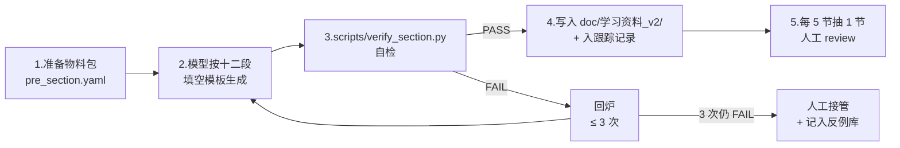

# Android 16 车载蓝牙学习资料 — 升级改造方案（v2.0 规划）

> 本文档面向"已经看完 v1.x 全量教材但觉得不够细、不够全"的读者与作者。  
> 用途：在 **不写正文** 的前提下，先把"应该改成什么样、要新增哪些章节、每节应满足什么质量底线"讲清楚，作为后续 v2.0 全量编写的指南。  
> 作者：本仓库维护者（@Developer）+ Claude  
> 起草日期：2026-05-25

---

## 0. 阅读地图

| 章节 | 用途 |
|------|------|
| §1 | 现状盘点：v1.x 实际交付了什么 |
| §2 | 问题诊断：覆盖面、深度、质量、可操作性四方面的具体缺口 |
| §3 | 改造目标与设计原则 |
| §4 | **v2.0 新目录结构**（含新增、拆分、深化章节） |
| §5 | **新版九段式模板**（v1 模板的扩展） |
| §6 | 质量底线（与 v1 的差异） |
| §7 | 学习路径设计（角色/难度分层） |
| §8 | 配套资产（demo / pcap / 答案） |
| §9 | 执行计划（阶段、里程碑、估时） |
| §10 | 验收标准 |

---

## 1. 现状盘点（v1.x 实际数据）

### 1.1 量化指标

| 指标 | 当前值 | 说明 |
|------|--------|------|
| 章节数（一级） | 26 章（含附录 A/B） | 00-24 + 附录 |
| 小节数（二级） | 111 节 | 每节一个独立 .md |
| 总行数 | 28,229 行 | 平均 254 行/节 |
| 最短节 | 74 行（`11.4 A2DP 无声`） | 故障排查类整体偏薄 |
| 最长节 | 418 行（`19.2 Statsd metrics`） | 工具类相对扎实 |
| Mermaid 图数 | 估约 80 张 | 平均 0.7 张/节 |
| 验证过的 `file:line` 引用 | 估约 250+ | 全部 grep 可查 |

### 1.2 已覆盖主题（v1.x 实际范围）

```
✅ Framework Java API（Adapter/Device/Profile Proxy/AIDL）
✅ 核心流程（开关/扫描/配对/连接/解绑）
✅ JNI 双向桥接
✅ Native 栈分层（BTIF/BTA/Stack/GD）
✅ 主要 Profile：A2DP/AVRCP/HFP/HFP Client/BLE-GATT/HID/PAN/PBAP/MAP/SAP/OPP
✅ LE Audio 基础（LC3/CIS/BIS/CSIP/VCP/MCP/TBS/ASHA）
✅ 安全（SSP/SMP/LE Privacy/Link Key/CTKD）
✅ 多设备共存（ActiveDevice/PhonePolicy/SilenceDevice）
✅ BMS Kotlin 深度（部分）
✅ 性能/功耗/Metrics/BQR
✅ 测试与 CTS（gtest/Verifier/Bumble）
✅ aconfig flag 与版本演进
✅ Socket（RFCOMM + L2CAP CoC）
✅ Vendor 扩展 + 多 HCI
✅ Channel Sounding + DistanceMeasurement
✅ C++ 补课、车机互联 HiCar/CarLink/CarPlay、故障排查
```

---

## 2. 问题诊断（为什么需要 v2.0）

### 2.1 覆盖面缺口（对照源码实际广度）

#### 2.1.1 `system/bta/` 子模块覆盖率

仓库实际 25 个子目录：

| 子模块 | v1 覆盖度 | 缺口说明 |
|--------|-----------|---------|
| `ag` | ✅ 深度可 | HFP AG，07 章 |
| `hf_client` | ✅ 深度可 | HFP HF，07 章 |
| `av` | ✅ 深度可 | A2DP/AVRCP，06 章 |
| `dm` | 🟡 浅 | Device Manager 状态机未深入 |
| `gatt` | ✅ 深度可 | 08 章 |
| `hh` | ✅ 浅 | HID Host，15 章 |
| `hd` | ❌ **完全没讲** | HID Device（车机可做键盘上报）|
| `le_audio` | 🟡 入门级 | 12 章只讲 LC3/CIS/BIS，没讲 client.cc 内部状态机 |
| `pan` | ✅ 浅 | 15 章 |
| `pb` | 🟡 浅 | PBAP，14 章 |
| `sdp` | 🟡 一笔带过 | 05.7 节 |
| `rfcomm` | 🟡 浅 | 05.8 节 |
| `hfp` | ❌ **没有独立节** | HFP（区别于 ag 的新栈）|
| `csis` | ❌ **完全没讲** | LE Audio CSIP 内部 |
| `vc` | ❌ **没讲深度** | Volume Control |
| `aics` | ❌ **完全没讲** | Audio Input Control Service |
| `has` | ❌ **完全没讲** | Hearing Access Service |
| `gmap` | ❌ **完全没讲** | Gaming Audio（Android 16 新）|
| `groups` | ❌ **完全没讲** | LE Audio Set Groups |
| `vaps` | ❌ **完全没讲** | LE Audio VAPS |
| `ras` | ❌ **完全没讲** | Ranging Service（CS 上层）|
| `hearing_aid` | ❌ **完全没讲** | ASHA 独立子模块（12.5 是入门）|
| `jv` | ❌ **完全没讲** | Java Vendor（Socket 适配）|
| `ar` | ❌ **完全没讲** | Audio Routing（AVRCP）|
| `sys` | ❌ **没讲** | BTA 系统组件 |

**结论**：约 60% 的 BTA 子模块未独立成节。

#### 2.1.2 `system/stack/` 子模块覆盖率

仓库实际 24 个子目录，v1 只覆盖 8 个（btm/l2cap/sdp/rfcomm/avdt/avct/gatt/smp/acl）。**缺**：

- ❌ **EATT**（Enhanced ATT，5.2+ 关键）独立子目录 `system/stack/eatt/`
- ❌ **HCIC**（HCI Command）—— HCI 命令封装器内部
- ❌ **BTU**（Bluetooth Upper-stack）—— 主消息循环
- ❌ **GAP**（Generic Access Profile）—— 设备发现/可见性配置
- ❌ **AVRC**（AVRCP 协议本体）—— 06.3 只讲了上层
- ❌ **BNEP**（PAN 之下）—— 15.2 没深入到 BNEP 帧
- ❌ **HID**（system/stack/hid，区别于 bta/hh）
- ❌ **AIS**（Audio Input Source）
- ❌ **ARBITER**（资源仲裁）
- ❌ **CONNECTION_MANAGER**（连接策略）
- ❌ **RNR**（Remote Name Request 独立子目录）
- ❌ **SRVC**（GATT 服务的通用代码）

#### 2.1.3 `system/gd/` 模块覆盖率

GD（Gabeldorsche）是新模块化栈，v1 只讲 `gd/hci` 入门和 `gd/channel_sounding`。**缺**：

- ❌ **gd/hci/acl_manager**（ACL 连接管理新栈）
- ❌ **gd/storage**（持久化新机制）
- ❌ **gd/os**（消息循环、线程、定时器）
- ❌ **gd/packet**（pdl 包描述语言生成的代码）
- ❌ **gd/metrics**（Statsd 新桥）
- ❌ **gd/sysprops**（属性读写）
- ❌ **gd/crypto_toolbox**（加密原语）
- ❌ **gd/lpp**（LE Power Profile）
- ❌ **gd/hal**（HAL 接入）
- ❌ **Rust 重写部分**（`system/gd/rust`）—— 完全没讲

#### 2.1.4 Framework Java API 缺口

| API | v1 状态 |
|-----|--------|
| `BluetoothAdapter` / `BluetoothDevice` | ✅ |
| `BluetoothProfile` / `getProfileProxy` | ✅ |
| `BluetoothHeadset` / `BluetoothA2dp` 等 Profile API | 🟡 散在各 Profile 章节 |
| `BluetoothLeScanner` | 🟡 入门 |
| `BluetoothLeAdvertiser` | ❌ **完全没讲** |
| `AdvertiseSettings` / `AdvertiseData` / `AdvertisingSetParameters` | ❌ |
| `BluetoothGattServer` 服务端编程 | ❌ **完全没讲** |
| `BluetoothGattServerCallback` | ❌ |
| `BluetoothGattService.Builder` | ❌ |
| `BluetoothCsipSetCoordinator` | ❌ |
| `BluetoothLeBroadcast` / `BluetoothLeBroadcastAssistant` | ❌ Auracast 收发 |
| `BluetoothLeAudioContentMetadata` | ❌ |
| `BluetoothVolumeControl` | ❌ |
| `BluetoothLeCallControl` | ❌ |
| `BluetoothHapClient` | ❌ Hearing Access Profile |
| `BluetoothHidDevice` | ❌ 车机做 HID 给手机 |
| `BluetoothMapClient` / `BluetoothPbapClient` 独立 | 🟡 |
| `BluetoothCodecConfig` / `BluetoothCodecStatus` | ❌ |
| `BluetoothFrameworkInitializer` | ❌ Mainline 注册入口 |
| OOB Pairing API | ❌ |
| Companion Device Pairing + CDM 接合 | ❌ |
| `BluetoothQualityReport` API | 🟡 仅在 19 章提到 |

#### 2.1.5 调试与可观测性缺口

| 主题 | v1 状态 |
|------|--------|
| logcat / dumpsys / btsnoop 基础 | ✅ |
| **Perfetto trace 蓝牙跟踪点** | ❌ |
| **systrace 蓝牙事件** | ❌ |
| **batterystats 蓝牙耗电分解** | ❌ |
| **Westworld / Statsd atom 全表** | 🟡 |
| **HCI Snoop 字节级逐帧解读教学** | ❌ |
| **L2CAP / RFCOMM / OBEX 帧级抓包样本** | ❌ |
| **A2DP RTP / SBC 帧解析** | ❌ |
| **GATT ATT 帧逐字节解读** | ❌ |
| **ROOT_CANAL 仿真器** | ❌ |
| **Pandora server 本仓库源码（`pandora/server/`）** | ❌ |
| **bttest_app / netsim 仿真** | ❌ |

#### 2.1.6 车机专题深度严重不足

09 章只有 3 节、每节 130 行左右。**实际车机集成需要的话题**：

- ❌ 车机电源态（IG-ON / ACC / OFF / Wake）下的蓝牙生命周期
- ❌ 冷启动加速（解决"上车 30 秒蓝牙才连上"）
- ❌ Profile Auto-Connect 车机策略（vs 手机策略）
- ❌ 多用户（Driver/Passenger）蓝牙隔离
- ❌ CCC Digital Key v3 在 Android 16 的具体集成
- ❌ 蓝牙与 CAN/Ethernet/无线热点共存
- ❌ AAOS（Android Auto OS）特有的 Bluetooth 配置点
- ❌ "副驾耳机 + 主驾扬声器"分流（LE Audio Multi-Stream）
- ❌ 车机做 GATT Server 暴露车辆状态（Vehicle Profile）
- ❌ 蓝牙钥匙（DK）方案对比：CCC vs Apple CarKey vs 国标 ICCOA
- ❌ 蓝牙合规：欧盟 RED、中国 SRRC、FCC

#### 2.1.7 安全深度不足

13 章 5 节，但缺：

- ❌ NIST P-256 ECDH 在 SSP/SMP 中的实际计算（手算示例）
- ❌ BR/EDR Secure Connections vs Legacy SSP 差异
- ❌ LE Secure Connections vs LE Legacy Pairing
- ❌ Key Distribution（LTK/IRK/CSRK/EDIV/Rand）流转
- ❌ KNOB 攻击与缓解（Android 的 minimum key size 设置）
- ❌ BLURtooth / BLESA / 近年蓝牙 CVE 与 AOSP 缓解
- ❌ Just Works 中间人风险与车机缓解措施
- ❌ Pairing Mode 1-4 与 Security Mode 1-4 完整组合
- ❌ Secure Connections Only 模式
- ❌ Cross-Transport Key Derivation 的完整算法（13.4 一笔带过）

#### 2.1.8 协议层缺口

| 主题 | v1 状态 |
|------|--------|
| L2CAP ERTM / Streaming Mode | ❌ |
| L2CAP **ECRED** Mode（5.2+）| ❌ |
| L2CAP MPS / MTU / FCS / Retransmission Timer | ❌ |
| HCI Flow Control（Number_Of_Completed_Packets）| ❌ |
| BLE PHY 切换（1M/2M/Coded）| ❌ |
| BLE Periodic Adv + Adv Extensions | ❌ |
| Isochronous Adaptation Layer (IAL) | ❌ |
| 蓝牙 Mesh（车钥匙场景）| ❌ |
| Object Transfer Service (OTS) | ❌ |
| Time Service / Date Time Profile | ❌ |
| Bluetooth Codec：AAC/SBC/aptX/LDAC/Opus **帧格式** | ❌ |
| mSBC 帧 + H2 头详细 | 🟡 |
| LC3 帧格式与码率配置详细 | 🟡 |

### 2.2 深度不足（已写章节的内部缺口）

抽样：

- **`03.3 配对`**（246 行）— 给出了状态机 + 时序，但 **没逐行解读 `BondStateMachine.processMessage()`**；SSP/SMP 协议交换的实际字节流没列；**Passkey/Numeric Comparison/Just Works 三种模式各自的 OOB Data 内部计算没展开**。
- **`05.6 L2CAP`** — 只讲了"通道与多路复用"概念，**没解释 Signal Channel 0x0001 的命令码全表、没解释 ERTM 重传机制、没贴 frame 字节流**。
- **`06.3 AVRCP`** — 列出了 PASS_THROUGH 命令但 **没讲 Browse 通道（PSM 0x001B）独立通道、没讲 Cover Art 协议、没讲 1.6+ Now Playing List 模型**。
- **`12.3 CIS/BIS`** — 概念到位，但 **没讲 ISO Interval、Burst Number、Pre_Transmission_Offset 参数计算、没讲 BIG_SYNC_LOST 重连**。
- **`16.4 音频延迟`**（176 行）— 列出了延迟来源，**没给实测数据**。

### 2.3 质量层面缺口

| 维度 | 问题 |
|------|------|
| **实测数据** | 几乎没有：功耗、吞吐、延迟、连接成功率全靠口述 |
| **可视化抓包** | 没有 sample.pcap 配套，无法跟着教材"亲手看一遍" |
| **完整 Demo 工程** | 没有 demo 工程仓库，"上路任务"很多无法动手验证 |
| **决策树/流程图** | 故障排查章节缺乏可执行的"if-else 决策树" |
| **跨章节交叉引用网** | 引用偶有，但不密；学完一节不知道下一步应该读哪一节 |
| **章末练习答案** | "上路任务"全是开放题，没有参考答案 |
| **难度标记** | 每节没有"⭐⭐⭐"难度评级 |
| **耗时估计** | 每节没有"预计读完 30 min"标注 |
| **章节前置依赖图** | 章末"前置知识"只列名字，没有依赖图 |
| **小测验** | 没有"5 道题快速自检"段 |

### 2.4 可操作性缺口

- ❌ 没有配套的 demo 工程（Android Studio 可直接打开）
- ❌ 没有提供 btsnoop 样本文件（学 Wireshark 必备）
- ❌ "上路任务"没有参考解法
- ❌ 没有提供线上仿真环境（如何用 Bumble/Root Canal 复现）
- ❌ 缺少术语索引（应该有全文索引）
- ❌ 缺少 cheat-sheet 单页（贴显示器旁那种）

---

## 3. 改造目标与设计原则

### 3.1 总体目标（v2.0 上线后状态）

| 指标 | v1.x 当前 | v2.0 目标 |
|------|----------|----------|
| 一级章节数 | 26 | 32-35（含新增专题）|
| 小节数 | 111 | **180-220** |
| 总行数 | 28,229 | **65,000-80,000**（×2.5）|
| 平均行/节 | 254 | **400-500** |
| Mermaid 图数 | ~80 | **300+**（每节 ≥ 2 张）|
| 章节配套 pcap | 0 | **30+**（关键流程必备）|
| 配套 demo 工程 | 0 | **5-8 个**（覆盖 5 类典型业务）|
| 配套答案文档 | 0 | **每节"上路任务"附答案**|
| 难度/耗时标注 | ❌ | **每节顶部标注**|
| 章前小测验 | ❌ | **章末 5 题自检**|

### 3.2 设计原则（v2.0 不能违反）

1. **真实优先**：所有 `file:line` 仍必须 grep 可查；新增的 Demo 必须可编译运行。
2. **深度优于面**：与其覆盖 200 个浅节，不如 180 个扎实节；不要因为追广度牺牲深度。
3. **由内向外**：协议本体 → 栈实现 → Java API → 车机集成 → 调试。每个主题完整闭环。
4. **可视化驱动**：每个流程必有时序图 + 抓包字节图；每个状态机必有 mermaid。
5. **可操作 + 可验证**：每节末必给"动手做 + 参考答案"。
6. **复用 v1 资产**：v1 写得好的章节（如 03 章核心流程、04 章 JNI）保留主体，只做"加深 + 补充"。
7. **车机优先视角**：所有讲解必须能回答"这对车机意味着什么"；非车机视角的内容放附录。
8. **中文 + 必要英文术语保留**；代码注释中文为主。

### 3.3 学习画像（v2.0 服务的读者）

新增三类细分画像（v1 只有一类）：

- **A. 入门**：会写 Android App、零蓝牙基础、需要在 3 周内能调通蓝牙音乐 + 电话。
- **B. 集成**：车机集成工程师，需要做 Profile 接入 + 调度 + 兼容性测试 + 量产。
- **C. 栈维护**：负责改 BTA/Stack/GD、写 vendor offload、做认证、追 CVE 的资深开发。

不同画像有不同的学习路径（见 §7）。

---

## 4. v2.0 完整目录结构（新版）

> 标记说明：  
> 🟢 = v1 已有，v2 保留并加深；  
> 🟡 = v1 已有，v2 大幅扩充；  
> 🔵 = v1 部分内容，v2 拆分独立成节；  
> 🆕 = v2 全新章节。

```
doc/学习资料_v2/
│
├── 00_总览与导读
│   ├── 00.1 蓝牙在 Android 中的角色（重写，含 Mainline + APEX 完整图）🟡
│   ├── 00.2 仓库目录与模块职责（保留）🟢
│   ├── 00.3 蓝牙协议总图（蓝牙规范 6.0 全景）🆕
│   ├── 00.4 学习路径与画像（入门/集成/栈维护三条路径）🆕
│   ├── 00.5 车载场景与术语速查（保留）🟢
│   └── 00.6 配套资产说明（demo / pcap / 答案）🆕
│
├── 01_开发与调试环境
│   ├── 01.1 编译产物与 APEX 机制（加深）🟡
│   ├── 01.2 日志体系总论（保留）🟢
│   ├── 01.3 adb 与 shell 命令速查（保留）🟢
│   ├── 01.4 Perfetto 蓝牙跟踪点 🆕
│   ├── 01.5 systrace + atrace 蓝牙事件 🆕
│   ├── 01.6 btsnoop 字节级解读教学（含 sample.pcap）🆕
│   ├── 01.7 batterystats 与功耗采集 🆕
│   ├── 01.8 ROOT_CANAL 仿真器入门 🆕
│   ├── 01.9 netsim 多设备仿真 🆕
│   └── 01.10 Pandora server 本仓库源码导读 🆕
│
├── 02_Framework_Java_API_全集
│   ├── 02.1 BluetoothAdapter 详解（加深）🟡
│   ├── 02.2 BluetoothDevice 详解（加深）🟡
│   ├── 02.3 BluetoothProfile 与 Profile Proxy（保留）🟢
│   ├── 02.4 AIDL + Binder 跨进程桥接（保留）🟢
│   ├── 02.5 BluetoothFrameworkInitializer 与 Mainline 注册 🆕
│   ├── 02.6 AttributionSource 权限链 🆕
│   ├── 02.7 BluetoothLeScanner（含 Batch / Filter）🟡
│   ├── 02.8 BluetoothLeAdvertiser + AdvertisingSet 🆕
│   ├── 02.9 BluetoothGattServer 服务端编程 🆕
│   ├── 02.10 BluetoothGattService Builder 与 Characteristic 建模 🆕
│   ├── 02.11 BluetoothCodecConfig / Status API 🆕
│   ├── 02.12 BluetoothQualityReport API 🆕
│   ├── 02.13 OOB Pairing API 🆕
│   └── 02.14 Companion Device Pairing 与蓝牙的接合 🆕
│
├── 03_核心流程（加深 v1.x）
│   ├── 03.1 蓝牙开关：从 enable 到 HCI Reset 全链路（加深，逐行读源码）🟡
│   ├── 03.2 设备扫描（拆为 Classic / LE 两节）🟡
│   ├── 03.3 BondStateMachine 逐行解读 + SSP / SMP 协议字节流 🟡
│   ├── 03.4 连接：ACL + Profile 双层（加深）🟡
│   ├── 03.5 取消配对与清理（保留）🟢
│   ├── 03.6 RemoteDevices 与设备缓存 🆕
│   └── 03.7 PendingBondedDevices + SDP 超时处理 🆕
│
├── 04_JNI_桥接机制（加深 + 拆分）
│   ├── 04.1 JNI 角色与生命周期（加深）🟡
│   ├── 04.2 native 方法注册（保留）🟢
│   ├── 04.3 Java→Native 调用栈追踪（保留）🟢
│   ├── 04.4 Native→Java 回调 JniCallbacks（保留）🟢
│   ├── 04.5 JNI 线程模型与 AttachCurrentThread 🆕
│   ├── 04.6 JNI 性能与内存管理（局部 / 全局引用）🆕
│   └── 04.7 JNI 调试技巧（gdb + Java debugger 联动）🆕
│
├── 05_Native_栈基础（大幅扩充）
│   ├── 05.1 BTIF 适配层（加深）🟡
│   ├── 05.2 BTA 中间层与状态机模式（保留）🟢
│   ├── 05.3 BTA-DM 设备管理状态机 🆕（拆出）
│   ├── 05.4 BTA-SYS 系统消息分发 🆕
│   ├── 05.5 Stack 核心导读（保留 + 加 GD 对比）🟡
│   ├── 05.6 GD 模块化栈与 shim（加深 + os/packet/storage）🟡
│   ├── 05.7 GD HCI 子系统 🆕（含 acl_manager）
│   ├── 05.8 GD Storage / Sysprops / Metrics 🆕
│   ├── 05.9 BTU 主消息循环 🆕
│   ├── 05.10 HCI 层命令事件 ACL/SCO 通道（加深）🟡
│   ├── 05.11 HCIC 命令封装器内部 🆕
│   ├── 05.12 L2CAP 通道与多路复用（加深）🟡
│   ├── 05.13 L2CAP Signal Channel 完整命令表 🆕
│   ├── 05.14 L2CAP ERTM / Streaming / ECRED 模式 🆕
│   ├── 05.15 L2CAP 重传机制与流控 🆕
│   ├── 05.16 SDP 协议详解（含 PDU 字节流）🟡
│   ├── 05.17 RFCOMM 详解（含 PN/MSC/UIH 控制帧）🟡
│   ├── 05.18 SCO 与 eSCO（含 mSBC H2 头）🟡
│   ├── 05.19 GAP 通用接入 🆕
│   ├── 05.20 Connection Manager 🆕
│   ├── 05.21 RNR Remote Name Request 🆕
│   ├── 05.22 ARBITER 资源仲裁 🆕
│   └── 05.23 osi/btcore 公共组件 🆕
│
├── 06_GATT_深度
│   ├── 06.1 ATT 协议帧逐字节解读 🆕
│   ├── 06.2 GATT 连接与服务发现（加深）🟡
│   ├── 06.3 Characteristic 读写 / Notify / Indicate（加深）🟡
│   ├── 06.4 EATT 增强 ATT（5.2+）🆕
│   ├── 06.5 GATT Caching（DB Hash）🆕
│   ├── 06.6 GATT Server 服务端实战（含 Demo）🆕
│   ├── 06.7 ATT MTU 协商与吞吐优化 🆕
│   ├── 06.8 SRVC 公共服务代码 🆕
│   └── 06.9 GATT over LE / BR/EDR / CoC 三态对比 🆕
│
├── 07_BLE_广播与扫描
│   ├── 07.1 Legacy Advertisement 与扫描 🆕（从 08.1 拆出）
│   ├── 07.2 Extended Advertisement（5.0）🆕
│   ├── 07.3 Periodic Advertisement + Sync 🆕
│   ├── 07.4 BLE PHY 切换（1M/2M/Coded）🆕
│   ├── 07.5 BLE 隐私机制深入（RPA/IRK/Identity）🟡
│   ├── 07.6 Background Scan 与车机后台扫蓝牙钥匙 🆕
│   └── 07.7 BLE Mesh 入门（车钥匙场景）🆕
│
├── 08_A2DP_AVRCP_深度
│   ├── 08.1 A2DP 架构总览（加深）🟡
│   ├── 08.2 A2DP 连接全链路（加深）🟡
│   ├── 08.3 SBC 帧格式逐字节解读 🆕
│   ├── 08.4 AAC 帧格式与 LATM 🆕
│   ├── 08.5 LDAC / aptX / aptX HD / Opus 编码族 🆕
│   ├── 08.6 A2DP Codec 协商完整时序 🆕
│   ├── 08.7 AVRCP 协议本体（AVCTP + AV/C）🟡
│   ├── 08.8 AVRCP 1.6 Browsing 浏览通道 🆕
│   ├── 08.9 AVRCP Cover Art 协议 🆕
│   ├── 08.10 绝对音量同步（加深）🟡
│   ├── 08.11 A2DP / AVRCP 卡顿无声排查（加深）🟡
│   └── 08.12 A2DP Sink 车机定制要点 🆕
│
├── 09_HFP_深度
│   ├── 09.1 HFP 角色（AG/HF）保留 🟢
│   ├── 09.2 HFP 连接与 AT 命令体系（加深）🟡
│   ├── 09.3 完整 AT 命令实战（10 类场景）🆕
│   ├── 09.4 SCO / eSCO 建立释放与 CVSD/mSBC 🟡
│   ├── 09.5 mSBC H2 头 + 帧解析 🆕
│   ├── 09.6 LC3-SWB（HFP 1.9+）超宽带 🆕
│   ├── 09.7 通话状态同步与车机 UI 联动 🟢
│   ├── 09.8 HFP HF 双向语音流详解 🆕
│   ├── 09.9 HFP Indicator 与 HF Indicator 扩展 🆕
│   └── 09.10 HFP 故障排查（加深）🟡
│
├── 10_LE_Audio_全集
│   ├── 10.1 LE Audio 全景（加深）🟡
│   ├── 10.2 LC3 编解码（含帧格式 + Bitrate）🟡
│   ├── 10.3 CIS / BIS / ISO Channel（加深）🟡
│   ├── 10.4 ISO Interval / BN / PTO 参数计算 🆕
│   ├── 10.5 PACS / ASCS 详解 🆕
│   ├── 10.6 BASS / Broadcast Audio Scan Service 🆕
│   ├── 10.7 CAS / CSIP / Coordinated Set 设备绑定 🆕
│   ├── 10.8 VCP / VOCS / AICS 音量控制族 🆕
│   ├── 10.9 MCP / MCS / GMCS 媒体控制 🆕
│   ├── 10.10 CCP / TBS / GTBS 通话控制 🆕
│   ├── 10.11 TMAP Telephone & Media Audio 🆕
│   ├── 10.12 HAP / HAS Hearing Access Profile 🆕
│   ├── 10.13 GMAP Gaming Audio（Android 16）🆕
│   ├── 10.14 PBP Public Broadcast / Auracast 🆕
│   ├── 10.15 ASHA 助听器（加深）🟡
│   ├── 10.16 LE Audio 车机 Unicast 接入 🟡
│   ├── 10.17 LE Audio Broadcast 车内分享 🆕
│   ├── 10.18 LE Audio + Vendor Offload HAL 🆕
│   └── 10.19 LE Audio 故障排查 🟡
│
├── 11_OBEX_系_Profile
│   ├── 11.1 OBEX 协议族总览（加深）🟡
│   ├── 11.2 OBEX 帧逐字节解读 🆕
│   ├── 11.3 PBAP（加深含 vCard 解析）🟡
│   ├── 11.4 MAP（加深含 bMessage / MAS / MNS）🟡
│   ├── 11.5 OPP（文件推送）🟡
│   ├── 11.6 SAP（SIM Access）🟡
│   └── 11.7 OBEX over L2CAP / RFCOMM 双链路 🆕
│
├── 12_HID_PAN_其他_Profile
│   ├── 12.1 HID Host 详解（加深）🟡
│   ├── 12.2 HID Device（车机做 HID）🆕
│   ├── 12.3 HID over LE（HOGP）🆕
│   ├── 12.4 PAN / BNEP 详解（加深）🟡
│   ├── 12.5 BNEP 帧详解 🆕
│   ├── 12.6 DUN / FAX / 其他经典 Profile 🟢
│   └── 12.7 GATT-based Vehicle Profile（车机 OEM 自定义）🆕
│
├── 13_BluetoothSocket_深度
│   ├── 13.1 BluetoothSocket 总览（加深）🟡
│   ├── 13.2 RFCOMM Socket 应用层完整指南（加深）🟡
│   ├── 13.3 L2CAP CoC 高吞吐 🟡
│   ├── 13.4 BluetoothSocketSettings 统一 API 🆕
│   ├── 13.5 LE-CoC over GATT 🆕
│   └── 13.6 Socket 故障排查 🆕
│
├── 14_音频路由与_AudioHAL
│   ├── 14.1 AudioFlinger / AudioPolicyManager / AudioManager 三件套 🟢
│   ├── 14.2 三种 Offload 路径（A2DP / HFP / LE Audio）🟢
│   ├── 14.3 STREAM_* 类型与音量 🟢
│   ├── 14.4 音频延迟（加深 + 实测数据）🟡
│   ├── 14.5 Bluetooth Audio HAL AIDL 详解 🆕
│   ├── 14.6 Vendor Audio Offload 实现 🆕
│   ├── 14.7 IBluetoothAudioProvider 接口族 🆕
│   ├── 14.8 SoC 音频管线与车机扬声器 🆕
│   └── 14.9 Audio 路由切换"哒"声/爆音问题 🆕
│
├── 15_安全与加密_深度
│   ├── 15.1 蓝牙安全模型总论（Mode/Level 完整组合）🆕
│   ├── 15.2 SSP 详解（加深 + ECDH 手算）🟡
│   ├── 15.3 SMP 详解（加深 + Key Distribution）🟡
│   ├── 15.4 BR/EDR Secure Connections vs Legacy 🆕
│   ├── 15.5 LE Secure Connections vs LE Legacy 🆕
│   ├── 15.6 LE Privacy 深入（RPA/IRK/Identity）🟡
│   ├── 15.7 Link Key 类型 + 持久化 + CTKD（加深）🟡
│   ├── 15.8 Secure Connections Only 模式 🆕
│   ├── 15.9 蓝牙 5.3+ 安全增强（加深）🟡
│   ├── 15.10 蓝牙 CVE 全谱（KNOB/BLURtooth/BLESA/Sweyntooth）🆕
│   ├── 15.11 Just Works 中间人风险与车机缓解 🆕
│   ├── 15.12 NIST P-256 ECDH 内部实现 🆕
│   └── 15.13 crypto_toolbox 源码导读 🆕
│
├── 16_多设备共存与策略
│   ├── 16.1 ActiveDeviceManager 深度 🟢
│   ├── 16.2 PhonePolicy 深度 🟢
│   ├── 16.3 多 Profile 共存 🟢
│   ├── 16.4 SilenceDeviceManager / CompanionManager 🟢
│   ├── 16.5 蓝牙资源调度（射频时间分配）🆕
│   ├── 16.6 Profile Priority 车机定制 🆕
│   └── 16.7 多用户（Driver/Passenger）蓝牙隔离 🆕
│
├── 17_BluetoothManagerService_深度
│   ├── 17.1 BluetoothService / AdapterState（加深）🟡
│   ├── 17.2 AutoOn / 飞行 / 卫星 / DPM（加深）🟡
│   ├── 17.3 蓝牙 App 进程生命周期（加深）🟡
│   ├── 17.4 BluetoothSupervisor + Restart 机制 🆕
│   ├── 17.5 ShellCommand 与 cmd bluetooth 🆕
│   └── 17.6 BluetoothHciInstance 与多 HCI 🟢
│
├── 18_测距与定位
│   ├── 18.1 DistanceMeasurementManager 框架（保留）🟢
│   ├── 18.2 Channel Sounding / HADM 原理 🟢
│   ├── 18.3 CS 安全级别 1-4 详解 🆕
│   ├── 18.4 RAS Ranging Service 上层 🆕
│   ├── 18.5 CS 与 UWB 对比 + 联动 🟡
│   └── 18.6 CCC Digital Key 集成 🆕
│
├── 19_性能_功耗_Metrics_BQR
│   ├── 19.1 BQR 协议与上报路径（加深）🟡
│   ├── 19.2 Statsd 蓝牙指标全表 🟡
│   ├── 19.3 功耗分析（加深 + 实测）🟡
│   ├── 19.4 性能优化清单（加深）🟡
│   ├── 19.5 Perfetto 蓝牙 trace 实战 🆕
│   ├── 19.6 batterystats + Energy Profiler 🆕
│   ├── 19.7 蓝牙性能基线（吞吐/延迟/连接成功率）🆕
│   └── 19.8 Lazy connect 与冷启动优化 🆕
│
├── 20_测试与认证
│   ├── 20.1 gtest 单元测试 🟢
│   ├── 20.2 CTS Verifier / GTS / VTS 🟢
│   ├── 20.3 Bumble 入门 + Pandora 自动化（加深）🟡
│   ├── 20.4 ROOT_CANAL 仿真器实战 🆕
│   ├── 20.5 netsim 多设备仿真 🆕
│   ├── 20.6 Fuzzer + Sanitizer 🆕
│   ├── 20.7 PTS 测试实操 + 报告分析 🆕
│   ├── 20.8 Bluetooth SIG Qualification 流程 🟢
│   └── 20.9 车机 EVT/DVT/PVT 蓝牙验证清单 🆕
│
├── 21_aconfig_flag_与版本演进
│   ├── 21.1 aconfig 系统机制（加深）🟡
│   ├── 21.2 关键 flag 速查（加深）🟡
│   ├── 21.3 Android 13→14→15→16 蓝牙模块差异（加深）🟡
│   └── 21.4 Mainline APEX 升级机制 🆕
│
├── 22_Vendor_扩展_与多_HCI
│   ├── 22.1 Vendor Specific HCI 命令体系（加深）🟡
│   ├── 22.2 BluetoothHciInstance（保留）🟢
│   ├── 22.3 Vendor Offload HAL 实现指南 🆕
│   ├── 22.4 厂商定制示例（Qcom / MTK / Broadcom）🆕
│   └── 22.5 Vendor 与 AOSP 上游冲突解决 🆕
│
├── 23_车机互联与生态
│   ├── 23.1 HiCar 中的蓝牙角色（加深）🟡
│   ├── 23.2 CarLink 中的蓝牙角色（加深）🟡
│   ├── 23.3 CarPlay 中的蓝牙角色（加深）🟡
│   ├── 23.4 Android Auto Projected 蓝牙角色 🆕
│   ├── 23.5 AAOS（Android Auto OS）蓝牙特性 🆕
│   ├── 23.6 OEM 自有蓝牙服务架构（车云通讯）🆕
│   └── 23.7 三方车机 App 蓝牙权限模型 🆕
│
├── 24_车机蓝牙生命周期与电源
│   ├── 24.1 IG-ON/ACC/OFF 蓝牙状态机 🆕
│   ├── 24.2 上电冷启动加速（30s → 3s）🆕
│   ├── 24.3 关电前优雅断开（保护 LinkKey）🆕
│   ├── 24.4 深度睡眠下的 BLE 唤醒 🆕
│   └── 24.5 蓝牙故障自愈（Watchdog + Restart）🆕
│
├── 25_车机典型场景实战
│   ├── 25.1 蓝牙音乐：手机端到车机端完整链路 🆕
│   ├── 25.2 蓝牙电话：来电/拨打/三方 🆕
│   ├── 25.3 蓝牙钥匙：CCC v3 + BLE + CS 完整流 🆕
│   ├── 25.4 蓝牙胎压（TPMS）BLE 外设接入 🆕
│   ├── 25.5 蓝牙 Mesh 车队互联 🆕
│   ├── 25.6 副驾耳机 + 主驾扬声器（LE Audio 分流）🆕
│   ├── 25.7 OTA 升级蓝牙固件 🆕
│   └── 25.8 多设备并发（2 手机 + 钥匙 + 耳机）🆕
│
├── 26_C++_补课附录（保留）
│   ├── 26.1-26.6 v1 全部保留 🟢
│   └── 26.7 std::variant / std::optional / 现代 C++ 🆕
│
├── 27_Kotlin_补课附录 🆕
│   ├── 27.1 Kotlin 在 service/src/ 的关键语法
│   ├── 27.2 Coroutine 在蓝牙服务的使用
│   ├── 27.3 Kotlin 与 Java 互操作
│   └── 27.4 Kotlin 调用 AIDL
│
├── 28_Rust_预备（GD 部分用 Rust）🆕
│   ├── 28.1 system/gd/rust 概览
│   ├── 28.2 Rust 与 C++ FFI
│   └── 28.3 Rust 模块在 AOSP 的编译
│
├── 29_故障排查手册（加深）
│   ├── 29.1 通用排查方法论（加深 + 决策树）🟡
│   ├── 29.2 开机不可用 / 开关失败（加深）🟡
│   ├── 29.3 扫描不到设备（加深）🟡
│   ├── 29.4 配对失败（加深 + 12 种 case）🟡
│   ├── 29.5 A2DP 无声 / 卡顿（加深 + 实测）🟡
│   ├── 29.6 HFP 无声 / SCO 失败（加深）🟡
│   ├── 29.7 BLE 连不上 / 经常断（加深）🟡
│   ├── 29.8 LE Audio 故障 🆕
│   ├── 29.9 Channel Sounding 故障 🆕
│   ├── 29.10 多设备切换抖动 🆕
│   ├── 29.11 车机量产兼容性 Top 20 问题 🆕
│   └── 29.12 蓝牙 Crash / ANR 分析 🆕
│
├── 附录 A 速查表（加深）
│   ├── A.1 完整 AT 命令参考 🟡
│   ├── A.2 完整 HCI 命令 / 事件参考 🟡
│   ├── A.3 蓝牙 UUID 完整速查 🟡
│   ├── A.4 AVDTP / AVCTP / OBEX 帧参考 🟡
│   ├── A.5 调试工具一览 🟡
│   ├── A.6 SDP 属性 ID 速查 🆕
│   ├── A.7 ATT / GATT 错误码速查 🆕
│   ├── A.8 L2CAP / RFCOMM 信号码速查 🆕
│   ├── A.9 蓝牙 Codec 帧格式速查 🆕
│   └── A.10 BD_ADDR / OUI 厂商速查 🆕
│
├── 附录 B 合规与认证
│   ├── B.1 Android CDD 蓝牙要求 🟢
│   ├── B.2 Bluetooth SIG Qualification 流程 🟢
│   ├── B.3 CCC Digital Key 认证 🆕
│   ├── B.4 各国无线合规（CE/FCC/SRRC）🆕
│   └── B.5 车规级蓝牙：AEC-Q104 / ISO 26262 🆕
│
├── 附录 C 配套资产清单 🆕
│   ├── C.1 demo 工程列表与使用
│   ├── C.2 pcap 样本索引（30+）
│   ├── C.3 上路任务参考答案
│   ├── C.4 术语全文索引
│   └── C.5 cheat-sheet 单页（PDF）
│
└── 附录 D 学习路径与小测验 🆕
    ├── D.1 入门路径（A：3 周做出蓝牙音乐 App）
    ├── D.2 集成路径（B：车机集成完整流程）
    ├── D.3 栈维护路径（C：改栈 + 认证 + CVE 跟进）
    └── D.4 章末小测验合集（每章 5 题，附答案）
```

### 4.1 v2.0 章节统计

```
共 34 个一级章节（00-29 + 附录 A/B/C/D）
预估约 200 节（一级章节平均 6 节）
其中：
  🟢 保留 v1 原节         ：约 40 节
  🟡 v1 已有但 v2 加深     ：约 60 节
  🔵 v1 部分内容 v2 拆分   ：约 15 节
  🆕 v2 全新章节           ：约 85 节
```

---

## 5. 新版九段式 → 十二段式模板

v1 九段式（学习目标/前置知识/场景故事/调用链/源码导读/简化代码/Mermaid/调试方法/FAQ+上路任务）保留，**新增三段**：

### 新模板（十二段式）

```
0. 章首 metadata 卡片（新增）
   ┌─────────────────────────────────────┐
   │ 难度：⭐⭐⭐☆☆（中级）              │
   │ 预计时长：45 分钟                  │
   │ 前置依赖：03.3、04.4               │
   │ 关联：见 09.4、15.2                │
   │ 是否配套 demo：✓ /demos/hfp/       │
   │ 是否配套 pcap：✓ /pcaps/hfp_call.pcap │
   └─────────────────────────────────────┘

1. 速通摘要（保留，加强）

2. 学习目标（保留）

3. 前置知识 + 依赖图（加强）

4. 场景故事（保留）

5. 协议本体（新增）
   - 帧格式
   - 状态机
   - 时序图（mermaid）
   - 字节级抓包示例

6. 栈实现（v1 调用链 + 源码导读 + 简化代码合并加深）
   - Java/Kotlin 层逐行
   - JNI 跳转
   - Native 状态机逐行
   - 完整调用链 ASCII

7. 完整 Mermaid 图集（保留，要求 ≥ 2 张：状态机 + 时序）

8. 实测数据（新增）
   - 吞吐 / 延迟 / 功耗 / 成功率 等可测指标
   - 附测试方法说明

9. 调试方法（保留，加强）
   - logcat tag
   - dumpsys 字段
   - btsnoop filter
   - Perfetto / systrace
   - 故障决策树（mermaid）

10. 车机集成要点（新增）
    - 与一般手机的差异
    - 车机典型问题
    - 量产 case

11. FAQ + 章末小测验 + 上路任务 + 参考答案（强化）
    - FAQ：保留
    - 小测验：5 道选择/简答（新增）
    - 上路任务：每条附"参考解法"链接
```

### 5.1 段落字数指引

| 段落 | 入门节字数 | 深度节字数 |
|------|----------|----------|
| 速通摘要 | 100-200 | 200-400 |
| 协议本体 | 300-500 | 800-1500 |
| 栈实现 | 600-1000 | 1500-3000 |
| Mermaid 图集 | ≥ 2 张 | ≥ 4 张 |
| 实测数据 | 1 表 | 2-3 表 + 1 图 |
| 调试方法 | 200-400 | 500-1000 |
| 车机集成要点 | 200-400 | 500-1000 |
| FAQ + 小测验 | 5+5 | 8+5 |

### 5.2 章节顶部 metadata 必填字段

```yaml
---
title: 章节名
level: ⭐⭐⭐☆☆  # 1-5 颗星
estimated_minutes: 45
prerequisites: [03.3, 04.4]
related: [09.4, 15.2]
has_demo: true   # /demos/hfp/
has_pcap: true   # /pcaps/hfp_call.pcap
has_answers: true # /附录C/上路任务答案_09.md
last_verified: 2026-05-25  # 上次验证 file:line 引用的日期
---
```

---

## 6. 质量底线（v2 比 v1 多哪些硬规则）

| 规则 | v1 | v2 |
|------|----|----|
| 所有 `file:line` 必须 grep 可查 | ✓ | ✓ |
| 每节必有 Mermaid 图 | ✓（1 张）| ✓（**≥ 2 张**）|
| 每节必有"上路任务" | ✓ | ✓ + **附答案** |
| 每节必有 metadata 卡片 | ❌ | **✓** |
| 每节必有难度/时长标注 | ❌ | **✓** |
| 每节必有章末小测验 | ❌ | **✓** |
| 每节必有"实测数据"（适用节）| ❌ | **✓** |
| 每个流程必有时序图 | 部分 | **必须** |
| 每个状态机必有 mermaid stateDiagram | 部分 | **必须** |
| 协议节必有字节级抓包图 | ❌ | **✓** |
| Profile 节必有"车机集成要点"段 | ❌ | **✓** |
| 三层映射（Java/JNI/Native）| ✓ | ✓ + **逐行解读** |
| C++/Java 双语对照 | ✓ | ✓ + **Kotlin 类比** |
| 跨章节交叉引用 | 偶有 | **每节 ≥ 3 处** |
| 章节顶部依赖图 | ❌ | **✓** |
| 配套 demo（适用节）| ❌ | **5-8 个 demo 工程** |
| 配套 pcap（适用节）| ❌ | **30+ 个样本** |
| 章末自检题 | ❌ | **每章 5 题** |

---

## 7. 学习路径与小测验设计

### 7.1 三条学习路径

```
路径 A（入门，3 周）
─────────────────────────────────────────
Week 1: 00 总览 → 02.1-02.3 → 03.1-03.4
Week 2: 04 JNI → 08.1-08.2 → 09.1-09.4
Week 3: 06.1-06.3 → 13.1-13.2 → 14.1-14.3
目标：能写一个简单的"扫描+连接+读电池"BLE Demo

路径 B（车机集成，3 个月）
─────────────────────────────────────────
Month 1: 路径 A 全部 + 05 Native 栈基础
Month 2: 08 A2DP/AVRCP + 09 HFP + 10 LE Audio + 11 OBEX + 14 音频路由
Month 3: 16 多设备 + 17 BMS + 23 车机互联 + 24 车机生命周期
        + 25 典型场景 + 29 故障排查
目标：能完成车机蓝牙完整集成与调优

路径 C（栈维护 + 认证，6 个月）
─────────────────────────────────────────
Month 1-2: 路径 B 全部
Month 3: 05 Native 栈基础全集 + 06 GATT 深度 + 07 BLE 广播扫描
Month 4: 15 安全与加密深度 + 22 Vendor 扩展
Month 5: 19 性能/功耗/Metrics + 20 测试与认证
Month 6: 18 测距定位 + 25 全部 + 28 Rust + 附录 B 认证
目标：能改 BTA/Stack/GD 源码 + 主导 SIG Qualification + 处理 CVE
```

### 7.2 章末小测验形态

每章末 5 题，混合：

```
1. 选择题：3 道（考概念）
2. 简答题：1 道（考流程）
3. 分析题：1 道（给一段 logcat / btsnoop，问诊断结果）
```

答案集中在 **附录 D.4 章末小测验合集** 单独成文，便于自测后回看。

---

## 8. 配套资产清单（v2 新增）

### 8.1 Demo 工程（5-8 个，放 `demos/` 目录）

| 编号 | 名称 | 覆盖章节 | 用途 |
|------|------|----------|------|
| demo-01 | `bt-basics` | 02、03 | 扫描 + 配对 + 解绑 |
| demo-02 | `ble-scanner` | 07、06 | BLE 扫描 + GATT Client |
| demo-03 | `gatt-server` | 06.6 | 车机做 GATT Server（暴露车辆服务）|
| demo-04 | `a2dp-sink-emu` | 08 | A2DP Sink 仿真（配合 Bumble）|
| demo-05 | `hfp-hf-emu` | 09 | HFP HF 仿真 |
| demo-06 | `le-audio-unicast` | 10 | LE Audio 单播收发 |
| demo-07 | `cs-rangefinder` | 18 | Channel Sounding 测距 App |
| demo-08 | `vendor-vsc` | 22 | 发自定义 VSC 的 demo |

### 8.2 pcap 样本（30+ 个，放 `pcaps/`）

按章节命名，每个关键流程一个样本：

```
pcaps/
├── 03_pairing_ssp.pcap        ← SSP 配对完整
├── 03_pairing_smp_le.pcap     ← LE SMP 配对
├── 06_gatt_discovery.pcap     ← GATT 服务发现
├── 06_eatt_session.pcap       ← EATT 会话
├── 08_a2dp_full.pcap          ← A2DP 完整握手 + 媒体
├── 08_avrcp_browse.pcap       ← AVRCP Browsing
├── 09_hfp_call_incoming.pcap  ← HFP 来电
├── 10_cis_setup.pcap          ← CIS 建立
├── 10_bis_broadcast.pcap      ← BIS 广播
├── 11_pbap_phonebook.pcap     ← PBAP 同步
├── 15_secure_conn.pcap        ← Secure Connections
├── 18_cs_procedure.pcap       ← Channel Sounding 测量
└── ...
```

### 8.3 参考答案文档（附录 C.3）

每章末"上路任务"对应一个 `附录C/上路任务答案_<章号>.md`，给出参考解法（代码片段、命令、思路）。

### 8.4 cheat-sheet 单页 PDF

把高频速查（AT 命令前 20 个、HCI 前 30 个、UUID 前 20 个、Wireshark filter 前 10 个）做成一张 A3 PDF。

---

## 9. 执行计划

### 9.1 阶段划分

| 阶段 | 范围 | 估时（按全职 100% 投入计）| 估时（按每天 4h 计）|
|------|------|--------------------------|---------------------|
| **v2-阶段 1**：骨架升级 | 全部章节 metadata 卡片 + 重写目录 + 新增章节空壳 + 路径设计 | 1 周 | 2 周 |
| **v2-阶段 2**：v1 加深 | 🟡 + 🔵 类章节（约 75 节）的内容加深 | 5 周 | 10 周 |
| **v2-阶段 3**：v2 新增（核心）| 🆕 类章节中"协议本体 + 栈实现"硬核章节（约 50 节）| 6 周 | 12 周 |
| **v2-阶段 4**：v2 新增（专题）| 🆕 类章节中车机场景 + 调试 + 测试（约 35 节）| 3 周 | 6 周 |
| **v2-阶段 5**：配套资产 | 8 个 demo + 30 个 pcap + 章末测验 + 答案 + cheat-sheet | 4 周 | 8 周 |
| **v2-阶段 6**：交叉校对 | 全量交叉链接 + 术语统一 + 所有 file:line 重新验证 | 2 周 | 4 周 |
| **总计** | | **21 周 ≈ 5 个月** | **42 周 ≈ 10 个月** |

### 9.2 阶段优先级（如果分摊到 Claude 多次会话）

- **MUST**：阶段 1（骨架）→ 阶段 2（加深核心 P0/P1 章节）
- **SHOULD**：阶段 3（新协议章节）
- **NICE**：阶段 4（场景实战）+ 阶段 5（资产）
- **POLISH**：阶段 6（校对）

每完成 5-10 节做一次 git commit + 跟踪记录更新。

### 9.3 风险与对冲

| 风险 | 影响 | 对冲 |
|------|------|------|
| Demo 工程难以维持可编译 | 高 | 每个 demo 加 CI 脚本；本地用 Android Studio 2026.1+ 锁定版本 |
| pcap 样本敏感（含真实 BD_ADDR）| 中 | 全部样本用仿真器生成；BD_ADDR 全用 `00:11:22:33:44:XX` |
| AOSP 上游变化导致 `file:line` 失效 | 中 | metadata 中 `last_verified` 字段；季度回归 |
| 章节体量过大导致单文件 > 1000 行 | 低 | 单节 > 800 行时拆为 `xx.A` `xx.B` |
| 翻译/术语不一致 | 中 | 阶段 6 校对；维护 `术语表.md` |

---

## 10. 验收标准（v2.0 GA 时的硬指标）

| 项 | 目标 | 检查方式 |
|----|------|---------|
| 一级章节 | 34 章 | 目录树点数 |
| 小节 | ≥ 180 | `find ... -name "*.md" \| wc -l` |
| 总行数 | ≥ 65,000 | `wc -l` 累加 |
| `file:line` 引用 100% 可查 | ✓ | 自动脚本 `tools/verify_refs.sh` |
| 每节有 metadata 卡片 | 100% | 脚本扫描 frontmatter |
| 每节有 Mermaid ≥ 2 张 | 100% | 脚本计数 `\`\`\`mermaid` 块 |
| 每节有"上路任务" | 100% | 脚本扫描节标题 |
| 每章有小测验 + 答案 | 100% | 附录 D 完整 |
| 配套 demo 数 | ≥ 5 个 | `ls demos/` 计数 |
| 配套 pcap 数 | ≥ 25 个 | `ls pcaps/` 计数 |
| cheat-sheet PDF | 1 份 | `附录C/cheat-sheet.pdf` 存在 |
| 三条学习路径文档 | ✓ | 附录 D.1-D.3 存在 |
| 跨章节链接 | 平均 ≥ 3/节 | 脚本扫描 `[[` / `]]` 与 markdown link |

---

## 11. 与 v1.x 的兼容

- v1 全部章节**保留**在 `doc/学习资料/`（不删除）
- v2 新版本放在 `doc/学习资料_v2/`，并列存在
- 完成后 v1 标记为"历史快照"，v2 成为主入口
- v1 已通过的 git 提交保留为基线，便于 diff

---

## 12. 立刻可以开始的事

如果用户确认本计划，**v2-阶段 1（骨架升级，1-2 周）**的第一批落地：

1. 创建 `doc/学习资料_v2/` 目录树（34 章空壳）
2. 写"00.4 学习路径与画像"、"附录 D 学习路径"
3. 写 5-10 节的 metadata 卡片样例
4. 写"v2 编写规范" `doc/v2_编写规范.md`（把本计划 §5 §6 抽出来）
5. 写"术语表" `doc/术语表.md`（全量整理 v1 中术语）
6. 写"配套资产清单 README"

完成后停下，让用户审阅是否要进入阶段 2。

---

## 13. 弱模型工程化约束层（适配 DeepSeek V4 / 中等模型代跑）

> 本节回应一个真实场景：**用 DeepSeek V4 或其他中等强度模型（GLM-4.6 / Qwen3-Max / 开源 Llama 系等）接入 Claude Code 跑 v2 章节生成**。
> v2 默认规范在 Claude Opus 4.7 上工作良好，但中等模型有 4 类典型失败模式，会击穿质量底线。本节提供「输入物料化 + 输出强校验」双向收紧的工程化方案。

### 13.1 中等模型 4 类典型失败模式

| 失败模式 | 表现 | 影响等级 |
|---------|------|---------|
| **伪造 `file:line`** | 编出不存在的函数名、行号、文件路径，且"自信地"成段写出 | 🔴 致命（击穿核心质量底线） |
| **段落漏写** | 十二段中省略「实测数据」「自测题」「车机集成点」等新增段 | 🟡 高（结构降级回 v1） |
| **Mermaid 语法错** | 复杂时序图缺 `participant` / 状态机用错箭头 / 节点 ID 含非法字符 | 🟡 中（图渲染失败） |
| **跨节术语漂移** | 同一概念在 12 章叫"主从设备"、13 章叫"中心外围"、14 章叫"Central/Peripheral" | 🟢 低（一致性差，但不致命） |

DeepSeek V4 在长上下文中的伪造倾向显著高于 Opus 4.7，**这是必须工程化解决的头号风险**。

### 13.2 双向收紧：输入物料化 + 输出强校验

```
┌────────────────────────────────────────────────────────────────┐
│ 传统方式（Opus 4.7 可行，中等模型不行）：                          │
│   用户说"写 06.2 GATT 连接全链路" → 模型自己探索仓库 → 自由输出     │
└────────────────────────────────────────────────────────────────┘
                                │ 中等模型在这条路上会编造
                                ▼
┌────────────────────────────────────────────────────────────────┐
│ v2 工程化方式（DeepSeek V4 可达 Opus 基线）：                      │
│                                                                  │
│   ① 输入侧：每节预制「物料包」（pre_section.yaml）                │
│       - 允许引用清单（已 grep 验证的 file:line）                  │
│       - 关键代码片段（已截取）                                    │
│       - 相关 aconfig flag、术语锚点、Mermaid 模板编号             │
│       - 模型只能从物料包里选，禁止自由发挥引用                    │
│                                                                  │
│   ② 输出侧：自检脚本强校验（scripts/verify_section.py）           │
│       - 十二段标题齐全                                            │
│       - 所有 file:line 必须在物料包 allowed_refs 中且能 grep 到   │
│       - Mermaid 块 ≥ 2 且语法可解析                              │
│       - 字数下限（按节优先级 P0/P1/P2 区分）                      │
│       - 术语表黑名单匹配（不允许出现"非标译名"）                  │
│                                                                  │
│   ③ 流程侧：每节五步工作流，失败回炉 ≤ 3 次否则人工接管            │
└────────────────────────────────────────────────────────────────┘
```

### 13.3 每节五步工作流



| 步骤 | 负责方 | 工具 | 产出 |
|------|-------|------|------|
| 1. 准备物料包 | 强模型（Opus）或人工 | Grep / Read | `_物料包/<章>/<节>.yaml` |
| 2. 模型填空 | DeepSeek V4 等中等模型 | 十二段填空模板 | `<章>/<节>.md` 草稿 |
| 3. 自检 | 自动 | `scripts/verify_section.py` | PASS/FAIL 报告 |
| 4. 入库 | 自动 | git add + commit | 提交 |
| 5. 抽样 review | 人工 | review checklist | review 记录 |

### 13.4 物料包规范（pre_section.yaml）

详见 `doc/v2_编写规范.md` §3，要点：

```yaml
# doc/学习资料_v2/_物料包/06_GATT深度/06.2_GATT连接全链路.yaml
meta:
  section_id: "06.2"
  title: "GATT 连接全链路（GATT_CONNECT → ATT_MTU_REQ → 服务发现）"
  priority: P0
  related_sections: ["03.4", "08.2", "13.2"]
  last_verified: "2026-05-25"

allowed_refs:
  # 每条都已 grep 验证过，模型只能从这里选
  - path: "system/stack/gatt/gatt_main.cc"
    lines: [245, 312, 408]
    purpose: "gatt_act_connect / gatt_le_connect_cback"
  - path: "system/stack/gatt/gatt_attr.cc"
    lines: [156, 220]
    purpose: "gatt_profile_db_init"
  # ... 该节允许的全部引用

code_snippets:
  - id: "snippet_gatt_connect"
    source: "system/stack/gatt/gatt_main.cc:245-280"
    code: |
      tGATT_STATUS gatt_act_connect(tGATT_REG* p_reg, ...) {
        // ... 已截取的真实代码
      }

flags:
  - name: "le_enc_on_reconnection"
    default: true
    impact: "重连时是否强制加密"

terms:
  - canonical: "Central / Peripheral"   # 必须使用的标准术语
    forbidden: ["主设备", "从设备", "主机/外设"]  # 禁止使用的
  - canonical: "Notify / Indicate"
    forbidden: ["通知/指示", "推送/回执"]

mermaid_templates:
  - id: "T-SEQ-3"  # 三方时序图模板（详见 v2_编写规范 §4）
    use_for: "App → GattService → JNI → Native 调用链"
  - id: "T-STATE-2"  # 状态机模板
    use_for: "GATT 连接状态变迁"

section_outline:
  # 十二段每段的填空提示与字数下限
  s01_metadata: { min_words: 50 }
  s02_objectives: { min_words: 100, must_contain: ["调用链", "状态机"] }
  s03_prereq: { min_words: 80 }
  s04_scene: { min_words: 200, must_mention: ["车机", "BLE 钥匙"] }
  s05_protocol: { min_words: 600, must_contain_refs: ["snippet_gatt_connect"] }
  s06_call_chain: { min_layers: 4, format: "Java → JNI → BTIF → BTA → Stack" }
  s07_source_guide: { min_refs: 6, all_from_allowed_refs: true }
  s08_simplified_code: { min_snippets: 2, all_from_allowed_refs: true }
  s09_mermaid: { min_diagrams: 2, templates: ["T-SEQ-3", "T-STATE-2"] }
  s10_measured: { required_fields: ["时延", "成功率", "重试次数"] }
  s11_debug: { min_commands: 5, must_include: ["btsnoop", "dumpsys"] }
  s12_faq_homework: { min_faqs: 3, min_homework: 2 }
```

### 13.5 自检脚本（scripts/verify_section.py）

实现细节见 `scripts/verify_section.py`，核心检查：

| 检查项 | 通过条件 | 失败动作 |
|-------|---------|---------|
| 十二段标题 | 12 个一级标题正则匹配齐全 | FAIL + 缺失段名 |
| `file:line` 引用 | 全部在 allowed_refs 中 + 实际可 grep | FAIL + 列出违规 ref |
| Mermaid 块 | ≥ 2 个 ```mermaid 代码块 | FAIL |
| Mermaid 语法 | 用 `mmdc -i ... --dry-run` 校验（可选） | WARN |
| 字数下限 | 各段满足 outline.min_words | FAIL + 列出短段 |
| 术语合规 | terms.forbidden 词不出现 | FAIL + 列出违规位置 |
| metadata 卡片 | YAML frontmatter 字段齐全 | FAIL |

返回值：0=PASS / 1=FAIL / 2=WARN-only。CI 集成时 FAIL 阻断 commit。

### 13.6 不同模型的适配档位

| 模型档位 | 代表模型 | 物料包详尽度 | 自检严格度 | 抽样比例 |
|---------|---------|------------|-----------|---------|
| **强** | Claude Opus 4.7 / GPT-5 | 简化版（仅术语 + 模板编号）| 标准 | 1/10 节 |
| **中** | DeepSeek V4 / Claude Sonnet 4.6 / Gemini 2.5 Pro | 完整版（含 allowed_refs + outline）| 严格 | 1/5 节 |
| **弱** | DeepSeek V3 / GPT-4o-mini / 开源 Llama 70B | 完整版 + 代码片段全量预喂 | 严格 + 字数加权 | 1/3 节 |

**当前用户问的 DeepSeek V4 属于中档**，按"中"档配置即可达到 Opus 基线质量。

### 13.7 反例库与持续校准

每次自检 FAIL 或人工 review 发现伪造，记入：

```
doc/v2_反例库.md
├── 案例 001：DeepSeek V4 在 06.2 编造 gatt_le_disc_cmpl_evt 行号 →  改物料包加 forbidden_lines
├── 案例 002：Qwen 在 12.1 漏写「实测数据」段 → 改填空模板加强制提醒
└── ...
```

**反例库每月回顾一次**，作为下一轮物料包模板的输入。

### 13.8 进入 v2-阶段 1 前的前置工作（阶段 0）

原 §12 的"立刻可以开始的事"需要前置「阶段 0」：

1. 写 `doc/v2_编写规范.md`（已起草）
2. 写 `scripts/verify_section.py`（已起草）
3. 写 `doc/v2_物料包示例.md`（已起草，含 06.2 完整样例）
4. 跑 1-2 节做"中等模型试点"（建议用 13.2 安全章节做试点，因为安全章节是 P1 重点且 v1 已有基础，便于对比质量）
5. 跑通后再批量制作物料包，进入阶段 1 骨架升级

**阶段 0 预计 3-5 天**，是整个 v2 工程化方案的"地基"。

---

## 14. 一句话总结

v1.x 已经给出了 **"地图 + 主干道"**；v2.0 要做的是 **"主干道每条路再扩 2-3 倍宽度 + 加 100 个支路 + 配上每个路口的实测路况 + 给驾驶员一本路线手册"**。

而 §13 的工程化约束层，是为 **"把这本路线手册交给副驾（中等模型）也能开稳"** 准备的安全带与导航锁。
