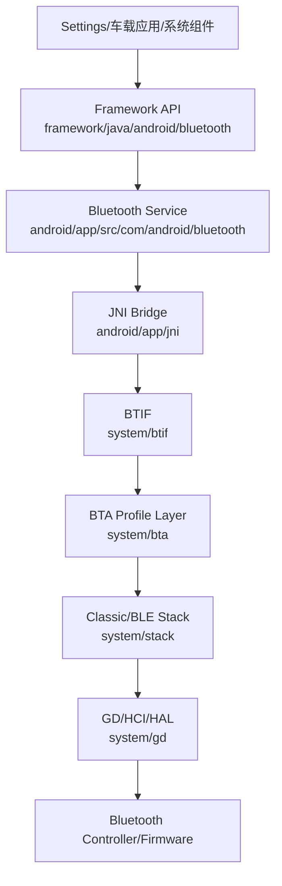
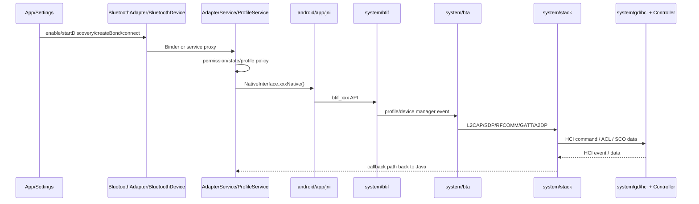

# 00. Android 16 车载蓝牙源码学习总览

## 1. 这一章要解决什么

读完本章后，你应该能回答三个问题：

- Android 蓝牙从 App API 到 Native 协议栈大致分几层。
- 当前仓库中每一层应该从哪些目录开始读。
- 遇到“车机蓝牙打不开、搜不到设备、配对失败、音乐无声、电话无声、BLE 外设连不上”时，第一眼应该去哪些源码入口找线索。

## 2. 前置知识

建议先粗略了解：

- Android Binder：App 调用系统服务时跨进程通信。
- Android Service/Handler/StateMachine：蓝牙服务大量使用状态机处理异步事件。
- JNI：Java/Kotlin 调 C++ 的桥。
- C++ 基础：函数、类、指针/引用、锁、回调。
- 蓝牙基础名词：Adapter、Device、Profile、HCI、ACL、SCO、GATT、A2DP、AVRCP、HFP。

## 3. 当前仓库怎么分层



把它类比成车机音响系统：

- Framework API 像中控屏上的按钮和菜单。
- Bluetooth Service 像车机主控逻辑，决定什么时候开关、搜索、配对、连接哪个 Profile。
- JNI 像线束转接头，把 Java 世界和 C++ 世界接起来。
- BTIF/BTA/Stack 像蓝牙协议的执行机构。
- HCI/HAL/Controller 像真正发射无线信号的硬件通道。

## 4. 第一批源码入口

### 4.1 蓝牙开关

从 API 层看，`BluetoothAdapter.enable()` 是入口：

```java
// framework/java/android/bluetooth/BluetoothAdapter.java
1588 @RequiresLegacyBluetoothAdminPermission
1591 public boolean enable() {
1592     if (isEnabled()) {
1593         Log.d(TAG, "enable(): BT already enabled!");
1594         return true;
1595     }
1602     try {
1603         return mManagerService.enable(mAttributionSource);
1604     } catch (RemoteException e) {
1605         throw e.rethrowFromSystemServer();
1606     }
}
```

这段代码的重点不是“怎么打开硬件”，而是告诉你 API 首先会走到 manager/service 边界。当前仓库重点从 `AdapterService` 继续读：

```java
// android/app/src/com/android/bluetooth/btservice/AdapterService.java
1168 mScanController =
1169         new ScanController(
1170                 this,
1171                 mScanNativeInterface,
1172                 mPeriodicScanNativeInterface,
1173                 mCompanionDeviceManager);
1174 mNativeInterface.enable();
```

这里 `mNativeInterface.enable()` 开始跨入 JNI/Native。后续章节会继续追到 `android/app/jni/com_android_bluetooth_btservice_AdapterService.cpp` 和 `system/btif/src/bluetooth.cc`。

### 4.2 扫描

```java
// framework/java/android/bluetooth/BluetoothAdapter.java
1988 public boolean startDiscovery() {
1989     if (getState() != STATE_ON) {
1990         return false;
1991     }
1992     return callServiceIfEnabled(s -> s.startDiscovery(mAttributionSource), false);
1993 }
```

进入 `AdapterService.startDiscovery()` 后，第一件重要的事是权限判断。车载开发里“搜不到设备”经常不是 Controller 没扫到，而是调用方权限、定位声明、扫描策略先被挡住：

```java
// android/app/src/com/android/bluetooth/btservice/AdapterService.java
2703 boolean startDiscovery(AttributionSource source) {
2705     Log.d(TAG, "startDiscovery");
2707     mAppOps.checkPackage(Binder.getCallingUid(), callingPackage);
2717     if (isQApp) {
2718         if (!Utils.checkCallerHasFineLocation(this, source, callingUser)) {
2719             return false;
2720         }
2721         permission = android.Manifest.permission.ACCESS_FINE_LOCATION;
2722     }
2734     return mNativeInterface.startDiscovery();
}
```

### 4.3 配对

配对入口在 `BluetoothDevice.createBond()`，然后进入 `AdapterService.createBond()`。这里有一个很实用的观察点：配对前会取消扫描，因为扫描期间配对不稳定。

```java
// android/app/src/com/android/bluetooth/btservice/AdapterService.java
2818 boolean createBond(
2819         BluetoothDevice device,
2820         int transport,
2821         OobData remoteP192Data,
2822         OobData remoteP256Data,
2823         String callingPackage) {
2830     if (!isEnabled()) {
2831         Log.e(TAG, "Impossible to call createBond when Bluetooth is not enabled");
2832         return false;
2833     }
2845     // Pairing is unreliable while scanning, so cancel discovery
2846     // Note, remove this when native stack improves
2847     mNativeInterface.cancelDiscovery();
}
```

调试配对失败时，这段逻辑提醒我们要同时看：

- 调用方包名和权限是否通过。
- 当前蓝牙是否 `STATE_ON`。
- 是否仍在 discovery。
- `BondStateMachine` 是否收到并推进配对消息。
- Native `btif_dm` 是否收到 pairing/bonding 事件。

### 4.4 A2DP 音乐连接

A2DP Java Service 的连接入口在 `android/app/src/com/android/bluetooth/a2dp/A2dpService.java`。继续向下会到 JNI：

```cpp
// android/app/jni/com_android_bluetooth_a2dp.cpp
408 static jboolean connectA2dpNative(JNIEnv* env, jobject /* object */, jbyteArray address) {
409   std::shared_lock<std::shared_timed_mutex> lock(interface_mutex);
416   RawAddress bd_addr = RawAddress::FromOctets(reinterpret_cast<const uint8_t*>(addr));
419   bt_status_t status = btif_av_source_connect(bd_addr);
423   env->ReleaseByteArrayElements(address, addr, 0);
424   return (status == BT_STATUS_SUCCESS) ? JNI_TRUE : JNI_FALSE;
}
```

这段 C++ 涉及几个蓝牙源码常见模式：

- `std::shared_lock`：读锁，允许多个读者并发访问接口对象。
- `RawAddress`：Native 层蓝牙地址类型。
- `reinterpret_cast`：把 Java byte array 拿到的内存按 `uint8_t*` 解释。
- `bt_status_t`：Native 蓝牙接口常用返回码。

JNI 方法通过表注册给 Java：

```cpp
// android/app/jni/com_android_bluetooth_a2dp.cpp
507 int register_com_android_bluetooth_a2dp(JNIEnv* env) {
508   const JNINativeMethod methods[] = {
516           {"connectA2dpNative", "([B)Z", (void*)connectA2dpNative},
517           {"disconnectA2dpNative", "([B)Z", (void*)disconnectA2dpNative},
518           {"setSilenceDeviceNative", "([BZ)Z", (void*)setSilenceDeviceNative},
```

## 5. 总体调用链地图



## 6. 推荐阅读顺序

1. 先读 `framework/java/android/bluetooth/BluetoothAdapter.java`，只看 `enable()`、`disable()`、`startDiscovery()`。
2. 再读 `framework/java/android/bluetooth/BluetoothDevice.java`，只看 `createBond()`、`connect()`、`connectGatt()`。
3. 进入 `android/app/src/com/android/bluetooth/btservice/AdapterService.java`，重点看开关、扫描、配对。
4. 选一个 Profile 深入。车载音乐优先 `a2dp` + `avrcp`，车载电话优先 `hfpclient`，AIoT 优先 `gatt` + `le_scan`。
5. 每看到一个 `NativeInterface`，立刻去 `android/app/jni` 找同名 native 方法。
6. JNI 之后再追 `system/btif`，最后进入 `system/bta` 和 `system/stack`。

## 7. 本章练习

- 用 `rg -n "startDiscovery\\("` 找出 Java 和 Native 层所有扫描入口。
- 用 `rg -n "connectA2dpNative|btif_av_source_connect"` 追 A2DP 连接从 JNI 到 BTIF 的第一跳。
- 打开 `BondStateMachine.java`，找到配对成功和失败分别由哪些消息驱动。

