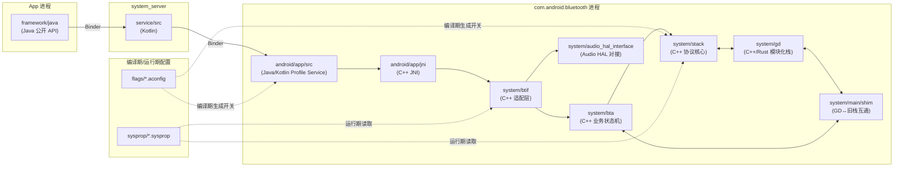

# 00.2 当前仓库目录与模块职责

> 速通摘要：本仓库不是一份"普通源码"，而是 **AOSP `packages/modules/Bluetooth`** 的本地切片，按"语言 + 角色"组织：`framework/` 是 Java API，`service/` 是 Kotlin 系统服务，`android/app/` 是蓝牙 App（含 JNI），`system/` 是 C++ 协议栈，`flags/`/`sysprop/` 是配置开关。**读懂目录 = 读懂职责边界。**

---

## 1. 学习目标

读完本节，你应该能：

1. 对每个一级目录回答三个问题：跑在什么进程？用什么语言？解决什么问题？
2. 拿到一个文件路径就知道它属于哪一层楼（对照 00.1 的七层模型）。
3. 知道哪些目录是"读源码"的高价值入口，哪些是"看一眼就跳过"的辅助。
4. 理解 aconfig flag 与 sysprop 对蓝牙行为的影响。

---

## 2. 前置知识

- 已读 [`00.1 Android 蓝牙分层架构总览`](00.1_Android蓝牙分层架构总览.md)。
- 知道 Android 的 Mainline 模块（可空中升级的系统模块）概念。本仓库就是一个 Mainline 模块。

---

## 3. 场景故事：你被指派改一个 A2DP 卡顿问题

经理说："上车之后蓝牙音乐偶尔卡顿，你看看。"
你的第一反应应该是——**这个问题可能横跨好几层，我得知道每层在哪个目录**：

- 上层 App 投递音频？看 `framework/java/...` 公开 API。
- 蓝牙 App 的 A2DP Service？看 `android/app/src/com/android/bluetooth/a2dp/`。
- A2DP 编码与发送？看 `system/btif/src/btif_a2dp_source.cc` 和 `system/stack/a2dp/`。
- 音频路由到 HAL？看 `system/audio_hal_interface/a2dp_encoding.cc`。
- 是不是某个 flag 关掉了 Offload？看 `flags/a2dp.aconfig`。

你不需要立刻读这些文件——但你必须**知道它们存在**。这就是本节的目的。

---

## 4. 分层调用链（按目录回看七层楼）



---

## 5. 一级目录逐个看

### 5.1 `framework/` — Framework Java API
- **进程**：随调用方 App。
- **语言**：Java。
- **职责**：公开 / SystemApi / HiddenApi 三类 API。把 Java 调用打包成 Binder。
- **核心子目录**：
  - `framework/java/android/bluetooth/` — Classic API 集合
    - 总控：`BluetoothAdapter.java`、`BluetoothDevice.java`、`BluetoothManager.java`、`BluetoothProfile.java`
    - Classic Profile：`BluetoothA2dp.java`、`BluetoothHeadset.java`、`BluetoothHeadsetClient.java`、`BluetoothHidHost.java`、`BluetoothHidDevice.java`、`BluetoothPan.java`、`BluetoothPbap.java`、`BluetoothPbapClient.java`、`BluetoothMap.java`、`BluetoothMapClient.java`、`BluetoothSap.java`、`BluetoothAvrcp*.java`
    - BLE / GATT：`BluetoothGatt.java`、`BluetoothGattServer.java`、`BluetoothGattService.java`、`BluetoothGattCharacteristic.java`、`BluetoothGattDescriptor.java`、`BluetoothGattCallback.java`
    - LE Audio / 辅听：`BluetoothLeAudio.java`、`BluetoothHearingAid.java`、`BluetoothHapClient.java`、`BluetoothCsipSetCoordinator.java`
  - `framework/java/android/bluetooth/le/` — BLE 扫描与广播 API（`BluetoothLeScanner`、`BluetoothLeAdvertiser`、`ScanFilter` 等）。
- **辅助文件**（看一眼就好）：
  - `BluetoothAssignedNumbers.java` — 蓝牙 SIG 分配的 16-bit UUID 常量。
  - `BluetoothFrameworkInitializer.java` — 系统服务注册回调点（Mainline 模块向 system_server 注册自己的 ServiceManager 项）。
  - `Attributable.java`、`AttributionSource` 相关 — 权限上下文追踪。

### 5.2 `service/` — BluetoothManagerService（Kotlin / system_server）
- **进程**：`system_server`。
- **语言**：Kotlin。
- **职责**：策略守门员 + 蓝牙 App 进程生命周期管理。
- **关键文件**（按职责）：
  - 主体：`service/src/BluetoothService.kt`、`service/src/BluetoothComponent.kt`
  - 与 `AdapterService` 对接：`service/src/AdapterBinder.kt`、`service/src/BluetoothManagerServiceApi.kt`
  - 开关状态：`service/src/AdapterState.kt`
  - 监管进程：`service/src/BluetoothSupervisor.kt`、`service/src/ServiceMessenger.kt`
  - 权限与策略：`service/src/PermissionChecker.kt`、`service/src/BluetoothRestriction.kt`、`service/src/SharingRestriction.kt`、`service/src/RolePermissionListener.kt`
  - 周边联动：`service/src/airplane/`（飞行模式）、`service/src/satellite/`（卫星）、`service/src/RadioModeListener.kt`
  - 自启动 / Auto-On：`service/src/AutoOn.kt`
  - 调试：`service/src/ActiveLogs.kt`、`service/src/Log.kt`、`service/src/ShellCommand.kt`

### 5.3 `android/app/` — 蓝牙 App（`com.android.bluetooth`）
这是本仓库最"重"的部分。蓝牙 App 进程里跑着所有 Profile Service 与全部 Native 栈。

#### 5.3.1 `android/app/src/com/android/bluetooth/btservice/` — 中枢
- `AdapterService.java`（5030 行）— 总管。
- `AdapterServiceBinder.java` — `IBluetooth` AIDL 实现。
- `AdapterNativeInterface.java` — Java→Native 出口。
- `JniCallbacks.java` — Native→Java 入口。
- `AdapterProperties.java` — 名称 / 地址 / scan_mode / class_of_device 等。
- `AdapterState.java` — 顶层开关状态机（OFF / TURNING_ON / ON / TURNING_OFF）。
- `BondStateMachine.java` — 配对状态机。
- `RemoteDevices.java` — 已知设备表。
- `PhonePolicy.java` — 自动连接策略（车机里非常重要）。
- `ActiveDeviceManager.java` — 多点连接活动设备选择（车机两台手机场景）。
- `CompanionManager.java` — Companion Device 关联。
- `SilenceDeviceManager.java` — 静音设备管理。
- `MetricsLogger.java` — 统计上报。
- `Config.java` — Profile 开关编排。

#### 5.3.2 各 Profile Service 子目录
| 目录 | 角色 | 车载相关度 |
|------|------|-----------|
| `a2dp/` | A2DP Source（车机做手机的音箱） | ★★★ |
| `a2dpsink/` | A2DP Sink（车机直接收手机音流） | ★★★ |
| `avrcp/` | AVRCP Target（车机播给手机看） | ★★ |
| `avrcpcontroller/` | AVRCP Controller（车机控制手机播放） | ★★★ |
| `hfp/` | HFP AG（车机做电话） | ★★★ |
| `hfpclient/` | HFP Client / HF（车机做免提 HF） | ★★★ |
| `gatt/` | GATT 客户/服务器 | ★★★ |
| `le_scan/` | BLE 扫描 | ★★★ |
| `le_audio/` | LE Audio（Auracast、TMAP 等） | ★★ |
| `bass_client/` | Broadcast Audio Scan Service Client | ★ |
| `bas/` | Battery Service | ★ |
| `csip/` | CSIP（CSIS Set Coordinator） | ★★ |
| `hap/` | Hearing Access Profile | ★ |
| `hearingaid/` | ASHA 助听器 | ★ |
| `hid/` | HID Host / Device | ★ |
| `map/` | MAP（车机看短信） | ★★ |
| `mapclient/` | MAP Client | ★★ |
| `mcp/` | Media Control Profile（LE Audio 控制） | ★★ |
| `opp/` | OPP（文件传输，车机几乎不用） | ★ |
| `pan/` | PAN（蓝牙网络共享） | ★ |
| `pbap/` | PBAP（车机看电话簿） | ★★★ |
| `pbapclient/` | PBAP Client | ★★★ |
| `sap/` | SAP（SIM Access，欧洲车较多） | ★ |
| `sdp/` | SDP Manager | ★★ |
| `tbs/` | Telephone Bearer Service | ★★ |
| `vc/` | Volume Control（LE Audio） | ★★ |
| `content_profiles/` | OPP/MAP 共用的内容相关 | ★ |
| `notification/` | 通知 | ★ |

#### 5.3.3 `android/app/jni/` — JNI 桥接
- 每个 Profile 一个 `.cpp`，命名形如 `com_android_bluetooth_<profile>.cpp`。
- 中枢：`com_android_bluetooth_btservice_AdapterService.cpp`。
- 共享头：`com_android_bluetooth.h`。

#### 5.3.4 `android/app/` 其他子目录
- `android/app/aidl/` — AIDL 文件（IBluetooth、IBluetoothA2dp 等）。
- `android/app/res/` — 资源（字符串、图标）。
- `android/app/sap/`、`android/app/lib/` 等 — 辅助代码。

### 5.4 `system/` — Native 协议栈大本营

| 子目录 | 角色 | 何时进去看 |
|--------|------|-----------|
| `system/btif` | BTIF 适配层 | 跟踪某 Profile 从 JNI 进栈的第一步 |
| `system/bta` | BTA 业务状态机 | 排查 Profile 状态切换异常 |
| `system/stack` | Stack 协议核心 | 排查 L2CAP/SDP/RFCOMM/GATT/SMP/AVDT 等协议层问题 |
| `system/gd` | GD 模块化栈 | 排查 HCI/HAL/Metrics/Storage |
| `system/main` | 启动入口与 shim | 想看蓝牙栈如何初始化 |
| `system/hci` | 旧 HCI 调度层 | 排查 HCI Command/Event 时序 |
| `system/audio_hal_interface` | 与 Audio HAL 对接 | A2DP/HFP/LE Audio Offload 排查 |
| `system/btcore` | 基础工具（state、property、osi 桥） | 一般跳过 |
| `system/osi` | OS 抽象（log、定时器、property） | 排查日志/定时器 |
| `system/log` | 日志门面 | 调试 |
| `system/metrics` | 指标 | 通常跳过 |
| `system/device` | 设备信息工具 | 通常跳过 |
| `system/embdrv` | 嵌入式 SBC/G722/CVSD 软件编解码 | A2DP/HFP 软件路径 |
| `system/packet` | Packet 处理 | 通常跳过 |
| `system/main` | 启动入口 | 重要 |
| `system/internal_include`、`system/include` | 跨层头文件 | 查接口定义 |
| `system/profile/avrcp` | AVRCP 代码（注意：与 `system/stack/avrc/` 区分） | AVRCP 深度排查 |
| `system/rust` | 部分 Rust 实现（GD 内） | LE Audio / floss |
| `system/tools` | 工具脚本 | 跳过 |
| `system/types` | 公共类型 | 跳过 |
| `system/audio` / `system/audio_bluetooth_hw` | Audio HW 适配 | A2DP Offload |
| `system/conf` | 默认配置文件（如 `bt_did.conf`、`bt_stack.conf`） | 排查配置加载 |
| `system/doc` | Google 自带的少量文档 | 偶尔参考 |
| `system/pdl` | Packet 定义语言（生成 packet 代码） | 一般跳过 |
| `system/blueberry` | 测试相关 | 跳过 |
| `system/udrv` | 用户态驱动相关 | 跳过 |

### 5.5 `flags/` — aconfig 编译期开关
- **作用**：每个 `.aconfig` 文件声明一组 flag，构建时生成 `BluetoothFlags`（Java 端）与 `bluetooth::flags::*`（C++ 端）。
- **影响**：很多新功能、bug fix 走 flag 灰度。flag 默认值决定了你看到的"行为"。
- **重要文件**（节选）：
  - `flags/adapter.aconfig` — Adapter 层 flag
  - `flags/a2dp.aconfig`、`flags/avrcp.aconfig`、`flags/leaudio.aconfig`
  - `flags/bta_dm.aconfig`、`flags/btif_dm.aconfig` — 配对/扫描相关
  - `flags/btm_ble.aconfig` — BLE 安全
  - `flags/connectivity.aconfig` — 连接策略
  - `flags/auto_on.aconfig` — 自动开启
  - `flags/socket.aconfig` — RFCOMM/L2CAP socket
  - `flags/le_audio_base.aconfig`
  - `flags/dis.aconfig`、`flags/active_device_manager.aconfig`

> 在文档里**凡是写到"这个行为受 flag 控制"，必须给出 flag 名**——参考 `doc/需求.md §1.3`。

### 5.6 `sysprop/` — 运行期属性
- **作用**：声明 `bluetooth.*` 命名空间下的系统属性，运行时可在 `bt_stack.conf` 或 `setprop` 修改。
- **重要文件**：
  - `sysprop/a2dp.sysprop`、`sysprop/avrcp.sysprop`
  - `sysprop/ble.sysprop`
  - `sysprop/bta.sysprop`
  - `sysprop/core.sysprop` — 全栈核心属性
  - `sysprop/hci.sysprop`、`sysprop/hardware.sysprop`、`sysprop/gap.sysprop`
  - `sysprop/device_id.sysprop` — DID
  - `sysprop/exported_include/` — 给上层的导出头

### 5.7 `framework/`、`service/`、`android/`、`system/`、`flags/`、`sysprop/` 之外
仓库根还有 `README.md`、`doc/`（你正在读的资料就放这里）等。

---

## 6. 源码导读（按"工作任务"反查目录）

下表把常见任务映射到目录，作为反向索引：

| 任务 | 你要进的目录 |
|------|-------------|
| 加一个新的 Java API | `framework/java/android/bluetooth/` |
| 改 Profile Service 自动连接策略 | `android/app/src/com/android/bluetooth/btservice/PhonePolicy.java` |
| 改 A2DP 编码器选择 | `system/btif/src/btif_a2dp_source.cc` + `system/stack/a2dp/` + `flags/a2dp.aconfig` |
| 改 HFP AT 命令解析 | `system/bta/ag/`、`system/bta/hf_client/` |
| 改 GATT 服务发现 | `android/app/src/com/android/bluetooth/gatt/` + `system/bta/gatt/` + `system/stack/gatt/` |
| 排查配对失败 | `BondStateMachine.java` + `system/btif/src/btif_dm.cc` + `system/bta/dm/bta_dm_act.cc` + `system/stack/btm/btm_sec.cc`、`system/stack/smp/` |
| 排查 BLE 扫描频率 / 占空比 | `android/app/src/com/android/bluetooth/le_scan/` + `system/stack/btm/btm_ble_scanner.cc` |
| 与 Audio HAL 联调 A2DP Offload | `system/audio_hal_interface/a2dp_encoding.cc` |
| 抓 HCI 包 / 改 btsnoop 位置 | `sysprop/hci.sysprop` + `system/gd/hal/` |
| 调日志开关 | `system/osi`、`flags/log_redaction*.aconfig`（如有） + `setprop log.tag.*` |

---

## 7. 简化代码片段（Profile 启动落点）

下面通过一段示意代码理解"目录 → 文件 → 函数"的递进。当你 enable A2DP Source Profile 时，调用从 Java 进入 Native，依次经过：

```text
android/app/src/com/android/bluetooth/a2dp/A2dpService.java        ← Java Service
android/app/src/com/android/bluetooth/a2dp/A2dpNativeInterface.java ← native 接口
android/app/jni/com_android_bluetooth_a2dp.cpp                      ← JNI 入口
system/btif/src/btif_av.cc / btif_a2dp_source.cc                    ← BTIF 编排
system/bta/av/bta_av_main.cc                                        ← BTA 业务状态机
system/stack/avdt/avdt_msg.cc / system/stack/a2dp/a2dp_codec_config.cc ← Stack 协议
system/audio_hal_interface/a2dp_encoding.cc                         ← 与 Audio HAL 协商
```

记住：**目录顺序就是数据流方向**。无论查 bug 还是加 feature，这条"目录通道"都不会变。

---

## 8. 调试方法

| 想看什么 | 方法 |
|----------|------|
| 哪些 Profile 被编进当前镜像 | `adb shell dumpsys bluetooth_manager \| grep -E "Profile|Service"` |
| 当前 flag 值 | `adb shell device_config get bluetooth <flag_name>`（aconfig 有 device_config 通道时） |
| 当前 sysprop 值 | `adb shell getprop \| grep ^bluetooth.` |
| 进程内存中 Adapter 状态 | `dumpsys bluetooth_manager` 全段 |
| 验证某文件被链接进了 `libbluetooth_jni.so` | `adb shell ls /apex/com.android.btservices/lib*/`，看 so 列表 |

---

## 9. FAQ

**Q1：为什么 `framework/` 这一层文件都不超过几百行？**
A：它的工作只有"打包参数 + Binder 转发 + 权限注解"。真业务都在 `system_server` 端的 `BluetoothManagerService` 和蓝牙 App 端的 `AdapterService`。

**Q2：`android/app/src/com/android/bluetooth/avrcp/` 与 `system/profile/avrcp/` 是什么关系？**
A：前者是 Java 实现的 AVRCP 1.6（Target），后者是 Native 端配合的实现（包括 Browse、Cover Art 等）。两者通过 `AvrcpNativeInterface` + JNI 配合。这是 AOSP 历史演进留下的双实现，文档里我们会显式区分。

**Q3：为什么有 `system/main/shim/` 这层？**
A：GD 与传统 Stack 在 Android 11 起共存。`shim/` 是两边互调的"翻译官"：GD 想用 L2CAP 时调 shim，shim 再调旧 Stack；反过来旧 Stack 想用 HCI 也走 shim 到 GD。

**Q4：`flags/*.aconfig` 是怎么生效的？**
A：构建时由 aconfig 工具读 `.aconfig` 文件，生成 Java/C++ 头文件，源码里以 `Flags.xxx()`（Java）或 `bluetooth::flags::xxx()`（C++）使用。运行时可通过 `device_config` 覆盖（如果 flag 标 `is_fixed_read_only: false`）。

**Q5：`sysprop/` 与 `flags/` 怎么选？**
A：粗略：**结构性 / 编译期开关用 aconfig，运行时调参 / 厂商定制用 sysprop**。比如"启用 LE Audio"曾是 aconfig，而"BTSnoop 日志路径"是 sysprop。

---

## 10. 上路任务

### 任务 A：把"七层楼"映射回目录
合上文档，自己默写一遍："Framework Java API 在哪个目录？BluetoothManagerService 在哪个目录？……"
默写完和 §5 对一下，差几个？

### 任务 B：找到一个 flag 在源码里的使用点
```bash
# 任选一个 flag 名，比如 leaudio_broadcast_destination_mode
grep -rn "leaudio_broadcast_destination_mode" --include="*.java" --include="*.cc" --include="*.h" --include="*.kt" .
```
看一眼这个 flag 在 Java/C++ 里是怎么读的，体会"配置驱动行为"。

### 任务 C：写一个目录速查卡
把第 5 节的表格抄到你自己的笔记本（纸质或电子皆可），三天后不看本节默写一遍。这张表后面调试时会反复用到。

---

## 11. 本节小结（速记卡）

```
framework/   → Java 公开 API（随调用方 App 进程）
service/     → Kotlin BluetoothManagerService（system_server 进程）
android/app/ → 蓝牙 App（com.android.bluetooth 进程）
  ├── src/   → Java/Kotlin Profile Service
  └── jni/   → C++ JNI 桥接
system/      → C++ 协议栈（同 com.android.bluetooth 进程）
  ├── btif/  → 适配层
  ├── bta/   → 业务状态机
  ├── stack/ → 协议核心
  ├── gd/    → 模块化新栈
  ├── main/shim/ → GD↔旧栈互通
  └── audio_hal_interface/ → Audio HAL 对接
flags/       → aconfig 编译期开关
sysprop/     → 运行期系统属性
```
