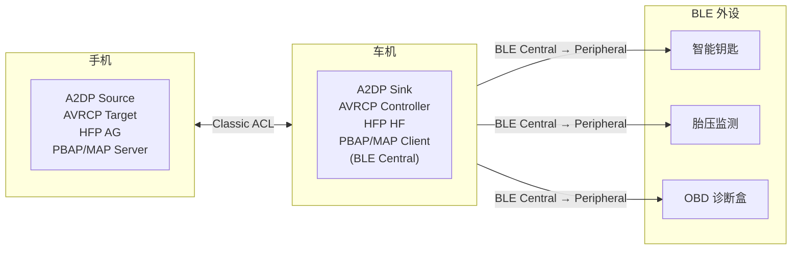

# 00.3 车载场景全景与术语速查

> 速通摘要：**车机蓝牙不是手机蓝牙加个屏幕**。车机要同时扮演多种角色：做手机的免提（HFP HF / A2DP Sink）、做钥匙/胎压等的网关（BLE Central）、做手机互联的副链路（RFCOMM/BLE）；还要在 IG-ON、ACC、关电这些奇特电源态下稳定工作。本节把车上"看得见的现象"映射到"协议名词"，把"协议名词"映射到"源码模块"。

---

## 1. 学习目标

读完本节，你应该能：

1. 听到"绝对音量同步坏了"立刻知道是 **AVRCP** 的 `SetAbsoluteVolume` 出问题。
2. 听到"打电话车里没声音"先想到 **SCO** 没建立。
3. 听到"钥匙连不上"先想到 **BLE GATT 连接** 或者**配对掉了**。
4. 看到"HCI_Inquiry_Result"、"L2CAP_Config_Req"、"GATT MTU=23" 不再陌生。

---

## 2. 前置知识

- 已读 [`00.1 Android 蓝牙分层架构总览`](00.1_Android蓝牙分层架构总览.md) 与 [`00.2 当前仓库目录与模块职责`](00.2_当前仓库目录与模块职责.md)。
- 知道蓝牙分 **Classic（BR/EDR）** 和 **BLE（低功耗）** 两个体系（详见下文 §4）。

---

## 3. 场景故事：早高峰一次完整通勤里发生了多少蓝牙事件

| 时间 | 现象 | 背后涉及的协议 / Profile |
|------|------|------------------------|
| 07:30 上车，按启动按钮 | 蓝牙自动开启 | `AutoOn`、`BluetoothManagerService` |
| 07:30:02 | 手机自动连上车机 | ACL 重连 + A2DP/HFP/PBAP/MAP/AVRCP **多 Profile 自动连接**（`PhonePolicy`） |
| 07:30:05 | 通讯录同步进度条 | **PBAP** (Phone Book Access Profile) |
| 07:30:10 | 车机收到老婆的微信"路上小心"通知 | **MAP** (Message Access Profile) |
| 07:32 | 你打开网易云音乐 | **A2DP** Source（手机）→ Sink（车机） |
| 07:32:01 | 车机方向盘按下"+"音量 | **AVRCP** Controller → Target，**绝对音量同步** |
| 07:40 | 同事打来电话 | **HFP** Audio Gateway（手机）↔ Hands-Free（车机）；A2DP **音频被挂起**；**SCO** 建立用于通话音频 |
| 07:42 | 通话结束 | SCO 释放、A2DP 恢复 |
| 07:45 | BLE 胎压监测器开始上报 | **BLE GATT** Notify |
| 07:50 | 你掏出手机做 Apple/华为 等 CarLink/HiCar/CarPlay | 各种"互联协议"，**蓝牙在其中通常做配对触发与控制信道**（见 09 章） |
| 07:55 | 下车，关电 | 蓝牙保留绑定信息、记录最近活动设备 |

**你将来要处理的每一个 bug，几乎都能映射到上表的某一行。**

---

## 4. 蓝牙两大体系（Classic vs BLE）

| 维度 | Classic (BR/EDR) | BLE (Low Energy) |
|------|------------------|------------------|
| 物理层 | GFSK + π/4-DQPSK + 8DPSK | GFSK |
| 设计目标 | 大数据量、可流式（音频） | 低功耗、低数据量、间歇通信 |
| 设备发现 | **Inquiry** | **Advertising / Scan** |
| 连接前广播 | 不需要 | 必须先广播（Advertising） |
| 安全 | **Legacy / SSP**（Stack: `system/stack/btm/`） | **SMP**（Stack: `system/stack/smp/`） |
| 多路复用 | L2CAP | L2CAP（精简版） + ATT/GATT |
| 上层协议 | RFCOMM、SDP、AVCTP、AVDTP… | GATT、L2CAP CoC |
| 典型 Profile | A2DP、HFP、HID、PAN、PBAP、MAP | GATT 自定义服务、HOGP（BLE HID） |
| 角色 | Master/Slave（已改名 Central/Peripheral） | Central/Peripheral / Broadcaster/Observer |
| 车机角色 | 通常做 Sink/HF（被动） | 通常做 Central（主动） |

> 一句话：**手机音乐/电话走 Classic，钥匙/胎压/手环走 BLE。** 车机两边都要做。

---

## 5. 必背术语字典（按字母排序）

| 术语 | 全称 | 一句话解释 | 在源码哪里 |
|------|------|------------|-----------|
| **ACL** | Asynchronous Connection-Less | 用来承载非语音数据的链路（包括 SDP、RFCOMM、L2CAP 上面的一切） | `system/stack/acl/` |
| **AT 命令** | "AT" 是电话本体年代的前缀 | HFP 用纯文本命令交互（`AT+CIND?`、`+CIEV: 2,1` 等） | `system/bta/ag/`、`system/bta/hf_client/` |
| **AVCTP** | Audio/Video Control Transport Protocol | AVRCP 底层承载协议 | `system/stack/avct/` |
| **AVDTP** | Audio/Video Distribution Transport Protocol | A2DP 底层承载协议 | `system/stack/avdt/` |
| **AVRCP** | Audio/Video Remote Control Profile | 蓝牙音乐遥控（暂停、上下首、音量） | `system/stack/avrc/` + `system/profile/avrcp/` + `android/app/.../avrcp/` |
| **A2DP** | Advanced Audio Distribution Profile | 立体声音乐流 | `system/stack/a2dp/` + `system/btif/src/btif_a2dp_*.cc` |
| **ATT** | Attribute Protocol | BLE 上"属性读写"的最底层协议 | `system/stack/gatt/` |
| **BLE** | Bluetooth Low Energy | 见 §4 | 全栈，但显著在 `btm_ble*`、`smp`、`gatt` |
| **BR/EDR** | Basic Rate / Enhanced Data Rate | "Classic" 蓝牙的传输模式 | 同上 |
| **BTSnoop** | Bluetooth Sniffer Output | Android 抓 HCI 层完整通信的二进制日志 | `system/gd/hci/` + `sysprop/hci.sysprop` |
| **CoC** | Connection-oriented Channel | L2CAP 的面向连接通道（BLE 数据流常用） | `system/stack/l2cap/` |
| **CoD** | Class of Device | 24-bit 设备类型，决定 UI 显示的图标 | `framework/.../BluetoothClass.java`、`system/stack/btm/` |
| **CSIP / CSIS** | Coordinated Set Identification Profile/Service | LE Audio 把多个设备协调为一组（左右耳机） | `android/app/.../csip/` + `system/bta/csis/` |
| **EATT** | Enhanced ATT | ATT 的多通道并发版（Android 12+） | `system/stack/eatt/` |
| **eSCO** | Extended SCO | 比 SCO 更可靠、带重传的语音通道 | `system/stack/btm/` |
| **GAP** | Generic Access Profile | 设备发现、连接、配对的"通用规则" | `system/stack/gap/` |
| **GATT** | Generic Attribute Profile | BLE 上层数据模型（Service / Characteristic / Descriptor） | `system/stack/gatt/` + `system/bta/gatt/` |
| **HCI** | Host Controller Interface | Host 与蓝牙芯片之间的命令/事件协议 | `system/gd/hci/` + `system/hci/` |
| **HF / HFP** | Hands-Free (Profile) | 蓝牙免提电话；车机端通常是 HF（Client） | `system/bta/hf_client/` + `system/btif/src/btif_hf_client.cc` |
| **HID** | Human Interface Device | 蓝牙键鼠/方向盘按键 | `system/bta/hh/`、`system/bta/hd/` |
| **L2CAP** | Logical Link Control & Adaptation Protocol | "多路复用" + "MTU 协商"，承载几乎所有上层协议 | `system/stack/l2cap/` |
| **LE Audio** | 低功耗音频（Auracast / TMAP 等总称） | 低功耗蓝牙的下一代音频标准 | `system/bta/le_audio/` + `android/app/.../le_audio/` |
| **MAP** | Message Access Profile | 短信同步 | `android/app/.../map/`、`mapclient/` |
| **MTU** | Maximum Transmission Unit | 单包能塞多少字节；ATT 默认 23 | `system/stack/gatt/` |
| **OBEX** | Object Exchange | PBAP/MAP/OPP 共用的文件/对象交换 | `android/app/...` 含多个 OBEX 实现 |
| **PAN** | Personal Area Networking | 蓝牙做"网卡" | `system/bta/pan/`、`system/stack/pan/` |
| **PBAP** | Phone Book Access Profile | 通讯录同步 | `android/app/.../pbap/`、`pbapclient/` |
| **RFCOMM** | RF Communication | 在 L2CAP 上模拟串口（HFP/PBAP/MAP/SAP 都用） | `system/stack/rfcomm/` |
| **SCO** | Synchronous Connection-Oriented | 蓝牙语音通道（HFP 通话音频） | `system/stack/btm/btm_sco*.cc` |
| **SDP** | Service Discovery Protocol | Classic 服务发现 | `system/stack/sdp/` + `system/bta/sdp/` |
| **SMP** | Security Manager Protocol | BLE 配对/加密协议 | `system/stack/smp/` |
| **SSP** | Secure Simple Pairing | Classic 现代配对（数字配对、Just Works、Passkey） | `system/stack/btm/btm_sec.cc` |
| **TBS** | Telephone Bearer Service | LE Audio 电话控制 | `system/bta/` 相关 + `android/app/.../tbs/` |
| **UUID** | 通用唯一标识 | 蓝牙世界用 16/32/128-bit UUID 来表示服务/特征 | `framework/.../ParcelUuid.java` 等 |
| **VCP / VCS** | Volume Control Profile/Service | LE Audio 音量控制 | `android/app/.../vc/` |
| **Whitelist / FAL** | Filter Accept List | 控制器侧的"白名单"，决定接受谁的广播/连接 | `system/stack/btm/btm_ble_*` |

> 完整 SIG 术语见 Bluetooth Core Spec；上表只挑车载常用。

---

## 6. 车载典型角色分配



**重要差异**：
- **手机互联（HiCar/CarLink/CarPlay）**：手机端通常仍是"主动方"，车机做"应答方"；并且这些协议跑在 **Wi-Fi Direct** 上，蓝牙只是辅助链路（详见 09 章）。
- **车载工厂模式 / 经销商模式**：可能要求车机做 A2DP Source、HFP AG，方向反过来——本仓库的代码都支持，只是默认配置不一定开启。

---

## 7. 源码导读：从术语反查关键入口

| 术语 | 关键入口（第一个看的文件） |
|------|---------------------------|
| Adapter（开关、地址、扫描模式） | `framework/java/android/bluetooth/BluetoothAdapter.java` + `android/app/.../btservice/AdapterService.java` |
| Inquiry / Page / SDP | `system/bta/dm/bta_dm_device_search.cc`、`system/stack/btm/` |
| Bond / SSP / SMP | `android/app/.../btservice/BondStateMachine.java` + `system/stack/btm/btm_sec.cc` + `system/stack/smp/` |
| L2CAP 通道 | `system/stack/l2cap/l2c_main.cc`、`l2c_link.cc` |
| RFCOMM | `system/stack/rfcomm/rfc_l2cap_if.cc`、`port_api.cc` |
| A2DP 编解码 | `system/stack/a2dp/a2dp_codec_config.cc`、`a2dp_aac.cc` 等 |
| HFP AT 命令 | `system/bta/hf_client/bta_hf_client_at.cc`、`system/bta/ag/bta_ag_at.cc` |
| GATT 客户端 | `android/app/.../gatt/GattService.java` + `system/bta/gatt/bta_gattc_*.cc` + `system/stack/gatt/gatt_main.cc` |
| BLE 扫描 | `android/app/.../le_scan/` + `system/stack/btm/btm_ble_scanner.cc` |
| HCI / btsnoop | `system/gd/hci/` + `system/gd/hal/` |

---

## 8. 调试方法

| 想验证的事 | 工具 |
|-----------|------|
| 当前连接了哪些 Profile | `dumpsys bluetooth_manager`，搜各 Profile Service 段 |
| 当前 SCO 是否建立 | `dumpsys bluetooth_manager` → `SCO` 段；或抓 btsnoop 看 `Synchronous Connection Complete` |
| AT 命令收发 | `logcat -s bt_bta_ag bt_btif_hf bt_bta_hf_client` |
| 绝对音量 | `logcat -s bt_avrcp bt_avrcp_ct bt_avrcp_tg` |
| BLE 广播包内容 | `dumpsys bluetooth_manager` BLE 扫描段；或 nrf Connect 扫一遍真实空中包 |

---

## 9. FAQ

**Q1：蓝牙和 Wi-Fi 都在 2.4 GHz，会不会互相影响？**
A：会。Android 的 **CoEx**（Coexistence）由 HAL 与控制器固件协同。本仓不含 CoEx 算法，但 `system/gd/hci/` 与 HAL 通信中存在 vendor 命令通道允许厂商扩展。

**Q2：为什么车机蓝牙地址有时会"换"一个？**
A：BLE 出于隐私会用 **RPA**（Random Resolvable Address），相隔时间会变。Classic 地址才是 6 字节真 MAC。

**Q3：经常听人说 "BLE 的 MTU 默认 23 字节，太小了"，为什么？**
A：ATT 默认 MTU 23 是协议规定（兼容 1.x 控制器）。Android 上由 `BluetoothGatt#requestMtu(int)` 协商，最大 517。详细见 08.3 节。

**Q4：HFP "降级到 CVSD" 是什么意思？**
A：HFP 1.7 引入 **mSBC**（宽带语音，16 kHz）。但只有 SCO 链路成功"宽带协商"才用 mSBC，否则降级为 **CVSD**（8 kHz 窄带）——这是车机常被吐槽通话音质差的常见原因。

**Q5：CarPlay 也用蓝牙吗？**
A：典型 CarPlay：先用蓝牙做配对触发与控制握手，主数据走 Wi-Fi。具体到本仓库，蓝牙这一侧只承担"普通 Profile + 一个 RFCOMM SDP record" 的角色（详见 09 章车机互联）。

---

## 10. 上路任务

### 任务 A：自测术语字典
用 30 分钟把 §5 抄一遍（或纸笔默写）。三天后做一遍闪卡测试，能在 5 秒内说出每个术语的"一句话解释"为合格。

### 任务 B：场景反查
打开 §3 表格，遮住"协议 / Profile" 那一列，靠"现象"自己猜。再揭示对照。

### 任务 C：抓一次完整 btsnoop
按 [`00.1 上路任务 C`](00.1_Android蓝牙分层架构总览.md#10-上路任务) 抓 `btsnoop_hci.log`，用 Wireshark 打开，找到下列分组：
1. `HCI_Reset`
2. `Inquiry`
3. `LE Scan`
4. `Connection Complete`
5. `L2CAP Config Req`
6. `SDP_ServiceSearchRequest`
7. `ATT Read Request`
8. `Synchronous Connection Complete`（如果你做了一次电话）

能找到 5 个以上就达标。

---

## 11. 本节小结（速记卡）

```
车机=多 Profile 同时跑：
  A2DP Sink + AVRCP Controller + HFP HF + PBAP/MAP Client + BLE Central
两大体系：Classic（音频/电话/通讯录）+ BLE（钥匙/胎压/手环/OBD）
关键缩写：ACL/SCO/HCI/L2CAP/SDP/RFCOMM/GATT/SMP/SSP
术语先记最常考的 8 个：A2DP、AVRCP、HFP、SCO、GATT、SMP、L2CAP、HCI
```

至此 **00 章总览** 完成。下一站：**01 开发与调试准备**——把"看代码"的能力扩展到"改代码 + 验代码"。
