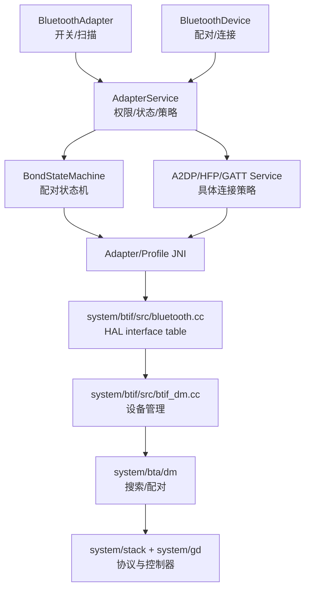
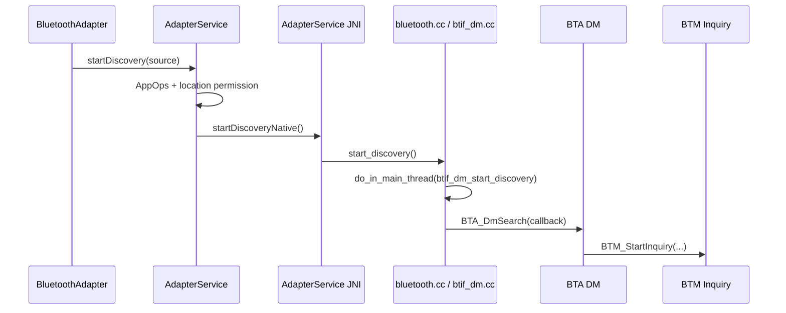
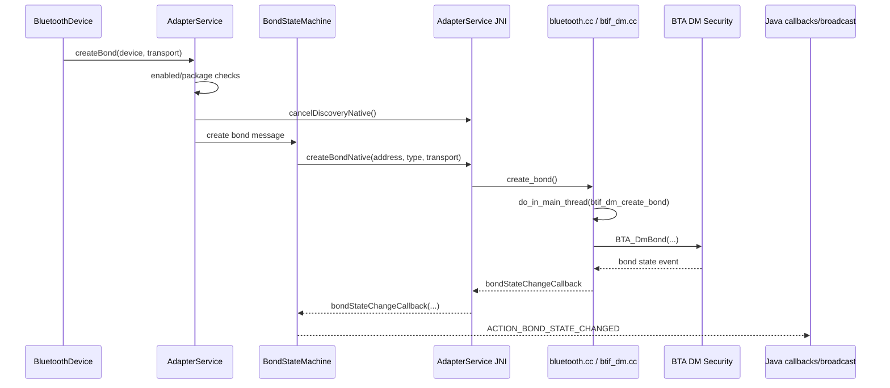

# 02. 基础功能链路：开关、扫描、配对、连接

## 1. 学习目标

本章先把车机蓝牙最常见的基础动作串起来：打开蓝牙、扫描设备、发起配对、取消扫描、删除配对、连接 Profile。读完后，你应该能从一个 API 调用一路追到 JNI 和 Native 的第一跳，并知道问题定位时要看哪些状态和日志。

## 2. 总体图



## 3. 打开蓝牙

阅读顺序：

1. `framework/java/android/bluetooth/BluetoothAdapter.java`：`enable()`
2. `android/app/src/com/android/bluetooth/btservice/AdapterService.java`：`enableNative()` 调用点
3. `android/app/jni/com_android_bluetooth_btservice_AdapterService.cpp`：`enableNative()`
4. `system/btif/src/bluetooth.cc`：蓝牙接口表中的 enable 实现

```java
// framework/java/android/bluetooth/BluetoothAdapter.java
1591 public boolean enable() {
1592     if (isEnabled()) {
1593         Log.d(TAG, "enable(): BT already enabled!");
1594         return true;
1595     }
1603     return mManagerService.enable(mAttributionSource);
}
```

`BluetoothAdapter` 只是公开 API。真正的状态切换和 Native 初始化不在这里完成。

```java
// android/app/src/com/android/bluetooth/btservice/AdapterService.java
1174 mNativeInterface.enable();
```

`AdapterService` 负责初始化扫描控制器、Profile Service、Native 接口等。打开蓝牙失败时，优先确认是否走到了这一层。

```cpp
// android/app/jni/com_android_bluetooth_btservice_AdapterService.cpp
1107 static jboolean enableNative(JNIEnv* /* env */, jobject /* obj */) {
```

JNI 层的 `enableNative()` 是 Java 进入 C++ 的门。它一般会调用底层蓝牙接口结构体中的函数，继续进入 BTIF。

调试观察点：

- `adb shell dumpsys bluetooth_manager`
- `adb logcat | grep -i "AdapterService"`
- `adb logcat | grep -i "bt_stack\|btif\|BluetoothAdapter"`

## 4. 扫描设备

```java
// framework/java/android/bluetooth/BluetoothAdapter.java
1988 public boolean startDiscovery() {
1989     if (getState() != STATE_ON) {
1990         return false;
1991     }
1992     return callServiceIfEnabled(s -> s.startDiscovery(mAttributionSource), false);
1993 }
```

这段代码说明扫描有一个硬前提：Adapter 必须是 `STATE_ON`。

```java
// android/app/src/com/android/bluetooth/btservice/AdapterService.java
2703 boolean startDiscovery(AttributionSource source) {
2707     mAppOps.checkPackage(Binder.getCallingUid(), callingPackage);
2717     if (isQApp) {
2718         if (!Utils.checkCallerHasFineLocation(this, source, callingUser)) {
2719             return false;
2720         }
2721         permission = android.Manifest.permission.ACCESS_FINE_LOCATION;
2722     }
2734     return mNativeInterface.startDiscovery();
}
```

车机项目里经常遇到“界面点了搜索但没结果”。这时不要直接怀疑芯片，先确认调用方是否过了 `AppOps`、定位权限、target SDK 分支。

扫描 Native 链路：

- `android/app/jni/com_android_bluetooth_btservice_AdapterService.cpp:1132`：`startDiscoveryNative()`
- `android/app/jni/com_android_bluetooth_btservice_AdapterService.cpp:2210`：注册 `startDiscoveryNative`
- `system/btif/src/bluetooth.cc:591`：`start_discovery()`
- `system/btif/src/bluetooth.cc:596`：`do_in_main_thread(base::BindOnce(btif_dm_start_discovery))`
- `system/btif/src/btif_dm.cc:2726`：`btif_dm_start_discovery()`
- `system/btif/src/btif_dm.cc:2742`：`BTA_DmSearch(btif_dm_search_devices_evt)`
- `system/bta/dm/bta_dm_api.cc:81`：`BTA_DmSearch(...)`
- `system/bta/dm/bta_dm_device_search.cc:106`：`BTM_StartInquiry(...)`



## 5. 配对

`BluetoothDevice.createBond()` 会进入 `AdapterService.createBond()`，然后转给 `BondStateMachine`。当前仓库中 `AdapterService.createBond()` 有几个关键保护：

```java
// android/app/src/com/android/bluetooth/btservice/AdapterService.java
2830 if (!isEnabled()) {
2831     Log.e(TAG, "Impossible to call createBond when Bluetooth is not enabled");
2832     return false;
2833 }
2845 // Pairing is unreliable while scanning, so cancel discovery
2846 // Note, remove this when native stack improves
2847 mNativeInterface.cancelDiscovery();
```

这就是为什么配对问题要同时看扫描状态。扫描还在跑时，系统会先 cancel discovery 再配对。

`BondStateMachine` 关键入口：

- `android/app/src/com/android/bluetooth/btservice/BondStateMachine.java:408`：`private boolean createBond(...)`
- `android/app/src/com/android/bluetooth/btservice/BondStateMachine.java:445`：`mAdapterService.getNative().createBond(...)`
- `android/app/src/com/android/bluetooth/btservice/BondStateMachine.java:614`：`bondStateChangeCallback(...)`
- `android/app/src/com/android/bluetooth/btservice/BondStateMachine.java:634`：发送 `BONDING_STATE_CHANGE` 消息

Native 配对链路：

- `android/app/jni/com_android_bluetooth_btservice_AdapterService.cpp:1154`：`createBondNative(...)`
- `android/app/jni/com_android_bluetooth_btservice_AdapterService.cpp:2212`：注册 `createBondNative`
- `system/btif/src/bluetooth.cc:609`：`create_bond(...)`
- `system/btif/src/bluetooth.cc:617`：`do_in_main_thread(base::BindOnce(btif_dm_create_bond, ...))`
- `system/btif/src/btif_dm.cc:2774`：`btif_dm_create_bond(...)`
- `system/btif/src/btif_dm.cc:2783`：`btif_dm_cb_create_bond(...)`
- `system/btif/src/btif_dm.cc:827`：`BTA_DmBond(...)`
- `system/bta/dm/bta_dm_sec_api.cc:41`：`BTA_DmBond(...)`



## 6. 删除配对和取消扫描

源码入口：

- `android/app/jni/com_android_bluetooth_btservice_AdapterService.cpp:1143`：`cancelDiscoveryNative()`
- `android/app/jni/com_android_bluetooth_btservice_AdapterService.cpp:1444`：`removeBondNative(...)`
- `system/btif/src/bluetooth.cc:600`：`cancel_discovery()`
- `system/btif/src/bluetooth.cc:665`：`remove_bond(...)`
- `system/btif/src/btif_dm.cc:2753`：`btif_dm_cancel_discovery()`
- `system/btif/src/btif_dm.cc:2984`：`btif_dm_remove_bond(...)`

车载场景里，“删除手机后又自动回连”通常要同时确认 Java 层 bond state、Native storage、Profile 自动连接策略和手机端主动连接行为。

## 7. Profile 连接入口

基础连接不是一个统一函数打天下。`BluetoothDevice.connect()` 更像“连接该设备所有合适的已启用 Profile”，而 A2DP/HFP/GATT 都有自己的 Service、状态机和 NativeInterface。

第一批入口：

- A2DP：`android/app/src/com/android/bluetooth/a2dp/A2dpService.java:182` `connect(...)`
- A2DP JNI：`android/app/jni/com_android_bluetooth_a2dp.cpp:408` `connectA2dpNative(...)`
- HFP Client：`android/app/src/com/android/bluetooth/hfpclient/HeadsetClientService.java`
- HFP Client JNI：`android/app/jni/com_android_bluetooth_hfpclient.cpp:554` `connectNative(...)`
- GATT：`android/app/src/com/android/bluetooth/gatt/GattService.java`
- GATT JNI：`android/app/jni/com_android_bluetooth_gatt.cpp`

## 8. 排查清单

| 现象 | 先看 | 再看 |
| --- | --- | --- |
| 蓝牙打不开 | `BluetoothAdapter.enable()` 返回值、`AdapterState`、`AdapterService` 日志 | JNI enable、BTIF enable、HCI HAL |
| 搜不到设备 | `STATE_ON`、定位权限、AppOps、扫描是否被策略拦截 | `btif_dm_start_discovery`、`BTA_DmSearch`、HCI inquiry |
| 配对失败 | 是否扫描中、`BondStateMachine` 状态、配对广播 reason | `btif_dm_create_bond`、`BTA_DmBond`、HCI reason |
| 删除后回连 | bond state、storage 删除、Profile 自动连接策略 | 手机端是否仍主动连接 |
| A2DP 连不上 | `A2dpService.connect()`、连接策略、最大连接数 | `connectA2dpNative`、`btif_av_source_connect` |

## 9. 练习

- 用 `rg -n "createBondNative|btif_dm_create_bond|BTA_DmBond"` 自己复现配对调用链。
- 在 `BondStateMachine.java` 中找出 `BOND_NONE`、`BOND_BONDING`、`BOND_BONDED` 的转换位置。
- 在 `bluetooth.cc` 中找到 `bt_interface_t` 表，理解 Java 调用最终是如何落到一组 C 函数指针上的。

### 9.1 参考答案与讨论

练习 1：配对调用链应至少追到 BTA DM。

推荐执行：

```bash
rg -n "createBondNative|btif_dm_create_bond|BTA_DmBond" android system
```

预期路线：

- `BluetoothDevice.createBond()`：Framework API 入口。
- `AdapterService.createBond(...)`：蓝牙服务侧入口，负责状态检查和发消息给 `BondStateMachine`。
- `BondStateMachine`：配对状态机，决定发起、取消、超时、状态广播。
- `AdapterNativeInterface.createBond(...)` / `createBondNative(...)`：进入 JNI。
- `system/btif/src/bluetooth.cc:create_bond(...)`：BTIF 接口层，投递到主线程。
- `system/btif/src/btif_dm.cc:btif_dm_create_bond(...)`：设备管理层配对入口。
- `BTA_DmBond(...)`：进入 BTA DM。

判断标准：如果问题发生在 `AdapterService` 前，多半是权限、蓝牙状态或调用方问题；如果已经到 `BTA_DmBond(...)`，就要继续看 BTA/Stack/HCI 的配对事件。

练习 2：三种 bond 状态代表三个阶段。

- `BOND_NONE`：没有配对关系，或配对失败/删除后回到未绑定。
- `BOND_BONDING`：正在配对，可能等待 PIN/SSP/Consent，也可能正在交换密钥。
- `BOND_BONDED`：配对完成，密钥和设备属性已保存。

讨论要点：`BOND_BONDED` 不等于 Profile 已连接。配对只是建立信任关系，A2DP/HFP/PBAP 等 Profile 后续还要各自连接。

练习 3：`bt_interface_t` 是 Native 层暴露给上层的函数表。

推荐执行：

```bash
rg -n "bt_interface_t|start_discovery|create_bond|remove_bond" system/btif/src/bluetooth.cc
```

理解方式：

- Java/JNI 不直接知道 BTIF 内部实现细节，而是拿到一张接口表。
- 表里的 `start_discovery`、`create_bond`、`remove_bond` 等函数指针，对应 BTIF 的实际实现。
- 函数内部通常再用 `do_in_main_thread(...)` 投递到蓝牙主线程，避免多线程直接改状态机。

讨论要点：读 Native 代码时，先找接口表，再找表项函数，再看它投递到哪个真正执行函数。这比从文件头一路读到文件尾高效得多。
