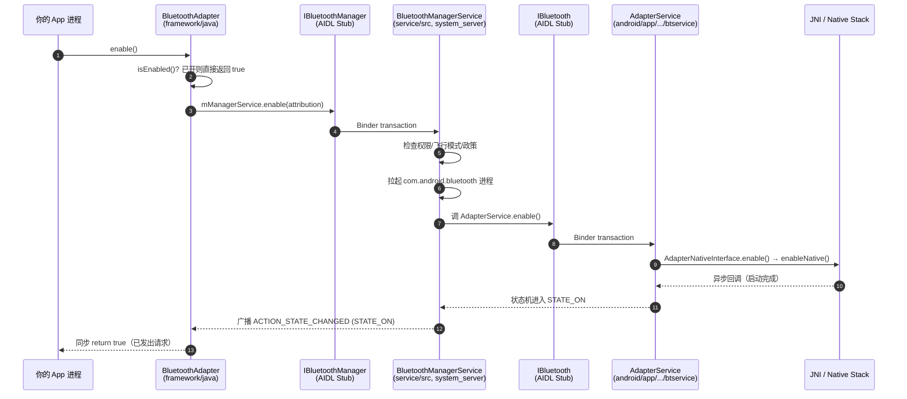
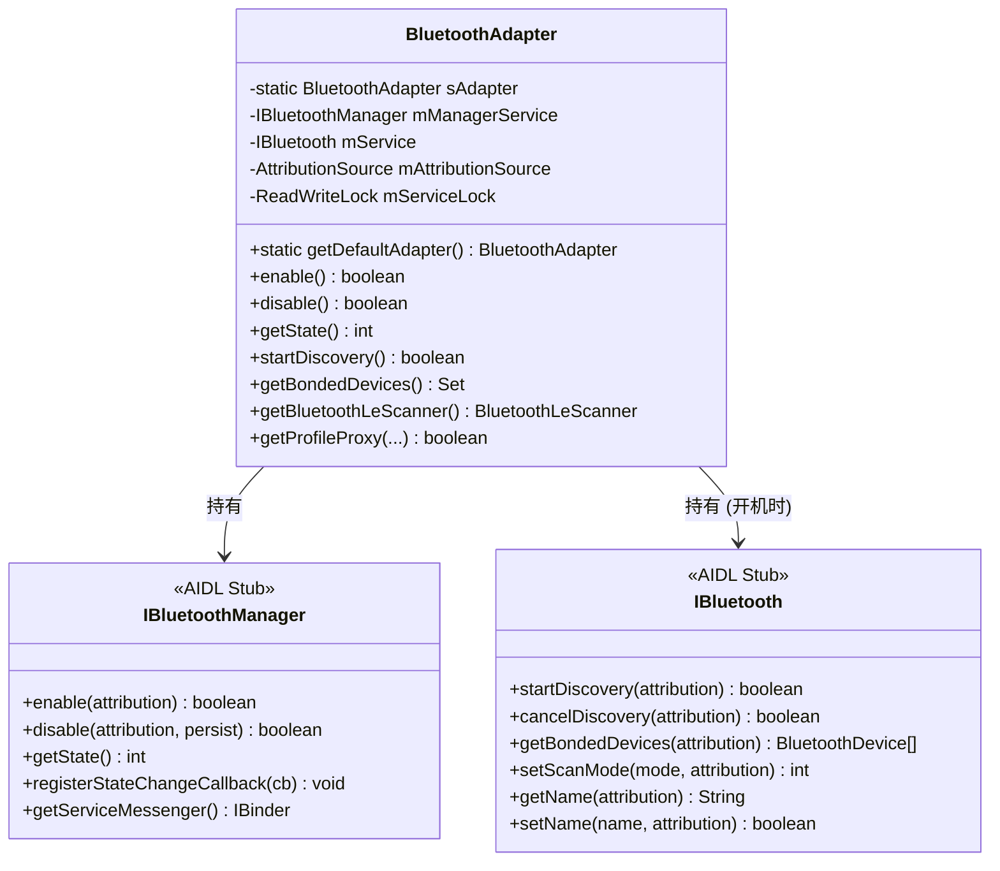

# 02.1 `BluetoothAdapter` 详解

> 速通摘要：`BluetoothAdapter` 是 Java 端**所有蓝牙调用的总入口**。它本身几乎没有业务逻辑，只做四件事：参数校验、权限注解、**Binder 转发**、状态广播解析。你看到的"打开蓝牙"、"开始扫描"、"列出已配对设备"等所有 API，底层都是同一种模式：把请求扔给 `IBluetoothManager`（在 `system_server`）或 `IBluetooth`（在 `com.android.bluetooth` 进程）的 Binder Stub。

源码：`framework/java/android/bluetooth/BluetoothAdapter.java`，5533 行，类定义在 `:143`。

---

## 1. 学习目标

读完本节，你应该能：

1. 在 30 秒内说清 `BluetoothAdapter` **持有的两个 Binder 引用**分别指向哪里。
2. 看懂 `enable()` / `disable()` / `startDiscovery()` / `getBondedDevices()` 这些方法的"Binder 转发"模板。
3. 知道 `BluetoothAdapter` 的状态机和事件（`ACTION_STATE_CHANGED`）怎么用。
4. 知道 `getDefaultAdapter()` 为何被 deprecated、应该用什么替代。
5. 能从 `BluetoothAdapter` 上找到一切 Java 端调用的"下一步走向"。

---

## 2. 前置知识

- Android Binder + AIDL（`Stub`、`asInterface`、`RemoteException`）。
- 已读 00 章。
- 知道 `Context.getSystemService(...)` 系统服务机制。

---

## 3. 场景故事：你的 App 第一次拿 `BluetoothAdapter`

```java
// 现代写法（推荐）
BluetoothManager bm = context.getSystemService(BluetoothManager.class);
BluetoothAdapter adapter = bm.getAdapter();

// 老写法（deprecated 但仍能跑）
BluetoothAdapter adapter = BluetoothAdapter.getDefaultAdapter();
```

这两行背后做了什么？
1. 通过 `BluetoothFrameworkInitializer.getBluetoothServiceManager()` 拿到 `BluetoothServiceManager`（一个跨 Mainline 模块的注册中心，由系统启动期注入）。
2. 通过 `BluetoothServiceManager.getBluetoothManagerServiceRegisterer().get()` 拿到 `IBinder`，强转 `IBluetoothManager`。
3. `new BluetoothAdapter(iBluetoothManager, context)`。
4. 构造器里再尝试拿 `IBluetooth`（蓝牙 App 进程的 Binder，**蓝牙关闭时可能为 null**）。

**关键事实**：`BluetoothAdapter` 是**有状态的客户端代理**——它持有两个 Binder 引用，蓝牙开关时这两个引用会被反复重绑。

---

## 4. 分层调用链（一次 `enable()` 调用走多远）



> 注意：`enable()` 返回 `true` **不代表蓝牙已开**，只代表"请求已发出"。真正的开关完成靠监听 `ACTION_STATE_CHANGED` 广播。

---

## 5. 源码导读（建议阅读顺序）

按下列顺序读 `BluetoothAdapter.java`，每段 5 分钟即可：

| 步骤 | 行号区间 | 重点 |
|------|---------|------|
| ① 类头与字段 | `:143-:280` | 类名、`TAG`、状态常量、广播 Action 常量 |
| ② 单例与构造 | `:853`、`:1032`、`:1058-:1100` | `sAdapter` 单例、`createAdapter()`、两个 Binder 字段 |
| ③ 状态访问 | `:1700-:1850` | `getName()`、`getAddress()`、`getScanMode()`、`setName()` |
| ④ 开关 | `:1591-:1700` | `enable()` / `disable()` 模板 |
| ⑤ 扫描 | `:1988-:2050` | `startDiscovery()` / `cancelDiscovery()` / `isDiscovering()` |
| ⑥ 配对管理 | `:2561` 附近 | `getBondedDevices()` |
| ⑦ BLE 入口 | `:1226-:1300` | `getBluetoothLeScanner()` / `getBluetoothLeAdvertiser()` |
| ⑧ Profile Proxy | 见 `getProfileProxy` | Profile 客户端代理获取（02.3 章详谈） |
| ⑨ 回调集合 | `mQualityCallbackWrapper`、`mAudioProfilesCallbackWrapper` 等 | Android 13+ 的回调统一封装 |

---

## 6. 简化代码片段（带注释）

### 6.1 单例创建（`:1032-:1056`）

```java
// framework/java/android/bluetooth/BluetoothAdapter.java:1032
@Deprecated
@RequiresNoPermission
public static synchronized BluetoothAdapter getDefaultAdapter() {
    if (sAdapter == null) {
        sAdapter = createAdapter(null);   // ① 第一次调用时创建
    }
    return sAdapter;                       // ② 之后都返回同一个实例
}

public static BluetoothAdapter createAdapter(Context context) {
    // ③ Mainline 模块的服务注册中心
    BluetoothServiceManager manager =
            BluetoothFrameworkInitializer.getBluetoothServiceManager();
    if (manager == null) {
        Log.e(TAG, "BluetoothServiceManager is null");
        return null;
    }
    // ④ 拿到 BluetoothManagerService 的 Binder（在 system_server）
    IBluetoothManager service = IBluetoothManager.Stub.asInterface(
            manager.getBluetoothManagerServiceRegisterer().get());
    if (service != null) {
        return new BluetoothAdapter(service, context);
    }
    return null;
}
```

**Java 类比**：和 `Context.getSystemService(Context.CONNECTIVITY_SERVICE)` 一样，本质都是"问系统要 IBinder 包装成代理对象"，只不过蓝牙是 Mainline 模块，多了一层 `BluetoothServiceManager`。

### 6.2 `enable()` 模板（`:1591-:1607`）

```java
// :1591
@Deprecated
@RequiresLegacyBluetoothAdminPermission
@RequiresBluetoothConnectPermission
@RequiresPermission(BLUETOOTH_CONNECT)
public boolean enable() {
    if (isEnabled()) {
        Log.d(TAG, "enable(): BT already enabled!");
        return true;                              // ① 已开就别折腾
    }
    if (Flags.systemServerMessenger()) {
        // ② Android 16 新通路（flag 控制）：通过 Messenger 通信，避免 Binder 数据过大
        var data = new SystemServiceMessage.Enable();
        data.attributionSource = mAttributionSource;
        return mSystemServiceMessenger.send(data).value;
    }
    try {
        // ③ 经典 Binder：直接调 system_server 的 BluetoothManagerService.enable
        return mManagerService.enable(mAttributionSource);
    } catch (RemoteException e) {
        // ④ Binder 调用失败 = system_server 死了，按惯例 rethrow 让 App 进程跟着死
        throw e.rethrowFromSystemServer();
    }
}
```

**注意三点**：
- API 已 deprecated：从 Android 13（Tiramisu）起 App 不允许直接开关蓝牙（Device Owner / Profile Owner / 系统 App 例外）。
- `Flags.systemServerMessenger()` 是 aconfig flag，控制是否走新通路。
- `mAttributionSource` 是权限链——记录"是哪个 App 通过哪个进程发起的请求"，权限检查在 server 侧。

### 6.3 `callServiceIfEnabled` 模板（`:1106` 起）

`BluetoothAdapter` 里大量方法是这种模式（节选自源码思路，不是逐字）：

```java
// :1106
private <R> R callServiceIfEnabled(
        RemoteExceptionIgnoringFunction<IBluetooth, R> fn,
        R defaultValue) {
    mServiceLock.readLock().lock();
    try {
        if (mService == null) return defaultValue;   // ① 蓝牙没开，给个默认值
        return fn.apply(mService);                   // ② 调蓝牙 App 进程的 IBluetooth
    } catch (RemoteException ignored) {
        return defaultValue;
    } finally {
        mServiceLock.readLock().unlock();
    }
}

// 用法（:1988，startDiscovery）：
public boolean startDiscovery() {
    return callServiceIfEnabled(
            s -> s.startDiscovery(mAttributionSource), false);
}
```

**记忆点**：以后看到 `callServiceIfEnabled(s -> s.xxx(...))`，意思就是 "Binder 调蓝牙 App 进程的 `AdapterServiceBinder.xxx()`"。

### 6.4 两个 Binder 引用（关键设计）

```java
// :853
private static BluetoothAdapter sAdapter;       // 单例

// :871
private IBluetooth mService;                    // 指向 com.android.bluetooth 进程的 AdapterService

// （在另一处定义）
private final IBluetoothManager mManagerService; // 指向 system_server 的 BluetoothManagerService
```

| 字段 | 指向 | 何时存在 |
|------|------|---------|
| `mManagerService` | `system_server` 的 `BluetoothManagerService` | 永远存在（只要系统能用蓝牙） |
| `mService` | `com.android.bluetooth` 进程的 `AdapterService` | **仅蓝牙开启时存在**；关时会回收到 `null` |

**这就是为什么 `BluetoothAdapter` 大量方法要做 `mService == null` 防护——蓝牙没开时蓝牙 App 进程根本没起来。**

---

## 7. Mermaid：`BluetoothAdapter` 内部状态与依赖



> **重点**：`IBluetoothManager.aidl` 定义在 `service/aidl/android/bluetooth/IBluetoothManager.aidl`，由 system_server 进程实现；`IBluetooth.aidl` 定义在 `android/app/aidl/android/bluetooth/IBluetooth.aidl`，由蓝牙 App 进程的 `AdapterServiceBinder` 实现。两个 AIDL 在不同的 build target 下。

---

## 8. 状态机与广播

`BluetoothAdapter` 的"开关状态"有 7 个常量（`:221` 起）：

| 常量 | 值 | 含义 |
|------|-----|------|
| `STATE_OFF` | 10 | 关闭 |
| `STATE_TURNING_ON` | 11 | 开启中 |
| `STATE_ON` | 12 | 开启 |
| `STATE_TURNING_OFF` | 13 | 关闭中 |
| `STATE_BLE_TURNING_ON` | 14 | （隐藏）BLE-only 开启中 |
| `STATE_BLE_ON` | 15 | （隐藏）BLE-only |
| `STATE_BLE_TURNING_OFF` | 16 | （隐藏）BLE-only 关闭中 |

公开 API 只用前 4 个；后 3 个是为"BLE-only 模式"（如 Wi-Fi 扫描时打开 BLE 用于 RTT、扫描相关）准备的隐藏态。

**广播**：`BluetoothAdapter.ACTION_STATE_CHANGED`（值 = `android.bluetooth.adapter.action.STATE_CHANGED`），携带 extra：
- `EXTRA_STATE` — 新状态
- `EXTRA_PREVIOUS_STATE` — 旧状态

监听这条广播 = 监听蓝牙真正的开关时机。

---

## 9. 关键 API 一张表

| 类别 | API | 说明 |
|------|-----|------|
| 单例 | `getDefaultAdapter()`（deprecated）/ `BluetoothManager.getAdapter()` | 拿到 `BluetoothAdapter` |
| 状态 | `isEnabled()`、`getState()` | 查询蓝牙开关 |
| 开关 | `enable()`、`disable()`（均 deprecated for App） | 改蓝牙开关 |
| 本机信息 | `getAddress()`、`getName()`、`setName(name)` | 名称地址 |
| 扫描 | `startDiscovery()`、`cancelDiscovery()`、`isDiscovering()` | Classic Inquiry |
| 可发现模式 | `getScanMode()`、`setScanMode(mode)`、`getDiscoverableTimeout()`、`setDiscoverableTimeout(d)` | 控制别人能不能搜到 |
| 配对 | `getBondedDevices()`、`getRemoteDevice(addr)` | 已绑定设备 |
| Profile Proxy | `getProfileProxy(ctx, listener, profile)`、`closeProfileProxy(profile, proxy)` | 获取 A2DP/HFP/HID 等 Profile 代理（详 02.3） |
| BLE | `getBluetoothLeScanner()`、`getBluetoothLeAdvertiser()` | BLE 入口 |
| 连接监听 | `registerBluetoothConnectionCallback(...)`（Android 14+） | 监听任意 ACL 连接 |
| 质量上报 | `registerBluetoothQualityReportCallback(...)`（SystemApi） | 接收 BQR |

> 完整方法列表见 `BluetoothAdapter.java` 5533 行——这只是"日常 100% 用到的那 30%"。

---

## 10. 调试方法

| 想确认 | 做法 |
|--------|------|
| `BluetoothAdapter` 当前持有的状态 | `adb shell dumpsys bluetooth_manager`，搜索 "AdapterServiceBinder" 与 "BluetoothManagerService" |
| 收发哪些 Binder 调用 | `adb shell setprop log.tag.BluetoothAdapter VERBOSE`，再看 logcat |
| 是否成功拿到 `mService`（蓝牙 App 进程是否可用） | logcat 搜 "Bluetooth service is null" / "registerStateChangeCallback" |
| 状态变化历史 | logcat 中 `BluetoothManagerService` 段，会打印 `notifyStateChanged: ...` |

**实战技巧**：在 App 里加一个 `BroadcastReceiver` 监听 `ACTION_STATE_CHANGED`，把 `EXTRA_PREVIOUS_STATE → EXTRA_STATE` 打出来，能立刻看到完整的开关时序（10→11→12 或 12→13→10）。

---

## 11. FAQ

**Q1：`getDefaultAdapter()` 为什么 deprecated？我代码里全用它，要紧吗？**
A：deprecated 是因为它不带 `Context`，无法做 `AttributionSource` 链路（权限审计需要）。**App 兼容性上仍可用**，但新代码请用 `context.getSystemService(BluetoothManager.class).getAdapter()`。

**Q2：`mService` 为什么会变成 null？**
A：蓝牙关闭时，`com.android.bluetooth` 进程会被 `BluetoothManagerService` 杀掉，`mService` 的 Binder 也就死了。`BluetoothAdapter` 内部监听 `onBluetoothServiceUp/Down`，在 down 时把 `mService` 设回 `null`。

**Q3：`Flags.systemServerMessenger()` 是什么？**
A：见 `flags/system_server_messenger.aconfig`（若存在）；它把 `BluetoothAdapter` ↔ `BluetoothManagerService` 的通信从 Binder 切到 Messenger（避免 1MB Binder 数据上限）。逐步迁移中。

**Q4：能不能在 App 里直接 cast `IBluetooth` 自己实现？**
A：不能。`IBluetooth.Stub.asInterface(...)` 要求 IBinder 来自 `ServiceManager` 注册项，普通 App 拿不到那个 token。蓝牙 App 自己注册自己。

**Q5：`registerBluetoothConnectionCallback` 与监听 `ACTION_ACL_CONNECTED` 广播有什么区别？**
A：广播是历史接口、信息少（只有设备和 transport）；Callback 是 Android 14 新加，能拿到更详细的连接信息。新代码建议用 Callback。

---

## 12. 上路任务

### 任务 A：找出所有"Binder 转发"模板
```bash
grep -n "callServiceIfEnabled\|mManagerService\." framework/java/android/bluetooth/BluetoothAdapter.java | head -30
```
读 10 行输出，对每个方法画一张"Java→Binder→哪个 Service"小图。

### 任务 B：在 App 里写一个最小蓝牙开关监听器
要点：
1. 注册 `BroadcastReceiver` 监听 `BluetoothAdapter.ACTION_STATE_CHANGED`。
2. 拿到 `EXTRA_STATE` 与 `EXTRA_PREVIOUS_STATE`。
3. 打印形如 `STATE 11 -> 12`。
跑一次手动开关蓝牙，看是否能在 logcat 看到 `10 → 11 → 12 → 13 → 10`。

### 任务 C：定位 `IBluetoothManager.aidl`
```bash
find . -name "IBluetoothManager.aidl"
# 期望输出：service/aidl/android/bluetooth/IBluetoothManager.aidl
```
打开它，把里面的方法列表与 `BluetoothAdapter` 里对 `mManagerService.xxx()` 的调用一一对照——这就是 system_server 端的"全部接口契约"。

---

## 13. 本节小结（速记卡）

```
BluetoothAdapter = Java 入口 + 两份 Binder 代理：
  mManagerService → BluetoothManagerService (system_server, service/src)
  mService        → AdapterService          (com.android.bluetooth, android/app/src/.../btservice)
方法模式：
  - 权限注解 + Binder 调用 + RemoteException 处理
  - callServiceIfEnabled(s -> s.xxx(...))
状态机：STATE_OFF(10) ↔ STATE_TURNING_ON(11) ↔ STATE_ON(12) ↔ STATE_TURNING_OFF(13)
事件：ACTION_STATE_CHANGED 广播（EXTRA_STATE / EXTRA_PREVIOUS_STATE）
```
