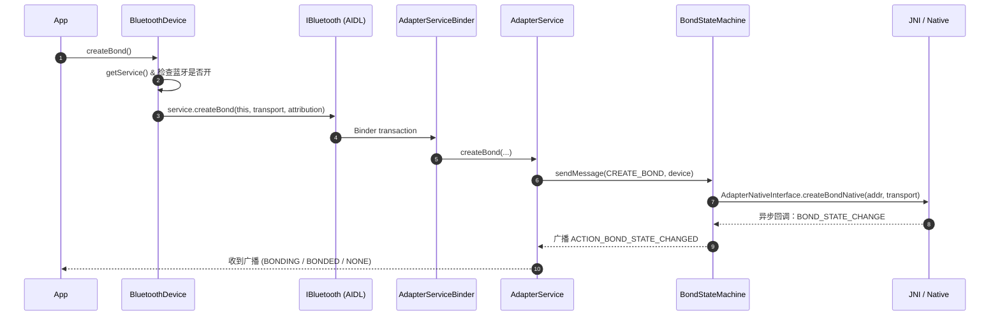
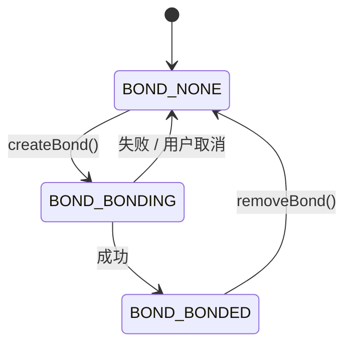

# 02.2 `BluetoothDevice` 详解

> 速通摘要：`BluetoothDevice` 是"**远端设备的 Java 句柄**"。它和 `BluetoothAdapter` 不同，**本身只承载一个 MAC 地址**——所有"动作"（连接、配对、读 UUID）都是把请求通过 `IBluetooth` Binder 转发到蓝牙 App 进程的 `AdapterService` 或 Profile Service。`BluetoothDevice` 实现 `Parcelable`，可以在 Intent / AIDL 中传递。

源码：`framework/java/android/bluetooth/BluetoothDevice.java`，4141 行，类定义在 `:95`。

---

## 1. 学习目标

读完本节，你应该能：

1. 说清 `BluetoothDevice` 和 `BluetoothAdapter` 的角色差别。
2. 拿到一个 MAC 地址能用 3 行代码生成 `BluetoothDevice` 实例。
3. 看懂 `createBond()` / `removeBond()` / `getBondState()` 与配对生命周期。
4. 了解 ACL 连接广播与 Bond 广播的差别。
5. 知道 `connectGatt()`、`createRfcommSocketToServiceRecord()` 走向哪一层。

---

## 2. 前置知识

- 已读 02.1（`BluetoothAdapter`）——这里要复用"两个 Binder 引用"模型。
- 知道 `Parcelable` 和 `Intent extras` 的关系。
- 蓝牙 MAC 地址是 6 字节、形如 `AA:BB:CC:DD:EE:FF`。

---

## 3. 场景故事：你扫到一个手机，要让车机配对它

```java
BluetoothAdapter adapter = context.getSystemService(BluetoothManager.class).getAdapter();
// ① 通过地址拿设备句柄（不会发起任何 Binder）
BluetoothDevice phone = adapter.getRemoteDevice("AA:BB:CC:DD:EE:FF");
// ② 监听配对状态（必做）
registerReceiver(bondReceiver,
        new IntentFilter(BluetoothDevice.ACTION_BOND_STATE_CHANGED));
// ③ 触发配对（异步）
boolean ok = phone.createBond();   // 立即返回 ok=true 表示"已发起"
```

`createBond()` 同步返回 `true` 只意味着 Binder 调用成功。**真正的配对结果**（NONE → BONDING → BONDED 或回到 NONE）由 `ACTION_BOND_STATE_CHANGED` 广播携带。

---

## 4. 分层调用链（一次 `createBond()` 走向哪里）



> `BondStateMachine` 是 Android 风格 `StateMachine`（参考 `com.android.internal.util.StateMachine`），详见 03.3 章配对流程。

---

## 5. 源码导读

按下面顺序读 `BluetoothDevice.java`：

| 步骤 | 行号 | 重点 |
|------|------|------|
| ① 类与字段 | `:95-:140` | `Parcelable`、`Attributable`、`mAddress`、`mAddressType` |
| ② 广播常量 | `:130-:330` | `ACTION_BOND_STATE_CHANGED`、`ACTION_ACL_CONNECTED/DISCONNECTED`、`ACTION_PAIRING_REQUEST`、`ACTION_UUID` |
| ③ 状态常量 | `:330-:430` | `BOND_NONE`、`BOND_BONDING`、`BOND_BONDED`、`UNBOND_REASON_*` |
| ④ Transport / AddressType | 同上 | `TRANSPORT_AUTO/BREDR/LE`、`ADDRESS_TYPE_PUBLIC/RANDOM` |
| ⑤ 名称与地址 | `:1793`、`:1885` | `getAddress()` / `getName()` |
| ⑥ 配对 | `:2050`、`:2208`、`:2302` | `createBond()` / `removeBond()` / `getBondState()` |
| ⑦ 设备信息 | `:2550`、`:2580`、`:2613` | `getBluetoothClass()` / `getUuids()` / `fetchUuidsWithSdp()` |
| ⑧ RFCOMM Socket | `:3020`、`:3110`、`:3150` | `createRfcommSocketToServiceRecord(uuid)`（车机互联关键 API） |
| ⑨ GATT | `:3241-:3400` | `connectGatt(...)`，多个重载（08 章详谈） |

---

## 6. 简化代码片段

### 6.1 `createBond()` 模板（`:2073-:2089`）

```java
// framework/java/android/bluetooth/BluetoothDevice.java:2073
@SystemApi
@RequiresLegacyBluetoothAdminPermission
@RequiresBluetoothConnectPermission
@RequiresPermission(BLUETOOTH_CONNECT)
public boolean createBond(int transport) {
    if (DBG) log("createBond()");
    final IBluetooth service = getService();              // ① 从 BluetoothAdapter 拿 IBluetooth
    if (service == null || !isBluetoothEnabled()) {
        Log.w(TAG, "BT not enabled, createBond failed");
        return false;
    } else if (NULL_MAC_ADDRESS.equals(mAddress)) {       // ② "00:00:00:00:00:00" 拦掉
        Log.e(TAG, "Unable to create bond, invalid address " + mAddress);
    } else {
        try {
            // ③ Binder：调蓝牙 App 进程 AdapterServiceBinder.createBond
            return service.createBond(this, transport, mAttributionSource);
        } catch (RemoteException e) {
            Log.e(TAG, e.toString());
        }
    }
    return false;
}
```

**注意**：`BluetoothDevice.this` 自己被作为参数传过去——因为它 `implements Parcelable`，Binder 框架会把 `mAddress`、`mAddressType` 等字段序列化到对端。

### 6.2 `getService()` 与跨进程协议
`BluetoothDevice` 的所有方法几乎都用 `getService()` 拿 `IBluetooth`——而这个引用其实是从 `BluetoothAdapter.sAdapter.mService` 借的。这意味着：

- **蓝牙没开时 `BluetoothDevice` 调用全部失败**（同 `BluetoothAdapter`）。
- 同一个进程内多个 `BluetoothDevice` 实例**共享同一个 Binder 引用**。

### 6.3 `Parcelable` 让设备能跨进程传

`BluetoothDevice` 在广播（`EXTRA_DEVICE`）、AIDL 参数、`Intent` 里大量出现。序列化只有两个字段：
- `mAddress`（String）
- `mAddressType`（int）

**所以**：你从一个广播里拿到的 `BluetoothDevice` 其实只是一个"地址壳"——所有真实查询都要再走 Binder。

---

## 7. 配对状态机视角



**用 Java 监听**：

```java
private final BroadcastReceiver bondReceiver = new BroadcastReceiver() {
    @Override public void onReceive(Context c, Intent intent) {
        if (!BluetoothDevice.ACTION_BOND_STATE_CHANGED.equals(intent.getAction())) return;
        BluetoothDevice d = intent.getParcelableExtra(BluetoothDevice.EXTRA_DEVICE, BluetoothDevice.class);
        int state = intent.getIntExtra(BluetoothDevice.EXTRA_BOND_STATE, -1);
        int prev  = intent.getIntExtra(BluetoothDevice.EXTRA_PREVIOUS_BOND_STATE, -1);
        Log.i("BondMonitor", d.getAddress() + " : " + prev + " → " + state);
    }
};
```

---

## 8. ACL 连接 vs Bond — 别搞混

| 维度 | Bond（配对/绑定） | ACL Connect（链路连接） |
|------|-----------------|------------------------|
| 触发 | `createBond()` 或回应 `ACTION_PAIRING_REQUEST` | Profile Service 调 `connect()` 或对端发起 |
| 持久性 | 配对信息写入存储（`/data/misc/bluedroid/bt_config.conf`） | 链路是临时的（断开就没了） |
| 广播 | `ACTION_BOND_STATE_CHANGED` | `ACTION_ACL_CONNECTED` / `ACTION_ACL_DISCONNECTED` |
| 是否能传数据 | 不能（绑定只是建立信任） | 可以 |

**车机典型流程**：先配对（一次性），之后每次启动靠 ACL 重连 + 多 Profile 自动连接（`PhonePolicy`）。

---

## 9. 关键 API 一张表

| 类别 | API | 说明 |
|------|-----|------|
| 信息 | `getAddress()` / `getName()` / `getAlias()` / `getBluetoothClass()` | 设备元数据 |
| Bond | `createBond()` / `createBond(transport)` / `removeBond()` / `getBondState()` / `cancelBondProcess()` | 配对管理 |
| 配对回应 | `setPin(byte[])` / `setPasskey(int)` / `setPairingConfirmation(boolean)` | 应答 `ACTION_PAIRING_REQUEST` |
| 服务发现 | `getUuids()` / `fetchUuidsWithSdp()` / `fetchUuidsWithSdp(transport)` | SDP / GATT 服务发现 |
| Socket（Classic） | `createRfcommSocketToServiceRecord(UUID)` / `createInsecureRfcommSocketToServiceRecord(UUID)` / `createL2capChannel(int)` | 自定义协议 |
| GATT（BLE） | `connectGatt(context, autoConnect, callback)` 及多个重载 | BLE 主连接 |
| 元数据 | `getMetadata(int key)` / `setMetadata(int, byte[])`（SystemApi） | 蓝牙厂商扩展（电量、型号等） |
| 类型 | `getType()` | `DEVICE_TYPE_CLASSIC/LE/DUAL/UNKNOWN` |

---

## 10. 调试方法

| 想看 | 方法 |
|------|------|
| 当前已配对设备 | `adb shell dumpsys bluetooth_manager`，找 `BondedDevices` 段 |
| 配对状态变迁 | `adb logcat -s BluetoothBondStateMachine BluetoothDevice` |
| 配对存档 | `/data/misc/bluedroid/bt_config.conf`（需 root），里面有 LinkKey、ServiceClass、Profile 列表 |
| UUID 列表 | `fetchUuidsWithSdp()` 后等 `ACTION_UUID` 广播；或 dumpsys → `Discovery Service` 段 |
| ACL 连接状态 | `dumpsys bluetooth_manager` → `ACL Stats` |

---

## 11. FAQ

**Q1：`getName()` 为什么有时返回 null？**
A：刚扫到的设备可能只有地址，没拿到 EIR/name；需要 ACL 连接后或显式 `BluetoothAdapter#getRemoteDevice` + 后续 SDP 才填好。

**Q2：`createBond()` 返回 `true` 但配对没成功？**
A：返回值只代表"Binder 调用入队"。后续可能：① 用户拒绝、② 链路在配对超时前断开、③ Authenticated Payload Timeout、④ 输错 PIN。监听 `ACTION_BOND_STATE_CHANGED` 看到 `BONDING → NONE` 就是失败。看 `EXTRA_REASON` 拿原因（`UNBOND_REASON_*`）。

**Q3：`createBond(TRANSPORT_BREDR)` 与 `TRANSPORT_LE` 怎么选？**
A：双模设备（手机）默认走 `TRANSPORT_AUTO`，让栈自己决定。需要明确只走 BLE（如某些钥匙），用 `TRANSPORT_LE`。本仓 `BondStateMachine.java` 会把 transport 透传到 native。

**Q4：`fetchUuidsWithSdp()` 拿不到我自己注册的 UUID？**
A：要先 ACL 连接 + 对方有 SDP server + 你已 `BluetoothAdapter.listenUsingRfcommWithServiceRecord(name, uuid)` 注册过。SDP 时序见 03 章。

**Q5：BLE 设备的 `BluetoothDevice` 跟 Classic 一样吗？**
A：类相同，但 `getType()` 不同；BLE 不走 `createBond()` 也能 `connectGatt()`（除非对方要求加密），底层走 SMP 协议。详 08 章。

---

## 12. 上路任务

### 任务 A：监听配对状态机
写一个最小 BroadcastReceiver，监听 `ACTION_BOND_STATE_CHANGED`，把 `EXTRA_PREVIOUS_BOND_STATE → EXTRA_BOND_STATE` 打印出来；用任意手机做一次"配对→解除"完整流程，确认能看到 `10 → 11 → 12 → 10`（NONE → BONDING → BONDED → NONE）。

### 任务 B：在 dumpsys 找已配对设备
```bash
adb shell dumpsys bluetooth_manager | sed -n '/Bonded devices/,/^$/p'
```
对每个设备，记下它的 MAC、Name、BluetoothClass。这就是 `RemoteDevices.java` 在内存里的状态。

### 任务 C：确认 `BluetoothDevice` 的"轻量"性
```bash
grep -n "writeToParcel\|readFromParcel" framework/java/android/bluetooth/BluetoothDevice.java | head -10
```
读这两个方法的实现，确认 `BluetoothDevice` 跨进程只序列化了 `mAddress` 和 `mAddressType` 两个字段。

---

## 13. 本节小结（速记卡）

```
BluetoothDevice = 远端设备的 Java 句柄（≈ MAC 地址壳）
特征：Parcelable，可放 Intent / AIDL；调用全部走 BluetoothAdapter.mService
关键操作：
  - 信息：getAddress / getName / getBluetoothClass / getUuids
  - Bond：createBond / removeBond / getBondState（异步，监听 ACTION_BOND_STATE_CHANGED）
  - 数据：createRfcommSocketToServiceRecord(uuid) / connectGatt(...)
广播必听：
  - ACTION_BOND_STATE_CHANGED（配对生命周期）
  - ACTION_ACL_CONNECTED / DISCONNECTED（链路）
  - ACTION_PAIRING_REQUEST（需要 PIN/Passkey 时）
  - ACTION_UUID（fetchUuidsWithSdp 结果）
Bond ≠ ACL：先 Bond 一次，之后每次启动靠 ACL 重连
```
