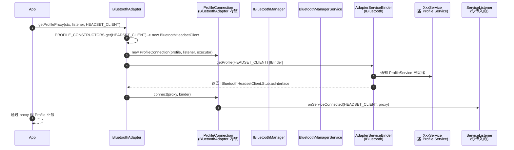

# 02.3 `BluetoothProfile` 与 Profile Proxy 模型

> 速通摘要：Android 把"每个蓝牙业务"（A2DP、HFP、HID、GATT、PBAP…）抽象成一个 **Profile**。App 不直接持有 Profile Service，而是通过 `BluetoothAdapter.getProfileProxy(...)` 异步**借**一个 Profile 代理（如 `BluetoothA2dp`、`BluetoothHeadsetClient`），代理底层是该 Profile AIDL（`IBluetoothA2dp` 等）的 Stub 客户端，**最终落到** `com.android.bluetooth` 进程里对应的 Profile Service。代理用完要 `closeProfileProxy()` 释放。

源码：
- 接口：`framework/java/android/bluetooth/BluetoothProfile.java`，类定义 `:41`
- 代理获取：`framework/java/android/bluetooth/BluetoothAdapter.java:3194`（公开）/ `:3211`（内部）

---

## 1. 学习目标

读完本节，你应该能：

1. 列出 Android 16 支持的全部 Profile 常量及对应代理类。
2. 用 5 行代码异步拿到 `BluetoothA2dp` 或 `BluetoothHeadsetClient` 代理。
3. 看懂 `ServiceListener.onServiceConnected/Disconnected` 何时触发。
4. 知道 Profile 状态的 4 个常量（DISCONNECTED/CONNECTING/CONNECTED/DISCONNECTING）。
5. 知道 `BluetoothAdapter.PROFILE_CONSTRUCTORS` 是怎么把 `int profile` 映射成具体代理类的。

---

## 2. 前置知识

- 已读 02.1、02.2。
- 知道 AIDL Stub/Proxy 模型。

---

## 3. 场景故事：车机要监听 HFP 通话状态

```java
private BluetoothHeadsetClient mHfClient;

BluetoothAdapter adapter = bm.getAdapter();
adapter.getProfileProxy(context, new BluetoothProfile.ServiceListener() {
    @Override public void onServiceConnected(int profile, BluetoothProfile proxy) {
        if (profile == BluetoothProfile.HEADSET_CLIENT) {
            mHfClient = (BluetoothHeadsetClient) proxy;       // ① 现在能用了
            // 查当前连接设备
            List<BluetoothDevice> devs = mHfClient.getConnectedDevices();
            // 注册电话状态广播
            // ...
        }
    }
    @Override public void onServiceDisconnected(int profile) {
        mHfClient = null;                                     // ② 蓝牙关或 Profile 重启时回掉
    }
}, BluetoothProfile.HEADSET_CLIENT);
```

为什么不直接 `new BluetoothHeadsetClient(...)`？因为 Profile 代理需要等到**对应 Profile Service** 在 `com.android.bluetooth` 进程里**起来**才能用，这件事是异步的。

---

## 4. 分层调用链（`getProfileProxy` 内部）



---

## 5. 源码导读

### 5.1 接口本体（`BluetoothProfile.java`）

```java
// :41
public interface BluetoothProfile {
    // 状态常量
    int STATE_DISCONNECTED = 0;   // :70
    int STATE_CONNECTING   = 1;
    int STATE_CONNECTED    = 2;
    int STATE_DISCONNECTING= 3;

    // Profile 编号常量（节选）
    int HEADSET           = 1;    // HFP AG
    int A2DP              = 2;
    @SystemApi int HID_HOST = 4;
    @SystemApi int PAN      = 5;
    int GATT              = 7;
    int GATT_SERVER       = 8;
    @SystemApi int A2DP_SINK        = 11;
    @SystemApi int AVRCP_CONTROLLER = 12;
    int AVRCP             = 13;
    @SystemApi int HEADSET_CLIENT   = 16;
    int HEARING_AID       = 21;
    int LE_AUDIO          = 22;
    int CSIP_SET_COORDINATOR = 25;
    @SystemApi int LE_AUDIO_BROADCAST = 26;
    int HAP_CLIENT        = 28;
    @SystemApi int LE_AUDIO_BROADCAST_ASSISTANT = 29;
    int MAX_PROFILE_ID    = 32;

    // 三个核心方法
    List<BluetoothDevice> getConnectedDevices();
    List<BluetoothDevice> getDevicesMatchingConnectionStates(int[] states);
    int getConnectionState(BluetoothDevice device);

    interface ServiceListener {
        void onServiceConnected(int profile, BluetoothProfile proxy);
        void onServiceDisconnected(int profile);
    }
}
```

### 5.2 `getProfileProxy` 实现要点（`BluetoothAdapter.java:3194-:3270`）

```java
public boolean getProfileProxy(
        Context context, BluetoothProfile.ServiceListener listener, int profile) {
    // ① 旧 SDK 兼容（< Android 12 仍保留 BLUETOOTH 权限检查）
    if (context.getApplicationInfo().targetSdkVersion < Build.VERSION_CODES.S
            && context.checkSelfPermission(BLUETOOTH) != PackageManager.PERMISSION_GRANTED) {
        throw new SecurityException("Need BLUETOOTH permission");
    }
    // ② 转入私有重载，executor 默认 mMainHandler::post
    return getProfileProxy(context, listener, profile, mMainHandler::post);
}

private boolean getProfileProxy(...) {
    // ③ HEALTH 已 deprecated，挡掉
    // ④ HEARING_AID 不支持的设备挡掉
    // ⑤ PROFILE_CONSTRUCTORS：把 int 映射到具体代理类的构造器
    BiFunction<Context, BluetoothAdapter, BluetoothProfile> constructor =
            PROFILE_CONSTRUCTORS.get(profile);
    if (constructor == null) return false;
    BluetoothProfile proxy = constructor.apply(context, this);  // 如 BluetoothA2dp
    ProfileConnection connection = new ProfileConnection(profile, listener, executor);

    // ⑥ 关键：拿 Profile Service 的 IBinder
    if (Flags.getProfileOneway()) {
        // 新接口：异步 Stub 回调
        getProfile(profile, new IBluetoothProfileCallback.Stub() { ... });
    } else {
        // 旧接口：同步拿
        IBinder binder = getProfile(profile);
        connection.connect(proxy, binder);    // 触发 onServiceConnected
    }
    return true;
}
```

> `PROFILE_CONSTRUCTORS` 是 `BluetoothAdapter` 静态 map，注册了 `A2DP → BluetoothA2dp::new`、`HEADSET_CLIENT → BluetoothHeadsetClient::new` 等。它是 Java 端"profile id 到代理类"的唯一权威。

### 5.3 `closeProfileProxy`

```java
// :3278
public void closeProfileProxy(@NonNull BluetoothProfile proxy) {
    requireNonNull(proxy);
    // 解除 ProfileConnection、停止接收 ServiceListener 回调
    // 释放 IBinder
}
```

**忘了 close 会怎么样**：会泄漏一个 ProfileConnection 和一个回调引用；蓝牙重启时 `onServiceDisconnected` 还是会调，但你已经没 ref 了 ——多数情况下不致命，但仍是规范要求。

---

## 6. Profile 编号 → 代理类 → AIDL 一览表

| Profile | 代理类（`framework/java/android/bluetooth/`） | AIDL（`android/app/aidl/`） | 服务类（`android/app/src/com/android/bluetooth/`） |
|---------|---------------------------------------|---------------------------|--------------------------------------------|
| HEADSET (1) | `BluetoothHeadset.java` | `IBluetoothHeadset.aidl` | `hfp/HeadsetService.java` |
| A2DP (2) | `BluetoothA2dp.java` | `IBluetoothA2dp.aidl` | `a2dp/A2dpService.java` |
| HID_HOST (4) | `BluetoothHidHost.java` | `IBluetoothHidHost.aidl` | `hid/HidHostService.java` |
| PAN (5) | `BluetoothPan.java` | `IBluetoothPan.aidl` | `pan/PanService.java` |
| GATT (7) | `BluetoothGatt.java`（实际由 `BluetoothGattService` 管理） | `IBluetoothGatt.aidl` | `gatt/GattService.java` |
| GATT_SERVER (8) | `BluetoothGattServer.java` | `IBluetoothGatt.aidl`（同上） | `gatt/GattService.java` |
| A2DP_SINK (11) | `BluetoothA2dpSink.java` | `IBluetoothA2dpSink.aidl` | `a2dpsink/A2dpSinkService.java` |
| AVRCP_CONTROLLER (12) | `BluetoothAvrcpController.java` | `IBluetoothAvrcpController.aidl` | `avrcpcontroller/AvrcpControllerService.java` |
| AVRCP (13) | `BluetoothAvrcp.java`（已被新实现替代） | — | `avrcp/` |
| HEADSET_CLIENT (16) | `BluetoothHeadsetClient.java` | `IBluetoothHeadsetClient.aidl` | `hfpclient/HeadsetClientService.java` |
| SAP (15) | `BluetoothSap.java` | `IBluetoothSap.aidl` | `sap/SapService.java` |
| PBAP (6) | `BluetoothPbap.java` | `IBluetoothPbap.aidl` | `pbap/BluetoothPbapService.java` |
| PBAP_CLIENT (17) | `BluetoothPbapClient.java` | `IBluetoothPbapClient.aidl` | `pbapclient/PbapClientService.java` |
| MAP (9) | `BluetoothMap.java` | `IBluetoothMap.aidl` | `map/BluetoothMapService.java` |
| MAP_CLIENT (18) | `BluetoothMapClient.java` | `IBluetoothMapClient.aidl` | `mapclient/MapClientService.java` |
| HID_DEVICE (19) | `BluetoothHidDevice.java` | `IBluetoothHidDevice.aidl` | `hid/HidDeviceService.java` |
| HEARING_AID (21) | `BluetoothHearingAid.java` | `IBluetoothHearingAid.aidl` | `hearingaid/HearingAidService.java` |
| LE_AUDIO (22) | `BluetoothLeAudio.java` | `IBluetoothLeAudio.aidl` | `le_audio/LeAudioService.java` |
| VOLUME_CONTROL (23) | `BluetoothVolumeControl.java` | `IBluetoothVolumeControl.aidl` | `vc/VolumeControlService.java` |
| CSIP_SET_COORDINATOR (25) | `BluetoothCsipSetCoordinator.java` | `IBluetoothCsipSetCoordinator.aidl` | `csip/CsipSetCoordinatorService.java` |
| LE_AUDIO_BROADCAST (26) | `BluetoothLeBroadcast.java` | `IBluetoothLeAudio.aidl` | `le_audio/LeAudioService.java` |
| HAP_CLIENT (28) | `BluetoothHapClient.java` | `IBluetoothHapClient.aidl` | `hap/HapClientService.java` |
| LE_AUDIO_BROADCAST_ASSISTANT (29) | `BluetoothLeBroadcastAssistant.java` | `IBluetoothLeBroadcastAssistant.aidl` | `bass_client/BassClientService.java` |

> 注：表格按主线列出，部分非完整；以 `BluetoothProfile.java` 和 `Config.java` 为准。AVRCP（13）作为 Target 已被 native 实现替代，框架层的代理类几乎不用。

---

## 7. Profile 的"三大基础方法"

每个 Profile 代理都实现这三个方法（来自 `BluetoothProfile` 接口）：

```java
// :340 附近
List<BluetoothDevice> getConnectedDevices();
List<BluetoothDevice> getDevicesMatchingConnectionStates(int[] states);
int getConnectionState(BluetoothDevice device);
```

意义：你可以**只用这三个方法**就能写出一个"通用 Profile 状态扫描器"，遍历所有 Profile 报告连接情况。

```java
// 伪代码示例：从 BluetoothAdapter 拿 A2DP 代理后
List<BluetoothDevice> connected = a2dp.getConnectedDevices();
for (BluetoothDevice d : connected) {
    int state = a2dp.getConnectionState(d);
    // state ∈ {DISCONNECTED, CONNECTING, CONNECTED, DISCONNECTING}
}
```

---

## 8. Profile 状态机与广播

每个 Profile 都有自己的广播：

| Profile | Action |
|---------|--------|
| A2DP | `BluetoothA2dp.ACTION_CONNECTION_STATE_CHANGED` / `ACTION_PLAYING_STATE_CHANGED` / `ACTION_ACTIVE_DEVICE_CHANGED` |
| HFP AG | `BluetoothHeadset.ACTION_CONNECTION_STATE_CHANGED` / `ACTION_AUDIO_STATE_CHANGED` / `ACTION_VENDOR_SPECIFIC_HEADSET_EVENT` |
| HFP HF | `BluetoothHeadsetClient.ACTION_CONNECTION_STATE_CHANGED` / `ACTION_AUDIO_STATE_CHANGED` / `ACTION_CALL_CHANGED` |
| HID Host | `BluetoothHidHost.ACTION_CONNECTION_STATE_CHANGED` |
| PBAP Client | `BluetoothPbapClient.ACTION_CONNECTION_STATE_CHANGED` |
| LE Audio | `BluetoothLeAudio.ACTION_LE_AUDIO_CONNECTION_STATE_CHANGED` |
| GATT | 无广播，通过 `BluetoothGattCallback` 回调 |

所有连接状态广播都使用统一的 extra：
- `EXTRA_STATE` / `EXTRA_PREVIOUS_STATE`（值 ∈ `BluetoothProfile.STATE_*`）
- `EXTRA_DEVICE`

---

## 9. 简化代码片段：通用 Profile 状态监控器

```java
public class BtProfileMonitor implements BluetoothProfile.ServiceListener {
    private final BluetoothAdapter adapter;
    private final Map<Integer, BluetoothProfile> proxies = new HashMap<>();
    private static final int[] PROFILES = {
        BluetoothProfile.A2DP,
        BluetoothProfile.HEADSET,
        BluetoothProfile.HEADSET_CLIENT,
        BluetoothProfile.HID_HOST,
        BluetoothProfile.PAN,
    };

    public BtProfileMonitor(Context ctx) {
        adapter = ctx.getSystemService(BluetoothManager.class).getAdapter();
        for (int p : PROFILES) adapter.getProfileProxy(ctx, this, p);
    }

    @Override public void onServiceConnected(int profile, BluetoothProfile proxy) {
        proxies.put(profile, proxy);
        Log.i("BtPM", "Profile " + profile + " up, connected="
                + proxy.getConnectedDevices().size());
    }

    @Override public void onServiceDisconnected(int profile) {
        proxies.remove(profile);
    }

    public void release() {
        for (BluetoothProfile p : proxies.values()) adapter.closeProfileProxy(p);
        proxies.clear();
    }
}
```

> 把它放在 `Activity#onCreate` 里 `new`，`onDestroy` 里 `release()`，就是一个完整的 Profile 监听器。

---

## 10. C++ 类比（Profile 在 Native 端是什么？）

在 Java 层，"Profile = 一个 AIDL 接口 + 一个 Service 类 + 一个代理类"。
在 Native 层（C++），"Profile = 一组 BTIF 函数 + 一个 BTA 状态机 + 一段 Stack 协议代码"。

例如 A2DP：

| 层 | Java/Kotlin 端 | Native 端 |
|----|--------------|----------|
| 入口 | `BluetoothA2dp` 代理 | `bt_av_interface` 函数表 |
| 业务 Service | `A2dpService.java` | `btif_av.cc` |
| 状态机 | `A2dpStateMachine.java`（per-device） | `bta_av_main.cc` |
| 协议 | — | `system/stack/avdt/` + `system/stack/a2dp/` |

你会发现：**Java 端 Profile 代理 ↔ Native 端 Profile 函数表是一一对应的**。05、06 章会展开。

---

## 11. 调试方法

| 想看 | 方法 |
|------|------|
| 当前哪些 Profile Service 起来了 | `adb shell dumpsys bluetooth_manager`，搜各 Profile Service 段 |
| Profile 连接状态变迁 | `adb logcat -s BluetoothA2dpService BluetoothHeadsetService BluetoothHeadsetClientService` |
| `PROFILE_CONSTRUCTORS` 注册了哪些 profile | `grep -n "PROFILE_CONSTRUCTORS" framework/java/android/bluetooth/BluetoothAdapter.java` |

---

## 12. FAQ

**Q1：`getProfileProxy()` 不停调用会怎样？**
A：每次都会创建新的 `ProfileConnection` 与代理。建议同一个 profile 同一时间只持一个代理，用完 `closeProfileProxy()`。

**Q2：Profile Service 没起来时调用代理会怎样？**
A：返回空列表 / DISCONNECTED / false。代理实现通常都做了 `mService == null` 保护。

**Q3：为什么 GATT 没有自己的广播？**
A：GATT 设计上每次操作（connect、read、write）都是异步带回调（`BluetoothGattCallback`），不需要广播。

**Q4：`HEADSET` 和 `HEADSET_CLIENT` 都是 HFP，谁是车机？**
A：`HEADSET` 是 AG（Audio Gateway，通常手机做），`HEADSET_CLIENT` 是 HF（Hands-Free，车机做）。两者各有一套 Service / AIDL / 代理。

**Q5：`getProfileProxy` 与新的 `BluetoothManager.getDevicesMatchingConnectionStates(profile, states)` 怎么选？**
A：后者是 Android 11+ 提供的"无需代理"快速查询接口，仅用于查询连接状态；要监听变化或调 Profile 业务操作，仍需 `getProfileProxy`。

---

## 13. 上路任务

### 任务 A：列出本仓 Profile 编号
```bash
grep -nE "int (HEADSET|A2DP|HID|GATT|PAN|AVRCP|HEARING|LE_AUDIO|CSIP|HAP|HEADSET_CLIENT|A2DP_SINK|PBAP|MAP|SAP|VOLUME) " framework/java/android/bluetooth/BluetoothProfile.java
```
你应该看到一份与 §6 表格一致的清单。

### 任务 B：写一个 Profile 状态打印器
照 §9 复制代码，跑一遍，logcat 看输出。再做一次"手机连上车机 / 断开"操作，观察日志变化。

### 任务 C：找出某个 Profile Service 的 AIDL
任选一个 Profile（如 HFP Client），找出：
- 框架 Java：`framework/.../BluetoothHeadsetClient.java`
- AIDL：`android/app/aidl/android/bluetooth/IBluetoothHeadsetClient.aidl`
- 服务：`android/app/src/com/android/bluetooth/hfpclient/HeadsetClientService.java`

三层路径都能定位 = 你已掌握 Profile 模型。

---

## 14. 本节小结（速记卡）

```
BluetoothProfile：一组 Profile 抽象（A2DP、HFP、HID、GATT...）
状态常量：STATE_DISCONNECTED(0) / CONNECTING(1) / CONNECTED(2) / DISCONNECTING(3)
Profile 编号：HEADSET=1, A2DP=2, HID_HOST=4, GATT=7, HEADSET_CLIENT=16, LE_AUDIO=22 ...
代理获取：getProfileProxy(ctx, listener, profile)，异步，监听 onServiceConnected
代理释放：closeProfileProxy(proxy)
三大方法：getConnectedDevices() / getDevicesMatchingConnectionStates() / getConnectionState()
车机角色：A2DP_SINK + AVRCP_CONTROLLER + HEADSET_CLIENT + PBAP_CLIENT + MAP_CLIENT
```
