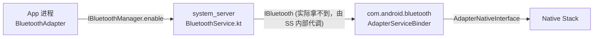
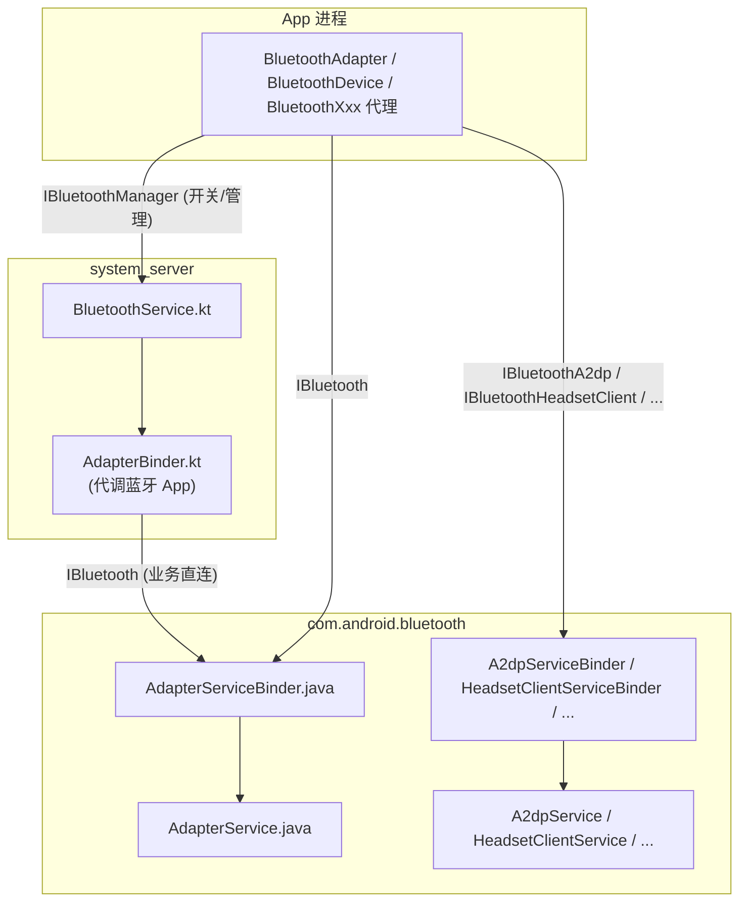

# 02.4 AIDL / Binder 跨进程桥接

> 速通摘要：Java API 看似一行调用，实际跨过 **两次进程边界**：你的 App → `system_server`（管策略） → `com.android.bluetooth`（管业务）。两段进程边界各自走 AIDL：第一段 `IBluetoothManager.aidl`（定义在 `service/aidl/`），第二段 `IBluetooth.aidl` 及其全部 Profile AIDL（定义在 `android/app/aidl/`）。`AttributionSource` 贯穿所有调用，用于权限审计。

---

## 1. 学习目标

读完本节，你应该能：

1. 默写"两段 AIDL"在仓库里的具体路径。
2. 看懂任意 AIDL 方法签名，并在 Java 端调用与 Service 端实现之间一一对应。
3. 理解 `@JavaPassthrough` 与 `AttributionSource` 在 AIDL 里的作用。
4. 知道 Profile AIDL 与 `IBluetooth` 的关系（"通过 `IBluetooth.getProfile()` 拿 Profile Binder"）。
5. 用 dumpsys 排查"Binder 调用没成功"类问题。

---

## 2. 前置知识

- AIDL 基础：`interface ... { void method(...); }` → 构建生成 Stub/Proxy。
- 已读 02.1/02.2/02.3。

---

## 3. 场景故事：一次 `enable()` 的两次跨进程



注意一个常见误解：**App 不能直接调 `IBluetooth.enable()`**。开关蓝牙的 Binder 入口是 `IBluetoothManager`（在 `system_server`），由 `system_server` 决定要不要拉起蓝牙 App 进程并调用 `IBluetooth`。

但你 App 拿到的 `BluetoothAdapter.mService`（`IBluetooth`）可以直接调"业务方法"（如 `startDiscovery()`、`createBond()`、`getName()`）。

---

## 4. 两段 AIDL 的边界

### 4.1 第一段：`IBluetoothManager.aidl`
- 路径：`service/aidl/android/bluetooth/IBluetoothManager.aidl`（98 行）
- 实现方：`system_server` 中的 `BluetoothService.kt`（在 `service/src/`）
- 客户端：所有 App（通过 `BluetoothAdapter.mManagerService`）

**主要方法**（从源码摘）：
```aidl
// service/aidl/.../IBluetoothManager.aidl:52
IBinder registerAdapter(in IBluetoothManagerCallback callback);
void    unregisterAdapter(in IBluetoothManagerCallback callback);
int     getState();
String  getAddress(in AttributionSource attributionSource);
String  getName(in AttributionSource attributionSource);
boolean isHearingAidProfileSupported();
boolean isBleScanAvailable();
boolean enable(in AttributionSource attributionSource);
boolean enableBle(in AttributionSource attributionSource, IBinder b);
boolean disable(in AttributionSource attributionSource, boolean persist);
boolean disableBle(in AttributionSource attributionSource, IBinder b);
boolean factoryReset(in AttributionSource attributionSource);
int     setBtHciSnoopLogMode(int mode);
int     getBtHciSnoopLogMode();
boolean isAutoOnSupported();
boolean isAutoOnEnabled();
void    setAutoOnEnabled(boolean status);
Messenger getServiceMessenger();   // ← 新通路（systemServerMessenger flag）
```

**职责**：
- **策略层**：飞行模式、用户开关、政策限制、`UserManager` restriction、Auto-On。
- **生命周期**：拉起 / 杀掉 `com.android.bluetooth` 进程；负责崩溃重启。
- **Snoop 日志开关**。
- 给 `BluetoothAdapter` 暴露一个 `IBluetoothManagerCallback` 回调，蓝牙状态变了就回调。

### 4.2 第二段：`IBluetooth.aidl`
- 路径：`android/app/aidl/android/bluetooth/IBluetooth.aidl`（328 行）
- 实现方：蓝牙 App 进程的 `AdapterServiceBinder.java`
- 客户端：App（通过 `BluetoothAdapter.mService`）+ system_server

**主要方法**（节选）：
- 扫描：`startDiscovery`、`cancelDiscovery`、`isDiscovering`、`setScanMode`、`getScanMode`
- 配对：`createBond`、`createBondOutOfBand`、`removeBond`、`getBondState`、`cancelBondProcess`
- 设备信息：`getRemoteName`、`getRemoteClass`、`getRemoteUuids`、`fetchRemoteUuids`、`sdpSearch`
- 配对回应：`setPin`、`setPasskey`、`setPairingConfirmation`
- Profile：`getSupportedProfiles`、`getConnectionState`、`getProfileConnectionState`、`getProfile(int profile)` 等
- Socket：通过另一个 `IBluetoothSocketManager.aidl`

> 完整列表见源码。`IBluetooth.aidl` 一文 328 行就是车机蓝牙业务最大的"接口契约"。

### 4.3 第三段：各 Profile AIDL
- 路径：`android/app/aidl/android/bluetooth/IBluetoothXxx.aidl`（每个 Profile 一个）
- 实现方：蓝牙 App 进程的 `XxxService.java`
- 客户端：App（通过 `BluetoothXxx` 代理，由 `getProfileProxy` 拿到）

例如：
- `IBluetoothA2dp.aidl` ← `A2dpService.java`
- `IBluetoothHeadsetClient.aidl` ← `HeadsetClientService.java`
- `IBluetoothGatt.aidl` ← `GattService.java`
- ……

**注意**：Profile Binder 是通过 `IBluetooth.getProfile(int profile)` 拿的——不是直接 `ServiceManager.getService()`。

---

## 5. `AttributionSource`：权限审计链

几乎所有 AIDL 方法都带 `in AttributionSource attributionSource`：

```aidl
boolean startDiscovery(in AttributionSource attributionSource);
boolean createBond(in BluetoothDevice device, in int transport,
                   in AttributionSource attributionSource);
```

`AttributionSource` 是 Android 12+ 引入的"权限链"对象，记录调用链：A 进程 → B 进程 → C 进程都各自留一段。蓝牙 App 端的 `PermissionUtils` 会根据这条链确认每段调用的 UID/Package 是否有 `BLUETOOTH_CONNECT` / `BLUETOOTH_SCAN` / `BLUETOOTH_ADVERTISE` 等权限。

**这就是为什么**：你直接拿到的 `IBluetooth` Stub 不能"假装"另一个 App——`AttributionSource` 会暴露你真实身份。

**Java 类比**：类似 `@RequiresPermission` 注解 + 跨进程的 caller UID 检查，但更细——它能识别"A App 请 B App 代它做事"这种间接调用。

---

## 6. `@JavaPassthrough` 注解

```aidl
@JavaPassthrough(annotation="@android.annotation.RequiresPermission(android.Manifest.permission.BLUETOOTH_CONNECT)")
boolean enable(in AttributionSource attributionSource);
```

`@JavaPassthrough` 让 AIDL 工具把括号里的注解透传到生成的 Java Stub/Proxy 上——这样 Lint 工具能识别"这个方法要求 BLUETOOTH_CONNECT 权限"。

**别小看这条**：Android Studio Lint 的"忘加权限"红线就是靠它跑出来的。

---

## 7. Binder 模式总览（带数据流）



要点：
- **`IBluetoothManager` 只有 system_server 实现**——App 拿到的是 Stub 客户端。
- **`IBluetooth` 与所有 Profile AIDL 都是 com.android.bluetooth 实现**——App 拿到的也是 Stub 客户端。
- App 拿 `IBluetooth` 是通过 `IBluetoothManager.registerAdapter(cb)` 间接拿到的——参考 `BluetoothAdapter.java` 中 `mServiceCallback` 注册逻辑。

---

## 8. 简化代码片段：跟踪一次 `startDiscovery` 的全链

```java
// 第 1 步：App 端
BluetoothAdapter adapter = ...;
adapter.startDiscovery();

// 第 2 步：framework/java/.../BluetoothAdapter.java:1988
public boolean startDiscovery() {
    return callServiceIfEnabled(s -> s.startDiscovery(mAttributionSource), false);
}
// s 是 IBluetooth Stub Proxy；这一行变成 Binder transaction，目标是
// com.android.bluetooth 进程的 AdapterServiceBinder.startDiscovery

// 第 3 步：android/app/.../btservice/AdapterServiceBinder.java
public boolean startDiscovery(AttributionSource source) {
    AdapterService service = getService();
    if (service == null
        || !Utils.callerIsSystemOrActiveOrManagedUser(service, TAG, "startDiscovery")
        || !Utils.checkScanPermissionForDataDelivery(service, source, TAG)) {
        return false;
    }
    return service.startDiscovery(source);
}
// 检查权限、用户身份；然后调本进程的 AdapterService.startDiscovery

// 第 4 步：AdapterService.startDiscovery → BTA → JNI → Native
// 详见 03.2 章扫描流程
```

---

## 9. 调试方法

| 想看 | 方法 |
|------|------|
| Binder 是否真有调过去 | `adb shell dumpsys binder` (Android 11+ 显示 Binder transactions 计数) |
| 蓝牙 App 端 AIDL 接收 | `adb logcat -s BluetoothAdapterServiceBinder BluetoothA2dpServiceBinder BluetoothHeadsetServiceBinder` |
| 权限错误 | logcat 搜 "SecurityException"、"BLUETOOTH_CONNECT" |
| 跨进程死亡 | logcat 搜 "Binder transaction failure"、"DeadObjectException" |
| 当前 system_server 是否持有 IBluetooth | `dumpsys bluetooth_manager` → "mAdapter binder" 字样 |

**实战**：很多车机 bug 是"App 加了权限但 manifest 没声明" → `AttributionSource` 链上某一段 UID 没权限 → 蓝牙 App 返回 false。看 logcat 的 SecurityException 立竿见影。

---

## 10. FAQ

**Q1：为什么不直接让 App 调 `IBluetooth` 进行 `enable`，省一跳？**
A：策略层（飞行模式、政策、Multi-User、Auto-On）必须在 `system_server` 完成；蓝牙 App 是被托管对象，不该自决"我要不要启动"。

**Q2：`IBluetoothManagerCallback` 是干什么的？**
A：`BluetoothAdapter` 调 `registerAdapter(cb)` 时传进去，由 `system_server` 在蓝牙服务状态变化时回调。它在 `BluetoothAdapter` 内部叫 `mServiceCallback`，用于在蓝牙 App 起来后接收新的 `IBluetooth` Binder。

**Q3：`getServiceMessenger()` 是什么？**
A：Android 16 新通路（受 `Flags.systemServerMessenger()` 控制）。把"App ↔ system_server"的调用从 Binder 切换到 `Messenger`，可避免一次 Binder 数据 ≤1MB 限制。逐步迁移中。

**Q4：AIDL 文件改了要重编整个仓吗？**
A：仅需重编引用这份 AIDL 的模块即可——Android Build 系统会触发增量。但 Profile AIDL 一动，框架 Java + 蓝牙 App + 任何客户端三方都会重编。

**Q5：能不能在 vendor 进程里直接调 `IBluetooth`？**
A：Vendor 一般用 HAL（AIDL `android.hardware.bluetooth`）而不是直接 `IBluetooth`。本仓不包含 vendor 服务实现，所以这条 Q 涉及 **外部依赖**。

---

## 11. 上路任务

### 任务 A：默写两段 AIDL 路径
不看本节，回答：
1. 我 App 调 `enable()`，第一个 AIDL 文件叫什么、在哪？
2. 我 App 调 `startDiscovery()`，第一个 AIDL 文件叫什么、在哪？

### 任务 B：在 AIDL 与实现之间架桥
任选一个 AIDL 方法，例如 `IBluetooth.aidl:79 boolean startDiscovery(...)`，找到：
1. 它在 `BluetoothAdapter.java` 哪里被调用？（`callServiceIfEnabled(s -> s.startDiscovery(...))`）
2. 它在 `AdapterServiceBinder.java` 哪里被实现？

### 任务 C：构造一个"权限缺失"反例
故意把 manifest 里的 `BLUETOOTH_CONNECT` 拿掉，跑你的 App 调 `createBond()`，看 logcat 报什么 SecurityException、栈追踪到 `AttributionSource` 哪一段。

---

## 12. 本节小结（速记卡）

```
两段 AIDL：
  ① IBluetoothManager.aidl
     - 路径：service/aidl/android/bluetooth/IBluetoothManager.aidl
     - 实现：service/src/BluetoothService.kt (system_server)
     - 管：enable / disable / 状态查询 / Snoop 日志 / Auto-On / Messenger
  ② IBluetooth.aidl + Profile AIDL
     - 路径：android/app/aidl/android/bluetooth/IBluetooth*.aidl
     - 实现：android/app/.../btservice/AdapterServiceBinder.java
            + 各 XxxServiceBinder.java
     - 管：扫描 / 配对 / 设备信息 / Profile 业务
AttributionSource：贯穿所有调用，做权限链审计
@JavaPassthrough：把权限注解从 AIDL 透传到生成的 Java 端
```

至此 02 章 Framework API 导读全部完成。下一站：**03 核心流程**——把"API 调用"展开成"端到端的源码时序"。
