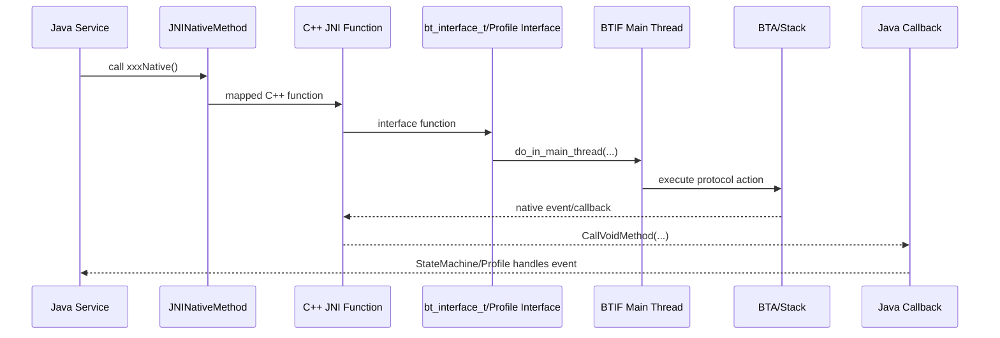

# 03. JNI 桥接与回调：Java 和 Native 如何互相说话

## 1. 学习目标

这一章解决一个很关键的问题：当你在 Java 层看到 `xxxNative()`，它到底怎么找到 C++ 函数？当 Controller 或协议栈有事件回来时，Native 又怎么通知 `AdapterService`、`A2dpService` 这些 Java 类？

读完后，你应该能独立追踪：

- Java/Kotlin Service 调 Native 的注册表。
- Native 回调 Java 的方法缓存。
- `JNIEnv`、`jobject`、`jmethodID` 在蓝牙代码中的基本用法。
- 为什么很多 BTIF 动作要丢到 `do_in_main_thread(...)`。

## 2. 前置知识

- Java native 方法：Java 声明一个 native 函数，真正实现放在 C/C++。
- JNI 签名：`([BII)Z` 这种字符串描述参数和返回值。
- C++ 函数指针：注册表里把一个名字映射到一个 C++ 函数地址。
- 回调：Native 事件发生后，反向调用 Java 方法。
- 线程：蓝牙栈用专门线程串行化很多协议动作，避免状态机并发乱序。

## 3. Java 调 Native 的总体模型


可以把 `JNINativeMethod` 理解成一张中英词典：

- Java 说：我要调用 `startDiscoveryNative()`。
- 注册表说：这个名字对应 C++ 的 `startDiscoveryNative` 函数。
- C++ 函数再去调用 Native 蓝牙接口。

## 4. AdapterService 的 JNI 注册表

`AdapterService` 是基础蓝牙能力的大门，开关、扫描、配对、删除配对都能在这里看到。

```cpp
// android/app/jni/com_android_bluetooth_btservice_AdapterService.cpp
2197 static int register_com_android_bluetooth_btservice_AdapterService(JNIEnv* env) {
2198   const JNINativeMethod methods[] = {
2199           {"initNative", "(ZZIZLjava/lang/String;)Z", reinterpret_cast<void*>(initNative)},
2200           {"cleanupNative", "()V", reinterpret_cast<void*>(cleanupNative)},
2201           {"enableNative", "()Z", reinterpret_cast<void*>(enableNative)},
2202           {"disableNative", "()Z", reinterpret_cast<void*>(disableNative)},
2210           {"startDiscoveryNative", "()Z", reinterpret_cast<void*>(startDiscoveryNative)},
2211           {"cancelDiscoveryNative", "()Z", reinterpret_cast<void*>(cancelDiscoveryNative)},
2212           {"createBondNative", "([BII)Z", reinterpret_cast<void*>(createBondNative)},
2216           {"removeBondNative", "([B)Z", reinterpret_cast<void*>(removeBondNative)},
```

这一段有三个字段：

| 字段 | 例子 | 含义 |
| --- | --- | --- |
| Java 方法名 | `createBondNative` | Java 里声明/调用的 native 方法名 |
| JNI 签名 | `([BII)Z` | 参数是 byte[]、int、int，返回 boolean |
| C++ 函数地址 | `reinterpret_cast<void*>(createBondNative)` | 真正执行的 C++ 函数 |

C++ 补课：`reinterpret_cast<void*>` 是一种强制类型转换。这里的用途不是业务逻辑，而是把具体函数指针塞进 JNI 注册表要求的通用指针槽位。

## 5. A2DP 的 JNI 注册表示例

A2DP Profile 的注册表更贴近车载音乐场景。

```cpp
// android/app/jni/com_android_bluetooth_a2dp.cpp
508   const JNINativeMethod methods[] = {
509           {"initNative",
510            "(I[Landroid/bluetooth/BluetoothCodecConfig;"
511            "[Landroid/bluetooth/BluetoothCodecConfig;)V",
512            (void*)initNative},
516           {"connectA2dpNative", "([B)Z", (void*)connectA2dpNative},
517           {"disconnectA2dpNative", "([B)Z", (void*)disconnectA2dpNative},
518           {"setSilenceDeviceNative", "([BZ)Z", (void*)setSilenceDeviceNative},
519           {"setActiveDeviceNative", "([B)Z", (void*)setActiveDeviceNative},
520           {"setCodecConfigPreferenceNative", "([B[Landroid/bluetooth/BluetoothCodecConfig;)Z",
521            (void*)setCodecConfigPreferenceNative},
522   };
523   const int result =
524           REGISTER_NATIVE_METHODS(env, "com/android/bluetooth/a2dp/A2dpNativeInterface", methods);
```

这里告诉我们：Java 类 `com/android/bluetooth/a2dp/A2dpNativeInterface` 里的 native 方法，会绑定到这个 C++ 文件中的函数。

车载音乐连接的第一跳就是：

```cpp
// android/app/jni/com_android_bluetooth_a2dp.cpp
408 static jboolean connectA2dpNative(JNIEnv* env, jobject /* object */, jbyteArray address) {
416   RawAddress bd_addr = RawAddress::FromOctets(reinterpret_cast<const uint8_t*>(addr));
419   bt_status_t status = btif_av_source_connect(bd_addr);
424   return (status == BT_STATUS_SUCCESS) ? JNI_TRUE : JNI_FALSE;
}
```

`jbyteArray address` 是 Java 传来的蓝牙地址，C++ 转成 `RawAddress` 后调用 `btif_av_source_connect(...)`。所以 A2DP 连不上时，Java 层之后的第一个 Native 断点可以放在这里。

## 6. Native 回调 Java 的方法缓存

Java 调 Native 是“注册 C++ 函数”。Native 回调 Java 则反过来：C++ 先把 Java 方法 ID 找出来并缓存，事件来时直接调用。

```cpp
// android/app/jni/com_android_bluetooth_btservice_AdapterService.cpp
2279   const JNIJavaMethod javaMethods[] = {
2282           {"stateChangeCallback", "(I)V", &method_stateChangeCallback},
2283           {"adapterPropertyChangedCallback", "([I[[B)V", &method_adapterPropertyChangedCallback},
2284           {"discoveryStateChangeCallback", "(I)V", &method_discoveryStateChangeCallback},
2285           {"devicePropertyChangedCallback", "([BI[I[[B)V", &method_devicePropertyChangedCallback},
2286           {"deviceFoundCallback", "([B)V", &method_deviceFoundCallback},
2289           {"bondStateChangeCallback", "(I[BII)V", &method_bondStateChangeCallback},
```

这些 `method_xxxCallback` 是 `jmethodID`。你可以把它理解成“Java 方法的门牌号”。C++ 不想每次事件来都按名字找门牌，所以启动时先缓存。

缓存逻辑在工具函数里：

```cpp
// android/app/jni/com_android_bluetooth_btservice_AdapterService.cpp
2497 void jniGetMethodsOrDie(JNIEnv* env, const char* className, const JNIJavaMethod* methods,
2498                         int nMethods) {
2499   jclass clazz = env->FindClass(className);
2504   for (int i = 0; i < nMethods; i++) {
2505     const JNIJavaMethod& method = methods[i];
2507       *method.id = env->GetStaticMethodID(clazz, method.name, method.signature);
```

`OrDie` 这个名字很直接：方法找不到就 fatal。因为 JNI 注册和方法缓存如果错了，蓝牙服务继续跑下去只会产生更隐蔽的问题。

## 7. 事件如何从 Native 回来

以扫描状态变化为例：

```cpp
// android/app/jni/com_android_bluetooth_btservice_AdapterService.cpp
475     return;
478   log::verbose("DiscoveryState:{}", state);
480   sCallbackEnv->CallVoidMethod(sJniCallbacksObj, method_discoveryStateChangeCallback, (jint)state);
```

以配对状态变化为例：

```cpp
// android/app/jni/com_android_bluetooth_btservice_AdapterService.cpp
366   sCallbackEnv->SetByteArrayRegion(addr.get(), 0, sizeof(RawAddress),
367                                    reinterpret_cast<jbyte*>(bd_addr));
369   sCallbackEnv->CallVoidMethod(sJniCallbacksObj, method_bondStateChangeCallback, (jint)status,
370                                addr.get(), (jint)state, (jint)fail_reason);
```

以 Adapter 状态变化为例：

```cpp
// android/app/jni/com_android_bluetooth_btservice_AdapterService.cpp
149   CallbackEnv sCallbackEnv(__func__);
150   if (!sCallbackEnv.valid()) {
151     return;
152   }
155   sCallbackEnv->CallVoidMethod(sJniCallbacksObj, method_stateChangeCallback, (jint)status);
```

`CallbackEnv` 的作用是拿到当前线程可用的 `JNIEnv`。JNIEnv 和线程绑定，不能简单地把一个线程里的 `JNIEnv*` 随便拿到另一个线程用。

## 8. A2DP 回调示例

A2DP 也用相同模型。先缓存 Java 回调方法：

```cpp
// android/app/jni/com_android_bluetooth_a2dp.cpp
529   const JNIJavaMethod javaMethods[] = {
530           {"onConnectionStateChanged", "([BII)V",
531            &android_bluetooth_A2dpNativeCallback.onConnectionStateChanged},
532           {"onAudioStateChanged", "([BI)V",
533            &android_bluetooth_A2dpNativeCallback.onAudioStateChanged},
```

连接状态回来时调用 Java：

```cpp
// android/app/jni/com_android_bluetooth_a2dp.cpp
110   sCallbackEnv->SetByteArrayRegion(addr.get(), 0, sizeof(RawAddress),
111                                    reinterpret_cast<const jbyte*>(bd_addr.address.data()));
112   sCallbackEnv->CallVoidMethod(mCallbacksObj,
113                                android_bluetooth_A2dpNativeCallback.onConnectionStateChanged,
114                                addr.get(), (jint)state, (jint)error.error_code);
```

车机音乐排查时，如果 Native 已经收到 A2DP 连接状态但 UI 没更新，就要看这个回调是否成功进到 Java 层，再看 `A2dpStateMachine` 是否消费了事件。

## 9. BTIF 为什么要切主线程

在 `system/btif/src/bluetooth.cc` 里，很多接口不是直接执行，而是投递到主线程：

```cpp
// system/btif/src/bluetooth.cc
591 static int start_discovery(void) {
592   if (!interface_ready()) {
593     return BT_STATUS_NOT_READY;
594   }
596   do_in_main_thread(base::BindOnce(btif_dm_start_discovery));
597   return BT_STATUS_SUCCESS;
}
609 static int create_bond(const RawAddress* bd_addr, int transport) {
610   if (!interface_ready()) {
611     return BT_STATUS_NOT_READY;
612   }
613   if (btif_dm_pairing_is_busy()) {
614     return BT_STATUS_BUSY;
615   }
617   do_in_main_thread(base::BindOnce(btif_dm_create_bond, *bd_addr, to_bt_transport(transport)));
```

这段很重要。蓝牙协议栈是事件驱动的，如果扫描、配对、连接等操作从多个线程同时改状态，问题会非常难查。`do_in_main_thread(...)` 的意义是把动作排队到 BTIF 主线程，按顺序处理。

接口表把上层调用和这些 C++ 函数连接起来：

```cpp
// system/btif/src/bluetooth.cc
1228         .start_discovery = start_discovery,
1229         .cancel_discovery = cancel_discovery,
1230         .create_bond = create_bond,
1231         .create_bond_le = create_bond_le,
1232         .create_bond_out_of_band = create_bond_out_of_band,
1233         .remove_bond = remove_bond,
```

这也是为什么你追 Java 到 JNI 后，经常下一站是一个函数表，而不是直接进某个类方法。

## 10. 完整方向图



## 11. 本章练习

- 用 `rg -n "const JNINativeMethod methods\\[\\]" android/app/jni` 找出所有 JNI 注册表。
- 用 `rg -n "CallVoidMethod" android/app/jni/com_android_bluetooth_a2dp.cpp` 找 A2DP 所有回调到 Java 的位置。
- 用 `rg -n "do_in_main_thread" system/btif/src/bluetooth.cc` 看看哪些基础接口会被投递到 BTIF 主线程。
- 试着解释 `([BII)Z`：`[` 是数组，`B` 是 byte，`I` 是 int，`Z` 是 boolean。

