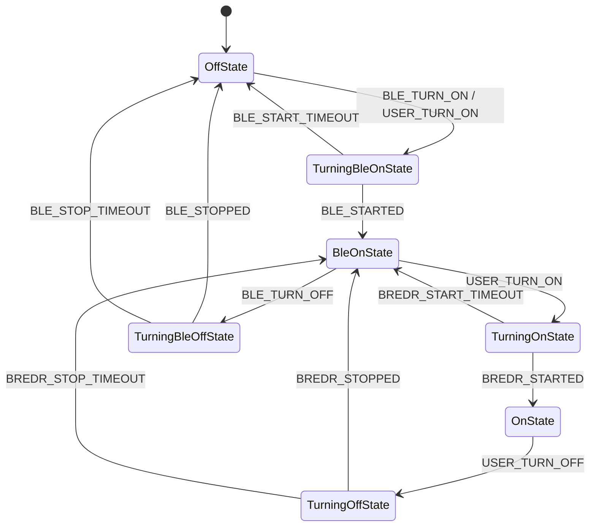
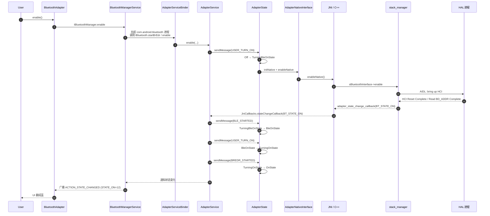

# 03.1 蓝牙开关：从 `enable()` 到 HCI Reset 的全链路

> 速通摘要：从 App 点 "开"，到芯片回 `HCI Command Complete`，蓝牙开关流程跨 **3 个进程、7 个层、2 个状态机**。Java 端有 `AdapterState`（7 子态，对外简化成 4 态广播）；Native 端有 `stack_manager` 的同步启动序列。**理解开关，就理解了整套蓝牙的初始化骨架**。

---

## 1. 学习目标

读完本节，你应该能：

1. 默写 7 层进程边界与开关时序。
2. 看懂 `AdapterState` 状态机 7 个内部子态如何映射到对外 4 态。
3. 知道 `BLE_STARTED` / `BREDR_STARTED` 双阶段启动模型为什么存在。
4. 排查"开关卡在 TURNING_ON 不返回"类问题的 5 个切入点。

---

## 2. 前置知识

- 已读 02 章、04 章。
- 知道 Android `StateMachine`（`com.android.internal.util.StateMachine`）的层级状态机模型。

---

## 3. 场景故事：用户按下"打开蓝牙"

```
用户点开关 (HMI)
   │
   ▼  通过 BluetoothManager.getAdapter().enable()
[BluetoothAdapter]  ← Java framework
   │
   ▼  Binder → IBluetoothManager.enable
[BluetoothManagerService]  ← system_server (Kotlin)
   │  - 检查飞行模式 / 用户 / 政策
   │  - 启动 com.android.bluetooth 进程（首次）
   ▼  Binder → IBluetooth.enable / 直接调
[AdapterService]  ← 蓝牙 App 进程
   │  - mAdapterStateMachine.sendMessage(USER_TURN_ON 或 BLE_TURN_ON)
   ▼
[AdapterState 状态机]
   │  OffState → TurningBleOnState → BleOnState → TurningOnState → OnState
   ▼  调 AdapterNativeInterface.initNative/enableNative
[JNI / Native]
   │  sBluetoothInterface->init(callbacks, ...) → enable()
   ▼
[stack_manager → BTA → Stack → GD]
   │  init_stack → start_up_stack → HCI Reset → Read Local Features → ...
   ▼  与 HAL 进程通信
[HAL 进程]
   │  AIDL → 物理传输（UART/USB）
   ▼
[蓝牙芯片]
   │  HCI Command Complete (Reset, Read Local Features, ...)
   ▼  反向 → JNI Native→Java 回调 stateChangeCallback
[AdapterService.stateChangeCallback(BT_STATE_ON)]
   │  → sendMessage(BLE_STARTED) → BleOnState
   │  随后再触发 BREDR_STARTED → OnState
   ▼
广播 ACTION_STATE_CHANGED  STATE_TURNING_ON(11) → STATE_ON(12)
```

---

## 4. `AdapterState` 状态机（7 子态 ↔ 4 公开态）



**对外 4 公开态**（来自 `BluetoothAdapter.java:221`）：
| 公开态 | 对应内部状态 |
|--------|------------|
| `STATE_OFF` (10) | OffState |
| `STATE_TURNING_ON` (11) | TurningBleOnState + TurningOnState（合并暴露） |
| `STATE_ON` (12) | OnState |
| `STATE_TURNING_OFF` (13) | TurningOffState + TurningBleOffState（合并暴露） |

> 隐藏的 `STATE_BLE_*` 在 BLE-only 场景（例如某些扫描）才会被看见。

源码位置：
- `AdapterState.java:56`（类）
- `AdapterState.java:59-:70`（消息常量）
- `AdapterState.java:85-:91`（7 子态实例）
- `AdapterState.java:147-:165`（基类 `BaseAdapterState.enter()`，每次进入子态都调 `mAdapterService.updateAdapterState(prev, curr)` 派发到 Binder + 广播）

---

## 5. 为什么有 BLE-only 中间态

蓝牙开关是**两段**：
1. 先把"BLE 核心 + HCI 已就绪"拉起来（`STATE_BLE_TURNING_ON → STATE_BLE_ON`），此时可以做 BLE 扫描、广告（即使整体蓝牙 UI 显示"关"）。
2. 再把 Classic（BR/EDR）拉起来（`STATE_TURNING_ON → STATE_ON`），整体可用。

这样做的好处：**Wi-Fi、Nearby、UWB 等子系统**只需要 BLE 也能工作（如 RTT、设备发现），不必把整套 Classic 都加载。

车机场景：开机自检阶段可能只跑 BLE-only，等用户进入主屏才升级到完整 Classic。

---

## 6. Native 端启动序列：`stack_manager`

JNI 拿到 `bt_interface_t->init(&sBluetoothCallbacks, ...)` 后，会走 BTIF 的 `stack_manager`：

```cpp
// 思路图：来自 system/btif/src/stack_manager.cc:115 起
static void event_init_stack(promise, CoreInterface*);
static void event_start_up_stack(CoreInterface*, startProfiles, stopProfiles);
static void init_stack(CoreInterface*);
static void start_up_stack_async(CoreInterface*, ...);
static void init_stack_internal(CoreInterface*);
```

`init_stack_internal` 里关键步骤（节选）：
```cpp
static void init_stack_internal(bluetooth::core::CoreInterface* interface) {
  main_thread_start_up();                      // ① 启动 BTU 主线程
  module_start_up(get_local_module(GD_SHIM_MODULE));   // ② 启动 GD shim 模块
  // ...继续加载 HCI、Storage、HAL adapter 等子模块
}
```

之后 `start_up_stack`（异步）会：
1. 让 HAL 上电（通过 AIDL）。
2. 发 `HCI_Reset`。
3. 发 `HCI_Read_Local_Supported_Features`、`HCI_Read_BD_ADDR` 等"必备问询"。
4. 完成时通过 `bt_callbacks_t.adapter_state_changed_callback(BT_STATE_ON)` 回到 JNI → `JniCallbacks.stateChangeCallback(int)`。

源码路径：`system/btif/src/stack_manager.cc:115` 起、`:198 init_stack_internal`、`:220 event_init_stack`、`:142 start_up_stack_async`。

---

## 7. Java 端回调进入：`stateChangeCallback`

来自 `AdapterService.java:1616`：

```java
void stateChangeCallback(int status) {
    if (status == AbstractionLayer.BT_STATE_OFF) {
        Log.d(TAG, "stateChangeCallback: disableNative() completed");
        mAdapterStateMachine.sendMessage(AdapterState.BLE_STOPPED);
    } else if (status == AbstractionLayer.BT_STATE_ON) {
        mAdapterStateMachine.sendMessage(AdapterState.BLE_STARTED);
    } else {
        Log.e(TAG, "Incorrect status " + status + " in stateChangeCallback");
    }
}
```

注意：Native 回的 `BT_STATE_ON` 在 Java 端只触发 `BLE_STARTED`（让状态机进入 `BleOnState`），随后 `AdapterService` 再发 `USER_TURN_ON`/`BREDR_STARTED` 推进到 `OnState`。这就是"两段启动"在 Java 端的体现。

---

## 8. Mermaid：完整时序（开机一次）



---

## 9. 关键源码点速查

| 文件:行 | 角色 |
|---------|------|
| `framework/java/android/bluetooth/BluetoothAdapter.java:1591` | `enable()` Java 入口 |
| `service/src/BluetoothService.kt` | system_server 端策略 + 进程拉起 |
| `android/app/src/com/android/bluetooth/btservice/AdapterService.java:1616` | `stateChangeCallback` |
| `android/app/src/com/android/bluetooth/btservice/AdapterState.java:56` | 状态机类 |
| `android/app/src/com/android/bluetooth/btservice/AdapterState.java:85-:91` | 7 个内部子态实例 |
| `android/app/src/com/android/bluetooth/btservice/AdapterNativeInterface.java:305` | `initNative` |
| `android/app/src/com/android/bluetooth/btservice/AdapterNativeInterface.java:314` | `enableNative` |
| `android/app/jni/com_android_bluetooth_btservice_AdapterService.cpp:1107` | C 端 `enableNative` |
| `system/btif/src/bluetooth.cc` | `bluetoothInterface.enable` |
| `system/btif/src/stack_manager.cc:115` 起 | 栈启动主入口 |

---

## 10. 调试方法

| 想确认 | 命令 / 日志 |
|--------|------------|
| 状态机当前态 | `dumpsys bluetooth_manager`，找 `AdapterState` 段 |
| 状态切换历史 | logcat `BluetoothAdapterState`、`BluetoothAdapterService` |
| Native 是否就绪 | logcat `BluetoothJniCallbacks` 的 `stateChangeCallback`，看是否回 `BT_STATE_ON` |
| HCI 命令时序 | btsnoop_hci.log（Wireshark 打开） + `bt_stack` log tag |
| HAL 起不起来 | `adb shell ps -A \| grep bluetooth`，看 `android.hardware.bluetooth-service.*` 是否在跑 |
| 超时类型 | logcat 关键字 `BLE_START_TIMEOUT` / `BREDR_START_TIMEOUT`（4s × `ro.hw_timeout_multiplier`） |

---

## 11. FAQ

**Q1：开机自动开蓝牙是谁触发的？**
A：`service/src/AutoOn.kt`。它根据上次关机时的状态、用户偏好、车机 vendor 设置决定。详 09 章。

**Q2：为什么从 `STATE_TURNING_ON` 卡住不动？**
A：常见三种：
- HAL 进程没起来（看 `init` 服务列表）。
- HCI Reset 没回（芯片复位失败 → 检查 GPIO/UART 配线）。
- BTA 内部死锁（很罕见，看 `btu_task` 是否在跑）。
四秒后 `BREDR_START_TIMEOUT` 会强制把状态机带回 `BleOnState`，再两次失败后 `BluetoothManagerService` 杀蓝牙 App 进程重启。

**Q3：能不能不经过 BLE-only 中间态直接到 ON？**
A：不能，状态机硬编码就是 "Off → BleOn → On"。这是 AOSP 设计。车机定制如果改动这个，可能影响 Wi-Fi/Nearby。

**Q4：BLE-only 状态有什么场景？**
A：Wi-Fi 服务在用 BLE 做 RTT 测距、Nearby Share 在做 BLE 广告等。蓝牙整体"关"但 BLE 仍可用。

**Q5：关蓝牙后再开，时间能多快？**
A：典型 1.5-3 秒。优化点：HAL 不重复 dlopen、`bt_config.conf` 缓存命中、Profile 顺序合理（参考 `Config.java`）。

---

## 12. 上路任务

### 任务 A：跟踪一次开机日志
```bash
adb logcat -c
adb shell svc bluetooth disable && sleep 2 && adb shell svc bluetooth enable
adb logcat -d | grep -E "AdapterState|AdapterService|stateChangeCallback|stack_manager|BT_STATE"
```
你应该看到完整的 `USER_TURN_ON → TurningBleOnState → BLE_STARTED → BleOnState → TurningOnState → BREDR_STARTED → OnState` 路径。

### 任务 B：制造一次超时
临时把 `ro.hw_timeout_multiplier` 改成 100（10 秒 × 100 = 1000s）来禁止超时，或反之改成 0 制造瞬时超时。观察状态机行为（注意：仅在测试机上做）。

### 任务 C：阅读 `stack_manager.cc:198` `init_stack_internal`
默想：`main_thread_start_up()` 与 `module_start_up(GD_SHIM_MODULE)` 哪个失败会让状态机进入 `BLE_START_TIMEOUT`？

---

## 13. 本节小结（速记卡）

```
开关 = Java 7 子态 ↔ 对外 4 公开态
两段启动：Off → BleOn → On
关键消息：USER_TURN_ON / BLE_STARTED / BREDR_STARTED
关键回调：stateChangeCallback(BT_STATE_ON) 来自 native
关键超时：BLE_START_TIMEOUT / BREDR_START_TIMEOUT（默认 4s × multiplier）
关键源码：AdapterState.java + AdapterService.java:1616 + stack_manager.cc:198
```
