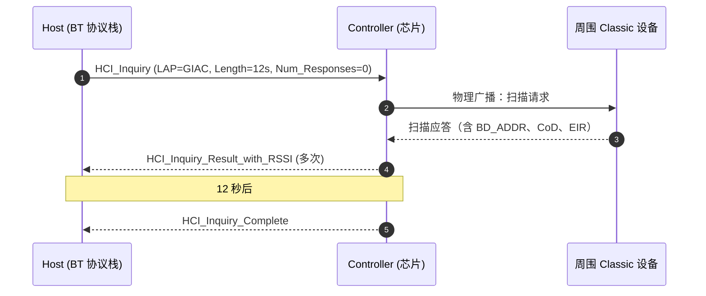
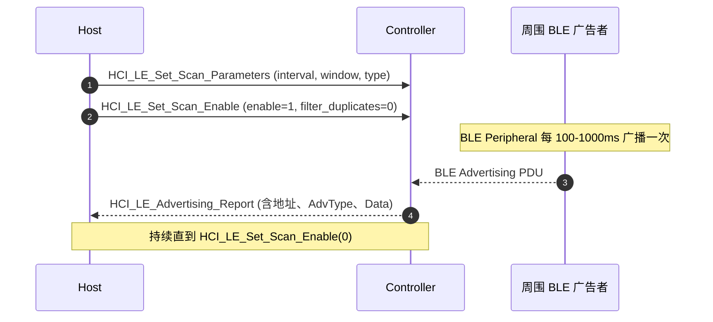
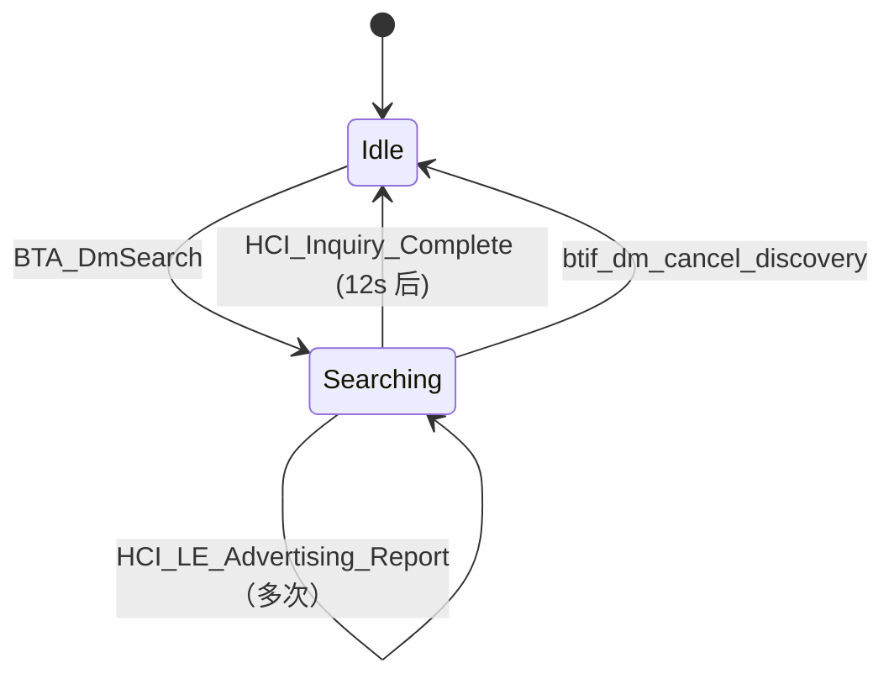

# 03.2 设备扫描：Inquiry 与 LE Scan 双路径

> 速通摘要：Android 一句 `startDiscovery()` 同时拉起 **Classic Inquiry** 和 **LE Scan**——发出去的是两条 HCI 命令（`HCI_Inquiry` 和 `HCI_LE_Set_Scan_Enable`），返回的是两种事件（`HCI_Inquiry_Result` 和 `HCI_LE_Advertising_Report`）。BTIF 把它们合并成统一的"`device_found_callback`"回到 Java。本节把两条路径并列拆开看。

---

## 1. 学习目标

读完本节，你应该能：

1. 区分 **Classic 扫描（Inquiry）** 与 **BLE 扫描** 的协议机制。
2. 看懂 `startDiscovery` 一句话怎么在 BTA/Stack 里发出两组 HCI 命令。
3. 知道 `BluetoothLeScanner`（专用 LE API）与 `BluetoothAdapter.startDiscovery()` 的角色差异。
4. 排查"扫不到设备"类问题的 6 个切入点。

---

## 2. 前置知识

- 已读 02、04、03.1。
- 知道蓝牙 Classic 与 BLE 是两个不同协议族（00.3 章）。

---

## 3. 场景故事：车机想找你的手机

```
车机 HMI 点"搜索"
   │
   ▼
BluetoothAdapter.startDiscovery()
   │  Binder → AdapterServiceBinder.startDiscovery → AdapterService.startDiscovery
   ▼
AdapterNativeInterface.startDiscoveryNative()
   │  JNI → sBluetoothInterface->start_discovery()
   ▼
btif_dm_start_discovery()           ← system/btif/src/btif_dm.cc:2726
   │  BTA_DmSearch(btif_dm_search_devices_evt)
   ▼
bta_dm_disc_start_device_discovery()  ← system/bta/dm/bta_dm_api.cc:81
   │  分两路：
   ├──▶ Classic：HCI_Inquiry + Extended Inquiry Result
   └──▶ BLE:    HCI_LE_Set_Scan_Parameters + HCI_LE_Set_Scan_Enable
   │
扫到设备时：
   │  Classic: HCI_Inquiry_Result(_RSSI/_with_EIR)
   │  BLE:    HCI_LE_Advertising_Report
   ▼
统一回到 BTIF：btif_dm_search_devices_evt(BT_DM_INQUIRY_RES, ...)
   │
   ▼
jniCallbacks 调 deviceFoundCallback(byte[] addr)
   │
   ▼
RemoteDevices.deviceFoundCallback(byte[]) → 发广播
   │
   ▼
ACTION_FOUND（带 EXTRA_DEVICE / EXTRA_NAME / EXTRA_RSSI 等）
```

---

## 4. 三种"扫描"入口的区别

Android 蓝牙有 **三套扫描 API**，新手容易混淆：

| 入口 | 类型 | 行为 |
|------|------|------|
| `BluetoothAdapter.startDiscovery()` | "传统蓝牙发现" | **同时**做 Classic Inquiry + LE Scan，发 `ACTION_FOUND` 广播。**车机常用**。 |
| `BluetoothLeScanner.startScan(...)` | "BLE 专用扫描" | 只做 LE Scan，回调 `ScanCallback`，更细粒度（filter / 设置 mode） |
| `BluetoothAdapter.listenUsingRfcomm...` | 不是扫描 | 仅作为对照——是"被发现"端 |

**关键区别**：`startDiscovery()` 一定持续 12 秒（Classic Inquiry 物理上限），中途无法过滤；`BluetoothLeScanner` 可长时间扫，支持 filter（按 UUID / 厂商 ID / Name 等）和不同模式（LOW_POWER / BALANCED / LOW_LATENCY）。

---

## 5. Classic 扫描（Inquiry）协议机制



栈侧入口：
- BTM 层：`system/stack/btm/btm_inq.cc:642 BTM_StartInquiry`
- BTA 层：`system/bta/dm/bta_dm_device_search.cc`（搜索状态机 `tBTA_DM_DEVICE_SEARCH_STATE`）
- BTA API：`system/bta/dm/bta_dm_api.cc:81 BTA_DmSearch`

每收到一条 `HCI_Inquiry_Result_*`，BTM 解出 `RawAddress + CoD + RSSI + EIR(Extended Inquiry Response)`，把结果上抛到 BTA，再到 BTIF。

---

## 6. BLE 扫描协议机制



栈侧入口：
- BTM 层：`system/stack/btm/btm_ble_scanner.cc`
- BTA 层：`system/bta/dm/bta_dm_*` 内的 BLE 部分（与 Classic 共享 search 状态机）
- 上层 LE 专用：`android/app/src/com/android/bluetooth/le_scan/`、JNI 用 `com_android_bluetooth_scan.cpp`

---

## 7. 关键源码点速查

| 文件:行 | 角色 |
|---------|------|
| `framework/java/android/bluetooth/BluetoothAdapter.java:1988` | `startDiscovery()` Java 入口 |
| `framework/java/android/bluetooth/BluetoothAdapter.java:2013` | `cancelDiscovery()` |
| `framework/java/android/bluetooth/le/BluetoothLeScanner.java` | LE 专用扫描 API |
| `android/app/src/com/android/bluetooth/btservice/AdapterService.java:2703` | `startDiscovery(AttributionSource)` |
| `android/app/src/com/android/bluetooth/btservice/AdapterNativeInterface.java:347` | `startDiscoveryNative()` |
| `android/app/jni/com_android_bluetooth_btservice_AdapterService.cpp:1132` | C 端 `startDiscoveryNative` |
| `system/btif/src/btif_dm.cc:2726` | `btif_dm_start_discovery()` |
| `system/bta/dm/bta_dm_api.cc:81` | `BTA_DmSearch` 入口 |
| `system/bta/dm/bta_dm_device_search.cc` | 搜索状态机 |
| `system/stack/btm/btm_inq.cc:642` | `BTM_StartInquiry` (Classic) |
| `system/stack/btm/btm_ble_scanner.cc` | BLE Scan |
| `android/app/src/com/android/bluetooth/le_scan/` | LE 专用 Service |

---

## 8. 简化代码片段

### 8.1 BTIF 端的扫描入口（`btif_dm.cc:2726`）

```cpp
void btif_dm_start_discovery(void) {
  log::verbose("start device discover/inquiry");
  BTM_LogHistory(kBtmLogTag, RawAddress::kEmpty, "Device discovery",
                 std::format("is_request_queued:{:c}",
                             bta_dm_is_search_request_queued() ? 'T' : 'F'));

  if (bta_dm_is_search_request_queued()) {
    log::info("skipping start discovery because a request is queued");
    return;
  }

  btif_dm_inquiry_in_progress = false;
  BTA_DmSearch(btif_dm_search_devices_evt);     // ← 进入 BTA
  power_telemetry::GetInstance().LogScanStarted();
}
```

### 8.2 BTA API 入口（`bta_dm_api.cc:81`）

```cpp
void BTA_DmSearch(tBTA_DM_SEARCH_CBACK* p_cback) {
    bta_dm_disc_start_device_discovery(p_cback);  // 转入搜索状态机
}
```

### 8.3 搜索状态机（`bta_dm_device_search.cc`）

`tBTA_DM_DEVICE_SEARCH_STATE` 是一组 enum 状态：`IDLE / SEARCHING / DISCOVERING_LE / DISCOVERING_BREDR / ...`。
状态机收到 `BTA_DM_API_SEARCH_EVT` 等事件后驱动 BTM 发对应 HCI 命令。

---

## 9. Discovery 全周期（包括取消）



对应 Java 端：
- `ACTION_DISCOVERY_STARTED` 广播
- `ACTION_FOUND` 广播（每发现一个设备一次）
- `ACTION_DISCOVERY_FINISHED` 广播

---

## 10. 调试方法

| 想看 | 方法 |
|------|------|
| 扫描是否开始 | logcat `BluetoothAdapterService.*startDiscovery` |
| BTA 状态机 | logcat `bt_bta_dm` 关键字 |
| HCI 命令实际下发 | btsnoop_hci.log，看 `HCI_Inquiry` / `HCI_LE_Set_Scan_Enable` 命令 |
| 是否真的有设备回应 | btsnoop 看 `Inquiry Result` / `LE Advertising Report` |
| 扫描周期内的设备列表 | `dumpsys bluetooth_manager` → `Inquiry result list` 段 |
| `ACTION_FOUND` 广播间隔 | 在 BroadcastReceiver 加时间戳打印 |

---

## 11. FAQ

**Q1：为什么扫描总是 12 秒？**
A：Classic Inquiry 的协议规定。BLE 扫描可以更长，但 `startDiscovery()` 受 Classic 限制。

**Q2：扫不到 BLE 设备怎么办？**
A：检查清单：
1. 对方是否真的在广告（用 nrf Connect 验证）。
2. 你的 App 是否有 `BLUETOOTH_SCAN` 权限 + `ACCESS_FINE_LOCATION`（旧 SDK）。
3. `dumpsys bluetooth_manager` 看 LE Scan 是否真的开启。
4. BLE 扫描 mode 是否太省电（`SCAN_MODE_LOW_POWER` 间隔大）。
5. filter 是否过严（试一次全空 filter）。
6. 设备地址类型（RPA 会变化，要按 UUID/name 过滤）。

**Q3：`startDiscovery()` 比 `BluetoothLeScanner.startScan()` 慢吗？**
A：BLE 扫描部分两者最终走同一路径；但 `startDiscovery()` 同时做 Classic，物理资源争抢可能让 BLE 报告间隔变大。建议**只需 BLE 时用 `BluetoothLeScanner`**。

**Q4：扫描时 A2DP 会卡吗？**
A：会。Classic Inquiry 占用射频时段，会让正在传的 A2DP 出现微小卡顿。所以"播音乐时扫描"是常见 bug 触发条件。

**Q5：扫描期间是否能被对方"扫到"？**
A：能不能扫到本机由 `setScanMode` 决定（`SCAN_MODE_CONNECTABLE_DISCOVERABLE` 才能被搜到）。扫描本机不影响"是否可被发现"。

---

## 12. 上路任务

### 任务 A：抓一次完整扫描的 btsnoop
启动 BTSnoop 后，在车机调 `startDiscovery()`，等 12 秒。用 Wireshark 打开看：
- 第一帧是不是 `HCI_Inquiry`？
- 后续是不是夹杂 `LE Set Scan Enable`？
- 最后是不是 `Inquiry Complete`？

### 任务 B：对比 BLE 专用扫描
写两段 App 代码：① `startDiscovery()`，② `BluetoothLeScanner.startScan(filters, settings, callback)`。各跑 30 秒，记录扫到 BLE 设备的数量与时间分布。

### 任务 C：跟踪 `BTA_DmSearch` 到 BTM
```bash
grep -n "BTA_DmSearch\|bta_dm_disc_start_device_discovery" system/bta/dm/*.cc
grep -n "BTM_StartInquiry" system/stack/btm/btm_inq.cc
```
画出 BTA 调到 BTM 的精确路径。

---

## 13. 本节小结（速记卡）

```
startDiscovery() = Classic Inquiry + LE Scan 并发
关键 HCI 命令：HCI_Inquiry / HCI_LE_Set_Scan_Enable
关键 HCI 事件：Inquiry_Result / LE_Advertising_Report / Inquiry_Complete
入口栈：
  framework BluetoothAdapter.startDiscovery
  → AdapterService.startDiscovery
  → AdapterNativeInterface.startDiscoveryNative
  → JNI startDiscoveryNative
  → btif_dm_start_discovery (system/btif/src/btif_dm.cc:2726)
  → BTA_DmSearch (system/bta/dm/bta_dm_api.cc:81)
  → bta_dm_disc_start_device_discovery
  → BTM_StartInquiry (Classic) + BTM_BleScan (BLE)
回上：deviceFoundCallback / discoveryStateChangeCallback
广播：ACTION_DISCOVERY_STARTED / ACTION_FOUND / ACTION_DISCOVERY_FINISHED
```
