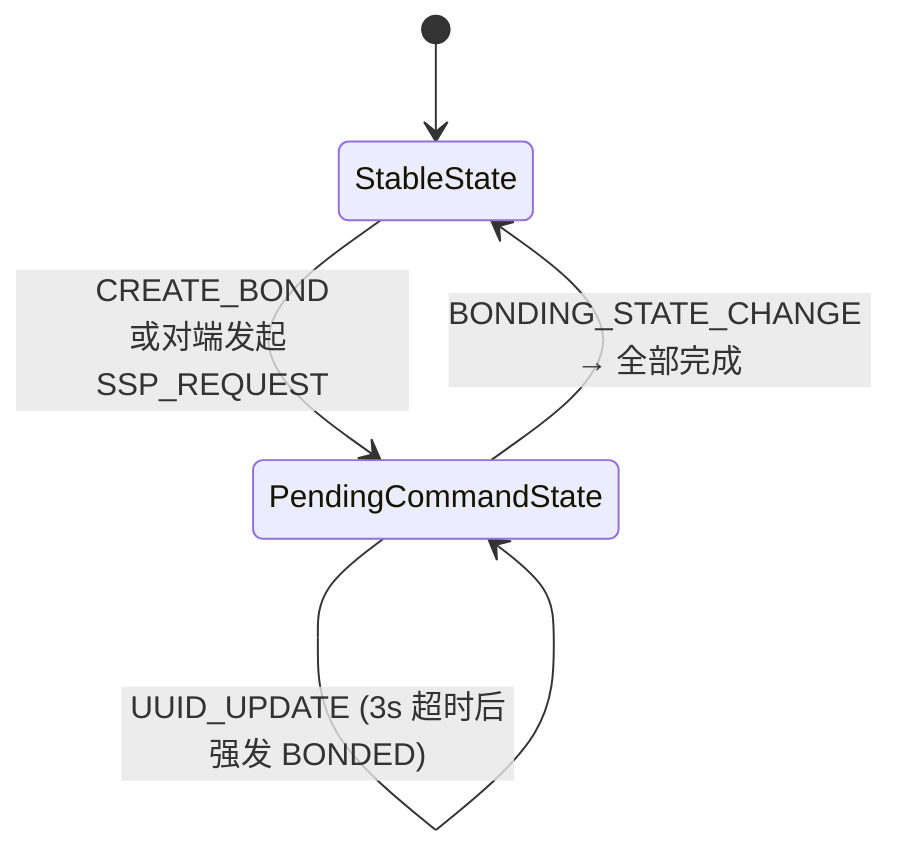
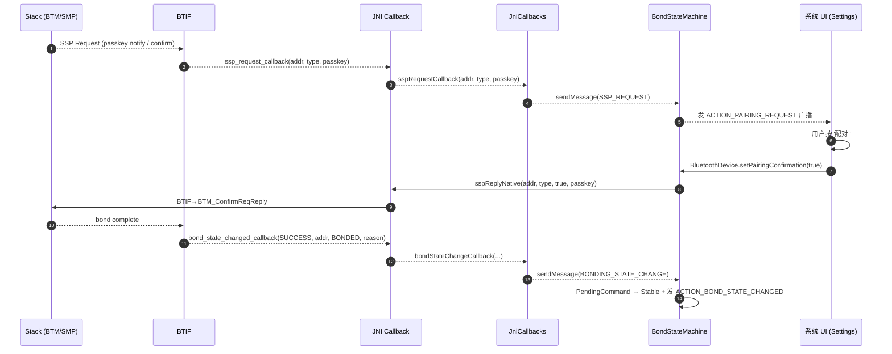

# 03.3 配对（Bonding）：`BondStateMachine` 与 SMP

> 速通摘要：配对是"建立设备级信任"的一次性动作。Android 用两段状态机管：上层 `BondStateMachine`（2 子态 + 7 个 message） + 底层栈侧的 SSP/SMP 协议（Classic 用 SSP，BLE 用 SMP）。流程的核心难点不是代码，而是"用户交互"——Passkey、Just Works、PIN、PairingConfirmation 这些密钥派生方式由协议决定，**Java 端只是把请求广播给 UI**。

源码：`android/app/src/com/android/bluetooth/btservice/BondStateMachine.java:65`

---

## 1. 学习目标

读完本节，你应该能：

1. 默写 `BondStateMachine` 的 2 个子态、7 个 message。
2. 区分 SSP / SMP / Legacy Pairing 三种"密钥派生"模式与触发场景。
3. 看懂一次成功配对的 7 步时序（Java→JNI→BTIF→BTA→Stack→芯片）。
4. 排查配对失败的常见 6 个原因。

---

## 2. 前置知识

- 已读 02.2（`BluetoothDevice.createBond()` 的 Java 侧）。
- 已读 04 章（JNI 反向回调）。

---

## 3. 场景故事：第一次把手机连上车机

时间倒推：
- 0 ms：你在车机点"配对此设备"。
- 50 ms：车机弹出"PIN 是 123456，请确认手机端是否一致"。
- 1500 ms：手机也弹出同样数字，你按"配对"。
- 2200 ms：双方同时显示"已配对"。

这背后发生的（按层）：
1. **车机 UI → AdapterService.createBond → BondStateMachine.sendMessage(CREATE_BOND)**。
2. **状态机：StableState → PendingCommandState** + 调 `createBondNative([B,addrType,transport])`。
3. **JNI → BTIF**：`bt_interface_t.create_bond / create_bond_le` → `btif_dm_create_bond / btif_dm_create_bond_le`（`btif_dm.cc:2774`/`:2793`）。
4. **BTA → Stack(BTM)**：构造 `BTA_DmBond`，BTM 启动 SSP（Classic）或 SMP（BLE）流程。
5. **HCI 层**：发 `Authentication_Requested` / `LE Pair_Request`。
6. **栈侧回弹**：芯片回 `SSP_Confirmation_Request` 之类的事件，BTM 回到 BTIF。
7. **BTIF → JNI → JniCallbacks**：调 `sspRequestCallback(addr, type, passkey)` 触发 Java 弹窗。
8. **车机/手机 UI 用户按确认 → JniCallbacks.sspReplyNative(addr, type, true, passkey)**。
9. **栈继续协商 LinkKey → 写入 `bt_config.conf`**。
10. **回调 `bondStateChangeCallback(status, addr, BOND_BONDED, reason)`**：状态机 PendingCommand → Stable + 发广播 `ACTION_BOND_STATE_CHANGED`。

---

## 4. `BondStateMachine` 状态机（来自源码 `:65-:114`）

### 4.1 两个子态
- `StableState`（`:88`） — 没有任何设备处于配对/解绑中。
- `PendingCommandState`（`:87`） — 至少有一个设备正在配对或解绑。

> 注意：这是一个"全局"状态机，不是 per-device。它通过维护一个 `Set<BluetoothDevice>` 来表示"哪些设备目前 Pending"。

### 4.2 七个 message（`:68-:78`）
| Message | 触发者 | 处理动作 |
|---------|--------|---------|
| `CREATE_BOND (1)` | `AdapterService.createBond` | 调 `createBondNative` |
| `CANCEL_BOND (2)` | `AdapterService.cancelBondProcess` | 调 `cancelBondNative` |
| `REMOVE_BOND (3)` | `AdapterService.removeBond` | 调 `removeBondNative` |
| `BONDING_STATE_CHANGE (4)` | JNI 回调（`bondStateChangeCallback`） | 推进状态、发广播 |
| `SSP_REQUEST (5)` | JNI 回调（SSP confirm/passkey/notif） | 转化为 `ACTION_PAIRING_REQUEST` 广播 |
| `PIN_REQUEST (6)` | JNI 回调（Classic legacy pairing） | 同上 |
| `UUID_UPDATE (10)` | SDP 发现完成 | 写回 `mPendingBondedDevices`、最终发 `BONDED` 广播 |

### 4.3 状态机图



---

## 5. SSP / SMP / Legacy Pairing 三种模式

### 5.1 Classic SSP（Secure Simple Pairing）
现代 Classic 默认。四种变体：
| 变体 | UI 表现 | 协议机制 |
|------|---------|---------|
| **Numeric Comparison** | 两端显示同一 6 位数，让用户确认 | DH + Confirm |
| **Passkey Entry** | 一端显示，另一端输入 | DH + Passkey 6 位 |
| **Just Works** | 无需交互 | 仅 DH，缺乏 MITM 保护 |
| **OOB** | 用 NFC/QR 等带外信道 | OOB 数据 |

栈侧：`system/stack/btm/btm_sec.cc`。

### 5.2 BLE SMP（Security Manager Protocol）
和 SSP 思路类似但用 BLE 自己的 SMP 协议族：
- LE Legacy Pairing（蓝牙 4.0/4.1）
- LE Secure Connections（蓝牙 4.2+，BLE 版的 DH）

栈侧：`system/stack/smp/`。

### 5.3 Legacy Pairing（Classic 旧版）
2.1 之前用 4-16 位 PIN 码。现在车机几乎用不到，但本仓 `pin_request_callback` + `pinReplyNative` 仍保留（兼容老设备）。

---

## 6. 关键源码点速查

| 文件:行 | 角色 |
|---------|------|
| `framework/java/android/bluetooth/BluetoothDevice.java:2073` | Java `createBond(transport)` |
| `android/app/src/.../btservice/AdapterServiceBinder.java` | Binder 入口 |
| `android/app/src/.../btservice/AdapterService.java`（搜 `createBond`） | 转入状态机 |
| `android/app/src/.../btservice/BondStateMachine.java:65` | 状态机类 |
| `android/app/src/.../btservice/AdapterNativeInterface.java:330` | `createBondNative` |
| `android/app/jni/com_android_bluetooth_btservice_AdapterService.cpp:1154` | C 端 `createBondNative` |
| `system/btif/src/btif_dm.cc:2774` | `btif_dm_create_bond` (Classic) |
| `system/btif/src/btif_dm.cc:2793` | `btif_dm_create_bond_le` (BLE) |
| `system/btif/src/btif_dm.cc:2984` | `btif_dm_remove_bond` |
| `system/bta/dm/`（搜 `bta_dm_bond`） | BTA Bond API |
| `system/stack/btm/btm_sec.cc` | SSP / 链路密钥 |
| `system/stack/smp/` | BLE SMP |

---

## 7. 简化代码片段

### 7.1 BTIF Classic 入口（`btif_dm.cc:2774`）

```cpp
void btif_dm_create_bond(const RawAddress bd_addr, tBT_TRANSPORT transport) {
  log::verbose("bd_addr={}, transport={}", bd_addr, transport);
  BTM_LogHistory(kBtmLogTag, bd_addr, "Create bond",
                 std::format("transport:{}", bt_transport_text(transport)));
  btif_stats_add_bond_event(bd_addr, BTIF_DM_FUNC_CREATE_BOND, pairing_cb.state);
  pairing_cb.timeout_retries = NUM_TIMEOUT_RETRIES;
  btif_dm_cb_create_bond(bd_addr, transport);   // ① 内部 callback
}
```

### 7.2 BTIF BLE 入口（`:2793`）

```cpp
void btif_dm_create_bond_le(const RawAddress bd_addr, tBLE_ADDR_TYPE addr_type) {
  log::verbose("bd_addr={}, addr_type={}", bd_addr, addr_type);
  const tBLE_BD_ADDR ble_bd_addr{ .type = addr_type, .bda = bd_addr };
  BTM_LogHistory(kBtmLogTag, ble_bd_addr, "Create bond", "transport:LE");
  btif_stats_add_bond_event(bd_addr, BTIF_DM_FUNC_CREATE_BOND, pairing_cb.state);
  pairing_cb.timeout_retries = NUM_TIMEOUT_RETRIES;
  btif_dm_cb_create_bond_le(bd_addr, addr_type);
}
```

### 7.3 BTIF 解绑（`:2984`）

```cpp
void btif_dm_remove_bond(const RawAddress bd_addr) {
  log::verbose("bd_addr={}", bd_addr);
  BTM_LogHistory(kBtmLogTag, bd_addr, "Remove bond");
  btif_stats_add_bond_event(bd_addr, BTIF_DM_FUNC_REMOVE_BOND, pairing_cb.state);
  // 调 BTM_SecDeleteDevice 等清理操作
  ...
}
```

---

## 8. 配对回应链路：SSP 弹窗



---

## 9. 配对状态机外部观察

监听 `ACTION_BOND_STATE_CHANGED`，正常路径：
```
EXTRA_PREVIOUS_BOND_STATE → EXTRA_BOND_STATE
        BOND_NONE(10)     →   BOND_BONDING(11)
        BOND_BONDING(11)  →   BOND_BONDED(12)
```

失败路径：
```
BOND_NONE(10) → BOND_BONDING(11) → BOND_NONE(10)
                带 EXTRA_REASON = UNBOND_REASON_*
```

`UNBOND_REASON_*` 常见：
- `UNBOND_REASON_AUTH_FAILED`
- `UNBOND_REASON_AUTH_REJECTED`
- `UNBOND_REASON_AUTH_CANCELED`
- `UNBOND_REASON_REMOTE_DEVICE_DOWN`
- `UNBOND_REASON_AUTH_TIMEOUT`
- `UNBOND_REASON_REPEATED_ATTEMPTS`

---

## 10. 调试方法

| 想看 | 方法 |
|------|------|
| 状态机当前态 | `dumpsys bluetooth_manager` → `BondStateMachine` |
| 配对历史 | `dumpsys bluetooth_manager` → `Bond Events` |
| 链路密钥落盘 | `cat /data/misc/bluedroid/bt_config.conf`（root） |
| Classic SSP 时序 | `logcat -s bt_btm_sec bt_btif_dm` |
| BLE SMP 时序 | `logcat -s bt_smp bt_btif_dm` |
| HCI 视角 | btsnoop_hci.log 看 `Authentication_Requested` / `LE Pair_Request` |

---

## 11. FAQ

**Q1：为什么有时配对后还要等几秒才进 BONDED？**
A：`UUID_UPDATE` 路径——栈侧绑定完成后会做 SDP 服务发现填充 UUID 列表，3 秒后才广播 BONDED。`sPendingUuidUpdateTimeoutMillis = 3000`（`BondStateMachine.java:80`）。

**Q2：双模设备只能 Classic 或 BLE 配对一种吗？**
A：不是。一次 `createBond(TRANSPORT_AUTO)` 可能既建立 Classic 又建立 LE 安全（"Cross Transport Key Derivation"），让两端在一次操作里同时记住对方。详 `btif_dm.cc` 中 `address_consolidate_callback` / `le_address_associate_callback`。

**Q3：Just Works 在车机怎么避免？**
A：把车机端 IO Capability 设成 `DisplayYesNo`（默认即是），对端就只能用 SSP Numeric Comparison。可在 `bta_dm_cfg.cc` / vendor 配置层调整。

**Q4：配对失败后没法重试？**
A：检查 `bt_config.conf` 是否残留半成品条目。AOSP 在 `UNBOND_REASON_*` 后会清理；车厂定制可能漏清。手动 `removeBond` 一次后再试。

**Q5：`pairingIsBusy` 是什么？**
A：`btif_dm` 的"是否已有 pairing 在跑"标志，避免并发。详 `pairingIsBusyNative()`（JNI）。

---

## 12. 上路任务

### 任务 A：监听配对四态
监听 `ACTION_BOND_STATE_CHANGED`，做一次"配对 + 解绑"。看是否完整经过 `10 → 11 → 12 → 10`。

### 任务 B：模拟配对失败
在配对弹窗出现后**5 秒不按**任何按钮。观察是否 `UNBOND_REASON_AUTH_TIMEOUT` 出现。

### 任务 C：把 BTIF→BTM 链路画出来
```bash
grep -n "btif_dm_cb_create_bond\b" system/btif/src/btif_dm.cc
grep -n "BTA_DmBond\b" system/bta/dm/*.cc
grep -n "BTM_SecBond\b" system/stack/btm/*.cc
```
默想：从 `btif_dm_create_bond` 到底层 `BTM_SecBond` 走了几步？

---

## 13. 本节小结（速记卡）

```
BondStateMachine 子态：StableState / PendingCommandState
关键 message：CREATE_BOND / CANCEL_BOND / REMOVE_BOND / BONDING_STATE_CHANGE
              SSP_REQUEST / PIN_REQUEST / UUID_UPDATE
配对协议：SSP (Classic SSP 1.0+) / SMP (BLE 4.0+) / Legacy PIN (Classic <2.1)
关键回调：bondStateChangeCallback / sspRequestCallback / pinRequestCallback
关键源码：
  BluetoothDevice.createBond → AdapterService → BondStateMachine
  → AdapterNativeInterface.createBondNative
  → btif_dm.cc:2774 (Classic) / :2793 (BLE) / :2984 (remove)
配对历史：dumpsys bluetooth_manager → Bond Events
落盘：/data/misc/bluedroid/bt_config.conf
```
