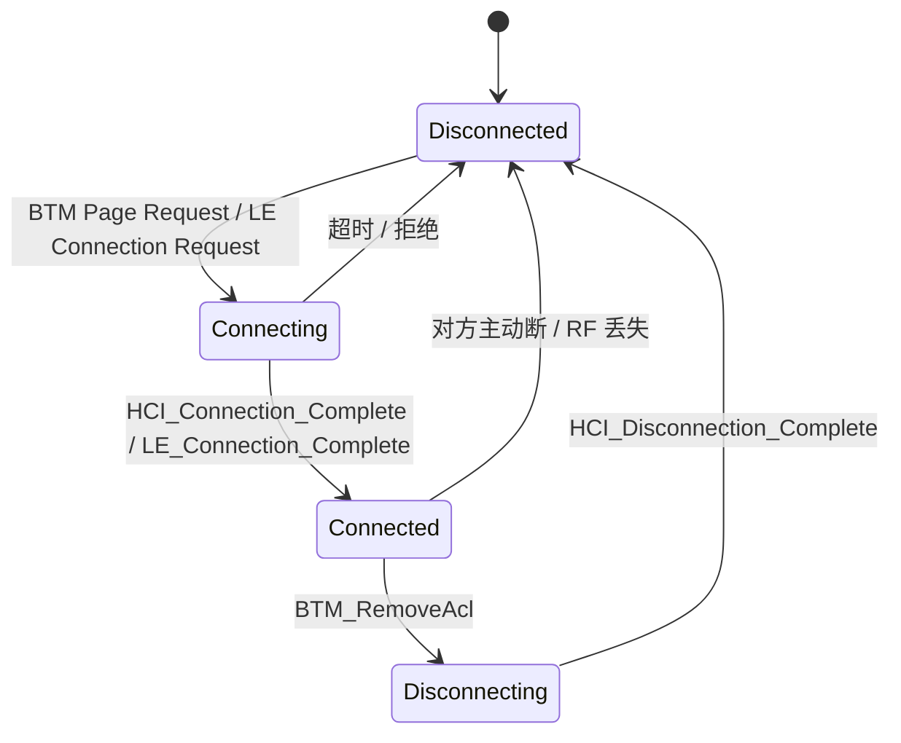
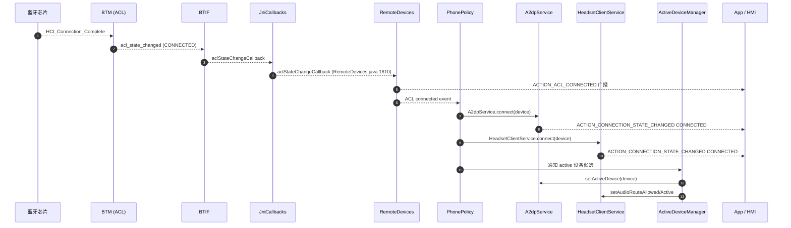

# 03.4 连接（Connection）：ACL / Profile 双层连接模型

> 速通摘要：蓝牙连接是**两层**——下层 **ACL/SCO 物理链路**（由 BTM 管理），上层 **Profile 逻辑连接**（A2DP/HFP/HID 等）。一台设备配对后，**每次重连**走的是这套：先 ACL 建立，再各 Profile 自动按 `PhonePolicy` / `ActiveDeviceManager` 顺序连。"连接状态"在 Android 层面，**永远要分清问的是哪一层**。

---

## 1. 学习目标

读完本节，你应该能：

1. 区分 ACL 连接 / SCO 连接 / Profile 连接三种"连接"。
2. 看懂车机典型多 Profile 自动连接的源码入口（`PhonePolicy.java`、`ActiveDeviceManager.java`）。
3. 知道 `aclStateChangeCallback` 在 `RemoteDevices.java:1610` 的派发逻辑。
4. 排查"音乐连上了电话连不上"或"被对方踢掉"类问题。

---

## 2. 前置知识

- 已读 03.1（开关）、03.3（配对）。

---

## 3. 场景故事：手机重新进入车里

1. 0 s：你坐进车里，蓝牙自动开（`AutoOn`）。
2. 1.5 s：本机 + 手机都在 `FilterAcceptList` 中。芯片在背景持续做 Page Scan / LE Connectable Adv。
3. 3 s：手机靠近，链路层 Page 成功，**ACL 连接建立**。
4. 3.1 s：`aclStateChangeCallback(...)` 触发，`RemoteDevices.java:1610` 处理，发 `ACTION_ACL_CONNECTED` 广播。
5. 3.2 s：`PhonePolicy` 监听到 ACL_CONNECTED + 该设备的"启用 Profile 列表"，**逐个 connect**。
6. 3.5 s：A2DP 连接成功 → `BluetoothA2dp.ACTION_CONNECTION_STATE_CHANGED (CONNECTED)`。
7. 3.7 s：HFP HF 连接成功 → `BluetoothHeadsetClient.ACTION_CONNECTION_STATE_CHANGED (CONNECTED)`。
8. 3.9 s：AVRCP / PBAP / MAP 客户端连接。
9. 4 s：`ActiveDeviceManager` 选定该设备为 A2DP/HFP 的 active device，音频通路切到蓝牙。
10. 4.1 s：开始放音乐 / 接听来电。

---

## 4. 三种"连接"必须分清

| 概念 | 谁建立 | 谁感知 | 例子 |
|------|--------|--------|------|
| **ACL 连接** | BTM (`system/stack/acl/`) 内 Page/Inquiry/LE Connection 完成 | `ACTION_ACL_CONNECTED` 广播 + Profile Service `aclStateChangeCallback` | 手机靠近后自动连上 |
| **SCO 连接** | BTM (`system/stack/btm/`) 调 `BTM_CreateSco` | HFP 音频路径开关；`BluetoothHeadsetClient.ACTION_AUDIO_STATE_CHANGED` | 接到来电时通话音频建立 |
| **Profile 连接** | 各 Profile Service 状态机 | `BluetoothXxx.ACTION_CONNECTION_STATE_CHANGED` | A2DP/HFP/AVRCP/HID 等 |

记忆口诀：**ACL 是高速公路，SCO 是语音专车道，Profile 是高速公路上跑的不同车型。**

---

## 5. 关键源码点

| 文件:行 | 角色 |
|---------|------|
| `system/stack/acl/acl.cc`、`btm_acl.cc` | ACL 链路管理（Classic） |
| `system/stack/acl/ble_acl.cc` | LE ACL |
| `system/stack/btm/btm_sco*.cc`（搜） | SCO 建立 |
| `android/app/src/com/android/bluetooth/btservice/RemoteDevices.java:1610` | `aclStateChangeCallback` 派发 |
| `android/app/src/com/android/bluetooth/btservice/PhonePolicy.java` | 多 Profile 自动连接策略 |
| `android/app/src/com/android/bluetooth/btservice/ActiveDeviceManager.java` | 多点连接 / 活动设备选择 |
| `android/app/src/com/android/bluetooth/a2dp/A2dpService.java`（`A2dpStateMachine`） | A2DP 连接状态机 |
| `android/app/src/com/android/bluetooth/hfpclient/HeadsetClientService.java` | HFP HF 连接状态机 |
| `framework/java/android/bluetooth/BluetoothDevice.java`：`ACTION_ACL_CONNECTED`（`:207`），`ACTION_ACL_DISCONNECTED`（`:238`） | 广播常量 |
| `android/app/src/.../btservice/AdapterService.java:3252` | `setActiveDevice` |

---

## 6. ACL 状态机视角



通知链路：
- 状态变更通过 BTIF → `acl_state_changed_callback` → `JniCallbacks.aclStateChangeCallback(...)` → `RemoteDevices.aclStateChangeCallback(...)` → 派发广播。
- 广播：`BluetoothDevice.ACTION_ACL_CONNECTED` / `ACTION_ACL_DISCONNECTED`，带 `EXTRA_DEVICE` 与 `EXTRA_TRANSPORT`（`BR_EDR` 或 `LE`）。

---

## 7. Profile 自动连接：`PhonePolicy`

`PhonePolicy.java` 是车机最重要的 Java 类之一。它监听三种事件：
- `ACTION_BOND_STATE_CHANGED`：新配对完成 → 启用默认 Profile 列表。
- `ACTION_UUID`：拿到对端 UUID 列表 → 决定能连哪些 Profile。
- Profile 自身 `ACTION_CONNECTION_STATE_CHANGED`：维护状态、决定是否换连另一个 Profile。

车厂常做的定制：
- 改连接顺序：A2DP → HFP → PBAP → MAP；或反过来。
- 改"连不上重试次数"。
- 选择性 disable 某些 Profile（如关 MAP）。

源码进入点：`PhonePolicy.processConnectOtherProfiles(BluetoothDevice device, int profileToBeConnected)`（在 `PhonePolicy.java` 内搜）。

---

## 8. `ActiveDeviceManager`：多手机场景

车机经常要同时连两台手机（A 手机放音乐、B 手机用 HFP）。`ActiveDeviceManager` 解决"谁是当前活动设备"。

它处理：
- 用户在 UI 上明确选某台手机做 A2DP/HFP active。
- 自动选择（哪台先连上、哪台是上次的）。
- 切换时让旧 active 设备的 Profile 切到 inactive。

API：`AdapterService.setActiveDevice(device, profiles)`（`:3252`）。

---

## 9. Mermaid：一次"自动连接"全景



---

## 10. 调试方法

| 想看 | 方法 |
|------|------|
| ACL 连接列表 | `dumpsys bluetooth_manager` → `ACL Stats` / `acl_devices` |
| Profile 连接状态 | `dumpsys bluetooth_manager` → 各 Profile Service 段 |
| 自动连接日志 | `logcat -s BluetoothPhonePolicy BluetoothActiveDeviceManager` |
| ACL 事件 | `logcat -s BluetoothRemoteDevices BluetoothJniCallbacks` |
| 关键广播 | 注册 `ACTION_ACL_CONNECTED` / `ACTION_ACL_DISCONNECTED` 监听 |
| HCI 视角 | btsnoop 看 `HCI_Connection_Complete` / `LE_Connection_Complete` |

---

## 11. FAQ

**Q1：为什么我配对成功，下次重新接近车机却不自动连？**
A：常见原因：
1. `PhonePolicy` 没启用对应 Profile（`Config.isProfileEnabled(...)`）。
2. 手机端蓝牙关了，没主动 Page。
3. `FilterAcceptList` 没把该设备加入。
4. 上次连接异常断开，BTA 的"失败计数"达上限暂停了重连。
5. 用户在 UI 把该设备的 "媒体/通话" 关了。

**Q2：两台手机能同时连上吗？**
A：能。`ActiveDeviceManager` 决定"播谁的音乐"，但两台都能保持 ACL+HFP+A2DP 连上。资源极限在芯片 ACL 槽位（多数支持 7 个，但 Audio 资源会限制）。

**Q3：`ACTION_ACL_CONNECTED` 和 `ACTION_BOND_STATE_CHANGED` 时序？**
A：初次配对时是 BOND_BONDED → ACL_CONNECTED；重连时只有 ACL_CONNECTED 没有 BOND 变化。

**Q4：Profile 连不上能怎么 debug？**
A：先查 `BluetoothProfile.getConnectionState(device)` 返回什么；再查对应 `XxxService.connect()` 的 logcat；最后看 BTA/Stack 层（如 A2DP 进 `bta_av_main.cc`、HFP 进 `bta_hf_client_main.cc`）。

**Q5：能不能不要自动连接？**
A：可以。把该设备从 `PhonePolicy` 的"已知列表"移除，或 `BluetoothAdapter.setProfileConnectionPolicy(device, profile, POLICY_FORBIDDEN)`。

---

## 12. 上路任务

### 任务 A：抓一次完整连接日志
```bash
adb logcat -c
# 关 / 开手机蓝牙制造一次重连
adb logcat -d | grep -E "ACTION_ACL|PhonePolicy|ActiveDeviceManager|A2dpService|HeadsetClientService"
```
对照 §9 时序图勾选每一步。

### 任务 B：阅读 `RemoteDevices.aclStateChangeCallback`
打开 `android/app/src/com/android/bluetooth/btservice/RemoteDevices.java:1610`，搞清楚它怎么决定要发 `ACTION_ACL_CONNECTED` 还是 `ACTION_ACL_DISCONNECTED`。

### 任务 C：找一个 Profile 状态机
打开 `android/app/src/com/android/bluetooth/a2dp/A2dpStateMachine.java`（或 A2dpService.java 中状态机定义），列出它的 4 个状态。和 BondStateMachine 比一比。

---

## 13. 本节小结（速记卡）

```
连接 = ACL + Profile（两层）
  ACL：BTM 管理，TRANSPORT_BREDR / TRANSPORT_LE
  Profile：A2DP / HFP / HID / GATT 等独立状态机
广播：
  ACTION_ACL_CONNECTED / DISCONNECTED（链路）
  BluetoothXxx.ACTION_CONNECTION_STATE_CHANGED（业务）
关键 Java 类：
  RemoteDevices.aclStateChangeCallback (line 1610)
  PhonePolicy（多 Profile 自动连接）
  ActiveDeviceManager（多点连接）
关键 Native：system/stack/acl/, system/stack/btm/
```
