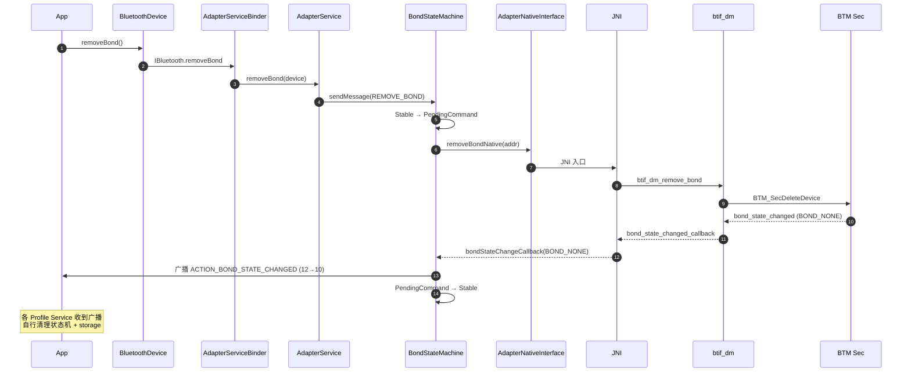

# 03.5 取消配对与状态清理

> 速通摘要：解绑（`removeBond()`）= 同时清理 **Java 端 RemoteDevices 记录** + **Native 端 BTM 安全记录** + **`bt_config.conf` 链路密钥** + **所有 Profile 残留连接**。这是配对流程的"镜像"，但车机定制中最容易遗漏的一环。本节给出完整清理清单与排查方法。

---

## 1. 学习目标

读完本节，你应该能：

1. 默写 `removeBond()` 涉及的 5 处状态清理点。
2. 看懂 `BondStateMachine` 处理 `REMOVE_BOND` 的代码。
3. 知道车机"清空所有蓝牙数据"按钮背后调的是 `factoryReset` 还是 `removeBond` 循环。
4. 排查"已解绑但下次仍自动重连"的诡异 bug。

---

## 2. 前置知识

- 已读 03.3（配对）、03.4（连接）。

---

## 3. 场景故事：你想把车机里的"前任手机"彻底清掉

```
车机 UI 选"忘记此设备"
   │
   ▼
BluetoothDevice.removeBond()
   │  Binder → AdapterService.removeBond
   ▼
BondStateMachine.sendMessage(REMOVE_BOND)
   │
   ▼  状态机：StableState → PendingCommandState
AdapterNativeInterface.removeBondNative(byte[] addr)
   │
   ▼  JNI → sBluetoothInterface->remove_bond
btif_dm_remove_bond(bd_addr)         ← system/btif/src/btif_dm.cc:2984
   │
   ▼  调 BTM_SecDeleteDevice / SMP_RemoveLTK
[Stack 清理]
   │  - 删 LinkKey
   │  - 删 LE LTK / IRK / CSRK
   │  - 清 ACL（若仍连着）
   │  - 删 GATT bonded service cache
   ▼
bond_state_changed_callback(SUCCESS, addr, BOND_NONE, reason)
   │
   ▼  Native→Java
JniCallbacks.bondStateChangeCallback(...)
   │
   ▼
BondStateMachine 推进 → 广播 ACTION_BOND_STATE_CHANGED (12 → 10)
   │
   ▼
RemoteDevices 删除内存中的 DeviceProperties
AdapterService.updateUuids 清 SDP cache
所有 Profile Service 收到 ACTION_BOND_STATE_CHANGED → 清自己的状态机记录
bt_config.conf 落盘移除整段 [aa:bb:cc:...]
```

漏一步，结果就是"看上去解绑了，重启车机后又冒出来"。

---

## 4. 5 处必须清的状态点

| # | 状态点 | 谁负责 | 物理位置 |
|---|--------|--------|----------|
| 1 | **链路密钥（LinkKey/LTK/IRK）** | Stack SMP/BTM | `/data/misc/bluedroid/bt_config.conf` 中 `[XX:XX:XX:XX:XX:XX]` 段 |
| 2 | **Bond 状态机记录** | `BondStateMachine` 内部 | 内存 + 广播 |
| 3 | **RemoteDevices 记录** | `RemoteDevices.java` | 内存（`mDevices` map） |
| 4 | **各 Profile Service 状态机** | `A2dpService.removeBond` / `HfpClientService.removeBond` / `GattService.disconnect` 等 | 各 Service 自维护 + 内存 + 配置 |
| 5 | **ACL 连接** | BTM | Disconnect HCI 命令下发 |

---

## 5. 关键源码点

| 文件:行 | 角色 |
|---------|------|
| `framework/java/android/bluetooth/BluetoothDevice.java:2208` | `removeBond()` 入口 |
| `android/app/src/.../btservice/BondStateMachine.java`（搜 `REMOVE_BOND`） | 状态机分支 |
| `android/app/src/.../btservice/AdapterNativeInterface.java:335` | `removeBondNative(byte[])` |
| `android/app/jni/com_android_bluetooth_btservice_AdapterService.cpp:1444` | C 端 `removeBondNative` |
| `system/btif/src/btif_dm.cc:2984` | `btif_dm_remove_bond` |
| `system/stack/btm/btm_sec.cc` | `BTM_SecDeleteDevice` / `BTM_SecClearSecurityFlags` |
| `system/stack/smp/`（SMP 模块） | LE 密钥清理 |
| `android/app/src/.../btservice/RemoteDevices.java`（搜 `removeBond`） | 内存清理 |

---

## 6. 简化代码片段：JNI 端 `removeBondNative`

```cpp
// com_android_bluetooth_btservice_AdapterService.cpp:1444
static jboolean removeBondNative(JNIEnv* env, jobject /* obj */, jbyteArray address) {
  log::verbose("");
  if (!sBluetoothInterface) return JNI_FALSE;

  jbyte* addr = env->GetByteArrayElements(address, NULL);
  if (addr == NULL) {
    jniThrowIOException(env, EINVAL);
    return JNI_FALSE;
  }
  int ret = sBluetoothInterface->remove_bond(reinterpret_cast<RawAddress*>(addr));
  env->ReleaseByteArrayElements(address, addr, 0);
  return (ret == BT_STATUS_SUCCESS) ? JNI_TRUE : JNI_FALSE;
}
```

注意：`remove_bond` 同步返回 `SUCCESS` 只表示"BTIF 接到指令"。真正解绑完成靠后续 `bond_state_changed_callback(BOND_NONE)`。

---

## 7. Profile Service 的连锁清理

每个 Profile Service 都会监听 `ACTION_BOND_STATE_CHANGED`。例：
```java
// A2dpService 内（思路图）
@Override public void onReceive(Context ctx, Intent intent) {
    if (ACTION_BOND_STATE_CHANGED.equals(intent.getAction())) {
        BluetoothDevice device = intent.getParcelableExtra(EXTRA_DEVICE, BluetoothDevice.class);
        int state = intent.getIntExtra(EXTRA_BOND_STATE, -1);
        if (state == BOND_NONE) {
            // 删该设备的 A2DP 状态机、active device、storage
            mStateMachines.remove(device);
            mDatabaseManager.removeDevice(device);
        }
    }
}
```

车厂定制 Service（如自研的"互联 Profile"）**必须**同样监听并清理，否则会出现"我以为忘记了，下次又自动连"。

---

## 8. `factoryReset` 与 `removeBond` 的关系

| API | 范围 | 实现 |
|-----|------|------|
| `BluetoothDevice.removeBond()` | 单台设备 | 上述流程 |
| `BluetoothAdapter.factoryReset()`（SystemApi） | 所有设备 + 蓝牙配置 | 内部循环 `removeBond` + 清 `bt_config.conf` + 重置 sysprop |

`factoryReset` 走 `IBluetoothManager.factoryReset(...)`（在 service AIDL）。详 `service/aidl/.../IBluetoothManager.aidl:80`。

---

## 9. Mermaid：取消配对状态转移



---

## 10. 调试方法

| 想看 | 方法 |
|------|------|
| 解绑是否真的写盘 | `cat /data/misc/bluedroid/bt_config.conf \| grep XX:XX:XX:XX:XX:XX`（root） |
| 状态机分支 | `logcat -s BluetoothBondStateMachine` |
| Profile 是否清干净 | `dumpsys bluetooth_manager` → 各 Profile Service 段中是否仍有该设备 |
| ACL 是否真断 | btsnoop 看 `HCI_Disconnection_Complete` |
| 内存里是否还有 | `dumpsys bluetooth_manager` → `RemoteDevices` 段 |

---

## 11. FAQ

**Q1：为什么解绑后 `bt_config.conf` 还残留？**
A：可能没及时落盘（蓝牙 App 进程异常退出）。`btif_config.cc` 内有定期 commit + 关闭时同步 flush。强制方法：手动 `BluetoothAdapter.factoryReset()`。

**Q2：解绑成功但 Settings UI 还显示已配对？**
A：Settings 缓存。重启 Settings App 或重启系统。

**Q3：能否在不解绑的情况下"暂时禁连"？**
A：用 `BluetoothAdapter.setProfileConnectionPolicy(device, profile, POLICY_FORBIDDEN)`。配对仍在，但 `PhonePolicy` 不会再 connect。

**Q4：解绑期间用户拔出钥匙关电会怎样？**
A：BTIF 异步写盘可能没完成 → 重启后 `bt_config.conf` 仍有该设备 → 下次启动 `RemoteDevices` 把它当 bonded → 自动重连。如果遇到这个 bug，车厂应在"用户确认解绑"后强制 `BluetoothAdapter.factoryReset()` 或显式 flush（参考 `service/src/AdapterBinder.kt`）。

**Q5：BLE 设备解绑要不要单独处理？**
A：不需要——`btif_dm_remove_bond` 内部根据 transport 走 SMP 清理路径；同一台双模设备会同时清 Classic LinkKey + LE LTK。

---

## 12. 上路任务

### 任务 A：解绑前后看 `bt_config.conf`
```bash
adb root
adb shell cat /data/misc/bluedroid/bt_config.conf > /tmp/before.txt
# UI 操作"忘记此设备"
adb shell cat /data/misc/bluedroid/bt_config.conf > /tmp/after.txt
diff /tmp/before.txt /tmp/after.txt
```
你应该看到整段 `[XX:XX:XX:XX:XX:XX]` 被移除。

### 任务 B：手工触发 factoryReset
**仅在测试机做**：
```bash
adb shell "service call bluetooth_manager <code>"   # 具体 code 看 dumpsys 接口表
```
或者写一个 SystemApp 调 `BluetoothAdapter.factoryReset()`。验证清完后 `dumpsys bluetooth_manager` 没有任何 bonded devices。

### 任务 C：跟踪一次 REMOVE_BOND 状态机消息
```bash
adb logcat -c
# UI 解绑
adb logcat -d | grep -E "BondStateMachine|removeBond|bondStateChange|ACTION_BOND_STATE"
```
默想：从 `REMOVE_BOND` 入消息队列到 `BOND_NONE` 广播一共有几条 log？

---

## 13. 本节小结（速记卡）

```
removeBond 五步清理：
  ① LinkKey/LTK/IRK    ← Stack SMP/BTM
  ② Bond 状态机记录    ← BondStateMachine
  ③ RemoteDevices map  ← Java 内存
  ④ Profile Service 状态 ← 各 Service 监听 ACTION_BOND_STATE_CHANGED
  ⑤ ACL 连接           ← BTM Disconnect
关键 API：
  removeBond() → REMOVE_BOND msg → removeBondNative
  → btif_dm_remove_bond (btif_dm.cc:2984) → BTM_SecDeleteDevice
落盘：/data/misc/bluedroid/bt_config.conf
全清：BluetoothAdapter.factoryReset()
排查首问：Profile Service 是否监听并清理 ACTION_BOND_STATE_CHANGED？
```

至此 03 章核心流程完成。下一站：**01 开发与调试准备** —— 把"看代码"的能力升级为"边改边调"。
