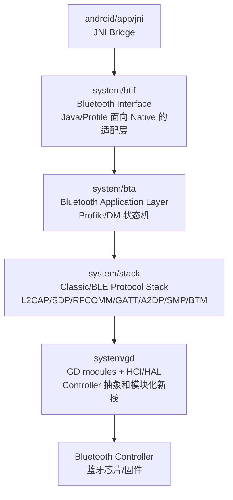
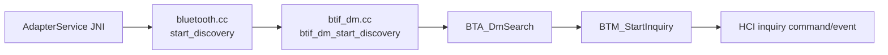
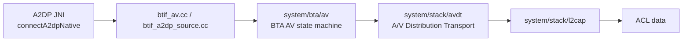

# 04. Native 协议栈入门：BTIF、BTA、Stack、GD 怎么分工

## 1. 学习目标

这一章建立 Native 层的地图。你不需要一次读懂所有 C++，但要先知道每个目录负责什么、启动时初始化了哪些模块、扫描/配对/A2DP/HFP/GATT 最终会落到哪些协议层。

读完后，你应该能回答：

- `system/btif`、`system/bta`、`system/stack`、`system/gd` 的职责边界是什么。
- 蓝牙 Native 栈启动时大致初始化哪些协议模块。
- HCI、L2CAP、SDP、RFCOMM、GATT 分别解决什么问题。
- 看到一个 Native 函数名时，怎么判断它处在哪一层。

## 2. Native 分层地图



一个实用判断：

- `btif_` 前缀：通常是 JNI/Profile 进 Native 后的第一层。
- `BTA_` 前缀：通常是中间层 API，会驱动某个 Profile 或 Device Manager 状态机。
- `BTM_`、`L2CA_`、`GATT_`、`RFCOMM_`、`SDP_`：已经进入协议栈核心。
- `bluetooth::gd`、`hci`、`hal`：更靠近 HCI、Controller、模块化新栈。

## 3. Native 栈启动时做了什么

启动入口可以从 `system/btif/src/stack_manager.cc` 读起。它不是业务 Profile，而是把底层模块拉起来的“总电源”。

```cpp
// system/btif/src/stack_manager.cc
198 static void init_stack_internal(bluetooth::core::CoreInterface* interface) {
199   // all callbacks out of libbluetooth-core happen via this interface
200   interfaceToProfiles = interface;
202   module_management_start();
204   main_thread_start_up();
206   module_init(get_local_module(DEVICE_IOT_CONFIG_MODULE));
207   module_init(get_local_module(OSI_MODULE));
208   module_start_up(get_local_module(GD_SHIM_MODULE));
209   module_init(get_local_module(BTIF_CONFIG_MODULE));
```

这里先启动模块管理和蓝牙主线程，再启动 GD shim、配置等基础模块。

真正的协议模块初始化在后面：

```cpp
// system/btif/src/stack_manager.cc
256   module_start_up(get_local_module(BTIF_CONFIG_MODULE));
258   l2c_init();
259   sdp_init();
260   gatt_init();
261   SMP_Init(get_btm_client_interface().security.BTM_GetSecurityMode());
262   get_btm_client_interface().lifecycle.btm_ble_init();
264   RFCOMM_Init();
265   GAP_Init();
266   AIS_Init();
268   startProfiles();
270   bta_sys_init();
272   btif_init_ok();
273   BTA_dm_init();
274   bta_dm_enable(btif_dm_sec_evt, btif_dm_acl_evt);
```

这段可以作为 Native 入门的目录：

- `l2c_init()`：L2CAP，蓝牙上层协议的通用承载层。
- `sdp_init()`：SDP，Classic 蓝牙服务发现。
- `gatt_init()`：GATT，BLE 服务/特征值模型。
- `SMP_Init()`：SMP，BLE 配对和密钥。
- `btm_ble_init()`：BTM BLE 管理能力。
- `RFCOMM_Init()`：RFCOMM，串口仿真，HFP 等场景常见。
- `GAP_Init()`：通用访问能力。
- `BTA_dm_init()`/`bta_dm_enable()`：设备管理层启用。

## 4. 蓝牙主线程

Native 蓝牙栈大量事件会串到 `bt_main_thread` 上处理。

```cpp
// system/stack/btu/main_thread.cc
34 static MessageLoopThread main_thread("bt_main_thread", os::Thread::Priority::REAL_TIME);
36 bluetooth::common::MessageLoopThread* get_main_thread() { return &main_thread; }
39 bt_status_t do_in_main_thread(base::OnceClosure task) {
40   if (!main_thread.DoInThread(std::move(task))) {
41     log::error("failed to post task to task runner!");
42     return BT_STATUS_JNI_THREAD_ATTACH_ERROR;
```

启动时还会尝试打开实时调度：

```cpp
// system/stack/btu/main_thread.cc
65 void main_thread_start_up() {
66   main_thread.StartUp();
67   if (!main_thread.IsRunning()) {
68     log::fatal("unable to start btu message loop thread.");
70   if (!main_thread.EnableRealTimeScheduling()) {
72     log::fatal("unable to enable real time scheduling");
```

车载音频问题尤其要关注这个线程，因为 A2DP、SCO、GATT 回调、HCI 事件都可能通过它串行处理。线程阻塞会表现成连接慢、状态回调延迟、音频控制响应慢。

## 5. BTA：Profile 和设备管理状态机层

BTA 是 BTIF 和 Stack 之间的中间层。以设备管理为例：

```cpp
// system/bta/dm/bta_dm_api.cc
50 void BTA_dm_init() {
52   bta_sys_eir_register(bta_dm_eir_update_uuid);
53   bta_sys_cust_eir_register(bta_dm_eir_update_cust_uuid);
54   get_btm_client_interface().ble.BTM_SetConsolidationCallback(bta_dm_consolidate);
}
```

扫描 API：

```cpp
// system/bta/dm/bta_dm_api.cc
72  * Function         BTA_DmSearch
74  * Description      This function searches for peer Bluetooth devices. It
75  *                  performs an inquiry and gets the remote name for devices.
81 void BTA_DmSearch(tBTA_DM_SEARCH_CBACK* p_cback) { bta_dm_disc_start_device_discovery(p_cback); }
```

这说明 `BTA_DmSearch` 已经不是 Java 层“点一下搜索”的概念，而是启动 Classic inquiry、远端名称查询、服务发现等 Native 搜索过程。

## 6. Stack：协议核心层

`system/stack` 下面是协议实现密度最高的区域。先不要从所有文件乱读，按协议用途进入：

| 协议/模块 | 路径 | 车载场景 |
| --- | --- | --- |
| BTM/ACL | `system/stack/btm`、`system/stack/acl` | 设备管理、ACL 链路、配对安全、功耗 |
| L2CAP | `system/stack/l2cap`、`system/stack/include/l2cap_interface.h` | A2DP、GATT、RFCOMM 等上层协议的承载 |
| SDP | `system/stack/sdp` | Classic Profile 服务发现 |
| RFCOMM | `system/stack/rfcomm` | HFP、SPP、部分互联通道 |
| GATT/ATT | `system/stack/gatt` | BLE 外设、AIoT、服务发现、读写通知 |
| SMP | `system/stack/smp` | BLE 配对、密钥交换 |
| A2DP codec | `system/stack/a2dp` | SBC/AAC/aptX/LDAC/Opus codec 配置 |
| SCO | `system/stack/btm/btm_sco*` | 蓝牙电话语音链路 |

GATT 初始化时会注册 ATT 的 L2CAP 固定信道：

```cpp
// system/stack/gatt/gatt_main.cc
126   fixed_reg.pL2CA_FixedConn_Cb = gatt_le_connect_cback;
127   fixed_reg.pL2CA_FixedData_Cb = gatt_le_data_ind;
128   fixed_reg.pL2CA_FixedCong_Cb = gatt_le_cong_cback; /* congestion callback */
133   fixed_reg.default_idle_tout = L2CAP_NO_IDLE_TIMEOUT;
135   if (!stack::l2cap::get_interface().L2CA_RegisterFixedChannel(L2CAP_ATT_CID, &fixed_reg)) {
136     log::error("Unable to register L2CAP ATT fixed channel");
```

这段很适合理解 BLE：GATT 不是直接和 HCI 对话，它把 ATT 数据挂在 L2CAP 的固定信道上。

## 7. GD/HCI/HAL：靠近控制器的一层

HCI 是 Host 和 Controller 的边界。`system/gd/hal/hci_hal.h` 直接写明了方向。

```cpp
// system/gd/hal/hci_hal.h
32 // The interface from the Bluetooth Controller to the stack
33 class HciHalCallbacks {
37   // This function is invoked when an HCI event is received from the
38   // Bluetooth controller to be forwarded to the Bluetooth stack
40   virtual void hciEventReceived(HciPacket event) = 0;
42   // Send an ACL data packet from the controller to the host
44   virtual void aclDataReceived(HciPacket data) = 0;
46   // Send a SCO data packet from the controller to the host
48   virtual void scoDataReceived(HciPacket data) = 0;
50   // Send an ISO data packet from the controller to the host
52   virtual void isoDataReceived(HciPacket data) = 0;
```

车载场景对应：

- A2DP 音乐数据主要走 ACL。
- HFP 通话音频通常关注 SCO。
- LE Audio 会涉及 ISO。
- 扫描、连接、配对状态大量来自 HCI event。

## 8. 三条典型 Native 路线

### 8.1 扫描



### 8.2 A2DP



### 8.3 BLE GATT


## 9. C++ 阅读小补课

### 9.1 函数指针表

```cpp
// system/btif/src/stack_manager.cc
405 static const stack_manager_t interface = {init_stack, start_up_stack_async, shut_down_stack_async,
406                                           clean_up_stack, get_stack_is_running};
```

这是一张 C 风格接口表。上层拿到 `stack_manager_t` 后，不关心具体实现文件，只调用表里的函数指针。

### 9.2 回调结构体

```cpp
// system/stack/gatt/gatt_main.cc
126 fixed_reg.pL2CA_FixedConn_Cb = gatt_le_connect_cback;
127 fixed_reg.pL2CA_FixedData_Cb = gatt_le_data_ind;
128 fixed_reg.pL2CA_FixedCong_Cb = gatt_le_cong_cback;
```

这是一种常见 C/C++ 模式：先把“连接回调、收数据回调、拥塞回调”填进结构体，再注册给 L2CAP。以后 L2CAP 收到 ATT 信道事件，就回调 GATT。

### 9.3 主线程投递

`do_in_main_thread(base::BindOnce(...))` 表示“把这个动作封装成任务，投递到蓝牙主线程执行”。这比直接调用多一步，但能让状态机按顺序处理。

## 10. 本章练习

- 从 `system/btif/src/stack_manager.cc` 开始，标出 Native 栈启动时每个 `*_init()` 的模块。
- 用 `rg -n "L2CA_RegisterFixedChannel" system/stack system/bta system/btif` 看哪些协议注册了 L2CAP 固定信道。
- 用 `rg -n "BTA_DmSearch|BTM_StartInquiry"` 复现扫描在 Native 层的路线。
- 打开 `system/gd/hal/hci_hal.h`，区分 event、ACL、SCO、ISO 四类 Controller 到 Host 的数据入口。

### 10.1 参考答案与讨论

练习 1：Native 栈启动不是单个函数，而是一串模块初始化。

推荐执行：

```bash
rg -n "event_init_stack|_init\\(|init\\(" system/btif/src/stack_manager.cc system/btif system/bta system/stack
```

阅读顺序：

- `stack_manager.cc` 负责拉起和关闭 native stack。
- `event_init_stack(...)` 是启动过程的核心入口之一。
- 启动过程会初始化 BTIF、BTA、BTM、L2CAP、SDP、GATT、HCI/GD 等模块。
- 初始化完成后通过 `event_signal_stack_up(...)` 回到 JNI/上层。

讨论要点：蓝牙“打开成功”必须等 stack up 事件回来。只看到 Java 发起 enable 不能证明底层已经 ready。

练习 2：L2CAP 固定信道用于一些固定协议入口。

推荐执行：

```bash
rg -n "L2CA_RegisterFixedChannel" system/stack system/bta system/btif
```

可能观察到的方向：

- SMP 使用固定信道处理 BLE 配对。
- ATT/GATT 使用固定信道处理 BLE attribute。
- 其他固定信道可能和控制、安全或 LE 特性相关。

讨论要点：L2CAP 是很多协议的承载层。GATT、SMP、AVDTP、RFCOMM 等问题继续往下查时，常会落到 L2CAP 连接、配置或拥塞。

练习 3：Classic 扫描 native 路线通常从 BTIF DM 到 BTA/BTM。

推荐执行：

```bash
rg -n "BTA_DmSearch|BTM_StartInquiry" system
```

预期路线：

- `btif_dm_start_discovery()` 调 `BTA_DmSearch(...)`。
- BTA DM 组织 discovery/search 状态。
- 更底层进入 BTM inquiry。
- controller 通过 HCI inquiry event 返回发现结果。

讨论要点：如果 `BTA_DmSearch(...)` 已执行但无结果，要看 inquiry 是否真的发到 controller，以及 HCI event 是否回来。

练习 4：HCI HAL 的四类入口对应四类蓝牙数据。

- event：controller 发给 host 的事件，例如 command complete、connection complete、inquiry result。
- ACL：大多数异步数据通道，A2DP、GATT、RFCOMM 上层最终都可能承载在 ACL 上。
- SCO：传统电话语音链路。
- ISO：LE Audio 等同步等时数据。

讨论要点：抓 snoop 时要先知道问题属于哪类数据。A2DP 卡顿主要看 ACL/media，HFP 语音主要看 SCO/eSCO，LE Audio 则可能看 ISO。
