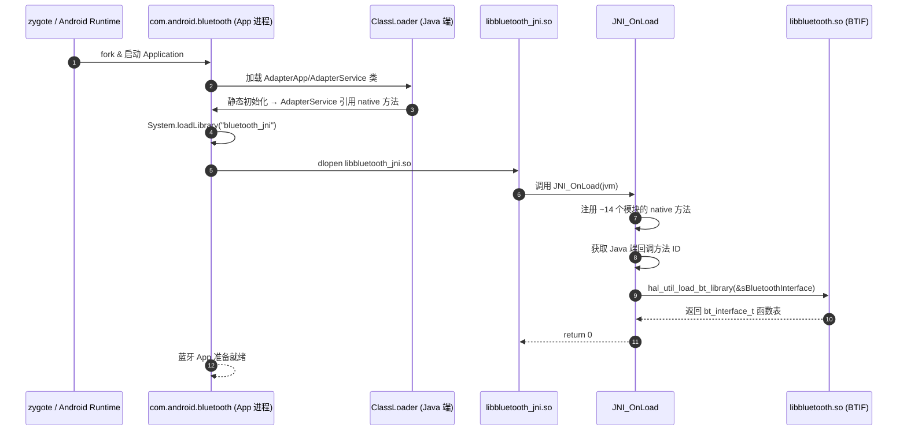

# 04.1 JNI 在 Android 蓝牙模块中的角色

> 速通摘要：JNI 是 Java 与 C++ 的"翻译官"。Android 蓝牙的所有"过堂"动作（开机、扫描、配对、连接、Profile 调用）都要从 Java 跳到 C++——而**这条跳板就在 `android/app/jni/`**。本节回答四个问题：**JNI 在哪里、什么时候被加载、用来做什么、谁调谁回**。

---

## 1. 学习目标

读完本节，你应该能：

1. 30 秒内说清 JNI 在蓝牙 App 进程中的物理位置（哪个 `.so` 、哪个 `.cpp`）。
2. 默写一次"Java → Native → Java"完整往返路径。
3. 知道 JNI 在蓝牙这里**多承担了一项任务**（不止"翻译"，还包括"加载 BTIF 函数表"）。
4. 看懂 `JNI_OnLoad` 的初始化步骤。

---

## 2. 前置知识

- 已读 00、02 章。
- 知道 Java `native` 关键字 + `System.loadLibrary("xxx")` 的关系。
- 知道 `libxxx.so` 是 ELF 共享库。

---

## 3. 场景故事：蓝牙 App 启动后第一秒发生了什么



注意第 10 步：JNI 不只注册自己的"方法翻译表"，**还要把 BTIF 的 `bt_interface_t` 全局函数表加载到 `sBluetoothInterface` 变量**——之后所有 Java→Native 调用最终都通过这个表跳进 C++ 业务。

---

## 4. JNI 在仓库里的物理位置

| 项 | 位置 |
|----|------|
| C++ JNI 桥接源码 | `android/app/jni/*.cpp`（每 Profile 一个） |
| 共享头 | `android/app/jni/com_android_bluetooth.h` |
| 编译产物（运行时） | `libbluetooth_jni.so`（在蓝牙 App APEX `/apex/com.android.btservices/lib*/`） |
| BTIF 函数表来源 | `libbluetooth.so`（同 APEX，包含 BTIF/BTA/Stack/GD） |
| Java 端 native 声明 | 各 `XxxNativeInterface.java`，如 `AdapterNativeInterface.java:305` 起 |

```bash
# 想看蓝牙 App 进程加载了什么 so
adb shell "cat /proc/$(pidof com.android.bluetooth)/maps | grep -E 'libbluetooth(_jni)?\\.so'"
# 通常会看到：
# /apex/com.android.btservices/lib64/libbluetooth_jni.so
# /apex/com.android.btservices/lib64/libbluetooth.so
```

---

## 5. JNI 在蓝牙这里干哪些活

| 活 | 怎么做 | 关键代码 |
|----|--------|---------|
| ① **注册 native 方法**（让 Java `native` 关键字落到 C++ 函数指针） | `JNI_OnLoad` 里逐个调 `register_com_android_bluetooth_xxx(env)` | `com_android_bluetooth_btservice_AdapterService.cpp:2325`、`:2197` |
| ② **加载 BTIF 函数表**（让 JNI 能调下层栈） | `hal_util_load_bt_library(&sBluetoothInterface)` | `:2313` |
| ③ **接住 Java 回调方法 ID** | `GET_JAVA_METHODS(env, "com/android/bluetooth/.../JniCallbacks", javaMethods)` | `:2302` |
| ④ **保存 Java 端全局引用**（用于异步回调） | `sJniAdapterServiceObj = env->NewGlobalRef(obj)` | `:1038`、引用声明在 `:123` |
| ⑤ **Java→Native 转换** | 每个 `xxxNative` C 函数实现 | 如 `enableNative()` `:1107`、`createBondNative()` `:1154` |
| ⑥ **Native→Java 回调** | 通过 `env->CallVoidMethod(sJniAdapterServiceObj, method_xxx, ...)` | 散布在各 callback 函数中 |
| ⑦ **类型转换** | `jbyteArray↔std::array<uint8_t,6>`、`jstring↔std::string` | 各处工具函数 |
| ⑧ **错误日志与 metrics** | 业务出错时记 metric | 借助 `system/log/` |

---

## 6. 模块一览：14 个注册器

`com_android_bluetooth.h` 列出了所有 Profile 的注册器（节选自 `:127-:170`）：

```cpp
int register_com_android_bluetooth_btservice_AdapterService(JNIEnv* env);
int register_com_android_bluetooth_btservice_BluetoothKeystore(JNIEnv* env);
int register_com_android_bluetooth_scan(JNIEnv* env);
int register_com_android_bluetooth_hfp(JNIEnv* env);
int register_com_android_bluetooth_hfpclient(JNIEnv* env);
int register_com_android_bluetooth_a2dp(JNIEnv* env);
int register_com_android_bluetooth_a2dp_sink(JNIEnv* env);
int register_com_android_bluetooth_avrcp(JNIEnv* env);       // legacy
int register_com_android_bluetooth_avrcp_target(JNIEnv* env);
int register_com_android_bluetooth_avrcp_controller(JNIEnv* env);
int register_com_android_bluetooth_hid_host(JNIEnv* env);
int register_com_android_bluetooth_hid_device(JNIEnv* env);
int register_com_android_bluetooth_pan(JNIEnv* env);
int register_com_android_bluetooth_gatt(JNIEnv* env);
int register_com_android_bluetooth_sdp(JNIEnv* env);
int register_com_android_bluetooth_hearing_aid(JNIEnv* env);
int register_com_android_bluetooth_hap_client(JNIEnv* env);
// ……
```

每个注册器都干同样三件事：
1. 准备 `JNINativeMethod` 数组（Java 方法名 ↔ C 函数指针）。
2. 调 `REGISTER_NATIVE_METHODS(env, "com/android/bluetooth/.../XxxNativeInterface", methods)` 把映射注入 ART。
3. 通过 `GET_JAVA_METHODS` 把 Java 端回调方法 ID 缓存到全局变量。

> 这是 Android Native 蓝牙最重要的"分发表"——所有 Java 端的 `native` 方法都在这里被"接住"。

---

## 7. 简化代码片段：`JNI_OnLoad` 主干（`:2325-:2380`）

```cpp
// android/app/jni/com_android_bluetooth_btservice_AdapterService.cpp:2325
jint JNI_OnLoad(JavaVM* jvm, void* /* reserved */) {
  // ① 设置 log tag 与 minimum priority
  __android_log_set_minimum_priority(...);

  // ② 拿到 JNIEnv
  JNIEnv* e;
  if (jvm->GetEnv(reinterpret_cast<void**>(&e), JNI_VERSION_1_6)) {
    log::error("JNI version mismatch error");
    return JNI_ERR;
  }

  // ③ 依次注册所有模块的 native 方法
  CHECK(android::register_com_android_bluetooth_btservice_AdapterService(e) >= 0);
  CHECK(android::register_com_android_bluetooth_btservice_BluetoothKeystore(e) >= 0);
  CHECK(android::register_com_android_bluetooth_hfp(e) >= 0);
  CHECK(android::register_com_android_bluetooth_a2dp(e) >= 0);
  // ……（每个 profile 一个）……
  return JNI_VERSION_1_6;
}
```

**注意**：`JNI_OnLoad` 在 `System.loadLibrary("bluetooth_jni")` 被调用后**立即**执行。这之前任何 `native` 方法调用都会 `UnsatisfiedLinkError`。

---

## 8. `bt_interface_t`：从 JNI 看 BTIF 的入口

BTIF（`system/btif/src/bluetooth.cc`）对外提供一个 C 函数表：

```cpp
// 头文件：system/include/hardware/bluetooth.h（外部依赖：AOSP hardware/libhardware）
typedef struct {
    int (*init)(bt_callbacks_t* callbacks, ...);
    int (*enable)();
    int (*disable)();
    int (*start_discovery)();
    int (*cancel_discovery)();
    int (*create_bond)(const RawAddress* bd_addr, int transport);
    int (*remove_bond)(const RawAddress* bd_addr);
    // ……
} bt_interface_t;
```

JNI 拿到这个表后保存为全局变量 `sBluetoothInterface`（在 `com_android_bluetooth_btservice_AdapterService.cpp`）。
所有 `Java → Native` 的最终一跳就是 `sBluetoothInterface->xxx(...)`。

**Java 类比**：
- `bt_interface_t` ≈ Java 的接口 `BtInterface`。
- `hal_util_load_bt_library` ≈ `ServiceLoader.load(BtInterface.class).iterator().next()`。
- `sBluetoothInterface` ≈ 持有 `BtInterface` 实例的 static 字段。

---

## 9. JNI 与权限

**重要事实**：JNI 自身**不做权限检查**。所有权限检查在 Java 层（`AdapterServiceBinder.java` 等）通过 `Utils.checkScanPermissionForDataDelivery(...)` 完成。

意思是：
- JNI 接到调用，默认它"已经合法"。
- 这层"信任边界"在 Java 侧，不是 JNI 侧。
- 这也是为什么蓝牙 App 的 Binder 入口（Service Binder）做权限，**而不是** JNI 入口做权限。

---

## 10. 调试方法

| 想看 | 方法 |
|------|------|
| JNI 加载成功 | logcat 搜 "Bluetooth Adapter Service : loading JNI"（来自 `com_android_bluetooth_btservice_AdapterService.cpp:2352`） |
| 注册了哪些 native 方法 | `grep -nE "REGISTER_NATIVE_METHODS|JNINativeMethod" android/app/jni/*.cpp` |
| Java→Native 调用栈 | `adb shell debuggerd <pid>` 拿到 native stack（注意会 SIGABRT，慎用） |
| Native→Java 调用栈 | logcat 中 callback 出错时通常会带 Java 栈 |
| `libbluetooth_jni.so` 是否加载 | `cat /proc/$(pidof com.android.bluetooth)/maps \| grep jni` |
| 符号是否齐全 | `adb shell readelf -s /apex/com.android.btservices/lib64/libbluetooth_jni.so \| grep JNI_OnLoad` |

---

## 11. FAQ

**Q1：`System.loadLibrary("bluetooth_jni")` 在哪里调用？**
A：在 `AdapterApp` / `AdapterService` 静态初始化处（或 `AdapterNativeInterface` 的 `static {}` 块）——参考 Java 端 `Application` 或 `Service` 的 `static` 初始化。

**Q2：如果 Profile 没启用，对应的 `register_com_android_bluetooth_xxx` 还会被调吗？**
A：会的——`JNI_OnLoad` 把所有注册器都跑一遍。Profile "未启用"只是 Java 端 `Config` 不把该 Service 加进 Profile Service 列表，**但 native 注册仍然完成**。

**Q3：JNI 出错会让蓝牙 App 崩溃吗？**
A：通常会。`JNI_OnLoad` 返回 `JNI_ERR` 直接让 `loadLibrary` 抛 `UnsatisfiedLinkError`，蓝牙 App 启动失败；`BluetoothManagerService` 会拉起重启。

**Q4：能不能从 App 进程直接 dlopen `libbluetooth.so`？**
A：APEX 的 SO 通常对 App 进程不可见（沙盒），且 BTIF 不是稳定 ABI——别这么做，应通过 IBluetooth Binder 走正常路径。

**Q5：为什么不用 JNI 的"register_natives 动态注册"+ "name mangling 自动绑定"两套都用？**
A：动态注册（`RegisterNatives`）更可控、不依赖符号导出。蓝牙模块全部用动态注册——所以 Java 端的 native 方法可以是 `private`，C 端函数也可以是 `static`（不暴露符号）。

---

## 12. 上路任务

### 任务 A：找出所有 native 注册器
```bash
grep -nE "^int register_com_android_bluetooth" android/app/jni/com_android_bluetooth.h
```
对照本节 §6，你应该能看到约 14 个 Profile 的注册器。

### 任务 B：在源码里走完"JNI_OnLoad → 注册器 → JNINativeMethod 数组"链
1. 打开 `com_android_bluetooth_btservice_AdapterService.cpp:2325`，读 `JNI_OnLoad`。
2. 跳到第 2197 行 `register_com_android_bluetooth_btservice_AdapterService`。
3. 看 `JNINativeMethod methods[]` 数组——里面每一行就是一个 Java→C 映射。
4. 找到 `{"enableNative", "()Z", ...}` 一行。
5. 回到 `AdapterNativeInterface.java:314` 找到 `private native boolean enableNative();`。
你已经走完一次"Java 声明 ↔ C 注册"完整路径。

### 任务 C：验证 sBluetoothInterface 加载
```bash
grep -n "hal_util_load_bt_library\|sBluetoothInterface" \
  android/app/jni/com_android_bluetooth_btservice_AdapterService.cpp | head -10
```
确认它在 `JNI_OnLoad` 末尾被填充，并且各 `xxxNative` C 函数引用它。

---

## 13. 本节小结（速记卡）

```
JNI 是 Java↔C++ 翻译官
位置：android/app/jni/*.cpp + com_android_bluetooth.h
入口：JNI_OnLoad → 注册 14+ 个模块 + 加载 BTIF 函数表
"分发表"：JNINativeMethod 数组（Java 方法名 → C 函数指针）
"回拨表"：缓存 Java 方法 ID + 全局引用 sJniAdapterServiceObj
权限：JNI 不做；交给 Java 端 Binder Service 做
错误：JNI_OnLoad 失败 → 蓝牙 App 启动失败 → BluetoothManagerService 重启
```
