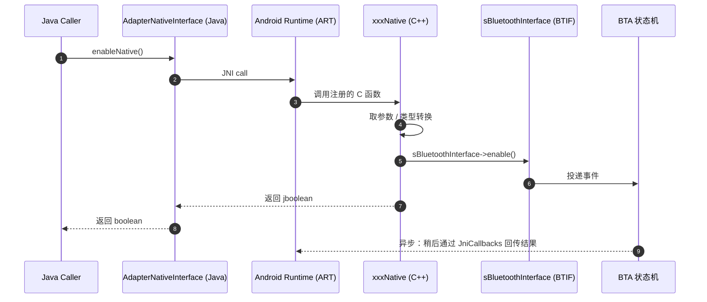

# 04.3 Java → Native 调用栈追踪

> 速通摘要：所有"Java 进入 C++"的调用都遵循同一模板——**Java 端 `xxxNative(...)` → C 端 `xxxNative(JNIEnv*, jobject, ...)` → 类型转换 → `sBluetoothInterface->yyy(...)` → BTIF/BTA/Stack**。本节用三个最具代表性的例子做完整拆解：`enableNative`、`createBondNative`、`startDiscoveryNative`。

---

## 1. 学习目标

读完本节，你应该能：

1. 跟踪任意 `xxxNative` 调用从 Java 一路到 BTIF 的源码路径。
2. 看懂 JNI 端的"类型转换 + 资源释放"通用模板。
3. 识别 JNI 调用中常见的副作用陷阱（异常未清、内存未释、引用泄漏）。
4. 在 `sBluetoothInterface` 跳板上分清同步与异步语义。

---

## 2. 前置知识

- 已读 04.1、04.2。

---

## 3. 通用模板：Java → C → BTIF



要点：
- JNI 函数**同步**调用 BTIF；返回值通常是"指令是否成功投递"。
- 真实业务结果（连上没、绑定成功没）**异步**通过 Native→Java 回调到达。

---

## 4. 例 1：`enableNative()` 全链

### 4.1 Java 端（`AdapterNativeInterface.java:314`）

```java
private native boolean enableNative();
```

被谁调？`AdapterNativeInterface.java:42 init()` / `:59 cleanup()` 等业务包装方法间接调，最终由 `AdapterService.bringUp()` 触发。

### 4.2 C 端（`com_android_bluetooth_btservice_AdapterService.cpp:1107`）

```cpp
static jboolean enableNative(JNIEnv* /* env */, jobject /* obj */) {
  log::verbose("");

  if (!sBluetoothInterface) {            // ① 防御：BTIF 表未加载
    return JNI_FALSE;
  }
  int ret = sBluetoothInterface->enable();   // ② 直接调 BTIF
  if (ret != BT_STATUS_SUCCESS) {
    log::warn("Failed to enable Bluetooth. Status = {}", ret);
  }
  return (ret == BT_STATUS_SUCCESS) ? JNI_TRUE : JNI_FALSE;
}
```

这是最简单的 JNI 函数模板：**无参、无对象引用、单一 BTIF 调用、立即返回**。

### 4.3 BTIF（`system/btif/src/bluetooth.cc`）

```cpp
// 节选：bluetoothInterface 全局对象
bt_interface_t bluetoothInterface = {
    sizeof(bluetoothInterface),
    .init = init,
    .enable = enable,         // ③ 这就是上面 sBluetoothInterface->enable
    .disable = disable,
    .start_discovery = btif_dm_start_discovery,
    .cancel_discovery = btif_dm_cancel_discovery,
    .create_bond = createBond,
    .remove_bond = removeBond,
    // ……
};

static int enable() {
  if (!stack_manager_get_interface()->get_stack_is_running()) {
    stack_manager_get_interface()->start_up_stack_async(...);
  }
  return BT_STATUS_SUCCESS;
}
```

> 真实代码在 `bluetooth.cc` 不同位置，本片段是按职责重构的"思路图"。

`stack_manager_get_interface()->start_up_stack_async(...)` 把"栈启动"事件投递到后台线程，立即返回——Java 端因此能拿到 `true`。真正的 STATE_ON 通过回调通知。

---

## 5. 例 2：`createBondNative(byte[], int, int)` 全链

### 5.1 Java 端（`AdapterNativeInterface.java:330`）

```java
private native boolean createBondNative(byte[] address, int addressType, int transport);
```

调用者：`BondStateMachine.java` 在 `PendingCommandState.processCreateBondCommand(...)` 内调（详 03.3 章）。

### 5.2 C 端（`com_android_bluetooth_btservice_AdapterService.cpp:1154`）

```cpp
static jboolean createBondNative(JNIEnv* env, jobject /* obj */, jbyteArray address,
                                 jint addrType, jint transport) {
  log::verbose("");
  if (!sBluetoothInterface) return JNI_FALSE;

  // ① 把 jbyteArray 转 C 端 byte*
  jbyte* addr = env->GetByteArrayElements(address, NULL);
  if (addr == NULL) {
    jniThrowIOException(env, EINVAL);
    return JNI_FALSE;
  }

  // ② 根据地址类型选择不同的 BTIF 接口
  uint8_t addr_type = (uint8_t)addrType;
  int ret = BT_STATUS_SUCCESS;
  if (addr_type == BLE_ADDR_RANDOM) {
    ret = sBluetoothInterface->create_bond_le(
        reinterpret_cast<RawAddress*>(addr), addr_type);
  } else {
    ret = sBluetoothInterface->create_bond(
        reinterpret_cast<RawAddress*>(addr), transport);
  }

  if (ret != BT_STATUS_SUCCESS) log::warn("Failed to initiate bonding. Status = {}", ret);

  // ③ 释放 byte[] 临时拷贝（最后一个参数 0 = 不写回 Java）
  env->ReleaseByteArrayElements(address, addr, 0);
  return (ret == BT_STATUS_SUCCESS) ? JNI_TRUE : JNI_FALSE;
}
```

**学习点**：
- `GetByteArrayElements` + `ReleaseByteArrayElements` 是"借出/归还"模式，**必须配对**否则泄漏 ART 引用表。
- `reinterpret_cast<RawAddress*>(addr)`：byte[6] 直接当作 `RawAddress` 结构体——蓝牙地址布局两边一致。
- `JNI_ABORT`（最后一个参数 = `0` 等同 `0`，本仓用 `0` 等价"释放且写回但实际未改" ; `JNI_ABORT` = 不写回。对只读，常用 `JNI_ABORT` 性能更好）。

### 5.3 BTIF（`system/btif/src/btif_dm.cc`）

```cpp
// 节选示意
bt_status_t createBond(const RawAddress* bd_addr, int transport) {
  if (transport == BT_TRANSPORT_LE) {
    BTA_DmAddBleKey(...);    // 准备 BLE 配对
  }
  BTA_DmBond(*bd_addr, transport);    // 投递 BTA 事件
  return BT_STATUS_SUCCESS;
}
```

BTIF 同步 return，BTA 内部状态机异步走完后续步骤（详 03.3 章）。

---

## 6. 例 3：`startDiscoveryNative()` 全链

### 6.1 Java 端

```java
// AdapterNativeInterface.java:347
private native boolean startDiscoveryNative();
```

调用者：`AdapterService.startDiscovery()` → 经权限检查后调。

### 6.2 C 端（`:1132`）

```cpp
static jboolean startDiscoveryNative(JNIEnv* /* env */, jobject /* obj */) {
  log::verbose("");
  if (!sBluetoothInterface) return JNI_FALSE;
  int ret = sBluetoothInterface->start_discovery();
  return (ret == BT_STATUS_SUCCESS) ? JNI_TRUE : JNI_FALSE;
}
```

### 6.3 BTIF

`bluetoothInterface.start_discovery` 指向 `btif_dm_start_discovery`（在 `system/btif/src/btif_dm.cc` 或拆分到 `btif_dm_*.cc`）。

```cpp
// 思路图
bt_status_t btif_dm_start_discovery() {
  // 投递 BTA DM 事件，请求做 Inquiry + LE Scan
  BTA_DmSearch(...);
  return BT_STATUS_SUCCESS;
}
```

后续在 BTA/Stack 里启动 Classic Inquiry（HCI 命令 `HCI_Inquiry`）和 LE Scan（`HCI_LE_Set_Scan_Enable`）。详 03.2 章。

---

## 7. 三种典型 JNI 入参形态

| 入参类型 | C 端取法 | 释放 |
|---------|---------|------|
| 基本类型（`int`、`boolean`、`long`） | 直接用 | 不需要 |
| `jbyteArray` / `jintArray` | `GetByteArrayElements` / `GetIntArrayElements` | `ReleaseByteArrayElements(..., 0 或 JNI_ABORT)` |
| `jstring` | `GetStringUTFChars` 或 `GetStringChars` | `ReleaseStringUTFChars` |
| `jobject`（如 `OobData`） | 用 `GetMethodID` + `CallXxxMethod` 取字段 | 局部引用 ART 自动管理；如有需要 `DeleteLocalRef` |
| `jbyteArray[]` / 复杂对象 | 逐层 Get + Call + Release | 注意嵌套引用清理 |

> 真实例子见 `createBondOutOfBandNative`（`:1380`）— 它解 `OobData p192Data, OobData p256Data` 两个对象，是较复杂的入参组合。

---

## 8. 常见副作用陷阱

| 陷阱 | 现象 | 修法 |
|------|------|------|
| `GetByteArrayElements` 后忘 `Release` | 进程长跑后 ART 引用表满，崩溃 | 必须配对释放 |
| 异常未清 | `env->ExceptionCheck()` 不调，下次 JNI call 直接 abort | 在 Java 调用前 `ExceptionDescribe()` + `ExceptionClear()` |
| 局部引用过多 | "local reference table overflow" | `EnsureLocalCapacity` 或显式 `DeleteLocalRef` |
| 长生命周期持 `JNIEnv*` | `JNIEnv` 与线程绑定，跨线程持有非法 | 跨线程用 `JavaVM*` + `AttachCurrentThread` |
| 在非 JVM 线程回调 Java | `CallVoidMethod` 直接崩 | 先 `AttachCurrentThread(&env, nullptr)` 再调 |

---

## 9. 简化代码片段：通用 JNI 函数骨架（按本仓风格）

```cpp
static jboolean xxxNative(JNIEnv* env, jobject /* obj */, jbyteArray address /*, more args */) {
  log::verbose("");

  // ① 防御 BTIF 是否就绪
  if (!sBluetoothInterface) return JNI_FALSE;

  // ② 取参数
  jbyte* addr = env->GetByteArrayElements(address, nullptr);
  if (!addr) {
    jniThrowIOException(env, EINVAL);
    return JNI_FALSE;
  }

  // ③ 调 BTIF
  int ret = sBluetoothInterface->some_function(reinterpret_cast<RawAddress*>(addr));

  // ④ 释放 + 错误处理
  env->ReleaseByteArrayElements(address, addr, 0);
  return (ret == BT_STATUS_SUCCESS) ? JNI_TRUE : JNI_FALSE;
}
```

照这个骨架，蓝牙 JNI 90% 的 Java→Native 函数都能套出来。

---

## 10. 调试方法

| 想看 | 方法 |
|------|------|
| Java 端调用 native 时是否在主线程 | `Thread.currentThread().getName()`，确认是 Binder 线程或工作线程 |
| C 端 native 入参 | `log::verbose("addr={:x}:{:x}:..", addr[0], ...)` |
| BTIF 返回值 | `log::info("BTIF returned {}", ret)` |
| 异步事件什么时候回 | 在 `JniCallbacks.xxxCallback` 加 log，对比上一句 Native 的时间戳 |
| ART 引用泄漏 | `dumpsys meminfo com.android.bluetooth` 看 JNI Refs（健康值通常 < 1000） |

---

## 11. FAQ

**Q1：JNI 函数返回 `JNI_TRUE`，Java 端能拿到 `true` 吗？**
A：能。`jboolean` 是 `uint8_t`，`JNI_TRUE=1` / `JNI_FALSE=0`，Java 端按 `boolean` 解读。

**Q2：能在 JNI 函数里直接调 BTA 接口（绕过 BTIF）吗？**
A：技术上可以（同进程同 SO），但**强烈不建议**。BTIF 是"稳定 ABI 边界"，绕过会破坏分层。

**Q3：JNI 函数可以阻塞吗？**
A：尽量不要。Java 端调用线程通常是 Binder 线程，被阻塞会拖死整个进程。把耗时操作投递到 BTIF 的后台线程，自己立即返回。

**Q4：为什么有的函数 `JNIEnv*` 写 `env`，有的写 `/* env */`？**
A：不需要 `env` 时（无对象/无字符串/无数组操作）就注释掉变量名，避免 `unused` 警告。

**Q5：`reinterpret_cast<RawAddress*>(addr)` 为什么安全？**
A：`RawAddress` 是 `struct { uint8_t address[6]; }`，与 `byte[6]` 内存布局一致。但前提是 Java 端确实传 6 字节——本仓代码上层都做了校验。

---

## 12. 上路任务

### 任务 A：手工跟踪一次 `removeBondNative`
1. 找到 Java 端声明：`AdapterNativeInterface.java:335`。
2. 找到 C 端实现：`com_android_bluetooth_btservice_AdapterService.cpp:1444 removeBondNative`。
3. 读懂 `GetByteArrayElements` + `ReleaseByteArrayElements` 的配对。
4. 找到 `sBluetoothInterface->remove_bond(...)` 这一行。
5. 默想：JNI 同步返回的是"BTIF 接收事件成功"还是"解绑成功"？（答案：前者。）

### 任务 B：找一个"多对象入参"的 JNI 函数
打开 `createBondOutOfBandNative`（`:1380`），观察它怎么解 `OobData p192, OobData p256` 两个 Java 对象（通过 `callByteArrayGetter` 等工具函数）。这是更复杂入参的典型样板。

### 任务 C：研究字符串处理
找一个用 `jstring` 入参的 JNI 函数（如 `initNative` 的 `hciInstanceName` 参数 — `:2199` 签名 `(ZZIZLjava/lang/String;)Z`），看它怎么用 `GetStringUTFChars` 取字符串、`ReleaseStringUTFChars` 释放。

---

## 13. 本节小结（速记卡）

```
Java→Native 模板（5 步）：
  ① 防御 sBluetoothInterface == null
  ② GetXxxArrayElements / GetStringUTFChars 取参数
  ③ sBluetoothInterface->yyy(...) 调 BTIF
  ④ ReleaseXxxArrayElements / ReleaseStringUTFChars 释放
  ⑤ 返回 JNI_TRUE / JNI_FALSE
语义：JNI 同步 / BTIF 同步入队 / 业务异步完成（靠 Native→Java 回调）
副作用陷阱：未释放 / 未清异常 / 局部引用过多 / 跨线程 JNIEnv
```
