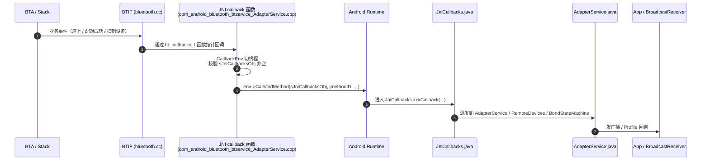

# 04.4 Native → Java 回调（`JniCallbacks` 机制）

> 速通摘要：蓝牙业务**几乎全部异步**——HCI 事件随时来、设备随时被扫到、配对结果随时回。Native 侧通过 `bt_callbacks_t` 函数表把这些事件抛给 JNI；JNI 拿到事件后切到"回调线程"环境，用预先缓存的 `jmethodID` 调 `JniCallbacks` 的 Java 方法，最终由 `AdapterService`/`RemoteDevices`/`BondStateMachine` 等消化。本节拆穿这条"反向通路"。

---

## 1. 学习目标

读完本节，你应该能：

1. 默写 `bt_callbacks_t` 与 `JniCallbacks` 之间的对应关系（"C 表 ↔ Java 类"）。
2. 看懂 `adapter_state_change_callback`、`device_found_callback`、`bond_state_changed_callback` 三个典型回调的实现。
3. 知道 `CallbackEnv` / `ScopedLocalRef` 这两个工具类为何存在。
4. 知道 Native→Java 回调出错的常见症状（`JNI obj is null`、引用爆表、跨线程崩溃）。

---

## 2. 前置知识

- 已读 04.1 / 04.2 / 04.3。
- 知道蓝牙业务是"事件驱动"——发命令立刻返回，结果稍后通过事件回调。

---

## 3. 反向通路总览



四个关键事实：
1. **C → Java 用 `jmethodID` 反射**（不是 vtable），所以方法 ID 必须在 `JNI_OnLoad` 时缓存。
2. **回调可能跑在任意 BTIF 后台线程**——JNIEnv 必须 attach。
3. **`sJniCallbacksObj` 是全局引用**（`NewGlobalRef`），否则跨线程访问会被 GC。
4. **`JniCallbacks` 自己不处理业务**，它只是"派发中枢"，把事件转交给 `AdapterService`、`RemoteDevices`、`BondStateMachine`。

---

## 4. `bt_callbacks_t`：C 端注册表

BTIF 提供一组 C 函数指针表（`bt_callbacks_t`），让上层告诉它"我希望事件回这里"。

JNI 在初始化阶段构造并注册（`com_android_bluetooth_btservice_AdapterService.cpp:878`）：

```cpp
static bt_callbacks_t sBluetoothCallbacks = {
    sizeof(sBluetoothCallbacks),
    adapter_state_change_callback,        // → JniCallbacks.stateChangeCallback
    adapter_properties_callback,          // → JniCallbacks.adapterPropertyChangedCallback
    remote_device_properties_callback,    // → JniCallbacks.devicePropertyChangedCallback
    device_found_callback,                // → JniCallbacks.deviceFoundCallback
    discovery_state_changed_callback,     // → JniCallbacks.discoveryStateChangeCallback
    pin_request_callback,                 // → JniCallbacks.pinRequestCallback
    ssp_request_callback,                 // → JniCallbacks.sspRequestCallback
    bond_state_changed_callback,          // → JniCallbacks.bondStateChangeCallback
    address_consolidate_callback,         // → JniCallbacks.addressConsolidateCallback
    le_address_associate_callback,        // → JniCallbacks.leAddressAssociateCallback
    acl_state_changed_callback,           // → JniCallbacks.aclStateChangeCallback
    // ……
};
```

这张表通过 `initNative` 调用 `bt_interface_t.init(&sBluetoothCallbacks, ...)` 传给 BTIF。BTIF 把表存起来，事件发生时直接跳到对应的 C 函数。

---

## 5. JNI 端典型回调实现：3 个例子

### 5.1 例 1：开关状态回调（`:142-:156`）

```cpp
static void adapter_state_change_callback(bt_state_t status) {
  std::shared_lock<std::shared_timed_mutex> lock(jniObjMutex);  // ① 保护全局引用
  if (!sJniCallbacksObj) {
    log::error("JNI obj is null. Failed to call JNI callback");
    return;
  }

  CallbackEnv sCallbackEnv(__func__);   // ② 自动 attach / detach 当前线程到 JVM
  if (!sCallbackEnv.valid()) return;

  log::verbose("Status is: {}", status);

  // ③ 用缓存好的 jmethodID 调 JniCallbacks.stateChangeCallback(int)
  sCallbackEnv->CallVoidMethod(sJniCallbacksObj,
                               method_stateChangeCallback,
                               (jint)status);
}
```

最短的回调示例。注意三个全局变量：
- `jniObjMutex`（`:125`）— `std::shared_timed_mutex`，保护 `sJniCallbacksObj` 不被 detach 时撞 GC。
- `sJniCallbacksObj`（`:124`）— Java 端 `JniCallbacks` 对象的全局引用。
- `method_stateChangeCallback` — 在 `register_com_android_bluetooth_btservice_AdapterService` 里通过 `GET_JAVA_METHODS` 缓存。

### 5.2 例 2：发现新设备（地址回 Java）

```cpp
static void device_found_callback(int num_properties, bt_property_t* properties) {
  std::shared_lock<std::shared_timed_mutex> lock(jniObjMutex);
  if (!sJniCallbacksObj) return;

  CallbackEnv sCallbackEnv(__func__);
  if (!sCallbackEnv.valid()) return;

  // ① 在 properties 数组中找 BT_PROPERTY_BDADDR
  RawAddress* addr = ...;

  // ② 把 6 字节 RawAddress 转 jbyteArray
  ScopedLocalRef<jbyteArray> addr_array(
      sCallbackEnv.get(),
      sCallbackEnv->NewByteArray(sizeof(RawAddress)));
  sCallbackEnv->SetByteArrayRegion(addr_array.get(), 0, sizeof(RawAddress),
                                   (jbyte*)addr);

  // ③ 调 Java
  sCallbackEnv->CallVoidMethod(sJniCallbacksObj,
                               method_deviceFoundCallback,
                               addr_array.get());
  // ④ ScopedLocalRef 析构时自动 DeleteLocalRef
}
```

**`ScopedLocalRef` 是关键**——它是 RAII 风格的 JNI 局部引用包装，离开作用域自动 `DeleteLocalRef`，防止 "local reference table overflow"。Java 类比：`try-with-resources` + `AutoCloseable`。

### 5.3 例 3：配对状态变化（最常用的回调之一）

```cpp
static void bond_state_changed_callback(bt_status_t status,
                                        RawAddress* bd_addr,
                                        bt_bond_state_t state,
                                        int fail_reason) {
  std::shared_lock<std::shared_timed_mutex> lock(jniObjMutex);
  if (!sJniCallbacksObj) return;

  CallbackEnv sCallbackEnv(__func__);
  if (!sCallbackEnv.valid()) return;

  ScopedLocalRef<jbyteArray> addr_array(
      sCallbackEnv.get(),
      sCallbackEnv->NewByteArray(sizeof(RawAddress)));
  sCallbackEnv->SetByteArrayRegion(addr_array.get(), 0, sizeof(RawAddress),
                                   (jbyte*)bd_addr);

  // 五个 jint 参数：JNI 端把 status、state、fail_reason 都打包给 Java
  sCallbackEnv->CallVoidMethod(sJniCallbacksObj,
                               method_bondStateChangeCallback,
                               (jint)status,
                               addr_array.get(),
                               (jint)state,
                               (jint)fail_reason);
}
```

对应 Java 端 `JniCallbacks.bondStateChangeCallback(int, byte[], int, int)`，签名 `(I[BII)V`（详见 04.2 的注册表）。最终触发 `BondStateMachine.sendMessage(...)`，进入下一个状态迁移。

---

## 6. `CallbackEnv` 这个工具类

回调线程不是 ART 的 Java 线程，调 JNIEnv 之前必须 attach。仓库提供了 `CallbackEnv` 自动包装：

```cpp
// 思路图
class CallbackEnv {
public:
    CallbackEnv(const char* methodName) : mName(methodName) {
        if (vm->GetEnv((void**)&mEnv, JNI_VERSION_1_6) != JNI_OK) {
            vm->AttachCurrentThread(&mEnv, nullptr);
            mAttached = true;
        }
    }
    ~CallbackEnv() {
        if (mAttached) vm->DetachCurrentThread();
    }
    JNIEnv* operator->() { return mEnv; }
    JNIEnv* get() { return mEnv; }
    bool valid() { return mEnv != nullptr; }
private:
    JNIEnv* mEnv = nullptr;
    bool mAttached = false;
    const char* mName;
};
```

**好处**：每个回调函数不用手写 attach/detach，写出来像调 `mEnv->CallVoidMethod(...)`。

**Java 类比**：很像 `synchronized(lock)` 隐式锁/解锁——离开作用域自动收尾。

---

## 7. `JniCallbacks.java`：派发中枢

```java
// android/app/src/com/android/bluetooth/btservice/JniCallbacks.java
public class JniCallbacks {
    private final RemoteDevices mRemoteDevices;
    private final AdapterProperties mAdapterProperties;
    private final AdapterService mAdapterService;
    private final BondStateMachine mBondStateMachine;

    // —— 全部 callback 方法形如：
    void stateChangeCallback(int newState) {
        mAdapterService.stateChangeCallback(newState);
    }
    void adapterPropertyChangedCallback(int[] types, byte[][] values) {
        mAdapterProperties.adapterPropertyChangedCallback(types, values);
    }
    void deviceFoundCallback(byte[] address) {
        mRemoteDevices.deviceFoundCallback(address);
    }
    void bondStateChangeCallback(int status, byte[] address, int newState, int hciReason) {
        mBondStateMachine.bondStateChanged(status, address, newState, hciReason);
    }
    void pinRequestCallback(byte[] address, byte[] name, int cod, boolean min16Digit) {
        mAdapterService.pinRequestCallback(...);
    }
    // ……
}
```

**职责非常单一**：仅做"把 native 事件转发给对应的业务类"。**不做业务判断**——这降低了 JNI 调用的责任范围，便于排错。

---

## 8. C++/Java 概念对照

| C++ 端 | Java 类比 |
|--------|---------|
| `bt_callbacks_t` 函数指针表 | Java 接口（如 `BluetoothGattCallback`） |
| `NewGlobalRef` | 强引用 + 显式 root（避免 GC） |
| `ScopedLocalRef` | `AutoCloseable` + `try-with-resources` |
| `AttachCurrentThread` | Java 线程加入 ThreadGroup，让 ART 能访问 |
| `jmethodID` 缓存 | 提前 `getMethod()` 拿 `Method` 对象避免反射开销 |
| `std::shared_timed_mutex` 共享读锁 | `ReentrantReadWriteLock.readLock()` |

---

## 9. 简化代码片段：通用回调函数骨架

```cpp
static void some_native_event_callback(/* C 端参数 */) {
  // ① 保护全局引用
  std::shared_lock<std::shared_timed_mutex> lock(jniObjMutex);
  if (!sJniCallbacksObj) {
    log::error("JNI obj is null. Failed to call JNI callback");
    return;
  }
  // ② 切线程环境
  CallbackEnv env(__func__);
  if (!env.valid()) return;

  // ③ 准备 Java 端参数（用 ScopedLocalRef 包住）
  ScopedLocalRef<jbyteArray> arr(env.get(), env->NewByteArray(N));
  env->SetByteArrayRegion(arr.get(), 0, N, (jbyte*)buf);

  // ④ 调 Java
  env->CallVoidMethod(sJniCallbacksObj,
                      method_someCallback,
                      arr.get(),
                      (jint)otherArg);

  // ⑤ 离开作用域：ScopedLocalRef 自动释放、CallbackEnv 自动 detach
}
```

90% 的 Native→Java 回调遵循这个骨架。

---

## 10. 调试方法

| 想看 | 方法 |
|------|------|
| 回调有没有进 Java | 在 `JniCallbacks.xxxCallback` 第一行加 `Log.d(TAG, "...")` |
| 回调线程信息 | C 端 `pthread_self()` + Java 端 `Thread.currentThread().getName()` |
| `sJniCallbacksObj` 为何为 null | 说明 Java 端没注册 / `cleanup` 已调；查 `AdapterService.cleanup` 时序 |
| 回调爆 SIGSEGV | 检查 `CallbackEnv` 是否 attach、`jmethodID` 是否在 `JNI_OnLoad` 缓存成功 |
| 引用表溢出 | `dumpsys meminfo com.android.bluetooth` 看 JNI Local Refs；用 `ScopedLocalRef` 修 |

---

## 11. FAQ

**Q1：`sJniCallbacksObj` 与 `sJniAdapterServiceObj` 区别？**
A：前者指 Java 端 `JniCallbacks` 实例（接住业务回调）；后者指 `AdapterNativeInterface` 实例（少数底层场景用到，如 `acquireWakeLock`、`releaseWakeLock` 等系统钩子）。两者都通过 `NewGlobalRef` 持有。

**Q2：能不能把回调直接调到 `AdapterService` 而不是 `JniCallbacks`？**
A：技术上可以，但**强烈不建议**。`JniCallbacks` 让"业务依赖"和"JNI 边界"解耦——你想看哪些 native 事件可达 Java，看 `JniCallbacks` 就一目了然。

**Q3：为什么用 `std::shared_timed_mutex` 而不是 `std::mutex`？**
A：回调读取 `sJniCallbacksObj` 是高频"共享读"，只有 `cleanup` 时是"独占写"。读锁可以并发，提升性能。

**Q4：回调线程是哪个？**
A：通常是 BTIF/BTA 创建的后台线程（`btu_task`、`btif_thread` 等）。回调期间**别阻塞**——一阻塞会拖死整个栈调度。

**Q5：Java 端 `JniCallbacks` 出异常会怎样？**
A：JVM 抛 Java 异常，回到 C++ 层时通过 `env->ExceptionCheck()` 可发现。本仓多数回调函数在调完 `CallVoidMethod` 后**没有显式清异常**——靠下一次 JNI 调用前的隐式检查兜底。但若回调密集，建议手动 `env->ExceptionClear()`。

---

## 12. 上路任务

### 任务 A：定位三个回调的源头到落点
任选三个回调（推荐 `stateChangeCallback`、`deviceFoundCallback`、`bondStateChangeCallback`），找出：
1. C 端实现函数（`adapter_state_change_callback` / `device_found_callback` / `bond_state_changed_callback`）。
2. C 端注册到 `sBluetoothCallbacks`（`com_android_bluetooth_btservice_AdapterService.cpp:878`）。
3. Java 端 `JniCallbacks.xxxCallback` 方法。
4. Java 端最终派发去向（`AdapterService` / `RemoteDevices` / `BondStateMachine`）。

四个落点都能定位 = 你已掌握反向通路。

### 任务 B：在车机上做一次扫描，观察 `deviceFoundCallback` 节奏
```bash
adb shell setprop log.tag.BluetoothJniCallbacks VERBOSE
adb logcat | grep deviceFoundCallback
```
然后在另一台手机上打开蓝牙可发现。你应该能看到一连串的 `deviceFoundCallback` 日志，间隔 ≈ 1-2 秒（取决于 Inquiry 周期）。

### 任务 C：理解 ScopedLocalRef 价值
在 `device_found_callback`（或任意有 `ScopedLocalRef` 的回调）里，把 `ScopedLocalRef<jbyteArray>` 改成裸 `jbyteArray addr_array = env->NewByteArray(...)` 并去掉自动释放，编译跑起来；连续扫描几分钟后看 `dumpsys meminfo` 的 JNI Refs 数量——会看到不断增长。然后改回 `ScopedLocalRef`，数量保持稳定。**亲手做一次这个实验，你会终身记住 RAII 的价值**。

---

## 13. 本节小结（速记卡）

```
反向通路（Native→Java）四要素：
  ① bt_callbacks_t 函数指针表（C 端注册到 BTIF）
  ② JNI 端回调函数（带 CallbackEnv / ScopedLocalRef）
  ③ jmethodID 缓存（JNI_OnLoad 时取）+ sJniCallbacksObj 全局引用
  ④ Java 端 JniCallbacks（仅派发，不做业务）
派发去向：AdapterService / RemoteDevices / AdapterProperties / BondStateMachine
关键工具：
  - CallbackEnv          自动 attach/detach JVM
  - ScopedLocalRef       自动释放局部引用（RAII）
  - jniObjMutex          保护全局引用并发安全
错排首查：sJniCallbacksObj 是否非空 / jmethodID 是否缓存成功
```

至此 04 章 JNI 桥接机制全部完成。下一站：**03 核心流程**——把 JNI 串到端到端业务里。
