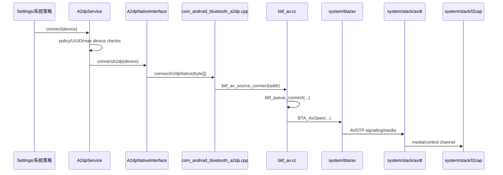

# 05. 蓝牙音乐专题：A2DP 与 AVRCP

## 1. 学习目标

车载蓝牙音乐通常由两类协议一起完成：

- A2DP：负责音频流本身，也就是“声音数据怎么从一端送到另一端”。
- AVRCP：负责媒体控制和状态同步，比如播放/暂停/切歌、曲目信息、播放状态、绝对音量。

读完本章后，你应该能从 Java Service 追到 JNI、BTIF、BTA AV、AVDTP/L2CAP，并能按源码定位“连不上、无声、卡顿、音量不同步、播放状态不同步”等问题。

## 2. 车机场景里的角色

| 场景 | 车机角色 | 手机角色 | 主要源码 |
| --- | --- | --- | --- |
| 手机播歌，车机出声 | A2DP Sink + AVRCP Controller/Target 组合 | A2DP Source | `a2dpsink`、`avrcpcontroller`、`avrcp` |
| 车机把声音推给蓝牙耳机 | A2DP Source | A2DP Sink | `a2dp`、`avrcp` |
| 方向盘按键控制手机音乐 | AVRCP Controller/Target 交互 | 远端播放器 | `avrcpcontroller`、`avrcp` |
| 车机音量和手机媒体音量同步 | AVRCP Absolute Volume | 远端设备 | `AvrcpVolumeManager`、`AvrcpNativeInterface`、Native AVRCP |

当前仓库中：

- `android/app/src/com/android/bluetooth/a2dp`：A2DP Source Service。
- `android/app/src/com/android/bluetooth/a2dpsink`：A2DP Sink Service，车机场景非常重要。
- `android/app/src/com/android/bluetooth/avrcp`：AVRCP Target 侧媒体/音量桥。
- `android/app/src/com/android/bluetooth/avrcpcontroller`：AVRCP Controller 侧浏览、控制、播放器状态。

## 3. A2DP Source 连接链路



Java 入口先做策略判断：

```java
// android/app/src/com/android/bluetooth/a2dp/A2dpService.java
182 public boolean connect(BluetoothDevice device) {
185     if (Flags.validateConnectionPolicyBeforeAcceptingConnection()) {
186         if (!okToConnect(device)) {
187             return false;
188         }
190     if (getConnectionPolicy(device) == CONNECTION_POLICY_FORBIDDEN) {
191         Log.e(TAG, "Cannot connect to " + device + " : CONNECTION_POLICY_FORBIDDEN");
192         return false;
196     if (!Utils.arrayContains(mAdapterService.getRemoteUuids(device), BluetoothUuid.A2DP_SINK)) {
197         Log.e(TAG, "Cannot connect to " + device + " : Remote does not have A2DP Sink UUID");
198         return false;
```

这里有两个车载排查要点：

- 连接策略是 `FORBIDDEN` 时不会进 Native。
- 远端没有 `A2DP_SINK` UUID 时，A2DP Source 不会连接。

Java 到 JNI：

```java
// android/app/src/com/android/bluetooth/a2dp/A2dpNativeInterface.java
89 public boolean connectA2dp(BluetoothDevice device) {
90     return connectA2dpNative(getByteAddress(device));
}
99 public boolean disconnectA2dp(BluetoothDevice device) {
100     return disconnectA2dpNative(getByteAddress(device));
}
```

JNI 到 BTIF：

```cpp
// android/app/jni/com_android_bluetooth_a2dp.cpp
408 static jboolean connectA2dpNative(JNIEnv* env, jobject /* object */, jbyteArray address) {
409   std::shared_lock<std::shared_timed_mutex> lock(interface_mutex);
416   RawAddress bd_addr = RawAddress::FromOctets(reinterpret_cast<const uint8_t*>(addr));
419   bt_status_t status = btif_av_source_connect(bd_addr);
420   if (status != BT_STATUS_SUCCESS) {
421     log::error("Failed A2DP connection, status: {}", bt_status_text(status));
423   env->ReleaseByteArrayElements(address, addr, 0);
424   return (status == BT_STATUS_SUCCESS) ? JNI_TRUE : JNI_FALSE;
}
```

BTIF 入口：

```cpp
// system/btif/src/btif_av.cc
3534 bt_status_t btif_av_source_connect(const RawAddress& peer_address) {
3535   log::info("peer={}", peer_address);
3537   if (!btif_av_source.Enabled()) {
3538     log::warn("BTIF AV Source is not enabled");
3539     return BT_STATUS_NOT_READY;
3542   return btif_queue_connect(UUID_SERVCLASS_AUDIO_SOURCE, peer_address, connect_int);
}
```

进入状态机后会打开 A2DP：

```cpp
// system/btif/src/btif_av.cc
1747 btif_av_query_mandatory_codec_priority(peer_.PeerAddress());
1748 BTA_AvOpen(peer_.PeerAddress(), peer_.BtaHandle(), true, peer_.LocalUuidServiceClass());
1749 peer_.StateMachine().TransitionTo(BtifAvStateMachine::kStateOpening);
```

## 4. Native 连接状态如何回 Java

Native 回来的连接状态先到 JNI 回调，再包装成 `A2dpStackEvent`：

```java
// android/app/src/com/android/bluetooth/a2dp/A2dpNativeCallback.java
50 void onConnectionStateChanged(byte[] address, int state, int reason) {
51     A2dpStackEvent event =
52             new A2dpStackEvent(A2dpStackEvent.EVENT_TYPE_CONNECTION_STATE_CHANGED);
53     event.device = getDevice(address);
54     event.valueInt = state;
55     event.reason = reason;
57     Log.d(TAG, "onConnectionStateChanged: " + event);
58     mA2dpService.messageFromNative(event);
}
```

`A2dpService` 根据设备找到对应状态机：

```java
// android/app/src/com/android/bluetooth/a2dp/A2dpService.java
820 void messageFromNative(A2dpStackEvent stackEvent) {
825     BluetoothDevice device = requireNonNull(stackEvent.device);
826     synchronized (mStateMachines) {
827         A2dpStateMachine sm = mStateMachines.get(device);
829         if (stackEvent.type == A2dpStackEvent.EVENT_TYPE_CONNECTION_STATE_CHANGED) {
831             case STATE_CONNECTED, STATE_CONNECTING -> {
841                 sm = getOrCreateStateMachine(device);
851         sm.sendMessage(A2dpStateMachine.MESSAGE_STACK_EVENT, stackEvent);
```

这说明 UI 状态不更新时，可以分层判断：

1. Native 是否上报连接事件。
2. `A2dpNativeCallback.onConnectionStateChanged()` 是否收到。
3. `A2dpService.messageFromNative()` 是否找到/创建状态机。
4. `A2dpStateMachine` 是否正确处理 `MESSAGE_STACK_EVENT`。

## 5. A2DP 播放开始和音频流

连接成功不等于有声音。真正开始流媒体时，BTIF AV 状态机会触发 start：

```cpp
// system/btif/src/btif_av.cc
2273 BTA_AvStart(peer_.BtaHandle(), peer_.UseLatencyMode());
2274 peer_.SetFlags(BtifAvPeer::kFlagPendingStart);
```

进入 Started 状态后：

```cpp
// system/btif/src/btif_av.cc
2484 void BtifAvStateMachine::StateStarted::OnEnter() {
2485   log::info("state=Started peer={}", peer_.PeerAddress());
2488   peer_.ClearFlags(BtifAvPeer::kFlagRemoteSuspend);
2490   btif_a2dp_sink_set_rx_flush(false);
2492   // Report that we have entered the Streaming stage. Usually, this should
2493   // be followed by focus grant. See set_audio_focus_state()
```

车机无声排查要点：

- A2DP 是否只是 connected，还没进入 streaming/started。
- 是否存在 `RemoteSuspend` 或 `PendingStart` 卡住。
- 是否拿到音频焦点。
- Source/Sink 角色是否搞反。
- codec 是否协商成功，MTU/bitrate 是否异常。

## 6. A2DP Sink：车机播放手机音乐

车机最常见是 A2DP Sink：

```java
// android/app/src/com/android/bluetooth/a2dpsink/A2dpSinkService.java
48 public class A2dpSinkService extends ConnectableProfile {
51     // This is also used as a lock for shared data in {@link A2dpSinkService}
53     private final Map<BluetoothDevice, A2dpSinkStateMachine> mDeviceStateMap =
54             new ConcurrentHashMap<>(1);
59     private final A2dpSinkNativeInterface mNativeInterface;
```

Sink 侧 Native 音频处理会进入 `system/btif/src/btif_a2dp_sink.cc`。读这块时重点看：

- decoder 初始化。
- codec info 更新。
- audio track start/stop。
- flush、focus、active device。

## 7. AVRCP：播放控制、媒体信息、绝对音量

AVRCP 和 A2DP 是互补关系：

- A2DP 管音频流。
- AVRCP 管媒体控制和状态。

Java 层发送媒体更新：

```java
// android/app/src/com/android/bluetooth/avrcp/AvrcpNativeInterface.java
143 void sendMediaUpdate(boolean metadata, boolean playStatus, boolean queue) {
145         "sendMediaUpdate: metadata="
151     sendMediaUpdateNative(metadata, playStatus, queue);
}
```

对应 JNI：

```cpp
// android/app/jni/com_android_bluetooth_avrcp_target.cpp
283 static void sendMediaUpdateNative(JNIEnv* /* env */, jobject /* object */, jboolean metadata,
284                                   jboolean state, jboolean queue) {
286   std::unique_lock<std::shared_timed_mutex> interface_lock(interface_mutex);
287   if (mServiceCallbacks == nullptr) {
288     log::warn("Service not loaded.");
289     return;
292   mServiceCallbacks->SendMediaUpdate(metadata == JNI_TRUE, state == JNI_TRUE, queue == JNI_TRUE);
```

Native AVRCP service 会把更新投递到主线程：

```cpp
// system/btif/avrcp/avrcp_service.cc
540 do_in_main_thread(base::BindOnce(&Device::SendMediaUpdate, device.get()->Get(), track_changed,
541                                  play_state, queue));
```

绝对音量从 Java 到 Native：

```java
// android/app/src/com/android/bluetooth/avrcp/AvrcpNativeInterface.java
197 void sendVolumeChanged(BluetoothDevice device, int volume) {
198     d("sendVolumeChanged: volume=" + volume);
199     String identityAddress = Utils.getBrEdrAddress(device, mAdapterService);
200     sendVolumeChangedNative(identityAddress, volume);
}
203 void setVolume(int volume) {
204     d("setVolume: volume=" + volume);
205     mAvrcpService.setVolume(volume);
```

JNI 中对音量做 7 bit 处理：

```cpp
// android/app/jni/com_android_bluetooth_avrcp_target.cpp
891 static void sendVolumeChangedNative(JNIEnv* env, jobject /* object */, jstring address,
892                                     jint volume) {
893   const char* tmp_addr = env->GetStringUTFChars(address, 0);
894   auto bdaddr = RawAddress::FromString(tmp_addr);
902   std::shared_lock<std::shared_timed_mutex> lock(callbacks_mutex);
903   if (volumeCallbackMap.find(bdaddr.value()) != volumeCallbackMap.end()) {
904     volumeCallbackMap.find(bdaddr.value())->second.Run(volume & 0x7F);
```

远端请求设置音量时，Native 回 Java：

```cpp
// android/app/jni/com_android_bluetooth_avrcp_target.cpp
908 static void setVolume(int8_t volume) {
911   CallbackEnv sCallbackEnv(__func__);
912   if (!sCallbackEnv.valid() || !mJavaInterface) {
913     return;
916   sCallbackEnv->CallVoidMethod(mJavaInterface, method_setVolume, volume);
```

## 8. AVRCP Controller：车机控制手机播放器

车机作为控制端时会关注 `avrcpcontroller`：

```java
// android/app/src/com/android/bluetooth/avrcpcontroller/AvrcpControllerService.java
52 public class AvrcpControllerService extends ConnectableProfile {
55     static final int MAXIMUM_CONNECTED_DEVICES = 5;
61     private static final String COVER_ART_PROVIDER = AvrcpCoverArtProvider.class.getCanonicalName();
63     /* Folder/Media Item scopes.
```

这块后续深入时重点读：

- `AvrcpControllerStateMachine.java`：连接和命令状态机。
- `BluetoothMediaBrowserService.java`：把远端播放器映射成 Android MediaBrowser。
- `AvrcpPlayer.java` / `AvrcpItem.java`：播放器和媒体项模型。

## 9. 车载故障排查路线

| 现象 | 优先源码入口 | 判断点 |
| --- | --- | --- |
| A2DP 连不上 | `A2dpService.connect()`、`connectA2dpNative()`、`btif_av_source_connect()` | 策略、UUID、最大连接数、BTIF AV 是否 enabled |
| 已连接但无声 | `BtifAvStateMachine::StateStarted`、`btif_a2dp_source/sink` | 是否进入 Started、是否 RemoteSuspend、音频焦点、codec |
| 播放/暂停不同步 | `AvrcpNativeInterface.sendMediaUpdate()`、`avrcp_service.cc` | Java 是否发媒体状态，Native 是否发给远端 |
| 绝对音量不同步 | `sendVolumeChangedNative()`、`setVolume()`、`AvrcpVolumeManager` | 音量范围 0-127、地址是否 identity address、回调是否注册 |
| 切歌无响应 | `avrcpcontroller` 状态机、`AvrcpNativeInterface.sendMediaKeyEvent()` | AVRCP 连接是否建立，远端是否支持 passthrough |
| 卡顿 | `btif_a2dp_source.cc`、codec、MTU、audio HAL callback | 编码是否阻塞、bitrate 是否过高、线程是否拥塞 |

## 10. 本章练习

- 用 `rg -n "btif_av_source_connect|BTA_AvOpen|BTA_AvStart"` 复现 A2DP 连接和开始播放链路。
- 在 `A2dpStateMachine.java` 中找出 `MESSAGE_STACK_EVENT` 对连接状态和音频状态的处理。
- 用 `rg -n "sendVolumeChangedNative|setVolume\\(" android/app/src/com/android/bluetooth/avrcp android/app/jni/com_android_bluetooth_avrcp_target.cpp` 追绝对音量双向链路。
- 对照车机需求，判断你的项目更常用 A2DP Source 还是 A2DP Sink，并列出对应源码入口。

### 10.1 参考答案与讨论

练习 1：A2DP 连接和播放开始是两段链路。

推荐执行：

```bash
rg -n "btif_av_source_connect|BTA_AvOpen|BTA_AvStart" android system
```

连接段：

- `A2dpService.connect(device)` 做策略检查。
- `A2dpNativeInterface.connectA2dp(device)` 进入 JNI。
- `com_android_bluetooth_a2dp.cpp:connectA2dpNative(...)` 调 `btif_av_source_connect(...)`。
- `btif_av_source_connect(...)` 进入 BTIF AV，再通过队列和 BTA AV 发起连接。
- BTA AV 继续做 SDP、AVDTP signaling、stream endpoint 协商。

播放段：

- 连接完成只是 A2DP Profile connected。
- 真正有声音还要进入 started 状态，例如 AVDTP Start、audio feeding、codec 配置、audio HAL 数据流。
- 所以 `BTA_AvOpen` 更偏连接，`BTA_AvStart` 更偏媒体启动。

讨论要点：现场问题要先区分“连不上”和“已连但无声”。前者看 open/connect，后者看 start、active device、codec、audio route。

练习 2：`MESSAGE_STACK_EVENT` 是 Native 事件回 Java 后进入状态机的关键消息。

推荐执行：

```bash
rg -n "MESSAGE_STACK_EVENT|EVENT_TYPE_CONNECTION_STATE_CHANGED|EVENT_TYPE_AUDIO_STATE_CHANGED" android/app/src/com/android/bluetooth/a2dp/A2dpStateMachine.java
```

预期观察：

- 连接状态事件会驱动 disconnected、connecting、connected、disconnecting 状态变化。
- 音频状态事件会驱动 playing/not playing 等音频状态广播。
- 状态机处理后通常会调用 service 更新 active device、广播 intent、更新 codec 信息。

讨论要点：如果 Native callback 已经上来但 UI 状态没变，重点看状态机当前状态是否接受该事件，以及是否被忽略、延迟或判定为非法状态迁移。

练习 3：绝对音量是 AVRCP 双向链路，不只是本地音量条。

推荐执行：

```bash
rg -n "sendVolumeChangedNative|setVolume\\(" android/app/src/com/android/bluetooth/avrcp android/app/jni/com_android_bluetooth_avrcp_target.cpp
```

预期路线：

- 本地音量变化时，Java AVRCP service 通过 native 通知远端。
- 远端音量命令回来时，Native callback 进入 Java，再更新本地音量管理。
- AVRCP 绝对音量常用范围是 0-127，系统音量需要做映射。

讨论要点：音量不同步要看三件事：远端是否支持绝对音量、地址是否匹配当前 active device、音量映射是否正确。

练习 4：车机更常见的是 A2DP Sink，但源码中 Source/Sink 都要看项目角色。

判断方式：

- 如果车机播放手机音乐，车机是 A2DP Sink，手机是 Source。入口偏 `android/app/src/com/android/bluetooth/a2dpsink` 和 `system/btif/src/btif_a2dp_sink.cc`。
- 如果车机把音频发给蓝牙耳机/音箱，车机是 A2DP Source。入口偏 `android/app/src/com/android/bluetooth/a2dp`、`com_android_bluetooth_a2dp.cpp`、`btif_av_source_connect(...)`、`btif_a2dp_source.cc`。

讨论要点：车载项目通常“手机音乐进车机”是主场景，但也可能支持后排耳机、蓝牙音箱等 Source 场景。排查前先确认车机角色，避免看错目录。
