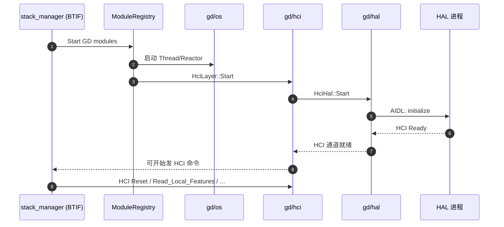

# 05.4 GD 模块化栈与 shim 层

> 速通摘要：GD（Gabeldorsche）是 Google 从 Android 11 起重写的"下一代蓝牙栈"，目标是模块化 + 可测试 + 跨平台（Linux Floss 也用它）。Android 16 状态：**HCI / HAL / Metrics / Storage / Packet / OS 抽象**已落到 GD；**L2CAP / RFCOMM / GATT** 等高层协议仍在传统 Stack。两者用 `system/main/shim/` 互通。

源码：`system/gd/`、`system/main/shim/`

---

## 1. 学习目标

读完本节，你应该能：

1. 列出 GD 各子模块及对应职责。
2. 知道为什么有 shim 层 + shim 怎么"两边翻译"。
3. 在 logcat 中识别 GD 模块的日志特征。
4. 排查"GD 模块启动失败导致蓝牙不可用"。

---

## 2. 前置知识

- 已读 05.3 Stack 导读。

---

## 3. GD 子模块全清单

```
system/gd/
├── hal/        HAL 适配（与 HAL 进程 AIDL 对接）
├── hci/        新 HCI 层（Packet / Command Queue / Event 分发）
├── os/         OS 抽象（Thread / Timer / File / Reactor / Queue）
├── packet/     Packet 解析框架（PDL 生成代码）
├── storage/    持久化（替代 bt_config.conf 的新方案）
├── metrics/    指标上报
├── proto/      protobuf 定义
├── sysprops/   sysprop 接入
├── crypto_toolbox/  加密工具
├── common/     公共类型
└── lpp/        Low Power Profile
```

新模块用 C++17/20，部分用 Rust（参考 `system/rust/` 或 `system/gd/.../rust/`）。

---

## 4. 为什么有 GD

历史背景：传统 Stack 用了十多年的 C 风格 + 全局变量 + 平台相关代码。痛点：
- 难单元测试。
- 平台耦合（Android 特定）。
- 多线程模型混乱。

GD 设计目标：
- **模块化**：每个模块（`Module`）有清晰的接口、依赖、生命周期。
- **可测试**：依赖注入，每个模块可单独 mock。
- **跨平台**：抽离 OS 依赖（`gd/os/`），同一份代码可在 Android / Linux / Fuchsia 跑。
- **类型安全**：用 PDL 生成 Packet 解析，避免手写 byte buffer。

---

## 5. Module 框架

```cpp
// system/gd/module.h（思路图）
class Module {
public:
    virtual void Start() = 0;
    virtual void Stop() = 0;
    virtual std::string ToString() const = 0;
    virtual ModuleFactory* GetModuleFactory() const = 0;
protected:
    virtual void ListDependencies(ModuleList* list) const = 0;
};

// 各模块：
class HciLayer : public Module { ... };
class StorageModule : public Module { ... };
class MetricsManager : public Module { ... };
```

启动顺序由 `ModuleRegistry` 根据 `ListDependencies` 拓扑排序自动决定。

---

## 6. HAL 子模块

`system/gd/hal/` 是与 HAL 进程对接的关键：
- HAL 进程：`android.hardware.bluetooth-service.*`（外部依赖）。
- 通信：AIDL（`hardware/interfaces/bluetooth/aidl/`，AOSP 其他仓）。
- GD 端：`HciHal` / `HalAidlImpl`。

数据流：
```
GD HciLayer → HCI Command → HCI Packet (PDL) → HciHal → AIDL → HAL 进程 → UART/USB → 芯片
```

---

## 7. shim：传统 Stack ↔ GD 的"翻译官"

`system/main/shim/` 让两边互调：
- 传统 Stack 想发 HCI 命令 → 走 shim → GD `HciLayer`。
- GD 想用 L2CAP（暂未迁过来）→ 走 shim → 旧 `l2cap/`。

关键文件：
- `system/main/shim/acl.cc`、`acl_api.cc`、`acl_interface.cc`：ACL 互通。
- `system/main/shim/hci_layer.cc`：HCI 适配层。
- `system/main/shim/entry.cc`、`entry.h`：模块入口注册。
- `system/main/shim/btm_api.cc`：BTM API shim。
- `system/main/shim/distance_measurement_manager.cc`：测距。
- `system/main/shim/dumpsys.cc`：dumpsys 适配。

---

## 8. GD 启动序列（在栈启动中）



---

## 9. logcat 识别 GD 模块

GD log 走 `log::info / log::error` 默认 tag = `"bluetooth"`，但每条日志会带模块名前缀，如：
```
bluetooth: GD: hci_layer: Sending command opcode=0x0c03
bluetooth: GD: storage: Loading bt_config.conf
bluetooth: GD: hal: HAL initialized
```

调试用 `setprop log.tag.bluetooth VERBOSE`。

---

## 10. 关键源码点

| 文件 | 角色 |
|------|------|
| `system/gd/module.h` | Module 抽象 |
| `system/gd/module_registry.h` / `.cc` | 注册中心 |
| `system/gd/hci/hci_layer.cc` | 新 HCI 层 |
| `system/gd/hci/controller.cc` | 控制器能力 |
| `system/gd/hci/le_scanning_manager.cc` | LE 扫描（部分） |
| `system/gd/hal/hci_hal_android.cc` | HAL 适配 |
| `system/gd/os/handler.cc` | 事件循环 |
| `system/gd/packet/` + `system/pdl/` | Packet 生成 |
| `system/gd/storage/storage_module.cc` | 持久化 |
| `system/gd/sysprops/sysprops_module.cc` | sysprop 接入 |
| `system/main/shim/acl.cc` | ACL shim |
| `system/main/shim/hci_layer.cc` | HCI shim |
| `system/main/shim/entry.cc` | shim 模块注册 |

---

## 11. PDL（Packet Definition Language）

GD 用一种自研 DSL 描述 Packet 字段，编译期生成 C++ Packet 解析器。例如 HCI Command：

```pdl
// 示意
packet HciCommandPacket {
  opcode : 16,
  parameter_total_length : 8,
  payload : 8[parameter_total_length]
}
```

PDL 编译器生成：
```cpp
class HciCommandPacket {
public:
    static std::unique_ptr<HciCommandPacket> Create(uint16_t opcode, ...);
    uint16_t GetOpcode() const;
    // ……
};
```

文件位置：`system/pdl/`（PDL 文件），`system/gd/packet/`（运行时框架）。

---

## 12. 调试方法

| 想看 | 方法 |
|------|------|
| GD 启动顺序 | logcat 找 "Module starting" / "Module started" |
| HCI 命令时序 | btsnoop_hci.log + GD `hci_layer` log |
| HAL 通信 | logcat HAL 进程的 `BluetoothHal` tag |
| Module 依赖 | dumpsys 内 `Modules` 段 |

---

## 13. FAQ

**Q1：为什么车机 logcat 偶尔出现 "Module timeout" / "Module init failed"？**
A：典型 GD 启动失败 —— HAL 没起来 / 依赖模块未就绪 / 配置错。看 logcat 上一行的具体模块名。

**Q2：能否完全跳过 GD？**
A：不能。Android 16 GD 已承担 HCI 与 HAL 通信，没了它栈无法工作。

**Q3：GD 与 Floss 区别？**
A：Floss = Linux 上跑的 Fluoride/GD 子集，主要给 ChromeOS 等。本仓主要面向 Android 但代码大幅与 Floss 共享。

**Q4：能否在 GD 里直接用 Rust？**
A：部分模块已 Rust 化（`system/rust/` 与 GD 内的 rust 子目录）。新代码鼓励 Rust。

**Q5：shim 会一直存在吗？**
A：直到 L2CAP/RFCOMM/GATT 全部迁到 GD 之前都需要。Google 路线图是逐步迁完。

---

## 14. 上路任务

### 任务 A：找 Module 列表
```bash
grep -rn "class .* : public Module" system/gd/ | head -10
```
统计有多少个 Module 类。

### 任务 B：理解 shim 翻译
打开 `system/main/shim/acl.cc`，看一个 ACL 操作从旧 Stack 走到 GD 的路径。

### 任务 C：读 PDL 一例
找 `system/pdl/` 下任一 `.pdl` 文件，看它定义的 packet 结构。然后用编辑器查找生成出来的 C++ 类。

---

## 15. 本节小结（速记卡）

```
GD = Gabeldorsche，新一代模块化蓝牙栈
位置：system/gd/
已迁移：HCI / HAL / Metrics / Storage / Packet / OS / sysprops
仍在传统 Stack：L2CAP / RFCOMM / GATT / SDP / SMP / AVDT / AVCTP
桥梁：system/main/shim/
Module 模型：ListDependencies → ModuleRegistry 拓扑启动
HAL 通信：GD/hal → AIDL → HAL 进程
PDL：Packet 定义语言，生成 C++ 解析代码
日志特征：GD: <module>: <msg>
```
