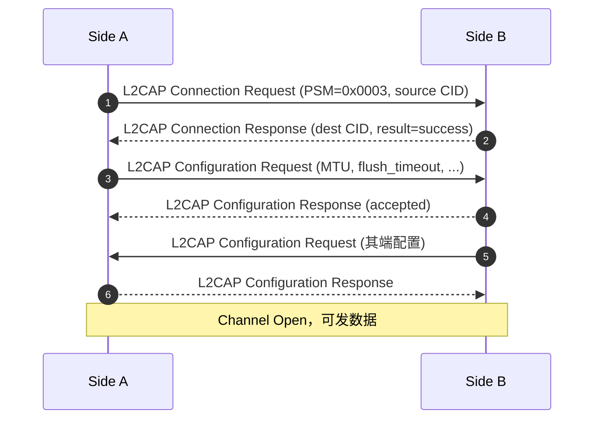
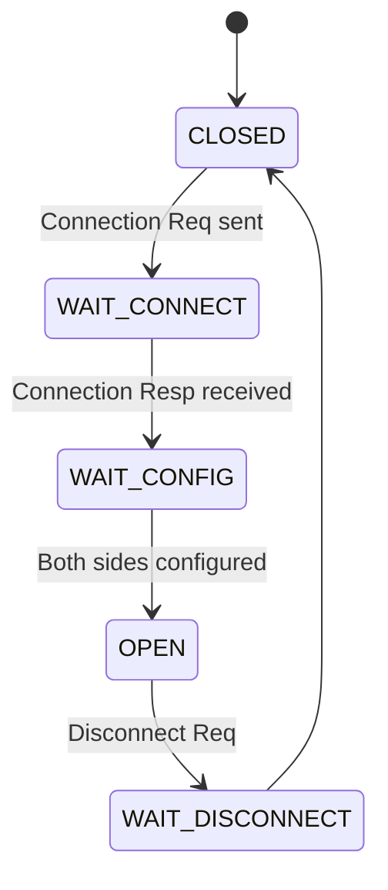

# 05.6 L2CAP：通道与多路复用

> 速通摘要：L2CAP（Logical Link Control and Adaptation Protocol）= **蓝牙的逻辑通道层**。它在 ACL 链路上**多路复用**多个上层协议（SDP / RFCOMM / AVDT / ATT 等），并提供 **MTU 协商、流控、错误检测**。每个上层协议占用一个 **CID（Channel Identifier）**，固定 CID 给标准协议（如 SDP=0x0040、ATT=0x0004），动态 CID 给应用层 PSM。

源码：`system/stack/l2cap/`、关键文件 `l2c_main.cc`、`l2c_csm.cc`（通道状态机）、`l2c_link.cc`（链路）。

---

## 1. 学习目标

读完本节，你应该能：

1. 说出 L2CAP 在 ACL 之上做的 3 件事。
2. 区分固定 CID 与动态 CID，列出常见固定 CID。
3. 看懂 L2CAP 通道建立 4 步（Connect Req/Resp/Config Req/Config Resp）。
4. 知道 L2CAP CoC（Connection-oriented Channel）在 BLE 大数据传输中的作用。

---

## 2. 前置知识

- 已读 00.3（术语 L2CAP）。
- 知道蓝牙物理上是"一对 ACL/SCO 链路"。

---

## 3. L2CAP 在协议栈中的位置

```
应用层 / Profile (SDP / RFCOMM / ATT / AVDT / ...)
        ↓
L2CAP（多路复用 / MTU / 流控）
        ↓
ACL Data Channel (HCI ACL)
        ↓
Controller / Radio
```

---

## 4. CID（Channel ID）

每条 L2CAP 链路上有多个 CID。**Classic 与 BLE 各自一套 CID 空间**。

### Classic 固定 CID
| CID | 用途 |
|-----|------|
| `0x0001` | Signaling Channel（L2CAP 自己的控制） |
| `0x0002` | Connectionless（broadcast） |
| `0x0003` | AMP Manager（已淘汰） |
| `0x0040+` | Dynamic（应用层 PSM 分配） |

### BLE 固定 CID
| CID | 用途 |
|-----|------|
| `0x0004` | ATT（GATT 底层） |
| `0x0005` | LE Signaling |
| `0x0006` | SMP（配对） |
| `0x0040+` | LE Dynamic（L2CAP CoC） |

---

## 5. PSM（Protocol/Service Multiplexer）

PSM 是"应用层对外标识"，类似 TCP 端口。常见：

| PSM (Classic) | 协议 |
|---------------|------|
| `0x0001` | SDP |
| `0x0003` | RFCOMM |
| `0x0017` | AVCTP（AVRCP 控制） |
| `0x0019` | AVDTP（A2DP） |
| `0x001B` | AVRCP Browse |

| PSM (BLE) | 协议 |
|-----------|------|
| `0x0080+` | 应用层自定义 LE CoC |

---

## 6. L2CAP 通道建立 4 步（Classic）



通道关闭：发 `Disconnection Request`，对方 `Disconnection Response`。

---

## 7. L2CAP 通道状态机



源码：`system/stack/l2cap/l2c_csm.cc`（Channel State Machine）。

---

## 8. L2CAP CoC（BLE 数据流）

BLE 4.0 时代仅 ATT/SMP/Signaling 用 L2CAP。BLE 4.1 引入 **Connection-oriented Channel (CoC)**：
- 动态 PSM。
- 流控（credit-based 或基于窗口）。
- 高吞吐（适合 OTA、文件传输）。

Android API：`BluetoothDevice.createL2capChannel(int psm)` 与 `BluetoothAdapter.listenUsingL2capChannel()`。

---

## 9. 关键源码点

| 文件 | 角色 |
|------|------|
| `system/stack/l2cap/l2c_main.cc` | 主入口、数据进出 |
| `system/stack/l2cap/l2c_csm.cc` | 通道状态机 |
| `system/stack/l2cap/l2c_link.cc` | 链路管理 |
| `system/stack/l2cap/l2c_api.cc` | 对外 API（`L2CA_*`） |
| `system/stack/l2cap/l2c_utils.cc` | 工具 |
| `system/stack/l2cap/l2c_ble.cc` | BLE L2CAP |
| `system/stack/include/l2c_api.h` | 公共头 |

---

## 10. 常用 L2CAP API

```cpp
uint16_t L2CA_Register(uint16_t psm, tL2CAP_APPL_INFO* p_cb_info, ...);
uint16_t L2CA_ConnectReq(uint16_t psm, const RawAddress& bd_addr);
bool     L2CA_ConfigReq(uint16_t cid, tL2CAP_CFG_INFO* p_cfg);
bool     L2CA_DisconnectReq(uint16_t cid);
uint8_t  L2CA_DataWrite(uint16_t cid, BT_HDR* p_data);

// BLE CoC：
uint16_t L2CA_ConnectLECocReq(uint16_t psm, const RawAddress& bd_addr, ...);
```

每个 Profile 在初始化时 `L2CA_Register` 自己的 PSM，注册回调；收到对端 Connection Request 后 L2CAP 转给注册者。

---

## 11. 简化代码片段：RFCOMM 注册 L2CAP

```cpp
// system/stack/rfcomm/rfc_l2cap_if.cc（思路图）
void rfcomm_l2cap_if_init() {
    tL2CAP_APPL_INFO rfc_cb = {
        .pL2CA_ConnectInd_Cb       = rfc_on_l2cap_connect_ind,
        .pL2CA_ConnectCfm_Cb       = rfc_on_l2cap_connect_cfm,
        .pL2CA_ConfigInd_Cb        = ...,
        .pL2CA_ConfigCfm_Cb        = ...,
        .pL2CA_DisconnectInd_Cb    = ...,
        .pL2CA_DataInd_Cb          = rfc_on_l2cap_data_ind,
        // ...
    };
    L2CA_Register(BT_PSM_RFCOMM, &rfc_cb, false, /*ertm*/);
}
```

之后 L2CAP 收到 PSM=0x0003 的 Connection Request 自动调 `rfc_on_l2cap_connect_ind`。

---

## 12. 调试方法

| 想看 | 方法 |
|------|------|
| 当前通道列表 | `dumpsys bluetooth_manager` → `L2CAP Channels` |
| 通道建立时序 | btsnoop 过滤 `btl2cap` |
| MTU 协商 | btsnoop 看 `Configuration Request/Response` |
| L2CAP log | `logcat -s bt_l2cap` |
| 错误统计 | dumpsys → `L2CAP stats` |

---

## 13. FAQ

**Q1：MTU 越大越好吗？**
A：上层数据每包能塞更多，减少分包；但单包 RF 占用时间长、丢包代价大。常见取 672 / 1004 / 1691。

**Q2：通道建立失败可能原因？**
A：① PSM 无人注册（对端没起 SDP/RFCOMM 等） ② 安全策略阻止（未配对而对端要求加密） ③ 通道数耗尽。

**Q3：BLE 上 L2CAP CoC 与 ATT 区别？**
A：ATT 适合"属性级"小数据；CoC 适合"流式"大数据（OTA、文件）。一个连接里两者可并存。

**Q4：能否在 App 层直接用 L2CAP？**
A：Classic 通过 `BluetoothDevice.createL2capChannel(int psm)`（要求 SystemApi）；BLE CoC 通过类似 API。多数 App 用 RFCOMM 或 GATT 更方便。

**Q5：L2CAP 流控有几种模式？**
A：Basic、Retransmission、Streaming、Enhanced Retransmission Mode、Streaming Mode、LE Credit-based。详 `l2c_*.cc`。

---

## 14. 上路任务

### 任务 A：列出当前所有 L2CAP 通道
做一次正常连接（A2DP + HFP + GATT），dumpsys 看通道列表，识别每个 CID 属于哪个上层。

### 任务 B：抓 L2CAP 通道建立
BTSnoop 过滤 `btl2cap.cmd`，找 Connection Req/Resp/Config Req/Config Resp 序列。

### 任务 C：找 L2CAP 注册者
```bash
grep -rn "L2CA_Register" system/stack/ system/bta/ system/btif/ | head -20
```
看哪些 Profile 注册了 PSM。

---

## 15. 本节小结（速记卡）

```
L2CAP = 蓝牙逻辑通道 + 多路复用
ACL 之上多通道：每个通道一个 CID
固定 CID（Classic）：0x0001 Signaling / 0x0040+ Dynamic
固定 CID（BLE）：0x0004 ATT / 0x0005 LE Signaling / 0x0006 SMP
PSM 常见：SDP=0x0001 / RFCOMM=0x0003 / AVCTP=0x0017 / AVDTP=0x0019
建立 4 步：Connect Req / Resp / Config Req / Config Resp
关键 API：L2CA_Register / L2CA_ConnectReq / L2CA_DataWrite / L2CA_DisconnectReq
关键源码：l2c_main.cc / l2c_csm.cc / l2c_link.cc / l2c_ble.cc / l2c_api.cc
BLE CoC：BluetoothDevice.createL2capChannel
```
